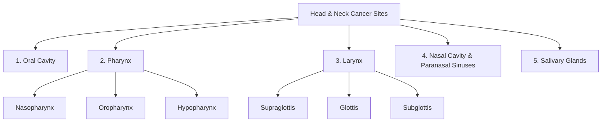

# Head and Neck Cancer

## 1. Definition

Head and neck (H&N) cancer refers to a heterogeneous group of malignancies arising from the mucosal surfaces of the **upper aerodigestive tract (UADT)**. The term "head and neck" is a shorthand — break it down and it encompasses everything from the lips to the larynx, but *excludes* brain, eye, thyroid (usually discussed separately), and skin cancers (though skin SCC of the face can overlap).

- ***Most H&N cancers begin in the mucosal surfaces of the upper aerodigestive tract and are predominantly squamous cell carcinoma (SCC)*** [1][2]
- ***90% of head and neck malignancies are squamous cell carcinoma (SCC)*** *(not including nasopharynx and thyroid)* [3]
- ***They arise from 5 anatomical areas: oral cavity, pharynx (nasopharynx, oropharynx, hypopharynx), larynx, nasal cavity & paranasal sinuses, and salivary glands*** [2]

The word "squamous" comes from Latin *squama* = scale — these are cancers of the flat, scale-like epithelial cells that line these mucosal surfaces. When you hear "HNSCC" = Head and Neck Squamous Cell Carcinoma, that is the dominant entity.

<Callout title="Airway First — Always">
***ALWAYS protect the airway for all H&N cancer*** [2]. This is the cardinal rule. H&N tumours can obstruct the airway acutely (tumour bulk, bleeding, post-operative oedema). Before you think about staging or treatment, secure the airway.
</Callout>

---

## 2. Epidemiology

### 2.1 Global Epidemiology

- **Incidence**: H&N cancers (excluding nasopharynx) represent approximately 4–5% of all cancers globally, with an estimated 900,000+ new cases annually worldwide [4].
- ***Male preponderance*** — reflects the higher prevalence of smoking and alcohol use in males historically [2].
- ***Predominantly a disease of the elderly (age > 60)*** [2] — cumulative carcinogen exposure over decades.
- **Exception — HPV-related oropharyngeal cancer**: This is rising in younger populations (40s–50s), particularly in Western countries. These patients tend to be younger, non-smoking males with a history of oral sexual contact [2].

### 2.2 Hong Kong-Specific Epidemiology

| Cancer Type | HK Relevance |
|:--|:--|
| **Nasopharyngeal carcinoma (NPC)** | ***Endemic in Southern China including Hong Kong*** [2]. 10th most common cancer overall; **6th in males**. Incidence ~6–10/100,000 in HK (vs < 1/100,000 in Western countries). |
| **Oral cavity SCC** | Associated with smoking, alcohol, betel nut chewing (less common in HK than Southeast Asia but still relevant). |
| **Oropharyngeal SCC** | HPV-driven oropharyngeal cancer is increasing in HK, though still less common than in Western populations. |
| **Laryngeal SCC** | Strongly linked to smoking and alcohol; male predominance. |

<Callout title="High Yield: NPC in Hong Kong" type="idea">
NPC is the signature H&N cancer of Hong Kong. If you see a Southern Chinese patient with unilateral serous otitis media, epistaxis, or a neck lump — think NPC until proven otherwise.
</Callout>

### 2.3 Trends

- HPV-positive oropharyngeal cancer is **increasing** in incidence globally (especially in developed nations) while smoking-related H&N cancers are **declining** in many Western countries.
- NPC incidence in HK has been gradually declining over the past two decades, possibly related to changes in dietary habits (less salted fish consumption) and EBV screening programmes.

---

## 3. Anatomy and Function

Understanding H&N cancer requires knowing the anatomy cold. The UADT is divided into **5 basic anatomical areas**, and each area has distinct clinical behaviour, lymphatic drainage, and treatment implications.

### 3.1 The Five Anatomical Regions

### 3.2 Oral Cavity

**Boundaries**: From the vermilion border of the lips anteriorly to the junction of the hard and soft palate superiorly and the circumvallate papillae of the tongue inferiorly.

**Subsites**:
- Lips (upper, lower, commissure)
- Anterior two-thirds of tongue (oral tongue)
- Floor of mouth
- Buccal mucosa
- Hard palate
- Alveolar ridges (upper and lower gingiva)
- Retromolar trigone (the area behind the last molar tooth)

**Lymphatic drainage**: Primarily to **Level I** (submental and submandibular nodes), then Level II and III. The **tongue** has notoriously rich lymphatic drainage and can skip-metastasize to Level III–IV.

**Key functions**: Mastication, articulation of speech, taste (anterior 2/3 tongue via CN VII chorda tympani), initiation of swallowing.

### 3.3 Pharynx

The pharynx is a muscular tube divided into three subsections from superior to inferior:

#### 3.3.1 Nasopharynx

- **Boundaries**: From the skull base superiorly to the level of the soft palate inferiorly.
- **Key landmark**: ***Pharyngeal recess (Fossa of Rosenmüller)*** — the most common site of origin for NPC [2]. This is a mucosal recess lateral to the torus tubarius. It is "clinically occult" — meaning tumours here can grow silently for a long time.
- **Relations**: The nasopharynx is immediately inferior to the skull base; tumours can erode superiorly into the **cavernous sinus** (containing CN III, IV, V1, V2, VI and the internal carotid artery) and the **middle cranial fossa** [2].
- **Eustachian tube orifice** opens here — this is why NPC causes unilateral serous otitis media.

#### 3.3.2 Oropharynx

- **Boundaries**: ***Extends vertically from the soft palate to the superior surface of the hyoid bone (floor of vallecula)*** [2]. Laterally bounded by the pharyngeal constrictor muscles and medial aspect of the mandible.
- ***Components: Tonsillar region, base of tongue, soft palate, posterolateral pharyngeal wall*** [2].
- **Lymphatic drainage**: Primarily to **Level II** (***most common***), then III, IV, V, parapharyngeal and retropharyngeal nodes [2]. **Bilateral metastasis common** from midline structures (tongue base, soft palate).
- This is the primary site for **HPV-associated H&N cancer** [2].

#### 3.3.3 Hypopharynx

- **Boundaries**: From the level of the hyoid bone superiorly to the lower border of the cricoid cartilage inferiorly (where it becomes the oesophagus).
- **Subsites**: Pyriform sinus (most common subsite), postcricoid area, posterior pharyngeal wall.
- Tumours here tend to present **late** with advanced disease — the hypopharynx is capacious and tumours can grow large before causing symptoms.
- ***Associated with Paterson-Brown-Kelly syndrome*** (Plummer-Vinson syndrome) — triad of iron deficiency anaemia, dysphagia, and postcricoid web [3][2].
- ***Loss of laryngeal crepitus*** on examination is a sign of hypopharyngeal/postcricoid tumour (tumour fixes the larynx to the prevertebral fascia, abolishing the normal side-to-side glide of the larynx over the cervical spine) [3].

figure]:m-0">
  <DiagramCard src="/diagrams/pharynx.jpg" alt="Anatomy of the pharynx including nasopharynx, oropharynx, and hypopharynx" caption="Pharynx anatomy [7]" />
  <DiagramCard src="/diagrams/pharyngeal-recess.webp" alt="Pharyngeal recess (fossa of Rosenmuller) anatomy in the nasopharynx" caption="Pharyngeal recess [8]" />
  <DiagramCard src="/diagrams/cavernous-sinus.webp" alt="Cavernous sinus anatomy and related cranial nerve structures near the nasopharynx" caption="Cavernous sinus anatomy [9]" />

### 3.4 Larynx

**"Larynx"** — from Greek *larynx* = throat/voice box.

**Boundaries**: Extends from the epiglottis superiorly to the cricoid cartilage inferiorly [2].

***Three anatomical regions***:

| Region | Boundaries | Clinical Features |
|:--|:--|:--|
| **Supraglottis** | Epiglottis (tip to ventricular folds/false cords) | ***Presents as advanced disease due to paucity of symptoms; rich lymphatics → higher incidence of LN metastasis (30–50%)*** [2] |
| **Glottis** | True vocal cords + anterior and posterior commissures | ***Most common form of laryngeal cancer; presents early with hoarseness; limited lymphatics → low rate of nodal spread*** [2] |
| **Subglottis** | From 1 cm below free edge of vocal cord to inferior border of cricoid | ***Presents as advanced disease; propensity for local extension; higher recurrence rates; poorer survival*** [2] |

figure]:m-0">
  <DiagramCard src="/diagrams/larynx-anatomy.jpg" alt="Larynx anatomy showing supraglottic, glottic, and subglottic regions" caption="Larynx anatomy [10]" />
  <DiagramCard src="/diagrams/coronal-laynx.png" alt="Coronal section of the larynx showing internal compartments and landmarks" caption="Coronal larynx" />

***Functions of the larynx*** [2]:

1. **Phonation** — production of a primary vocal tone at the level of the vocal folds. The sound resonates in the pharynx and nose (adding harmonics and timbre), then is articulated by fine motor control of the tongue, palate, and lips.
   - *Patients with cleft palate may have normal vocal fold function but a hypernasal voice due to palatal defect and poor velopharyngeal closure resulting in excess air escape through the nose* [2].
   - *Patients with nasal congestion have a hyponasal voice due to inadequate air escape through the nose* [2].
2. ***Maintain airway patency and protection during swallowing*** — Normal swallow mechanism includes laryngeal elevation, posterior deflection of the epiglottis, inhibition of respiration, and closure of the vocal folds to prevent aspiration [2].
3. ***Valsalva manoeuvre*** — Generation of increased pressure against a closed glottis. Enables coughing, throat clearing, straining, and defecation [2].

**Lymphatic drainage** [2]:
- **Supraglottic**: Pierces the thyrohyoid membrane with the superior laryngeal artery, vein, and nerve → drains to subdigastric and superior jugular nodes.
- **Glottic and subglottic**: Exits via cricothyroid ligament → prelaryngeal node (**Delphian node**), paratracheal nodes, and deep cervical nodes along the inferior thyroid artery.

<DiagramCard src="/diagrams/larynx-lymphatics.jpg" alt="Lymphatic drainage pathways of the larynx" caption="Laryngeal lymphatic drainage" />

### 3.5 Nasal Cavity and Paranasal Sinuses

- **Sinuses**: Maxillary, ethmoid, frontal, sphenoid.
- The **maxillary sinus** is the most common site for paranasal sinus malignancy.
- These cancers are rare but tend to present late because the sinus cavity allows silent tumour growth.
- Histology is more varied: SCC, adenocarcinoma (especially in woodworkers), adenoid cystic carcinoma, esthesioneuroblastoma (olfactory neuroblastoma), sinonasal undifferentiated carcinoma (SNUC).

### 3.6 Salivary Glands

- **Major**: Parotid (80% of salivary tumours), submandibular, sublingual.
- **Minor**: Scattered throughout the oral cavity and oropharynx (hard palate, tongue base, soft palate, etc.).
- **Rule of thumb**: The smaller the gland, the higher the proportion of malignancy.
  - Parotid: ~20–25% malignant
  - Submandibular: ~40–50% malignant
  - Sublingual and minor: ~50–80% malignant
- Risk factors specific to salivary gland tumours include ***EBV*** (lymphoepithelial carcinoma), ***HPV*** (occasionally in mucoepidermoid carcinoma), ***HIV*** (increased incidence), ***radiation exposure***, and ***smoking*** (***Warthin's tumour is STRONGLY associated with smoking*** in contrast to other salivary gland tumours) [2].

---

## 4. Etiology and Risk Factors

The mnemonic to remember the 4 big factors for H&N cancer: **HPV + EBV + Smoking + Alcohol** [2]. An expanded mnemonic used is the ***"5 S's": Smoking, Spirits (alcohol), Sharp teeth (chronic trauma), Sex (male/oral sex), Spicy food*** [2].

### 4.1 Smoking (Tobacco)

***Smoking is the PRIMARY risk factor for H&N cancer*** [3].

**Pathophysiology**: Tobacco smoke contains > 70 known carcinogens (e.g., polycyclic aromatic hydrocarbons, nitrosamines, aromatic amines). These cause:
1. **Direct DNA damage** — adduct formation, point mutations (especially TP53 mutations in smoking-related HNSCC).
2. **Chronic mucosal irritation** — leads to squamous metaplasia → dysplasia → carcinoma sequence.
3. **Impaired mucociliary clearance** — prolonged contact time of carcinogens with mucosa.

**Site predilection** [2]:
- ***Tumours from smokers present more frequently in the floor of the mouth, hypopharynx, and larynx*** (areas of carcinogen pooling/contact).
- ***Tumours from non-smokers present more frequently in the oral cavity, especially the anterior tongue, buccal mucosa, and alveolar ridge***.

### 4.2 Alcohol

***Alcohol has a synergistic effect with smoking*** — the risk is **multiplicative**, not simply additive [2][3].

**Pathophysiology**:
1. **Solvent effect** — alcohol acts as a solvent for tobacco carcinogens, enhancing mucosal penetration.
2. **Acetaldehyde** — ethanol is metabolized to acetaldehyde (a known carcinogen) by alcohol dehydrogenase. Acetaldehyde causes DNA cross-links and point mutations.
3. **Nutritional deficiency** — chronic alcoholism leads to folate, vitamin A, and zinc deficiency, impairing DNA repair and mucosal integrity.
4. **Particularly associated with hypopharyngeal carcinoma** [3].

### 4.3 Human Papillomavirus (HPV)

***HPV infection, particularly types 16 and 18, is a major risk factor for oropharyngeal carcinoma*** [2][3].

**Pathophysiology** [2]:
- ***HPV infection induces two viral oncoproteins: E6 and E7***
  - **E6** → binds and degrades **p53** (tumour suppressor → normally triggers apoptosis in damaged cells). Without p53, damaged cells survive and accumulate mutations.
  - **E7** → binds and inactivates **Rb** (retinoblastoma protein → normally prevents cell cycle progression from G1 to S phase). Without Rb, cells undergo uncontrolled proliferation.
- This is a fundamentally different carcinogenic mechanism from smoking/alcohol (which cause direct DNA mutations in TP53). HPV tumours often have **wild-type TP53** but it is functionally inactivated.

**Clinical characteristics** [2]:
- ***Presents in young male patients with a higher lifetime number of sexual partners and oral sex***
- ***HPV-associated H&N cancer occurs primarily in the oropharynx, including tonsils and the base of tongue*** — the tonsillar crypt epithelium is particularly susceptible because it is a reticulated epithelium with gaps that allow HPV access to basal cells.
- ***Defines a distinct subset of patients compared with HPV-negative tobacco/alcohol-driven oropharynx cancer*** with:
  - ***Frequent LN metastasis*** (often presents with a neck lump as the first symptom — can be cystic)
  - ***Higher response rate to induction chemotherapy***
  - ***Better prognosis***
  - ***De-intensification of treatment can be considered*** while obtaining the same locoregional and overall survival [2]

<Callout title="HPV-positive vs HPV-negative Oropharyngeal Cancer" type="idea">
This distinction is so important that the AJCC 8th Edition (2017) TNM staging system has **separate staging systems** for HPV-positive (p16+) and HPV-negative oropharyngeal cancers. HPV-positive cancers are "downstaged" because they have a dramatically better prognosis (5-year survival ~80% vs ~50% for HPV-negative).
</Callout>

### 4.4 Epstein-Barr Virus (EBV)

***EBV is the primary etiological agent in the pathogenesis of NPC*** [2].

**Pathophysiology** [2]:
- EBV infects nasopharyngeal epithelial cells, where it can remain latent.
- **Latent membrane protein 1 (LMP1)** — acts as a constitutively active CD40 receptor, activating NF-κB, MAPK, and PI3K/Akt signalling pathways → promotes cell survival, proliferation, and immune evasion.
- **EBNA1** — essential for EBV genome replication and maintenance in dividing cells.
- ***Detection of EBV DNA and EBV gene expression in precursor lesions and tumour cells*** [2].
- ***Serological responses: IgA antibodies against EBV viral capsid antigen (EBV VCA IgA)*** are elevated and used for screening/diagnosis [2].
- Plasma EBV DNA levels correlate with tumour burden and are used for monitoring treatment response and surveillance for recurrence (this is now a standard of care in HK).

### 4.5 Dietary Factors (Especially for NPC)

***Salted fish and preserved/fermented food*** — particularly relevant to NPC in Southern China [2].

**Pathophysiology** [2]:
- ***Contains high levels of nitrosamines, bacterial mutagens, direct genotoxins, and EBV-reactivating substances***
- ***Cooking of salt-cured food releases volatile nitrosamines carried by steam and distributed over the nasopharyngeal mucosa***
- These nitrosamines may also reactivate latent EBV in nasopharyngeal epithelial cells, creating a synergistic carcinogenic effect.

### 4.6 Betel Nut (Areca Nut) Chewing

***Associated with oral cavity carcinoma*** [3].

**Pathophysiology**:
- Areca nut contains **arecoline** — a parasympathomimetic alkaloid that is genotoxic and promotes **oral submucous fibrosis** (OSF), a premalignant condition.
- OSF → progressive fibrosis of the submucosal tissue → trismus and restricted mouth opening → malignant transformation in 7–13% of cases.
- Particularly prevalent in South and Southeast Asian populations (India, Taiwan, parts of mainland China).

### 4.7 Genetic Factors

- ***Family history of NPC*** is a risk factor [2].
- ***Associated with certain HLA haplotypes*** (e.g., HLA-A2, HLA-B46 in Southern Chinese populations) [2].
- ***Genetic polymorphisms such as CYP2A6*** — a polymorphism of nitrosamine metabolizing gene. Certain variants metabolize nitrosamines less efficiently, leading to prolonged carcinogen exposure [2].

### 4.8 Other Risk Factors

| Risk Factor | Details |
|:--|:--|
| ***Environmental UV light exposure*** | Primarily for lip cancer (lower lip). Projection of lower lip relating to sunlight exposure explains why the majority of SCC arise along the ***vermilion border of lower lip*** [2]. Also relevant for skin cancers of the H&N region. |
| ***Radiation exposure*** | Previous radiotherapy to H&N region (e.g., for childhood cancers, Hodgkin lymphoma, benign conditions). Latency of 10–20+ years [2]. |
| ***Immunosuppression*** | HIV, post-organ transplant, long-term immunosuppressive therapy [3]. |
| ***Poor oral hygiene with chronic infection*** | Chronic dental trauma, ill-fitting dentures (hard palate cancer, buccal mucosa cancer) [3][2]. |
| ***Chronic laryngitis / GERD / Laryngopharyngeal reflux*** | Risk factors for laryngeal carcinoma [2]. Chronic acid/pepsin exposure causes mucosal injury → metaplasia → dysplasia. |
| ***Previous malignancy*** | Field cancerization effect (see below) [3]. |
| ***Lichen planus*** | Oral lichen planus, especially erosive form, is a premalignant condition for oral SCC (buccal mucosa) [2]. |
| ***Plummer-Vinson syndrome*** | ***Triad of iron deficiency anaemia, dysphagia, and cervical oesophageal web. Well-established relationship with development of oral cancer and postcricoid/hypopharyngeal cancer*** [2]. |

### 4.9 Summary Table: Risk Factors by Subsite

| Subsite | Primary Risk Factors |
|:--|:--|
| **Oral cavity** | Smoking, alcohol, betel nut, chronic dental trauma, lichen planus, Plummer-Vinson syndrome |
| **Oropharynx** | ***HPV (especially types 16 and 18)***, smoking, alcohol, ***oral sex*** |
| **Nasopharynx** | ***EBV***, salted fish/preserved food, genetics (HLA, CYP2A6), family history, smoking |
| **Hypopharynx** | ***Alcohol (synergistic with smoking)***, Plummer-Vinson syndrome |
| **Larynx** | ***Smoking***, alcohol, chronic laryngitis, GERD/LPR, radiation, family history |
| **Nasal cavity/paranasal sinuses** | Woodworking (hardwood dust → adenocarcinoma), nickel refining, leather working, smoking |
| **Salivary glands** | Radiation, EBV (lymphoepithelial carcinoma), HIV, smoking (Warthin's tumour only) |
| **Lip** | ***UV light exposure***, smoking, immunosuppression, fair complexion |

---

## 5. Concept of Field Cancerization

This is a critical concept — it explains why H&N cancer patients get **second primary tumours** (not metastases, but entirely new independent cancers).

***Diffuse and chronic exposure of mucosa of the upper aerodigestive tract to carcinogenic substances leads to widespread changes in the mucosal epithelium*** [2].

**Mechanism**: Years of smoking and alcohol exposure cause genetic damage not just at the site of the primary tumour, but across the *entire* mucosal field. Multiple independent clones of pre-malignant cells develop in different locations. This leads to:
- ***Synchronous tumour = second primary tumour detected within 6 months*** [2]
- ***Metachronous tumour = second primary tumour detected > 6 months*** [2]

**Clinical patterns** [2]:
- ***Patients with oral cavity/oropharynx tumours → more likely to develop a second primary in the upper oesophagus*** (surveillance with chromoendoscopy, high-resolution white light endoscopy, or narrow band imaging (NBI) may be indicated)
- ***Patients with laryngeal tumours → more likely to develop a second primary in the lung***

**Implication** [2]:
- ***Panendoscopy is ALWAYS recommended***
- ***Panendoscopy includes direct laryngoscopy, bronchoscopy, and OGD***
- ***Staging examination is recommended at the initial evaluation of ALL patients with primary cancers of the upper aerodigestive tract***

<Callout title="Field Cancerization" type="error">
A common exam mistake: confusing a second primary tumour with a metastasis. If a laryngeal cancer patient develops a new lung lesion, it may be a **second primary lung cancer** (from field cancerization) rather than a metastasis. The distinction matters because second primaries are potentially curable; metastases are usually not.
</Callout>

---

## 6. Classification

### 6.1 Histological Classification

***90% of H&N malignancies are squamous cell carcinoma (SCC) (not including nasopharynx and thyroid)*** [3].

| Histological Type | Typical Sites | Key Features |
|:--|:--|:--|
| **Squamous cell carcinoma** | All sites (oral cavity, oropharynx, hypopharynx, larynx) | By far the most common. Graded as well, moderately, or poorly differentiated. |
| **Non-keratinizing carcinoma** | Nasopharynx | ***Most common endemic form of NPC (HK); undifferentiated subtype; strongly associated with EBV; more favourable prognosis*** [2] |
| **Keratinizing SCC** | Nasopharynx (sporadic form) | ***Most common sporadic form of NPC; resembles typical SCC; NOT strongly EBV-associated*** [2] |
| **Basaloid SCC** | Nasopharynx, oropharynx, hypopharynx | ***Aggressive clinical course; poor survival*** [2] |
| **Verrucous carcinoma** | Oral cavity, larynx | Well-differentiated, locally aggressive but rarely metastasizes. |
| **Adenocarcinoma** | Nasal cavity/paranasal sinuses, salivary glands | Minor salivary gland origin common. |
| **Adenoid cystic carcinoma** | Salivary glands (major and minor) | Perineural invasion is a hallmark. Slow but relentless. |
| **Mucoepidermoid carcinoma** | Parotid, minor salivary glands | Most common malignant salivary gland tumour. |
| **Lymphoma** | ***Tonsils and tongue base may be the presenting site for a lymphoma*** [2] | Think of this especially with a symmetrically enlarged tonsil. |
| **Minor salivary gland tumours** | ***May present as submucosal masses in the tongue base and soft palate*** [2] | Important differential for oropharyngeal masses. |

### 6.2 WHO Classification of NPC

| WHO Type | Description |
|:--|:--|
| **Non-keratinizing (undifferentiated)** | ***Most common endemic form of NPC (HK). Strongly associated with EBV. More favourable prognosis.*** [2] |
| **Keratinizing SCC** | ***Most common sporadic form. Arises from squamous cells. Less EBV association.*** [2] |
| **Basaloid SCC** | ***Aggressive clinical course. Poor survival and prognosis.*** [2] |

### 6.3 TNM Staging (AJCC 8th Edition, 2017)

The TNM staging differs by subsite. Key principles:
- **T** = size and extent of primary tumour (site-specific criteria)
- **N** = regional lymph node involvement
- **M** = distant metastasis
- **Separate staging for HPV-positive (p16+) oropharyngeal cancer** in AJCC 8th edition — reflects the dramatically better prognosis.
- **NPC has its own distinct TNM staging** — T stage based on anatomical extent (parapharyngeal extension, skull base invasion, intracranial extension, cranial nerve involvement).

### 6.4 Premalignant Lesions

These are clinically important because they represent opportunities for early detection and prevention.

| Lesion | Description | Malignant Potential |
|:--|:--|:--|
| **Leukoplakia** | ***White patch or plaque that cannot be scraped off and cannot be characterized clinically or pathologically*** [2]. | Overall 3–5% malignant transformation. ***Leukoplakia on the floor of the mouth has a particularly high risk of malignant transformation*** [2]. |
| **Erythroplakia** | ***Bright red plaque of oral mucosa that cannot be characterized clinically or pathologically*** [2]. | Higher malignant potential than leukoplakia (~50% harbour dysplasia or carcinoma on biopsy). |
| ***Speckled leukoplakia*** | ***Variation of leukoplakia arising on an erythematous base*** [2]. | ***Highest rate of malignant transformation*** [2]. |
| **Oral submucous fibrosis** | Progressive fibrosis related to betel nut chewing. | 7–13% malignant transformation. |
| **Oral lichen planus** (erosive) | Chronic inflammatory condition of oral mucosa. | ~1–2% malignant transformation (controversial but well-recognized association). |

<Callout title="Premalignant Lesions: Red is Worse Than White">
Erythroplakia (red) has a much higher malignant potential than leukoplakia (white). Speckled leukoplakia (mixed red and white) has the highest risk of all. If you see a red patch in the mouth — biopsy it.
</Callout>

---

## 7. Pathophysiology of Carcinogenesis

### 7.1 The Dysplasia-Carcinoma Sequence

Normal mucosa → Hyperplasia → Mild dysplasia → Moderate dysplasia → Severe dysplasia/CIS → Invasive SCC

This is analogous to the adenoma-carcinoma sequence in colorectal cancer. Chronic carcinogen exposure (tobacco, alcohol) causes stepwise accumulation of genetic mutations:
- Early: **p16/CDKN2A** inactivation (cell cycle control)
- Intermediate: **TP53** mutation (guardian of the genome)
- Late: **Cyclin D1** amplification, **EGFR** overexpression
- In HPV-driven cancers: p53 and Rb are **functionally inactivated** by E6/E7 rather than mutated.

### 7.2 Molecular Pathways

| Pathway | Relevance |
|:--|:--|
| **TP53** | Mutated in ~60–80% of smoking-related HNSCC. Loss of apoptosis and cell cycle arrest. |
| **Rb** | Inactivated by HPV E7 or mutated in a subset of HNSCC. Loss of G1/S checkpoint. |
| **EGFR** | Overexpressed in ~90% of HNSCC. Drives proliferation via Ras/MAPK and PI3K/Akt. Target of cetuximab. |
| **PI3K/Akt/mTOR** | Frequently activated in HNSCC. Target of ongoing clinical trials. |
| **PD-L1** | Immune checkpoint often upregulated in HNSCC. Target of pembrolizumab/nivolumab (immunotherapy). |
| **NF-κB** | Activated by EBV LMP1 in NPC. Promotes survival and immune evasion. |

---

## 8. Clinical Features

The clinical presentation of H&N cancer depends on the **subsite** and **extent** of the primary tumour. The key is to think anatomically — *where is the tumour?* — and then work out what structures it affects.

### 8.1 General Approach to History

***History taking should systematically cover*** [3]:
- ***Age, Sex***
- ***Duration: Acute vs Chronic***
- ***Symptoms*** (see below, organ by organ)
- ***Risk factors: Smoking, alcohol, family history***
- ***Functional disturbances: Breathing, chewing, swallowing, phonation, articulation***
- ***Co-morbidities***

### 8.2 Symptoms by Organ System

#### Ear Symptoms
- ***Unilateral hearing loss*** [3] — conductive hearing loss from **serous otitis media** (middle ear effusion). The tumour obstructs the Eustachian tube orifice in the nasopharynx → negative middle ear pressure → fluid accumulation. **This is the classic NPC presentation.**
  - **Rule**: Any adult in Southern China with new-onset **unilateral** serous otitis media must have the nasopharynx examined to rule out NPC.
- ***Otalgia (ear pain)*** [3] — can be direct (NPC invading the ear) but more commonly is **referred otalgia**. Why? The pharynx is innervated by CN IX (glossopharyngeal) and CN X (vagus), which also supply sensory branches to the ear (Jacobson's nerve from CN IX; Arnold's nerve from CN X). So an oropharyngeal, hypopharyngeal, or tongue base cancer can present with ear pain — *the ear itself is normal*.

<Callout title="Referred Otalgia" type="error">
If a patient has persistent unilateral ear pain and the ear looks normal on otoscopy, you MUST examine the oropharynx, hypopharynx, and larynx. Referred otalgia from a H&N cancer is a commonly missed diagnosis.
</Callout>

#### Nasal Symptoms
- ***Blood-stained nasal discharge*** [3] — NPC or sinonasal tumour eroding into mucosal blood vessels.
- ***Unilateral nasal obstruction*** [3] — tumour mass blocking the nasal airway. Unilateral is the key word — bilateral obstruction is more likely inflammatory (e.g., allergic rhinitis). Unilateral, especially with bloody discharge, is cancer until proven otherwise.

#### Oral Symptoms
- ***Non-healing ulcers*** [3] — the hallmark of oral cavity SCC. Any oral ulcer that does not heal within 3 weeks should be biopsied.
- ***Mass*** [3] — may be exophytic (outward-growing) or endophytic (infiltrative).
- ***Blood-stained saliva*** [3] — tumour surface bleeds with minimal trauma.
- ***Loosening of denture*** [3] — tumour growth beneath the denture or destruction of the alveolar ridge.
- **Pain/soreness** — may be surprisingly mild initially; becomes severe with deep invasion.
- **Paraesthesia** — numbness in the lip (mental nerve involvement from mandibular tumour), tongue (lingual nerve involvement from tongue or floor of mouth cancer), or face (infraorbital nerve involvement from maxillary sinus cancer).
  - ***Ipsilateral paraesthesia of tongue*** → ***invasion of lingual nerve*** [2].
- **Tongue deviation, fasciculation, and atrophy** → ***invasion of hypoglossal nerve (CN XII) by locally extensive tumours*** [2]. The tongue deviates towards the side of the lesion (because the denervated genioglossus can no longer push the tongue to the contralateral side).
- **Trismus** — inability to fully open the mouth. Caused by ***invasion into the medial pterygoid muscle*** or involvement of the ascending ramus of mandible [2]. This is a sign of advanced disease.

#### Throat Symptoms
- ***Hoarseness*** [3] — the cardinal symptom of **glottic laryngeal cancer** (tumour on the vocal cord impairs vibration → dysphonia). Can also occur from **recurrent laryngeal nerve (RLN)** invasion (from thyroid, oesophageal, or lung apex cancer causing vocal cord paralysis). Any hoarseness lasting > 3 weeks requires laryngoscopy.
- ***Blood-stained sputum*** [3] — haemoptysis from laryngeal or hypopharyngeal tumour.
- ***Shortness of breath / stridor*** [3] — late symptom indicating significant airway narrowing by tumour mass. Stridor (high-pitched inspiratory noise) = > 50% airway occlusion. This is an emergency.
- ***Muffled ("hot potato") voice*** — seen in oropharyngeal tumours (especially tonsillar) due to mass effect on the pharyngeal resonating space [3].

#### Pharyngeal Symptoms
- ***Globus*** (sensation of a lump in the throat) [3] — early symptom of hypopharyngeal cancer. Non-specific but should prompt investigation in high-risk patients.
- ***Dysphagia*** [3] — difficulty swallowing. Progressive dysphagia from solids to liquids suggests an obstructive lesion. Can also result from reduced tongue mobility (tongue cancer), trismus, or pharyngeal wall invasion.
- ***Odynophagia*** (painful swallowing) [3] — indicates mucosal ulceration or deep invasion.
- ***Sore throat*** [3] — persistent, unilateral sore throat in an adult is a red flag.

#### Neck Symptoms
- ***Cervical lymphadenopathy*** [3] — may be the **first and only presenting symptom**, particularly in:
  - NPC (bilateral, posterior triangle)
  - HPV-positive oropharyngeal cancer (often cystic Level II nodes)
  - Occult primary (unknown primary with neck node metastasis)
- ***50% of oropharyngeal cancers have cervical LN metastasis at presentation*** [2][3].
- ***30% of hypopharyngeal cancers have LN metastases*** [3].

#### Systemic Symptoms
- ***Weight loss*** — common in advanced disease due to cancer cachexia and mechanical difficulty eating/swallowing.
- ***Fever, night sweats*** — think lymphoma if these are prominent [2].

### 8.3 Symptoms by Subsite (Summary Table)

| Subsite | Early Symptoms | Late/Advanced Symptoms |
|:--|:--|:--|
| **Lip** | Non-healing ulcer on vermilion border | Paraesthesia (mental nerve) |
| **Oral tongue** | Non-healing ulcer, pain | Tongue deviation (CN XII), ipsilateral tongue paraesthesia (lingual nerve), speech difficulty |
| **Floor of mouth** | Ulcer, pain | Trismus, submandibular swelling |
| **Buccal mucosa** | Ulcer, white/red patch | Trismus (pterygoid invasion) |
| **Hard palate** | Mass, ill-fitting denture | Oro-antral fistula (palate perforation) |
| **Oropharynx** | ***Sore throat, referred otalgia, dysphagia/odynophagia, muffled speech*** [3] | ***Mass/ulcer, trismus, asymmetrical tonsil, cervical LN (50%)*** [3] |
| **NPC** | Unilateral serous otitis media, epistaxis, nasal obstruction | Cranial nerve palsies (III–VI), proptosis, neck lump (bilateral) |
| **Hypopharynx** | ***Sore throat, globus → dysphagia, otalgia, hoarseness*** [3] | ***Loss of laryngeal crepitus, 30% LN metastases*** [3] |
| **Supraglottic larynx** | Vague sore throat, referred otalgia, globus | Hoarseness (extension to glottis), dysphagia, neck lump, airway obstruction |
| **Glottic larynx** | ***Hoarseness (early!)*** | Airway obstruction, stridor, dysphagia |
| **Subglottic larynx** | Often silent | Stridor, dyspnoea, haemoptysis |

### 8.4 Signs on Examination

#### General Inspection
- **Nutritional status** — cachexia in advanced disease.
- **Voice quality** — hoarse (glottic), muffled/hot potato (oropharyngeal), hypernasal (palatal defect), hyponasal (nasal obstruction).
- **Trismus** — measure interincisal distance (normal > 40mm; < 35mm is significant trismus).
- **Skin changes** — radiation dermatitis (if previously treated), solar keratosis (lip cancer).

#### Oral Cavity Examination
- **Non-healing ulcer** — indurated (hard) edges, raised/rolled margins, contact bleeding.
- **Exophytic mass** — fungating, friable.
- **Submucosal mass** — suggests minor salivary gland tumour or deep-seated tumour.
- **Leukoplakia/erythroplakia/speckled leukoplakia** — premalignant.
- **Floor of mouth** — bimanual palpation (finger in mouth + finger under chin) to assess induration.

#### Neck Examination
- **Lymphadenopathy** — systematically examine all neck levels (I–VI).
  - Hard, fixed, non-tender nodes suggest metastatic carcinoma.
  - Rubbery, mobile nodes suggest lymphoma.
  - Cystic nodes in a young patient → think HPV-positive oropharyngeal cancer (cystic metastasis).
- ***Loss of laryngeal crepitus*** [3] — normally, the larynx can be rocked side to side over the cervical spine with a palpable crepitus. Loss of this sign indicates postcricoid or hypopharyngeal tumour **fixing the larynx to the prevertebral fascia**.

#### Cranial Nerve Examination (Especially for NPC)
NPC can invade the skull base and affect multiple cranial nerves. Systematic CN examination is essential.

| CN Affected | Clinical Sign | Mechanism |
|:--|:--|:--|
| **CN III, IV, VI** | Diplopia, ptosis, squint | ***Invasion of cavernous sinus*** [2] |
| **CN V (V1, V2, V3)** | Facial numbness, paraesthesia | Skull base erosion, cavernous sinus invasion |
| **CN V3 (motor)** | Weakness of mastication muscles | Foramen ovale invasion |
| **CN IX** | Dysphagia, loss of gag reflex | Parapharyngeal space invasion |
| **CN X** | Hoarseness (vocal cord paralysis) | Parapharyngeal space, vagal nerve involvement |
| **CN XII** | Tongue deviation, atrophy | Hypoglossal canal invasion |
| **Sympathetic chain** | Horner's syndrome (miosis, ptosis, anhidrosis) | Parapharyngeal space invasion |

#### Nasopharyngoscopy/Laryngoscopy Findings
- ***Asymmetrical tonsil*** [3] — suggests tonsillar carcinoma or lymphoma. An asymmetrically enlarged tonsil in an adult should be biopsied.
- **Mass in Fossa of Rosenmüller** — NPC.
- **Vocal cord mobility** — immobile cord = invasion of RLN or cricoarytenoid joint fixation.
- **Pyriform sinus pooling** — indirect sign of hypopharyngeal obstruction.

---

## 9. Patterns of Metastasis

Understanding lymphatic drainage patterns is essential for predicting nodal spread and planning surgery.

### 9.1 Cervical Lymph Node Levels

| Level | Location | Primary Drainage From |
|:--|:--|:--|
| **I** | Submental (IA), Submandibular (IB) | Lip, anterior oral cavity, floor of mouth |
| **II** | Upper jugular (jugulodigastric) | Oral cavity, oropharynx, nasopharynx, supraglottic larynx |
| **III** | Mid-jugular | Oropharynx, hypopharynx, larynx |
| **IV** | Lower jugular | Hypopharynx, larynx, thyroid, oesophagus |
| **V** | Posterior triangle | Nasopharynx, oropharynx, skin of posterior scalp |
| **VI** | Central compartment (pretracheal, paratracheal) | Larynx (subglottic), thyroid |
| **VII** | Superior mediastinal | Thyroid, oesophagus |
| **Retropharyngeal** | Behind pharynx | Nasopharynx, oropharynx, hypopharynx |

<DiagramCard src="/diagrams/lymph-node-levels.jpeg" alt="Cervical lymph node levels used in head and neck cancer staging" caption="Cervical lymph node levels [11]" />

### 9.2 Subsite-Specific Metastatic Patterns

- ***SCC of oral cavity and lips tends to metastasize to Level I, II, and III*** [2]
- ***SCC of the tongue tends to skip metastasize to Level III and IV*** [2] — this is why even early tongue cancer may need a neck dissection.
- ***Oropharyngeal cancer metastasizes to Level II (most common), III, IV, V, parapharyngeal and retropharyngeal and contralateral nodal groups*** [2]
- ***Bilateral LN metastasis common from tumours arising in the tongue base and soft palate*** [2] — because midline structures have bilateral lymphatic drainage.
- ***High incidence of lymphatic spread from supraglottic (30–50%) and subglottic cancer (40%) but limited glottic cancer typically does not spread to regional lymphatics*** [2] — the true vocal cord has sparse lymphatic drainage (limited to a superficial network), which is why early glottic cancer is rarely nodal.
- ***NPC: Lymph node metastases usually present at diagnosis and are commonly bilateral*** [2]. Drainage to retropharyngeal nodes and Level II–V.

### 9.3 Distant Metastasis

| Subsite | Common Sites of Distant Metastasis |
|:--|:--|
| **NPC** | ***Bone (75%), liver, lung, distant LN*** [2] |
| **Oropharynx** | ***Brain, lung, liver, bone, skin*** (uncommon overall) [2] |
| **Larynx** | Lung > bone > liver |
| **Hypopharynx** | Lung > bone > liver (relatively common, especially pyriform sinus tumours) |

---

## 10. Specific Subtypes: Key Clinical Features

### 10.1 Cancer of the Lip

- ***Majority diagnosed in the lower lip (88–98%)*** followed by upper lip (2–7%) and oral commissure (1%) [2].
- ***Lower lip predominance*** explained by the ***projection of the lower lip relating to sunlight exposure*** — SCC arises along the ***vermilion border*** [2].
- ***Clinical presentation: Ulcerated lesion on vermilion or cutaneous surface*** [2]. ***Paraesthesia in area adjacent to lesion indicates mental nerve involvement*** [2].
- ***LN metastasis: < 10%, primarily to submental and submandibular lymph nodes (Level I)*** [2].
- Risk factors: ***prolonged sunlight exposure***, smoking, immunosuppression, fair complexion [2].

### 10.2 Cancer of the Tongue

- ***Tumours occur most commonly on the lateral and ventral surfaces*** [2] — these are the areas of greatest contact with pooled saliva (which concentrates tobacco carcinogens).
- Early features: Non-healing ulcer, exophytic growth.
- Advanced features: ***Ipsilateral paraesthesia of tongue (lingual nerve invasion)*** [2]. ***Tongue deviation, fasciculation, and atrophy (hypoglossal nerve invasion)*** [2].

### 10.3 Cancer of the Floor of Mouth

- Second most common oral cavity cancer subsite (after tongue).
- ***Leukoplakia on the floor of the mouth has a particularly high risk of malignant transformation*** [2].
- Early invasion of mandible (the periosteum of the mandible is thin here).

### 10.4 Cancer of the Buccal Mucosa

- ***Propensity to spread locally and metastasize to regional lymphatics (facial and submandibular nodes, Level I)*** [2].
- Etiology: ***Lichen planus, chronic dental trauma, smoking, alcoholism*** [2].

### 10.5 Cancer of the Hard Palate

- ***SCC and minor salivary gland tumours are the most common malignancies*** [2].
- ***Periosteum of the palate acts as a barrier to spread*** — this means superficial lesions can often be treated with mucosal excision alone [2].
- Risk factors: ***chronic irritation from ill-fitting dentures***, smoking, alcoholism [2].

### 10.6 NPC (Key Clinical Features)

- ***Frequently originates from the pharyngeal recess (Fossa of Rosenmüller)*** [2]
- ***Remains asymptomatic for a long period due to its presence in a clinically occult site*** [2]
- ***Patient will present with locally or regionally advanced disease due to prolonged asymptomatic period or missed diagnosis*** [2]
- ***Tendency for early metastasis*** [2]
- Classic presentation: **Trotter's triad** — unilateral conductive hearing loss + ipsilateral facial pain (CN V) + ipsilateral palatal paralysis.
- ***Male predominance (M:F = 2–3:1)*** [2]

### 10.7 Laryngeal Cancer (Key Clinical Features)

- ***Glottic larynx: MOST common form; presents with hoarseness → diagnosed early*** [2]
- ***Supraglottic: presents as advanced disease; rich lymphatics → high nodal rate*** [2]
- ***Subglottic: presents late; propensity for local extension; poorer survival*** [2]
- ***Male predominance reflecting effect of smoking and alcohol use*** [2]

---

## 11. Functional Impact of H&N Cancer

***H&N cancers uniquely affect critical human functions*** — this is what makes these cancers particularly devastating. The lecture specifically emphasises:

***Functional disturbances to assess*** [3][5]:
- ***Breathing*** — airway obstruction, tracheostomy dependency
- ***Chewing*** — trismus, loss of teeth/mandible, reduced tongue mobility
- ***Swallowing*** — dysphagia, aspiration risk, PEG tube dependency
- ***Phonation*** — hoarseness, voice loss (after laryngectomy)
- ***Articulation*** — impaired speech intelligibility after tongue/palate resection

***Head and neck cancer problems relate to both function and shape*** [5]:
- **Function**: The structures involved (tongue, palate, larynx, mandible) are responsible for airway, swallowing, speech, and facial expression.
- **Shape**: The face and neck are cosmetically visible — disfigurement from disease or treatment causes profound psychosocial impact.

<Callout title="Function and Shape — The Dual Challenge">
***H&N cancer is unique because both the disease and its treatment can devastate essential human functions (breathing, eating, speaking) AND cosmetic appearance. Every treatment decision must balance oncological outcome against functional and cosmetic consequences.*** [5]
</Callout>

---

## 12. Surgical Oncology Principles Relevant to H&N Cancer

***Surgery may cure your cancer*** — but the principles must be adhered to [6].

Key concepts from surgical oncology:
- ***Adequate surgical margin*** — the goal is to achieve **negative margins** (R0 resection). In H&N cancer, a margin of ≥ 5mm (ideally ≥ 10mm for oral cavity SCC) is considered adequate. ***Positive margins (R1) or close margins (< 5mm) are indications for re-excision or postoperative radiotherapy*** [6].
- ***Frozen section*** — intraoperative pathological assessment of margins. Allows real-time decision-making.
- ***Reconstruction after resection*** — H&N surgery often requires complex reconstruction:
  - ***Reconstruction using soft pliable fasciocutaneous free flaps can provide intraoral bulk and preservation of tongue mobility*** [2]
  - ***Prosthetic augmentation can allow contact between remaining tongue tissue and palate, improving ability to speak and swallow*** [2]
  - ***Through-and-through defects of palate require dental prosthesis for rehabilitation of swallowing and speech*** [2]
- ***Neck dissection*** — systematic removal of lymph nodes from specified levels:
  - **Selective neck dissection** — removes only specified levels at risk
  - **Modified radical neck dissection** — removes Levels I–V, preserving one or more of: spinal accessory nerve (CN XI), internal jugular vein (IJV), sternocleidomastoid (SCM)
  - **Radical neck dissection** — removes Levels I–V + CN XI + IJV + SCM (rarely performed now)

---

<Callout title="High Yield Summary">

**Definition**: H&N cancers are predominantly SCC arising from the mucosal surfaces of the UADT — oral cavity, pharynx (naso-, oro-, hypo-), larynx, nasal cavity/paranasal sinuses, and salivary glands.

**Epidemiology**: Male predominance, age > 60 (except HPV-related oropharyngeal cancer in younger males). NPC is endemic in Southern China/Hong Kong.

**4 Major Risk Factors**: HPV (oropharynx) + EBV (NPC) + Smoking + Alcohol. Mnemonic: 5 S's — Smoking, Spirits, Sharp teeth, Sex (male/oral), Spicy food.

**Field Cancerization**: Diffuse carcinogen exposure → synchronous/metachronous tumours. Always do panendoscopy (direct laryngoscopy + bronchoscopy + OGD).

**HPV Mechanism**: E6 degrades p53, E7 inactivates Rb → better prognosis, de-intensification possible.

**EBV Mechanism**: LMP1 activates NF-κB → NPC. Plasma EBV DNA used for screening/monitoring.

**Premalignant Lesions**: Erythroplakia > Speckled leukoplakia > Leukoplakia in malignant potential.

**Key Presentations by Site**:
- Lip: Non-healing ulcer on vermilion border (UV exposure)
- Oral tongue: Lateral/ventral ulcer; lingual nerve (paraesthesia), CN XII (deviation)
- NPC: Unilateral serous otitis media, epistaxis, cranial nerve palsies, bilateral neck nodes
- Oropharynx: Sore throat, referred otalgia, dysphagia, muffled voice, 50% cervical LN
- Hypopharynx: Globus → dysphagia, otalgia, hoarseness, loss of laryngeal crepitus
- Glottic larynx: Early hoarseness (most common laryngeal cancer, best prognosis)
- Supraglottic/Subglottic: Late presentation, worse prognosis

**Lymphatic Drainage**: Glottic = sparse (low nodal risk); Supraglottic = rich (30–50% nodal); Tongue = skip metastasis to Level III–IV.

**Always protect the airway**.

</Callout>

---

<ActiveRecallQuiz
  title="Active Recall - Head and Neck Cancer (Definition to Clinical Features)"
  items={[
    {
      question: "Name the 4 major risk factors for H&N cancer and match each to its primary associated subsite.",
      markscheme: "HPV (types 16, 18) - oropharynx (tonsils, tongue base); EBV - nasopharynx; Smoking - larynx, floor of mouth, hypopharynx; Alcohol - hypopharynx (synergistic with smoking).",
    },
    {
      question: "Explain the mechanism by which HPV causes oropharyngeal cancer. Why do HPV-positive tumours have a better prognosis?",
      markscheme: "HPV E6 degrades p53; E7 inactivates Rb. This is functional inactivation, not mutation. Better prognosis because: intact DNA repair machinery (wild-type TP53 gene), higher sensitivity to chemoradiation, stronger immune response to viral antigens. De-intensification of treatment possible.",
    },
    {
      question: "What is field cancerization? What are its clinical implications, and what investigation must always be performed?",
      markscheme: "Diffuse chronic carcinogen exposure causes widespread mucosal genetic changes, leading to synchronous (within 6 months) or metachronous (more than 6 months) second primary tumours. Oral/oropharynx tumours linked to second primaries in oesophagus; laryngeal tumours linked to lung. Must perform panendoscopy (direct laryngoscopy + bronchoscopy + OGD) at initial evaluation.",
    },
    {
      question: "A 55-year-old man presents with persistent unilateral ear pain and a normal otoscopic examination. What is the most important diagnosis to exclude and why?",
      markscheme: "Must exclude H&N malignancy (oropharyngeal, hypopharyngeal, or tongue base carcinoma) causing referred otalgia via CN IX (Jacobson nerve) or CN X (Arnold nerve) shared innervation of the pharynx and ear. Requires examination of oropharynx, nasopharynx, hypopharynx, and larynx (flexible nasopharyngolaryngoscopy).",
    },
    {
      question: "Why does glottic laryngeal cancer present early while supraglottic and subglottic cancers present late? Explain using anatomy.",
      markscheme: "Glottic cancer involves the true vocal cord, causing early hoarseness (even a small lesion impairs vocal cord vibration). Supraglottic and subglottic regions are capacious with minimal early symptoms (paucity of symptoms). Additionally, the true vocal cord has sparse lymphatics so nodal spread is rare; supraglottic (30-50%) and subglottic (40%) have rich lymphatics so present with nodal disease.",
    },
    {
      question: "What is the most common endemic form of NPC in Hong Kong? What virus is it associated with, and what is its prognosis compared to other types?",
      markscheme: "Non-keratinizing undifferentiated carcinoma (WHO classification). Strongly associated with EBV. Has a more favourable prognosis than keratinizing SCC or basaloid SCC because of higher radiosensitivity and stronger immune response.",
    },
  ]}
/>

---

## References

[1] Senior notes: felixlai.md (H&N cancer overview, Section I)
[2] Senior notes: felixlai.md (H&N cancer, NPC, CA Oropharynx, Laryngeal carcinoma, Lip/Tongue/Buccal/Palate cancers, Salivary gland tumours sections)
[3] Lecture slides: GC 219. Infections and tumours in pharynx and oral cavity.pdf (pp. 8, 37, 39, 40, 41)
[4] WHO Global Cancer Observatory (GLOBOCAN 2022)
[5] Lecture slides: GC 187. Head and neck cancer problems Function and shape.pdf
[6] Lecture slides: GC 202. Surgery may cure your cancer Surgical oncology.pdf
[7] Image credit: Cleaveland Clinic (pharynx image)
[8] Image credit: Standard of Care. https://standardofcare.com/pharyngeal-recess/
[9] Image credit: Anatomy QA
[10] Image credit: Cleavelenad clnnic (larynx anatomy image)
[11] Image credit: Radiopaedia.org (lymph node levels image)
