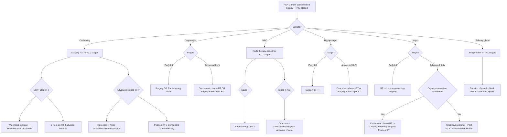

## Management of Head and Neck Cancer

Management of H&N cancer is one of the most complex areas in oncology because you are constantly balancing two competing goals: **cure the cancer** and **preserve the patient's ability to breathe, eat, speak, and look normal**. No other cancer site imposes this dual burden so acutely.

Let's build the management framework from first principles before diving into subsite-specific details.

---

### 1. Overarching Management Principles

#### 1.1 The Three Pillars

***General principle*** [3]:
- ***Tumour clearance with long-term survival benefit***
- ***Organ and function preservation***

***When surgery is indicated*** [3]:
- ***Resection with adequate margins***
- ***Reconstruction for Form and Function***
- ***Rehabilitation always — swallowing, voice and hearing***

Think of this as the **"3 R's"** of H&N cancer surgery: **Resection → Reconstruction → Rehabilitation**.

***Therefore, majority of head and neck cancers require both RESECTION and RECONSTRUCTION*** [5]

***Aims of Head and Neck Surgery*** [5]:
- ***Resection: oncologically clear, yet preserve important organ functions → margins of resection***
- ***Reconstruction: choose the best option for individual patient***

Why both? Because H&N structures are not expendable. If you resect a colon tumour, the patient can live without that segment. If you resect the tongue, the patient cannot eat or speak without reconstruction. The surgery must simultaneously achieve oncological clearance AND restore function.

***Head and neck cancer poses special challenges in both resection and reconstruction. Individualise the option of surgery to achieve the best functional and cosmetic result*** [5]

#### 1.2 The MDT Approach

***Multidisciplinary approach including swallowing rehabilitation is important*** [2]

A H&N cancer MDT typically includes:
- Head and neck surgeon (ENT / maxillofacial / plastic surgery)
- Radiation oncologist
- Medical oncologist
- Pathologist
- Radiologist
- Speech and language therapist
- Dietitian
- Clinical psychologist / psychiatrist
- Dental specialist (pre-radiation dental assessment — critical to prevent osteoradionecrosis)
- Nurse specialist

#### 1.3 Airway First

***ALWAYS protect the airway for all H&N cancer*** [2]. Before any treatment decision, assess the airway. A patient with impending airway obstruction needs urgent intervention (tracheostomy / intubation) before any staging or treatment planning.

---

### 2. Management Framework — By Stage

The lecture gives us the overarching framework clearly [3]:

***Management Framework — Based on TNM staging*** [3]:

***Early stage (I, II)*** [3]:
- ***Single modality of treatment***
- ***Surgery or radiotherapy alone***

***Late stage (III, IV)*** [3]:
- ***Combined modality of treatment***
- ***Concurrent chemo-irradiation***
- ***Surgery with adjuvant radiotherapy +/- chemotherapy***

***General rule*** [3]:
- ***Early stage: radiotherapy or minimally invasive surgery (laser/robotic)***
- ***Late stage: Surgery with adjuvant treatment***

***BUT*** [3]:
- ***Oral cavity and thyroid: surgery in early stage*** (Why? Because oral cavity cancers are not as radiosensitive as pharyngeal/laryngeal cancers, and surgical access is straightforward)
- ***NPC: chemo-irradiation in late stage*** (Why? Because NPC is highly radiosensitive — especially the undifferentiated, EBV-associated subtype endemic in HK — and the nasopharynx is anatomically difficult to access surgically, sitting deep at the skull base)

<Callout title="The Key Exception Rule">
The general rule is "early = single modality, late = combined modality." But the **two big exceptions** are: **(1) Oral cavity → surgery first even in early stage** (not as radiosensitive; easy surgical access); **(2) NPC → chemo-irradiation even in advanced stage** (highly radiosensitive; surgically inaccessible). If you remember nothing else about H&N management, remember this.
</Callout>

---

### 3. Master Management Algorithm

---

### 4. Treatment Modalities in Detail

#### 4.1 Surgery

##### 4.1.1 Resection of Primary Tumour

The surgical approach depends on **subsite, tumour size, and accessibility**.

**Access approaches**:
- ***Traditional surgical approaches through skin incision*** — used for salivary and thyroid cancers which are easily accessible [2]
- ***Minimally invasive techniques:*** [2]
  - ***Transoral laser microsurgery (TOLM)*** — for larynx cancers
  - ***Transoral robotic surgery (TORS)*** — for oropharynx cancers
  - ***Previously, procedures might otherwise require a lip-splitting mandibulotomy approach to resect tumours of the oropharynx*** [2]. TORS avoids this.
  - ***TORS is associated with shorter length of hospital stay and less likely to be gastrostomy tube or tracheostomy dependent at 6 months*** [2]

<DiagramCard src="/diagrams/TORS.png" alt="Transoral robotic surgery (TORS) setup for head and neck cancer resection" caption="Transoral robotic surgery (TORS) [8]" />

**Margin adequacy**:
- The goal is **R0 resection** (negative margins). For oral cavity SCC, AJCC 8th edition recommends ≥ 5mm clear margin. Intraoperative frozen section helps guide real-time margin assessment.
- ***Postoperative RT ± chemotherapy is indicated for patients who have close or positive margins or factors increasing risk of local recurrence including lymphovascular invasion, perineural invasion, and extranodal extension (ENE)*** [2]

**Subsite-specific surgery — Oral Cavity**:

| Subsite | Early Disease | Advanced Disease |
|:--|:--|:--|
| **Lip** | ***Surgical excision with histological confirmation of tumour-free margin*** [2]. Wedge excision with primary closure for small lesions. | Larger resection + ***reconstruction*** |
| **Tongue** | ***Wide local excision with primary closure or healing by secondary intention (T1–2)*** [2]. ***CO2 ablation for premalignant lesions*** [2] | ***Partial glossectomy + Reconstruction using soft pliable fasciocutaneous free flaps*** [2]. ***Prosthetic augmentation can allow contact between remaining tongue tissue and palate, improving ability to speak and swallow*** [2] |
| **Floor of mouth** | Wide local excision + split-thickness skin graft [2] | ***Marginal or segmental mandibulectomy + Reconstruction with fasciocutaneous or vascularized osseous free flap*** [2] |
| **Alveolus/Gingiva** | ***Marginal resection of mandible for minimal bone invasion*** [2] | ***Segmental mandibulectomy for invasion into medullary cavity*** [2] |
| **Retromolar trigone** | — | ***Marginal or segmental mandibulectomy with soft tissue or osseous reconstruction*** [2]. ***Ipsilateral neck dissection*** [2] |
| **Buccal mucosa** | Surgical excision [2] | ***Combined surgical excision + post-op RT. May necessitate resection of alveolar ridge*** [2] |
| **Hard palate** | ***Mucosal excision (periosteum acts as barrier)*** [2] | ***Partial palatectomy or infrastructure maxillectomy. Through-and-through defects require dental prosthesis*** [2] |

**Subsite-specific surgery — Larynx**:

***Early (Stage I and II) cancer*** [2]:
- ***Patients with early cancer should be treated with the intent to preserve the larynx***
- ***Larynx-preserving surgery:*** [2]
  - ***Transoral laser microsurgery (TOLM)***
  - ***Partial open laryngectomy***

***Advanced (Stage III and IV) cancer*** [2]:
- ***Patients with good performance status should be treated with a functional organ-reservation strategy including chemoradiotherapy or larynx-preserving surgery with post-operative RT***
- ***Total laryngectomy is indicated for:*** [2]
  - ***Patients who are not candidates for functional organ-reservation strategy***
  - ***Elderly patients or patients with poor functional status that cannot tolerate the associated toxicities of chemoradiotherapy***
  - ***Patients with resectable tumours with destruction of both vocal cords or extensive cartilage destruction such that vocal or airway protective function cannot be recovered***
- ***Total laryngectomy + Post-operative radiotherapy*** [2]
  - ***Reconstruction by means of a pectoralis major flap or free flap reconstruction is required for lesions with pharyngeal extension*** [2]

***Treatment of subglottic tumours*** [2]:
- ***Subglottic tumours are the least common and are commonly asymptomatic until locally advanced***
- ***Higher rates of local recurrence and poor survival when compared with lesions involving the supraglottis or glottis***
- ***Treatment is aggressive with initial surgical treatment consisting of either total laryngectomy or partial laryngectomy in very selected cases***
- ***Thyroidectomy and bilateral paratracheal node dissection are usually performed*** — because the subglottis drains to paratracheal and pretracheal nodes, and the thyroid gland is in direct anatomical continuity

##### 4.1.2 Neck Dissection

The neck must be addressed because of the high rate of regional metastasis. There are three types:

| Type | What is Removed | Indication |
|:--|:--|:--|
| **Selective neck dissection** | Selected levels at highest risk of metastasis (e.g., Levels I–III for oral cavity; Levels II–IV for oropharynx/larynx) | ***Indicated for patients with stage I oral tongue cancer > 3mm and most stage II oral cavity cancers*** [2]. Also for clinically N0 necks with > 15–20% risk of occult metastasis. ***Ipsilateral selective neck dissection of level I to III or IV is generally sufficient*** [2]. ***Bilateral neck dissection required if primary tumours are close to or involving the midline*** [2] |
| **Modified radical neck dissection** | Levels I–V LN. ***Preservation of one or more of: internal jugular vein, spinal accessory nerve, sternocleidomastoid muscle*** [2] | Clinically positive neck (palpable/imaged nodes) |
| **Radical neck dissection** | Levels I–V LN + ***Internal jugular vein + Spinal accessory nerve + Sternocleidomastoid muscle*** [2] | Rarely performed now; reserved for bulky nodal disease with gross invasion of these structures |

Why preserve the spinal accessory nerve (CN XI)? Because its sacrifice causes **trapezius muscle denervation** → shoulder drop, chronic pain, inability to abduct arm above 90°. This is devastating for quality of life. Modern practice tries to spare it whenever oncologically safe.

##### 4.1.3 Reconstruction

***Majority of head and neck cancers require both RESECTION and RECONSTRUCTION*** [5]

| Reconstructive Option | When Used |
|:--|:--|
| **Primary closure** | Small defects (e.g., small tongue excision, lip wedge excision) |
| **Split-thickness skin graft** | Floor of mouth defects after excision of superficial lesions |
| **Local flaps** | Lip reconstruction (e.g., Abbe flap, Estlander flap), small oral defects |
| **Pedicled flaps** (e.g., pectoralis major myocutaneous flap) | Moderate to large defects; reliable blood supply; no need for microvascular anastomosis |
| ***Free flaps*** (fasciocutaneous, e.g., radial forearm; osseous, e.g., fibula free flap) | ***Reconstruction using soft pliable fasciocutaneous free flaps can provide intraoral bulk and preservation of tongue mobility*** [2]. Fibula free flap for mandibular reconstruction. Gold standard for complex defects |
| ***Dental prosthesis*** | ***Through-and-through defects of palate require dental prosthesis for rehabilitation of swallowing and speech*** [2]. Obturators for palatal defects |
| ***Prosthetic augmentation*** | ***Can allow contact between remaining tongue tissue and palate, improving ability to speak and swallow*** [2] |

#### 4.2 Radiotherapy (RT)

**"Radio"** = radiation; **"therapy"** = treatment. Uses ionising radiation to cause DNA double-strand breaks in tumour cells → cell death.

##### 4.2.1 Types of Radiotherapy

| Type | Description | Use |
|:--|:--|:--|
| ***External beam RT (EBRT)*** | Radiation delivered from outside the body. Modern techniques include intensity-modulated RT (IMRT) and volumetric modulated arc therapy (VMAT) — these shape the radiation beam to conform to the tumour and spare surrounding normal tissue | Standard RT for H&N cancer |
| ***Brachytherapy*** | Radioactive source placed directly into or adjacent to the tumour | ***Used for localised early-stage cancers*** [2]; interstitial brachytherapy for lip, oral tongue, floor of mouth |
| **Proton beam therapy** | Uses protons instead of photons; deposits energy more precisely (Bragg peak) → less exit dose | Emerging role for NPC (to spare temporal lobes and brainstem) and skull base tumours |

##### 4.2.2 Role of Radiotherapy by Setting

| Setting | Indication |
|:--|:--|
| ***Definitive RT (single modality)*** | ***Early-stage laryngeal cancer (equally effective as surgery with better voice quality)*** [2]; ***NPC Stage I (RT only)*** [2]; Early oropharyngeal cancer |
| ***Post-operative RT (adjuvant)*** | ***Indicated for patients with close or positive margins, factors increasing risk of local recurrence: lymphovascular invasion, perineural invasion, ENE*** [2]; ***Post-op RT for lip cancer: positive margins, tumour thickness > 4mm, perineural invasion, LN metastasis*** [2]; ***Post-op RT for hard palate: advanced staged tumours*** [2] |
| ***Concurrent chemoradiotherapy*** | ***Advanced stage (III and IV) oropharyngeal carcinoma — effectively preserves function and associated with survival comparable to surgery with post-operative radiation*** [2]; ***NPC Stage II–IVB*** [2] |

***Radiotherapy is often preferred for early glottic cancer because of better functional outcomes, particularly voice quality, while avoiding GA and other risks associated with surgery*** [2]

***Radiation therapy is equally as effective as surgery in controlling disease for early-stage cancers of the glottis*** [2]

***Complications of RT for laryngeal cancer*** [2]: ***Radiation dermatitis, Hoarseness, Dysphagia, Odynophagia***

<Callout title="Why RT for Early Glottic but Surgery for Early Oral Cavity?">
**Glottic cancer**: The true vocal cord is exquisitely sensitive to even small changes in mass or stiffness. Surgery on the vocal cord (even laser excision) can cause scarring that permanently impairs voice quality. RT achieves similar cure rates but with **better voice outcomes**. That's why RT is often preferred.

**Oral cavity cancer**: The oral cavity mucosa is less radiosensitive than pharyngeal/laryngeal mucosa. RT to the oral cavity causes significant mucositis, xerostomia, and risk of osteoradionecrosis of the mandible. Surgery is straightforward (direct access through the mouth) and gives excellent local control. So **surgery is preferred upfront**.
</Callout>

#### 4.3 Chemotherapy

Chemotherapy in H&N cancer is almost never used as a standalone curative modality. It is used as:

| Setting | Agents | Purpose |
|:--|:--|:--|
| **Concurrent chemoradiotherapy** | **Cisplatin** (standard; 100 mg/m² q3 weeks × 3 cycles during RT) | Radiosensitiser — cisplatin inhibits DNA repair in tumour cells, making them more susceptible to radiation-induced damage. The combination is synergistic. |
| **Induction (neoadjuvant) chemotherapy** | **TPF regimen**: Docetaxel + Cisplatin + 5-Fluorouracil | Shrink bulky tumours before definitive treatment (RT or surgery). Used in organ preservation protocols for larynx and selected oropharynx/hypopharynx cancers. |
| **Adjuvant chemotherapy** | Cisplatin-based | After concurrent CRT for NPC (especially Stage III–IVB); reduces distant metastasis risk [2] |
| **Palliative chemotherapy** | Platinum-based combinations, taxanes | Incurable metastatic/recurrent disease — intent is symptom control and life prolongation, not cure |

**Why cisplatin?** Cisplatin ("cis-diaminedichloroplatinum") is a platinum-based drug that forms DNA cross-links → blocks DNA replication and transcription → triggers apoptosis. It is the most effective single agent in HNSCC and the backbone of concurrent CRT protocols.

#### 4.4 Targeted Therapy

| Agent | Target | Indication |
|:--|:--|:--|
| **Cetuximab** | EGFR (Epidermal Growth Factor Receptor) | Alternative to cisplatin in concurrent CRT for patients who cannot tolerate cisplatin (e.g., renal impairment, elderly). "Cetuxi-mab" = chimeric monoclonal antibody against EGFR. EGFR is overexpressed in ~90% of HNSCC. Cetuximab blocks ligand binding → inhibits downstream Ras/MAPK and PI3K/Akt proliferation signals. |

#### 4.5 Immunotherapy

| Agent | Target | Indication |
|:--|:--|:--|
| **Pembrolizumab** | PD-1 (Programmed Death-1 receptor) | First-line for recurrent/metastatic HNSCC (KEYNOTE-048 trial). "Pembro-lizumab" = humanised monoclonal antibody against PD-1. PD-1 is an immune checkpoint receptor on T cells. Tumour cells express PD-L1 which binds PD-1 → switches off T-cell attack. Pembrolizumab blocks this interaction → T cells can recognise and kill tumour cells again. |
| **Nivolumab** | PD-1 | Second-line for platinum-refractory recurrent/metastatic HNSCC (CheckMate-141 trial). |

Immunotherapy has transformed the landscape for recurrent/metastatic HNSCC. In the curative setting, multiple trials are ongoing combining immunotherapy with CRT.

---

### 5. Subsite-Specific Management

#### 5.1 Oral Cavity Cancer

***Oral cavity: surgery in early stage*** [3]

**Early (Stage I–II)** [2]:
- ***Primary surgery is recommended rather than definitive radiotherapy***
- ***Selective neck dissection indicated for stage I oral tongue cancer > 3mm depth of invasion and most stage II oral cavity cancers***
- ***Post-operative radiotherapy if tumour thickness > 4mm or lymphovascular/perineural invasion***

**Advanced (Stage III–IV)** [2]:
- ***Surgical resection is suggested as initial therapy***
- ***Modified radical neck dissection + Post-operative radiotherapy ± concurrent chemotherapy***
- ***Definitive radiotherapy or chemotherapy for medically inoperable or unresectable disease***

#### 5.2 Oropharyngeal Cancer

***Tumours of the oropharynx tend to be chemosensitive*** [2]
***Adequate treatment of the neck is important because of high risk of regional metastasis*** [2]

**Early (Stage I–II)**: Single modality — surgery (TORS) or RT alone [3]

**Advanced (Stage III–IV)** [2]:
- ***Concomitant chemoradiation is commonly utilised in advanced stage (III and IV) oropharyngeal carcinoma, which effectively preserves function and is associated with survival comparable to surgery with post-operative radiation***
- Alternatively: Surgery + post-op CRT

**HPV-positive oropharyngeal cancer** [2]:
- ***De-intensification of treatment can be considered while obtaining the same locoregional and overall survival seen with standard treatment options***
- Active clinical trials are testing reduced-dose RT, replacing cisplatin with cetuximab, or reducing adjuvant treatment in good-responders
- The goal is to maintain the excellent survival while **reducing long-term toxicity** (xerostomia, dysphagia, fibrosis)

#### 5.3 Nasopharyngeal Cancer

***NPC: chemo-irradiation in late stage*** [3]

***Management according to stages*** [2]:

| Stage | Approach |
|:--|:--|
| ***Early Stage I*** | ***Radiotherapy ONLY*** |
| ***Intermediate Stage II*** | ***Concurrent chemoradiotherapy*** |
| ***Advanced Stage III*** | ***Concurrent chemoradiotherapy*** |
| ***Stage IVA*** | ***± Adjuvant chemotherapy*** |
| ***Stage IVB*** | ***± Adjuvant chemotherapy*** |

Why RT-based for NPC? Three reasons:
1. **Anatomical**: The nasopharynx sits deep at the skull base, surrounded by critical structures (carotid arteries, cranial nerves, brainstem). Surgical access is extremely difficult and morbid.
2. **Radiosensitivity**: The undifferentiated (non-keratinizing) NPC — which is the dominant histology in Hong Kong — is **highly radiosensitive**.
3. **EBV-driven immune biology**: These tumours have an immunogenic profile that responds well to CRT.

**Standard protocol**: Cisplatin 100 mg/m² q3 weeks × 3 during RT (concurrent CRT). For Stage III–IVB, adjuvant chemotherapy (gemcitabine + cisplatin) may follow based on the NPC-0501 and KEYNOTE-122 data.

***Post-treatment follow-up*** [2]: Plasma EBV DNA monitoring — undetectable post-treatment = good response; rising levels = recurrence.

#### 5.4 Laryngeal Cancer

***Early (Stage I and II)*** [2]:
- ***Radiotherapy is often preferred because of better functional outcomes, particularly voice quality***
- ***Radiation therapy is equally effective as surgery in controlling disease for early-stage cancers of the glottis***
- ***Larynx-preserving surgery: TOLM, partial open laryngectomy***

***Advanced (Stage III and IV)*** [2]:
- ***Functional organ-reservation strategy:***
  - ***Chemoradiotherapy*** (cisplatin + RT)
  - ***Larynx-preserving surgery + post-op RT***
- ***Total laryngectomy + post-op RT*** for:
  - ***Cannot tolerate CRT toxicities***
  - ***Destruction of both vocal cords or extensive cartilage destruction***
- ***Voice rehabilitation*** after total laryngectomy (tracheoesophageal puncture with voice prosthesis, oesophageal speech, or electrolarynx)

#### 5.5 Salivary Gland Cancer

***Surgery first for all stages*** [3] — because salivary gland cancers are generally **not very radiosensitive** (except lymphoepithelial carcinoma, which behaves like NPC).

**Specific salivary malignancies** (from lecture):

***Mucoepidermoid Carcinoma*** [7]:
- ***Treatment influenced by site, stage, grade***
- ***Localised to gland → Excision of gland***
- ***Neck node metastasis → Neck dissection***
- ***RT for high-grade tumour, close margin, and extra-glandular spread***

***Adenoid Cystic Carcinoma*** [7]:
- ***Complete local excision***
- ***Tendency for perineural invasion — ? facial nerve sacrifice*** (this is one of the most agonising surgical decisions — do you sacrifice CN VII to get clear margins in a tumour known for perineural spread? The decision depends on whether the nerve is grossly involved vs. only microscopic perineural invasion on frozen section)
- ***Postoperative XRT***
- ***Prognosis: Local recurrence 40%. Distant metastasis common: lung. Indolent course: 5-year survival 75%, 20-year survival 13%***

***Carcinoma Ex-Pleomorphic Adenoma*** [7]:
- ***Radical excision***
- ***Neck dissection (25% with lymph node involvement at presentation)***
- ***Postoperative XRT***
- ***Prognosis: Dependent upon stage and histology. Usually not very good***

***Undifferentiated carcinoma — Lymphoepithelial carcinoma*** [7]:
- ***Histology exactly like NPC***
- ***EBV-related (tumour cells EBER+ve)***
- ***May present as metastatic lymph node, unknown primary***
- ***Surgery + post-op RT to primary and neck***
- ***Prognosis better than SCC and adenocarcinoma***

<Callout title="Adenoid Cystic Carcinoma — The Long Game" type="idea">
ACC has an **indolent but relentless** natural history. Patients may do well for years, but the 20-year survival is only 13%. It is notorious for **perineural invasion** (spreading along nerves like a vine climbing a trellis) and **late lung metastases** (appearing 10–15 years after initial treatment). Long-term follow-up is essential.
</Callout>

---

### 6. Indications for Post-Operative RT and CRT

Not every surgically-treated patient needs adjuvant therapy. It is indicated when adverse pathological features are present that increase the risk of locoregional recurrence [2]:

| Feature | Why It Matters | RT Alone Sufficient? |
|:--|:--|:--|
| **Close margin** (< 5mm) | Residual microscopic disease at edges | Yes — RT to primary site |
| **Positive margin** (tumour at ink) | Very high recurrence risk | Consider re-excision first; if not feasible, CRT |
| ***Tumour thickness > 4mm*** | Deeper tumours have higher risk of occult nodal metastasis and local recurrence [2] | Yes — RT to primary + neck |
| ***Perineural invasion*** | Tumour cells spread along nerve sheaths → can recur far from the original resection site [2] | CRT (positive margin + PNI is particularly high risk) |
| ***Lymphovascular invasion*** | Increased risk of regional and distant spread [2] | RT |
| ***Extranodal extension (ENE)*** | Tumour through node capsule → dramatically increased recurrence and distant metastasis risk [2] | **CRT** (ENE + positive margin = the two strongest indications for adjuvant CRT based on EORTC 22931 and RTOG 9501 trials) |
| Multiple positive nodes | Higher nodal burden = higher risk | RT or CRT |
| Advanced T stage (pT3–4) | Larger tumours = higher local recurrence risk | RT |

<Callout title="The Two 'Absolute' Indications for Adjuvant Chemo-RT" type="error">
The two features that mandate **concurrent chemoradiotherapy** (not just RT alone) after surgery are: **(1) Positive margins** and **(2) Extranodal extension (ENE)**. These are the findings from EORTC 22931 and RTOG 9501 landmark trials. Other adverse features (PNI, LVI, close margins, multiple nodes, pT3–4) are indications for adjuvant RT, but the addition of chemotherapy is strongest for positive margins and ENE.
</Callout>

---

### 7. Contraindications and Special Considerations

#### 7.1 Contraindications to Surgery

| Contraindication | Rationale |
|:--|:--|
| **NPC** (relative) | Anatomically inaccessible; highly radiosensitive; surgery reserved for salvage recurrence |
| **Medically unfit** | Cardiac, pulmonary, or other comorbidities that preclude GA. ASA III–IV may be offered RT instead |
| **Unresectable disease** | Encasement of carotid artery, skull base invasion through to brain, prevertebral fascia invasion with fixation to spine |
| **Distant metastatic disease (M1)** | Surgery of primary is usually not curative in setting of widespread metastases (palliative intent only) |

#### 7.2 Contraindications to Cisplatin-Based CRT

| Contraindication | Alternative |
|:--|:--|
| Renal impairment (GFR < 50) | Carboplatin or cetuximab |
| Severe hearing loss | Carboplatin (cisplatin is ototoxic) |
| Severe neuropathy | Carboplatin |
| Poor performance status (ECOG ≥ 3) | RT alone or best supportive care |

#### 7.3 Pre-Radiation Dental Assessment

Mandatory before starting RT to the H&N region. Why? Radiation damages salivary glands → **xerostomia** (dry mouth) → loss of protective saliva → rapid dental caries → tooth extraction in irradiated bone → **osteoradionecrosis (ORN)** of the mandible (a devastating complication). All carious teeth in the radiation field should be extracted and the sockets allowed to heal BEFORE starting RT (usually 2–3 weeks).

---

### 8. Palliative Management

For patients with incurable metastatic/recurrent disease:

- **Systemic therapy**: Pembrolizumab ± chemotherapy (KEYNOTE-048); Cetuximab + platinum + 5-FU (EXTREME regimen); nivolumab (second-line)
- **Palliative RT**: For pain, bleeding, airway obstruction
- **Best supportive care**: Pain management (WHO analgesic ladder; may need nerve blocks), nutritional support (PEG tube), airway management (tracheostomy), speech therapy, psychological support
- **Symptom-specific interventions**: Bleeding → palliative RT or embolisation; Dysphagia → stenting or PEG; Fungating wound → regular wound care + metronidazole for odour

---

### 9. Rehabilitation — The Third "R"

***Rehabilitation always — swallowing, voice and hearing*** [3]

| Domain | Intervention |
|:--|:--|
| **Swallowing** | Speech and language therapy; swallowing exercises (pre-habilitation before CRT); Modified diet texture; PEG tube if needed |
| **Voice** | Tracheoesophageal puncture (TEP) with voice prosthesis (gold standard post-laryngectomy); Oesophageal speech; Electrolarynx |
| **Hearing** | Hearing aids (conductive loss from serous otitis media in NPC); Bone-anchored hearing aids |
| **Dental** | Obturators for palatal defects; Dental implants post-mandibular reconstruction; Fluoride trays for xerostomia |
| **Nutritional** | Dietitian input; Enteral feeding if unable to maintain oral intake |
| **Psychological** | Body image counselling; Depression/anxiety screening; Support groups |
| **Physiotherapy** | Shoulder rehabilitation post-neck dissection (especially if CN XI sacrificed); Trismus exercises |

---

### 10. Follow-Up and Surveillance

- **Standard**: Clinical examination every 1–3 months in Year 1–2, every 2–4 months in Year 3, every 4–6 months in Years 4–5, then annually
- **Imaging**: CT/MRI at 3 months post-treatment as new baseline; PET-CT at 12 weeks post-CRT to assess response
- **NPC-specific**: ***Post-treatment plasma EBV DNA levels evaluate treatment response and detection of recurrence*** [2]
- **Panendoscopy**: Annual for field cancerization surveillance (synchronous/metachronous primaries)
- **Thyroid function**: Annual TSH if neck irradiated (RT can cause hypothyroidism)

---

<Callout title="High Yield Summary">

**Management framework**: Early stage (I–II) = single modality; Late stage (III–IV) = combined modality.

**Exceptions**: Oral cavity → surgery first even in early stage; NPC → chemo-irradiation even in advanced stage.

**3 R's of H&N surgery**: Resection (oncologically clear margins) → Reconstruction (form and function) → Rehabilitation (swallowing, voice, hearing).

**Neck dissection**: Selective (elective, levels at risk) vs Modified radical (Levels I–V, preserve structures) vs Radical (Levels I–V + IJV + CN XI + SCM, rarely done).

**Larynx management**: Early = RT (better voice) or larynx-preserving surgery. Advanced = organ preservation with CRT if candidate; total laryngectomy + post-op RT + voice rehab if not.

**NPC management**: Stage I = RT only; Stage II–IVB = concurrent CRT ± adjuvant chemo. Surgery NOT first-line (radiosensitive + inaccessible).

**Post-op CRT indications**: Positive margins and ENE are the two strongest indications (EORTC 22931 / RTOG 9501).

**Salivary gland**: Surgery first. ACC = complete excision + post-op RT; indolent but late lung metastases. Mucoepidermoid = excision ± RT based on grade. Lymphoepithelial carcinoma = EBV-related, behaves like NPC, good prognosis.

**Immunotherapy**: Pembrolizumab (anti-PD-1) is now first-line for recurrent/metastatic HNSCC (KEYNOTE-048).

**Pre-RT dental assessment mandatory** to prevent osteoradionecrosis.

**HPV+ oropharyngeal cancer**: De-intensification trials ongoing — better prognosis, may not need as aggressive treatment.

</Callout>

---

<ActiveRecallQuiz
  title="Active Recall - Management of Head and Neck Cancer"
  items={[
    {
      question: "State the management framework for H&N cancer by stage. What are the two key exceptions to the general rule?",
      markscheme: "Early stage (I-II): single modality (surgery or RT alone). Late stage (III-IV): combined modality (concurrent CRT or surgery + adjuvant RT +/- chemo). Exceptions: (1) Oral cavity and thyroid: surgery first even in early stage (not radiosensitive, easy surgical access). (2) NPC: chemo-irradiation even in advanced stage (highly radiosensitive, surgically inaccessible).",
    },
    {
      question: "Why is radiotherapy preferred over surgery for early glottic laryngeal cancer? When is total laryngectomy indicated instead?",
      markscheme: "RT preferred because: equally effective as surgery in disease control; better functional outcomes particularly voice quality; avoids GA risks. Total laryngectomy indicated when: patient cannot tolerate CRT toxicity (elderly/poor performance); tumour causes destruction of both vocal cords or extensive cartilage destruction such that vocal/airway function cannot be recovered; failed organ preservation treatment.",
    },
    {
      question: "List the two strongest indications for adjuvant concurrent chemoradiotherapy after surgery for H&N cancer, and name the landmark trials.",
      markscheme: "Two strongest indications: (1) Positive surgical margins, (2) Extranodal extension (ENE). Landmark trials: EORTC 22931 and RTOG 9501. Other adverse features (PNI, LVI, close margins, multiple nodes, pT3-4) are indications for adjuvant RT but the addition of chemotherapy is most strongly indicated for positive margins and ENE.",
    },
    {
      question: "Describe the management of adenoid cystic carcinoma of the salivary gland. What is its natural history?",
      markscheme: "Management: complete local excision (may require facial nerve sacrifice if grossly involved due to tendency for perineural invasion) + postoperative radiotherapy. Natural history: indolent but relentless. Local recurrence rate 40%. Distant metastasis common, especially to lung, often appearing 10-15 years later. 5-year survival 75% but 20-year survival only 13%.",
    },
    {
      question: "Outline the NPC management by stage. Why is surgery not first-line for NPC?",
      markscheme: "Stage I: RT only. Stage II-IVB: concurrent chemoradiotherapy +/- adjuvant chemotherapy. Surgery not first-line because: (1) Nasopharynx is deep at skull base, surgically inaccessible; (2) Undifferentiated NPC is highly radiosensitive (especially the EBV-associated endemic form); (3) CRT achieves excellent local control. Surgery reserved for salvage of local recurrence.",
    },
    {
      question: "A patient undergoes partial glossectomy for T2 oral tongue SCC. Final pathology shows depth of invasion 6mm, perineural invasion present, and one Level I node positive with ENE. What adjuvant treatment is indicated?",
      markscheme: "Concurrent chemoradiotherapy (cisplatin-based). Rationale: ENE is one of the two absolute indications for adjuvant CRT (not RT alone). Additional adverse features include perineural invasion and depth of invasion greater than 4mm, which independently indicate adjuvant RT. The presence of ENE mandates the addition of concurrent chemotherapy to RT.",
    },
  ]}
/>

---

## References

[2] Senior notes: felixlai.md (H&N cancer treatment, CA Oropharynx, NPC, Laryngeal carcinoma, Lip/Tongue/Floor of mouth/Alveolus/Retromolar trigone/Buccal mucosa/Hard palate cancer sections)
[3] Lecture slides: GC 219. Infections and tumours in pharynx and oral cavity.pdf (pp. 42, 43, 44, 48)
[5] Lecture slides: GC 187. Head and neck cancer problems Function and shape.pdf (pp. 13, 14, 27)
[7] Lecture slides: GC 217. Facial nerve palsy and salivary gland diseases.pdf (pp. 67, 69, 74, 76)
[8] Image credit: ResearchGate (TORS image)
