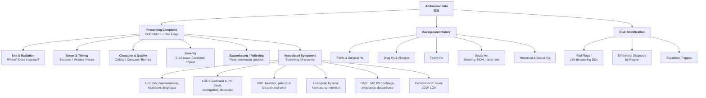

# History Taking: Abdominal Pain (腹痛)

---

---

## 1. Opening & Framing the Consultation

Before you dive into questions, set the scene. Greet the patient, confirm their identity, and gain consent. In an OSCE, a smooth opening buys you rapport marks.

> **Practical phrasing:**
> "Hello, my name is Dr ___. Can I confirm your name and date of birth? I understand you're having some tummy pain — I'd like to ask you some questions about it so we can figure out what's going on. Is that okay?"
>
> **Cantonese:** 你好，我係___醫生。可唔可以確認你嘅姓名同出生日期？我知道你肚痛，我想問你幾個問題了解下情況，可以嗎？

---

## 2. Presenting Complaint — The SOCRATES Framework

This is the meat of your history. For abdominal pain, every letter of SOCRATES carries high diagnostic yield. Don't just ask the question — understand *why* it matters. [1] [2]

### 2.1 Site (位置)

> "Can you point with one finger to where the pain is worst?" (你可唔可以用一隻手指指住邊度最痛？)

| Region | Key Differentials |
|--------|-------------------|
| **RUQ** | Cholecystitis, cholangitis, hepatitis, liver abscess, basal pneumonia, subphrenic abscess [1] [3] |
| **Epigastric** | PUD, gastritis, pancreatitis, GERD, MI, gastric outlet obstruction [1] [2] |
| **LUQ** | Splenic pathology, pancreatitis, basal pneumonia, MI [1] |
| **Periumbilical** | Early appendicitis, SBO, mesenteric ischaemia, ruptured AAA, gastroenteritis [1] [2] |
| **RLQ** | Appendicitis, Crohn's, caecal CA, ectopic pregnancy, ovarian torsion, ureteric colic, strangulated hernia [1] [4] |
| **LLQ/LIF** | Diverticulitis, sigmoid CA, IBD, ovarian pathology, ectopic pregnancy, ureteric colic [1] [4] |
| **Hypogastric** | LBO, colorectal CA, UTI, AROU, PID, ectopic pregnancy [1] |
| ***Diffuse/non-specific*** | ***Gastroenteritis, constipation, generalised peritonitis, ruptured viscus, intra-abdominal haemorrhage, DKA, hypercalcaemia, herpes zoster, porphyria*** [1] [2] |

**Why this matters:** The site immediately narrows your differential by 70%. A pain that *migrates* (e.g. periumbilical → RIF) is classic for appendicitis. [1]

### 2.2 Onset (發病方式)

> "When did the pain start? Did it come on suddenly or gradually?" (幾時開始痛？係突然間痛定係慢慢痛起嚟？)

***Onset timing is one of the most discriminating features in acute abdomen:*** [1] [2]

- ***Within seconds:*** Perforation (e.g. PPU), haemorrhage (e.g. ***ruptured AAA***), infarction (e.g. MI, mesenteric occlusion) [1] [2]
- ***Within minutes:*** Inflammatory (appendicitis, pancreatitis), colic (biliary, ureteric, IO), ischaemia (mesenteric ischaemia, strangulated IO, volvulus) [1]
- ***Over hours:*** Inflammatory (cholecystitis), obstruction (non-strangulated IO, urinary retention), mechanical (ectopic pregnancy, perforating tumours) [1]

**Why this matters:** A catastrophic, "thunderclap" onset = surgical emergency until proven otherwise. Gradual onset buys you investigation time.

### 2.3 Character / Quality (性質)

> "Can you describe the pain for me? Is it sharp, dull, cramping, burning, or like something squeezing?" (你可唔可以形容下痛嘅感覺？係刺痛、鈍痛、絞痛、灼熱痛、定係好似有嘢夾住咁？)

***Three fundamental pain characters:*** [1]

| Character | Mechanism | Examples |
|-----------|-----------|----------|
| ***Constant pain*** | Inflammation, infiltration, ischaemia, infarction | Peritonitis, pancreatitis, mesenteric ischaemia |
| ***Colicky pain*** | Hyperperistalsis against obstruction | ***IO (true colic with pain-free intervals)***, ureteric colic; ***biliary "colic" is actually constant with exacerbations, no true pain-free periods*** |
| ***Stretching pain*** | Prolonged obstruction of outflow | Urinary retention, chronic large bowel obstruction |

<Callout title="Biliary 'Colic' Is a Misnomer" type="error">
Biliary colic is NOT true colic — it is severe, constant pain with painful exacerbations but *no* complete pain-free periods. This is a common OSCE pitfall. True colic (complete remissions between episodes) is seen in intestinal obstruction and ureteric colic. [1]
</Callout>

### 2.4 Radiation (放射)

> "Does the pain spread anywhere else?" (痛有冇去到其他地方？)

***Key radiation patterns:*** [1]

- **Back:** Pancreatitis, AAA, aortic dissection, posterior peptic ulcer
- **Shoulder tip (Kehr's sign):** Haemoperitoneum (ruptured ectopic, splenic rupture) — diaphragmatic irritation referred via phrenic nerve (C3–5)
- **Scapular spine / right shoulder:** Gallbladder pathology
- **Loin to groin:** Ureteric colic (renal stone)
- **Testicles to flank:** Testicular torsion
- **Flanks:** Pyelonephritis, retroperitoneal haematoma, AAA

**Why this matters:** Radiation patterns are pathognomonic clues. Shoulder-tip pain + hypotension in a young woman = ruptured ectopic until proven otherwise.

### 2.5 Associations (伴隨症狀)

This is where you systematically screen **UGI, LGI, Urological, and O&G systems**. [1] [2] [4]

#### Upper GI
- **Nausea/vomiting:** Timing relative to pain is crucial
  - *Vomiting after onset of pain* → appendicitis [1]
  - *Vomiting before onset of pain* → gastroenteritis, food poisoning [1]
  - ***Bilious vomit*** → process distal to duodenum [1]
  - ***Feculent vomiting*** → late/distal bowel obstruction [5]
- **Haematemesis / coffee-ground vomitus** → UGIB (PUD, gastritis, oesophagitis)
- **Heartburn / acid regurgitation** → GERD
- **Dysphagia** → oesophageal pathology

#### Lower GI
- ***Absolute constipation (unable to pass faeces or flatus)*** → IO [1] [5] [6]
- **Change in bowel habit** (alternating diarrhoea/constipation, pencil-thin stools, tenesmus) → colorectal CA [1] [6]
- **PR bleeding / mucus** → colitis, colorectal CA, diverticular disease
- ***Abdominal distension*** → IO, LBO [1] [5] [6]

#### Hepatobiliary / Pancreatic
- **Jaundice, tea-coloured urine, pale stool** → obstructive jaundice (cholangitis, CBD stones) [3]
- **Fever + jaundice + RUQ pain (Charcot's triad)** → ***acute cholangitis*** [3]

#### Urological
- **Dysuria, frequency, haematuria** → UTI, ureteric colic [1]
- **Urinary retention** → AROU

#### O&G (essential in all females of reproductive age)
- **LMP** (最後一次月經幾時？) → *Must ask to exclude ectopic pregnancy* [1] [4]
- **Vaginal discharge** → PID [1] [4]
- **Pregnancy symptoms** (morning sickness, breast tenderness, amenorrhoea) → ectopic pregnancy [1]
- **Dysmenorrhoea, menstrual irregularities** → endometriosis, PID [4]
- ***Dyspareunia*** → PID [4]

#### Constitutional
- ***Fever / rigors*** → inflammatory or infectious process [1] [4]
- ***Loss of weight / loss of appetite*** → malignancy [1] [6]

#### Extra-abdominal
- **Chest pain / dyspnoea** → basal pneumonia, MI [1]

**Why this matters:** Abdominal pain is never just about the abdomen. Missing an MI presenting as epigastric pain, or a basal pneumonia presenting as upper abdominal pain, is a classic exam trap.

### 2.6 Timing / Time Course (時間過程)

> "Is the pain constant, or does it come and go?" (痛係持續定係一陣一陣？)

- ***Constant*** → ulcers, peritonitis
- ***Colicky with pain-free remissions*** → intestinal, renal, (misleadingly called) biliary colic
- ***Steady increase then constantly severe*** → biliary colic, pancreatitis
- ***Progressive*** → appendicitis, diverticulitis
- ***Catastrophic onset*** → ruptured AAA, PPU [1]

### 2.7 Exacerbating & Relieving Factors (加重/減輕因素)

> "Is there anything that makes the pain better or worse?" (有冇咩會令到痛加重或者減輕？)

| Factor | Significance |
|--------|-------------|
| ***Worsened by movement, relieved by staying still*** | ***Peritonitis*** — patient lies completely still [1] [2] |
| ***Relieved by movement / rolling around*** | ***Colic*** (ureteric, intestinal) [1] |
| ***Relieved by vomiting*** | IO, gastric ulcer [1] |
| ***Relieved by eating*** | Duodenal ulcer [1] |
| ***Worsened by eating / fatty meals*** | Gastric ulcer, pancreatitis, biliary colic [2] |
| ***Relieved by sitting up and leaning forward*** | Pancreatitis, CA pancreas [1] [2] |
| ***Worsened by lying flat*** | GERD [1] |

### 2.8 Severity (嚴重程度)

> "On a scale of 0 to 10, where 0 is no pain and 10 is the worst pain you've ever had, how bad is it?" (由0到10分，0分係完全唔痛，10分係你經歷過最痛，你覺得幾痛？)

- Also ask about **functional limitation**: "Does it stop you from sleeping / working / eating?"
- ***Agonising pain out of proportion to clinical signs*** is a hallmark of **mesenteric ischaemia** — a critical diagnosis to recognise [1]

---

## 3. Targeted Systems Review

After SOCRATES, do a brief but directed systems review. Many of these overlap with associated symptoms above but serve as a safety net:

- **Cardiovascular:** Chest pain, palpitations, syncope (MI, AAA)
- **Respiratory:** Cough, SOB, pleuritic pain (basal pneumonia, PE)
- **Neurological:** Dermatomal pain / vesicles (herpes zoster) [4]
- **MSK:** Back pain (referred from AAA, pancreatitis; or lumbar spine pathology) [7]
- **Skin:** Rash, vesicles (herpes zoster), bruising (Cullen's/Grey Turner's sign in context)

---

## 4. Background History

### 4.1 Past Medical History (過去病史)

> "Do you have any medical conditions?" (你有冇其他疾病？)

Ask specifically about:
- **Previous similar episodes** — recurrent adhesive obstruction, biliary colic
- **RF for AAA / mesenteric ischaemia:** peripheral vascular disease, CAD, AF, hypertension [1]
- **RF for bowel obstruction / perforation:** previous cancer, PUD, previous abdominal surgery [1]
- **Medical conditions mimicking surgical abdomen:** ***DKA, porphyria, sickle cell crisis, Addisonian crisis*** [1] [2]
- **Gallstone risk factors (5 F's):** Fair, Fat, Female, Fertile, Forty [3]
- **IBD, diverticular disease, polyps** (risk for colorectal CA)
- **HBV carrier status / cirrhosis** (risk for HCC) [1]

### 4.2 Past Surgical History (過去手術史)

> "Have you ever had any operations?" (你有冇做過手術？)

- ***Previous abdominal or pelvic surgery*** — #1 cause of SBO is **adhesions** [1] [5] [6]
- Hernia repair history
- Any gynaecological procedures (IUD insertion → PID risk) [4]

**Why this matters:** An abdominal scar in a patient with colicky pain and vomiting = adhesive SBO until proven otherwise.

### 4.3 Drug History & Allergies (藥物史同敏感史)

> "Are you on any regular medications? Any allergies?" (你有冇食緊藥？有冇藥物敏感？)

***Key medications to ask about:*** [1] [2] [5]
- **NSAIDs / Aspirin / Bisphosphonates** → PUD, perforation
- **Corticosteroids** → may mask signs of inflammation; also PUD risk
- **Antibiotics** → may mask peritonitis; can cause pseudomembranous colitis (C. diff)
- **Opioids / anti-cholinergics / CCBs / iron** → constipation, pseudo-obstruction [5]
- **Anticoagulants** → intra-abdominal haemorrhage, retroperitoneal haematoma
- **OCP** → risk of mesenteric venous thrombosis

<Callout title="Steroids Can Kill You Quietly" type="error">
Corticosteroids mask peritoneal signs. A patient on long-term steroids may have a perforated viscus with minimal tenderness or guarding. Always maintain a high index of suspicion. [1]
</Callout>

### 4.4 Family History (家族史)

> "Does anyone in your family have any medical conditions?" (你屋企人有冇人有咩疾病？)

- ***Family history of upper GI cancer*** — red flag for malignancy [2]
- Family history of **colorectal cancer, FAP, Lynch syndrome** [6]
- Family history of **IBD**
- Family history of **pancreatitis**
- Family history of **AAA**

### 4.5 Social History (社交史)

> "Do you smoke? Do you drink alcohol?" (你有冇食煙？有冇飲酒？)

- **Smoking** (幾時開始？每日幾多支？) — risk factor for PUD, AAA, colorectal CA, mesenteric ischaemia
- **Alcohol** (飲咩酒？幾多？幾密？) — quantify in units; risk factor for pancreatitis, liver disease, gastritis
- **Travel history** (最近有冇去旅行？) — amoebic liver abscess, infectious gastroenteritis
- **Diet** (飲食習慣？) — fatty food intake (biliary colic), fibre intake (diverticular disease/constipation)
- **Occupation** — exposure to chemicals, stress
- **Sexual history** (if relevant, especially in females) — STD risk → PID [4]

### 4.6 Functional Baseline

> "Before this pain, how were you managing day to day? Could you walk independently?" (痛之前你日常生活點？行得到路嗎？)

This is critical for surgical decision-making — a frail patient with multiple comorbidities may not tolerate a major laparotomy.

---

## 5. Focused Differentiating Questions by Region

### RUQ Pain — Biliary vs Hepatic vs Thoracic

- "Did you eat a fatty meal before the pain started?" (痛之前有冇食油膩嘢？) — ***History of fatty food ingestion ≥1 hour before onset suggests biliary colic / cholecystitis*** [3]
- "Have you noticed your skin or eyes turning yellow?" (有冇發覺皮膚或者眼白變黃？) — jaundice → cholangitis, CBD stone, Mirizzi syndrome [3]
- "Any fevers or rigors?" — ***Charcot's triad (fever + jaundice + RUQ pain) = cholangitis*** [3]
- "Any cough or shortness of breath?" — basal pneumonia mimicking RUQ pain

### Epigastric Pain — PUD vs Pancreatitis vs Cardiac

- "Does eating make the pain better or worse?" — GU: worsened; DU: relieved [1]
- "Does the pain go through to your back?" — pancreatitis, posterior PUD [1]
- "Does sitting forward help?" — pancreatitis [1] [2]
- "Any chest tightness, jaw pain, or arm pain?" — MI can present as epigastric pain
- "Have you had a large alcohol binge or fatty meal recently?" — pancreatitis [1]

### RLQ Pain — Appendicitis vs Gynaecological vs Urological

- "Did the pain start around your belly button and move to the right side?" (痛有冇由肚臍附近移去右邊？) — ***migratory pain classic for appendicitis (50%)*** [1] [4]
- "Have you lost your appetite?" — anorexia in ~75% of appendicitis, *before* onset of pain [1]
- "When was your last period?" (你最後一次月經幾時？) — ***MUST ask every female of reproductive age*** [1] [4]
- "Any vaginal discharge?" — PID [4]
- "Any blood in urine or pain going to the groin?" — ureteric colic [1]

### LLQ Pain — Diverticulitis vs Colorectal CA vs Gynaecological

- "Have you noticed any blood or mucus in your stool?" — colitis, CA [1] [6]
- "Any change in bowel habit over the past few weeks?" — colorectal CA [6]
- "Have you had previous episodes like this?" — recurrent diverticulitis

### Diffuse / Central Pain — IO vs Mesenteric Ischaemia vs Medical Causes

- ***"Cardinal symptoms of IO: colicky pain, vomiting, abdominal distension, absolute constipation"*** — ask about all four [1] [5] [6]
- "Are you still passing gas?" (你仲有冇放屁？) — inability to pass flatus = complete obstruction [5] [6]
- "Do you have any heart conditions like AF?" — risk for mesenteric embolism [1]
- "Are you diabetic? When did you last check your blood sugar?" — DKA presenting as abdominal pain [1] [2]

---

## 6. Life-Threatening Differentials — Don't Miss List

***These are the life-threatening causes of acute abdomen that you must actively consider:*** [2]

| Diagnosis | Key Clues |
|-----------|-----------|
| ***Perforated viscus (e.g. PPU)*** | Sudden severe epigastric pain, board-like rigidity, lies still [1] |
| ***Ruptured AAA*** | Elderly smoker, sudden central/back pain, shock [1] |
| ***Acute mesenteric ischaemia*** | ***Pain out of proportion to signs***, AF/vascular disease history [1] |
| ***Acute intestinal obstruction*** | Colicky pain, vomiting, distension, absolute constipation [1] [5] [6] |
| ***Severe acute pancreatitis*** | Epigastric → back, leaning forward, gallstones/alcohol [1] |
| ***Ruptured HCC*** | Known HBV/cirrhosis, sudden RUQ pain, shock [1] |
| ***DKA*** | Known DM, polyuria, polydipsia, diffuse abdominal pain [1] [2] |
| ***Acute MI*** | Elderly, DM (silent MI), epigastric pain, SOB, diaphoresis [1] |
| ***Addisonian crisis*** | Chronic steroid use, acute illness, hypotension, confusion [2] |
| ***Ruptured ectopic pregnancy*** | Female of reproductive age, amenorrhoea, unilateral lower abdominal pain, shock [1] [4] |

---

## 7. Red-Flag Findings & Escalation Triggers

***Immediately escalate if any of the following are present:*** [1] [2]

- **Haemodynamic instability** (tachycardia, hypotension, shock)
- **Signs of peritonism** — board-like rigidity, rebound tenderness, guarding
- **Pain disproportionate to physical findings** — mesenteric ischaemia
- **Signs of sepsis** — fever, rigors, confusion, tachycardia
- **Evidence of GI bleeding** — haematemesis, melaena, significant PR bleeding
- **Acute urinary retention**
- **Positive pregnancy test + abdominal pain** — ectopic until proven otherwise
- **Background of immunosuppression / steroids** — symptoms may be masked
- ***Age > 55 with new-onset abdominal pain + constitutional symptoms*** — high suspicion for malignancy [2]

---

## 8. Common Pitfalls in History-Taking

<Callout title="Common OSCE Mistakes" type="error">

1. **Forgetting to ask LMP in females** — ectopic pregnancy is a life-threatening diagnosis that is easily missed. Ask every single time.
2. **Not asking about medications** — NSAIDs causing PUD, steroids masking peritonitis, opioids causing constipation/pseudo-obstruction.
3. **Assuming biliary colic is "true colic"** — biliary colic does NOT have pain-free intervals; this is a favourite viva question. [1]
4. **Ignoring extra-abdominal causes** — MI, basal pneumonia, PE, herpes zoster, DKA can all present as abdominal pain. [1] [4]
5. **Not screening for surgical history** — adhesions from prior surgery are the #1 cause of SBO in developed countries. [5] [6]
6. **Describing pain location vaguely** — always get the patient to *point* with one finger.
7. **Forgetting hernial orifices** — a strangulated inguinal/femoral hernia is an easily missed cause of IO. [4]
8. **Not asking about passage of flatus** — distinguishes complete from incomplete obstruction. [5] [6]

</Callout>

---

## 9. High-Yield Exam-Focused Interpretation Tips

<Callout title="Viva Pearls" type="idea">

- **"Pain before vomiting"** = likely surgical cause (appendicitis); **"Vomiting before pain"** = likely medical cause (gastroenteritis). [1]
- ***Mesenteric ischaemia: "pain out of proportion to signs"*** — the abdomen is soft early on despite agonising pain. This classic phrase is highly examinable. [1]
- **Murphy's sign** (catching breath on RUQ palpation during inspiration) = cholecystitis. ***Severe jaundice in the context of cholecystitis should raise suspicion for cholangitis, CBD obstruction, or Mirizzi syndrome.*** [3]
- ***PPU: pain and guarding may decrease after 4–6 hours as acid is diluted, but peritonitis is still progressing*** — don't be fooled by the "silent interval." [1]
- ***In IO: vomiting occurs early in high SBO (profuse, rapid dehydration) but late in LBO; distension is central in SBO but pronounced and lower in LBO.*** [5]
- **Appendicitis: nausea/vomiting occurs *after* pain onset; anorexia is present *before* pain onset in ~75%.** [1]
- ***PID: onset is gradual, lower abdominal, often bilateral, with purulent vaginal discharge preceding pain by days, associated with dyspareunia and cervical excitation tenderness (Chandelier sign).*** [4]

</Callout>

---

## 10. Model Reporting Script (SBAR-like, British Framework)

> **Scenario:** You are presenting to the surgical registrar on call.

---

*"Thank you for taking my call. I'd like to refer Mr Chan, a 65-year-old gentleman, who presented to QMH A&E approximately 6 hours ago with acute abdominal pain.*

*Regarding his history of presenting illness: Mr Chan reports sudden onset of severe, constant epigastric pain that began approximately 6 hours ago after dinner. The pain rapidly reached maximum intensity within minutes and has since spread to involve the entire abdomen. He rates the pain 9 out of 10. The pain is worsened by any movement and he has been lying completely still. He reports associated nausea and two episodes of non-bilious vomiting. He denies any PR bleeding, haematemesis, or change in bowel habit. He is still passing flatus. There is no urinary or gynaecological complaint.*

*His past medical history includes a 10-year history of peptic ulcer disease and hypertension. He has no history of previous abdominal surgery.*

*His regular medications include aspirin 80 mg daily, amlodipine 5 mg daily, and he reports recently self-medicating with ibuprofen for back pain over the past 2 weeks. He has no known drug allergies.*

*Family history is unremarkable. He is a current smoker of 20 pack-years and drinks approximately 2 units of alcohol daily. He is independent in activities of daily living.*

*In summary, this is a 65-year-old gentleman with a background of PUD and recent NSAID use, presenting with sudden-onset severe epigastric pain now generalised, lying completely still — my leading differential is a perforated peptic ulcer and I would appreciate your urgent review. I have kept him nil by mouth, started IV access, taken bloods including a group and save, and requested an erect CXR."*

---

<Callout title="High Yield Summary">

**The core framework for abdominal pain history-taking:**

1. **SOCRATES** — Site, Onset (seconds/minutes/hours), Character (constant/colicky/stretching), Radiation, Associations (UGI/LGI/HBP/Uro/O&G/constitutional), Timing, Exacerbating/Relieving, Severity.
2. **Screen all four systems** — UGI, LGI, Urological, O&G (always ask LMP in females).
3. **Background** — PMHx (vascular RF, DM, PUD, cancer, hernia), surgical Hx (adhesions!), drugs (NSAIDs, steroids, opioids, anticoagulants), FHx (GI malignancy), social Hx (smoking, alcohol, travel).
4. **Life-threatening DDx** — PPU, ruptured AAA, mesenteric ischaemia, IO, severe pancreatitis, ruptured ectopic, DKA, MI, Addisonian crisis, ruptured HCC.
5. **Red flags** — haemodynamic instability, peritonism, pain out of proportion to signs, GI bleeding, positive pregnancy + pain, age >55 + constitutional symptoms.
6. **Key discriminators** — onset timing (seconds vs hours), pain character (colic vs constant), relationship to food/movement, vomiting timing relative to pain, passage of flatus, LMP.

</Callout>

---

<ActiveRecallQuiz
  title="Active Recall - History Taking"
  items={[
    {
      question: "Name the three types of abdominal pain based on peritoneal innervation and their key characteristics.",
      markscheme: "Visceral (autonomic nerves, midline, dull, poorly localised), Parietal/Somatic (somatic nerves, well-localised, sharp, severe), Referred (shared innervation, well-localised in a distant area, sharp).",
    },
    {
      question: "What is the classic distinguishing feature of mesenteric ischaemia on history and examination?",
      markscheme: "Pain out of proportion to clinical signs — agonising abdominal pain with initially soft, non-tender abdomen and normal bowel sounds. Risk factors include AF, IHD, and atherosclerotic disease.",
    },
    {
      question: "A 28-year-old female presents with lower abdominal pain. Name three essential history questions to differentiate appendicitis from ectopic pregnancy from PID.",
      markscheme: "1) LMP and possibility of pregnancy (ectopic). 2) Pain migration from periumbilical to RIF (appendicitis). 3) Vaginal discharge and dyspareunia (PID). Also: relationship of vomiting to pain onset, sexual history, IUD use.",
    },
    {
      question: "Why is biliary colic not a true colic? What is the clinical significance?",
      markscheme: "Biliary colic is severe and constant with painful exacerbations but NO complete pain-free periods between attacks. True colic (IO, ureteric colic) has complete cessation of pain between episodes. This distinction helps differentiate biliary from intestinal causes.",
    },
    {
      question: "List the four cardinal symptoms of intestinal obstruction.",
      markscheme: "Colicky abdominal pain, vomiting, abdominal distension, and absolute constipation (inability to pass faeces AND flatus).",
    },
    {
      question: "Name three medications that can mask or alter the presentation of an acute abdomen, and explain how.",
      markscheme: "1) Corticosteroids — suppress inflammatory response, masking peritoneal signs. 2) Antibiotics — may partially treat peritonitis and mask fever/pain; can cause pseudomembranous colitis. 3) Opioids — cause constipation and ileus (though generally not associated with decreased diagnostic accuracy).",
    },
  ]}
/>

---

## References

[1] Senior notes: Ryan Ho GI.pdf (Section 3.1.1 Abdominal Pain, pp. 92–103; Section on RUQ approach, pp. 210); also Ryan Ho Fundamentals.pdf (Section 3.3.5 Abdominal Pain, pp. 266–277)
[2] Senior notes: maxim.md (Abdominal Pain section, p. 44)
[3] Senior notes: felixlai.md (Cholecystitis section, pp. 556; also Ryan Ho GI.pdf p. 210)
[4] Lecture slides: GC 195. Lower and diffuse abdominal pain RLQ problems; pelvic inflammatory disease; peritonitis and abdominal emergencies.pdf (pp. 2, 10, 44)
[5] Senior notes: felixlai.md (Intestinal obstruction section, pp. 607)
[6] Lecture slides: GC 194. Intestinal obstruction colorectal cancer.pdf
[7] Lecture slides: GC 226. Lumbar Spine Pathology_Part B (2).pdf
