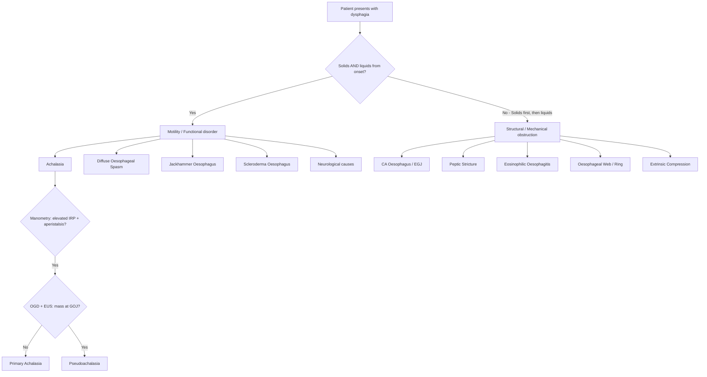
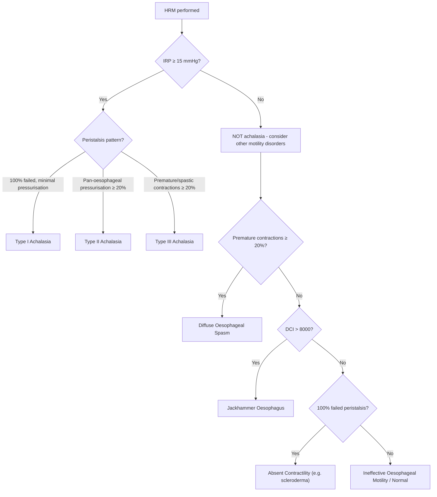

## Differential Diagnosis of Achalasia

When a patient walks in with dysphagia ± regurgitation ± chest pain, your job is to systematically work through the differentials. The key clinical reasoning pivot is: **Is this a motility (functional) problem or a structural (mechanical) problem?** And if it looks like achalasia on manometry, **is it true primary achalasia or something mimicking it?**

Let's break this down from first principles.

---

### The Diagnostic Reasoning Framework

The cardinal symptom of achalasia is **progressive dysphagia to both solids and liquids**. This immediately narrows your differential because:

- **Dysphagia to solids only (initially) → progressive to liquids** = mechanical/structural obstruction (the lumen is physically narrowing)
- **Dysphagia to solids AND liquids from the outset** = motility/functional disorder (the propulsive mechanism is broken, regardless of bolus consistency)

However, several conditions can overlap in presentation. The differentials fall into three categories:

1. **Conditions that mimic the symptoms of achalasia** (dysphagia, regurgitation, heartburn, chest pain)
2. **Conditions that mimic achalasia on manometry** (pseudoachalasia)
3. **Other oesophageal motility disorders** (similar symptom profile but different manometric findings)

---

### Category 1: Conditions That Mimic Achalasia Symptoms

#### 1. ***Gastroesophageal Reflux Disease (GERD)*** [3]

| Feature | GERD | Achalasia |
|:---|:---|:---|
| Heartburn | Yes — from **acid reflux** through a hypotensive LES | Yes — but from **fermentation of retained food** and direct mucosal irritation, NOT acid [3] |
| Regurgitation | Acidic, partially digested material from **stomach** | Undigested food/saliva from **oesophagus** — no bile, no acid (unless fermented) |
| Dysphagia | Late; due to stricture or oesophagitis | Early and progressive; to solids AND liquids |
| Response to PPI | Improves | Does NOT improve (this is a key clinical clue) |

**Why is this a common confusion?** ***Both GERD and achalasia can present with heartburn and regurgitation*** [3]. In early achalasia, patients are frequently misdiagnosed with GERD and started on PPIs. When they don't respond, clinicians should reconsider the diagnosis. The distinguishing investigation is ***oesophageal manometry, which is diagnostic of achalasia*** [3].

<Callout title="Clinical Pearl" type="error">
A patient with "refractory GERD" who fails PPI therapy should have oesophageal manometry to exclude achalasia. The heartburn in achalasia is NOT acid-mediated — PPIs are useless. This is one of the most common diagnostic delays in achalasia (average delay from symptom onset to diagnosis is ~5 years).
</Callout>

#### 2. ***Oesophageal Cancer*** [1][4]

- ***Painless progressive dysphagia*** (over weeks to months) ***is malignancy until proven otherwise*** [5]
- Oesophageal cancer typically causes **progressive dysphagia to solids → then liquids** as the tumour encroaches on the lumen (mechanical pattern)
- However, tumours at the EGJ/cardia can invade the myenteric plexus and cause a **motility-type picture** (pseudoachalasia — see below)
- Red flags: age > 60, rapid weight loss, short symptom duration, anaemia, ***odynophagia*** (usually due to extra-oesophageal involvement) [5]
- Key distinguishing features: ***hoarseness of voice*** (RLN palsy), haematemesis, Virchow's node, supraclavicular lymphadenopathy [5]

#### 3. Peptic Stricture (from chronic GERD)

- Develops as a consequence of chronic oesophagitis → fibrosis → luminal narrowing
- **Progressive dysphagia to solids** in a patient with long-standing GERD/heartburn history
- Distinguished from achalasia: the dysphagia is initially to solids only; there is a clear history of preceding heartburn that DID respond to PPIs; manometry shows normal LES relaxation

#### 4. Eosinophilic Oesophagitis (EoE)

- "Eosinophilic" = eosinophil infiltration; "oesophagitis" = oesophageal inflammation
- Typically young, atopic male (history of asthma, eczema, food allergies)
- Intermittent dysphagia to solids, food impaction episodes
- Distinguished from achalasia: episodic rather than progressive, responds to topical steroids/PPI, manometry shows normal LES relaxation, biopsy shows ≥15 eosinophils/HPF

---

### Category 2: Pseudoachalasia — The Critical Mimic

***Pseudoachalasia*** deserves special attention because it has ***the same manometric findings as achalasia*** [2][3] but is caused by an underlying malignancy or other process.

***Malignancy can cause pseudoachalasia by invading the oesophageal neural plexus directly or by release of humoral factors that disrupt oesophageal function as part of a paraneoplastic syndrome*** [3].

| Feature | Primary Achalasia | Pseudoachalasia |
|:---|:---|:---|
| Age | Any age (peak 35–45) | Typically ***> 60 years*** |
| Symptom duration | Long (months to years) | ***Short (< 1 year)*** |
| Weight loss | Gradual, proportionate | ***Rapid, disproportionate*** |
| Manometry | Elevated IRP, aperistalsis | ***Same findings*** [2][3] |
| OGD | Scope passes GOJ with gentle pressure; dilated oesophagus, food residue | Scope ***cannot pass*** easily; may see mass, mucosal irregularity |
| Barium swallow | Bird beak sign, smooth tapering | ***Shouldering / heaping*** at the distal narrowing [2] — irregular, asymmetric |
| EUS | Thickened muscle layer, no mass | ***Mass at GOJ / thickened wall with loss of layers*** |
| CT | Normal | Mass, lymphadenopathy, metastases |

***Pseudoachalasia can be differentiated from primary achalasia by upper endoscopy and endoscopic ultrasound*** [2][3].

<Callout title="Must-Know: Always OGD Before Diagnosing Primary Achalasia">
You should NEVER diagnose primary achalasia based on manometry alone. ***OGD is mandatory to rule out mechanical causes (e.g. malignancy, stricture)*** [2] and to assess for complications (e.g. oesophagitis, SCC). Up to 4% of patients initially diagnosed with achalasia actually have pseudoachalasia from malignancy. If there is any suspicion, add EUS and CT.
</Callout>

**Causes of pseudoachalasia** [3]:
- **Direct invasion**: adenocarcinoma of gastric cardia/EGJ invading the myenteric plexus
- **Paraneoplastic**: small cell lung cancer, lymphoma (anti-Hu/ANNA-1 antibodies target myenteric neurons)
- **Infiltrative**: amyloidosis, sarcoidosis

---

### Category 3: ***Other Oesophageal Motility Disorders*** [3]

This is the key group to differentiate on manometry. ***Oesophageal manometry can differentiate achalasia from other oesophageal motility disorders since the lower oesophageal sphincter relaxation (integrated relaxation pressure, IRP) is NORMAL in these conditions*** [3].

The fundamental distinction: **In achalasia, IRP is elevated (≥ 15 mmHg). In other motility disorders, IRP is normal.**

| Condition | LES / IRP | Oesophageal Body | Key Distinguishing Feature |
|:---|:---|:---|:---|
| **Achalasia** | ***Elevated IRP (≥ 15 mmHg)*** | Aperistalsis | The gold standard triad |
| ***Diffuse Oesophageal Spasm (DES)*** [3] | **Normal IRP** | Premature contractions (≥20% of swallows) with some normal peristalsis preserved | Intermittent dysphagia + chest pain; "corkscrew oesophagus" on barium swallow; normal peristalsis still present between spasms |
| ***Jackhammer (Nutcracker) Oesophagus*** [3] | **Normal IRP** | Hypercontractile peristalsis (DCI > 8000 mmHg·cm·s) | Extreme force of contraction but peristalsis is intact and sequential; predominant symptom is chest pain rather than dysphagia |
| **Absent Contractility** (e.g., scleroderma) | **Normal or low IRP** | 100% failed peristalsis | LES is hypotensive (unlike achalasia where LES is hypertensive); associated with GERD (incompetent LES + no peristalsis = worst reflux); look for scleroderma features (CREST, skin thickening, Raynaud's) |
| **Opioid-induced dysmotility** | May have elevated IRP | Variable — can mimic achalasia (Type III pattern) | Increasingly recognised; always take a drug history; opioids increase LES tone and disrupt peristalsis via mu-receptor activation in myenteric plexus |

#### Why Does IRP Distinguish These?

The **Integrated Relaxation Pressure (IRP)** specifically measures the adequacy of EGJ (LES) relaxation during the 10-second window after a swallow. In achalasia, the inhibitory neurons that relax the LES are destroyed → the LES cannot relax → IRP is elevated. In DES and Jackhammer oesophagus, the LES neurons are intact — the problem is in the oesophageal body's contraction pattern, not the sphincter.

---

### Structural Differentials (for completeness)

These are less commonly confused with achalasia but should be in your differential for any patient presenting with dysphagia [5]:

| Condition | Mechanism | Key Distinguishing Feature |
|:---|:---|:---|
| **Oesophageal web/ring** (e.g., Schatzki ring) | Thin mucosal fold causing luminal narrowing | Intermittent solid-food dysphagia; Plummer-Vinson syndrome (web + IDA + glossitis) is a risk factor for SCC [4] |
| **Extrinsic compression** | ***Extramural causes (4T): tumour/LN, thyroid (retrosternal goitre), thymus, thoracic aortic aneurysm*** [5] | Dysphagia to solids; evident on CT/barium swallow as extrinsic indentation |
| **Corrosive/caustic stricture** | Prior ingestion of alkali/acid → fibrotic stricture | History of ingestion; ***risk factor for SCC*** [4] |
| ***Zenker's diverticulum*** [6] | Pulsion diverticulum at Killian's dehiscence (between thyropharyngeus and cricopharyngeus) due to ***hypertonic cricopharyngeus*** | ***Dysphagia with gurgling in throat, food regurgitation, foul breath, aspiration*** [6]; diagnosed by barium swallow; this is an **oropharyngeal** (transfer) dysphagia, not oesophageal |
| **Foreign body** | Physical obstruction of lumen | Acute onset; history of ingestion |

---

### Summary Table: Key Differentials at a Glance

| Feature | Achalasia | GERD | Pseudoachalasia | DES | Jackhammer | Scleroderma | CA Oesophagus |
|:---|:---|:---|:---|:---|:---|:---|:---|
| Dysphagia pattern | S+L from onset | Late, solids | S+L (short Hx) | Intermittent S+L | Mainly chest pain | S+L | Solids → liquids |
| LES / IRP | ↑↑ | ↓ or normal | ↑↑ | Normal | Normal | ↓ | N/A (mechanical) |
| Regurgitation | Undigested food | Acidic, partially digested | Undigested | Rare | Rare | Acidic (reflux) | Late |
| Heartburn | Fermentation | Acid reflux | Variable | No | No | Severe (reflux) | No |
| PPI response | No | Yes | No | No | No | Partial | No |
| Age | Any (peak 35–45) | Any | > 60 | Any | Any | 30–50 (F) | > 60 |
| Weight loss | Gradual | No | Rapid | No | No | If systemic | Rapid |
| OGD | Food residue, tight cardia | Oesophagitis | Mass/irregularity | Normal | Normal | Patulous LES | Tumour |

<Callout title="High Yield Summary">

**Three categories of differentials for achalasia:**

1. **Symptom mimics**: GERD (heartburn + regurgitation — distinguish by PPI response and manometry), oesophageal cancer (progressive solids → liquids — distinguish by OGD), peptic stricture, EoE

2. **Manometric mimics (pseudoachalasia)**: Same manometric findings as achalasia. Caused by malignancy invading the neural plexus or paraneoplastic syndrome. Red flags: age > 60, short history, rapid weight loss, shouldering on barium swallow. **Always OGD ± EUS before diagnosing primary achalasia.**

3. **Other motility disorders**: DES and Jackhammer oesophagus have **normal IRP** on manometry (LES relaxation is preserved) — this is the key distinguishing feature. Scleroderma has absent peristalsis but **low** LES pressure (opposite of achalasia).

**Key investigation**: High-resolution manometry (HRM) is the definitive diagnostic tool. **IRP ≥ 15 mmHg** = achalasia (or pseudoachalasia). **Normal IRP** = not achalasia, consider DES/Jackhammer/other.

</Callout>

---

<ActiveRecallQuiz
  title="Active Recall - Differential Diagnosis of Achalasia"
  items={[
    {
      question: "A patient has heartburn and regurgitation. How do you distinguish GERD from achalasia clinically and with investigations?",
      markscheme: "Clinically: GERD heartburn responds to PPI, achalasia does not. GERD regurgitation is acidic and partially digested (from stomach); achalasia regurgitation is undigested food (from oesophagus). Investigation: Oesophageal manometry is diagnostic of achalasia (elevated IRP, aperistalsis, elevated basal LES pressure). In GERD, manometry shows low or normal LES pressure."
    },
    {
      question: "What is pseudoachalasia, what causes it, and how is it differentiated from primary achalasia?",
      markscheme: "Pseudoachalasia = achalasia-like presentation caused by malignancy (not idiopathic neuronal degeneration). Causes: (1) direct invasion of myenteric plexus by carcinoma of gastric cardia/EGJ, (2) paraneoplastic syndrome (humoral factors disrupting oesophageal function). Has SAME manometric findings as primary achalasia. Differentiated by OGD + EUS (mass at GOJ, inability to pass scope, shouldering on barium swallow). Red flags: age > 60, short symptom duration < 1 year, rapid disproportionate weight loss."
    },
    {
      question: "How does oesophageal manometry distinguish achalasia from diffuse oesophageal spasm and jackhammer oesophagus?",
      markscheme: "In achalasia, IRP is elevated (>= 15 mmHg) indicating impaired LES relaxation, with aperistalsis. In DES and Jackhammer oesophagus, IRP is NORMAL (LES relaxation is preserved). DES shows premature contractions in >= 20% of swallows. Jackhammer shows hypercontractile peristalsis (DCI > 8000 mmHg.cm.s). The key differentiating factor is whether IRP is elevated or normal."
    },
    {
      question: "A patient has dysphagia and absent peristalsis on manometry. LES pressure is low. What is the likely diagnosis and how does this differ from achalasia?",
      markscheme: "Likely diagnosis: scleroderma oesophagus (absent contractility). In scleroderma, smooth muscle fibrosis causes both absent peristalsis AND a hypotensive (low pressure) LES, leading to severe GERD. In achalasia, the LES is HYPERtensive (high pressure, fails to relax). Both have absent peristalsis, but LES pressure is the distinguishing factor: low in scleroderma, high in achalasia."
    },
    {
      question: "List 4 red flags that should make you suspect pseudoachalasia rather than primary achalasia.",
      markscheme: "Any 4 of: (1) Age > 60, (2) Short duration of symptoms < 1 year, (3) Rapid or disproportionate weight loss, (4) Difficulty passing endoscope through GOJ, (5) Shouldering or heaping on barium swallow, (6) Mass seen on EUS or CT."
    }
  ]}
/>

## References

[1] Lecture slides: GC 189. I can't swallow oesophageal cancer.pdf
[2] Senior notes: maxim.md (Section 3.4 — Achalasia)
[3] Senior notes: felixlai.md (Section: Achalasia)
[4] Senior notes: maxim.md (Section 3.5 — CA esophagus)
[5] Senior notes: maxim.md (Section 3.2 — Dysphagia)
[6] Senior notes: maxim.md (Section: Zenker's diverticulum)
