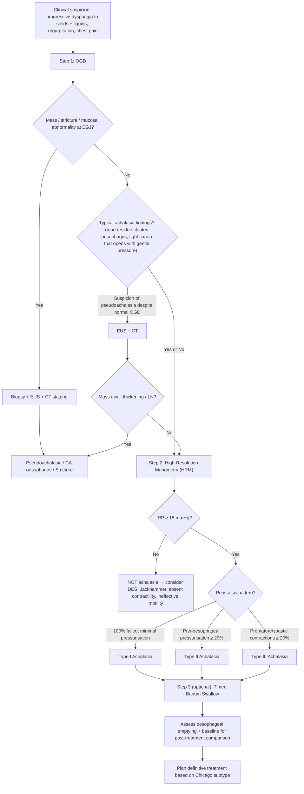

## Diagnostic Criteria, Algorithm & Investigations for Achalasia

### Diagnostic Criteria

There is no single "checklist" diagnostic criterion for achalasia like there is for, say, rheumatic fever. Instead, the diagnosis rests on **demonstrating the characteristic manometric triad** while **excluding mechanical obstruction and pseudoachalasia**. Let's build this from first principles.

#### The Manometric Triad (Definitive Diagnostic Criteria)

***High-resolution oesophageal manometry (HRM) is the definitive diagnostic investigation*** [2][3]. The diagnosis requires demonstrating:

| Criterion | What It Means | Why It Occurs |
|:---|:---|:---|
| **1. *Elevated Integrated Relaxation Pressure (IRP) ≥ 15 mmHg*** [3] | The LES fails to adequately relax during swallowing | Loss of inhibitory neurons (NO/VIP) → unopposed excitatory cholinergic tone keeps the LES tonically contracted |
| **2. *Absence of normal peristalsis*** [3] | No coordinated sequential contractions in the oesophageal body (100% failed peristalsis in Types I/II; spastic pattern in Type III) | Loss of inhibitory innervation in the smooth muscle oesophageal body → no coordinated "on-off" sequencing needed for peristalsis |
| **3. *Elevated resting LES pressure*** [2][3] | Basal LES tone is higher than normal ( > 45 mmHg in many cases, though not required for diagnosis) | Same mechanism as criterion 1: unopposed ACh at rest keeps LES contracted |

<Callout title="IRP — Understanding the Key Metric">

***IRP is the median of the maximal relaxation pressures of the EGJ measured across 4 seconds during the 10-second window of EGJ relaxation following a swallow*** [3]. In plain English: after you swallow, the system looks at a 10-second window and picks the 4 consecutive seconds where the EGJ pressure is lowest — the median of those pressures is the IRP.

***Upper limit of IRP is usually identified as ≥ 15 mmHg*** [3]. If the IRP is ≥ 15 mmHg, the LES is NOT relaxing properly — this is the single most important number in diagnosing achalasia.

Why is IRP better than just measuring "LES relaxation"? Because IRP accounts for the entire EGJ (including the crural diaphragm contribution) and is standardised — it's more reproducible and more specific than older measures.
</Callout>

#### Additional Required Step: Exclude Pseudoachalasia

Manometry alone is **insufficient** for a complete diagnosis. ***OGD is mandatory to rule out mechanical causes (e.g. malignancy, stricture)*** that can produce identical manometric findings [2][3].

> **Diagnostic formula: Achalasia = Manometric triad (HRM) + Exclusion of pseudoachalasia (OGD ± EUS/CT)**

---

### Chicago Classification v4.0 (2021) — Subtyping on HRM

Once the manometric triad is confirmed, the **Chicago Classification** (based on ***oesophageal pressure topography***) [2] subcategorises achalasia into three types. This matters because it guides treatment selection and predicts outcomes.

| Subtype | HRM Pattern | Description | Treatment Implication |
|:---|:---|:---|:---|
| ***Type I: Achalasia with minimal oesophageal pressurisation*** [2] | Elevated IRP + 100% failed peristalsis + **no significant pan-oesophageal pressurisation** | The oesophageal body is essentially flaccid — it generates no meaningful pressure. Think of it as a floppy, dilated tube above a locked gate | Intermediate response to treatment; Heller myotomy or POEM |
| ***Type II: Achalasia with oesophageal compression (pan-oesophageal pressurisation)*** [2] | Elevated IRP + **pan-oesophageal pressurisation in ≥ 20% of swallows** | The entire oesophagus contracts simultaneously (uniform squeeze), generating > 30 mmHg across the whole length. Not peristalsis (which is sequential), but rather a mass contraction | ***Best prognosis***; ~95% respond to any treatment modality |
| ***Type III: Achalasia with oesophageal spasm*** [2] | Elevated IRP + **premature (spastic) contractions with DCI > 450 mmHg·cm·s in ≥ 20% of swallows** | Vigorous, premature, lumen-obliterating contractions. Some fragments of peristaltic activity remain but are discoordinated | ***Worst prognosis***; POEM preferred (myotomy can be extended along the spastic oesophageal body) |

<Callout title="Why Type II Has the Best Prognosis" type="idea">
Type II has pan-oesophageal pressurisation — the oesophagus still has some residual muscular activity (even though it's not coordinated). When you treat the LES obstruction (e.g., myotomy, dilation), this residual pressure helps push food through. In Type I, the oesophagus is completely flaccid — even after LES treatment, there's no propulsive force, so food relies on gravity alone. Type III has spasm, which causes ongoing symptoms (chest pain) even after LES treatment.
</Callout>

---

### Diagnostic Algorithm

The approach follows a logical sequence: **clinical suspicion → exclude mechanical cause → confirm with manometry → subtype → plan treatment**.

**Key reasoning at each step:**

1. **OGD first** — because you must exclude pseudoachalasia/malignancy before labelling someone with primary achalasia. It's also necessary to assess for complications (oesophagitis, candidiasis, early SCC) [2][3]
2. **HRM second** — the definitive diagnostic test; classifies the subtype
3. **Timed barium swallow** — optional but useful as a baseline to objectively assess oesophageal emptying pre- and post-treatment
4. **EUS/CT** — reserved for cases where pseudoachalasia is suspected

---

### Investigation Modalities: Detailed Breakdown

#### 1. ***High-Resolution Oesophageal Manometry (HRM)*** — The Definitive Diagnostic Test

**What it is**: A catheter with closely spaced pressure sensors (typically 36 sensors, 1 cm apart) is passed transnasally into the oesophagus and stomach. The patient performs a series of standardised wet swallows (typically 10 × 5 mL water swallows). Pressure data is displayed as a colour-coded **oesophageal pressure topography (EPT)** plot (Clouse plot) — essentially a "heat map" of pressure along the oesophagus over time [2][3].

**Why HRM over conventional manometry?** Conventional (line-tracing) manometry used fewer sensors and produced simple line graphs. HRM provides a complete spatial-temporal pressure map of the entire oesophagus simultaneously, making it much easier to identify patterns, calculate IRP accurately, and subtype according to the Chicago Classification.

***Definitive diagnostic findings*** [2][3]:

| Parameter | Finding in Achalasia | Normal Value |
|:---|:---|:---|
| ***Integrated Relaxation Pressure (IRP)*** | ***≥ 15 mmHg*** [3] | < 15 mmHg |
| ***Resting LES pressure*** | ***Elevated*** (often > 45 mmHg) [3] | 10–45 mmHg |
| ***LES relaxation on swallowing*** | ***Incomplete / failure to relax*** [2][3] | Complete relaxation to near gastric baseline |
| ***Peristalsis*** | ***Absent normal peristalsis*** [2][3]; pattern depends on Chicago subtype | Normal sequential peristaltic contractions |

***Chicago Classification on HRM*** [2]:

| Subtype | EPT Pattern |
|:---|:---|
| ***Type I*** | IRP ≥ 15 + 100% failed peristalsis + **mean integrated relaxation pressure < 30 mmHg across the oesophageal body** (minimal pressurisation) |
| ***Type II*** | IRP ≥ 15 + **≥ 20% of swallows show pan-oesophageal pressurisation > 30 mmHg** |
| ***Type III*** | IRP ≥ 15 + **≥ 20% of swallows show premature (spastic) contractions** (DCI > 450 mmHg·cm·s with shortened distal latency < 4.5 s) |

<Callout title="Exam Pearl: Why IRP and Not Just 'LES Pressure'?" type="idea">
Older textbooks describe "elevated resting LES pressure" as a diagnostic criterion, and it IS typically elevated in achalasia. However, the **IRP** is the criterion used in the Chicago Classification because: (1) some achalasia patients have normal basal LES pressure but still fail to relax on swallowing; (2) IRP specifically measures the *dynamic relaxation* during swallowing, which is the pathophysiologically relevant event (the LES needs to relax to let food through — it doesn't matter what the resting pressure is if it relaxes properly). A high IRP = failure to relax = diagnostic.
</Callout>

---

#### 2. ***OGD (Oesophago-gastro-duodenoscopy)*** — Mandatory First-Line

**Purpose**: ***To assess complications (e.g. oesophagitis, SCC oesophagus) and rule out mechanical causes (e.g. malignancy, stricture)*** [2].

***OGD must be performed in ALL patients with suspected achalasia*** before the diagnosis of primary achalasia is accepted. This is non-negotiable.

***Key findings*** [2][3]:

| Finding | Significance | Pathophysiological Basis |
|:---|:---|:---|
| ***Dilated oesophagus containing residual material*** [3] | Hallmark of achalasia | Failed peristalsis + non-relaxing LES → food/liquid stasis → oesophageal dilation |
| ***Tight cardia (LES) that does not open spontaneously*** [2] | Suggests impaired LES relaxation | Hypertonic LES fails to relax |
| ***LES can be traversed with gentle pressure*** [3] | Distinguishes primary achalasia from pseudoachalasia | In primary achalasia, the tight LES is purely due to muscle spasm (functional) — it yields to gentle pressure. In pseudoachalasia from tumour, the obstruction is physical/infiltrative and the scope may NOT pass easily |
| **Food residue, candidiasis, oesophagitis** | Complications of chronic stasis | Retained food causes mucosal irritation; stasis predisposes to Candida overgrowth |
| **Mucosal irregularity / nodularity** | Raises concern for dysplasia/SCC | Chronic irritation → metaplasia → dysplasia → SCC |

***Up to 40% of patients with achalasia have a normal OGD*** [3]. This is why manometry is the definitive test — a normal OGD does NOT exclude achalasia.

<Callout title="Critical Point" type="error">
***OGD findings in pseudoachalasia***: scope **cannot** pass through GOJ easily; there may be mucosal irregularity, mass, ulceration, or ***shouldering/heaping*** at the narrowing. If you cannot pass the scope or see any suspicious features → proceed to **EUS + CT** immediately [2].
</Callout>

---

#### 3. ***Barium Swallow*** — Supportive / Baseline Assessment

***Barium swallow is usually not done now*** as the primary diagnostic tool [2], but it remains useful for:
- Assessing oesophageal emptying and EGJ morphology [3]
- Providing a **baseline** for post-treatment comparison (timed barium swallow)
- Detecting **sigmoid oesophagus** (end-stage dilation)

***Typical findings*** [2][3]:

| Finding | Stage | Explanation |
|:---|:---|:---|
| ***Bird's beak sign (or "rat-tail" appearance)*** [2][3] | Early-moderate | ***Hold up of contrast with tapering stricture in distal oesophagus and proximal dilation*** [2]. The contrast column tapers smoothly to a point at the non-relaxing LES, resembling a bird's beak. The tapered segment is smooth and symmetric (because it's muscular spasm, not tumour) |
| ***Aperistalsis*** [3] | Any stage | No sequential peristaltic waves seen on fluoroscopy; contrast stays in the oesophagus |
| ***Delayed emptying*** [3] | Any stage | Contrast does not empty into the stomach in the normal time frame |
| ***Dilatation of oesophagus with narrowing of distal oesophagus*** [3] | Moderate-late | Progressive proximal dilation above the functional obstruction |
| ***Sigmoid-like appearance*** [2] | Late/end-stage | ***Massive oesophageal dilatation*** [2] causing the oesophagus to become tortuous and S-shaped, like a sigmoid colon — the "sigmoid oesophagus" or "megaoesophagus". Indicates decompensated, long-standing disease |

**Red flag on barium swallow**: ***Any shouldering or heaping should lead to suspicion of pseudoachalasia (due to extramural obstruction, e.g. OGJ tumour)*** [2]. In primary achalasia the tapering is smooth; in pseudoachalasia it is irregular, asymmetric, or has a "shelf-like" appearance.

**Timed Barium Swallow (TBS)**: The patient drinks a set volume of barium (e.g., 200 mL); upright films are taken at 1, 2, and 5 minutes. The height of the barium column is measured. This is used:
- Pre-treatment: as a baseline
- Post-treatment: to objectively assess oesophageal emptying (a reduction in column height indicates treatment success)

#### Barium vs Gastrografin — When to Use What [2]

| Contrast | When to Avoid | Why |
|:---|:---|:---|
| ***Barium*** | ***Risk of perforation*** | ***Barium peritonitis*** — barium is inert and non-absorbable; if it leaks into the mediastinum or peritoneum, it causes a severe granulomatous inflammatory reaction |
| ***Gastrografin (water-soluble, hyperosmolar)*** | ***Risk of aspiration*** | ***Chemical pneumonitis*** — gastrografin is hyperosmolar; if aspirated, it draws fluid into the alveoli via osmosis causing pulmonary oedema and chemical pneumonitis [2][5] |

> **If high risk of aspiration**: use ***Omnipaque*** (water-soluble, **low-osmolarity** contrast medium — lower risk of pulmonary oedema compared to gastrografin) [5]

<Callout title="Practical Tip for Achalasia Patients" type="idea">
Achalasia patients are at risk of **aspiration** (regurgitation of pooled oesophageal contents). If you need contrast imaging, gastrografin is NOT ideal because of the aspiration risk. Use barium (safe from an aspiration standpoint as it is inert in the lungs) or Omnipaque if perforation risk is also a concern. In practice, most achalasia patients undergoing barium swallow can use standard barium safely — perforation is not typically a concern unless there's been prior intervention.
</Callout>

---

#### 4. ***CXR (Chest X-Ray)*** — Simple Screening / Incidental Finding

CXR is not diagnostic but may provide clues, especially in advanced disease [2][3]:

| Finding | Explanation |
|:---|:---|
| ***Widening of mediastinum*** [2][3] | The massively dilated oesophagus occupies space in the posterior mediastinum, widening the mediastinal silhouette on PA film |
| ***Absence of normal gastric bubble*** [3] | ***Failure of LES relaxation prevents air from entering the stomach*** [3]. Normally, swallowed air passes through the LES into the gastric fundus, producing the gastric air bubble on the left hemidiaphragm. In achalasia, the non-relaxing LES traps air in the oesophagus |
| **Air-fluid level in posterior mediastinum** | Retained food/fluid in the dilated oesophagus creates an air-fluid level visible on lateral CXR |
| **Double right heart border** | The dilated oesophagus projects over the right heart border, creating a double contour |
| **Aspiration changes** | Bilateral lower lobe infiltrates if recurrent aspiration pneumonia |

<Callout title="The Absent Gastric Bubble — A Subtle but Classic Sign">
This is a favourite exam question. ***The absence of a gastric bubble on CXR*** in a patient with dysphagia is a classic clue to achalasia [3]. The reasoning: normally you swallow air with every meal and this air passes through the LES into the stomach → gastric bubble on CXR. In achalasia, the LES won't open → air cannot enter the stomach → no gastric bubble.
</Callout>

---

#### 5. ***Endoscopic Ultrasound (EUS)*** — For Pseudoachalasia Workup

**Not routine** in primary achalasia, but critical when pseudoachalasia is suspected.

**Purpose**: ***Useful in characterizing tumours of distal oesophagus and gastric cardia*** [3].

***Typical findings in primary achalasia*** [3]:
- ***Thickened circular muscle layer at LES and through smooth muscle oesophagus*** — reflecting smooth muscle hypertrophy from chronic unopposed excitatory stimulation
- Normal wall layer architecture preserved

**Findings suggesting pseudoachalasia**:
- Loss of normal wall layer architecture
- Hypoechoic mass at the EGJ
- Transmural thickening with disrupted layers
- Periesophageal lymphadenopathy

**EUS-guided FNA** can be performed on suspicious lymph nodes or masses for cytological diagnosis.

---

#### 6. CT Scan (Chest/Abdomen with Contrast)

**Not part of the routine diagnostic workup** for primary achalasia, but used when:
- Pseudoachalasia is suspected (look for EGJ mass, lymphadenopathy, metastases)
- Preoperative assessment for advanced/end-stage disease (assess oesophageal diameter, angulation for surgical planning)
- Evaluating complications (aspiration pneumonia, mediastinal abnormalities)

CT findings in achalasia:
- Dilated, fluid-filled oesophagus
- Smooth, concentric thickening of the distal oesophageal wall (in primary achalasia)
- Air-fluid level within the oesophagus

CT findings suggesting pseudoachalasia:
- Irregular/asymmetric wall thickening at EGJ
- Mass lesion
- Lymphadenopathy, distant metastases

---

#### 7. Functional Lumen Imaging Probe (FLIP) — Emerging Investigation

FLIP is a newer technology that measures the **distensibility** of the EGJ. A balloon catheter is placed across the LES and inflated with saline; sensors measure cross-sectional area and pressure simultaneously to calculate a **distensibility index (DI)**.

- In achalasia: the EGJ distensibility is markedly reduced (the LES won't stretch open)
- Used adjunctively when HRM is equivocal or to assess treatment adequacy intraoperatively (e.g., during POEM, the surgeon can check if the LES DI has normalised)
- Not yet standard in all centres but increasingly used in tertiary oesophageal centres

---

### Summary: Investigation Hierarchy

| Priority | Investigation | Purpose | Key Finding |
|:---|:---|:---|:---|
| **1st** | ***OGD*** [2][3] | Exclude pseudoachalasia and mechanical causes; assess complications | Food residue, tight cardia traversable with gentle pressure; normal in up to 40% |
| **2nd** | ***High-Resolution Manometry (HRM)*** [2][3] | **Definitive diagnosis** + Chicago subtyping | IRP ≥ 15 mmHg, absent peristalsis, elevated basal LES pressure |
| **3rd (optional)** | ***Barium swallow / Timed Barium Swallow*** [2][3] | Assess morphology, baseline for post-treatment comparison | Bird's beak sign, dilation, delayed emptying, sigmoid oesophagus |
| **4th (if needed)** | ***CXR*** [2][3] | Screening / incidental | Widened mediastinum, absent gastric bubble |
| **5th (if pseudoachalasia suspected)** | ***EUS ± CT*** [2][3] | Characterise suspected tumour | Mass, wall thickening, lymphadenopathy |
| **Emerging** | **FLIP** | Measure EGJ distensibility | Reduced distensibility index |

---

<Callout title="High Yield Summary">

**Definitive diagnosis** = High-Resolution Manometry (HRM) showing the triad: (1) IRP ≥ 15 mmHg, (2) absent normal peristalsis, (3) elevated basal LES pressure. Chicago Classification v4.0 subtypes based on oesophageal body pattern: Type I (minimal pressurisation), Type II (pan-oesophageal pressurisation — best prognosis), Type III (spastic — worst prognosis).

**OGD is mandatory FIRST** to exclude pseudoachalasia and assess complications. Up to 40% of achalasia patients have normal OGD — a normal scope does NOT exclude achalasia. Typical findings: dilated oesophagus with food residue, tight cardia that opens with gentle pressure.

**Barium swallow**: bird's beak sign (smooth tapering at LES), proximal dilation, sigmoid oesophagus in late disease. Shouldering/heaping = pseudoachalasia red flag. Usually not done now as primary diagnostic tool.

**CXR**: widened mediastinum + absent gastric bubble (air cannot enter stomach through non-relaxing LES).

**EUS**: for pseudoachalasia workup — characterise EGJ tumours. In primary achalasia shows thickened circular muscle layer.

**Contrast safety**: Barium — avoid if perforation risk (barium peritonitis). Gastrografin — avoid if aspiration risk (chemical pneumonitis). Omnipaque — safest if both risks present.

</Callout>

---

<ActiveRecallQuiz
  title="Active Recall - Diagnosis & Investigations for Achalasia"
  items={[
    {
      question: "What is the definitive diagnostic investigation for achalasia and what three findings must be present?",
      markscheme: "High-Resolution Oesophageal Manometry (HRM). Three findings: (1) Elevated IRP >= 15 mmHg (impaired LES relaxation), (2) Absence of normal peristalsis in oesophageal body, (3) Elevated resting LES pressure. These constitute the diagnostic triad."
    },
    {
      question: "Define IRP and explain why it is used instead of simple LES pressure measurement for diagnosing achalasia.",
      markscheme: "IRP = Integrated Relaxation Pressure = median of maximal relaxation pressures of EGJ over 4 seconds during the 10-second window of EGJ relaxation after swallowing. Upper limit >= 15 mmHg. IRP is preferred because it specifically measures DYNAMIC relaxation during swallowing (the pathophysiologically relevant event), not just resting tone. Some patients may have normal basal LES pressure but still fail to relax on swallowing. IRP also accounts for crural diaphragm contribution and is more reproducible."
    },
    {
      question: "Why must OGD be performed before confirming primary achalasia, and what are the typical OGD findings?",
      markscheme: "OGD must exclude pseudoachalasia (malignancy at EGJ mimicking achalasia with identical manometric findings) and assess for complications (oesophagitis, SCC). Typical findings: dilated oesophagus with food residue, tight cardia that opens with gentle pressure. However, up to 40% have normal OGD, so normal OGD does NOT exclude achalasia — manometry is still needed."
    },
    {
      question: "Describe the bird's beak sign on barium swallow. What finding on barium swallow should raise suspicion for pseudoachalasia?",
      markscheme: "Bird's beak sign: smooth tapering of contrast at the distal oesophagus (non-relaxing LES) with proximal oesophageal dilation and hold-up of contrast. The tapering is smooth and symmetric. Pseudoachalasia red flag: shouldering or heaping at the distal narrowing — irregular, asymmetric tapering suggesting extramural obstruction (e.g. OGJ tumour)."
    },
    {
      question: "Explain why the gastric bubble is absent on CXR in achalasia.",
      markscheme: "Normally, swallowed air passes through the LES into the gastric fundus, producing the gastric air bubble visible on CXR. In achalasia, the LES fails to relax, so air cannot pass from the oesophagus into the stomach. Therefore the gastric bubble is absent."
    },
    {
      question: "When should you use barium vs gastrografin vs Omnipaque contrast, and what are the risks of each?",
      markscheme: "Barium: standard use; avoid if risk of perforation because barium causes severe granulomatous peritonitis/mediastinitis. Gastrografin: water-soluble, safe if perforation risk; avoid if risk of aspiration because it is hyperosmolar and causes chemical pneumonitis by drawing fluid into alveoli. Omnipaque: water-soluble with LOW osmolarity; safest if both perforation and aspiration risks are present (lower risk of pulmonary oedema than gastrografin)."
    }
  ]}
/>

## References

[2] Senior notes: maxim.md (Section 3.4 — Achalasia)
[3] Senior notes: felixlai.md (Section: Achalasia, Section VI. Diagnosis)
[5] Senior notes: maxim.md (Section 3.2 — Dysphagia)
