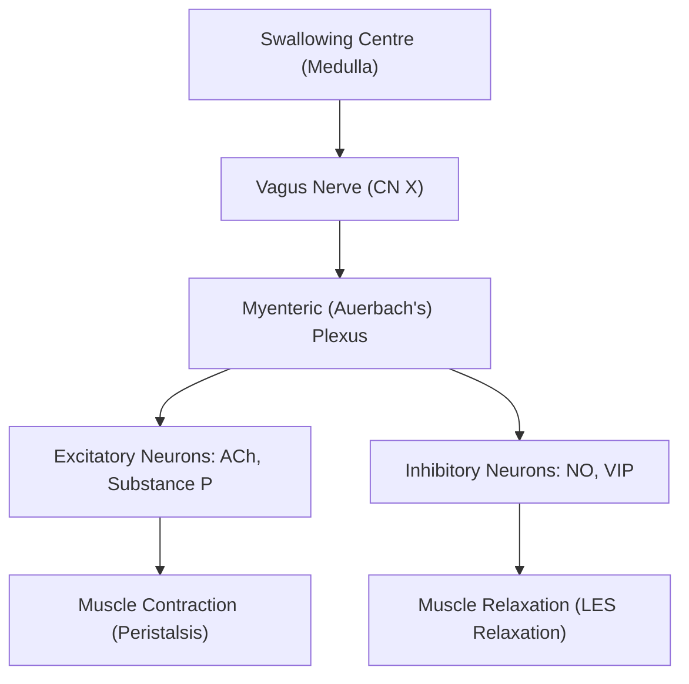
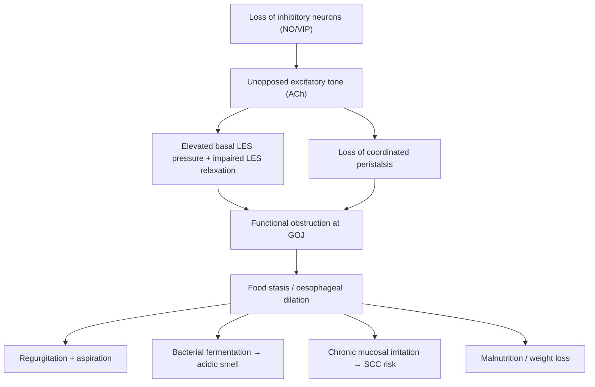
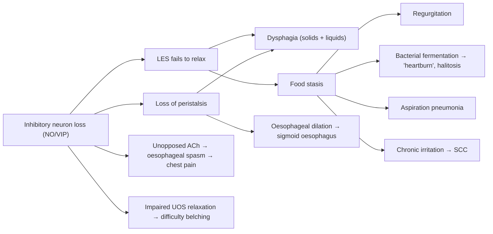

# Achalasia

## Definition

Achalasia — from the Greek "a-" (without) + "khalasis" (relaxation). The name literally tells you the disease: **failure of relaxation**.

***Achalasia is the most common primary oesophageal motility disorder***, characterised by a ***triad*** of [1][2]:

1. ***Aperistalsis with uncoordinated contraction*** of the oesophageal body
2. ***Increased LES (lower oesophageal sphincter) tone at rest*** (elevated basal LES pressure)
3. ***Poor LES relaxation in response to swallowing***

The net result: food cannot pass efficiently through the oesophagus into the stomach. The oesophagus dilates progressively over time, loses its coordinated peristaltic function, and essentially becomes a baggy, non-propulsive tube sitting above a persistently tight sphincter.

<Callout title="Why does this matter clinically?">
Achalasia is a chronic, progressive condition. It increases the risk of oesophageal squamous cell carcinoma (SCC) — the chronically dilated, stagnant oesophagus with retained food and chronic mucosal irritation drives metaplastic and eventually dysplastic change. This is why long-term surveillance and definitive treatment matter [3][4].
</Callout>

---

## Epidemiology

| Feature | Detail |
|:---|:---|
| Incidence | ~1–3 per 100,000 per year worldwide |
| Prevalence | ~10 per 100,000 |
| Sex | Males and females equally affected [3] |
| Age | ***Most common age 35–45*** [2], but can occur at any age; onset before adolescence is rare [3] |
| Geography | No strong geographic predilection for primary achalasia; secondary achalasia from Chagas disease is predominantly South/Central America [3] |
| Hong Kong relevance | Primary (idiopathic) achalasia; Chagas disease essentially non-existent in HK. Pseudoachalasia from carcinoma of the cardia/EGJ is an important differential in the local population given the prevalence of gastric/EGJ malignancy in East Asians [1] |

<Callout title="Exam Pearl" type="idea">
Unlike most oesophageal conditions (e.g., oesophageal cancer has strong male preponderance), achalasia has **no sex predominance**. If a question mentions equal male:female ratio + progressive dysphagia to solids AND liquids, think achalasia.
</Callout>

---

## Anatomy & Functional Review

To understand achalasia, you need to understand normal oesophageal swallowing physiology from first principles.

### Oesophageal Anatomy

- **Length**: ~25 cm from the cricopharyngeus (C6) to the cardia (T11)
- **Wall layers** (inside → out): mucosa (stratified squamous epithelium), submucosa, muscularis propria (inner circular + outer longitudinal), adventitia (no serosa in most of the oesophagus — this is why oesophageal perforation is so catastrophic and why oesophageal cancers spread easily)
- **Muscle type transition**:
  - Upper 1/3: striated (skeletal) muscle
  - Lower 2/3: smooth muscle — **this is the portion affected in achalasia**
- **Sphincters**:
  - **Upper Oesophageal Sphincter (UOS)**: cricopharyngeus muscle (striated); prevents air swallowing
  - **Lower Oesophageal Sphincter (LES)**: 3–4 cm zone of tonically contracted smooth muscle at the gastro-oesophageal junction (GOJ); resting pressure ~15–25 mmHg; prevents gastric acid reflux

### Neural Control of Swallowing

The key to understanding achalasia lies in the **myenteric (Auerbach's) plexus** — the neural network sandwiched between the inner circular and outer longitudinal muscle layers of the oesophagus.

**Normal physiology of the LES during swallowing:**

1. A food bolus triggers the swallowing reflex
2. The vagus nerve activates the myenteric plexus
3. **Inhibitory neurons** (releasing **nitric oxide [NO]** and **vasoactive intestinal peptide [VIP]**) cause the LES smooth muscle to **relax** — this is called **receptive relaxation** (or deglutitive relaxation)
4. Simultaneously, sequential activation of excitatory neurons (releasing **acetylcholine [ACh]**) above the bolus creates a **peristaltic wave** that propels the bolus distally
5. After bolus passage, the LES regains its tonic contraction

**In achalasia, it is specifically the INHIBITORY neurons (NO/VIP) that degenerate.** The excitatory neurons (ACh) are relatively preserved or unopposed. This creates the perfect storm:

- **LES cannot relax** → functional obstruction at the GOJ
- **Peristalsis is lost** → the oesophageal body cannot propel food downward
- **Basal LES pressure is elevated** → due to unopposed excitatory (cholinergic) tone

<Callout title="First Principles: Why Dysphagia to Both Solids AND Liquids?">
In mechanical obstruction (e.g., stricture, cancer), solids are affected first because they are physically too large to pass. Liquids can still trickle through until the obstruction is very tight.

In achalasia, the problem is **neuromuscular** — the LES doesn't relax AND there's no peristalsis to push anything through. Both solids and liquids are affected from the outset. Gravity helps liquids somewhat, but the fundamental propulsive mechanism is gone. This is why **simultaneous dysphagia to solids and liquids** is the hallmark of a motility disorder, not a mechanical obstruction.
</Callout>

---

## Aetiology

### Primary Achalasia (Idiopathic) — >90% of cases

- ***Cause: primary/idiopathic*** [2][3]
- Result of **inflammation and progressive degeneration of ganglion cells** in the **myenteric (Auerbach's) plexus** of the oesophageal wall [3]
- Specifically targets **inhibitory neurons** (NO/VIP-producing neurons)
- The trigger for this neural degeneration is unknown, but hypotheses include:
  - **Autoimmune**: anti-myenteric neuronal antibodies have been found; association with HLA-DQw1; chronic inflammatory infiltrates (predominantly T-lymphocytes) found in the myenteric plexus on histology
  - **Viral trigger**: some evidence for herpes simplex virus (HSV-1) and measles virus as potential triggers of the autoimmune process
  - **Genetic**: rare familial cases; association with Allgrove syndrome (triple A syndrome: achalasia, alacrima [absent tears], adrenal insufficiency — autosomal recessive, AAAS gene)

### Secondary Achalasia

| Cause | Mechanism | Notes |
|:---|:---|:---|
| ***Chagas disease*** | ***Degeneration of myenteric plexus due to Trypanosoma cruzi infection*** [2][3] | Protozoan parasite; ***occurs predominantly in South and Central America*** [3]; oesophageal involvement in ~7–10% of infected patients; also affects colon (megacolon) and heart (cardiomyopathy) |
| ***Pseudoachalasia — Malignancy at EGJ*** | ***Malignancy can cause pseudoachalasia by invading the oesophageal neural plexus directly*** (e.g., adenocarcinoma of cardia/EGJ) [2][3] | Important differential in HK given prevalence of gastric cardia tumours |
| ***Paraneoplastic syndrome*** | ***Release of uncharacterized humoral factors that disrupt oesophageal function as part of paraneoplastic syndrome*** [3] | Associated with small cell lung cancer, lymphoma; anti-Hu antibodies (ANNA-1) |
| ***Infiltrative disorders*** | Deposition/granuloma formation disrupts neural plexus | ***Amyloidosis, sarcoidosis*** [3] |
| Post-surgical (e.g., Nissen fundoplication) | Mechanical disruption/over-tightening at GOJ | Mimics achalasia functionally |
| Eosinophilic oesophagitis | Eosinophilic infiltration of oesophageal wall | Rare cause |

<Callout title="Pseudoachalasia — The 'Red Flag' Mimic" type="error">
***Pseudoachalasia has the same manometric findings as primary achalasia*** but is caused by malignancy [2][3]. It accounts for ~4% of cases presenting with achalasia-like features. Clinical red flags for pseudoachalasia:
- **Age > 60** with short duration of symptoms (< 1 year)
- **Rapid, significant weight loss** disproportionate to dysphagia severity
- **Difficulty passing the endoscope through the GOJ** (in primary achalasia, the scope usually "pops" through with gentle pressure)
- **CT/EUS showing a mass** at the GOJ

***Differentiated by upper endoscopy and endoscopic ultrasound (EUS)*** [2][3]. Always perform OGD before committing to a diagnosis of primary achalasia.
</Callout>

### Hong Kong Context

In Hong Kong [1][4]:
- **Primary (idiopathic) achalasia** is the dominant form
- Chagas disease is essentially non-existent (no endemic transmission of *T. cruzi*)
- ***Pseudoachalasia from malignancy (particularly gastric cardia/EGJ adenocarcinoma)*** must always be excluded — this is especially important given that ***SCC is the most common oesophageal cancer in HK (90%)*** [4], and ***achalasia itself is a risk factor for oesophageal SCC*** [1][3][4]
- ***Achalasia is listed as a risk factor for SCC*** alongside smoking, alcohol, hot drinks, nitrosamines, corrosive injury, Plummer-Vinson syndrome, and tylosis [4]

---

## Pathophysiology — Detailed

Let's walk through the pathophysiological cascade from the molecular level to the clinical presentation:

### Step 1: Neuronal Degeneration

***Degeneration of inhibitory neurons (NO/VIP) in myenteric (Auerbach's) plexus → unopposed activity of excitatory neurons (ACh)*** [2]

- Histology shows: lymphocytic myenteric ganglionitis → progressive ganglion cell loss → eventual fibrosis of the myenteric plexus
- The process is **progressive**: ***initially presented with uncoordinated peristalsis → eventually aperistalsis*** [2]

### Step 2: LES Dysfunction

- **Loss of inhibitory neurons in LES** → LES smooth muscle cannot relax during swallowing
- **Basal LES pressure rises** because excitatory cholinergic tone is unopposed
- The LES becomes a **functional obstruction** — food piles up above it

### Step 3: Oesophageal Body Dysfunction

- Loss of inhibitory innervation in the **smooth muscle portion** (distal 2/3) → loss of coordinated peristalsis
- The oesophagus can no longer generate the sequential contraction waves needed to propel food distally
- **Three patterns emerge** (this is the basis of the Chicago Classification):
  - ***Type I***: Minimal oesophageal pressurisation — the oesophageal body is essentially flaccid; no effective contraction [2]
  - ***Type II***: Pan-oesophageal pressurisation — the entire oesophageal body contracts simultaneously (like squeezing a tube of toothpaste from all sides at once — no net propulsion, but some compression) [2]
  - ***Type III***: Spastic contractions — premature, vigorous, discoordinated lumen-obliterating spasms [2]

### Step 4: Progressive Oesophageal Dilation

- With chronic functional obstruction → the oesophagus dilates over months to years
- Eventually becomes massively dilated and tortuous — **"sigmoid oesophagus"**
- Retained food undergoes **bacterial fermentation** → produces lactic acid and gas
- Chronic food stasis → **mucosal irritation** → oesophagitis → risk of **squamous cell carcinoma**

### Step 5: Secondary Complications

- **Aspiration**: regurgitated stagnant food/saliva enters the airway → recurrent aspiration pneumonia
- **Malnutrition/weight loss**: inability to eat adequately
- **Oesophageal cancer**: chronically irritated, dilated oesophagus → SCC (estimated 30× increased risk; approximately 3% lifetime risk)

---

## Classification

### Chicago Classification (v4.0, 2021) — Based on High-Resolution Manometry (HRM)

This is the standard classification used worldwide and is based on **oesophageal pressure topography (EPT)** patterns on HRM [2].

| Type | HRM Pattern | Oesophageal Body | Prognosis/Treatment Response |
|:---|:---|:---|:---|
| ***Type I*** | ***Achalasia with minimal oesophageal pressurisation*** [2] | Flaccid, dilated, no residual peristalsis; 100% failed swallows with no significant pressurisation | Intermediate response to treatment |
| ***Type II*** | ***Achalasia with oesophageal compression (pan-oesophageal pressurisation)*** [2] | Simultaneous pan-oesophageal pressurisation in ≥20% of swallows | **Best prognosis**; best response to all treatments (~95% success with Heller myotomy or POEM) |
| ***Type III*** | ***Achalasia with oesophageal spasm*** [2] | Premature (spastic) contractions in ≥20% of swallows; retained fragments of distal peristalsis | **Worst prognosis**; least responsive to treatment; often requires POEM (can extend myotomy onto oesophageal body) |

<Callout title="Why Does Classification Matter?">
The Chicago Classification is not just academic — it guides treatment decisions:
- **Type II** responds well to almost any intervention (pneumatic dilation, Heller myotomy, POEM)
- **Type III** responds poorly to pneumatic dilation and standard Heller myotomy; POEM is preferred because the myotomy can be extended proximally along the oesophageal body to address the spastic segment
- **Type I** is intermediate
</Callout>

### Eckardt Score — Clinical Severity Grading

Used to assess symptom severity and treatment response:

| Symptom | 0 | 1 | 2 | 3 |
|:---|:---|:---|:---|:---|
| Dysphagia | None | Occasional | Daily | Every meal |
| Regurgitation | None | Occasional | Daily | Every meal |
| Chest pain | None | Occasional | Daily | Every meal |
| Weight loss (kg) | None | < 5 | 5–10 | > 10 |

- **Total score 0–12**
- **Score ≤ 3** = remission (treatment success)
- **Score > 3** = treatment failure; consider re-intervention

---

## Clinical Features

### Symptoms

| Symptom | Frequency | Pathophysiological Basis |
|:---|:---|:---|
| ***Progressive dysphagia (solid + liquid)*** [2][3] | ~100% | Loss of peristalsis + failure of LES relaxation → functional obstruction to ALL consistencies. Unlike mechanical obstruction (solids first, then liquids), motility disorders cause **simultaneous solid and liquid dysphagia** from onset. Patients often describe food "sticking" behind the sternum. |
| ***Regurgitation*** [2][3] | ~70% | ***Regurgitation of undigested food or saliva immediately after meal*** [3]. Food sits in the dilated oesophagus and is regurgitated (not vomited — no nausea, no bile, no acid). ***Acidic smell (fermentation of food)*** [2] — retained carbohydrates are fermented by oral bacteria producing lactic acid. Worse when lying down (gravity allows pooling). |
| ***Aspiration → recurrent aspiration pneumonia*** [2][3] | Variable | Regurgitated food/saliva enters the larynx and trachea, especially during sleep (when protective reflexes are diminished). ***Aspiration can lead to resultant bronchitis and pneumonia*** [3]. |
| ***Heartburn*** [3] | 40–50% | **This is a trap!** Patients often initially misdiagnosed with GERD. The "heartburn" in achalasia is NOT from acid reflux — it's from: (1) ***Direct irritation of oesophageal lining by food, pills, or lactate production by bacterial fermentation of retained carbohydrates*** [3]; (2) ***Abnormal oesophageal motor activity might trigger the sensation of heartburn*** [3]. True acid reflux is actually *reduced* in achalasia (the LES is TOO tight, not too loose). |
| ***Chest pain*** [2][3] | 25–50% | ***Retrosternal non-cardiac chest pain*** [3]; ***related to oesophageal spasm*** [3]. Vigorous, non-peristaltic contractions of the oesophageal body cause pain. More common in Type III achalasia. **Important**: ***treatment is not effective in relieving pain and patient should be counselled about the possible expectations of procedures*** [3]. |
| ***Difficulty belching*** [3] | Variable | ***Result of a defect in relaxation of upper oesophageal sphincter*** [3]. The UOS also develops impaired relaxation mechanics due to disrupted vagal reflexes. Patients feel bloated and unable to release swallowed air. |
| ***Weight loss*** [2] | Variable | Chronic inability to eat adequate amounts due to dysphagia and regurgitation → progressive weight loss. Significant weight loss (> 10 kg) should raise suspicion for pseudoachalasia/malignancy. |

<Callout title="The Dysphagia Pattern is Key" type="error">
A common exam mistake: **confusing achalasia dysphagia with mechanical obstruction dysphagia**.
- **Mechanical** (stricture, cancer): progressive dysphagia, solids first → then liquids as lumen narrows further
- **Motility** (achalasia): dysphagia to solids AND liquids from the outset (though may worsen over time)

If a question stem describes simultaneous solid + liquid dysphagia → think motility disorder (achalasia, diffuse oesophageal spasm).
If progressive solids → liquids → think mechanical obstruction.
</Callout>

### Signs

Physical examination is often **unremarkable** in early achalasia. Signs are typically manifestations of late disease or complications:

| Sign | Pathophysiological Basis |
|:---|:---|
| **Cachexia / wasting** | Chronic malnutrition from prolonged dysphagia and regurgitation |
| **Halitosis (bad breath)** | Bacterial fermentation of retained food in the dilated oesophagus; the ***acidic smell*** described by patients [2] |
| **Respiratory signs** (crackles, wheeze, signs of consolidation) | Recurrent aspiration pneumonia; may have chronic cough |
| **Epigastric splash (succussion splash)** | Rare; massive oesophageal dilation with retained fluid — analogous to gastric outlet obstruction succussion splash but located higher |
| **Cervical lymphadenopathy** | If present, raises concern for pseudoachalasia/oesophageal malignancy |
| **No tenderness on abdominal palpation** | Achalasia is painless on examination; tenderness suggests perforation or other pathology |

### Natural History

If untreated:
1. **Early**: intermittent dysphagia, mild symptoms → patients adapt (eat slowly, drink water to "wash food down", adopt upright posture during meals)
2. **Intermediate**: progressive dilation, worsening regurgitation, recurrent aspiration events, weight loss
3. **Late**: ***sigmoid-like oesophagus*** (massively dilated, tortuous, decompensated) [2]; aspiration pneumonia; oesophageal SCC (after ~15–20 years of disease; risk ~3%, ~30× general population)

---

## Summary: Linking Pathophysiology to Clinical Features

<Callout title="High Yield Summary">

**Definition**: Achalasia = failure of LES relaxation + aperistalsis of oesophageal body due to degeneration of inhibitory neurons (NO/VIP) in the myenteric plexus.

**Triad on manometry**: (1) Aperistalsis, (2) Elevated basal LES pressure, (3) Impaired LES relaxation on swallowing.

**Epidemiology**: Equal sex ratio, peak 35–45 years, ~1–3/100,000/year.

**Aetiology**: Primary (idiopathic, >90%) vs secondary (Chagas disease, pseudoachalasia from malignancy, infiltrative disorders). Always exclude pseudoachalasia with OGD ± EUS.

**Chicago Classification**: Type I (minimal pressurisation), Type II (pan-oesophageal pressurisation — best prognosis), Type III (spastic — worst prognosis).

**Cardinal symptoms**: Progressive dysphagia to solids AND liquids (100%), regurgitation of undigested food (70%), chest pain, heartburn (from fermentation, NOT acid reflux), difficulty belching, weight loss.

**Red flags for pseudoachalasia**: Age > 60, short symptom duration, rapid weight loss, difficulty passing scope through GOJ.

**Complication**: Oesophageal SCC (long-term); aspiration pneumonia; malnutrition.

**HK relevance**: Primary achalasia is dominant; achalasia is a risk factor for oesophageal SCC (most common oesophageal cancer in HK); Chagas disease not relevant locally.

</Callout>

---

<ActiveRecallQuiz
  title="Active Recall - Achalasia (Definition, Epidemiology, Pathophysiology, Clinical Features)"
  items={[
    {
      question: "What is the characteristic triad of achalasia on oesophageal manometry?",
      markscheme: "(1) Aperistalsis / uncoordinated contraction of oesophageal body, (2) Increased basal LES pressure at rest, (3) Impaired / poor LES relaxation in response to swallowing."
    },
    {
      question: "Explain the pathophysiological basis for why achalasia causes dysphagia to both solids AND liquids simultaneously, unlike mechanical obstruction.",
      markscheme: "Achalasia is a neuromuscular disorder — loss of peristalsis (no propulsive mechanism) AND failure of LES relaxation (functional obstruction). Both solids and liquids cannot be propelled through the non-relaxing sphincter. In mechanical obstruction, the lumen is physically narrowed so solids are affected first, then liquids as it worsens."
    },
    {
      question: "Which specific neurons degenerate in achalasia, what neurotransmitters do they release, and what is the consequence of their loss?",
      markscheme: "Inhibitory neurons in the myenteric (Auerbach's) plexus that release nitric oxide (NO) and vasoactive intestinal peptide (VIP). Their loss leads to unopposed excitatory cholinergic (ACh) activity causing elevated LES tone, failure of LES relaxation, and loss of coordinated peristalsis."
    },
    {
      question: "A 65-year-old man presents with 4 months of progressive dysphagia and 8 kg weight loss. Manometry shows classic achalasia features. What must you exclude and how?",
      markscheme: "Must exclude pseudoachalasia due to malignancy (e.g. carcinoma of gastric cardia / EGJ). Investigate with upper endoscopy (OGD) +/- endoscopic ultrasound (EUS). Red flags: age > 60, short symptom duration ( < 1 year), rapid significant weight loss, difficulty passing scope through GOJ."
    },
    {
      question: "Name the three subtypes in the Chicago Classification of achalasia and state which has the best and worst treatment response.",
      markscheme: "Type I: minimal oesophageal pressurisation (intermediate response). Type II: pan-oesophageal pressurisation (BEST response, approx 95% success). Type III: spastic contractions (WORST response, POEM preferred). Type II best, Type III worst."
    },
    {
      question: "Why does achalasia cause heartburn despite the LES being hypertensive (too tight), and how does this differ from GERD?",
      markscheme: "Heartburn in achalasia is NOT from acid reflux. It is caused by (1) direct irritation of oesophageal mucosa by retained food and pills, (2) lactic acid from bacterial fermentation of retained carbohydrates, and (3) abnormal oesophageal motor activity triggering heartburn sensation. In GERD, heartburn is from gastric acid refluxing through a hypotensive LES."
    }
  ]}
/>

## References

[1] Lecture slides: GC 189. I can't swallow oesophageal cancer.pdf
[2] Senior notes: maxim.md (Section 3.4 — Benign diseases of esophagus, Achalasia)
[3] Senior notes: felixlai.md (Section: Achalasia)
[4] Senior notes: maxim.md (Section 3.5 — CA esophagus); felixlai.md (Section: Esophageal cancer)
