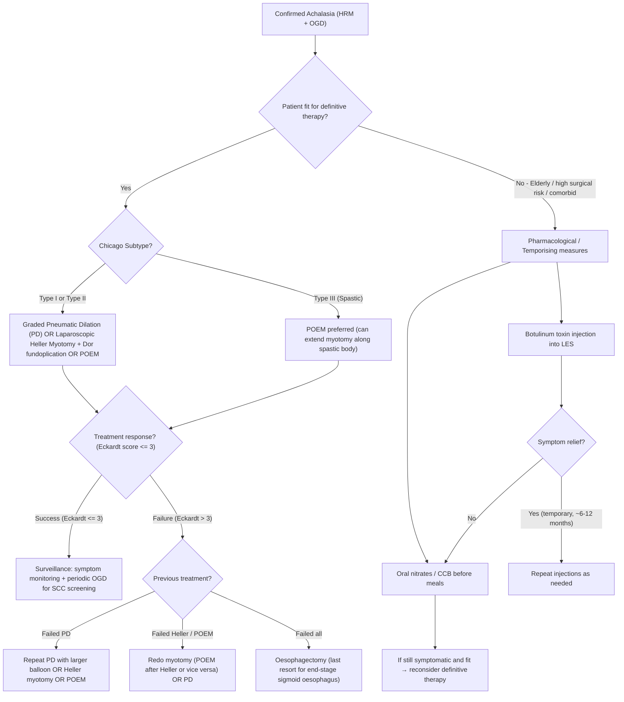

## Management of Achalasia

### General Principles

Before diving into individual treatments, let's establish the conceptual framework from first principles.

***Treatment is aimed at decreasing the resting pressure in the LES to a level which the sphincter no longer impedes the passage of ingested material*** [3].

There are fundamentally only **two strategies** to achieve this [3]:

1. ***Pharmacological reduction in LES pressure*** — using drugs or toxins to relax the sphincter muscle (Botulinum toxin injection / Oral nitrates / CCB)
2. ***Mechanical disruption of LES muscle fibres*** — physically tearing or cutting the circular muscle of the LES (Pneumatic dilation / Surgical myotomy / POEM)

<Callout title="The Uncomfortable Truth About Achalasia Treatment">
***NO treatment can reverse degeneration of ganglion cells, restore the lost oesophageal neurons, or normalise oesophageal functions*** [3]. The inhibitory neurons are gone and they're not coming back. ***Available treatments do not normalise swallowing but merely improve it*** [3]. The goal is to remove the obstruction (the hypertonic LES) so that gravity and whatever residual oesophageal function exists can push food into the stomach. Patients must be counselled about realistic expectations.
</Callout>

**Key counselling point**: ***Treatment is effective in relieving dysphagia*** [3], but ***treatment is NOT effective in relieving chest pain — patients should be counselled about the possible expectations of procedures*** [3]. Why? Chest pain in achalasia is caused by oesophageal spasm (disordered contraction of the oesophageal body), which is NOT addressed by LES-directed therapies (except partially by POEM, which can extend the myotomy proximally).

---

### Management Algorithm

---

### Treatment Modalities — Detailed Breakdown

#### A. Pharmacological / Temporising Treatments

These are **NOT definitive treatments**. They provide temporary symptom relief and are reserved for patients who cannot undergo more effective interventions.

---

##### 1. ***Botulinum Toxin (Botox) Injection*** [2][3]

**Mechanism**: ***Injection of botulinum toxin into LES poisons the excitatory (ACh-releasing) neurons that increase LES smooth muscle tone*** [3]. Botulinum toxin is a neurotoxin produced by *Clostridium botulinum*. It works by cleaving SNARE proteins (specifically SNAP-25) at the presynaptic nerve terminal, preventing acetylcholine vesicle fusion and release. This chemically denervates the excitatory cholinergic neurons at the LES.

***Net effect is a decrease in basal LES pressure which allows emptying of the oesophagus when oesophageal pressures exceed that of the partially paralysed LES*** [3].

| Feature | Detail |
|:---|:---|
| **Route** | Endoscopic injection; typically 80–100 units injected in 4 quadrants into the LES muscle at OGD |
| **Onset** | Days to 1–2 weeks |
| **Duration** | Temporary — effect wears off in **6–12 months** as nerve terminals regenerate |
| ***Indication*** | ***Patients who are not good candidates for more definitive therapy with pneumatic dilation or surgical myotomy*** [3] — e.g., elderly, high surgical risk, severe comorbidities, bridging therapy |
| **Efficacy** | ~75–90% initial response; diminishes with repeated injections due to antibody formation and fibrosis |
| **Advantages** | Minimally invasive; low complication rate; no general anaesthesia required |
| **Disadvantages** | Temporary; repeated injections cause submucosal fibrosis → makes subsequent Heller myotomy technically more difficult (harder to find the submucosal plane) |
| **Complications** | Transient chest pain; rare mediastinitis; submucosal fibrosis (problematic for future surgery) |

<Callout title="Why Not Just Keep Injecting Botox?" type="error">
Each injection causes progressive fibrosis in the submucosal plane at the LES. This fibrosis makes subsequent surgical myotomy (Heller or POEM) technically much more difficult because the surgeon relies on finding a clean plane between mucosa and muscle. Multiple Botox injections blur this plane, increasing the risk of mucosal perforation during myotomy. Therefore, Botox is a **bridge**, not a destination — use it only when definitive therapy is not feasible.
</Callout>

---

##### 2. ***Oral Nitrates / Calcium Channel Blockers (CCB)*** [2][3]

**Mechanism**: Both nitrates and CCBs are smooth muscle relaxants. Nitrates donate nitric oxide (NO) → activates guanylate cyclase → increases cGMP → smooth muscle relaxation. CCBs (particularly nifedipine, a dihydropyridine) block L-type calcium channels → reduce calcium influx into smooth muscle cells → reduce contraction. Both decrease LES tone.

***This is the least effective treatment option in patients with achalasia, which relaxes the smooth muscles of LES (decreases the tone of LES)*** [3].

| Feature | Detail |
|:---|:---|
| **Preparations** | ***Sublingual nifedipine (10–20 mg) or sublingual isosorbide dinitrate / nitroglycerin administered before meals*** [3] |
| **Onset** | 15–30 minutes (sublingual route for rapid absorption) |
| **Duration** | Hours; needs repeated dosing before each meal |
| ***Indication*** | ***Patients who are unwilling or unable to tolerate invasive therapy for achalasia or have failed botulinum toxin injections*** [3] |
| **Efficacy** | Poor: only ~10–50% symptom improvement; tachyphylaxis develops with nitrates |
| **Side effects** | Headache (very common — nitrate-induced vasodilation), hypotension, dizziness, peripheral oedema (nifedipine), flushing |
| ***Clinical role*** | ***Transient symptomatic relief only*** [2] — essentially a last-resort temporiser |

> **Why sublingual?** The sublingual route bypasses first-pass hepatic metabolism, providing faster onset and higher bioavailability — important when you need the LES relaxed *before* the meal arrives at the GOJ.

---

#### B. Definitive Treatments — Mechanical Disruption of the LES

These are the treatments that actually produce durable symptom relief. The fundamental principle is the same across all three: **physically disrupt (tear or cut) the circular muscle fibres of the LES** so the sphincter can no longer maintain its hypertonic contraction.

---

##### 3. ***Graded Pneumatic Balloon Dilation (PD)*** [2][3]

**Mechanism**: ***Pneumatic balloon dilation of LES → disrupts muscle fibres*** [2]. A non-compliant (rigid) balloon is positioned across the LES under fluoroscopic or endoscopic guidance, then inflated to a controlled pressure, forcibly tearing the circular muscle fibres. Think of it as a controlled, incomplete myotomy performed from the inside.

| Feature | Detail |
|:---|:---|
| **Technique** | Rigiflex balloon (30, 35, or 40 mm diameter); graded protocol — start with 30 mm, escalate to 35 then 40 mm if response is inadequate |
| ***Efficacy*** | ***Curative in 65–85% of patients*** [2]; best in Type II achalasia |
| **Advantages** | Outpatient/day case procedure; no general anaesthesia required (can use sedation); repeatable; no surgical incisions |
| **Disadvantages** | Lower long-term efficacy than myotomy; may need repeated dilations; risk of perforation |
| ***Complications*** | ***Perforation*** (~2–5% risk — the most feared complication; requires urgent surgical repair) [2]; ***GERD*** (over-disruption of LES → reflux) [2]; haemorrhage; chest pain |
| **Contraindications** | Oesophageal perforation risk (prior radiation, eosinophilic oesophagitis with friable mucosa); severe oesophageal dilation/sigmoid oesophagus (poor response); pseudoachalasia |
| **Post-procedure** | Water-soluble contrast swallow (e.g., gastrografin) to exclude perforation; observe for 4–6 hours |

**Why "graded"?** Starting with the smallest balloon (30 mm) minimises perforation risk. If symptoms recur, the next size up (35 mm, then 40 mm) progressively disrupts more muscle fibres. This stepwise approach balances efficacy against safety.

---

##### 4. ***Laparoscopic Heller Myotomy + Partial Fundoplication*** [2][7]

**Mechanism**: Surgical division of the circular (and sometimes longitudinal) muscle fibres of the LES, extending onto the gastric cardia (~2 cm) and proximally onto the oesophageal body (~6 cm). This is called a "myotomy" — "myo" = muscle, "tomy" = cutting. The muscle is divided down to the submucosa, leaving the mucosa intact.

| Feature | Detail |
|:---|:---|
| **Approach** | Laparoscopic (minimally invasive); 5-port technique |
| **Myotomy extent** | ~6 cm on the oesophagus + ~2 cm onto the gastric cardia (beyond the GOJ to ensure complete LES disruption) |
| ***Efficacy*** | ***Successful in ≥ 90% of cases*** [2]; excellent long-term durability |
| ***Indication*** | ***Failed endoscopic treatment*** [2]; first-line definitive option (equivalent to POEM and PD for Type I/II); younger patients (better long-term durability) |
| **Anti-reflux procedure** | ***With partial anterior fundoplication (180°) to prevent post-operative GERD (Heller-Dor operation)*** [2] |
| **Why partial (not total) fundoplication?** | In achalasia, the oesophageal body has aperistalsis — it cannot generate propulsive force. A total (Nissen 360°) fundoplication creates too much resistance at the GOJ, leading to severe postoperative dysphagia because the aperistaltic oesophagus cannot overcome it. A partial wrap (Dor 180° anterior) provides enough anti-reflux protection without excessive obstruction |
| ***Complications*** | ***Perforation*** (mucosal injury during myotomy, ~5%); ***dysphagia (due to fundoplication)*** [2] — 50% early post-op, 10% long-term; GERD (if myotomy too extensive or wrap too loose); vagus nerve injury; incomplete myotomy |

<Callout title="Why Dor (Anterior 180°) and Not Toupet (Posterior 270°)?">
Both are partial fundoplications. The Dor procedure wraps the gastric fundus **anteriorly** over the myotomy site. This has the added advantage of **covering the exposed oesophageal mucosa** after myotomy — acting as a patch that protects against delayed perforation and helps contain any unrecognised mucosal injury. The Toupet (posterior 270°) does not provide this coverage. In Hong Kong and most centres performing Heller myotomy for achalasia, ***Dor (anterior 180°) is preferred*** [2][7].
</Callout>

---

##### 5. ***Per-Oral Endoscopic Myotomy (POEM)*** [2][3]

**Mechanism**: ***Creation of a submucosal tunnel at mid-oesophagus, allowing a long myotomy*** [2]. This is essentially a Heller myotomy performed entirely endoscopically, from within the oesophageal lumen, using the submucosal space as a working tunnel.

**Step-by-step concept** [3]:
1. Mucosal incision ~10–15 cm above the LES → entry into the submucosal space
2. Submucosal tunnel created distally towards and beyond the GOJ (using endoscopic dissection)
3. Selective inner circular muscle myotomy performed within the tunnel — the muscle is divided while the overlying mucosa remains intact
4. Mucosal entry site closed with endoscopic clips

| Feature | Detail |
|:---|:---|
| **Efficacy** | Comparable to Heller myotomy (~90–95%); excellent for Type III achalasia because the myotomy can be extended proximally along the spastic oesophageal body (up to 25 cm) |
| **Advantages** | ***Fewer hospital days*** [2]; no skin incisions; no external scars; ability to perform a LONG myotomy (especially beneficial for Type III); can be performed after prior Heller myotomy |
| ***Key disadvantage*** | ***More reflux as no fundoplication is done*** [2] — the mucosa tunnel technique does not allow simultaneous fundoplication; patients typically require long-term ***PPI*** [2] |
| **Preferred indication** | **Type III achalasia** (spastic) — POEM's ability to extend the myotomy along the oesophageal body makes it uniquely suited; also excellent for Types I and II |
| ***Complications*** | ***Reflux (no fundoplication done → PPI)*** [2]; ***mediastinitis*** [2]; ***surgical emphysema*** (CO₂ used for insufflation can track into the mediastinum/subcutaneous tissues) [2]; pneumoperitoneum; bleeding; mucosal perforation |

---

### Head-to-Head Comparison of Definitive Treatments

***Comparison of treatments*** [2]:

| Feature | Pneumatic Dilation | Heller Myotomy + Dor | POEM |
|:---|:---|:---|:---|
| **Approach** | Endoscopic (balloon) | Laparoscopic (surgical) | Endoscopic (submucosal tunnel) |
| **Anaesthesia** | Sedation ± GA | General anaesthesia | General anaesthesia |
| **Efficacy (short-term)** | 65–85% | ≥ 90% | 90–95% |
| **Efficacy (long-term)** | Lower; may need repeat | Excellent; durable | Excellent; still accumulating long-term data |
| ***Overall effectiveness*** | Good | ***Myotomy (endoscopic/surgical) most effective*** [2] | ***Most effective*** [2] |
| **Anti-reflux mechanism** | None (but less mucosal disruption) | Partial fundoplication (Dor 180°) | ***None → more reflux*** [2] |
| **Post-op GERD rate** | ~15–35% | ~10–20% (protected by Dor) | ***Higher (~40–50%)*** [2] → needs PPI |
| **Post-op dysphagia** | Rare | ***More dysphagia*** [2] (from fundoplication) | Less dysphagia |
| **Hospital stay** | Day case / overnight | 2–3 days | ***Fewer hospital days*** [2]; 1–2 days |
| **For Type III** | Poor response | Moderate (limited myotomy length) | **Best option** (can extend myotomy) |
| **Repeatability** | Yes (graded dilation) | Redo myotomy difficult | Can be done after prior Heller |
| **Perforation risk** | 2–5% | ~5% (mucosal injury) | ~2% |

<Callout title="How to Choose? A Pragmatic Approach" type="idea">

**Type I or II achalasia in a fit patient**: All three definitive options are reasonable. Current evidence (2020 POET trial, European Achalasia Trial) suggests Heller myotomy and POEM have similar efficacy; PD is slightly less durable but is less invasive. **Shared decision-making** with the patient is key.

**Type III achalasia**: ***POEM preferred*** because only POEM can extend the myotomy along the entire spastic oesophageal body.

**Elderly or high surgical risk**: Graded PD (less invasive) or Botox injection.

**Failed PD**: Heller myotomy or POEM.

**Failed Heller**: POEM (can find a new submucosal plane).

**End-stage sigmoid oesophagus (decompensated)**: Oesophagectomy may be the only option — the oesophagus is so dilated and tortuous that myotomy/dilation cannot improve emptying.
</Callout>

---

#### C. Supportive / General Management

***These measures apply to all achalasia patients regardless of definitive treatment*** [8]:

| Measure | Rationale |
|:---|:---|
| ***IV fluid to correct haemodynamic instability or electrolyte derangements*** [8] | Chronic poor oral intake, regurgitation → dehydration, electrolyte imbalances |
| ***NPO if patient cannot tolerate fluid*** [8] | Prevent aspiration from regurgitated oesophageal contents |
| ***Total parenteral nutrition (TPN) or feeding tube if patient cannot tolerate fluid*** [8] | Nutritional support in severe cases before definitive treatment |
| ***Treatment of aspiration pneumonia with IV antibiotics*** [8] | Aspiration is a common complication; must be treated before elective intervention |
| **Dietary counselling** | Eat slowly, chew thoroughly, drink water with meals to aid bolus passage; eat upright; avoid eating close to bedtime |
| **Head-of-bed elevation** | Reduce nocturnal aspiration risk (pooled oesophageal contents can reflux into airway when supine) |
| **Long-term PPI** | Post-POEM (no fundoplication → reflux); post-PD if GERD develops |

---

#### D. End-Stage Disease — Oesophagectomy

Reserved for:
- **End-stage sigmoid oesophagus** that has failed all other treatments
- **Oesophageal SCC** developing on a background of achalasia

This is a last resort — oesophagectomy carries significant morbidity and mortality (~2–5% mortality in high-volume centres). The oesophagus is removed and replaced with a gastric conduit (pulled up through the chest) or colonic interposition.

---

#### E. Long-Term Surveillance

All achalasia patients require **ongoing follow-up**:

| Aspect | Detail |
|:---|:---|
| **Symptom monitoring** | Eckardt score at follow-up visits; score ≤ 3 = remission |
| **Timed barium swallow** | Objective assessment of oesophageal emptying pre- and post-treatment |
| **OGD surveillance** | Achalasia increases SCC risk (~30× general population); periodic OGD with biopsies recommended (typically every 3–5 years starting 10–15 years after diagnosis, though guidelines vary) |
| **GERD assessment post-treatment** | Especially post-POEM; pH monitoring if symptomatic; long-term PPI if confirmed |
| **Repeat HRM** | If symptoms recur — assess for incomplete treatment, re-tightening, or new motility pattern |

---

<Callout title="High Yield Summary">

**Principle**: Treatment reduces LES pressure by pharmacological relaxation or mechanical disruption of muscle fibres. No treatment restores lost neurons or normalises swallowing.

**Pharmacological (temporising only)**:
- *Botox injection*: blocks ACh release → reduces LES tone; for patients unfit for definitive therapy; temporary (6–12 months); causes fibrosis complicating future surgery.
- *Nitrates/CCB*: least effective; sublingual nifedipine or ISDN before meals; last resort.

**Definitive treatments**:
- *Graded Pneumatic Dilation*: disrupts LES muscle fibres; curative in 65–85%; main risk = perforation (2–5%).
- *Laparoscopic Heller Myotomy + Dor fundoplication*: ≥ 90% success; partial anterior wrap prevents GERD without causing dysphagia in aperistaltic oesophagus; more dysphagia than POEM.
- *POEM*: endoscopic myotomy via submucosal tunnel; ~90–95% success; preferred for Type III achalasia (can extend myotomy along spastic body); shorter hospital stay; higher reflux rate (no fundoplication → needs PPI).

**Treatment selection by subtype**: Type I/II → any definitive option; Type III → POEM preferred; elderly/unfit → PD or Botox; end-stage → oesophagectomy.

**Treatment relieves dysphagia but NOT chest pain** — counsel patients accordingly.

</Callout>

---

<ActiveRecallQuiz
  title="Active Recall - Management of Achalasia"
  items={[
    {
      question: "What are the two fundamental treatment strategies in achalasia and why can neither 'cure' the disease?",
      markscheme: "Two strategies: (1) Pharmacological reduction in LES pressure (Botox, nitrates, CCB), (2) Mechanical disruption of LES muscle fibres (PD, Heller myotomy, POEM). Neither can cure the disease because no treatment can reverse degeneration of ganglion cells, restore lost inhibitory neurons, or normalise oesophageal function. Treatments improve but do not normalise swallowing."
    },
    {
      question: "Explain the mechanism of Botulinum toxin injection in achalasia and state why repeated injections are problematic for future surgery.",
      markscheme: "Botox cleaves SNARE proteins at presynaptic nerve terminals, preventing ACh vesicle release from excitatory neurons at the LES. This decreases basal LES pressure, allowing oesophageal emptying. Repeated injections cause progressive submucosal fibrosis, obliterating the plane between mucosa and muscle. This makes subsequent surgical or endoscopic myotomy (Heller/POEM) technically much harder, increasing mucosal perforation risk."
    },
    {
      question: "Why is a partial (Dor 180 degrees) rather than a total (Nissen 360 degrees) fundoplication performed with Heller myotomy?",
      markscheme: "In achalasia, the oesophageal body has aperistalsis and cannot generate propulsive force. A Nissen 360-degree wrap creates excessive resistance at the GOJ that the aperistaltic oesophagus cannot overcome, causing severe post-operative dysphagia. A partial Dor (anterior 180 degrees) wrap provides anti-reflux protection with less obstruction. Additionally, the Dor wrap covers the exposed mucosa after myotomy, acting as a protective patch."
    },
    {
      question: "Why is POEM the preferred treatment for Type III achalasia?",
      markscheme: "Type III achalasia has spastic contractions in the oesophageal body (not just LES dysfunction). POEM allows creation of a long submucosal tunnel, enabling the myotomy to be extended proximally along the entire spastic oesophageal body (up to 25 cm). Heller myotomy and pneumatic dilation only address the LES and cannot treat the proximal spastic segment. POEM is the only modality that directly addresses the spastic oesophageal body."
    },
    {
      question: "What is the major disadvantage of POEM compared to Heller myotomy, and how is it managed?",
      markscheme: "POEM has a higher rate of post-operative GERD (approximately 40-50%) because no anti-reflux fundoplication can be performed during the endoscopic submucosal tunnel approach. This is managed with long-term PPI therapy. By contrast, Heller myotomy includes a Dor partial fundoplication which reduces post-operative GERD to approximately 10-20%."
    },
    {
      question: "A patient with end-stage sigmoid oesophagus has failed pneumatic dilation, POEM, and botox. What is the remaining treatment option?",
      markscheme: "Oesophagectomy (last resort). In end-stage sigmoid oesophagus, the oesophagus is massively dilated and decompensated — myotomy and dilation cannot improve emptying because there is no residual oesophageal propulsive function and the anatomy is too distorted. The oesophagus is removed and replaced with a gastric conduit or colonic interposition."
    }
  ]}
/>

## References

[2] Senior notes: maxim.md (Section 3.4 — Achalasia, Management)
[3] Senior notes: felixlai.md (Section: Achalasia, Section VII. Treatment)
[7] Senior notes: maxim.md (Section: GERD — Surgical treatment, fundoplication types)
[8] Senior notes: felixlai.md (Section: Dysphagia, Section V. Treatment — General management)
