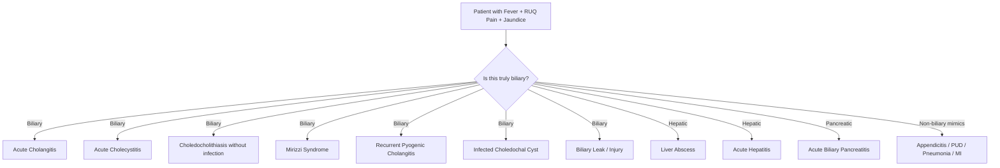
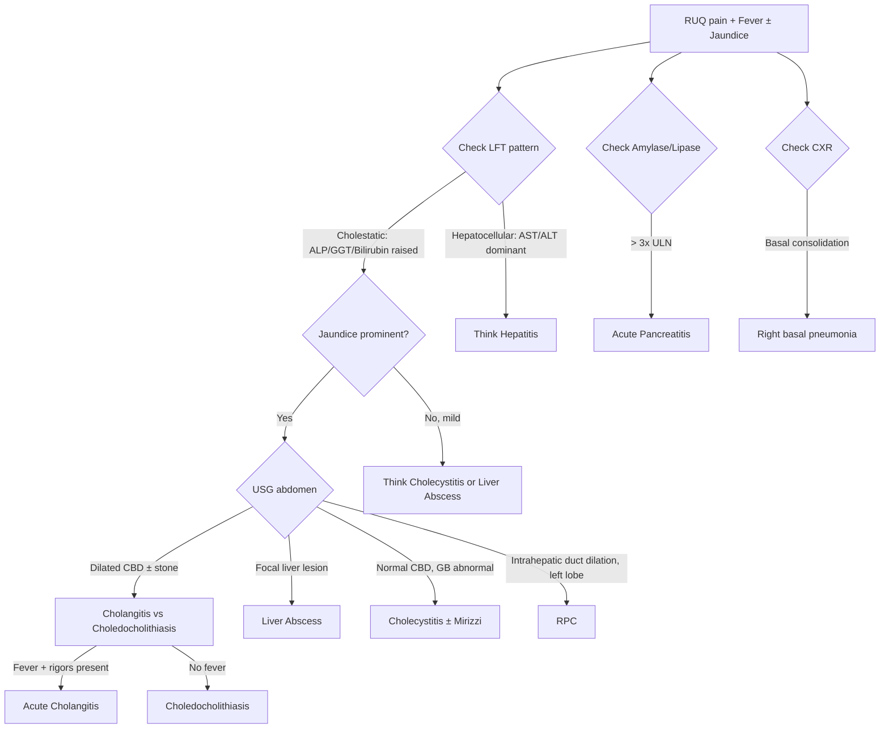

## Differential Diagnosis of Acute Cholangitis

### Framing the Problem

The classic presentation of acute cholangitis — fever, RUQ pain, and jaundice — is **not unique to cholangitis**. Several other conditions in the right upper quadrant and hepatobiliary system can present with overlapping features. The differential diagnosis essentially asks: **"What else could cause fever + abdominal pain + jaundice (or any combination thereof)?"** [1][7].

The key to narrowing the differential lies in understanding *which component dominates* and *what the timeline and associated features are*. Let's work through this systematically.

---

### Approach to the Differential

Think about acute cholangitis as sitting at the intersection of three clinical domains:

1. **Causes of RUQ pain** (hepatobiliary, duodenal, thoracic referred pain)
2. **Causes of obstructive jaundice** (intraluminal, mural, extramural)
3. **Causes of fever with abdominal pain** (intra-abdominal sepsis)

The differential includes conditions that share **at least two of the three** Charcot's triad features.

---

### Detailed Differential Diagnosis

The conditions listed below are explicitly mentioned in the senior notes as the **differential diagnosis of fever and abdominal pain** in the context of suspected cholangitis [1][7][8]:

#### 1. ***Acute Cholecystitis*** [1][7][8][9]

| Feature | Acute Cholecystitis | Acute Cholangitis |
|---|---|---|
| **Primary pathology** | Inflammation of the **gallbladder** (from cystic duct obstruction) | Infection of the **bile duct** (from CBD obstruction) |
| **Jaundice** | **Uncommon** (~20%) — only if Mirizzi syndrome or co-existing CBD stone | **Prominent** — because the CBD itself is obstructed |
| **Murphy's sign** | ***Positive*** (inspiratory arrest on RUQ palpation — gallbladder is inflamed and tender) | ***Typically negative*** (the gallbladder is not the inflamed organ) |
| **Fever** | Present but usually lower-grade initially (chemical → secondary bacterial infection over 48h) | Often **high-grade with rigors** from the outset (bacteraemia from cholangiovenous reflux) |
| **Pain character** | Starts as biliary colic that persists > 6 hours, becomes constant with peritoneal signs | Constant RUQ/epigastric pain, less peritoneal involvement |
| **LFT** | Usually **normal** or mildly deranged (obstruction limited to gallbladder) [9] | ***Cholestatic pattern*** (↑ ALP, ↑ GGT, ↑ conjugated bilirubin) — because the CBD is obstructed |
| **USG** | ***5 cardinal signs***: gallstones, distended GB, wall thickening > 3 mm, pericholecystic fluid, sonographic Murphy's sign [9] | Dilated CBD ± stone, ± dilated intrahepatic ducts |

**Why the confusion arises**: Both conditions involve gallstones and present with RUQ pain and fever. The critical distinction is **jaundice** (prominent in cholangitis, rare in cholecystitis) and **Murphy's sign** (positive in cholecystitis, negative in cholangitis). Also, both can coexist — a patient can have a stone in the cystic duct (cholecystitis) AND a stone in the CBD (cholangitis) simultaneously.

<Callout title="Exam Pearl — Cholecystitis vs Cholangitis" type="error">
Students commonly conflate these two. Remember:
- **Cholecystitis** = gallbladder problem → Murphy's positive, jaundice rare, LFT often normal.
- **Cholangitis** = bile duct problem → Charcot's triad, Murphy's negative, cholestatic LFT.
If the LFT shows a significantly **cholestatic pattern** (markedly raised ALP/GGT/bilirubin), think **duct**, not gallbladder [9].
</Callout>

---

#### 2. ***Choledocholithiasis (without infection)*** [7][10]

- **Definition**: Obstruction of CBD/CHD by gallstone **without superimposed infection** [10].
- **Presentation**: RUQ pain, **obstructive jaundice** (dark urine, pale stools), cholestatic LFT — but **no fever** and **no rigors**.
- **Why it mimics cholangitis**: Same stone, same duct, same jaundice. The difference is the **absence of infection** — no fever, no leukocytosis, no positive blood cultures. Essentially, this is "one hit" (obstruction) without the "second hit" (bacteria).
- **Why it matters**: Choledocholithiasis **can progress to cholangitis** if the obstruction persists and bacteria colonise the stagnant bile. Urgent treatment prevents this progression.
- **USG**: Dilated CBD ( > 8 mm), gallstone in CBD visible in only **~1/3 of cases** due to obscuring duodenal gas [10].

---

#### 3. ***Liver Abscess*** [1][7][8][11]

This is a **critical differential** because it can present almost identically to cholangitis and requires entirely different management.

| Feature | Liver Abscess | Acute Cholangitis |
|---|---|---|
| **Fever pattern** | ***Swinging fever*** (high spikes followed by remission — "picket-fence" pattern), chills, rigors [11] | High-grade fever with rigors, but usually more constant |
| **Pain** | RUQ pain, ***tender hepatomegaly*** | RUQ pain, hepatomegaly less prominent |
| **Jaundice** | **Not significant** (abscess is focal — the unaffected liver parenchyma continues to excrete bilirubin) [11] | **Prominent** (entire biliary outflow is obstructed) |
| **LFT** | Mildly deranged, ALP may be elevated, but bilirubin often near-normal | ***Cholestatic pattern*** (markedly raised ALP, GGT, bilirubin) |
| **Imaging** | ***CT abdomen with contrast***: double-target sign (rim-enhancing lesion with central hypodensity), cluster sign [11]. USG: multiloculated cystic mass. | USG: dilated CBD ± stone. CT shows dilated ducts. |
| **Aetiology clues** | ***Klebsiella*** (especially in > 60 years old + DM in Hong Kong); ascending biliary infection itself; portal venous spread from appendicitis/diverticulitis [11] | CBD stone, stent, stricture, tumour |

**Why the confusion arises**: Both present with fever and RUQ pain. The route of spread for pyogenic liver abscess is often **ascending biliary infection** (20–30% of cases) [11] — meaning cholangitis and liver abscess can **coexist**. In fact, liver abscess is a recognised **complication** of untreated cholangitis.

> **High-Yield**: ***USG abdomen should always rule out liver abscess when cholangitis is suspected*** — the presentations are similar, and abscess requires image-guided drainage, not ERCP [2][8].

---

#### 4. ***Acute Biliary Pancreatitis*** [1][7][8][12]

- **Mechanism**: A gallstone migrates down the CBD and impacts at the **ampulla of Vater**, obstructing both the CBD and the pancreatic duct (of Wirsung) → pancreatic enzyme activation → autodigestion → acute pancreatitis [12].
- **Overlap**: Shares RUQ/epigastric pain and fever with cholangitis; obstructive jaundice may be present if the CBD remains obstructed.
- **Key distinguishing features**:
  - **Pain**: Classically ***epigastric***, radiates ***straight through to the back***, relieved by ***sitting up or leaning forward*** [12]. Cholangitis pain is more purely RUQ.
  - **Amylase/Lipase**: **Markedly elevated** ( > 3× upper limit of normal). In cholangitis, amylase may be mildly elevated but not to this degree.
  - **Nausea and vomiting**: More prominent in pancreatitis.
  - **CT findings**: Pancreatic inflammation, peripancreatic fat stranding, ± necrosis. In cholangitis, the pancreas is normal.
- **Co-existence**: Pancreatitis and cholangitis can occur **simultaneously** from the same impacted ampullary stone. Always check amylase/lipase in suspected cholangitis [2][8].

---

#### 5. ***Recurrent Pyogenic Cholangitis (RPC)*** [1][4][7][8]

- **Definition**: Recurrent bacterial cholangitis due to ***intrahepatic pigment stones*** and ***intrahepatic strictures*** [4].
- **Why it's a separate differential**: RPC presents with recurrent episodes of Charcot's triad (1–2 episodes/year), but the underlying pathology is **intrahepatic** (left lobe predilection), not simply a CBD stone.
- **Key clues**: Southeast Asian patient (***"Hong Kong disease"***), **middle-age onset (30s–40s)**, history of **recurrent cholangitis episodes**, CT showing **central dilated bile ducts with peripheral tapering and left lobe atrophy** [4].
- **Why it matters**: Management is fundamentally different — standard ERCP may be inadequate (cannot access intrahepatic strictures); may require ***PTBD***, hepaticojejunostomy, or ***hepatobiliary resection*** of the affected segment [4].

---

#### 6. ***Mirizzi Syndrome*** [7][8][13]

- **Definition**: ***CHD obstruction*** caused by extrinsic compression from an ***impacted stone in Hartmann's pouch or cystic duct*** [13].
- **Presentation**: Can present identically to cholangitis — fever, RUQ pain, jaundice. In fact, **acute cholangitis is one of the presenting manifestations** of Mirizzi syndrome [13].
- **Key clue**: ***Jaundice with palpable gallbladder*** — this is an exception to Courvoisier's Law [13].
- **Chronic inflammation** from the impacted stone can erode the bile duct wall, causing a ***cholecystobiliary fistula*** (Csendes classification) [13].
- **Imaging**: USG shows dilated biliary tree above the level of stone impaction + stone at GB neck + contracted GB. ERCP may demonstrate the fistula [13].
- **Why it mimics cholangitis**: The obstruction of the CHD leads to stasis, which predisposes to ascending infection — the mechanism is the same, just the *cause* of obstruction is different (external compression vs. intraluminal stone).

---

#### 7. ***Infected Choledochal Cyst*** [7][8]

- **Definition**: Congenital dilatation of the intra/extrahepatic biliary system that becomes secondarily infected.
- **Presentation**: RUQ mass + pain + jaundice + fever — the classic triad of choledochal cyst includes **RUQ mass, pain, and jaundice** [8].
- **Key clue**: **Young patient** (most diagnosed before age 10, ~60%), palpable RUQ cystic mass.
- **Risk**: Untreated cysts carry significant risk of **cholangiocarcinoma** — hence radical excision + Roux-en-Y reconstruction is the definitive management.

---

#### 8. ***Biliary Leak*** [1][7]

- **Context**: Usually **post-operative** (e.g., after laparoscopic cholecystectomy, liver resection, or biliary surgery). Bile leaks from the cystic duct stump, hepatic duct injury, or accessory ducts.
- **Presentation**: Fever, abdominal pain, ± jaundice, ± bile-stained drain output.
- **Why it mimics cholangitis**: Bile is irritant to the peritoneum and becomes secondarily infected → localised or generalised peritonitis with fever and RUQ pain.
- **Key clue**: **Recent biliary surgery** and clinical deterioration in the post-operative period.

---

#### 9. ***Malignant Biliary Obstruction (MBO)*** [2][3][5]

- **Causes**: ***Pancreatic head carcinoma, cholangiocarcinoma, periampullary carcinoma, porta hepatis lymph node metastasis*** [2][3].
- **Typical presentation**: ***Painless progressive obstructive jaundice*** in an elderly patient — this is the classic "textbook" presentation of MBO [14]. Weight loss, anorexia, and a palpable non-tender gallbladder (Courvoisier's sign) are suggestive.
- **When it mimics cholangitis**: MBO can cause secondary cholangitis when the obstructed bile becomes infected. In this scenario, the patient with known or occult malignancy develops **superimposed fever and sepsis** on top of their obstructive jaundice.
- ***Biliary obstruction + infection → cholangitis***, and the principles of management are the same: ***biliary drainage is mandatory*** [3]. However, the underlying cause requires entirely different oncological management.

---

#### 10. **Non-Biliary Mimics**

These conditions can occasionally present with RUQ pain and/or fever, mimicking biliary pathology:

| Condition | Key Distinguishing Feature | Why It Can Mimic |
|---|---|---|
| ***Acute Appendicitis*** [1][7][8] | Pain starts peri-umbilical, migrates to RLQ (McBurney's point). No jaundice. Rovsing's sign positive. | Early appendicitis can cause vague upper abdominal pain before localising. High appendix (retrocaecal/subhepatic) may cause RUQ pain. |
| **Peptic Ulcer Disease** [8][12] | Epigastric pain, relationship to meals, ± GI bleeding. No jaundice. | Perforated posterior duodenal ulcer can mimic biliary/pancreatic pathology with referred pain. |
| **Acute Hepatitis** [8] | Prodromal symptoms (malaise, anorexia), **hepatocellular LFT pattern** (markedly raised AST/ALT >> ALP), viral serology positive. | Causes jaundice + RUQ tenderness + fever. But the LFT pattern is hepatocellular (transaminases dominant), not cholestatic. |
| ***Right lower lobe pneumonia*** [8][9] | Cough, dyspnoea, pleuritic chest pain, crackles on auscultation. CXR infiltrate. | Diaphragmatic irritation from basal pneumonia can cause referred RUQ pain and fever — a classic "trap" in exams. |
| **Myocardial infarction** [8][12] | Inferior MI can cause epigastric/RUQ pain. ECG changes, troponin elevation. | Vagal stimulation from inferior MI causes nausea, vomiting, and epigastric discomfort that mimics biliary colic or pancreatitis. |

<Callout title="The Right Basal Pneumonia Trap" type="error">
In exams, a patient with fever, RUQ pain, and raised WBC may have a **right basal pneumonia** rather than a biliary problem. Always examine the chest and order a **CXR** — this is why an ***erect CXR*** is part of the standard workup for RUQ pain [2].
</Callout>

---

### Summary Table — Quick Differentiation

| Diagnosis | Pain | Jaundice | Fever | Murphy's | Key Investigation | Key Distinguishing Feature |
|---|---|---|---|---|---|---|
| **Acute Cholangitis** | RUQ, constant | ✅ Prominent | ✅ High + rigors | **−** | USG: dilated CBD | Charcot's triad, cholestatic LFT |
| **Acute Cholecystitis** | RUQ, > 6h | ± Rare (~20%) | ✅ Lower-grade | **+** | USG: 5 cardinal signs | Murphy's sign, GB wall thickening |
| **Choledocholithiasis** | RUQ | ✅ | ✗ No fever | **−** | USG: dilated CBD | No infection — just obstruction |
| **Liver Abscess** | RUQ, tender hepatomegaly | ± Minimal | ✅ Swinging | **−** | CT: rim-enhancing lesion | Focal liver lesion, blood cultures |
| **Acute Pancreatitis** | Epigastric → back | ± | ✅ | **−** | Amylase/lipase > 3× ULN | Sits up/leans forward, marked amylase |
| **RPC** | RUQ | ✅ | ✅ Recurrent | **−** | CT: left lobe intrahepatic duct dilatation | Recurrent episodes, SE Asian, intrahepatic stones |
| **Mirizzi Syndrome** | RUQ | ✅ | ✅ | ± | ERCP: extrinsic CHD compression | Palpable GB + jaundice, fistula |
| **Hepatitis** | RUQ | ✅ | ✅ Low-grade | **−** | Hepatocellular LFT, viral serology | AST/ALT >> ALP (hepatocellular pattern) |
| **Pneumonia** | RUQ (referred) | ✗ | ✅ | **−** | CXR: consolidation | Respiratory symptoms, CXR findings |

---

### Systematic Approach to Narrowing the Differential

When a patient presents with features suggestive of cholangitis, use this step-by-step approach:

<Callout title="Always Order These in Suspected Cholangitis">

When working up a patient with possible cholangitis, the following investigations help differentiate the differential:
1. **Bloods**: CBC, LFT (cholestatic vs hepatocellular pattern), amylase/lipase (r/o pancreatitis), ***blood culture*** [2]
2. ***Erect CXR*** (r/o pneumonia, free air under diaphragm from perforation) [2]
3. ***USG abdomen*** (dilated duct? Stone? Liver abscess? GB wall thickening?) [2]
4. If inconclusive: **MRCP**, **CT abdomen with contrast** (r/o liver abscess or malignant obstruction), or **EUS** [2]

</Callout>

---

<Callout title="High Yield Summary">

**Core differential of acute cholangitis** (conditions sharing fever + RUQ pain ± jaundice):

1. ***Acute cholecystitis*** — Murphy's positive, jaundice rare, GB pathology on USG
2. ***Choledocholithiasis*** — jaundice without fever (no infection yet)
3. ***Liver abscess*** — swinging fever, tender hepatomegaly, CT double-target sign; **similar presentations, must rule out on USG** [2]
4. ***Acute biliary pancreatitis*** — epigastric pain radiating to back, amylase > 3× ULN
5. ***RPC*** — recurrent episodes, Southeast Asian, intrahepatic pigment stones, left lobe
6. ***Mirizzi syndrome*** — palpable GB + jaundice (exception to Courvoisier's Law)
7. ***Infected choledochal cyst*** — young patient, RUQ mass
8. ***Biliary leak*** — post-operative context
9. ***Malignant biliary obstruction*** — painless progressive jaundice in elderly, superimposed infection = cholangitis
10. **Non-biliary mimics**: Right basal pneumonia, acute hepatitis, inferior MI, peptic ulcer, appendicitis

**Key differentiating tools**: LFT pattern (cholestatic vs hepatocellular), Murphy's sign (cholecystitis vs cholangitis), amylase (pancreatitis), CXR (pneumonia), USG (ductal dilatation vs focal liver lesion vs GB pathology), blood cultures.

</Callout>

---

<ActiveRecallQuiz
  title="Active Recall - Differential Diagnosis of Acute Cholangitis"
  items={[
    {
      question: "A patient presents with fever, RUQ pain, and jaundice. Murphy's sign is positive. What is the most likely diagnosis and why does Murphy's sign help differentiate?",
      markscheme: "Acute cholecystitis with possible co-existing CBD stone causing jaundice (or Mirizzi syndrome). Murphy's sign is positive in cholecystitis because the inflamed gallbladder is tender when pressed against the examining hand during inspiration. In pure cholangitis, the gallbladder is not the primary inflamed organ, so Murphy's sign is typically negative."
    },
    {
      question: "How do you distinguish a liver abscess from acute cholangitis at the bedside and on investigations?",
      markscheme: "Liver abscess: swinging fever, tender hepatomegaly, jaundice is minimal (focal lesion, rest of liver compensates). Cholangitis: Charcot's triad with prominent jaundice, cholestatic LFT. On imaging, USG/CT in liver abscess shows a focal rim-enhancing cystic lesion (double-target sign on CT), while cholangitis shows dilated CBD with or without stone. Both may have positive blood cultures."
    },
    {
      question: "A patient with RUQ pain and fever has markedly raised AST/ALT (>1000 IU/L) with only mildly raised ALP. Is this more likely cholangitis or hepatitis? Explain using LFT pattern.",
      markscheme: "Hepatitis. Cholangitis produces a cholestatic LFT pattern (ALP and GGT raised disproportionately to transaminases, with raised conjugated bilirubin). A hepatocellular pattern (AST/ALT much greater than ALP) points to hepatitis (viral, drug-induced, autoimmune). However, note that very early acute biliary obstruction can cause a transient transaminase spike, so clinical correlation is needed."
    },
    {
      question: "Why should you always check amylase/lipase and order a CXR when working up suspected acute cholangitis?",
      markscheme: "Amylase/lipase: to rule out acute biliary pancreatitis, which can coexist with cholangitis (same impacted ampullary stone). Amylase greater than 3 times upper limit of normal suggests pancreatitis. CXR: to rule out right basal pneumonia (diaphragmatic irritation can cause referred RUQ pain mimicking biliary pathology) and to look for free air under diaphragm (perforated viscus)."
    },
    {
      question: "Name three conditions where jaundice occurs with a palpable gallbladder, and explain why this is an exception to Courvoisier's Law.",
      markscheme: "1. Malignant biliary obstruction (the gallbladder is non-fibrosed and distends - this is actually Courvoisier's Law itself, not the exception). Exceptions include: 2. Double impaction (stone in CBD causing jaundice plus stone in cystic duct causing mucocele of a fibrosed GB). 3. Mirizzi syndrome (impacted stone in Hartmann's pouch compresses CHD externally). 4. RPC (pathology is in bile ducts, not GB, so GB is not fibrosed and can distend). In these exceptions, despite gallstone disease, the gallbladder is palpable because either the obstruction pattern is unusual or the gallbladder itself is not chronically inflamed."
    }
  ]}
/>

## References

[1] Senior notes: felixlai.md (Acute cholangitis — clinical manifestation, differential diagnosis)
[2] Senior notes: maxim.md (Acute cholangitis — urgent investigations, management)
[3] Lecture slides: Malignant biliary obstruction.pdf (p16 — Cholangitis: biliary pressure, impaired antibiotic excretion, mandatory drainage)
[4] Senior notes: felixlai.md and maxim.md (Recurrent pyogenic cholangitis sections)
[5] Lecture slides: Malignant biliary obstruction.pdf (malignant causes of biliary obstruction)
[7] Lecture slides: GC 200. RUQ pain, jaundice and fever Cholecytitis and cholangitis Imaging of GI system.pdf (p6–7 — Acute Cholangitis clinical manifestations, pathogenesis)
[8] Senior notes: felixlai.md (Mirizzi syndrome — differential diagnosis list: choledocholithiasis, acute cholecystitis, liver abscess, infected choledochal cysts, biliary leaks, acute pancreatitis, acute appendicitis, RPC)
[9] Senior notes: felixlai.md (Acute cholecystitis — Murphy's sign, LFT findings, USG cardinal signs) and maxim.md (Acute calculous cholecystitis)
[10] Senior notes: maxim.md (Choledocholithiasis)
[11] Senior notes: felixlai.md (Liver abscess) and maxim.md (Liver abscess)
[12] Senior notes: felixlai.md (Acute pancreatitis — clinical manifestation, differential diagnosis)
[13] Senior notes: maxim.md (Mirizzi syndrome)
[14] Senior notes: maxim.md (Obstructive jaundice — painless progressive obstructive jaundice)
