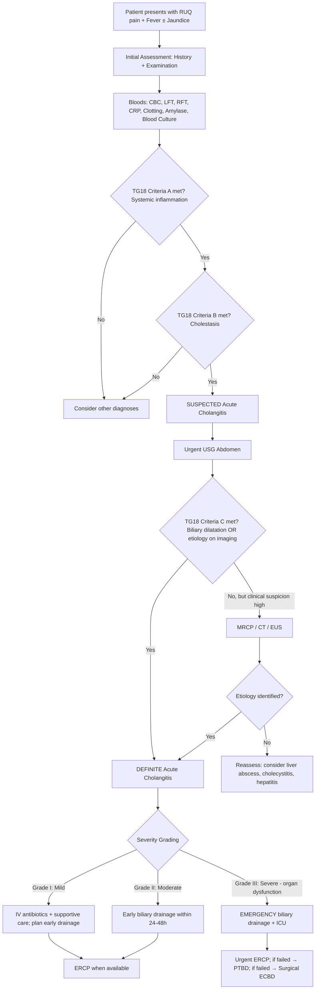
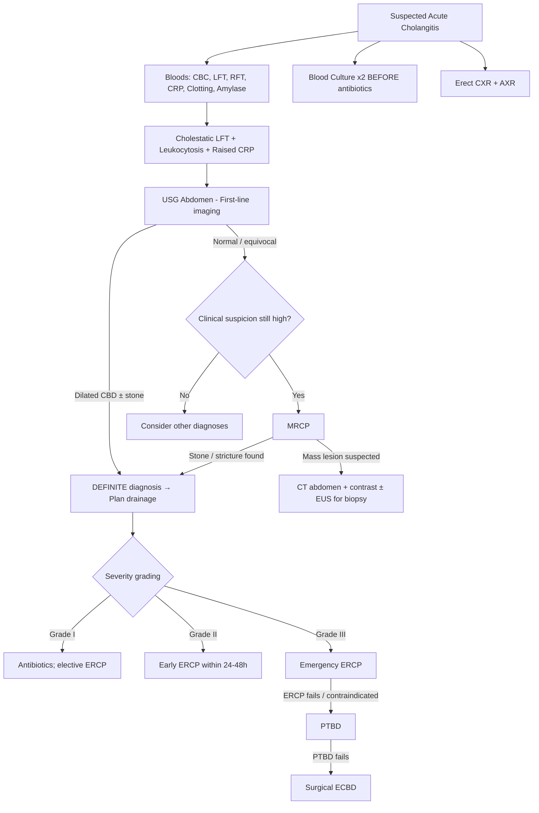

## Diagnostic Criteria

### The Tokyo Guidelines (TG18) — The Standard Framework

The **Tokyo Guidelines** (originally TG07, revised TG13, and most recently TG18) are the internationally accepted diagnostic criteria for acute cholangitis. They provide a structured, stepwise approach: first determine whether cholangitis is present (diagnosis), then grade its severity (which dictates urgency of drainage). Let's break this down from first principles [1][7].

The logic is straightforward: acute cholangitis = **systemic inflammation/infection** + **biliary obstruction/cholestasis**. The criteria are designed to capture both components, then confirm with imaging.

### TG18 Diagnostic Criteria for Acute Cholangitis

| Category | Criteria |
|---|---|
| **A. Systemic inflammation** | **A-1.** Fever ( > 38°C) and/or shaking chills **OR** **A-2.** Laboratory evidence of inflammatory response: abnormal WBC count ( < 4,000 or > 10,000/mm³), ↑ CRP, or other changes indicating inflammation |
| **B. Cholestasis** | **B-1.** Jaundice (total bilirubin ≥ 2 mg/dL / ~34 μmol/L) **OR** **B-2.** Abnormal liver chemistries: ↑ ALP, ↑ GGT, ↑ AST, ↑ ALT (beyond 1.5× upper limit of normal) |
| **C. Imaging** | **C-1.** Biliary dilatation on imaging **OR** **C-2.** Evidence of an etiology on imaging (e.g., stone, stricture, stent) |

**Interpretation** [1]:

| Diagnostic Level | Criteria Required |
|---|---|
| ***Suspected diagnosis*** | **ONE item from A** (systemic inflammation) **AND** **ONE item from B** (cholestasis) |
| ***Definite diagnosis*** | Meets criteria for suspected diagnosis **PLUS** **ANY item from C** (imaging evidence) |

<Callout title="Why This Structure Makes Sense">
Think about it: a patient with fever + cholestatic LFT could have cholangitis, but they could also have acute hepatitis with secondary bacterial infection, or even cholecystitis with mild LFT derangement. Adding the **imaging criteria** (dilated duct, visible stone/stricture/stent) confirms that the problem is truly in the **biliary tree**. That is why a "definite" diagnosis requires imaging confirmation.
</Callout>

<Callout title="Exam Must-Know — Diagnostic Criteria" type="error">
A common exam pitfall: students remember Charcot's triad but forget the **formal Tokyo Guidelines criteria**. The TG18 criteria are more sensitive than Charcot's triad (which is only present in 50–70% of cases). You can diagnose cholangitis even **without jaundice** — as long as you have systemic inflammation + abnormal liver chemistries + imaging findings [1].
</Callout>

---

## Severity Grading (TG18) — Determines Urgency of Drainage

Once the diagnosis is established, severity grading determines **how urgently you need to drain**:

| Grade | Severity | Criteria | Clinical Implication |
|---|---|---|---|
| **Grade I** | ***Mild*** | Does not meet Grade II or III criteria. Responds to initial antibiotics + supportive care. | May attempt antibiotics first; early biliary drainage planned. |
| **Grade II** | ***Moderate*** | Meets **≥ 2** of: WBC > 12,000 or < 4,000; fever ≥ 39°C; age ≥ 75; total bilirubin ≥ 5 mg/dL (~85 μmol/L); albumin < 0.7 × lower limit of normal. Does **not** respond to initial medical treatment. | Requires **early biliary drainage** (within 24–48 h). |
| **Grade III** | ***Severe*** | **Organ dysfunction** in ≥ 1 system: **Cardiovascular** (hypotension needing vasopressors), **Neurological** (altered consciousness), **Respiratory** (PaO₂/FiO₂ < 300), **Renal** (oliguria or creatinine > 2.0 mg/dL), **Hepatic** (PT-INR > 1.5), **Haematological** (platelets < 100,000/mm³) | ***Urgent/emergency biliary drainage*** + ICU admission + organ support. This is suppurative cholangitis. |

> **High-Yield**: Grade III = **Reynolds' pentad territory**. Any organ dysfunction = Grade III = emergency drainage. Don't wait.

---

## Diagnostic Algorithm

The following algorithm integrates clinical assessment, laboratory workup, imaging, and severity grading into a systematic approach:

<Callout title="QMH Practice Drainage Escalation" type="idea">
At **Queen Mary Hospital**, the drainage escalation is: ***ERCP → PTBD → ECBD*** [1][15]. This is a practical sequence: start with the least invasive (endoscopic), escalate to percutaneous if endoscopic fails, and resort to surgery only if both fail.
</Callout>

---

## Investigation Modalities — Detailed Breakdown

### Overview: What We Need to Know and Why

When investigating suspected acute cholangitis, we need to answer **four questions**:

1. **Is there systemic infection?** → Bloods (CBC, CRP, blood cultures)
2. **Is there biliary obstruction/cholestasis?** → LFT, bilirubin
3. **Where is the obstruction and what is causing it?** → Imaging (USG → MRCP/CT → ERCP)
4. **How severe is it?** → Organ function markers (RFT, clotting, ABG, lactate)

---

### A. Laboratory Investigations

#### A1. Complete Blood Count with Differential (CBC D/C)

| Finding | Interpretation | Pathophysiological Basis |
|---|---|---|
| **Leukocytosis with neutrophil predominance** | Active bacterial infection / systemic inflammation | Bone marrow releases neutrophils in response to bacterial endotoxins and pro-inflammatory cytokines (IL-1, TNF-α, G-CSF). Neutrophils are the "first responders" to bacterial infection. |
| **Left shift (↑ band forms)** | Marrow is "ramping up" — pushing immature neutrophils into circulation | When demand exceeds the marrow reserve of mature neutrophils, immature forms (bands) are released. Indicates **significant** bacterial infection. |
| **Leukopenia ( < 4,000)** | Paradoxically indicates **severe sepsis** | Overwhelming infection consumes neutrophils faster than the marrow can replenish them, OR endotoxin-mediated marrow suppression. This is a **bad prognostic sign** — part of TG18 Grade II/III criteria. |
| **Thrombocytopenia** | DIC from sepsis OR hypersplenism from underlying cirrhosis | **Important to check before any invasive procedure** (ERCP, PTBD) — coagulopathy increases bleeding risk [1][15]. |

#### A2. Liver Function Tests (LFT)

This is arguably the most important blood test in suspected cholangitis because it distinguishes **cholestatic** (obstructive) from **hepatocellular** patterns.

| Marker | Expected Finding | Interpretation |
|---|---|---|
| ***↑ ALP (Alkaline Phosphatase)*** | Elevated, often markedly | ALP is concentrated in the **bile duct epithelium (cholangiocytes)** and the canalicular membrane of hepatocytes. Biliary obstruction causes bile to back up → **cholestasis induces synthesis and release of ALP** into blood. This is the hallmark of an obstructive/cholestatic pattern [1][2][15]. |
| ***↑ GGT (Gamma-Glutamyl Transferase)*** | Elevated, often markedly | GGT is found in biliary epithelium and hepatocyte canalicular membranes. Rises with ALP in cholestasis. GGT confirms that a raised ALP is of **biliary origin** (vs. bone, pregnancy, etc.) [1][2]. |
| ***↑ Conjugated (direct) bilirubin*** | Elevated | The obstruction prevents conjugated bilirubin from being excreted into the duodenum → it refluxes back into the blood. It is water-soluble → filtered by kidneys → **dark urine** [1][2]. |
| **↑ AST/ALT** | Mildly to moderately elevated | In cholangitis, transaminases may be elevated (hepatocyte injury from back-pressure of bile, ischaemia from sepsis), but **ALP and GGT rise disproportionately more** than AST/ALT. If AST/ALT >> ALP, think hepatocellular cause (hepatitis), not cholangitis [1][15]. |

<Callout title="LFT Pattern Recognition — Exam Must-Know">

**Cholestatic pattern** (cholangitis, choledocholithiasis, MBO): ***ALP ↑↑, GGT ↑↑, conjugated bilirubin ↑↑***, AST/ALT mildly ↑.

**Hepatocellular pattern** (hepatitis, drug injury): AST/ALT ↑↑↑, ALP mildly ↑.

This pattern distinction alone can differentiate cholangitis from hepatitis at a glance [1][2].
</Callout>

> **Note on early biliary obstruction**: In the **very early** hours of acute obstruction (e.g., a stone suddenly impacts), AST/ALT can spike transiently ( > 1000 IU/L) before the cholestatic pattern declares itself. This is because acute rise in intraductal pressure causes **direct hepatocyte injury**. Don't be misled — repeat LFT in 24–48h and the cholestatic pattern will emerge [15].

#### A3. Inflammatory Markers

| Marker | Finding | Notes |
|---|---|---|
| **↑ CRP** | Elevated (often markedly) | Hepatic acute-phase reactant produced in response to IL-6. Useful for monitoring treatment response (falls with successful drainage). Part of TG18 Criterion A. |
| **↑ ESR** | Elevated | Less specific than CRP; takes days to rise and fall. |
| **Procalcitonin** | Elevated in bacterial sepsis | More specific for bacterial infection than CRP. Increasingly used in severe sepsis to guide antibiotic duration. Not yet universally adopted in TG18 criteria. |

#### A4. Clotting Profile (PT/INR)

| Finding | Interpretation |
|---|---|
| **Prolonged PT / elevated INR** | Two mechanisms: (1) **Vitamin K deficiency** — bile salts are needed for absorption of fat-soluble vitamins (A, D, E, **K**) in the gut; biliary obstruction → no bile salts in gut → impaired vitamin K absorption → reduced synthesis of factors II, VII, IX, X [1][15]. (2) **Hepatic synthetic dysfunction** from sepsis-related hepatic injury or underlying liver disease. |
| **Corrects with IV vitamin K** | Confirms the cause is vitamin K malabsorption (obstructive), not intrinsic liver failure. If it does not correct, suspect severe hepatic dysfunction or DIC. |

<Callout title="Pre-Procedure Check" type="error">
**Always check clotting and platelets before ERCP or PTBD.** Coagulopathy from vitamin K deficiency is common in obstructive jaundice and needs correction (IV vitamin K) to reduce procedural bleeding risk [1][15].
</Callout>

#### A5. Renal Function Tests (RFT)

| Finding | Interpretation |
|---|---|
| **↑ Creatinine, ↑ Urea** | Acute kidney injury from sepsis-induced renal hypoperfusion (pre-renal), OR hepatorenal syndrome in patients with underlying chronic liver disease. Part of TG18 Grade III criteria. |
| **Electrolyte abnormalities** | Metabolic acidosis (lactic acid from tissue hypoperfusion), hyperkalaemia (from renal dysfunction). |

#### A6. Serum Amylase and Lipase

| Finding | Interpretation |
|---|---|
| **Mildly elevated amylase** | Common in cholangitis — mild pancreatic irritation from a stone near the ampulla. |
| **Markedly elevated ( > 3× ULN)** | Suggests **concurrent acute biliary pancreatitis** — an impacted ampullary stone obstructing both CBD and pancreatic duct [2][10][15]. |

> **High-Yield**: ***Always check amylase in suspected cholangitis*** — cholangitis and pancreatitis can coexist from the same stone [2].

#### A7. ***Blood Culture*** — The Most Important Microbiological Investigation

| Detail | Rationale |
|---|---|
| ***Must be taken BEFORE starting antibiotics*** | Antibiotics can sterilise the blood quickly, making cultures falsely negative. |
| **At least 2 sets from different sites** | Increases sensitivity, helps distinguish true bacteraemia from contaminant. |
| **Request aerobic AND anaerobic bottles** | Anaerobes (e.g., *Bacteroides fragilis*) are common in severe cholangitis [1][7]. |
| **Request antibiotic susceptibility testing** | Guides de-escalation of empirical antibiotics to targeted therapy [1]. |
| **Positive in ~20–70% of cases** | Depends on timing relative to antibiotic administration and severity. Positive cultures are common in the presence of bile duct stones and other obstructive causes [1]. |

<Callout title="Blood Culture — Absolutely Must Do">
***Blood culture*** is highlighted as a critical investigation in both senior notes and lecture slides [2][7]. In the acute setting, blood cultures are the only way to identify the causative organism and its antibiotic sensitivities. Take them **before** antibiotics. This is a frequent exam point.
</Callout>

#### A8. Bile Culture

| Detail | Rationale |
|---|---|
| Obtained at the time of **ERCP or PTBD** | When bile is aspirated during drainage, it should be sent for culture and sensitivity [1]. |
| **Higher sensitivity than blood cultures** | Bile cultures are positive in up to **80–100%** of cholangitis cases (vs. 20–70% for blood cultures). |
| Organisms may differ from blood cultures | Polymicrobial infection is common; bile cultures may reveal additional organisms not detected in blood. |

#### A9. Urinalysis

| Finding | Interpretation |
|---|---|
| **Conjugated bilirubin in urine (bilirubinuria)** | Conjugated bilirubin is water-soluble → filtered by kidneys → appears in urine. Indicates post-hepatic (obstructive) jaundice. Absent urobilinogen (because bilirubin never reaches the gut to be converted). |

#### A10. Other Blood Tests

| Test | Rationale |
|---|---|
| **Arterial blood gas (ABG)** | In severe cholangitis: metabolic acidosis (lactic acidosis from tissue hypoperfusion), respiratory compensation. Part of severity assessment. |
| **Lactate** | Marker of tissue hypoperfusion. Elevated lactate ( > 2 mmol/L) indicates sepsis-related organ dysfunction. |
| **Blood glucose** | Infection can cause hyper- or hypoglycaemia. DM is a risk factor for liver abscess (important differential). |
| **Group and save / cross-match** | Pre-procedural preparation for ERCP/PTBD/surgery. |
| **Tumour markers (CEA, CA 19-9)** | If malignant biliary obstruction is suspected as the underlying cause. ***Not diagnostically useful*** (lack sensitivity and specificity) but serial assay after resection may detect recurrence [15]. |

---

### B. Radiological Investigations

The imaging strategy is **stepwise** — start with the simplest, most available test and escalate if needed.

#### B1. ***Erect Chest X-Ray (CXR)*** and ***Abdominal X-Ray (AXR)***

These are **baseline** investigations, not primarily to diagnose cholangitis, but to **exclude mimics and detect complications** [2]:

| Modality | Findings | Rationale |
|---|---|---|
| ***Erect CXR*** | Right basal consolidation → pneumonia (mimics RUQ pain); right-sided pleural effusion (complication of subphrenic/hepatic abscess); free gas under diaphragm (perforation — unlikely in cholangitis but must exclude) [2] | Rule out non-biliary causes of fever + RUQ pain. |
| ***AXR*** | ***Aerobilia*** (gas in biliary tree — seen as branching radiolucencies over the liver) → indicates communication between bowel and biliary tree (prior sphincterotomy, biliary-enteric anastomosis, cholecystoenteric fistula, gas-forming infection) [2]; radio-opaque gallstones (~15% visible); pancreatic calcification (chronic pancreatitis) | Aerobilia in a septic patient suggests ascending infection through a disrupted sphincter. |

#### B2. ***Transabdominal Ultrasound (USG)*** — The First-Line Imaging

| Detail | Explanation |
|---|---|
| **Why first-line** | Readily available, non-invasive, no radiation, bedside (can be done in a sick patient in the emergency department), quick [1][2]. |
| **What to look for** | 1. **CBD dilatation** ( > 8 mm, or > 10 mm post-cholecystectomy / elderly) — indicates distal obstruction. 2. **Intrahepatic duct dilatation** — indicates obstruction at or above the hilum. 3. **CBD stone** — echogenic focus with posterior acoustic shadow within the CBD. 4. **Gallstones** in the gallbladder — suggests choledocholithiasis as the likely cause. 5. ***Liver abscess*** — hypoechoic/anechoic collection in liver parenchyma → important differential to rule out [2]. 6. Gallbladder abnormalities (wall thickening, distension, pericholecystic fluid → cholecystitis). |
| **Limitations** | **Distal CBD is poorly visualised** due to overlying duodenal gas — CBD stones are only visible in **~33–50%** of cases on USG [1][10][15]. Early obstruction may not yet have caused visible ductal dilatation. **Operator-dependent**. Body habitus (obesity) limits visualisation [15]. |

<Callout title="USG Is Not Perfect — Understand Its Limitations">
A **normal USG does not exclude cholangitis**. Small CBD stones can be missed, and early obstruction may not yet have caused ductal dilatation. If clinical suspicion remains high despite a negative USG, proceed to **MRCP** [1][2].
</Callout>

#### B3. ***Magnetic Resonance Cholangiopancreatography (MRCP)***

| Detail | Explanation |
|---|---|
| **What it is** | ***Non-contrast, T2-weighted*** MRI sequence that makes bile and pancreatic fluid appear **bright white** against dark surrounding tissue [15][16]. Essentially a non-invasive "cholangiogram" without needing to inject contrast into the ducts. |
| **Indications** | ***Normal or equivocal USG but high clinical suspicion*** for cholangitis [1]. Intermediate pre-test probability of CBD stone. Need to evaluate for alternative diagnoses missed on USG. |
| **Advantages** | Non-invasive, no radiation, no contrast injection into ducts (no risk of introducing infection), excellent visualisation of both intrahepatic and extrahepatic ducts, can detect stones as small as 2–3 mm [1][15][16]. |
| **Limitations** | ***Does NOT permit therapeutic intervention*** — if you find a stone, you still need ERCP to remove it [1][4][16]. Can miss very small stones ( < 3 mm). Requires patient cooperation (lying still for ~15 min). Contraindicated in patients with certain metallic implants/pacemakers. |
| **Key findings** | Filling defect (dark) within a bright bile-filled duct = stone. Abrupt duct cutoff = stricture or tumour. Ductal dilatation upstream of obstruction. "Double duct sign" (both CBD and pancreatic duct dilated) → periampullary pathology (e.g., pancreatic head cancer). |

> **High-Yield**: MRCP has ***largely replaced ERCP as the diagnostic tool*** for choledocholithiasis/cholangitis when therapeutic intervention is not immediately needed. ERCP is now reserved primarily for **therapeutic** indications [1][10][15].

#### B4. ***CT Abdomen (with IV contrast)***

| Detail | Explanation |
|---|---|
| **Indications** | ***Rule out liver abscess*** (double-target sign, rim enhancement) [2][11]. ***Rule out malignant biliary obstruction*** (pancreatic mass, cholangiocarcinoma, lymphadenopathy) [2][3]. Evaluate for RPC (central dilated bile ducts with peripheral tapering, left lobe atrophy) [4]. Evaluate for complications (abscess formation, perforation). |
| **Advantages** | Excellent anatomical detail, can detect mass lesions, staging of malignancy, available in emergency setting. |
| **Limitations** | Less sensitive than MRCP for detecting small CBD stones. Radiation exposure. IV contrast risks (allergy, nephrotoxicity — especially relevant if AKI from sepsis). |
| **Key cholangitis-specific findings** | Dilated CBD ± visible stone, periductal enhancement (inflamed duct walls "light up" with contrast), intrahepatic duct dilatation, ± liver abscess. |

#### B5. ***Endoscopic Ultrasound (EUS)***

| Detail | Explanation |
|---|---|
| **What it is** | An endoscope with an ultrasound transducer at its tip, positioned in the duodenum to image the CBD, pancreatic head, and ampulla from **very close range**, eliminating bowel gas interference [10][15]. |
| **Indications** | ***Alternative to MRCP*** when MRCP is contraindicated (e.g., metallic implants) or when MRCP is equivocal [2][10]. High suspicion for CBD stone despite negative MRCP. Suspected periampullary/pancreatic malignancy (allows **FNAC or trucut biopsy** for tissue diagnosis) [15]. |
| **Advantages** | Superior sensitivity for small CBD stones (comparable to MRCP). Can obtain tissue biopsy (FNAC). EUS-guided therapeutic interventions increasingly available (EUS-guided cholangiopancreatography as rescue when ERCP fails). |
| **Limitations** | Invasive (endoscopic procedure), requires sedation, operator-dependent, limited availability. |

---

### C. Invasive Cholangiographic Investigations (Diagnostic + Therapeutic)

#### C1. ***Endoscopic Retrograde Cholangiopancreatography (ERCP)*** — ***1st Line for Drainage***

ERCP is the **cornerstone investigation/intervention** in acute cholangitis because it is both **diagnostic and therapeutic** [1][2][7][14].

| Aspect | Detail |
|---|---|
| **Procedure** | Side-viewing duodenoscope is passed into the second part of the duodenum → the major duodenal papilla (ampulla of Vater) is identified → a catheter is introduced into the bile duct → contrast is injected → fluoroscopic images delineate the biliary tree. |
| ***Diagnostic role*** | Confirms the **level and cause of obstruction** (stone, stricture, tumour) [1][7]. Allows **bile aspiration for culture** [1][2]. Direct visualisation of the ampulla (detect periampullary tumours). |
| ***Therapeutic role*** | ***Biliary drainage and decompression*** — this is the **primary goal** in acute cholangitis [2][14]. **Sphincterotomy** (cutting the sphincter of Oddi to widen the opening). **Stone extraction** (wire baskets, stone extraction balloons, mechanical lithotripsy) [10]. **Plastic stent placement** (to maintain duct patency and drainage) [2]. ***In the acute setting, the role is biliary drainage and decompression in unstable patients, NOT necessarily stone removal*** — stone removal can be deferred to interval ERCP after sepsis resolves [2]. |
| **Technique in cholangitis** | ***Aspirate bile duct first*** to remove bile and pus → decompress the biliary tree → reduce risk of inducing bacteraemia during contrast injection [2]. Then inject contrast and place a plastic stent. |
| ***Potential complications*** | ***Perforation, bleeding from papillotomy, pancreatitis*** [7][14]. Post-ERCP pancreatitis occurs in ~3–5% of cases. |
| ***Relative contraindications*** | ***Altered GI anatomy*** (e.g., ***Billroth II gastrectomy, Roux-en-Y*** reconstruction) — the duodenoscope cannot reach the papilla in these configurations [7][14]. Poor respiratory function (sedation risk). Coagulopathy (bleeding risk from sphincterotomy). |

<Callout title="ERCP in Cholangitis — Critical Concept">

***The primary role of ERCP in acute cholangitis is BILIARY DRAINAGE AND DECOMPRESSION, not stone removal*** [2][14]. In an unstable septic patient, the goal is to decompress the obstructed, infected biliary system as quickly and safely as possible. Stone removal can wait until the patient is stable. Think of it as draining the abscess — you don't need to find and remove every stone in a sick patient; you need to relieve the pressure.
</Callout>

> **Post-ERCP management of concerns** [16]: If a patient develops **fever and tachycardia after ERCP**, the differential includes: persistent cholangitis (unsuccessful drainage, migrated/blocked stent, resistant organisms), or ERCP complications (flare-up sepsis, pancreatitis, perforation). Investigate with AXR (stent position) and bloods [16]. If **abdominal pain** develops post-ERCP, consider perforation (CT: retroperitoneal free gas) or post-ERCP pancreatitis (amylase) [16].

#### C2. ***Percutaneous Transhepatic Biliary Drainage (PTBD)***

| Aspect | Detail |
|---|---|
| **When used** | ***Indicated when ERCP is unsuccessful, unavailable, or contraindicated*** [1][2][7]. |
| **Procedure** | Under USG or fluoroscopic guidance, a needle is inserted **percutaneously through the liver** into a **dilated intrahepatic bile duct** (***not the CBD directly***) [2]. Position is confirmed with contrast injection. A drainage catheter is then placed over a guidewire. |
| **Route** | ***Left hepatic duct is preferred*** — accessed via a subcostal approach, which is **less painful** than the intercostal approach for the right duct and **less likely to transgress the pleural space** [1]. |
| **Advantages** | ***Easy output monitoring*** (external drainage catheter allows measurement of bile output and assessment of adequacy of drainage) [2]. Can be internalised later (internal-external drainage). ***Similar efficacy and complication rates as ERCP*** [2]. Can access **hilar and intrahepatic obstruction** that ERCP cannot reach (e.g., Klatskin tumour, RPC with intrahepatic strictures) [4][15][16]. |
| **Limitations** | More invasive than ERCP (traverses liver parenchyma). Risk of **bleeding** (haemobilia), **biliary peritonitis**, **pneumothorax** (right-sided approach), **catheter dislodgement**. Risk of **fluid and electrolyte loss** through external drainage [2]. Requires dilated ducts for safe access. |
| **Confirmation of adequate drainage** | ***Steady decline in serum bilirubin concentration*** over subsequent days [1]. |
| **Complications** | ***Bacteraemia*** (thus antibiotic prophylaxis required), ***haemobilia*** [16]. |

#### C3. Percutaneous Transhepatic Cholangiography (PTC)

| Aspect | Detail |
|---|---|
| **What it is** | The **diagnostic component** of the percutaneous transhepatic approach — contrast is injected through the percutaneous needle to opacify the biliary tree [16]. |
| ***Preferred over ERCP when*** | ***Obstruction at or above the level of confluence of hepatic ducts*** (e.g., Klatskin tumour, PSC, RPC) [16] — ERCP opacifies the ducts from below and may not visualise above a complete obstruction, whereas PTC accesses from above. |
| **Therapeutic extension** | After diagnostic PTC, the procedure can be extended to **PTBD** (drainage catheter), **stone extraction**, **stricture dilatation**, or **stent placement across malignant strictures** [1][16]. |

---

### D. Summary of Investigation Modalities — When to Use What

### E. Comparison Table of Cholangiographic Modalities

| Feature | MRCP | ERCP | PTC / PTBD | EUS |
|---|---|---|---|---|
| **Invasiveness** | Non-invasive | Invasive (endoscopic) | Invasive (percutaneous) | Invasive (endoscopic) |
| **Diagnostic** | ✅ Excellent | ✅ Excellent | ✅ Good | ✅ Excellent for distal CBD |
| **Therapeutic** | ❌ No | ✅ Yes (1st line) | ✅ Yes | ✅ Emerging (EUS-guided drainage) |
| **Sensitivity for CBD stones** | ~90–95% | ~95% | ~95% | ~95% |
| **Risks** | Minimal (MRI contraindications) | ***Pancreatitis, perforation, bleeding*** | Bleeding, haemobilia, pneumothorax, bacteraemia | Sedation, perforation (rare) |
| **Access to hilar/intrahepatic ducts** | ✅ Good | ❌ Limited (from below) | ✅ Excellent (from above) | ❌ Limited |
| **Bile culture** | ❌ No | ✅ Yes | ✅ Yes | ❌ No |
| **Preferred for** | Diagnostic workup | ***Therapeutic drainage (1st line)*** | Failed ERCP / hilar obstruction | MRCP contraindicated / tissue biopsy |

---

### F. Key Imaging Findings to Recognise

| Finding | Modality | Significance |
|---|---|---|
| **Dilated CBD > 8 mm** | USG, CT, MRCP | Biliary obstruction |
| **Intrahepatic duct dilatation** | USG, CT, MRCP | Proximal/hilar obstruction |
| **Filling defect in CBD** | MRCP, ERCP | CBD stone |
| **Abrupt duct cutoff** | MRCP, ERCP | Stricture or tumour |
| **Double duct sign** | CT, MRCP | Simultaneous dilatation of CBD + pancreatic duct → periampullary pathology (pancreatic head cancer) |
| ***Aerobilia*** | AXR, CT | Gas in biliary tree — prior sphincterotomy, biliary-enteric anastomosis, gas-forming infection [2] |
| **Periductal enhancement** | CT with contrast | Inflamed bile duct walls in cholangitis |
| **Double-target sign** | CT with contrast | Liver abscess — rim-enhancing lesion with central hypodensity |
| **Central duct dilatation with peripheral tapering + left lobe atrophy** | CT | RPC [4] |

---

<Callout title="High Yield Summary">

**Diagnostic Criteria (TG18)**:
- **Suspected**: Systemic inflammation (fever OR raised WBC/CRP) **+** Cholestasis (jaundice OR abnormal LFT)
- **Definite**: Suspected criteria **+** Imaging evidence (biliary dilatation OR etiology such as stone/stricture/stent)

**Severity Grading**: Grade I (mild) → antibiotics; Grade II (moderate) → early drainage 24–48h; Grade III (severe, organ dysfunction) → emergency drainage

**Key bloods**: CBC, LFT (***cholestatic pattern: ALP ↑↑, GGT ↑↑, conjugated bilirubin ↑↑***), RFT, CRP, clotting, amylase, ***blood culture before antibiotics***

**Imaging ladder**: ***USG abdomen (1st line)*** → ***MRCP*** (if USG equivocal, high suspicion) → ***ERCP (1st line therapeutic — diagnostic + therapeutic)*** → ***PTBD*** (if ERCP fails/contraindicated) → ***Surgical ECBD*** (last resort)

**ERCP key points**: In acute cholangitis, role is ***biliary drainage and decompression, NOT stone removal*** initially. Aspirate bile first to decompress before injecting contrast. Complications include ***perforation, bleeding, pancreatitis***. Contraindicated in ***altered GI anatomy (Billroth II, Roux-en-Y)***.

**PTBD**: Access via ***intrahepatic ducts (not CBD)***, ***left hepatic duct preferred*** (subcostal, less pain, avoids pleura). Similar efficacy to ERCP. Preferred for ***hilar/intrahepatic obstruction***.

**QMH escalation**: ***ERCP → PTBD → ECBD***

</Callout>

---

<ActiveRecallQuiz
  title="Active Recall - Diagnosis and Investigations of Acute Cholangitis"
  items={[
    {
      question: "State the TG18 diagnostic criteria for 'suspected' and 'definite' acute cholangitis.",
      markscheme: "Suspected: ONE item from Category A (fever/chills OR lab evidence of inflammation such as abnormal WBC/raised CRP) AND ONE item from Category B (jaundice OR abnormal liver chemistries such as raised ALP/GGT/AST/ALT). Definite: meets suspected criteria PLUS imaging evidence (biliary dilatation OR etiology such as stone, stricture, stent)."
    },
    {
      question: "What LFT pattern is expected in acute cholangitis and why? How does it differ from acute hepatitis?",
      markscheme: "Cholestatic pattern: ALP and GGT markedly elevated, conjugated bilirubin elevated, AST/ALT mildly elevated. This is because biliary obstruction induces ALP synthesis from cholangiocytes and canalicular membranes. In hepatitis, the pattern is hepatocellular: AST/ALT markedly elevated (hepatocyte necrosis) with ALP only mildly elevated."
    },
    {
      question: "Why is blood culture considered the most critical microbiological investigation in acute cholangitis?",
      markscheme: "Blood culture identifies the causative organism and its antibiotic susceptibility, enabling targeted therapy and de-escalation from empirical antibiotics. Must be taken BEFORE starting antibiotics (as antibiotics can sterilise blood quickly). Bacteraemia occurs because raised intraductal pressure (greater than 25 cm H2O) causes cholangiovenous reflux of bacteria into the bloodstream."
    },
    {
      question: "A patient with suspected cholangitis has a normal USG abdomen but your clinical suspicion remains high. What is your next investigation and why?",
      markscheme: "MRCP. USG has limited sensitivity for distal CBD stones (only 33-50% visible due to duodenal gas) and may be falsely negative in early obstruction (duct not yet dilated). MRCP is non-invasive, non-contrast T2-weighted MRI that provides excellent biliary visualisation and can detect stones as small as 2-3mm. It does not allow therapeutic intervention, so if a stone is found, ERCP would still be needed for treatment."
    },
    {
      question: "In the acute setting of cholangitis, what is the primary role of ERCP? Why should bile be aspirated before injecting contrast?",
      markscheme: "Primary role is biliary drainage and decompression, NOT stone removal. Bile should be aspirated first to decompress the biliary tree and reduce intraluminal pressure, thereby reducing the risk of inducing further bacteraemia during contrast injection. Stone removal can be deferred to interval ERCP after sepsis resolves."
    },
    {
      question: "When is PTBD preferred over ERCP? What is the preferred access route and why?",
      markscheme: "PTBD is preferred when ERCP is unsuccessful, unavailable, or contraindicated (e.g., altered GI anatomy such as Billroth II or Roux-en-Y, poor respiratory function). Also preferred for obstruction at or above the hepatic duct confluence (e.g., Klatskin tumour, RPC). The left hepatic duct is preferred because the subcostal approach is less painful than the intercostal route for the right duct and is less likely to transgress the pleural space."
    }
  ]}
/>

## References

[1] Senior notes: felixlai.md (Acute cholangitis — diagnostic criteria, biochemical tests, radiological tests, ERCP, PTBD, surgical drainage)
[2] Senior notes: maxim.md (Acute cholangitis — urgent investigations, ERCP, PTBD, management)
[3] Lecture slides: Malignant biliary obstruction.pdf (p16 — Cholangitis: biliary pressure, impaired antibiotic excretion, mandatory drainage)
[4] Senior notes: felixlai.md and maxim.md (Recurrent pyogenic cholangitis — investigations, imaging findings)
[7] Lecture slides: GC 200. RUQ pain, jaundice and fever Cholecytitis and cholangitis Imaging of GI system.pdf (p6–7 — clinical manifestations, pathogenesis; p13–15 — management, ERCP, surgical treatment)
[10] Senior notes: maxim.md (Choledocholithiasis — investigations, MRCP, EUS, ERCP)
[11] Senior notes: felixlai.md (Liver abscess) and maxim.md (Liver abscess — imaging findings)
[14] Lecture slides: GC 200. RUQ pain, jaundice and fever Cholecytitis and cholangitis Imaging of GI system.pdf (p14 — ERCP as first line, complications, relative contraindications)
[15] Senior notes: felixlai.md (Choledocholithiasis — LFT, USG, MRCP, ERCP; Malignant biliary obstruction — biochemical tests, tumour markers, imaging) and maxim.md (HBP investigations — USG, EUS, CT, MRCP, PTC, ERCP)
[16] Senior notes: maxim.md (HBP investigations — MRCP, PTC/PTBD, ERCP; Post-ERCP complications management)
