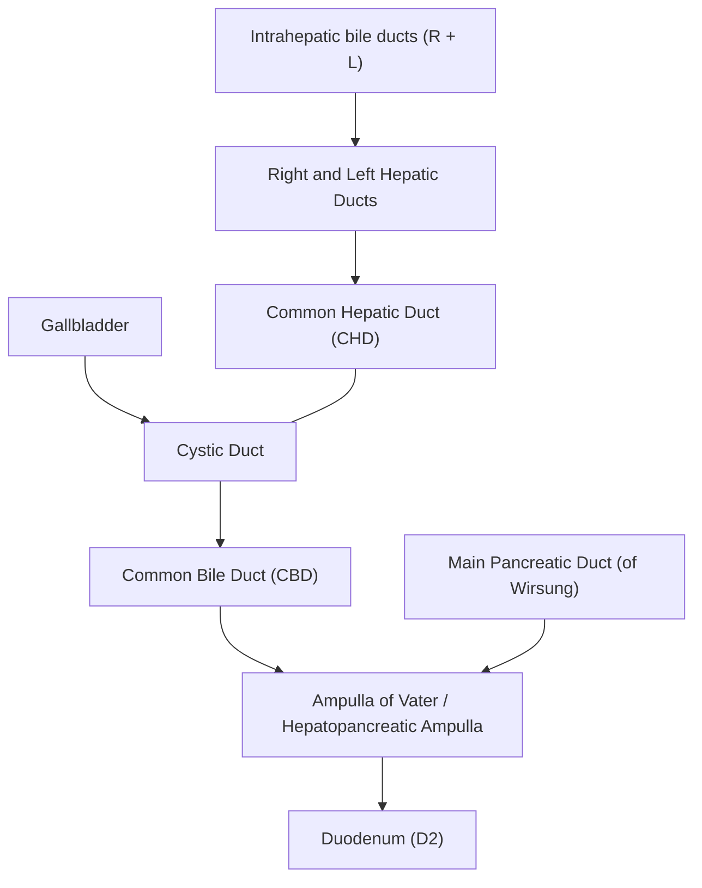
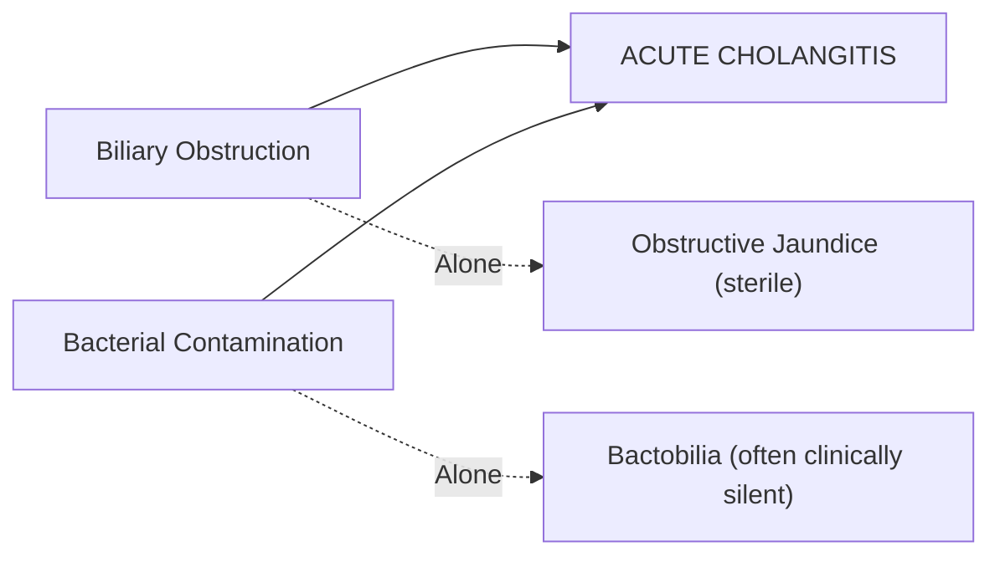

## 1. Definition

Acute cholangitis is a **clinical syndrome of bacterial infection of the biliary tract** arising from a combination of **biliary obstruction** and **bacterial contamination** [1][2][3]. The name itself is instructive:

- **"Chol-"** = bile (Greek: *cholē*)
- **"-ang-"** = vessel/duct (Greek: *angeion*)
- **"-itis"** = inflammation

So cholangitis literally means "inflammation of the bile ducts." In clinical practice, we use the term to mean *infection* of the bile ducts — because the inflammation here is driven by bacteria, not autoimmunity or chemicals.

<Callout title="Key Conceptual Distinction">
Biliary obstruction alone → obstructive jaundice (sterile).
Biliary bacterial contamination alone → often clinically silent.
Biliary obstruction **+** significant bacterial contamination → **Acute Cholangitis** (clinical infection of bile duct) [1][2].

Both components are necessary. This is the single most important concept to grasp.
</Callout>

Acute cholangitis is **one of the two most common complications of CBD stones**, the other being **acute biliary pancreatitis** [1]. It ranges from a mild, self-limiting illness responsive to antibiotics and fluid resuscitation to **fulminant suppurative cholangitis** with septic shock and multi-organ failure requiring emergency biliary drainage.

---

## 2. Epidemiology

### 2.1 Global Epidemiology

- Acute cholangitis accounts for approximately **1–9%** of hospital admissions for gallstone-related disease.
- The incidence rises with age (peak in the **6th–7th decade**) because gallstone prevalence increases with age and biliary instrumentation/stenting becomes more common.
- **Males and females** are affected roughly equally when corrected for the underlying cause; however, because gallstones are more common in females (the classic "4 F's" — Fair, Fat, Fertile, Forty), the raw numbers skew slightly female for stone-related cholangitis.

### 2.2 Hong Kong Context

In Hong Kong and Southeast Asia, the following epidemiological features are particularly relevant:

| Feature | Relevance to Hong Kong |
|---|---|
| **Choledocholithiasis** | Remains the **most common cause** worldwide and in Hong Kong [1][2]. |
| ***Recurrent pyogenic cholangitis (RPC)*** | Also known as **"Hong Kong disease"** / oriental cholangiohepatitis — a uniquely Southeast Asian entity involving recurrent cholangitis from intrahepatic pigment stones and strictures [1][4]. Peak prevalence in the **30s–40s**, equal sex distribution. |
| ***Clonorchis sinensis*** | Liver fluke endemic to areas where raw/undercooked freshwater fish is consumed; causes chronic biliary inflammation predisposing to RPC and cholangiocarcinoma [1][4]. |
| ***Hepatitis B*** | Highly prevalent in Hong Kong; chronic liver disease and cirrhosis contribute to altered bile composition and immunocompromise. |
| **Ageing population** | Increased biliary stenting and ERCP procedures → rising incidence of post-procedural/stent-related cholangitis. |
| **Malignant biliary obstruction** | Pancreatic head carcinoma, cholangiocarcinoma, and periampullary tumours are important causes of cholangitis in the elderly [3][5]. |

---

## 3. Relevant Anatomy and Function of the Biliary System

Understanding acute cholangitis demands a solid grasp of biliary anatomy and the **normal defence mechanisms** that keep bile sterile.

### 3.1 Anatomy of the Biliary Tree

Key anatomical points:

- ***The gallbladder*** consists of **fundus, body, infundibulum (Hartmann's pouch), and neck**. The neck tapers into the **cystic duct**, which joins the CHD to form the CBD [1].
- ***The CBD*** is approximately **7–8 cm long** and runs in the **free edge of the lesser omentum** (hepatoduodenal ligament) alongside the portal vein (posterior) and hepatic artery proper (left). It passes behind the first part of the duodenum and through the head of the pancreas before entering the second part of the duodenum at the **major duodenal papilla (of Vater)**.
- ***The Sphincter of Oddi*** is a muscular sphincter at the distal end of the CBD/ampulla of Vater. It controls the flow of bile (and pancreatic juice) into the duodenum and **acts as a mechanical barrier preventing duodenal-biliary reflux** [1][3].
- **Normal CBD diameter**: ≤ 6–8 mm on ultrasound (may be up to 10 mm in elderly or post-cholecystectomy patients). Dilatation > 8 mm suggests obstruction.
- ***Normal ductal pressure***: **7–14 cm H₂O** [3]. This is a critical number — when obstruction raises ductal pressure above **25 cm H₂O**, bacteria reflux into hepatic veins and peribiliary lymphatics, causing **bacteraemia and potentially septic shock** [3].

### 3.2 Normal Biliary Defence Mechanisms

The bile duct is normally **sterile** despite its connection to the bacteria-laden duodenum. This is maintained by several mechanisms [1]:

| Defence Mechanism | How it works |
|---|---|
| **Continuous flushing action of bile flow** | Antegrade bile flow physically washes bacteria back into the duodenum — like a river current preventing upstream migration. |
| **Bacteriostatic activity of bile salts** | Bile salts are detergents; they disrupt bacterial cell membranes and inhibit growth. |
| **Biliary mucus and secretory IgA** | These act as **anti-adherence factors**, preventing bacteria from colonising the ductal epithelium (similar to the mucosal immune barrier in the gut). |
| ***Sphincter of Oddi*** | A **mechanical barrier** at the ampulla that prevents duodenal reflux and ascending bacterial contamination [1][3]. |

<Callout title="Why does cholangitis occur after sphincterotomy?" type="idea">
After **endoscopic sphincterotomy** (done during ERCP to remove CBD stones), the Sphincter of Oddi is permanently divided. This ablates the mechanical barrier, allowing **free reflux of duodenal contents** into the biliary tree. That is why patients with prior sphincterotomy, biliary stents, or choledochal surgery are at **increased risk of recurrent cholangitis** — the normal barrier is permanently disrupted [1][2].
</Callout>

---

## 4. Etiology (Causes of Biliary Obstruction)

Acute cholangitis requires **obstruction + infection**. The causes of obstruction are therefore the etiological framework [1][2][3][5]:

### 4.1 Causes — Tabulated by Frequency

| Cause | Details | Relative Frequency |
|---|---|---|
| ***Choledocholithiasis (CBD stones)*** | **Most common cause worldwide and in Hong Kong** [1][2][3]. Stones migrate from gallbladder via cystic duct or form de novo in CBD. | Most common (~30–70% of cases) |
| ***Benign biliary strictures*** | Post-surgical injury (e.g., after cholecystectomy), chronic pancreatitis, PSC, post-radiation. | Common |
| ***Malignant biliary obstruction (MBO)*** | **Pancreatic head carcinoma, cholangiocarcinoma, periampullary carcinoma, porta hepatis lymph node metastases** [2][3][5]. | Common in elderly |
| ***Indwelling biliary stents / post-instrumentation*** | Stent occlusion by sludge/biofilm → obstruction proximal to stent; foreign body serves as **nidus for bacterial colonisation** [1][2]. Disrupted sphincter post-sphincterotomy. | Increasingly common |
| **Parasitic infection** | ***Clonorchis sinensis***, Opisthorchis viverrini, Ascaris lumbricoides — adult worms or eggs obstruct bile ducts [1][4]. Particularly important in Hong Kong/Southeast Asia. | Important regionally |
| **Recurrent pyogenic cholangitis (RPC)** | Intrahepatic pigment stone formation + strictures → stasis → recurrent infection. "Hong Kong disease" [1][4]. | Important in Hong Kong |
| **Choledochal cysts** | Congenital dilatation of bile ducts → stasis → risk of cholangitis (and cholangiocarcinoma) [1]. | Rare |
| **Mirizzi syndrome** | Large stone impacted in cystic duct/Hartmann's pouch compressing the CHD externally → obstruction → cholangitis [1]. | Rare |
| **Primary sclerosing cholangitis (PSC)** | Chronic fibrosing inflammation of bile ducts → strictures → stasis → cholangitis. Strong association with **ulcerative colitis** [1]. | Rare in Asia |
| **Biliary-enteric anastomosis stricture** | Stricturing at the site of surgical anastomosis (e.g., hepaticojejunostomy) → stasis → ascending infection. | Post-surgical |

### 4.2 Focus on Hong Kong-Specific Etiologies

#### 4.2.1 Recurrent Pyogenic Cholangitis (RPC) — "Hong Kong Disease"

- **Definition**: Recurrent syndrome of bacterial cholangitis associated with ***intrahepatic pigment stones*** and ***intrahepatic biliary strictures*** [1][4].
- **Pathophysiology** — a vicious cycle:
  1. **Initiating event**: Parasitic infestation (e.g., *Clonorchis sinensis* from raw freshwater fish) → epithelial damage → bacterial translocation → stricture formation → biliary stasis [4].
  2. **Stone formation**: Bacteria (especially *E. coli*, *Klebsiella*) produce **β-glucuronidase** → cleaves conjugated bilirubin glucuronide → unconjugated bilirubin → complexes with calcium → **calcium bilirubinate (brown pigment) stones** [1][4].
  3. **Malnutrition**: Low-protein diet historically common in Asia → relative enzyme deficiency → favours formation of unconjugated bilirubin [4].
  4. **Vicious cycle**: Stone formation → obstruction → stasis → recurrent infection → more inflammation → more stricturing → more stones [1][4].
- **Key differences from typical gallstone disease**: Stones form **de novo within intrahepatic ducts** (not in gallbladder), are **brown pigment** (not cholesterol), and predominantly affect the ***left intrahepatic ducts*** [4].
- **Complications**: Biliary sepsis, liver abscess, secondary biliary cirrhosis, **cholangiocarcinoma** [4].

#### 4.2.2 Clonorchis sinensis Infection

- **Lifecycle**: Humans are the **definitive host**; adult flukes reside in the biliary tract and lay embryonated eggs that pass in faeces [4].
- **Transmission**: Consumption of **poorly cooked freshwater fish** (淡水魚) [4].
- **Clinical spectrum**: Asymptomatic → acute cholangitis → RPC → **increased risk of cholangiocarcinoma** [4].
- **Diagnosis**: Stool microscopy for eggs, duodenal aspirate, USG for adult flukes, intra-operative choledochoscopy [4].
- **Treatment**: ***Praziquantel 25 mg/kg PO TDS × 1 day*** [4].

---

## 5. Pathophysiology

This is the crux of understanding acute cholangitis. Let's build it from first principles.

### 5.1 The Two-Hit Model

***Acute cholangitis requires the combination of: (1) biliary obstruction AND (2) significant bacterial contamination*** [1][2][3].

**Why does obstruction alone not cause cholangitis?**
Because without bacteria, you simply have sterile bile building up → obstructive jaundice. The bile becomes concentrated and stagnant, but there is no infection.

**Why does bactobilia alone not cause cholangitis?**
Because in the absence of obstruction, the continuous flow of bile washes bacteria into the duodenum, and bile salts kill remaining organisms. Up to **16% of patients** undergoing biliary surgery have positive bile cultures without clinical infection [1].

### 5.2 Step-by-Step Pathophysiology

| Step | Event | Mechanism |
|---|---|---|
| **1** | **Biliary obstruction occurs** | Stone impaction, tumour compression, stricture, stent occlusion, or parasites block bile flow. |
| **2** | **Bile stasis develops** | Loss of the flushing action of bile. Stagnant bile loses its bacteriostatic effect. IgA and mucus barrier become overwhelmed. |
| **3** | **Bacterial colonisation** | Bacteria ascend from the duodenum (most common route) or arrive via portal venous haematogenous spread [1]. |
| **4** | ***Intraductal pressure rises*** | ***Normal: 7–14 cm H₂O*** [3]. With obstruction, pressure rises progressively. |
| **5** | ***Pressure exceeds 25 cm H₂O*** | ***Bacteria and endotoxins reflux into hepatic veins and peribiliary lymphatics*** → **bacteraemia** → **systemic inflammatory response (SIRS)** → **sepsis** [3]. |
| **6** | **Impaired antibiotic penetration** | ***Excretion of antibiotics into bile is impaired in biliary obstruction*** — this is why antibiotics alone are often insufficient and ***biliary drainage is mandatory*** [3]. |
| **7** | **Septic shock / suppurative cholangitis** | If undrained, purulent bile (pus) fills the ducts under high pressure → overwhelming sepsis → multi-organ failure → death. |

<Callout title="Why Antibiotics Alone Are Not Enough" type="error">
A common exam mistake is thinking that antibiotics alone can treat cholangitis. ***In biliary obstruction, antibiotic excretion into bile is impaired*** [3] — so even if the right antibiotics are given IV, they cannot reach therapeutic concentrations in the obstructed biliary tree. That is why ***biliary drainage is mandatory*** in moderate-to-severe cholangitis. Think of it like trying to put out a fire in a locked room — you need to open the door (decompress the duct) before the water (antibiotics) can reach the flames.
</Callout>

### 5.3 Bacteriology

The organisms responsible reflect the **gut flora** (since infection ascends from the duodenum) [1][2][3]:

| Category | Organisms | Notes |
|---|---|---|
| ***Gram-negative rods (most common)*** | ***Escherichia coli***, ***Klebsiella pneumoniae***, Enterobacter sp. | These are the dominant pathogens [1][2][3]. They produce endotoxins (lipopolysaccharide) which drive the septic response. |
| ***Enterococci (Gram-positive)*** | *Enterococcus faecalis*, *E. faecium* | The most common Gram-positive organisms in biliary infections [1][2][3]. |
| ***Anaerobes*** | ***Bacteroides fragilis***, Clostridium sp. | More common in severe/complicated infections and in patients with prior biliary-enteric anastomosis [1][3]. |
| ***Pseudomonas aeruginosa*** | | ***More common in patients with biliary stents*** — important because it requires broader-spectrum antibiotic coverage [2]. |

> **High-Yield**: The most common organism in acute cholangitis is ***E. coli***. If a stent is present, think ***Pseudomonas*** in addition to the standard organisms. Anaerobes are more common in severe disease and post-biliary-enteric surgery [2].

### 5.4 Disrupted Barrier Mechanisms

In addition to the primary two-hit model, the **normal barrier mechanisms** described above can be disrupted iatrogenically [1]:

- ***After endoscopic sphincterotomy***: Permanent loss of sphincter of Oddi function → free duodenal-biliary reflux.
- ***Biliary stent insertion***: Foreign body serves as a **nidus for bacterial biofilm** + stent occlusion causes incomplete drainage.
- ***Choledochal surgery / biliary-enteric anastomosis***: Surgical disruption of the normal anatomy removes the anti-reflux mechanism.

In these patients, the threshold for developing cholangitis is **much lower** because one of the two "hits" (bacterial contamination) is essentially always present.

---

## 6. Classification

### 6.1 Anatomical Classification

| Type | Description |
|---|---|
| **Ascending cholangitis** | Infection ascending from the duodenum → most common type in clinical practice [2]. |
| **Descending cholangitis** | Infection spreading from the liver/portal system → less common, seen in liver abscess or haematogenous seeding. |

### 6.2 Pathological Classification

| Type | Description |
|---|---|
| **Non-suppurative (simple) cholangitis** | Infected bile without frank pus. Responds to antibiotics + elective drainage. |
| **Suppurative cholangitis** | Frank purulent bile under pressure. This is the severe, life-threatening form. Requires **emergency biliary decompression**. Characterised by Reynolds' pentad. |

### 6.3 Tokyo Guidelines (TG18/TG24) Severity Grading

The **Tokyo Guidelines** are the internationally accepted severity grading system for acute cholangitis. They stratify patients to guide the **urgency of biliary drainage** [6]:

| Grade | Severity | Criteria | Management Implication |
|---|---|---|---|
| **Grade I** | **Mild** | Acute cholangitis that **does not meet criteria for Grade II or III**. Responds to initial medical treatment (antibiotics + supportive care). No organ dysfunction. | May respond to antibiotics alone initially; early elective biliary drainage. |
| **Grade II** | **Moderate** | Associated with **any TWO** of: WBC > 12,000 or < 4,000/mm³; fever ≥ 39°C; age ≥ 75; bilirubin ≥ 5 mg/dL; albumin < 0.7 × lower limit of normal. *Does not meet Grade III*. Does not respond to initial medical treatment. | Requires **early biliary drainage** (within 24–48 hours). |
| **Grade III** | **Severe** | Associated with **organ dysfunction** in any ONE system: cardiovascular (hypotension requiring vasopressors), neurological (altered consciousness), respiratory (PaO₂/FiO₂ < 300), renal (oliguria, Cr > 2.0 mg/dL), hepatic (PT-INR > 1.5), haematological (Plt < 100,000/mm³). | Requires **urgent/emergency biliary drainage** + organ support (ICU). |

<Callout title="Tokyo Guidelines Severity Grading — Exam Must-Know">
- **Grade I (Mild)**: No organ dysfunction, responds to antibiotics.
- **Grade II (Moderate)**: Does not respond to initial treatment OR has risk factors (high WBC, high fever, elderly, high bilirubin, low albumin).
- **Grade III (Severe)**: **Organ dysfunction** — this is suppurative cholangitis / biliary sepsis. Emergency drainage is life-saving.
</Callout>

### 6.4 Other Classifications

| Classification | Details |
|---|---|
| **By etiology** | Stone-related vs. non-stone (malignant, stricture, stent, parasitic) [2]. |
| **Primary vs. Secondary** | Primary cholangitis = PSC (autoimmune). Secondary = all other causes (obstruction-related). The term "primary" distinguishes PSC from secondary sclerosing cholangitis [1]. |
| **IgG4-associated cholangitis** | ***Infiltration of biliary system with IgG4-positive plasma cells***, mostly in ***elderly males***. Part of the IgG4-related disease spectrum. Responds to corticosteroids [2]. |

---

## 7. Clinical Features

### 7.1 Symptoms

The clinical presentation of acute cholangitis follows directly from the pathophysiology: biliary obstruction + infection → pain (from ductal distension) + jaundice (from obstruction) + fever (from infection/bacteraemia).

#### 7.1.1 ***Charcot's Triad*** (present in **50–70%** of patients) [1][2]

| Symptom | Pathophysiological Basis |
|---|---|
| ***Fever (with or without rigors/chills)*** | Bacteraemia: when intraductal pressure exceeds ~25 cm H₂O, bacteria and endotoxins reflux into hepatic veins and lymphatics → systemic inflammatory response → fever. **Rigors** (shaking chills) indicate bacteraemia with endotoxaemia — the body's thermoregulatory "reset" to a higher set-point [3]. |
| ***Right upper quadrant (RUQ) / epigastric abdominal pain*** | Distension of the bile duct wall by impacted stone or increased intraductal pressure stimulates visceral afferent pain fibres (carried via the **coeliac plexus** and splanchnic nerves to T6–T9 dermatomes). The pain is typically **constant and dull** (unlike the colicky pain of biliary colic which is from gallbladder contraction against a stone in the cystic duct). |
| ***Jaundice*** | Biliary obstruction → conjugated bilirubin cannot be excreted into the duodenum → **accumulates in the blood** → deposits in skin and sclerae (yellow). Conjugated bilirubin is water-soluble → excreted by the kidneys → **dark urine (tea-coloured)**. Reduced bilirubin reaching the gut → less stercobilinogen → **pale/clay-coloured stools**. |

<Callout title="Charcot's Triad" type="idea">
A useful mnemonic: **"F-A-J"** — **F**ever, **A**bdominal pain, **J**aundice. Named after Jean-Martin Charcot (1877), the famous French neurologist who also described Charcot-Marie-Tooth disease and Charcot joints. Present in 50–70% but **NOT in all patients** — absence does not exclude the diagnosis [1][2].
</Callout>

#### 7.1.2 ***Reynolds' Pentad*** (present in **< 10%** of patients) [1][2]

This represents **Charcot's triad PLUS two additional features** indicating progression to **suppurative cholangitis with septic shock**:

| Additional Feature | Pathophysiological Basis |
|---|---|
| ***Hypotension (shock)*** | Overwhelming bacteraemia → massive release of endotoxins (LPS from Gram-negative bacteria) → activation of inflammatory cascade (TNF-α, IL-1, IL-6) → systemic vasodilation + increased capillary permeability + myocardial depression = **distributive (septic) shock**. This is the same pathway as any Gram-negative sepsis. |
| ***Altered mental status (confusion)*** | Cerebral hypoperfusion from shock + direct neurotoxic effects of systemic endotoxaemia + metabolic encephalopathy (hepatic dysfunction from cholestasis, renal dysfunction from shock) → decreased consciousness ranging from confusion to obtundation. |

> **High-Yield**: Reynolds' pentad = Charcot's triad + **Shock** + **Confusion**. It indicates **suppurative cholangitis**, a surgical emergency requiring **immediate biliary drainage**. Mortality without drainage is extremely high (approaching 50–100%) [1][2].

#### 7.1.3 Other Symptoms

| Symptom | Mechanism |
|---|---|
| **Nausea and vomiting** | Visceral afferent stimulation from biliary distension triggers the vomiting centre via vagal afferents. Also common in any systemic sepsis. |
| **Dark urine** | Conjugated (water-soluble) bilirubin excreted renally → urine becomes tea/cola-coloured. This is **conjugated** hyperbilirubinaemia because the obstruction is post-hepatic. |
| **Pale stools (acholic stools)** | Reduced bilirubin entering the gut → less conversion to stercobilinogen/stercobilin → clay/putty-coloured stools. |
| **Pruritus** | Bile salt deposition in the skin due to cholestasis → activates itch receptors (pruritoceptors). More common in chronic/subacute obstruction than in acute cholangitis. |
| **Anorexia and malaise** | Systemic inflammatory response + hepatic dysfunction. |

### 7.2 Signs

#### 7.2.1 General Examination

| Sign | Pathophysiological Basis |
|---|---|
| ***Fever (often high-grade, > 38.5°C, with rigors)*** | Bacteraemia with endotoxin release → pyrogenic cytokines (IL-1, TNF-α, IL-6) act on the hypothalamic thermoregulatory centre → febrile response. Rigors indicate the temperature is being "reset" to a higher set-point. |
| ***Jaundice (scleral icterus first)*** | Conjugated hyperbilirubinaemia. Sclera have high elastin content with affinity for bilirubin → icterus visible when serum bilirubin > 34 μmol/L (~2 mg/dL). Best detected in **natural daylight**. |
| **Tachycardia** | Systemic inflammatory response → increased sympathetic drive + if hypovolaemic from sepsis → compensatory tachycardia. |
| ***Hypotension*** (in severe cholangitis) | Septic shock — see above. |
| **Dehydration** | Poor oral intake + fever + third-space losses from sepsis. |

#### 7.2.2 Abdominal Examination

| Sign | Pathophysiological Basis |
|---|---|
| ***RUQ tenderness*** | Palpation over the distended, inflamed bile duct and surrounding peritoneum → localised somatic pain. The gallbladder fossa and CBD lie beneath the right costal margin at the intersection with the lateral border of the rectus abdominis (the **hepatic point**). |
| **Murphy's sign** — ***typically NEGATIVE*** (important distinguishing feature) | Murphy's sign is positive in **acute cholecystitis** (inflammation of the gallbladder), NOT in cholangitis. In cholangitis, the primary pathology is in the bile duct, not the gallbladder. However, if concurrent cholecystitis is present (e.g., from a stone impacted at the cystic duct), Murphy's sign may be positive. |
| **Hepatomegaly** | Biliary obstruction → bile duct distension → secondary hepatic congestion and inflammation → liver may be palpably enlarged and tender. In chronic/recurrent cholangitis (e.g., RPC), hepatomegaly may be more pronounced due to parenchymal changes. |
| ***No peritonism*** (usually) | Cholangitis is an *intraductal* infection. Unlike perforated viscus or appendicitis, there is no peritoneal soiling — so generalised peritonitis with guarding and rigidity is typically absent unless there is perforation or concomitant pathology. |

<Callout title="Cholangitis vs. Cholecystitis — Don't Confuse Them" type="error">
- **Cholangitis** = infection of the **bile duct** → Charcot's triad (Fever + Pain + Jaundice); Murphy's sign typically negative; jaundice is prominent.
- **Cholecystitis** = inflammation of the **gallbladder** → Murphy's sign positive; fever; RUQ pain; jaundice is **uncommon** (only ~20%, usually from Mirizzi syndrome or co-existing CBD stone).

The key differentiator: **Jaundice** is much more prominent in cholangitis. Murphy's sign is positive in cholecystitis but not cholangitis.
</Callout>

#### 7.2.3 Signs of Complications / Severity

| Sign | Significance |
|---|---|
| **Altered mental status** | Part of Reynolds' pentad — indicates suppurative cholangitis / septic encephalopathy. |
| **Oliguria** | Renal hypoperfusion from septic shock → acute kidney injury. |
| **Cold, clammy skin** | Late sign of distributive shock → compensatory peripheral vasoconstriction. |
| **Metabolic acidosis** (on ABG) | Tissue hypoperfusion → anaerobic metabolism → lactic acidosis. |
| **Petechiae / bleeding** | Disseminated intravascular coagulation (DIC) from sepsis + impaired hepatic synthesis of clotting factors from biliary obstruction + reduced vitamin K absorption (fat-soluble vitamin requiring bile salts for absorption). |

---

## 8. Summary of Pathophysiology → Clinical Feature Connections

| Pathophysiology | Clinical Feature |
|---|---|
| Biliary obstruction → ↑ intraductal pressure → ductal distension | RUQ / epigastric pain |
| Obstruction → conjugated bilirubin retention | Jaundice, dark urine, pale stools, pruritus |
| Bacterial contamination + stasis → infection → bacteraemia | Fever, rigors, raised WBC, positive blood cultures |
| ***Intraductal pressure > 25 cm H₂O → cholangiovenous reflux*** [3] | Bacteraemia → SIRS → sepsis → septic shock |
| Septic shock → organ hypoperfusion | Hypotension, altered mental status, oliguria, metabolic acidosis |
| ***Impaired antibiotic excretion in obstructed system*** [3] | Failure of antibiotics alone → need for biliary drainage |
| Cholestasis → reduced bile salt in gut | Fat malabsorption, vitamin K deficiency → coagulopathy |

---

<Callout title="High Yield Summary">

**Definition**: Acute cholangitis = bacterial infection of biliary tract due to **obstruction + bacterial contamination** (both required).

**Most common cause**: Choledocholithiasis (CBD stones). In Hong Kong, also think of **RPC** and **Clonorchis sinensis**.

**Normal biliary defences**: Bile flow flushing, bile salt bacteriostasis, mucosal IgA, Sphincter of Oddi barrier.

**Pathophysiology**: Obstruction → stasis → bacterial overgrowth → raised intraductal pressure → ***cholangiovenous/lymphatic reflux when pressure > 25 cm H₂O*** → bacteraemia → sepsis. ***Antibiotic excretion is impaired in obstruction → biliary drainage is mandatory***.

**Bacteriology**: ***Gram-negative rods*** (E. coli, Klebsiella) most common; ***Enterococci***; ***anaerobes*** in severe cases; ***Pseudomonas*** if stent present.

**Clinical features**:
- ***Charcot's triad*** (50–70%): **Fever + RUQ pain + Jaundice**
- ***Reynolds' pentad*** ( < 10%): Charcot's triad + **Hypotension + Altered mental status** = suppurative cholangitis = surgical emergency

**Tokyo Guidelines severity**:
- Grade I (Mild): Responds to antibiotics
- Grade II (Moderate): Does not respond / has risk factors
- Grade III (Severe): **Organ dysfunction** → emergency drainage

**Key distinguishing point**: Murphy's sign is positive in cholecystitis, NOT cholangitis. Jaundice is prominent in cholangitis, often absent in cholecystitis.

</Callout>

---

<ActiveRecallQuiz
  title="Active Recall - Acute Cholangitis (Definition to Clinical Features)"
  items={[
    {
      question: "What two conditions must coexist for acute cholangitis to develop?",
      markscheme: "Biliary obstruction AND significant bacterial contamination. Obstruction alone causes sterile obstructive jaundice; bacteria alone causes asymptomatic bactobilia."
    },
    {
      question: "What is the normal biliary ductal pressure, and at what threshold do bacteria reflux into the bloodstream?",
      markscheme: "Normal: 7-14 cm H2O. Cholangiovenous/lymphatic reflux occurs when pressure exceeds 25 cm H2O, leading to bacteraemia and potentially septic shock."
    },
    {
      question: "Name the components of Charcot's triad and Reynolds' pentad, and state the approximate percentage of patients presenting with each.",
      markscheme: "Charcot's triad (50-70%): Fever, RUQ pain, Jaundice. Reynolds' pentad (less than 10%): Charcot's triad plus Hypotension and Altered mental status (confusion). Reynolds' pentad indicates suppurative cholangitis."
    },
    {
      question: "Why are antibiotics alone insufficient to treat moderate-to-severe acute cholangitis?",
      markscheme: "Antibiotic excretion into bile is impaired when the biliary system is obstructed. Therefore, therapeutic antibiotic concentrations cannot be achieved at the site of infection. Biliary drainage is mandatory to decompress the system and allow source control."
    },
    {
      question: "A patient with a biliary stent develops acute cholangitis. What additional organism should you cover for, compared to standard cholangitis, and why?",
      markscheme: "Pseudomonas aeruginosa. Biliary stents act as foreign bodies that serve as nidus for biofilm formation; Pseudomonas is commonly associated with healthcare-associated/foreign body-related infections and requires broader-spectrum antibiotic coverage."
    },
    {
      question: "Explain the pathophysiology of recurrent pyogenic cholangitis (RPC) and state why it is called 'Hong Kong disease'.",
      markscheme: "RPC involves intrahepatic pigment stone formation due to bacterial beta-glucuronidase cleaving conjugated bilirubin to unconjugated bilirubin, which complexes with calcium to form calcium bilirubinate stones. Parasitic infection (e.g., Clonorchis sinensis) initiates epithelial damage leading to strictures, stasis, and recurrent infection in a vicious cycle. Called 'Hong Kong disease' because it is found exclusively/predominantly in Southeast Asian populations."
    }
  ]}
/>

---

## References

[1] Senior notes: felixlai.md (Acute cholangitis, Recurrent pyogenic cholangitis, Primary sclerosing cholangitis, Mirizzi syndrome sections)
[2] Senior notes: maxim.md (Acute cholangitis, Choledocholithiasis, Recurrent pyogenic cholangitis sections)
[3] Lecture slides: Malignant biliary obstruction.pdf (p16 — Cholangitis: biliary pressure, cholangiovenous reflux, impaired antibiotic excretion, mandatory drainage)
[4] Senior notes: felixlai.md and maxim.md (Recurrent pyogenic cholangitis, Clonorchis sinensis sections)
[5] Lecture slides: HCC and Gallstone acute cholangitis_Prof TT Cheung.pdf
[6] Lecture slides: GC 200. RUQ pain, jaundice and fever Cholecytitis and cholangitis Imaging of GI system.pdf (p7 — Acute Cholangitis pathogenesis)
