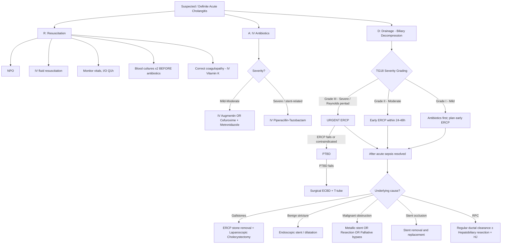

## Management of Acute Cholangitis

### Guiding Principles — Why We Treat the Way We Do

Before diving into specifics, let's ground the entire management framework in the pathophysiology we've already established. Acute cholangitis = **obstructed + infected biliary tree**. Therefore, management must address **three pillars** simultaneously [1][2][3][17][18]:

1. **Resuscitate the patient** — they are septic; support the circulation and organs.
2. **Kill the bacteria** — IV antibiotics to control the infection.
3. **Relieve the obstruction** — biliary drainage to decompress the system (because ***antibiotics alone cannot work in an obstructed system*** — their excretion into bile is impaired [3]).

After the acute episode is controlled, a fourth pillar becomes relevant:

4. **Treat the underlying cause** — to prevent recurrence (e.g., cholecystectomy for gallstones, stent for malignant stricture, hepatectomy for RPC).

The mnemonic from the senior notes captures this perfectly:

<Callout title="RAD — Acute Management Framework (Must Know!)">

***R*** = ***Resuscitation*** (NPO, IV fluids, monitor vitals & I/O)
***A*** = ***Antibiotics*** (IV, broad-spectrum, targeting biliary pathogens)
***D*** = ***Drainage*** (biliary decompression — urgency determined by severity grading)

Then: **Definitive management** of the underlying cause once acute sepsis resolved [2].
</Callout>

---

### Master Management Algorithm

---

### Pillar 1: Resuscitation (R)

This is **standard sepsis management** — the same principles you'd apply to any patient with sepsis from any source. The biliary focus simply adds specific nuances [1][2][17][18].

| Intervention | Rationale | Details |
|---|---|---|
| ***Keep the patient fasting (NPO)*** | Bowel rest reduces cholecystokinin (CCK) release → reduces gallbladder contraction and bile flow → reduces pressure in the obstructed system. Also prepares the patient for potential ERCP/surgery [2][7][17]. | ***"Keep the patient fast"*** [7]. |
| ***Intravenous fluid resuscitation*** | Sepsis causes vasodilation + capillary leak + third-space losses → intravascular volume depletion → tissue hypoperfusion. Aggressive IV crystalloid restores circulating volume and supports organ perfusion [1][2][17][18]. | Target **urine output > 0.5 mL/kg/h** as a marker of adequate renal perfusion. |
| **Monitor vitals and I/O Q1h** | ***Continuous monitoring of vitals to look for signs of failure of conservative treatment*** [1][2]: ↑ Temperature/Pulse; ↓ BP/Consciousness level/Urine output; increased abdominal tenderness and guarding. | These are red flags indicating deterioration — triggers for escalation to urgent drainage. |
| **Blood cultures × 2 before antibiotics** | Identify the causative organism and guide de-escalation from empirical to targeted therapy [2]. Must be taken **before** antibiotics (antibiotics sterilise blood quickly). | Aerobic + anaerobic bottles, from two different venepuncture sites. |
| **Correct coagulopathy** | Obstructive jaundice → impaired bile salt delivery to gut → reduced absorption of fat-soluble vitamin K → deficiency of clotting factors II, VII, IX, X → coagulopathy [1]. Must correct **before any invasive procedure** (ERCP, PTBD). | IV Vitamin K (phytomenadione) 10 mg slow IV. Effect takes ~6–12 hours. For urgent procedures, consider fresh frozen plasma (FFP) for immediate correction. |
| **Analgesics** | Pain control is humane and reduces sympathetic drive (which worsens tachycardia and vasoconstriction). | Paracetamol, NSAIDs (with caution if renal function impaired), opioids if needed. **Avoid morphine** if concurrent pancreatitis suspected (potential sphincter of Oddi spasm) [19]. |
| **Organ support if needed** | Grade III (severe) cholangitis with organ dysfunction may require ICU admission. | Vasopressors for refractory hypotension (noradrenaline first-line in septic shock), mechanical ventilation for respiratory failure, renal replacement therapy for AKI. |

> **High-Yield**: ***Recognize signs of shock*** — ***hypotension, oliguria, changes in mental status, cold and clammy skin, and metabolic acidosis*** — these are signs that the patient is moving towards Grade III and requires emergency intervention [1].

---

### Pillar 2: Antibiotics (A)

#### Why Antibiotics Matter — But Aren't Enough

Antibiotics target the bacteria driving the infection. However, recall the critical pathophysiology: ***excretion of antibiotics into bile is impaired in biliary obstruction*** [3]. This means that even with the correct antibiotic given IV, therapeutic concentrations at the site of infection (within the obstructed biliary tree) may not be achieved. This is why ***biliary drainage is mandatory*** — you must open the system for the antibiotics to work [3].

That said, antibiotics are essential to control the systemic sepsis (bacteraemia) and prevent progression to multi-organ failure while drainage is being arranged.

#### Empirical Antibiotic Regimens

Empirical antibiotics must cover the expected biliary pathogens: ***Gram-negative rods*** (E. coli, Klebsiella) + ***Enterococci*** + ***Anaerobes*** [1][7].

| Regimen | Components | When to Use | Rationale |
|---|---|---|---|
| ***IV Cefuroxime + Metronidazole*** | 2nd-gen cephalosporin (Gram-neg cover) + nitroimidazole (anaerobic cover) | ***Mild-to-moderate cholangitis*** [7] | Cefuroxime covers most community-acquired Gram-negatives; metronidazole ("metro" = uterus in Greek, but the drug targets **anaerobes** by forming toxic free radicals in anaerobic bacteria that lack protective enzymes). |
| ***IV Augmentin (Amoxicillin-Clavulanate)*** | Aminopenicillin + β-lactamase inhibitor | ***Mild cholangitis*** [2] | Covers Gram-positives (including Enterococci), many Gram-negatives, and some anaerobes. The clavulanate inhibits bacterial β-lactamase enzymes that would otherwise destroy the amoxicillin. |
| ***IV Piperacillin-Tazobactam (Tazocin)*** | Extended-spectrum penicillin + β-lactamase inhibitor | ***Severe cholangitis*** [2][7] | Broader spectrum than Augmentin — covers Pseudomonas aeruginosa (critical if **stent-related cholangitis**), Enterococci, Gram-negatives, and anaerobes. Tazobactam inhibits a wider range of β-lactamases. |
| **Metronidazole + 3rd-gen cephalosporin (Ceftriaxone)** | As described | Alternative regimen [1] | Ceftriaxone provides excellent Gram-negative cover including many resistant organisms; add metronidazole for anaerobes. Note: ceftriaxone does **not** cover Enterococci. |
| **Metronidazole + Fluoroquinolone (Ciprofloxacin/Levofloxacin)** | As described | Alternative regimen (e.g., penicillin allergy) [1] | Fluoroquinolones provide Gram-negative and some Gram-positive cover. Use with caution due to increasing resistance and side effects (tendon rupture, QT prolongation). |

<Callout title="Antibiotic Choice Summary from Lecture Slides">

***Lecture slide antibiotics for acute cholangitis*** [7]:
- ***Cefuroxime***
- ***Metronidazole***
- ***Piperacillin + Tazobactam***

***Senior notes*** [2]:
- ***Mild: IV Augmentin***
- ***Severe: IV Tazocin***
- **Duration: × 7 days** (adjust based on culture results and clinical response)
</Callout>

#### Duration and De-escalation

- **Empirical antibiotics for 7 days** [2], or until the source is controlled (drainage achieved) and clinical response is seen.
- **De-escalate** to targeted therapy once blood/bile culture and sensitivity results are available.
- In mild cases that respond quickly to drainage, shorter courses (3–5 days) may be adequate per TG18 recommendations.

#### Antibiotic Prophylaxis for Procedures

- ***Antibiotics are recommended before ERCP***, especially in acute cholangitis — the biliary tract is normally sterile, and instrumentation can introduce or exacerbate infection [16][20].
- If ERCP results in ***incomplete drainage***, antibiotics should be ***continued after the procedure*** [20].

---

### Pillar 3: Drainage (D) — Biliary Decompression

This is the **most critical** pillar. Without drainage, the obstructed, infected biliary tree acts like an undrained abscess — no amount of antibiotics will clear the infection if the pus (infected bile) remains under pressure [3].

#### When to Drain — Guided by Severity

| TG18 Grade | Drainage Timing | Rationale |
|---|---|---|
| **Grade I (Mild)** | **Elective/early** — antibiotics first, drain when available | Most respond to antibiotics initially. However, early drainage is still recommended to prevent deterioration. |
| **Grade II (Moderate)** | ***Early drainage within 24–48 hours*** | Does not respond to initial medical treatment, or has risk factors for deterioration. Delay increases morbidity. |
| **Grade III (Severe)** | ***URGENT/EMERGENCY drainage*** | Organ dysfunction present. ***Urgent if Reynolds' pentad, not responding to antibiotics for 24h*** [2]. Every hour of delay increases mortality. |

<Callout title="15% Rule" type="error">
***15% of patients will NOT respond to antibiotics*** and require emergency biliary decompression [1]. This is why you must continuously monitor — if the patient is not improving within 24 hours, escalate to drainage regardless of severity grade.
</Callout>

#### Drainage Modalities — The Escalation Ladder

The ***QMH practice*** drainage escalation is: ***ERCP → PTBD → ECBD*** [1]. Let's detail each step.

---

#### D1. ***Endoscopic Retrograde Cholangiopancreatography (ERCP)*** — 1st Line

***ERCP +/- biliary stenting*** is the ***first-line approach*** for biliary drainage in acute cholangitis [2][7][14].

**Breaking down the name**: "Endoscopic" = using an endoscope; "Retrograde" = going backwards (against the normal flow of bile, from the duodenum up into the duct); "Cholangio-" = bile duct; "Pancreatography" = imaging of the pancreatic duct. So ERCP = using an endoscope to image and access the bile and pancreatic ducts from below.

| Aspect | Detail |
|---|---|
| **Role in acute cholangitis** | ***Biliary drainage and decompression in unstable patients — NOT stone removal*** [2]. The priority is to decompress the infected system, not to clear every stone. |
| **Technique** | 1. ***Aspirate bile duct first*** → removes bile and pus → decompresses biliary tree → ***reduces risk of inducing bacteraemia during contrast injection*** [2]. 2. Inject contrast → delineate anatomy, level and cause of obstruction. 3. ***Place plastic stent*** (temporary, requires scheduled change) to maintain duct patency and drainage [2]. 4. ± Sphincterotomy (cut the sphincter of Oddi with electrocautery to facilitate drainage/stone extraction). |
| **Stone removal timing** | ***Remove stone now OR interval ERCP after sepsis resolves*** [2]. In a sick, unstable patient, just stent and drain. Come back for definitive stone removal when the patient is stable. |
| **Stent types** | ***Plastic stent*** — for acute drainage (temporary, cheaper, requires scheduled replacement every 3 months as they occlude). ***Self-expanding metal stent (SEMS)*** — for malignant obstruction (more durable, longer patency, but more expensive and difficult to remove) [1][15]. |
| **Mortality** | ***< 5%*** with endoscopic drainage [2] — compared to **~30% mortality** with surgical exploration of CBD [2]. |
| **Methods of stone retrieval (when stable)** | ***Wire baskets*** — literally a wire cage that captures the stone. ***Stone extraction balloon*** — inflated below the stone and pulled down to sweep it out. ***Mechanical lithotripsy*** — crushes large stones too big to extract whole [10]. |

| ***Potential complications*** [7][14] | Mechanism |
|---|---|
| ***Perforation*** | **Intraperitoneal perforation**: duodenal wall perforated → free gas under diaphragm on CXR → requires **operative treatment** (will not seal spontaneously). **Retroperitoneal perforation**: bile duct perforated when cutting the ampulla (retroperitoneal portion of D2) → no free gas under diaphragm, but **retroperitoneal gas may be present** on CT → usually **conservative treatment** (seals spontaneously) [1]. |
| ***Bleeding from papillotomy (sphincterotomy)*** | Electrocautery incision through the sphincter may transect a blood vessel at the papilla. Usually controlled endoscopically (adrenaline injection, clips, cautery). |
| ***Post-ERCP pancreatitis*** | Occurs in ~3–5% of ERCPs. Cannulation and contrast injection can traumatise the pancreatic duct orifice → oedema at the ampulla → obstruction of pancreatic duct → enzyme activation → pancreatitis. Prevention: pancreatic duct stent placement, rectal NSAIDs (diclofenac/indomethacin) [16]. |
| **Infection (flare-up sepsis)** | Injecting contrast into an obstructed system can worsen bacteraemia. That's why ***aspirate first before injecting contrast*** [2]. |

| ***Relative contraindications for ERCP*** [7][14] | Rationale |
|---|---|
| ***Altered GI anatomy*** — ***Billroth II gastrectomy, Roux-en-Y*** | The side-viewing duodenoscope cannot reach the papilla when the normal duodenal anatomy has been surgically altered. In Billroth II, the duodenal stump is closed; in Roux-en-Y, the efferent limb is too long for a standard scope. May require balloon-assisted enteroscopy ERCP or surgical approach. |
| **Unstable patient** (absolute) | Cannot tolerate sedation/prone position. Stabilise first, then drain. If too unstable for ERCP, consider bedside PTBD. |
| **Uncorrected coagulopathy** | Sphincterotomy carries bleeding risk. Either correct coagulopathy first, or use ***nasobiliary drain or direct stent placement without sphincterotomy*** as an alternative in patients with coagulopathy [1]. |
| **Contrast allergy** (absolute) | Risk of anaphylaxis. |

<Callout title="Nasobiliary Drain — The Coagulopathy Option">
In patients where **sphincterotomy cannot be performed** (e.g., due to coagulopathy), a ***nasobiliary drain catheter*** can be placed during ERCP without cutting the sphincter. This permits ***active decompression of the CBD by aspiration*** and provides a route for irrigation of the biliary system. The catheter exits through the nose, allowing bedside monitoring of bile output [1].
</Callout>

**Papillary Balloon Dilatation (Balloon Sphincteroplasty)** — an alternative to sphincterotomy:
- Dilates the ampulla with a balloon rather than cutting it, attempting to **preserve the biliary sphincter** [1].
- Lower risk of bleeding than sphincterotomy.
- Safety has been questioned (higher risk of pancreatitis in early studies); ***endoscopic sphincterotomy remains the method of choice*** [1].

---

#### D2. ***Percutaneous Transhepatic Biliary Drainage (PTBD)*** — 2nd Line

| Aspect | Detail |
|---|---|
| **When used** | ***Indicated when ERCP is unsuccessful, unavailable, or contraindicated*** (e.g., altered GI anatomy, poor respiratory function preventing sedation/prone position) [1][2]. |
| **Procedure** | Under USG/fluoroscopic guidance, a needle is inserted percutaneously through the liver into a ***dilated intrahepatic bile duct*** (***NOT the CBD directly***) [2]. Guidewire → catheter placement → external drainage. |
| **Preferred access** | ***Left hepatic duct*** — subcostal approach is ***less painful*** than intercostal route for right duct and ***less likely to transgress the pleural space*** [1]. |
| **Efficacy** | ***Similar efficacy and complication rates as ERCP*** [2]. |
| **Advantages** | ***Easy output monitoring*** — external drainage catheter allows direct measurement of bile output [2]. Can be ***internalised later*** (internal-external drainage). Can access ***hilar and intrahepatic obstruction*** that ERCP cannot reach from below (e.g., Klatskin tumour, RPC) [4]. |
| **Limitations** | More invasive (traverses liver parenchyma). Risk of bleeding (haemobilia), pneumothorax (right-sided approach), bile leak, catheter dislodgement. ***Risk of fluid and electrolyte loss*** through external drainage [2]. |
| **Confirmation of adequate drainage** | Steady decline in serum bilirubin over subsequent days [1]. |

> ***Management of cholangitis: Resuscitation → Treat sepsis with intravenous antibiotic → Decompression of biliary system: Endoscopic vs percutaneous → Definitive management*** [3][17][18].

---

#### D3. ***Surgical Drainage — Exploration of Common Bile Duct (ECBD)*** — Last Resort

***Surgical drainage is reserved for patients in whom other methods of biliary drainage cannot be performed or have failed*** [1][7][15].

| Aspect | Detail |
|---|---|
| ***Indications*** [7][15] | ***Failure of endoscopic drainage*** OR ***Deterioration despite endoscopic drainage***. |
| **Approach** | ***Open approach for emergency case; laparoscopic approach in selected elective cases*** [7][15]. |
| **Procedure** | Open/laparoscopic ECBD → **choledochotomy** (incision into CBD) → removal of stones → **placement of T-tube** for post-operative drainage and subsequent cholangiogram [1][2]. |
| **Mortality** | ***~30%*** in the emergency setting — significantly higher than endoscopic drainage ( < 5%) [2]. This is precisely why surgery is the **last resort**. |
| **T-tube** | A T-shaped rubber tube placed in the CBD after exploration. The horizontal limb sits inside the CBD; the vertical limb exits through the abdominal wall. Allows post-operative bile drainage + subsequent T-tube cholangiogram to check for residual stones. However, T-tubes are associated with complications (infection, bile leak, tube dislodgement) and are falling out of favour [10]. |

<Callout title="Surgical Treatment — Key Slide Points">

***Decompression by exploration of common bile duct (ECBD)*** [7][15]:
- ***Indications: failure of endoscopic drainage; deterioration despite endoscopic drainage***
- ***Open approach for emergency case***
- ***Laparoscopic approach in selected elective case***

This is the last step in the ***QMH escalation: ERCP → PTBD → ECBD*** [1].
</Callout>

---

#### D4. Therapeutic EUS (EUS-Guided Biliary Drainage) — Emerging Option

- ***EUS-guided cholangiopancreatography*** is an emerging technique when ERCP fails [2].
- The echoendoscope is used to puncture the bile duct from the stomach or duodenum under ultrasound guidance, and a stent is placed transmurally.
- Still requires specialised expertise and equipment; not universally available but increasingly used as a rescue option before resorting to surgery or PTBD.

---

### Summary: Drainage Escalation

| Step | Modality | Mortality | When |
|---|---|---|---|
| **1st line** | ***ERCP +/- biliary stenting*** | < 5% | Standard approach for all grades |
| **2nd line** | ***PTBD*** | Similar to ERCP | ERCP fails/contraindicated |
| **Emerging** | **EUS-guided biliary drainage** | Data evolving | ERCP fails, expertise available |
| **3rd line (last resort)** | ***Surgical ECBD + T-tube*** | ~30% | Both ERCP and PTBD fail |

---

### Pillar 4: Definitive Management — Treating the Underlying Cause

***Definitive treatment should be deferred until cholangitis has been treated and the proper diagnosis is established*** [1][18]. Once the acute sepsis is controlled and the patient is stable, address the underlying etiology to prevent recurrence.

| Underlying Cause | Definitive Management | Key Points |
|---|---|---|
| ***Choledocholithiasis (gallstones)*** | ***ERCP for stone removal (lithotripsy) + Laparoscopic cholecystectomy*** [2][10] | **Early cholecystectomy** (during the same admission, rather than interval) is now preferred — reduces risk of recurrent biliary events. Stone removal at ERCP: sphincterotomy + wire basket / balloon extraction / mechanical lithotripsy [10]. Note: ***ascending cholangitis is still possible after cholecystectomy*** due to biliary stasis from ***ERCP-induced CBD dilatation or ageing-related CBD dilatation*** [2]. |
| ***Stent occlusion*** | ***Stent removal and replacement*** [1] | Patients with indwelling stents and cholangitis usually require repeated imaging and stent exchange. Plastic stents occlude every ~3 months; metal stents last longer but can also occlude (sludge, tumour ingrowth/overgrowth). |
| ***Benign biliary stricture*** | ***Endoscopic stent placement / balloon dilatation*** [2] | Serial dilatation and stenting over months may be needed. If refractory, surgical biliary-enteric anastomosis (hepaticojejunostomy). |
| ***Malignant biliary obstruction (MBO)*** | Determined by resectability [1][3][17][18] | ***Establish diagnosis → Delineate level and cause of obstruction → Treat suppurative cholangitis → Definitive treatment*** [3][17]. **Resectable**: Surgical resection (e.g., ***Whipple operation*** for pancreatic head/periampullary tumour). **Unresectable**: Palliative stenting (***metallic stent*** preferred for durability) or palliative surgical bypass (***hepaticojejunostomy / choledochojejunostomy***) [1]. |
| ***RPC*** | ***Regular ductal clearance + surgical resection*** [2][4] | ERCP is difficult for intrahepatic access → ***PTBD, T-tube drainage, hepaticocutaneojejunostomy (HCJ)*** for acute drainage [4]. Long-term: regular USG surveillance, ERCP stone clearance/stricture dilatation. ***Resection of affected hepatobiliary segment + biliary-enteric anastomosis (hepaticojejunostomy)*** — indicated for atrophic liver segment, failed non-operative treatment, or suspected cholangiocarcinoma [4]. |
| **Parasitic infection** | ***Praziquantel*** (for Clonorchis sinensis: 25 mg/kg PO TDS × 1 day) [4] | Eradicate the parasite to break the cycle of epithelial damage → stricture → stasis → stone formation. |

---

### Management According to Clinical Scenario — Synthesis

| Scenario | Acute Management | Drainage Approach | Definitive Management |
|---|---|---|---|
| **Grade I cholangitis from CBD stone** | NPO, IVF, IV Augmentin, monitor | Elective ERCP (sphincterotomy + stone extraction) | Early laparoscopic cholecystectomy |
| **Grade II cholangitis from CBD stone** | NPO, IVF, IV Tazocin, monitor closely | Early ERCP within 24–48h (stent ± stone extraction) | Interval stone removal if deferred + cholecystectomy |
| **Grade III cholangitis (Reynolds' pentad)** | Aggressive resuscitation, IVF, vasopressors if needed, IV Tazocin, ICU | ***URGENT ERCP*** → PTBD if fails → ECBD if both fail | Once stable: definitive treatment of cause |
| **Cholangitis from malignant obstruction** | NPO, IVF, IV antibiotics, correct coagulopathy | ERCP stenting (plastic → metal when diagnosis confirmed) OR PTBD if hilar obstruction | Staging workup → resection if operable; palliative stenting/bypass if not |
| **Cholangitis from stent occlusion** | NPO, IVF, IV Tazocin (cover Pseudomonas) | ERCP: stent removal and replacement | Evaluate for underlying cause of stent dysfunction; regular stent exchange programme |
| **RPC with acute cholangitis** | NPO, IVF, IV antibiotics | PTBD (ERCP often inadequate for intrahepatic access) | Regular ductal clearance; hepatobiliary resection + HJ if indicated |

---

### Post-ERCP Monitoring — Detecting Complications

After ERCP, watch for [16]:

| Complication | Clinical Clue | Investigation | Management |
|---|---|---|---|
| **Persistent cholangitis** | Ongoing fever, tachycardia post-ERCP | AXR (stent migration/blockage), bloods | ***Unsuccessful drainage, migrated/blocked stent***, or resistant organisms → repeat ERCP or PTBD [16] |
| ***Flare-up sepsis*** | Fever spike immediately post-procedure | Blood cultures, repeat bloods | Continued antibiotics, ensure adequate drainage [16] |
| **Post-ERCP pancreatitis** | Epigastric pain, elevated amylase ( > 3× ULN) | Amylase/lipase, CT if severe | Supportive (NPO, IVF, analgesics) |
| **Perforation** | Abdominal pain, peritonism, surgical emphysema | ***CT abdomen: retroperitoneal free gas*** [16] | Intraperitoneal: surgery. Retroperitoneal: usually conservative (seals spontaneously) [1]. |
| **Bleeding** | Haematemesis, melaena, drop in Hb | OGD | Endoscopic haemostasis (adrenaline injection, clips, cautery) |

---

### Complications of Sphincterotomy — Short-Term and Long-Term

| Time Frame | Complication | Mechanism |
|---|---|---|
| **Short-term** | ***Acute pancreatitis*** | Ampullary oedema → pancreatic duct obstruction → enzyme activation |
| | ***Perforation (intraperitoneal or retroperitoneal)*** | Electrocautery cut extends beyond the sphincter |
| | ***Bleeding*** | Transection of papillary vessels |
| | ***Infection*** | Introduction of bacteria during instrumentation |
| **Long-term** | ***Recurrent cholangitis*** | Loss of sphincter of Oddi barrier → free duodenal reflux → ascending infection, especially if biliary stasis persists |
| | ***Stone recurrence*** | Altered biliary dynamics post-sphincterotomy; ~5% risk of recurrent biliary events even after cholecystectomy [10] |
| | **Papillary stenosis** | Scarring at the sphincterotomy site → re-stenosis → obstruction |

---

<Callout title="High Yield Summary">

**Management Framework = RAD**:
- ***R: Resuscitation*** — NPO, IV fluids, monitor vitals & I/O Q1h, blood cultures before antibiotics, correct coagulopathy
- ***A: Antibiotics*** — **Mild**: IV Augmentin or Cefuroxime + Metronidazole; **Severe**: IV Piperacillin-Tazobactam (Tazocin) × 7 days
- ***D: Drainage*** — urgency by TG18 severity:
  - Grade I → antibiotics first, plan early ERCP
  - Grade II → early ERCP within 24–48h
  - Grade III → URGENT ERCP
- ***Drainage escalation (QMH): ERCP → PTBD → ECBD***

**ERCP Key Points**:
- ***1st line for drainage***; mortality < 5%
- ***Role: biliary drainage and decompression, NOT stone removal*** in unstable patients
- ***Aspirate bile first*** before injecting contrast
- ***Complications: perforation, bleeding from papillotomy, pancreatitis***
- ***Contraindications: altered GI anatomy (Billroth II, Roux-en-Y)***, coagulopathy, contrast allergy

**PTBD**: 2nd line; access via ***intrahepatic ducts (not CBD)***, ***left hepatic duct preferred***; similar efficacy to ERCP

**Surgical ECBD**: Last resort; ***indications = failure or deterioration despite endoscopic drainage***; ***open for emergency, laparoscopic for selected elective***; mortality ~30%

**Definitive Management** (after acute episode):
- Gallstones → ERCP stone removal + early laparoscopic cholecystectomy
- Stricture → endoscopic stenting/dilatation
- MBO → staging → resection (Whipple) or palliative stent/bypass
- Stent occlusion → stent exchange
- RPC → regular ductal clearance ± hepatobiliary resection + HJ

***Key principle: antibiotics alone are insufficient because antibiotic excretion is impaired in biliary obstruction → biliary drainage is mandatory***

</Callout>

---

<ActiveRecallQuiz
  title="Active Recall - Management of Acute Cholangitis"
  items={[
    {
      question: "State the RAD mnemonic for acute cholangitis management and explain each component.",
      markscheme: "R = Resuscitation (NPO, IV fluids, monitor vitals and I/O Q1h, blood cultures before antibiotics, correct coagulopathy). A = Antibiotics (IV broad-spectrum: mild = Augmentin or Cefuroxime + Metronidazole; severe = Piperacillin-Tazobactam for 7 days). D = Drainage (biliary decompression: urgency based on TG18 severity grading; escalation ERCP then PTBD then ECBD)."
    },
    {
      question: "What is the primary role of ERCP in acute cholangitis, and why should bile be aspirated before injecting contrast?",
      markscheme: "Primary role is biliary drainage and decompression, NOT stone removal in unstable patients. Bile should be aspirated first to decompress the biliary tree and reduce intraluminal pressure, thereby reducing the risk of inducing further bacteraemia during contrast injection. Stone removal can be deferred to interval ERCP after sepsis resolves."
    },
    {
      question: "A patient with acute cholangitis fails ERCP due to Billroth II anatomy. What are the next two drainage options in order, and what are the key considerations for each?",
      markscheme: "1st: PTBD - percutaneous transhepatic biliary drainage via intrahepatic duct (not CBD), left hepatic duct preferred (less painful subcostal approach, avoids pleural transgression). Similar efficacy to ERCP. Risk: fluid/electrolyte loss, bleeding, pneumothorax. 2nd: Surgical ECBD (exploration of common bile duct) with T-tube placement. Open approach for emergency. Mortality approximately 30%. Reserved as last resort when both ERCP and PTBD fail."
    },
    {
      question: "Why are antibiotics alone insufficient to treat moderate-to-severe acute cholangitis? Connect this to the pathophysiology.",
      markscheme: "Antibiotic excretion into bile is impaired when the biliary system is obstructed. Therefore, even with correct IV antibiotics, therapeutic concentrations cannot be achieved at the site of infection within the obstructed biliary tree. Biliary drainage is mandatory to decompress the system, allow source control, and restore antibiotic penetration. Additionally, the obstructed system acts like an undrained abscess - pus under pressure - which antibiotics alone cannot sterilise."
    },
    {
      question: "After resolving acute cholangitis from a CBD stone, what is the definitive management plan? Why is ascending cholangitis still possible even after cholecystectomy?",
      markscheme: "Definitive: ERCP for stone removal (sphincterotomy plus wire basket or balloon extraction or mechanical lithotripsy) followed by early laparoscopic cholecystectomy (same admission preferred). Ascending cholangitis is still possible after cholecystectomy because: (1) ERCP-induced CBD dilatation leads to biliary stasis; (2) ageing-related CBD dilatation; (3) sphincterotomy permanently ablates the sphincter of Oddi barrier, allowing free duodenal reflux. Approximately 5% risk of recurrent biliary events."
    },
    {
      question: "List three potential complications of ERCP sphincterotomy and explain the difference between intraperitoneal and retroperitoneal perforation in terms of CXR findings and management.",
      markscheme: "Complications: (1) Post-ERCP pancreatitis, (2) Perforation, (3) Bleeding from papillotomy. Intraperitoneal perforation (duodenal wall): free gas under diaphragm on erect CXR, requires operative treatment (will not seal spontaneously). Retroperitoneal perforation (bile duct at ampulla): NO free gas under diaphragm on CXR but retroperitoneal gas may be seen on CT, managed conservatively (usually seals spontaneously)."
    }
  ]}
/>

## References

[1] Senior notes: felixlai.md (Acute cholangitis — treatment: general principles, medical treatment, ERCP, PTBD, surgical drainage)
[2] Senior notes: maxim.md (Acute cholangitis — acute management RAD, ERCP technique, PTBD, surgical drainage, long-term management)
[3] Lecture slides: Malignant biliary obstruction.pdf (p16 — Cholangitis: impaired antibiotic excretion, biliary drainage mandatory; p17 — Management of cholangitis: resuscitation, antibiotics, decompression, definitive management)
[4] Senior notes: felixlai.md and maxim.md (Recurrent pyogenic cholangitis — management, PTBD, hepatobiliary resection)
[7] Lecture slides: GC 200. RUQ pain, jaundice and fever Cholecytitis and cholangitis Imaging of GI system.pdf (p13 — NPO, IVF, antibiotics: Cefuroxime, Metronidazole, Piperacillin-Tazobactam; p14 — ERCP first line, complications, contraindications; p15 — Surgical ECBD indications)
[10] Senior notes: maxim.md (Choledocholithiasis — ERCP stone removal methods, surgical exploration, T-tube)
[14] Lecture slides: GC 200. RUQ pain, jaundice and fever Cholecytitis and cholangitis Imaging of GI system.pdf (p14 — ERCP first line, potential complications, relative contraindications for ERCP)
[15] Senior notes: felixlai.md (Malignant biliary obstruction — ERCP with endoprosthesis, PTBD, stent types, palliative management)
[16] Senior notes: maxim.md (Post-ERCP management, ASGE antibiotic prophylaxis guidelines, ERCP procedure details)
[17] Lecture slides: Malignant biliary obstruction.pdf (p15 — Management: establish diagnosis, delineate level/cause, treat suppurative cholangitis, definitive treatment)
[18] Lecture slides: Malignant biliary obstruction.pdf (p17 — Management of cholangitis: resuscitation, treat sepsis, decompression endoscopic vs percutaneous, definitive management)
[19] Senior notes: maxim.md (Acute pancreatitis management — avoid morphine, analgesic choice)
[20] Senior notes: maxim.md (ASGE guideline for antibiotic prophylaxis before GI endoscopy — ERCP in cholangitis)
