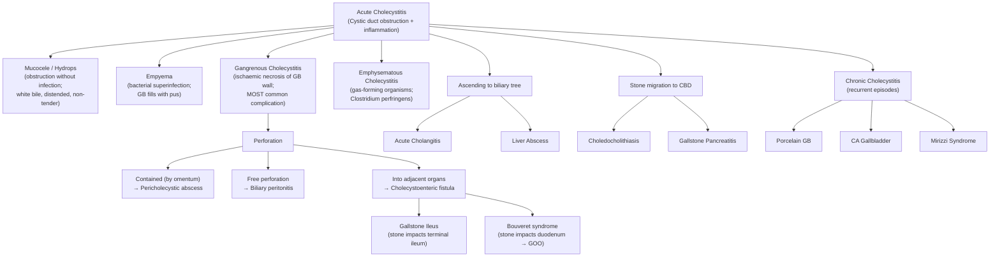

## Complications of Acute Cholecystitis

Complications arise when acute cholecystitis is **untreated or inadequately treated**, allowing the pathophysiological cascade to progress beyond simple chemical inflammation into tissue destruction, infection, and structural damage. Understanding these complications follows logically from the pathophysiology we've already covered:

> Stone impaction → distension → chemical inflammation → oedema → vascular compromise (end-artery cystic artery compressed) → **ischaemia → necrosis → secondary infection → structural breakdown**

Let's categorise these into: **(A) Complications of the disease itself** and **(B) Complications of gallstone disease more broadly** (since cholecystitis is a complication of gallstones, and gallstones cause additional problems beyond the gallbladder).

---

### A. Direct Complications of Acute Cholecystitis

These represent progression of the acute inflammatory and infective process within the gallbladder, arranged roughly in order of the pathophysiological cascade.

---

#### 1. Mucocele of the Gallbladder (Hydrops)

***Mucocele of gallbladder*** [1]

**Pathophysiology:**
- Prolonged impaction of a stone in the cystic duct **without significant cholecystitis** (i.e., obstruction without marked infection) [13]
- Bile trapped within the gallbladder is gradually **absorbed** by the gallbladder mucosa — all the bilirubin is reabsorbed
- However, the gallbladder epithelium **continues to secrete mucus** — so the gallbladder progressively distends with **colourless, mucoid fluid** ("white bile") [13]
- The gallbladder becomes massively distended but typically **non-tender** (because there is no active inflammation) [13]

**Clinical features:**
- Palpable, non-tender RUQ mass (distended gallbladder)
- May remain asymptomatic for a prolonged period

**Why does it matter?**
- Mucocele can progress to **oedema of the gallbladder wall, secondary infection, inflammation, and perforation** [13]
- ***Early cholecystectomy is generally indicated to avoid complications*** [13]

---

#### 2. Gallbladder Empyema

***Empyema of gallbladder*** [1]

**Pathophysiology:**
- When secondary bacterial infection of an obstructed gallbladder becomes overwhelming, the gallbladder fills with **frank pus** — this is an empyema (from Greek *empyein* = to suppurate)
- Essentially, the gallbladder becomes an **intra-abdominal abscess**
- The same enteric organisms (E. coli, Klebsiella, Enterococcus, anaerobes) that cause secondary infection in uncomplicated cholecystitis are responsible, but the bacterial load is much higher

**Clinical features [3]:**
- ***Tender RUQ mass + septic-looking*** [3]
- High-grade fever ( > 39°C), rigors, diaphoresis
- Markedly elevated WBC (often > 18,000)
- Patient appears toxic/systemically unwell

**Management:**
- Urgent IV antibiotics + **emergency cholecystectomy** or **percutaneous cholecystostomy** if unfit for surgery
- Empyema is a surgical emergency — untreated empyema progresses to gangrene and perforation

---

#### 3. Gangrenous Cholecystitis

***Gangrenous cholecystitis*** — ***MOST common complication of cholecystitis*** [2]

**Pathophysiology:**
- The distended, inflamed gallbladder compresses its own blood supply (cystic artery — an **end-artery** with no collaterals)
- Progressive ischaemia → **ischaemic necrosis of the gallbladder wall** [2][3]
- Occurs in approximately ***20%*** of cases of acute cholecystitis [3]
- More common in elderly, diabetics, and immunocompromised patients (impaired microcirculation)

**Clinical features:**
- ***Presence of a sepsis-like picture suggests the diagnosis*** [2]
- High fever, tachycardia, hypotension, leukocytosis
- Paradoxically, localised RUQ pain may **decrease** — because the sensory nerves in the gallbladder wall have been destroyed by necrosis (a dangerous sign that can be falsely reassuring)
- ***High WBC count is suggestive of a complicated form of cholecystitis such as gangrenous cholecystitis, perforation or associated cholangitis*** [2]

**Diagnosis:**
- CT abdomen: irregular/asymmetric wall thickening, lack of mural enhancement (ischaemic wall doesn't enhance with contrast), intraluminal membranes (sloughed mucosa), pericholecystic gas or fluid
- USG may show stranding, intraluminal membranes

**Management:**
- ***Emergency laparoscopic cholecystectomy or open cholecystectomy*** [3][4] — this is one of the indications for emergency surgery
- Delay increases the risk of perforation

<Callout title="Gangrenous Cholecystitis — The Silent Escalation" type="error">
Be vigilant for the patient whose localised RUQ pain paradoxically improves while systemic signs (fever, tachycardia, rising WBC) worsen. This suggests the sensory nerves in the gallbladder wall have been destroyed by necrosis — the gallbladder is gangrenous. This is NOT improvement; it is catastrophic progression.
</Callout>

---

#### 4. Gallbladder Perforation

***Rupture of gallbladder*** [1]

**Pathophysiology:**
- ***Occurs after development of gangrene (perforation in ischaemic areas)*** [2]
- The necrotic, devitalised wall gives way → bile and pus leak out

**Types of perforation** [2]:
- ***Localised (contained) perforation*** — **most common**
  - ***Perforation is usually contained in the subhepatic space by the omentum and adjacent organs*** [2]
  - The greater omentum (the "policeman of the abdomen") wraps around the inflamed gallbladder and walls off the perforation
  - ***Results in pericholecystic or intrahepatic abscess*** [2]
- ***Free perforation***
  - Uncontained leak of bile and pus into the general peritoneal cavity
  - ***Results in generalised peritonitis*** [2] — a surgical catastrophe
  - High mortality (~30%) — bile is extremely irritating to the peritoneum (chemical peritonitis) combined with bacterial contamination (septic peritonitis)
- ***Intrahepatic perforation***
  - Abscess forms within the liver parenchyma adjacent to the gallbladder fossa (segments IV/V)
- ***Perforation into adjacent organs (duodenum, colon)***
  - Leads to **cholecystoenteric fistula** formation (see below)

**Clinical features:**
- **Contained**: Persistent fever despite antibiotics, ongoing RUQ pain, possible palpable mass
- **Free**: Sudden worsening of pain → diffuse abdominal rigidity, rebound tenderness, hemodynamic instability, septic shock

**Management:**
- ***Emergency surgery*** (cholecystectomy + lavage)
- Abscess → percutaneous drainage ± delayed cholecystectomy

---

#### 5. Emphysematous Cholecystitis

***Emphysematous cholecystitis*** [2][3]

This is a rare but life-threatening variant of acute cholecystitis.

**Pathophysiology:**
- ***Caused by secondary infection of the gallbladder wall with gas-forming organisms such as Clostridium perfringens*** [2]
- Other gas-formers include *E. coli*, *Klebsiella*, and anaerobic streptococci
- The ischaemic, necrotic gallbladder wall provides an ideal **anaerobic environment** for these organisms to proliferate and produce gas (by fermentation of glucose in tissue)
- Gas accumulates within the gallbladder wall and lumen

**Clinical features [2][3]:**
- ***Insidious onset*** [3] — may initially appear similar to uncomplicated cholecystitis
- ***Abdominal crepitus adjacent to gallbladder may be detected*** [2] — subcutaneous gas tracking from the inflamed gallbladder
- ***Unconjugated hyperbilirubinaemia may be present due to haemolysis induced by Clostridial infection*** [2] — *Clostridium perfringens* produces alpha-toxin (lecithinase/phospholipase C) that destroys red cell membranes → intravascular haemolysis → unconjugated bilirubin rises
- More common in **diabetic patients** (60–75% of cases) and **elderly males** — diabetes impairs microcirculation, predisposing to ischaemia

**Diagnosis:**
- **AXR/CT**: Gas in the gallbladder wall or lumen — **pathognomonic** finding
  - On AXR: curvilinear gas outlining the gallbladder wall
  - On CT: air densities (black) within the wall and lumen — very conspicuous
- ***CT A+P to rule out complications (e.g., empyema, emphysematous cholecystitis, perforation)*** [3]

**Management:**
- ***Emergency cholecystectomy*** [3][4] — this is a surgical emergency, as the risk of perforation is very high
- Broad-spectrum IV antibiotics including anti-anaerobic cover (metronidazole, plus piperacillin-tazobactam or carbapenems)
- High mortality (~15–25%) if untreated

<Callout title="Pneumobilia — Differential Diagnosis" type="idea">
Gas in the biliary system (pneumobilia) on imaging is NOT always emphysematous cholecystitis. Other causes include [6]: post-ERCP (sphincterotomy disrupts the barrier to duodenal air reflux), post-cholecystectomy, cholecystoenteric fistula (gas refluxes from bowel), blunt abdominal trauma, and sphincter of Oddi incompetence. Always correlate with clinical context.
</Callout>

---

#### 6. Cholecystoenteric Fistula and Gallstone Ileus

***Cholecystoduodenofistula*** [1]
***Cholecystoenteric fistula → Gallstone ileus*** [2][6]

This is one of the most fascinating complications in surgery — a gallstone causing bowel obstruction.

**Pathophysiology [2][6]:**
- ***Fistula formation is more often due to long-standing pressure necrosis from stones than to acute cholecystitis*** [2]
- A large gallstone in the gallbladder chronically presses against the adjacent duodenal or colonic wall → pressure necrosis → **erosion through both walls** → formation of a direct communication (fistula) between the gallbladder and bowel lumen
- ***Cholecystoduodenal fistula is the most common type*** [6]
- Once the fistula is formed, the gallstone can pass from the gallbladder directly into the bowel lumen

**Types of cholecystoenteric fistula [6]:**

| Fistula Type | Frequency | Consequence |
|---|---|---|
| ***Cholecystoduodenal*** | Most common | Gallstone ileus (mechanical SBO) |
| Cholecystocolic | Less common | Usually ***asymptomatic*** (colon is wide enough to pass the stone) [6] |
| Cholecystogastric | Rare | ***Bouveret's syndrome*** (see below) |

**Gallstone ileus:**
- ***Passage of gallstone through a cholecystoenteric fistula may lead to development of mechanical bowel obstruction usually in the terminal ileum*** [2]
- *Why the terminal ileum?* The terminal ileum, ***2 feet proximal to the ileocaecal valve***, is the ***narrowest portion of the small bowel*** [6]. A gallstone large enough to erode through the gallbladder wall (typically > 2.5 cm) will pass through the wider proximal small bowel but become impacted at this narrowest point.

**Bouveret's syndrome [6]:**
- ***Stone stuck at duodenum/stomach, causing gastric outlet obstruction (GOO)*** [6]
- A very large stone passes through a cholecystoduodenal fistula and impacts in the duodenal bulb or pylorus

**Clinical features [6]:**
- Features of **distal small bowel obstruction**: colicky abdominal pain, abdominal distension, vomiting (may be faeculent), absolute constipation
- Often elderly patients with a long history of gallstone disease

**Investigations [6]:**
- ***AXR: Rigler's triad*** [6]:
  1. ***Pneumobilia*** (gas in the biliary tree — air refluxes from the bowel through the fistula into the biliary system; present in ~40%)
  2. ***Small bowel obstruction*** (dilated small bowel loops with air-fluid levels)
  3. ***Ectopic gallstone*** (usually in the RIF, stuck near the ileocaecal valve; radio-opaque stone visible in ~10%)
- ***CT abdomen***: GB wall thickening, Rigler's triad — CT is much more sensitive than AXR for detecting all three components [6]

**Management [6]:**
- ***Enterolithotomy to relieve SBO*** [6]
  - ***Exploratory laparotomy → proximal enterotomy (NOT over the stone because of ulceration at the impaction site) → milk the stone proximally for extraction*** [6]
  - *Why not enterotomy at the stone?* The bowel wall at the impaction site is ulcerated, oedematous, and friable from pressure necrosis — suturing over inflamed, unhealthy tissue risks anastomotic breakdown and leak. By milking the stone backwards (proximally) to healthier bowel, the enterotomy can be made in normal tissue, which heals reliably.
- ***Same-session or elective cholecystectomy + fistula repair*** [6]
  - There is debate about whether to address the fistula and gallbladder at the same operation (one-stage) or defer it. In the acutely obstructed, elderly patient, the priority is relieving the obstruction first; gallbladder surgery can wait.

---

### B. Complications of Gallstone Disease (Broader Context)

These are listed from the ***lecture slides*** as ***complications of gallstone disease*** [1]:

| Complication | Where the Stone Is | Pathophysiology |
|---|---|---|
| ***Mucocele of gallbladder*** [1] | Cystic duct (prolonged obstruction, minimal inflammation) | Bile absorption, mucus secretion → distension with "white bile" |
| ***Empyema of gallbladder*** [1] | Cystic duct (persistent obstruction + bacterial superinfection) | Pus fills the obstructed gallbladder |
| ***Rupture of gallbladder*** [1] | Cystic duct (advanced gangrenous cholecystitis) | Necrotic wall perforates → localised abscess or generalised peritonitis |
| ***Acute cholangitis*** [1] | CBD (obstruction + ascending infection) | Bile stasis + bacterial contamination → biliary sepsis; Charcot's triad / Reynold's pentad |
| ***Acute pancreatitis*** [1] | Ampulla of Vater (stone impacts at the papilla) | Obstruction of pancreatic duct → duodeno-pancreatic reflux → premature enzyme activation → autodigestion |
| ***Cholecystoduodenofistula*** [1] | Gallbladder wall eroding into duodenum | Chronic pressure necrosis → fistula → gallstone ileus |
| ***Liver abscess*** [1] | Biliary system (ascending infection) | Ascending cholangitis → cholangiovenous reflux → hepatic abscess; or direct intrahepatic perforation of gallbladder |

And from the comprehensive gallstone complications framework [13]:

**In the gallbladder:**
- Calculous cholecystitis
- CA gallbladder (chronic inflammation → dysplasia → carcinoma)
- Mucocele/hydrops

**In the bile duct:**
- Choledocholithiasis ± acute cholangitis
- Gallstone pancreatitis
- Obstructive jaundice

**Perforation to other sites:**
- Bowel: cholecystoenteric fistula → gallstone ileus
- Liver: liver abscess
- CBD: Mirizzi syndrome [13]

---

### C. Long-Term Complications (If Cholecystitis Becomes Chronic)

Recurrent episodes of acute cholecystitis or persistent smouldering inflammation lead to **chronic cholecystitis**, which has its own serious long-term complications:

| Complication | Pathophysiology |
|---|---|
| ***Porcelain gallbladder*** [14] | Chronic inflammation → extensive scarring → ***calcification of the gallbladder wall***. 2–3% risk of malignancy. All porcelain gallbladders should be removed (absolute indication for cholecystectomy). |
| ***Gallbladder carcinoma (CA gallbladder)*** [14] | Chronic inflammation → chronic mucosal irritation → dysplasia-carcinoma sequence. 95% of GB carcinoma patients have gallstones. ***Recurrent inflammation and biliary stasis may predispose to malignancy*** [15]. |
| **Mirizzi syndrome** [15] | Large stone impacted in Hartmann's pouch → extrinsic compression of common hepatic duct → obstructive jaundice. Chronic inflammation may erode through the bile duct wall → ***cholecystobiliary fistula*** [15]. Classified by Csendes classification (Types I–V) [15]. |

---

### D. Complications of Cholecystectomy (Iatrogenic)

Since cholecystectomy is the definitive treatment, its complications are directly relevant to the management of acute cholecystitis.

| Timing | Complication | Mechanism / Pathophysiology | Management |
|---|---|---|---|
| **Immediate** | ***Conversion to open surgery*** (5% elective, 25% emergency) — ***NOT a failure*** [16] | Dense adhesions, bleeding, unclear anatomy | Continue as open procedure |
| | GA risks, bleeding | — | — |
| | ***Damage to neighbouring structures***: bile duct, cystic artery, duodenum, transverse colon, hepatic flexure [16] | Misidentification during dissection; pneumoperitoneum-related injury | Intraoperative repair |
| **Early** | ***Biliary leakage*** (from cystic duct stump or ***duct of Luschka***; ~0.5%) [16] | Clip slippage, thermal injury to small ducts, duct of Luschka (aberrant small duct draining directly from liver bed into the GB fossa) | If noted intra-op: repair + T-tube. If delayed (post-op D2–10; fever, RUQ pain, deranged LFT): USG/CT → HIDA/MRCP → ***ERCP stent (minor) or laparotomy + lavage + Roux-en-Y hepaticojejunostomy (major)*** [16] |
| | ***Bleeding*** | Liver bed (middle hepatic vein close to GB fossa), cystic artery, trocar site [16] | Surgical haemostasis |
| | Post-op jaundice | Dropped/missed CBD stones | ERCP stone extraction |
| | Cholangitis | Infected retained stone | IV antibiotics + ERCP |
| | ***Post-op diarrhoea*** | ***Initial uncoordinated excessive bile salt excretion + fat malabsorption*** [16] — without the gallbladder to store and concentrate bile, bile drips continuously into the duodenum; the ileum may not reabsorb all bile salts → bile salts reach the colon → secretory diarrhoea | Usually self-limiting; cholestyramine if persistent |
| **Late** | ***Bile duct stricture*** | Thermal/ischaemic injury during dissection → fibrosis → stricture | Reconstruction ± hepaticojejunostomy [16] |
| | ***Subphrenic abscess*** | Infected subhepatic collection | Drainage + antibiotics [16] |
| | ***Post-cholecystectomy syndrome*** | ***Persistent symptoms (e.g., biliary colic, diarrhoea) after operation*** [16] — causes include retained CBD stone, sphincter of Oddi dysfunction, bile duct stricture, or functional GI disorder | Investigate with MRCP/ERCP; treat underlying cause |
| | Post-cholecystectomy choledocholithiasis | Bile stasis from increased CBD calibre (loss of GB storing function) [16] | ERCP stone extraction |

<Callout title="Duct of Luschka — A Subtle Surgical Pitfall" type="idea">
The duct of Luschka is a small aberrant bile duct that drains directly from the liver parenchyma (typically segment V) into the gallbladder fossa — NOT into the cystic duct. During cholecystectomy, when the gallbladder is dissected off the liver bed, this duct can be inadvertently transected, causing bile leak post-operatively. It is easily missed intraoperatively because it is tiny and often not visible until the gallbladder is removed. This is why a drain is sometimes placed in the gallbladder fossa after difficult cholecystectomies.
</Callout>

---

### Complications Overview Diagram

---

<Callout title="High Yield Summary">

**Most common complication**: Gangrenous cholecystitis (~20%) — ischaemic necrosis of GB wall due to distension compressing the end-artery (cystic artery). Suspect when septic picture develops; paradoxical decrease in local pain (nerve destruction) with worsening systemic signs.

**Complications of gallstone disease (lecture slides)**: Mucocele, empyema, rupture of gallbladder, acute cholangitis, acute pancreatitis, cholecystoduodenofistula, liver abscess.

**Emphysematous cholecystitis**: Gas-forming organisms (Clostridium perfringens) infect the ischaemic GB wall. More common in diabetics. Pathognomonic finding: gas in GB wall on CT/AXR. Unconjugated hyperbilirubinaemia from Clostridial haemolysis. Emergency cholecystectomy needed.

**Gallstone ileus**: Stone erodes through GB into duodenum (cholecystoenteric fistula) → stone impacts at terminal ileum (narrowest point of SB). Rigler's triad on AXR/CT: pneumobilia + SBO + ectopic gallstone. Management: enterolithotomy (proximal enterotomy, NOT over the stone) ± cholecystectomy + fistula repair.

**Perforation**: Usually contained by omentum → pericholecystic abscess. Free perforation → biliary peritonitis (high mortality). Perforation into bowel → fistula.

**Long-term**: Recurrent cholecystitis → chronic cholecystitis → porcelain GB (calcification, 2–3% malignancy risk) → CA gallbladder.

**Cholecystectomy complications**: Bile duct injury (most feared — from misidentification of CBD as cystic duct; prevented by Critical View of Safety), biliary leakage (cystic duct stump or duct of Luschka), post-cholecystectomy syndrome, post-op diarrhoea.

</Callout>

---

<ActiveRecallQuiz
  title="Active Recall - Complications of Acute Cholecystitis"
  items={[
    {
      question: "What is the most common complication of acute cholecystitis? Explain the pathophysiology.",
      markscheme: "Gangrenous cholecystitis (occurs in ~20% of cases). Pathophysiology: distended, inflamed gallbladder compresses its own blood supply (cystic artery is an end-artery with no collaterals) → progressive ischaemia → ischaemic necrosis of the gallbladder wall. More common in elderly and diabetics. Suspect when septic picture develops with paradoxical decrease in localised pain (nerve destruction in necrotic wall)."
    },
    {
      question: "List the complications of gallstone disease as shown in the lecture slides.",
      markscheme: "Mucocele of gallbladder, empyema of gallbladder, rupture of gallbladder, acute cholangitis, acute pancreatitis, cholecystoduodenofistula, liver abscess."
    },
    {
      question: "What is Rigler's triad? In what condition is it seen and what is the definitive management?",
      markscheme: "Rigler's triad: (1) Pneumobilia, (2) Small bowel obstruction, (3) Ectopic gallstone (usually in RIF near ileocaecal valve). Seen in gallstone ileus (stone passes through cholecystoenteric fistula and impacts in terminal ileum). Management: enterolithotomy — proximal enterotomy (NOT over the stone due to ulceration), milk stone proximally for extraction, plus same-session or elective cholecystectomy and fistula repair."
    },
    {
      question: "What causes unconjugated hyperbilirubinaemia in emphysematous cholecystitis?",
      markscheme: "Clostridium perfringens produces alpha-toxin (lecithinase/phospholipase C) that destroys red cell membranes → intravascular haemolysis → excess unconjugated bilirubin. This is distinct from the conjugated hyperbilirubinaemia of obstructive jaundice."
    },
    {
      question: "Why is gallbladder perforation usually contained rather than free? What is the natural barrier?",
      markscheme: "Perforation is usually contained in the subhepatic space by the omentum and adjacent organs. The greater omentum ('policeman of the abdomen') wraps around the inflamed gallbladder and walls off the perforation, resulting in a pericholecystic or intrahepatic abscess rather than generalised peritonitis. Free perforation is less common but carries much higher mortality (~30%)."
    },
    {
      question: "Name 3 late complications of cholecystectomy and the mechanism of post-operative diarrhoea.",
      markscheme: "Late complications: (1) Bile duct stricture (thermal/ischaemic injury during dissection → fibrosis). (2) Post-cholecystectomy syndrome (persistent biliary colic or diarrhoea due to retained CBD stone, sphincter of Oddi dysfunction, or bile duct stricture). (3) Post-cholecystectomy choledocholithiasis (bile stasis from increased CBD calibre). Post-op diarrhoea mechanism: without the gallbladder to store and concentrate bile, bile drips continuously into the duodenum; excess bile salts reach the colon and cause secretory diarrhoea. Usually self-limiting."
    }
  ]}
/>

## References

[1] Lecture slides: GC 200. RUQ pain, jaundice and fever Cholecytitis and cholangitis Imaging of GI system.pdf (p5)
[2] Senior notes: felixlai.md (Complications of cholecystitis, pp. 561–562)
[3] Senior notes: maxim.md (Acute calculous cholecystitis — Complications, p. 131)
[4] Senior notes: maxim.md (Definitive treatment — emergency LC for complicated cholecystitis, p. 131)
[6] Senior notes: maxim.md (Gallstone ileus, Rigler's triad, Bouveret's syndrome, pneumobilia DDx, p. 132)
[13] Senior notes: felixlai.md (Complications of gallstones — in gallbladder, bile duct, and perforation sites, pp. 518–519)
[14] Senior notes: maxim.md (Chronic cholecystitis — porcelain GB, CA gallbladder, p. 132)
[15] Senior notes: maxim.md (Mirizzi syndrome — definition, Csendes classification, CA gallbladder association, p. 132)
[16] Senior notes: maxim.md (Cholecystectomy — specific complications: immediate, early, late, pp. 133–134)
