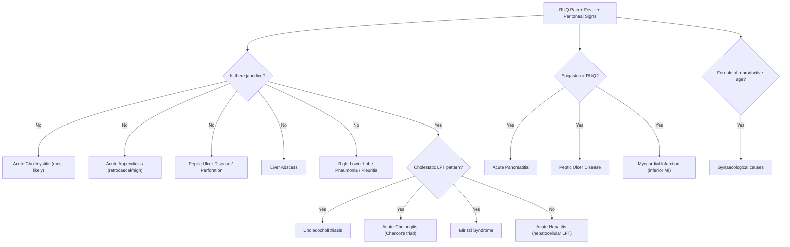

## Differential Diagnosis of Acute Cholecystitis

When a patient presents with **RUQ pain, fever, and signs of peritoneal irritation**, acute cholecystitis is high on the list — but it is far from the only diagnosis. The differential is broad because the RUQ is a "busy neighbourhood": the gallbladder, liver, hepatic flexure of the colon, right kidney, right adrenal, duodenum, head of pancreas, right lower lung, and right hemidiaphragm all live here. Referred pain from distant structures (heart, right lung) can also localise to the RUQ.

The key to a logical differential is to think **anatomically** and then refine based on clinical features, lab findings, and imaging.

---

### Approach to the Differential Diagnosis

---

### Detailed Differential Diagnosis

#### 1. Biliary Colic — The Most Important Differentiation

This is the **single most critical distinction** on exams and in clinical practice [2][3][4].

Biliary colic is caused by ***transient obstruction*** of Hartmann's pouch or the cystic duct by a gallstone — the gallbladder contracts (often in response to a fatty meal via CCK), presses a stone against the outlet, intraluminal pressure rises, and visceral pain occurs. Crucially, **there is no true gallbladder wall inflammation** [2][3].

| Feature | Biliary Colic | Acute Cholecystitis |
|---|---|---|
| **Obstruction** | ***Transient*** — stone dislodges when GB relaxes | ***Persistent*** — stone remains impacted |
| **Duration** | Onset ≥ 30 min, plateaus within 1 hour, ***resolves completely < 6 hours*** | ***Persists > 6 hours***, often days [2] |
| **Severity** | Moderate to severe | ***Usually more severe*** than uncomplicated biliary colic [2] |
| **Character** | ***Steady*** (NOT truly colicky — there is no peristalsis in the GB/cystic duct) [3] | ***Steady***, constant |
| **Peritoneal signs** | ***Absent*** — pain is entirely visceral, no true wall inflammation [2] | ***Present*** — Murphy's sign, guarding, rebound (parietal peritoneum involved) [2] |
| **Fever** | ***Afebrile*** with normal labs [2] | ***Febrile*** with leukocytosis and ↑ CRP |
| **Associated symptoms** | Nausea/vomiting possible, but patient looks well between attacks | ***Anorexia, nausea, vomiting, malaise*** — patient looks unwell [2] |
| **Natural history** | Self-resolves when GB relaxes and stone falls back | Does NOT resolve spontaneously; progresses if untreated |

> *Why is biliary colic "steady" and not truly colicky?* The gallbladder is a muscular sac with tonic contraction — it does not have the rhythmic peristalsis of the intestine (which gives the classical crescendo-decrescendo "colicky" pattern). The name "biliary colic" is actually a misnomer [3].

<Callout title="The 6-Hour Rule" type="error">
***Suspect acute cholecystitis if pain persists > 6 hours*** [3]. This is the single most reliable bedside clue that the pathology has moved beyond simple biliary colic to established inflammation. If pain resolves within 6 hours, it was likely biliary colic.
</Callout>

---

#### 2. Acute Cholangitis

***Charcot's triad (50–70%): Fever + RUQ pain + Jaundice*** [6][7]
***Reynold's pentad ( < 10%): Charcot's triad + Hypotension + Altered mental status*** [6][7]

This is a **bacterial infection of the biliary tree** secondary to ***CBD obstruction*** — fundamentally different from cholecystitis, where the problem is at the cystic duct/gallbladder [6][7].

**How to differentiate from cholecystitis:**
- **Jaundice**: ***Present*** in cholangitis (CBD obstruction prevents bilirubin from reaching the duodenum → conjugated hyperbilirubinaemia); ***usually absent*** in uncomplicated cholecystitis (the cystic duct obstruction does not block the CBD) [1][2]
- **Tea-coloured urine**: Present in cholangitis (conjugated bilirubin is water-soluble → filtered by kidneys); ***absent in cholecystitis*** (***"No tea-colored urine"*** as per the lecture case vignette) [1]
- **Murphy's sign**: ***Positive*** in cholecystitis; typically ***negative*** in cholangitis (the gallbladder itself is not the inflamed organ)
- **Cholestatic LFT pattern**: Prominent in cholangitis (↑↑ ALP, ↑↑ GGT, ↑ conjugated bilirubin); may be mildly elevated or normal in cholecystitis [2][6]
- ***Blood culture*** is essential in cholangitis (bacteraemia is common) [7]

> *Why does cholangitis cause altered mental status?* CBD obstruction + bacterial infection → cholangio-venous reflux (infected bile under pressure refluxes into the bloodstream through the hepatic sinusoids) → **Gram-negative bacteraemia/sepsis** → septic shock → encephalopathy. This is the pathophysiology behind Reynold's pentad.

---

#### 3. Choledocholithiasis (CBD Stones without Infection)

A gallstone that has migrated from the gallbladder through the cystic duct into the **common bile duct** [4]. This causes **obstructive jaundice** without necessarily causing infection (that distinction is what separates choledocholithiasis from cholangitis).

**How to differentiate from cholecystitis:**
- **Jaundice** is the hallmark — cholestatic LFT pattern (↑ ALP, ↑ GGT, ↑ conjugated bilirubin)
- Pain may be present but fever is typically absent (unless cholangitis develops)
- USG shows ***dilated CBD with gallstone*** rather than the 5 cardinal signs of cholecystitis [4]
- Can coexist with cholecystitis ("double impaction" — stone simultaneously in cystic duct AND distal CBD, ~7%) [4]

---

#### 4. Acute Pancreatitis

***Epigastric pain that radiates to the back***, often severe, constant, ***improved by sitting up or leaning forward***, exacerbated by movement [8][9]. Gallstones are the ***most common cause*** of acute pancreatitis (a stone impacts at the ampulla of Vater, obstructing the pancreatic duct → duodeno-pancreatic reflux → premature trypsinogen activation → autodigestion) [8][9].

**How to differentiate from cholecystitis:**
- **Location**: Epigastric > RUQ (although overlap exists, especially with gallstone pancreatitis)
- **Radiation**: To the ***back*** (retropancreatic inflammation of the retroperitoneal structures) vs. right shoulder in cholecystitis
- **Relief posture**: ***Sitting up/leaning forward*** relieves pancreatitis pain (takes the pancreas away from the retroperitoneum); movement ***worsens*** cholecystitis pain
- **Amylase/Lipase**: Markedly elevated ( > 3× upper limit of normal) in pancreatitis; may be mildly elevated in cholecystitis but not to the same degree [8]
- ***Cullen's sign*** (periumbilical bruising) and ***Grey Turner's sign*** (flank bruising) — pathognomonic for severe necrotising pancreatitis (retroperitoneal haemorrhage tracking along tissue planes) — NOT seen in cholecystitis [9]
- ***Tetany from transient hypocalcaemia*** — fat saponification (liberated fatty acids bind calcium) — unique to pancreatitis [9]

<Callout title="Gallstone Pancreatitis and Cholecystitis Can Coexist">
Since both are complications of gallstone disease, a patient can present with features of both acute cholecystitis AND acute pancreatitis simultaneously. Always check amylase/lipase in a patient with suspected cholecystitis, and always look at the gallbladder on imaging in a patient with pancreatitis [8].
</Callout>

---

#### 5. Peptic Ulcer Disease (PUD) / Perforated Peptic Ulcer

- **Uncomplicated PUD**: Epigastric pain related to meals (duodenal ulcer: pain relieved by eating; gastric ulcer: pain worsened by eating). No fever, no peritoneal signs. Can be distinguished by history and endoscopy.
- **Perforated peptic ulcer**: Sudden-onset, severe epigastric pain → becomes generalised → board-like rigidity → peritonitis. Air under the diaphragm on **erect CXR** (pneumoperitoneum). Usually no fever initially (chemical peritonitis from gastric acid, not infection).
  - *Valentino's sign*: Gastric/duodenal contents tracking down the right paracolic gutter → pain localises to the **RLQ**, mimicking acute appendicitis [10]
  - Distinguished from cholecystitis by the abrupt onset ("thunderclap"), absence of preceding biliary symptoms, and pneumoperitoneum on imaging

---

#### 6. Acute Appendicitis

***Classically begins as periumbilical pain (visceral, poorly localised via T10 dermatome) then migrates to the RLQ (McBurney's point) as parietal peritoneal inflammation develops*** [10].

**How to differentiate from cholecystitis:**
- **Location**: RLQ (McBurney's point) vs. RUQ
- **Migration pattern**: Periumbilical → RLQ (appendicitis) vs. epigastric → RUQ (cholecystitis)
- **Murphy's sign**: Positive in cholecystitis, NOT in appendicitis
- **Appendicitis-specific signs** [10]: Pointing sign (McBurney's point), Rovsing's sign (RLQ pain on LLQ palpation), Psoas sign (retrocaecal appendix), Obturator sign (pelvic appendix)
- **Age**: Appendicitis peaks in 10–30 years; cholecystitis peaks in 40–60 years

However, beware:
- A ***high-riding/retrocaecal appendix*** can present with RUQ pain mimicking cholecystitis
- ***Right-sided diverticulitis*** (more common in Asian populations) can mimic either [10]

---

#### 7. Acute Hepatitis

Inflammation of the liver parenchyma from viral (HAV, HBV, HCV, HEV), alcoholic, drug-induced, or autoimmune causes [2].

**How to differentiate from cholecystitis:**
- **Hepatocellular LFT pattern**: Markedly ↑ AST and ALT (often > 10× ULN) with only mild ↑ ALP — this is the opposite of the cholestatic pattern seen in biliary obstruction
- **Jaundice**: Often present (hepatocyte dysfunction → impaired bilirubin conjugation/excretion)
- **Tender hepatomegaly**: Diffuse liver tenderness rather than focal RUQ/gallbladder point tenderness
- **No Murphy's sign**: The gallbladder is not inflamed
- **Viral serology** (HBsAg, anti-HAV IgM, etc.) clinches the diagnosis

---

#### 8. Liver Abscess

- **Pyogenic liver abscess**: Fever, RUQ pain, tender hepatomegaly, swinging fevers, rigors. Often secondary to biliary tract disease (ascending cholangitis) or portal pyaemia (from appendicitis, diverticulitis). Blood cultures often positive.
- **Amoebic liver abscess**: Travel history (endemic areas), diarrhoea, RUQ pain, tender hepatomegaly. Amoebic serology positive.

**How to differentiate from cholecystitis:**
- **Hepatomegaly** more prominent than gallbladder tenderness
- **Murphy's sign negative** (the gallbladder is not the source)
- **USG/CT**: Well-defined hepatic collection (abscess cavity) rather than the 5 cardinal signs of cholecystitis
- ***Liver abscess is listed as a complication of gallstone disease*** in the lecture slides — so the two can coexist [1]

---

#### 9. Right Lower Lobe Pneumonia / Pleuritis

This is a classic "trap" in exams. Basal pneumonia or pleurisy on the right side can cause **referred RUQ pain** via irritation of the diaphragmatic pleura (phrenic nerve, C3–C5 — same dermatomes as the shoulder/RUQ).

**How to differentiate from cholecystitis:**
- **Respiratory symptoms**: Cough (productive/dry), dyspnoea, pleuritic chest pain (sharp, worse on inspiration — different quality from the steady visceral pain of cholecystitis)
- **Chest examination**: Bronchial breathing, crepitations, dullness to percussion, decreased air entry over the right base
- **CXR**: Consolidation or pleural effusion in the right lower lobe
- **Abdominal examination**: May have RUQ tenderness but **Murphy's sign is negative** and there are no gallbladder-specific USG findings

---

#### 10. Myocardial Infarction (Inferior MI)

An ***inferior MI*** (right coronary artery territory) can present with **epigastric pain** that mimics biliary or pancreatic pathology [2][8]. The inferior surface of the heart sits on the diaphragm; ischaemic pain from the inferior myocardium can be referred to the epigastrium via vagal afferents.

**How to differentiate from cholecystitis:**
- **Cardiovascular risk factors**: Hypertension, diabetes, smoking, hyperlipidaemia, family history of IHD
- **Associated features**: Diaphoresis, breathlessness, radiation to jaw/left arm, haemodynamic instability
- **ECG**: ST elevation in leads II, III, aVF (inferior MI)
- **Troponin**: Elevated
- **Murphy's sign negative**, normal abdominal USG

<Callout title="Always Do an ECG in Acute Upper Abdominal Pain" type="error">
This is a commonly tested point. An inferior MI can perfectly mimic an acute abdomen. Every patient presenting with acute epigastric or RUQ pain should have an ECG — missing an MI is a life-threatening error. The mnemonic is simple: if the pain is above the umbilicus, think of the heart.
</Callout>

---

#### 11. Sphincter of Oddi Dysfunction / Functional Gallbladder Disorder

- Pain ***typically lasts < 6 hours*** and ***occurs intermittently*** [5]
- ***Normal laboratory and radiological tests*** [5]
- Diagnosis of exclusion after structural causes are ruled out
- Sphincter of Oddi dysfunction: biliary-type pain caused by functional obstruction at the sphincter of Oddi (spasm or stenosis), without stones

---

#### 12. Other Differentials (by Region)

**RUQ-specific** [11]:
- **Subphrenic abscess**: Post-operative, fever, referred shoulder tip pain
- **Fitz-Hugh-Curtis syndrome**: Perihepatitis secondary to PID (*Chlamydia trachomatis* or *Neisseria gonorrhoeae*) — RUQ pain in a young sexually active female with vaginal discharge. Laparoscopy shows "violin-string" adhesions between liver capsule and anterior abdominal wall

**Urological:**
- **Right renal/ureteric colic**: Colicky flank pain radiating to the groin (loin-to-groin), haematuria, restless patient (in contrast to cholecystitis patients who lie still)
- **Right pyelonephritis**: Fever + loin pain + dysuria/frequency; costovertebral angle tenderness; pyuria on urinalysis

**Gynaecological (in females of reproductive age):**
- **Ruptured ovarian cyst**, **ovarian torsion**, **ectopic pregnancy**, **PID** — always ask about LMP, sexual history, vaginal discharge
- β-hCG is mandatory in any woman of reproductive age with acute abdominal pain

---

### Summary Differential Diagnosis Table

| Differential | Key Distinguishing Feature(s) | Key Investigation to Differentiate |
|---|---|---|
| **Biliary colic** | Pain < 6h, afebrile, no peritoneal signs | USG: stones but no wall thickening/pericholecystic fluid |
| **Acute cholangitis** | ***Charcot's triad*** (fever + jaundice + RUQ pain), Murphy negative | ***Blood cultures***, cholestatic LFT, USG: dilated CBD |
| **Choledocholithiasis** | Jaundice, cholestatic LFT, no fever | USG/MRCP: dilated CBD + stone |
| **Acute pancreatitis** | Epigastric, radiates to back, leaning forward relieves | ***Amylase/lipase > 3× ULN***, CT abdomen |
| **Perforated PUD** | Sudden "thunderclap" onset, board-like rigidity | ***Erect CXR: pneumoperitoneum*** |
| **Acute appendicitis** | Periumbilical → RLQ migration, McBurney's point | CT abdomen (or USG in young/pregnant) |
| **Acute hepatitis** | Hepatocellular LFT (↑↑ AST/ALT), tender hepatomegaly | Viral serology |
| **Liver abscess** | Swinging fever, hepatomegaly, no Murphy's sign | USG/CT: hepatic collection |
| **Right basal pneumonia** | Cough, respiratory signs, pleuritic pain | ***CXR: consolidation*** |
| **Inferior MI** | Cardiac risk factors, diaphoresis, radiation to jaw/arm | ***ECG + Troponin*** |
| **Renal colic** | Loin-to-groin, restless, haematuria | CT KUB, urinalysis |
| **Gynaecological** | LMP, sexual history, vaginal discharge | β-hCG, pelvic USG |

---

<Callout title="High Yield Summary">

**Structured approach**: Think anatomically — RUQ structures (gallbladder, liver, hepatic flexure, right kidney) + referred pain sources (right lung base, heart, right hemidiaphragm).

**The single most important DDx**: Biliary colic vs. acute cholecystitis — distinguished by duration ( < 6h vs. > 6h), fever, peritoneal signs (Murphy's), and leukocytosis.

**Jaundice present?** Think cholangitis (Charcot's triad), choledocholithiasis, Mirizzi syndrome, or hepatitis — NOT uncomplicated cholecystitis (cystic duct obstruction does not block the CBD).

**Epigastric > RUQ?** Think pancreatitis (radiates to back, relieved by leaning forward, ↑ amylase/lipase) or PUD/perforated PUD (pneumoperitoneum on CXR).

**Always do an ECG** in acute upper abdominal pain to exclude inferior MI.

**Always check β-hCG** in women of reproductive age to exclude ectopic pregnancy.

**Hong Kong specific**: Right-sided diverticulitis is more common in Asian populations and can mimic RUQ/RLQ pathology.

</Callout>

---

<ActiveRecallQuiz
  title="Active Recall - Differential Diagnosis of Acute Cholecystitis"
  items={[
    {
      question: "Name the key clinical features that differentiate biliary colic from acute cholecystitis.",
      markscheme: "Duration (< 6h vs > 6h), fever (absent vs present), peritoneal signs including Murphy's sign (absent vs present), lab findings (normal vs leukocytosis and raised CRP), natural history (self-resolving vs persistent/progressive). Pain character is steady in both (not truly colicky)."
    },
    {
      question: "A patient presents with RUQ pain, fever, and jaundice. What is the most likely diagnosis and what clinical sign helps differentiate it from acute cholecystitis?",
      markscheme: "Most likely diagnosis is acute cholangitis (Charcot's triad: fever + RUQ pain + jaundice). Murphy's sign is typically NEGATIVE in cholangitis (inflammation is in the CBD, not the gallbladder) but POSITIVE in cholecystitis. Cholestatic LFT pattern and blood cultures further distinguish cholangitis."
    },
    {
      question: "Why can an inferior myocardial infarction mimic acute cholecystitis? What investigation must not be missed?",
      markscheme: "The inferior surface of the heart sits on the diaphragm; ischaemic pain from the inferior myocardium (RCA territory) is referred to the epigastrium via vagal afferents, mimicking biliary or upper GI pathology. An ECG must always be performed in acute upper abdominal pain. Troponin should be checked if suspicion remains."
    },
    {
      question: "How does acute pancreatitis differ from acute cholecystitis in terms of pain characteristics and relieving factors?",
      markscheme: "Pancreatitis: epigastric pain radiating to the BACK, relieved by sitting up or leaning forward (takes pancreas off retroperitoneum), exacerbated by movement. Cholecystitis: RUQ pain radiating to right shoulder/interscapular area, worsened by movement, patient lies still. Amylase/lipase > 3x ULN in pancreatitis."
    },
    {
      question: "List 3 conditions where acute cholecystitis can present with jaundice (exceptions to the usual rule of no jaundice in cholecystitis).",
      markscheme: "(1) Mirizzi syndrome: stone impacted in Hartmann's pouch/cystic duct compresses the common hepatic duct. (2) Double impaction (~7%): stone simultaneously in cystic duct AND distal CBD. (3) Concurrent choledocholithiasis: separate stone migrated into the CBD. Also rarely: severe pericholecystic inflammation causing oedema compressing the CBD."
    }
  ]}
/>

## References

[1] Lecture slides: GC 200. RUQ pain, jaundice and fever Cholecytitis and cholangitis Imaging of GI system.pdf (p3–5)
[2] Senior notes: felixlai.md (Cholecystitis sections, pp. 553–556)
[3] Senior notes: maxim.md (Acute calculous cholecystitis, Biliary colic, pp. 130–131)
[4] Senior notes: maxim.md (Symptomatic gallstones summary table, Courvoisier's Law, p. 130)
[5] Senior notes: felixlai.md (Differential diagnosis of biliary colic, pp. 510–511)
[6] Senior notes: felixlai.md (Acute cholangitis, pp. 520–521)
[7] Senior notes: maxim.md (Acute cholangitis, p. 135)
[8] Senior notes: felixlai.md (Acute pancreatitis — clinical manifestation and DDx, pp. 579–580)
[9] Senior notes: maxim.md (Acute pancreatitis, p. 138)
[10] Senior notes: maxim.md (Acute appendicitis — differential diagnosis, p. 87)
[11] Senior notes: maxim.md (Acute abdomen differential diagnosis by region, p. 43)
