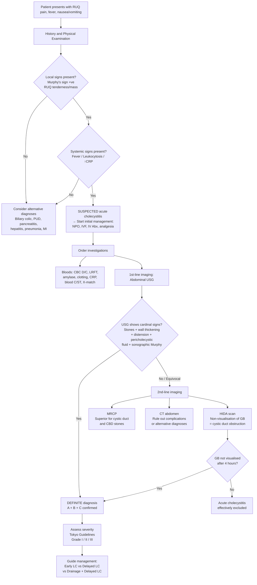

## Diagnostic Criteria

### Tokyo Guidelines (TG18/TG13) — The Standard Diagnostic Framework

The ***Tokyo Guidelines*** provide a structured, internationally accepted framework for diagnosing acute cholecystitis. The principle is straightforward: you need **local inflammation** + **systemic inflammation** + **imaging confirmation** [2][3][4].

Think of it as a three-legged stool — each leg strengthens the diagnosis:

| Component | Criteria | What it Represents |
|---|---|---|
| **A: Local signs of inflammation** | ***Murphy's sign*** | Direct evidence of gallbladder/parietal peritoneal inflammation |
| | ***RUQ mass / pain / tenderness*** | |
| **B: Systemic signs of inflammation** | ***Fever*** | The body's systemic inflammatory response to the local process |
| | ***Leukocytosis*** | |
| | ***Elevated CRP level*** | |
| **C: Imaging findings** | ***Imaging findings characteristic of acute cholecystitis*** (USG or hepatobiliary scintigraphy) | Objective confirmation that the gallbladder is the source |

**Interpretation** [2]:
- ***Suspected diagnosis*** = **One item in A** + **One item in B** (clinical diagnosis without imaging)
- ***Definite diagnosis*** = **One item in A** + **One item in B** + **One item in C** (clinically confirmed by imaging)

<Callout title="Why Three Components?">
Any single component alone is insufficient. Local signs (A) can occur with many RUQ pathologies. Systemic signs (B) occur with any infection/inflammation. Imaging findings (C) such as wall thickening occur in non-acute conditions (e.g., chronic cholecystitis, hypoalbuminaemia, heart failure, hepatitis). You need the **convergence of all three** to make a definite diagnosis. The "suspected" category exists because imaging may not always be immediately available — in the right clinical context, A + B is enough to initiate treatment while awaiting imaging [2].
</Callout>

<Callout title="Exam Tip: Definite vs Suspected" type="error">
A very common exam mistake is to say "USG confirms the diagnosis." USG alone does NOT confirm acute cholecystitis — wall thickening and pericholecystic fluid have other causes. You need the clinical picture (A + B) PLUS imaging (C) for a definite diagnosis. Conversely, if the clinical picture is classic (A + B) but USG is equivocal, you can still have a suspected diagnosis and proceed with treatment [2][3].
</Callout>

---

## Diagnostic Algorithm

The following algorithm represents the practical clinical approach when you suspect acute cholecystitis. It integrates history, examination, lab work, and imaging in a logical sequence.

---

## Investigation Modalities

### Overview: What to Order and Why

When you suspect acute cholecystitis, you need investigations for three purposes:
1. **Confirm the diagnosis** (USG ± HIDA/MRCP)
2. **Assess severity and rule out complications** (bloods, CT)
3. **Exclude differentials and identify coexisting biliary pathology** (LFT, amylase, ECG, CXR)

***Investigations to order*** [3][4]:
- ***Bloods: CBC D/C, LRFT, amylase, clotting, blood C/ST, X-match, lipid profile*** [3]
- ***USG abdomen*** (1st-line imaging) [3]
- ***CT abdomen + pelvis*** (to rule out complications) [3]
- HIDA scan or MRCP (if USG inconclusive) [3][4]

---

### A. Laboratory Investigations

#### 1. CBC with Differentials

| Finding | Interpretation | Pathophysiological Basis |
|---|---|---|
| **Leukocytosis** (WBC > 10,000/μL) | Systemic inflammatory response; part of Tokyo criteria component B | Inflammatory cytokines from the inflamed gallbladder stimulate the bone marrow to release neutrophils |
| ***↑ Band forms (left shift)*** | Active, ongoing acute bacterial infection — bone marrow is releasing immature neutrophils to meet demand | The marrow cannot mature neutrophils fast enough during acute infection → immature "band" forms are released prematurely |
| ***Very high WBC ( > 18,000)*** | ***Suggestive of complicated cholecystitis*** — ***gangrenous cholecystitis, perforation, or associated cholangitis*** [2] | Severe infection/necrosis → massive cytokine release → vigorous marrow response |

#### 2. Liver Function Tests (LFT)

This is a subtle but critical point:

***Liver chemistry is usually NORMAL in uncomplicated acute cholecystitis*** [2]. Why? Because the obstruction is at the **cystic duct** — bile can still flow freely from the liver through the common hepatic duct → CBD → duodenum. Bilirubin conjugation, excretion, and bile acid metabolism are all intact.

| Finding | Interpretation |
|---|---|
| **Normal LFT** | Supports uncomplicated acute cholecystitis (obstruction limited to GB) |
| ***Mild elevation of bilirubin, ALP, transaminases*** | Can occur due to pericholecystic inflammation affecting adjacent liver parenchyma (segments IV/V); does NOT necessarily indicate CBD obstruction [2] |
| ***↑↑ Bilirubin and ↑↑ ALP (cholestatic pattern)*** | ***NOT common in cholecystitis*** — ***should raise concern about complicating conditions such as cholangitis and choledocholithiasis*** [2], or Mirizzi syndrome [2] |
| **Markedly ↑ AST/ALT ( > 10× ULN)** | Think acute hepatitis rather than cholecystitis |

<Callout title="LFT as a Diagnostic Compass" type="idea">
The LFT pattern tells you WHERE the obstruction is:
- **Normal LFT** → cystic duct obstruction only (cholecystitis)
- **Cholestatic pattern** (↑ ALP, ↑ GGT, ↑ conjugated bilirubin) → CBD obstruction (choledocholithiasis/cholangitis)
- **Hepatocellular pattern** (↑↑ AST/ALT) → liver parenchymal disease (hepatitis)

This is a powerful bedside tool for narrowing your differential before any imaging.
</Callout>

#### 3. Amylase / Lipase

| Finding | Interpretation |
|---|---|
| **Normal or mildly elevated** | Consistent with cholecystitis (mild elevation can occur from pericholecystic inflammation involving the adjacent pancreatic head/duodenum) |
| **> 3× upper limit of normal** | Suggests concurrent acute pancreatitis (gallstone pancreatitis — a stone has migrated to the ampulla of Vater) |

> Always check amylase/lipase in suspected cholecystitis to exclude concurrent gallstone pancreatitis [3].

#### 4. Clotting Profile (PT/INR)

- Needed **pre-operatively** (cholecystectomy is the definitive treatment)
- Prolonged PT may indicate vitamin K malabsorption from bile duct obstruction (fat-soluble vitamin absorption requires bile salts for micelle formation) or underlying liver disease

#### 5. Blood Culture and Sensitivity

- Should be taken if there is high-grade fever, rigors, or suspicion of sepsis
- Helps guide targeted antibiotic therapy if secondary bacterial infection is present
- Particularly important if cholangitis is suspected (bacteraemia is common in cholangitis)

#### 6. Group and Cross-Match

- Cholecystectomy carries a risk of haemorrhage (especially from the cystic artery or aberrant hepatic arterial anatomy)
- Blood should be available in case of intraoperative bleeding or conversion to open surgery

#### 7. Other Bloods

- **CRP**: Marker of systemic inflammation; part of Tokyo criteria component B. Serial CRP is useful for monitoring treatment response.
- **RFT (Renal function tests)**: Baseline assessment; dehydration from vomiting; pre-operative assessment; needed for severity grading (Tokyo Grade III includes renal dysfunction — Cr > 2.0 mg/dL)
- **Lipid profile**: Identifies risk factors for cholesterol gallstones (hyperlipidaemia) [3]

---

### B. Imaging Investigations

#### 1. Abdominal Ultrasound (USG) — First-Line Imaging

***USG is the first-line imaging modality*** for suspected acute cholecystitis [2][3][4]. It is readily available, non-invasive, no radiation, relatively quick, and can be performed at the bedside in an acutely unwell patient.

**The 5 Cardinal USG Signs of Acute Cholecystitis** [3]:

> ***5 cardinal signs of acute cholecystitis — important!*** [3]

| Cardinal Sign | Description | Pathophysiological Basis |
|---|---|---|
| ***1. Presence of gallstones*** | ***Hyperechoic focus with posterior acoustic shadowing***, ***gravity-dependent*** (rolling stone sign when patient turns lateral) [4] | The stone is the cause of cystic duct obstruction. The stone is denser than bile → reflects ultrasound waves back (hyperechoic) and blocks transmission of sound beyond it (acoustic shadow). Gravity-dependent because stones are heavy and settle to the dependent part of the GB. |
| ***2. Distended gallbladder ( > 4 × 10 cm)*** | Enlarged, tense gallbladder | Cystic duct obstruction → ongoing mucus secretion with no drainage → progressive GB distension |
| ***3. GB wall thickening > 3 mm*** | Thickened, sometimes with ***double wall sign (indicating oedema)*** [2] | Inflammatory oedema of the gallbladder wall. The "double wall" or "halo" sign represents fluid (oedema) separating the layers of the GB wall. |
| ***4. Pericholecystic fluid / stranding*** | Free fluid seen around the gallbladder | Inflammatory exudate weeping from the inflamed, oedematous GB wall into the surrounding peritoneal space |
| ***5. Sonographic Murphy's sign*** | Pain elicited when the ***ultrasound transducer is pressed directly over the visualised gallbladder*** [2] | Same principle as clinical Murphy's sign, but more accurate because the examiner can see exactly where they are pressing — directly over the GB, not just "somewhere under the right costal margin" |

**Sensitivity and Specificity:**
- Sensitivity for gallstones: ~95%
- Sensitivity for acute cholecystitis (combined signs): ~85–90%
- Specificity: ~80% (wall thickening and pericholecystic fluid can occur in other conditions)

**Limitations of USG** [4]:
- ***Operator-dependent*** — accuracy varies with sonographer experience
- ***Limited by body habitus*** (excessive body fat) — sound waves attenuate in adipose tissue
- ***Limited by bowel gas*** — gas reflects ultrasound completely, obscuring structures behind it (especially distal CBD)
- Small stones ( < 3 mm) or stones in the cystic duct may be missed
- Cannot reliably visualise the distal CBD (bowel gas from the duodenum overlies it)

<Callout title="Why 'Sonographic Murphy' is Better than 'Clinical Murphy'" type="idea">
Clinical Murphy's sign depends on the examiner pressing roughly where they think the GB is — under the right costal margin at the midclavicular line. But anatomical variation means the GB isn't always exactly there. With sonographic Murphy's, you can SEE the gallbladder on the screen and press directly on it. This is why sonographic Murphy's sign has higher sensitivity (~90%) and specificity for acute cholecystitis than clinical Murphy's sign (~65%) [2].
</Callout>

<Callout title="GB Wall Thickening — Not Pathognomonic!" type="error">
GB wall thickening > 3 mm is a cardinal sign of cholecystitis BUT it is NOT specific. Other causes of GB wall thickening include: hypoalbuminaemia (ascites, nephrotic syndrome), congestive heart failure, acute hepatitis, liver cirrhosis/portal hypertension, and adenomyomatosis. This is why you need all three Tokyo criteria components (A + B + C) — wall thickening alone does not equal cholecystitis.
</Callout>

**What else to look for on USG:**
- **CBD diameter**: Normal CBD ≤ 6 mm (add 1 mm per decade of life over age 60; rule of thumb: ***0.1 cm for every 10 years old*** [5]). Dilated CBD suggests coexisting choledocholithiasis or distal obstruction.
- **Intrahepatic duct dilatation**: Suggests proximal biliary obstruction
- **Liver parenchyma**: Look for abscess (liver abscess is a complication of gallstone disease [1])
- ***Causes of dilated CBD*** [5]: ***obstruction, aging, post-cholecystectomy***

---

#### 2. Hepatobiliary Iminodiacetic Acid (HIDA) Scan — Second-Line (Gold Standard for Functional Assessment)

"HIDA" = **H**epatobiliary **I**mino**D**iacetic **A**cid. The full name of the tracer is ***99mTc-hepatic 2,6-dimethyliminodiacetic acid*** [2].

**Principle:**
- A radiotracer (99mTc-HIDA) is injected intravenously
- It is taken up by hepatocytes (like bilirubin) and excreted into the biliary system
- A gamma camera tracks the radiotracer as it flows through the bile ducts and into the gallbladder and duodenum
- ***Normal: the gallbladder should be visualised within 30 minutes*** (tracer fills the GB via the cystic duct) and the duodenum within 60 minutes [2]

**Key Finding in Acute Cholecystitis:**
- ***Non-visualisation of the gallbladder after 4 hours*** = cystic duct obstruction [2][3][5]
- The tracer fills the bile ducts and duodenum normally, but **cannot enter the gallbladder** because the cystic duct is blocked (by the impacted stone or surrounding oedema)
- ***A normal HIDA scan effectively excludes acute cholecystitis*** [2]

**Sensitivity and Specificity:**
- Sensitivity: ~95–97% (highest of all modalities for acute cholecystitis)
- Specificity: ~90%

**When to use:**
- ***Indicated when diagnosis remains unclear following abdominal USG or in atypical cases*** [2]
- ***Inconclusive USG*** [3]
- Acalculous cholecystitis (where stones are absent but cystic duct dysfunction is suspected)

**Limitations** [2]:
- ***Expensive*** and ***long study duration*** (up to 4 hours) → limits use as a first-line test
- ***Depends on hepatic excretion of bile*** → ***may not be useful in jaundiced patients*** (hepatocytes cannot excrete the tracer effectively when bilirubin is very high — bilirubin > 5 mg/dL significantly impairs accuracy) [2]
- False positives: prolonged fasting ( > 24 hours), TPN, chronic cholecystitis, severe hepatic disease — all cause non-filling of the GB without acute obstruction
- ***Morphine augmentation*** can improve specificity: morphine contracts the sphincter of Oddi (***↑ SoD pressure***), forcing any tracer in the CBD back up into the gallbladder — if the GB still doesn't fill, obstruction is confirmed [3]

---

#### 3. Magnetic Resonance Cholangiopancreatography (MRCP)

"MRCP" — magnetic resonance imaging specifically optimised for the biliary and pancreatic ductal systems.

**Principle:**
- ***Non-contrast, T2-weighted*** MRI sequence [5]
- Bile and pancreatic juice are bright (high signal) on T2 because they are fluid — this gives a beautiful "cholangiogram-like" image of the biliary tree without any contrast injection or invasive instrumentation

**Role in Acute Cholecystitis:**
- ***Superior to USG in detecting stones in the cystic duct*** [2] — the cystic duct is a notoriously difficult area for USG (small, tortuous, obscured by overlying bowel)
- ***Evaluate intrahepatic and extrahepatic bile ducts*** comprehensively [2]
- Useful when:
  - USG is ***inconclusive*** [3]
  - You suspect coexisting choledocholithiasis (CBD stones)
  - You need to assess biliary anatomy pre-operatively (e.g., Mirizzi syndrome, anatomical variants)
- ***Avoids complications associated with ERCP*** but is ***NOT therapeutic*** — it is purely diagnostic [5]

**Limitations:**
- Less readily available than USG
- Time-consuming (~30–45 minutes)
- Patient must lie still (difficult in acutely unwell or claustrophobic patients)
- Contraindicated in patients with certain metallic implants/pacemakers
- Cannot be performed at the bedside

---

#### 4. CT Abdomen and Pelvis

**Role in Acute Cholecystitis:**
- ***Usually unnecessary for diagnosis*** of uncomplicated acute cholecystitis [2] — USG is sufficient
- ***CT is primarily used to:***
  - ***Detect complications***: ***empyema, emphysematous cholecystitis*** (gas in GB wall — pathognomonic), ***perforation*** (pericholecystic abscess, free fluid), gangrenous cholecystitis [2][3]
  - ***Exclude alternative diagnoses*** when the clinical picture is unclear (acute pancreatitis, perforated PUD, appendicitis, liver abscess, malignancy)
  - Evaluate extent of inflammation in difficult cases

**CT Findings in Acute Cholecystitis:**
- ***Gallbladder wall oedema/thickening*** [2]
- Pericholecystic fat stranding
- Distended gallbladder
- Gallstones (CT only detects ~75% of gallstones because cholesterol stones are isodense to bile — USG is far superior for stones) [5]
- Gas in GB wall or lumen → **emphysematous cholecystitis** (air is black on CT → very conspicuous)
- Discontinuity of GB wall → **perforation**
- Rim enhancement of GB wall on contrast-enhanced CT → **gangrenous cholecystitis**

**Limitations:**
- ***Not useful for detecting gallstones*** compared to USG (only 75% sensitivity) [5]
- Radiation exposure
- IV contrast carries risk of allergic reaction and contrast nephropathy

---

#### 5. Abdominal X-Ray (AXR) and Erect Chest X-Ray (CXR)

These are **not diagnostic** for cholecystitis but are part of the acute abdomen workup:

**AXR:**
- ***Only ~15% of gallstones are radio-opaque*** on plain X-ray (only calcified stones) [4] — so AXR is insensitive for gallstones
- ***Mercedes Benz sign***: A triradiate fissure pattern within a gallstone due to gas trapped in crevices of the stone — specific but rarely seen [4]
- May show **porcelain gallbladder** (calcified GB wall — associated with GB carcinoma)
- May show signs of complications: pneumobilia (gas in biliary tree → cholecystoenteric fistula), dilated bowel loops (gallstone ileus)

**Erect CXR:**
- **Rule out right basal pneumonia/pleuritis** (a common differential for RUQ pain)
- **Rule out pneumoperitoneum** (air under the diaphragm → perforated viscus, not cholecystitis)
- Check for pleural effusion (reactive effusion from subdiaphragmatic inflammation)

---

#### 6. Endoscopic Ultrasound (EUS)

***Useful in choledocholithiasis*** [5] — very high sensitivity for detecting small CBD stones (even < 5 mm) that are missed by transabdominal USG (distal CBD is obscured by duodenal gas).

- Not routinely used for diagnosing cholecystitis itself
- May be useful when clinical suspicion of concurrent CBD stones is high but MRCP is inconclusive or unavailable

---

#### 7. ERCP (Endoscopic Retrograde Cholangiopancreatography)

- **NOT a first-line diagnostic tool for cholecystitis** — ERCP is invasive and carries risks (pancreatitis, perforation, bleeding)
- ***Both diagnostic and therapeutic*** [5]
- Reserved for when there is confirmed/suspected **choledocholithiasis or cholangitis** coexisting with cholecystitis
- Therapeutic role: sphincterotomy + stone extraction from the CBD; biliary stenting for decompression

---

### Investigation Summary Table

| Investigation | Primary Role | Key Findings in Acute Cholecystitis | When to Use |
|---|---|---|---|
| **CBC D/C** | Confirm systemic inflammation | Leukocytosis, left shift; very high WBC → complications | All patients |
| **LFT** | Differentiate biliary level of obstruction | Usually NORMAL; mild ↑ possible; marked cholestatic pattern → choledocholithiasis/cholangitis | All patients |
| **Amylase/Lipase** | Exclude concurrent pancreatitis | Normal or mildly ↑; > 3× ULN → pancreatitis | All patients |
| **CRP** | Monitor inflammation | Elevated; serial CRP tracks response | All patients |
| **Blood C/ST** | Guide antibiotic therapy | Identify causative organism | If febrile / septic |
| **Clotting, X-match** | Pre-operative assessment | — | All patients (pre-op) |
| ***USG abdomen*** | ***1st-line imaging*** | ***5 cardinal signs*** | ***All patients*** |
| ***HIDA scan*** | ***2nd-line; functional test*** | ***Non-visualisation of GB*** | ***Inconclusive USG*** |
| ***MRCP*** | ***2nd-line; anatomical detail*** | ***Cystic duct stones; biliary anatomy*** | ***Inconclusive USG; suspected CBD stones*** |
| ***CT abdomen*** | ***Rule out complications*** | ***GB wall oedema; gas in wall; perforation*** | ***Suspected complications or unclear diagnosis*** |
| **AXR** | Acute abdomen screening | Usually unhelpful (only 15% stones radio-opaque) | Part of acute abdomen workup |
| **Erect CXR** | Exclude differentials | Rule out pneumonia, pneumoperitoneum | All patients with acute abdomen |
| **ECG** | Exclude inferior MI | ST changes in II, III, aVF | Upper abdominal pain, cardiac risk factors |

---

### Severity Assessment (Tokyo Guidelines Grading)

Once the diagnosis is confirmed, **severity grading** directly guides management [2][7]:

| Grade | Severity | Criteria | Management Direction |
|---|---|---|---|
| ***Grade I (Mild)*** | No organ dysfunction, mild GB inflammation | Acute cholecystitis that does **not** meet criteria for Grade II or III. Healthy patient with mild inflammatory changes making cholecystectomy safe and low-risk [2] | ***Early laparoscopic cholecystectomy*** |
| ***Grade II (Moderate)*** | Marked local inflammation, no organ failure | ***≥ 1 of:*** Leukocytosis > 18,000/μL; palpable tender RUQ mass; duration > 72 hours; ***marked local inflammation*** (***gangrenous cholecystitis, pericholecystic abscess, hepatic abscess, biliary peritonitis, emphysematous cholecystitis***) [2] | ***Early LC if experienced centre, OR antibiotics followed by delayed/interval LC*** |
| ***Grade III (Severe)*** | ***Organ/system dysfunction*** | ***Any of:*** CVS dysfunction (hypotension requiring vasopressors — dopamine ≥ 5 μg/kg/min or any norepinephrine); neurological (decreased consciousness); respiratory (PaO₂/FiO₂ < 300); renal (oliguria, Cr > 2.0 mg/dL); hepatic (PT-INR > 1.5); haematological (platelets < 100,000/μL) [2] | ***Urgent organ support + gallbladder drainage (percutaneous cholecystostomy) → delayed LC after stabilisation*** |

<Callout title="Severity Grading — The Clinical Logic">
The grading essentially asks: "Can this patient safely tolerate surgery right now?"

**Grade I**: Yes → operate early.
**Grade II**: Maybe — the local inflammation is severe and makes surgery technically difficult, but the patient's physiology is intact. Consider local expertise.
**Grade III**: No → the patient has organ failure. Stabilise first, drain the gallbladder, and operate later when the patient can tolerate anaesthesia [2][7].
</Callout>

---

<Callout title="High Yield Summary">

**Tokyo Guidelines Diagnostic Criteria**: A (local signs: Murphy's, RUQ tenderness/mass) + B (systemic signs: fever, leukocytosis, ↑CRP) + C (imaging confirmation) → Suspected = A + B; Definite = A + B + C.

**First-line imaging**: USG abdomen — look for the **5 cardinal signs**: (1) gallstones, (2) distended GB > 4 × 10 cm, (3) wall thickening > 3 mm, (4) pericholecystic fluid, (5) sonographic Murphy's sign.

**Second-line imaging**: HIDA scan (non-visualisation of GB = cystic duct obstruction; highest sensitivity ~97% but expensive, slow, unreliable in jaundice) or MRCP (superior for cystic duct/CBD stones, non-invasive, no contrast, but NOT therapeutic).

**CT abdomen**: Not for diagnosis — for **ruling out complications** (emphysematous cholecystitis, perforation, abscess) and alternative diagnoses.

**LFT is usually NORMAL** in uncomplicated cholecystitis. A cholestatic pattern should prompt consideration of concurrent choledocholithiasis/cholangitis or Mirizzi syndrome.

**Very high WBC ( > 18,000)** suggests complicated disease — gangrenous cholecystitis, perforation, or cholangitis.

**Severity grading** (Tokyo): Grade I → early LC; Grade II → early/delayed LC; Grade III → stabilise + drain → delayed LC.

</Callout>

---

<ActiveRecallQuiz
  title="Active Recall - Diagnosis of Acute Cholecystitis"
  items={[
    {
      question: "State the three components of the Tokyo Guidelines diagnostic criteria for acute cholecystitis. What constitutes a suspected vs. definite diagnosis?",
      markscheme: "A = Local signs (Murphy's sign, RUQ mass/pain/tenderness). B = Systemic signs (fever, leukocytosis, elevated CRP). C = Imaging findings characteristic of acute cholecystitis. Suspected = one item in A + one item in B. Definite = one item in A + one item in B + one item in C."
    },
    {
      question: "List the 5 cardinal ultrasound signs of acute cholecystitis and explain the pathophysiological basis of pericholecystic fluid.",
      markscheme: "(1) Presence of gallstones (hyperechoic with posterior acoustic shadowing). (2) Distended GB > 4 x 10 cm. (3) GB wall thickening > 3 mm (with double wall sign from oedema). (4) Pericholecystic fluid/stranding. (5) Sonographic Murphy's sign. Pericholecystic fluid occurs because the inflamed, oedematous GB wall weeps inflammatory exudate into the surrounding peritoneal space."
    },
    {
      question: "What does a HIDA scan show in acute cholecystitis? Name two limitations of the HIDA scan.",
      markscheme: "HIDA shows non-visualisation of the gallbladder after 4 hours (tracer fills bile ducts and duodenum but cannot enter the GB due to cystic duct obstruction). Limitations: (1) expensive and long study duration (up to 4h), limiting first-line use; (2) depends on hepatic excretion, so unreliable in jaundiced patients (bilirubin > 5 mg/dL). Also false positives with prolonged fasting, TPN, chronic cholecystitis."
    },
    {
      question: "Why is the LFT usually normal in uncomplicated acute cholecystitis? What should you suspect if there is a cholestatic pattern?",
      markscheme: "The obstruction is at the cystic duct, not the CBD. Bile can still flow from the liver through the CHD and CBD into the duodenum, so bilirubin metabolism is unaffected. A cholestatic pattern (raised ALP, GGT, conjugated bilirubin) suggests concurrent choledocholithiasis, acute cholangitis, or Mirizzi syndrome (obstruction at the CBD/CHD level)."
    },
    {
      question: "When is CT abdomen indicated in the workup of acute cholecystitis? Name three CT findings that suggest complicated cholecystitis.",
      markscheme: "CT is indicated to rule out complications or when diagnosis is unclear after USG. Three CT findings of complicated cholecystitis: (1) Gas in the GB wall or lumen = emphysematous cholecystitis. (2) Discontinuity of GB wall = perforation. (3) Rim enhancement/irregular wall thickening with surrounding stranding = gangrenous cholecystitis. Also: pericholecystic abscess collection."
    },
    {
      question: "Describe the Tokyo Guidelines severity grading for acute cholecystitis and its management implications.",
      markscheme: "Grade I (Mild): No organ dysfunction, mild inflammation → early laparoscopic cholecystectomy. Grade II (Moderate): WBC > 18000, palpable mass, duration > 72h, or marked local inflammation (gangrene/abscess/emphysematous) but no organ failure → early or delayed LC depending on expertise. Grade III (Severe): Any organ dysfunction (CVS, neuro, respiratory, renal, hepatic, haematological) → organ support + gallbladder drainage (percutaneous cholecystostomy) then delayed LC after stabilisation."
    }
  ]}
/>

## References

[1] Lecture slides: GC 200. RUQ pain, jaundice and fever Cholecytitis and cholangitis Imaging of GI system.pdf (p3–5)
[2] Senior notes: felixlai.md (Cholecystitis — Diagnosis sections, pp. 555–558; Severity grading, p. 558)
[3] Senior notes: maxim.md (Acute calculous cholecystitis — Investigations, p. 131; Diagnostic criteria table, p. 131)
[4] Senior notes: maxim.md (Biliary colic — Investigations, USG findings, p. 130; Symptomatic gallstones summary table, p. 130)
[5] Senior notes: maxim.md (HBP investigations — USG, HIDA, MRCP, ERCP, CT, EUS, p. 119)
[7] Senior notes: felixlai.md (Tokyo Guidelines severity grading table, p. 558)
