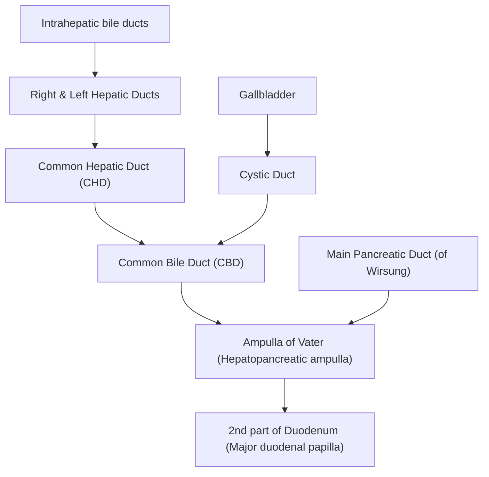
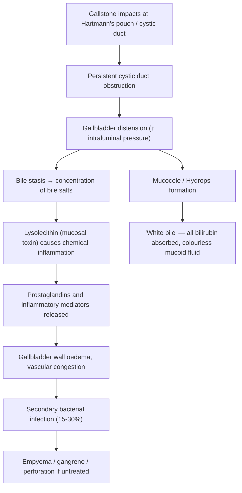

# Acute Cholecystitis

## 1. Definition

***Acute cholecystitis is acute inflammation of the gallbladder***, most commonly precipitated by ***obstruction of the cystic duct*** [1]. It is a ***complication of gallstone disease*** [1].

Let's break this down from first principles:

- "Chole-" = bile (Greek: *cholē*)
- "-cyst-" = bladder/sac (Greek: *kystis*)
- "-itis" = inflammation

So **cholecystitis** literally means "inflammation of the bile sac." The acute form implies a sudden, clinically significant inflammatory episode — as opposed to chronic cholecystitis, which is a smouldering, fibrotic process from repeated insults.

The key distinction to grasp early: this is **not** simply a stone blocking a duct and causing pain (that's biliary colic). Acute cholecystitis is what happens when the obstruction **persists**, the gallbladder becomes **distended**, and a cascade of ***chemical inflammation followed by secondary bacterial infection*** ensues [1][2][3].

<Callout title="Biliary Colic vs Acute Cholecystitis — The Core Distinction">
Biliary colic = **transient** obstruction of the cystic duct → visceral pain only, self-limiting ( < 6 hours), no peritoneal signs, afebrile. The stone dislodges, gallbladder relaxes, pain resolves.

Acute cholecystitis = **persistent** obstruction → ongoing distension → chemical then bacterial inflammation → parietal peritoneal irritation → fever, Murphy's sign, prolonged pain ( > 6 hours), leukocytosis. The stone does NOT dislodge [2][4].
</Callout>

---

## 2. Epidemiology

### 2.1 Global & Hong Kong Context

- Gallstone disease affects approximately **10–15%** of the adult population in Western countries; the prevalence in Hong Kong/Southern China is somewhat lower but rising with Westernisation of diet (higher fat, higher calorie intake) [2].
- **Acute cholecystitis develops in ~1–3% of patients with symptomatic gallstones per year** [2]. Once you become symptomatic with biliary colic, the risk of progression to cholecystitis or other complications is < 5% per year [2].
- ***Female predominance*** — follows the gallstone demographic ("5F" mnemonic: **Fat, Female, Forty, Fertile, Family history**) [2][4].
- In Hong Kong, there is additional relevance of **pigment stones** secondary to:
  - Recurrent pyogenic cholangitis (RPC / "Hong Kong disease") — associated with *Clonorchis sinensis* parasitic infestation from consumption of raw freshwater fish [5].
  - Haemolytic conditions endemic in Southern China (e.g. **G6PD deficiency**, **thalassaemia**) leading to black pigment stones [4].
- Acalculous cholecystitis accounts for approximately ***5–10%*** of all acute cholecystitis cases and is predominantly seen in ***critically ill, hospitalised patients*** [2][3].

### 2.2 Age and Sex

- Peak incidence: 5th–6th decade
- Female:Male ratio approximately 3:1 (mirrors gallstone prevalence)
- Acalculous cholecystitis does not follow this sex distribution — it occurs in the critically ill regardless of sex

---

## 3. Risk Factors

Risk factors for acute cholecystitis are essentially the risk factors for gallstones (since calculous cholecystitis is 90–95% of cases) **plus** factors that promote cystic duct obstruction and biliary stasis.

### 3.1 Risk Factors for Gallstone Formation

| Category | Risk Factors | Mechanism |
|---|---|---|
| **Demographics ("5F")** | ***Fat, Female, Forty, Fertile, Family history*** | Oestrogen increases hepatic cholesterol secretion and decreases bile acid secretion → supersaturated/lithogenic bile; progesterone decreases GB motility |
| **Metabolic** | Obesity, rapid weight loss, diabetes mellitus, metabolic syndrome | Obesity → ↑ cholesterol secretion; rapid weight loss → bile stasis + cholesterol supersaturation; DM → autonomic neuropathy causing GB hypomotility |
| **Haematological** | Chronic haemolysis (G6PD deficiency, thalassaemia, hereditary spherocytosis, sickle cell disease) | Excess unconjugated bilirubin in bile → **black pigment stones** (calcium bilirubinate) |
| **Hepatic** | Liver cirrhosis | Impaired bile acid synthesis + hypersplenism (haemolysis) → pigment stones |
| **GI** | Crohn's disease (terminal ileum), ileal resection | Loss of bile acid reabsorption in terminal ileum → depleted bile acid pool → cholesterol supersaturation |
| **Drugs** | OCP, oestrogen replacement, octreotide, ceftriaxone, fibrates | OCP/oestrogen: lithogenic bile; octreotide: GB stasis; ceftriaxone: precipitates in bile; fibrates: ↑ biliary cholesterol excretion |
| **Dietary/Lifestyle** | High-fat diet, prolonged fasting, TPN | Fasting/TPN → no CCK stimulation → GB stasis → sludge → stones |
| **Infections (HK relevant)** | *Clonorchis sinensis*, *Ascaris lumbricoides*, RPC | Parasites cause epithelial damage → bacterial translocation → β-glucuronidase deconjugates bilirubin → **brown pigment stones** |
| **Family history** | 1st degree relative with gallstones | 2× risk; polygenic susceptibility (ABCG8 transporter gene variants) |

### 3.2 Additional Risk Factors Specific to Acalculous Cholecystitis

***Acalculous cholecystitis*** classically occurs in ***hospitalised/critically ill patients*** [2][3]:

- ***Dehydration*** → bile inspissation
- ***Shock / systemic hypoperfusion*** → gallbladder ischaemia (microvascular occlusion)
- ***TPN*** → no enteral feeding → no CCK release → gallbladder stasis (↓CCK)
- ***Extensive burns, major operations, multiple trauma***
- ***Sepsis / multi-organ dysfunction***
- ***Prolonged ICU stay***

The underlying mechanism is **gallbladder ischaemia + bile stasis** rather than mechanical obstruction by a stone [2][3].

<Callout title="Why Acalculous Cholecystitis is More Dangerous" type="error">
Acalculous cholecystitis carries a **higher mortality** (up to 30–50% in some series) compared with calculous cholecystitis (~1–4%) because: (1) it occurs in already critically ill patients, (2) the ischaemic mechanism predisposes to earlier **gangrenous change and perforation**, and (3) the diagnosis is often delayed because these patients cannot communicate symptoms clearly and signs are masked by their primary illness [3].
</Callout>

---

## 4. Anatomy and Function

Understanding the anatomy is essential because it directly explains the pathophysiology, clinical signs, surgical approach, and complications.

### 4.1 Gallbladder Anatomy

***The gallbladder consists of: fundus, body, infundibulum (Hartmann's pouch), and neck*** [2][6].

- **Fundus**: The blind, rounded end that projects beyond the inferior border of the liver. It contacts the anterior abdominal wall at the **tip of the 9th costal cartilage** where the right lateral margin of the rectus abdominis crosses the costal margin — this is the **Murphy's point**, where you palpate for Murphy's sign.
- **Body**: The main portion, lies in a fossa on the visceral surface of the liver (segments IV and V).
- **Infundibulum (Hartmann's pouch)**: A saccular outpouching at the junction of the body and neck. This is the **most common site for stone impaction** — stones collect here by gravity and get jammed into the narrow transition to the cystic duct. This is also where stones impact in **Mirizzi syndrome**, compressing the adjacent common hepatic duct [6].
- **Neck**: Tapered, S-shaped portion that leads into the cystic duct. Contains mucosal folds (**spiral valves of Heister**) which do not have a true sphincter function but can trap small stones.

### 4.2 Cystic Duct and Calot's Triangle

- The **cystic duct** (typically 2–4 cm long) connects the gallbladder neck to the common hepatic duct, forming the **common bile duct (CBD)**.
- **Calot's triangle** (hepatocystic triangle): Bounded by the cystic duct inferiorly, the common hepatic duct medially, and the inferior surface of the liver superiorly. The **cystic artery** (usually a branch of the right hepatic artery) runs through this triangle.
  - Calot's triangle is the critical zone of dissection during cholecystectomy — inflammation in acute cholecystitis causes oedema and adhesions here, making surgery hazardous.

### 4.3 Blood Supply

- **Cystic artery**: Usually a branch of the right hepatic artery (in ~75% of individuals). It is an **end-artery** — there is no collateral supply to the gallbladder.
  - *Why does this matter?* In acute cholecystitis, the distended, inflamed gallbladder wall compresses its own blood supply. An end-artery with no collaterals → ischaemia → **gangrenous cholecystitis** (occurs in ~20% of cases) [3].

### 4.4 Venous and Lymphatic Drainage

- Venous drainage is via small cystic veins directly into the liver (segments IV and V) and partly via the cystic vein into the portal vein.
- Lymphatic drainage flows to the **cystic duct lymph node (Lund's node / node of Calot)** → hepatic nodes → coeliac nodes.

### 4.5 Nerve Supply

- Sympathetic: from the coeliac plexus (T7–T9).
- Parasympathetic: from the vagus nerve.
- Visceral afferents travel with sympathetic fibres to T7–T9 dermatomes — this explains why:
  - Biliary colic/cholecystitis pain is felt in the **epigastrium/RUQ** (T7–T9 dermatomes)
  - Pain can **radiate to the right shoulder tip/interscapular area** via the phrenic nerve (C3–C5), because the diaphragmatic peritoneum overlying the gallbladder fossa shares the same nerve supply (**referred pain / Boas sign**)

### 4.6 Gallbladder Function

- **Storage and concentration of bile**: Between meals, the sphincter of Oddi is tonically contracted, diverting bile into the gallbladder. The gallbladder concentrates bile 5–10× by absorbing water and electrolytes.
- **Contraction and bile release**: After a fatty meal, **cholecystokinin (CCK)** is released from I-cells of the duodenal mucosa → CCK causes gallbladder smooth muscle contraction + relaxation of sphincter of Oddi → bile ejected into the duodenum.
  - *Why fatty meals trigger biliary colic:* CCK-mediated contraction forces a stone against the cystic duct orifice or Hartmann's pouch → obstruction → increased intraluminal pressure → pain.

### 4.7 Biliary Tree Overview

---

## 5. Aetiology

### 5.1 Calculous Cholecystitis (90–95%)

***The most common cause — obstruction of the cystic duct by an impacted gallstone*** [1][2][3].

The stone typically impacts at **Hartmann's pouch** or the **cystic duct** itself. The type of stone matters for understanding the underlying disease but the pathophysiology of obstruction is the same regardless of stone type.

**Types of gallstones (Hong Kong relevance):**

| Stone Type | Composition | Appearance | Radiology | Prevalence | HK-Relevant Causes |
|---|---|---|---|---|---|
| **Cholesterol stones** | > 50% cholesterol | Yellow-green, often solitary, large | ***Radiolucent*** (only ~15% radio-opaque on AXR) | ~85% in Western populations; slightly less in HK | Obesity, OCP, metabolic syndrome, rapid weight loss |
| **Black pigment stones** | Calcium bilirubinate polymers, < 30% cholesterol | Black, small, multiple, hard | ***Radio-opaque*** | More common in HK/Asia | **Haemolysis** (G6PD, thalassaemia), chronic liver disease |
| **Brown pigment stones** | Calcium bilirubinate + bacterial cell bodies, < 30% cholesterol | Brown, soft, earthy | ***Radio-opaque*** | Common in HK/Asia | **Bacterial infection** — β-glucuronidase (from E. coli/Klebsiella) deconjugates bilirubin; ***RPC*** (*Clonorchis sinensis*, *Ascaris lumbricoides*) |
| **Mixed stones** | Mixture of cholesterol + pigment | Variable | Variable | ***Most common overall*** | Variable |

> ***Most gallstones are mixed stones*** [4].

### 5.2 Acalculous Cholecystitis (5–10%)

***Not associated with gallstones. Caused by microvascular occlusion within the gallbladder wall leading to ischaemia and secondary infection*** [3].

Risk factors: ***hospitalised/critically ill patients*** — dehydration, shock, TPN, burns, sepsis, major surgery, prolonged illness with multi-organ dysfunction [2][3].

### 5.3 Rare Causes

- **Tumour obstructing the cystic duct** ( < 1%) [2]
- **Biliary sludge** (micro-lithiasis / biliary "mud"): precipitated calcium bilirubinate granules and cholesterol microcrystals in thick mucus; functionally behaves like small stones
- **Parasitic** (Ascaris blocking cystic duct — very rare)

---

## 6. Pathophysiology

This is the most important section for understanding everything else. Let's walk through the cascade step by step.

### 6.1 The Pathophysiological Cascade (Calculous)

**Step 1 — Obstruction:**
A gallstone impacts at Hartmann's pouch or the cystic duct → complete obstruction → no bile can enter or leave the gallbladder [2][3].

**Step 2 — Distension:**
The gallbladder mucosa continues to secrete mucus but nothing can drain → progressive distension → raised intraluminal pressure [2].

**Step 3 — Chemical inflammation (first 48 hours):**
***Stagnant bile becomes concentrated. Lysolecithin, a normal bile constituent, reaches toxic concentrations and acts as a mucosal toxin, initiating chemical inflammation*** [2][3]. Phospholipase A converts lecithin (phosphatidylcholine) in bile to lysolecithin. Inflammatory mediators, particularly ***prostaglandins***, are released, propagating the inflammatory response [2].

> This is why **NSAIDs** (prostaglandin synthesis inhibitors) are first-line analgesics in biliary colic and cholecystitis — they directly target this pathophysiological mechanism.

**Step 4 — Wall oedema and vascular compromise:**
The inflammatory oedema thickens the gallbladder wall. The distended gallbladder compresses its own blood supply (remember, the cystic artery is an end-artery). This creates a vicious cycle: ischaemia → more inflammation → more oedema → more ischaemia.

**Step 5 — Secondary bacterial infection (15–30% of cases):**
***Bacteria contaminate the biliary system secondarily*** — they do not initiate the process [2]. Common organisms include:
- ***Gram-negative rods: Escherichia coli (most common), Klebsiella pneumoniae, Enterobacter spp.***
- ***Gram-positive: Enterococcus spp.*** [2]
- Anaerobes: *Bacteroides fragilis* (especially in severe/gangrenous cases)

These are enteric organisms — they reach the gallbladder via ascending infection from the duodenum through the cystic duct, or via haematogenous/lymphatic spread.

**Step 6 — Complications if untreated:**
- **Empyema**: Bacterial superinfection → pus fills the gallbladder
- **Gangrenous cholecystitis** (~20%): Ischaemic necrosis of the gallbladder wall [3]
- **Perforation**: Necrotic wall ruptures → localised (walled off by omentum) or free → biliary peritonitis
- **Emphysematous cholecystitis**: Infection by gas-forming organisms (e.g., *Clostridium welchii/perfringens*) → gas in the gallbladder wall

### 6.2 Mucocele / Hydrops

When the cystic duct is obstructed for a prolonged period without significant infection:
- All bilirubin within the gallbladder is absorbed by the mucosa
- The gallbladder fills with **colourless mucoid fluid ("white bile")**
- This is a ***mucocele (hydrops)*** — a distended gallbladder full of sterile mucus [2]

### 6.3 Pathophysiology of Acalculous Cholecystitis

***Microvascular occlusion within the gallbladder → ischaemia → inflammation → secondary infection*** [3].

The mechanism is fundamentally different from calculous cholecystitis:
- No stone → no mechanical obstruction
- Instead, systemic hypoperfusion (shock, sepsis) + bile stasis (TPN, fasting, opioids reducing GB motility) → gallbladder wall ischaemia
- The ischaemic mucosa is more susceptible to bacterial invasion
- Progresses to gangrene and perforation faster than calculous cholecystitis

---

## 7. Classification

### 7.1 By Aetiology

| Type | Proportion | Mechanism |
|---|---|---|
| ***Calculous cholecystitis*** | ***90–95%*** | Gallstone impaction in cystic duct / Hartmann's pouch |
| ***Acalculous cholecystitis*** | ***5–10%*** | Microvascular occlusion / ischaemia in critically ill patients |
| Tumour-related | < 1% | Neoplasm obstructing cystic duct |

### 7.2 Tokyo Guidelines Severity Grading (TG18/TG13)

The ***Tokyo Guidelines*** classify acute cholecystitis by severity, which directly guides management [2]:

| Grade | Severity | Criteria | Management Implication |
|---|---|---|---|
| **Grade I (Mild)** | No organ dysfunction, mild inflammatory changes in the gallbladder | Acute cholecystitis in an otherwise healthy patient with no organ dysfunction | Early laparoscopic cholecystectomy |
| **Grade II (Moderate)** | Presence of any one of: WBC > 18,000/μL, palpable tender RUQ mass, symptom duration > 72 hours, marked local inflammation (gangrenous cholecystitis, pericholecystic abscess, hepatic abscess, biliary peritonitis, emphysematous cholecystitis) | Difficult cholecystectomy expected; may need delayed surgery or drainage | Early or delayed LC depending on local expertise; consider drainage if high-risk |
| **Grade III (Severe)** | Organ/system dysfunction: cardiovascular (hypotension requiring vasopressors), neurological (decreased consciousness), respiratory (PaO₂/FiO₂ < 300), renal (oliguria, Cr > 2.0 mg/dL), hepatic (PT-INR > 1.5), haematological (platelets < 100,000/μL) | Urgent organ support + gallbladder drainage (percutaneous cholecystostomy); cholecystectomy after stabilisation | Percutaneous cholecystostomy or emergent cholecystectomy |

<Callout title="Tokyo Guidelines — Exam Relevance" type="idea">
You don't need to memorise every number, but know the principle: **Grade I = early cholecystectomy; Grade II = consider local expertise for early vs delayed; Grade III = stabilise + drain first, operate later.** The grading is based on presence of organ dysfunction and local inflammation severity.
</Callout>

### 7.3 By Chronicity

| | Acute Cholecystitis | Chronic Cholecystitis |
|---|---|---|
| **Onset** | Sudden | Insidious / recurrent |
| **Pathology** | Acute inflammation, oedema, possible necrosis | Chronic inflammatory infiltrate, fibrosis, mucosal atrophy, wall thickening |
| **Association** | Cystic duct obstruction by stone | Repeated acute episodes or chronic irritation by stones |
| **Clinical** | Fever, Murphy's sign, prolonged pain | Recurrent biliary colic, vague RUQ discomfort |
| **Complications** | Empyema, gangrene, perforation | ***Porcelain gallbladder, gallbladder carcinoma*** |

---

## 8. Clinical Features

### 8.1 Symptoms

| Symptom | Description | Pathophysiological Basis |
|---|---|---|
| ***RUQ / epigastric pain*** | ***Sudden onset***, ***steady*** (not truly colicky — the gallbladder has no peristalsis), ***severe***, ***persists > 6 hours*** (unlike biliary colic which resolves < 6 hours) [1][2] | Initially **visceral pain** (poorly localised, epigastric) from gallbladder distension stimulating visceral afferents (T7–T9). As inflammation extends to the **parietal peritoneum** overlying the gallbladder → pain **localises to the RUQ** (somatic, well-localised) |
| ***Radiation to right shoulder / interscapular area (Boas sign)*** | Pain may radiate to the right scapular tip or right shoulder [2] | **Referred pain** — the diaphragmatic peritoneum overlying the gallbladder fossa is innervated by the phrenic nerve (C3–C5), which shares dermatomes with the shoulder. Inflammation irritating this peritoneum → brain misinterprets pain as originating from the shoulder |
| ***Exacerbated by movement*** | Patient lies still, reluctant to move [2] | Peritoneal irritation — any movement stretches the inflamed parietal peritoneum, worsening pain |
| ***Fever*** | ***Low-grade initially*** (37.5–38.5°C); high-grade (> 39°C) suggests complications (empyema, gangrene, perforation) [1] | Inflammatory cytokines (IL-1, IL-6, TNF-α) from the inflamed gallbladder → hypothalamic thermoregulatory set-point ↑ |
| ***Nausea and vomiting*** | Very common [1][2] | Visceral afferents from the inflamed gallbladder stimulate the vomiting centre in the medulla (vagal pathway); also ileus from peritoneal inflammation |
| ***Anorexia*** | Loss of appetite [2] | Systemic inflammatory response + visceral discomfort → appetite suppression |
| **History of biliary colic** | Many patients have prior episodes of postprandial RUQ pain that resolved spontaneously | Previous transient cystic duct obstruction events; the current episode is one where the stone did not dislodge |
| **Fatty food intolerance** | May report that pain was precipitated by a fatty meal | CCK release from duodenal I-cells after fat ingestion → gallbladder contraction against an obstructed cystic duct |
| ***No tea-coloured urine (usually)*** | ***Absence of dark urine / jaundice in uncomplicated cases*** [1] | The obstruction is at the **cystic duct** — bile can still flow from the liver through the CBD into the duodenum. Bilirubin metabolism is unaffected. **If jaundice IS present**, think of: (1) Mirizzi syndrome, (2) concurrent choledocholithiasis (double impaction ~7%), or (3) severe inflammation causing oedema compressing the CBD (rare) |

<Callout title="Pain > 6 Hours = Think Cholecystitis" type="error">
The single most important clinical clue distinguishing biliary colic from acute cholecystitis is **duration of pain**. Biliary colic resolves in < 6 hours as the gallbladder relaxes and the stone falls back. If pain persists beyond 6 hours, suspect acute cholecystitis — the stone is impacted and inflammation has begun [2][4].
</Callout>

### 8.2 Signs

| Sign | Description | Pathophysiological Basis |
|---|---|---|
| ***Murphy's sign (positive)*** | ***Inspiratory arrest during deep palpation of the RUQ*** [1]. The examiner places fingers under the right costal margin at the midclavicular line and asks the patient to take a deep breath. The descending diaphragm pushes the inflamed gallbladder onto the examiner's fingers → sharp pain → patient catches their breath (inspiratory arrest). **Negative in acute cholangitis** (the gallbladder is not the site of inflammation in cholangitis — the bile duct is). | The inflamed gallbladder fundus contacts the parietal peritoneum of the anterior abdominal wall at the tip of the 9th costal cartilage. On inspiration, the diaphragm descends → liver moves inferiorly → the inflamed gallbladder is pressed against the palpating hand → sudden exacerbation of peritoneal pain → reflex arrest of inspiration |
| ***RUQ tenderness*** [1] | Localised tenderness on palpation of the RUQ | Parietal peritoneal inflammation overlying the gallbladder |
| ***Guarding*** [1] | Voluntary or involuntary contraction of abdominal wall muscles over the RUQ | Reflex protective spasm of the rectus abdominis to splint the inflamed area and prevent further peritoneal stretch |
| ***Rebound tenderness*** [1] | Pain on sudden release of pressure over the RUQ | Rapid decompression of the anterior abdominal wall causes sudden movement of the inflamed parietal peritoneum |
| **Low-grade fever** (37.5–38.5°C) | ***Temperature 37.5°C in the case vignette*** [1] | Systemic inflammatory response. Higher fevers ( > 39°C) + rigors suggest complicated disease (empyema, perforation) or concomitant cholangitis |
| **Tachycardia** | Heart rate > 100 bpm in more severe cases | Sympathetic activation secondary to pain and systemic inflammatory response |
| ***No jaundice (typically)*** [1] | Sclera and skin are not yellow in uncomplicated cases | The obstruction is in the cystic duct, NOT the CBD. Bilirubin can still drain through the common hepatic duct → CBD → duodenum |
| **Palpable gallbladder (occasionally)** | A ***tender RUQ mass*** may be palpable in some cases | Distended, inflamed gallbladder (especially if empyema or mucocele develops) |
| **Sonographic Murphy's sign** | Pain elicited when the ultrasound probe is pressed over the gallbladder | Same principle as clinical Murphy's sign, but more accurate because the probe is directly over the gallbladder (the examiner can see exactly where they are pressing) |

<Callout title="Why Murphy's Sign is Negative in Cholangitis" type="idea">
In acute cholangitis, the problem is in the **CBD** (common bile duct), not the gallbladder. The gallbladder may not be inflamed at all. Pressing on the gallbladder area doesn't reproduce the pain of cholangitis. If Murphy's sign is positive, think cholecystitis. If negative with Charcot's triad (fever, RUQ pain, jaundice), think cholangitis.
</Callout>

### 8.3 Differentiating Features from Biliary Colic

This is a **very high-yield comparison** for exams [2][4]:

| Feature | Biliary Colic | Acute Cholecystitis |
|---|---|---|
| **Mechanism** | ***Transient*** obstruction at Hartmann's pouch / cystic duct | ***Persistent*** obstruction → inflammation |
| **Duration** | < 6 hours (typically 30 min to 4–5 hours) | ***> 6 hours***, often days |
| **Character** | ***Steady*** (despite the name "colic", it is NOT truly colicky — no peristalsis in GB) | ***Steady***, more severe |
| **Fever** | Absent (afebrile) | ***Present*** |
| **Peritoneal signs** | ***Absent*** (purely visceral pain, no true inflammation) | ***Present*** (Murphy's sign, guarding, rebound) |
| **Lab** | Normal WBC, normal CRP | ***↑ WBC, ↑ CRP*** |
| **Natural history** | Self-resolves when stone dislodges, gallbladder relaxes | Does NOT self-resolve; persists and may progress to complications |

### 8.4 Signs of Complications

Certain clinical findings should alert you to **complicated cholecystitis**:

| Complication | Clinical Clues | Pathophysiology |
|---|---|---|
| ***Gallbladder empyema*** | ***Tender RUQ mass + septic-looking*** (high fever, rigors, diaphoresis) [3] | Pus fills the obstructed gallbladder → essentially an abscess |
| ***Gangrenous cholecystitis (~20%)*** [3] | High fever, signs of sepsis, often elderly or diabetic. May paradoxically have **less localised pain** (destroyed sensory nerves in necrotic wall) | Ischaemic necrosis of gallbladder wall from distension compressing the end-artery (cystic artery) |
| ***Perforation*** | Sudden worsening of pain → diffuse peritonitis OR localised abscess (often walled off by omentum) [3] | Necrotic wall ruptures. Free perforation → biliary peritonitis; contained → pericholecystic abscess |
| ***Emphysematous cholecystitis*** | ***Insidious onset, abdominal crepitus*** on palpation [3]. More common in diabetics and elderly males | Gas-forming organisms (***Clostridium welchii/perfringens***) infect the ischaemic GB wall → gas within the wall and lumen |
| ***Cholecystoenteric fistula / Gallstone ileus*** | Signs of small bowel obstruction (colicky abdominal pain, vomiting, distension, absolute constipation) [3] | Chronic inflammation → gallbladder adheres to adjacent duodenum/colon → stone erodes through → enters bowel → impacts at ileocaecal valve (narrowest point) |

### 8.5 Complications of Gallstone Disease (Overview from Lecture Slides)

***Complications of gallstone disease*** [1]:
- ***Mucocele of gallbladder***
- ***Empyema of gallbladder***
- ***Rupture of gallbladder***
- ***Acute cholangitis***
- ***Acute pancreatitis***
- ***Cholecystoduodenal fistula***
- ***Liver abscess***

---

## 9. Summary Comparison Table: Gallstone Disease Presentations

This is an essential "bird's-eye view" table [4]:

| | **Biliary Colic** | **Acute Cholecystitis** | **Choledocholithiasis** | **Acute Cholangitis** |
|---|---|---|---|---|
| **Mechanism** | Stone transiently obstructs cystic duct/Hartmann's pouch | Persistent cystic duct obstruction → inflammation | Stone migrates into CBD → obstructive jaundice | CBD obstruction + bacterial infection of biliary tree |
| **Pain** | RUQ < 6h | RUQ > 6h | RUQ ± | RUQ (part of Charcot's triad) |
| **Fever** | No | Yes | No (unless concurrent infection) | ***Yes*** |
| **Jaundice** | No | ***No*** (usually) | ***Yes*** (cholestatic LFT) | ***Yes*** |
| **Key sign** | — | ***Murphy's sign +ve*** | — | ***Charcot's triad; Reynold's pentad*** |
| **Labs** | Normal | ↑ WBC, ↑ CRP | Cholestatic LFT (↑ ALP, ↑ GGT, ↑ Bilirubin) | ↑ WBC, ↑ CRP + cholestatic LFT |
| **Key imaging** | USG: stone + posterior shadow | USG: ***5 cardinal signs*** | USG: dilated CBD + stone | USG: dilated CBD + stone |
| **Management** | Analgesics → elective LC | Resuscitation, IV antibiotics → LC | Biliary decompression (ERCP) → LC | ***Resuscitation, IV Abx, biliary decompression → LC*** |

---

<Callout title="High Yield Summary">

**Definition**: Acute inflammation of the gallbladder, most commonly due to cystic duct obstruction by an impacted gallstone (90–95% calculous).

**Key Epidemiology**: Follows gallstone demographics — 5F (Fat, Female, Forty, Fertile, Family). HK-relevant: pigment stones from haemolysis (G6PD, thalassaemia) and RPC (Clonorchis sinensis).

**Pathophysiology cascade**: Stone impacts → cystic duct obstruction → GB distension → bile stasis → chemical inflammation (lysolecithin, prostaglandins) in first 48h → secondary bacterial infection (E. coli, Klebsiella, Enterococcus) in 15–30% → empyema/gangrene/perforation if untreated.

**Acalculous cholecystitis** (5–10%): Critically ill patients; mechanism is microvascular ischaemia, NOT stone obstruction; higher mortality.

**Key clinical distinction from biliary colic**: Pain > 6 hours, fever, peritoneal signs (Murphy's sign), leukocytosis. Biliary colic: < 6h, no fever, no peritoneal signs.

**Murphy's sign**: Inspiratory arrest during RUQ palpation — inflamed GB is pushed onto examiner's hand by descending diaphragm. Negative in cholangitis.

**Usually NO jaundice** in uncomplicated cholecystitis (obstruction is at the cystic duct, not the CBD). If jaundice is present → think Mirizzi syndrome, double impaction, or concurrent choledocholithiasis.

**Complications**: Mucocele, empyema, gangrenous cholecystitis (20%), perforation, emphysematous cholecystitis, cholecystoenteric fistula/gallstone ileus, liver abscess.

**USG 5 cardinal signs**: (1) Gallstones, (2) Distended GB ( > 4 × 10 cm), (3) Wall thickening > 3 mm, (4) Pericholecystic fluid, (5) Sonographic Murphy's sign.

**Tokyo Guidelines severity grading**: Grade I (mild) → early LC; Grade II (moderate) → early/delayed LC; Grade III (severe) → stabilise + drain first.

</Callout>

---

<ActiveRecallQuiz
  title="Active Recall - Acute Cholecystitis"
  items={[
    {
      question: "What is the pathophysiological sequence that leads from gallstone impaction to acute cholecystitis?",
      markscheme: "Stone impaction at cystic duct/Hartmann's pouch → persistent obstruction → GB distension → bile stasis and concentration → chemical inflammation (lysolecithin as mucosal toxin; prostaglandins) in first 48h → secondary bacterial infection (15-30%: E. coli, Klebsiella, Enterococcus) → empyema/gangrene/perforation if untreated."
    },
    {
      question: "How do you clinically differentiate acute cholecystitis from biliary colic? Name at least 4 distinguishing features.",
      markscheme: "(1) Duration: biliary colic < 6h vs cholecystitis > 6h. (2) Fever: absent in colic, present in cholecystitis. (3) Peritoneal signs: absent in colic (visceral pain only), present in cholecystitis (Murphy's sign, guarding, rebound). (4) Labs: normal WBC in colic vs leukocytosis/elevated CRP in cholecystitis. (5) Natural history: colic self-resolves; cholecystitis does not."
    },
    {
      question: "What is Murphy's sign, and why is it positive in cholecystitis but negative in cholangitis?",
      markscheme: "Murphy's sign = inspiratory arrest during deep palpation of RUQ. On inspiration, diaphragm descends, pushing inflamed gallbladder onto examiner's hand causing sharp pain. Positive in cholecystitis because the gallbladder itself is inflamed. Negative in cholangitis because the inflammation is in the CBD, not the gallbladder."
    },
    {
      question: "List the 5 cardinal ultrasound signs of acute cholecystitis.",
      markscheme: "(1) Presence of gallstones. (2) Distended GB (> 4 x 10 cm). (3) GB wall thickening > 3 mm. (4) Pericholecystic fluid/stranding. (5) Sonographic Murphy's sign."
    },
    {
      question: "Why does acute cholecystitis typically NOT cause jaundice? Name 3 exceptions where cholecystitis CAN present with jaundice.",
      markscheme: "The obstruction is at the cystic duct, not the CBD — bile can still drain from liver through CHD/CBD into duodenum, so bilirubin metabolism is unaffected. Exceptions: (1) Mirizzi syndrome (stone in Hartmann's pouch compresses CHD). (2) Double impaction (stone in cystic duct AND distal CBD simultaneously, ~7%). (3) Concurrent choledocholithiasis. Also severe inflammation causing oedema compressing CBD (rare)."
    },
    {
      question: "What is acalculous cholecystitis? Who gets it and why does it have higher mortality?",
      markscheme: "Inflammation of GB without gallstones, caused by microvascular occlusion and ischaemia. Occurs in critically ill/hospitalised patients (dehydration, shock, TPN, burns, sepsis, major surgery). Higher mortality (up to 30-50%) because: (1) patients already critically ill, (2) ischaemic mechanism predisposes to earlier gangrene/perforation, (3) diagnosis often delayed as patients cannot communicate symptoms."
    }
  ]}
/>

---

## References

[1] Lecture slides: GC 200. RUQ pain, jaundice and fever Cholecytitis and cholangitis Imaging of GI system.pdf (p3–5)
[2] Senior notes: felixlai.md (Cholecystitis sections, pp. 553–555; Gallstones overview, p. 508)
[3] Senior notes: maxim.md (Acute calculous cholecystitis, Acute acalculous cholecystitis, pp. 130–136)
[4] Senior notes: maxim.md (Gallstone diseases overview, stone composition table, symptomatic gallstones summary, pp. 130–131)
[5] Senior notes: maxim.md (Recurrent pyogenic cholangitis, p. 136)
[6] Senior notes: felixlai.md (Mirizzi syndrome — Gallbladder anatomy, pp. 572–573)
