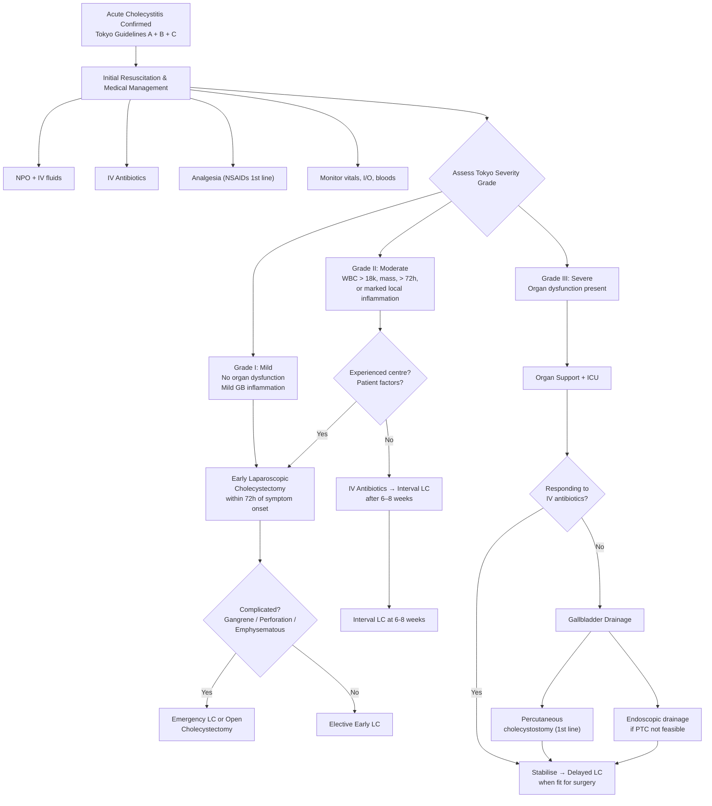

## Management of Acute Cholecystitis

### Guiding Principles

The management of acute cholecystitis rests on **three pillars**, applied in sequence:

1. **Resuscitation and supportive care** — stabilise the patient
2. **Medical treatment** — control infection, inflammation, and symptoms
3. **Definitive treatment** — remove the gallbladder (the source of the problem) to prevent recurrence

The timing and approach to definitive treatment depend on the **Tokyo Guidelines severity grading** (Grade I–III), the **duration of symptoms**, and the **patient's fitness for surgery**.

Think of it this way: the gallbladder with its stone is a ticking bomb. Medical treatment defuses the immediate crisis. Surgery removes the bomb entirely.

---

### Management Algorithm

---

### 1. Initial Resuscitation and Supportive Care

These measures apply to **ALL patients** regardless of severity grade. The aim is to stabilise the patient's physiology before any definitive intervention.

| Measure | Details | Rationale |
|---|---|---|
| ***Nil by mouth (NPO)*** [2][3] | No oral intake until inflammation subsides (bowel rest) | Eating (especially fat) → CCK release → gallbladder contraction against the obstructed cystic duct → worsens distension, pain, and inflammation. NPO removes this stimulus. Also prepares patient for possible surgery. |
| ***IV fluids*** [2][3] | Crystalloid resuscitation (e.g., normal saline, Hartmann's solution) | Patients are often dehydrated from vomiting, poor oral intake, and third-spacing from inflammation. Adequate hydration maintains renal perfusion and corrects electrolyte disturbances. |
| ***Continuous monitoring of vitals*** [2] | Heart rate, blood pressure, temperature, respiratory rate, urine output (I/O charting) | Detect early signs of clinical deterioration (sepsis, perforation), monitor response to treatment. Tachycardia and hypotension suggest progression to septic shock (→ Grade III). |
| ***Blood tests including cross-match*** [2] | CBC D/C, LRFT, amylase, clotting, CRP, blood C/ST, group & cross-match [3] | Baseline assessment, pre-operative preparation, monitor inflammatory trend, identify coexisting biliary pathology, have blood available if surgery is needed urgently |

---

### 2. Medical Treatment

#### A. Analgesia

***Pain control with NSAIDs*** [2]

- **First-line**: NSAIDs (e.g., diclofenac, ketorolac, indomethacin)
  - *Why NSAIDs first?* The early inflammation in cholecystitis is mediated by **prostaglandins** released from the chemically irritated gallbladder mucosa (lysolecithin → phospholipase A → prostaglandins). NSAIDs inhibit cyclooxygenase (COX) → block prostaglandin synthesis → directly target the pathophysiological mechanism. They also reduce gallbladder pressure by relaxing smooth muscle. Evidence shows NSAIDs can reduce progression from biliary colic to cholecystitis.
  - Contraindications: renal impairment, peptic ulcer disease, coagulopathy, aspirin-sensitive asthma

- **Second-line**: Opioids (e.g., pethidine, morphine)
  - Used when NSAIDs are contraindicated or insufficient
  - *Historical concern about morphine*: It was traditionally taught that morphine causes sphincter of Oddi spasm and should be avoided. Current evidence suggests this is clinically insignificant at therapeutic doses, and morphine can be used safely. Pethidine was historically preferred but has no proven advantage and carries risk of seizures with repeated dosing.

- **Adjuncts**: Paracetamol (IV or oral), antispasmodics (hyoscine butylbromide)

#### B. IV Antibiotics

***Acute cholecystitis is primarily an inflammatory process but secondary infection of gallbladder can occur as a result of cystic duct obstruction and bile stasis*** [2]

Antibiotics are given because:
1. **15–30% of cases** develop secondary bacterial infection
2. You cannot reliably distinguish sterile chemical inflammation from infected cholecystitis clinically
3. Antibiotics prevent progression to empyema, gangrene, and sepsis
4. They are essential for **treatment of pericholecystic abscess, emphysematous cholecystitis, and biliary sepsis** [2]

**Empirical antibiotic regimens** — must cover ***Gram-negative aerobes and anaerobes*** [2]:

| Regimen | Components | Coverage | Notes |
|---|---|---|---|
| **1st line (mild-moderate)** | ***IV Augmentin (Amoxicillin/clavulanate)*** [3] | Gram-positive, Gram-negative, anaerobes | Simple, well-tolerated; the "workhorse" for community-acquired biliary infections |
| **Option 2** | ***Ampicillin-sulbactam*** | Similar broad spectrum | β-lactam/β-lactamase inhibitor combination |
| **Option 3 (severe)** | ***Piperacillin-tazobactam (Tazocin)*** [12] | Extended Gram-negative cover including Pseudomonas, plus anaerobes | Reserved for severe/complicated cases or hospital-acquired infections |
| **Option 4** | ***Metronidazole + 3rd-generation cephalosporin (e.g., Ceftriaxone)*** [2] | Cephalosporin covers Gram-negatives; Metronidazole covers anaerobes | Alternative when β-lactam/inhibitor combinations are not available or contraindicated |
| **Option 5** | ***Metronidazole + Fluoroquinolone (e.g., Ciprofloxacin / Levofloxacin)*** [2] | Fluoroquinolone covers Gram-negatives; Metronidazole covers anaerobes | Use in penicillin-allergic patients; note rising fluoroquinolone resistance |

> *Why cover anaerobes?* In complicated cholecystitis (gangrene, perforation, empyema), the ischaemic, necrotic gallbladder wall creates an anaerobic environment where organisms like *Bacteroides fragilis* and *Clostridium* species thrive. Metronidazole ("metro" = targeting anaerobic metabolism) is the classic anti-anaerobic agent.

<Callout title="Antibiotic Choice in Practice" type="idea">
For exams, remember the simple framework:
- **Mild/Moderate**: ***IV Augmentin*** [3]
- **Severe/Complicated**: ***IV Tazocin (Piperacillin-tazobactam)*** [12]
- **Penicillin allergy**: Metronidazole + Ceftriaxone (or Metronidazole + Fluoroquinolone)
- Always adjust based on **blood culture and sensitivity** results when available.
</Callout>

---

### 3. Definitive Surgical Treatment

The gallbladder is the source of the problem (it contains the stones, it is the organ that becomes inflamed). As long as it remains in situ, the patient is at risk of recurrent cholecystitis, empyema, gangrene, and gallstone migration into the CBD. Therefore:

> **The definitive treatment for acute cholecystitis is cholecystectomy — removal of the gallbladder.**

#### A. Laparoscopic Cholecystectomy (LC) — The Gold Standard

***Cholecystectomy (removal of gallbladder) — open or laparoscopic, delayed or early*** [1]

***Laparoscopic cholecystectomy*** is the ***1st-line definitive treatment for most patients*** [3][4].

**Laparoscopic vs Open Cholecystectomy:**

| | ***Laparoscopic Cholecystectomy*** | ***Open Cholecystectomy*** |
|---|---|---|
| **Pros** [1] | ***Less pain*** | Direct visualisation of anatomy |
| | ***Shorter hospital stay*** | Easier to handle severe inflammation/adhesions |
| | ***Faster recovery*** | No pneumoperitoneum-related risks |
| | ***Better cosmesis*** | |
| **Cons** [1] | ***Technically demanding*** [1] | More pain, longer hospital stay |
| | ***Higher conversion rate*** [1] | Larger wound → higher wound infection rate |
| | ***More serious complications*** (bile duct injury) [1] | Longer recovery, poor cosmesis |

**Indications for cholecystectomy** [8][9]:
- **Symptomatic gallstones** with or without complications
- **Acalculous cholecystitis**
- **Asymptomatic gallstones** in high-risk patients:
  - Increased risk of gallbladder cancer: ***GB polyps > 1 cm, porcelain gallbladder, large gallstones > 3 cm*** [9]
  - Increased risk of gallstone complications: patients on long-term TPN, haemolytic disorders, gastric bypass (altered anatomy)
  - Concomitant liver surgery

**Indications for conversion to open** [9]:
- ***Cannot tolerate pneumoperitoneum*** (e.g., cardiopulmonary comorbidities — CO₂ insufflation increases intra-abdominal pressure → decreased venous return → cardiac compromise)
- ***Refractory coagulopathy***
- ***Multiple prior abdominal surgeries*** (extensive adhesions)
- ***Gallbladder carcinoma*** (risk of tumour seeding from port sites)
- **Failure to achieve the critical view of safety** (anatomy unclear, bleeding, bile duct injury suspected)

<Callout title="Conversion is NOT Failure" type="error">
***Conversion of laparoscopic into open procedure in face of a difficult laparoscopic procedure should never be viewed as surgical failure or complication but rather as a way to avoid potential injury to patients*** [8]. This is a fundamental surgical principle. The safest operation is the one you can perform well — if laparoscopic conditions are unsafe, converting to open is the right decision.
</Callout>

#### B. Timing of Cholecystectomy: Early vs Delayed (Interval)

This is one of the ***most important management decisions and a high-yield exam topic*** [1].

***Early or delayed surgery*** [1]:

| | ***Early Surgery*** | ***Delayed Surgery (Interval)*** |
|---|---|---|
| **Timing** | ***Within 48–72 hours*** of symptom onset [1] | ***Conservative treatment first → interval surgery in 8–12 weeks*** [1] |
| **Advantages** [1] | ***Avoid urgent operation*** | ***Avoid misdiagnosis*** |
| | ***Avoid recurrent symptoms*** | ***Easier dissection*** |
| | ***Avoid readmission*** | ***Less septic complications*** |
| | ***Shorter hospital stay*** | ***Less serious complications*** |
| **Disadvantages** [3] | Higher risk of bleeding and post-op infections; higher risk of converting to open [3] | Separate admission; fibrosis causes difficulty in mobilising GB; chance of recurrence while waiting for OT [3] |

> ***"Early cholecystectomy is safe without increasing the risk of complications"*** [1]

**The current evidence and guideline position:**
- ***Early cholecystectomy should always be recommended unless contraindicated*** [7]
- **2013 Tokyo Guidelines**: Surgery within 72 hours of symptom onset [7]
- **2018 Tokyo Guidelines**: Even if > 72 hours has passed since symptom onset, there are still benefits to performing cholecystectomy early; recommended early LC in low-risk patients regardless of how much time has passed [7]
- **2016 WSES Guidelines**: Early LC as long as completed within 10 days of symptom onset. Symptoms > 10 days → should not undergo early cholecystectomy (allow inflammation to subside) [7]

**Why is early LC easier?** [3]
- ***Initial inflammation: pericholecystic fluid in the dissection plane → easier dissection*** [3] — the oedema fluid actually creates a natural plane around the gallbladder that the surgeon can exploit
- ***After 72 hours: dense adhesions form at Calot's triangle*** [3] — fibrotic adhesions obliterate tissue planes, making identification of the cystic duct and artery hazardous

#### C. Severity-Guided Management (Tokyo Guidelines)

| Grade | Management [2][7] |
|---|---|
| ***Grade I (Mild)*** | ***Early laparoscopic cholecystectomy*** |
| ***Grade II (Moderate)*** | ***Early LC*** if experienced centre with low anticipated operative risk **OR** ***IV antibiotics → delayed/interval LC*** if high operative risk or inexperienced centre |
| ***Grade III (Severe)*** | ***Organ support + IV antibiotics + gallbladder drainage (percutaneous cholecystostomy)*** → ***delayed LC*** after physiological recovery |

**Emergency/Urgent LC** is indicated for [3][4]:
- ***Complicated cholecystitis: gangrene, perforation, emphysematous cholecystitis*** [3][4]
- ***Disease progression despite best supportive care*** [3][4]

#### D. The Critical View of Safety (CVS) — Intraoperative Landmark

This is the single most important concept in cholecystectomy safety [8][9]:

***Critical View of Safety (CVS)*** [9]:
1. ***Hepatocystic triangle clearance*** — Calot's triangle dissected free of all fat and fibrous tissue
2. ***Cystic plate clearance*** — the lower third of the gallbladder separated from the liver bed
3. ***Only two structures seen entering the gallbladder: the cystic duct and cystic artery*** [9]

> *Why is this so critical?* ***Misidentification of the cystic duct is the commonest cause of biliary injury*** [8]. If the surgeon mistakes the CBD for the cystic duct and clips/divides it, the patient develops a devastating bile duct injury. The CVS ensures that the ONLY structures being divided are those that enter the gallbladder directly — nothing else.

**If the critical view cannot be achieved** [8]:
- Perform ***intraoperative cholangiography (IOC)*** to delineate anatomy
- ***Convert to open procedure***
- Consider ***subtotal (partial) cholecystectomy*** — ***advocated when ductal and vascular structures in the triangle of Calot cannot be safely identified in the setting of severe acute inflammation*** [8]

#### E. Subtotal Cholecystectomy

- A bail-out procedure when the "critical view" is unachievable due to severe inflammation, dense adhesions, or Mirizzi syndrome
- The gallbladder fundus and body are removed, but the **Hartmann's pouch/infundibulum is left behind** (either closed or left open with a drain)
- Avoids dangerous dissection near the CBD and hepatic artery
- Leaves a small gallbladder remnant that may rarely develop recurrent stones or malignancy — but this is preferable to a bile duct injury

---

### 4. Gallbladder Drainage (Non-Surgical Decompression)

When the patient **cannot undergo cholecystectomy** (too sick, organ failure, high surgical risk), you need an alternative way to decompress the infected, distended gallbladder.

***Cholecystostomy — Drainage of the gallbladder. Open or percutaneous*** [1]

***Indications for gallbladder drainage*** [1][7]:
- ***High surgical risk*** [1]
- ***Haemodynamically unstable*** [1]
- ***Difficult cholecystectomy*** [1]
- ***Severe acute cholecystitis (Grade III)*** [7]
- ***Late presentation > 72 hours after onset of symptoms*** (where early LC is not feasible) [7]
- ***Failure of medical (antibiotic) therapy*** [7]
- ***Contraindication to general anaesthesia*** [7]
- ***Not responding to antibiotics*** while waiting for interval LC [3]

#### A. Percutaneous Cholecystostomy (PTC) — First-Line Drainage

***Percutaneous cholecystostomy*** [7]:
- ***Decompresses and drains the distended, inflamed, hydropic or purulent gallbladder*** [7]
- ***Indicated in management of acute cholecystitis in frail patients who are not fit for general anaesthesia*** [7]
- Can be placed under **USG or CT guidance**

**Technique:**
- ***Catheter is inserted over a guidewire that has been passed through the abdominal wall, through the liver, and into the gallbladder*** [7]
- ***By passing the catheter through the liver, the risk of bile leak around the catheter is minimised*** [7] — the liver parenchyma seals around the catheter tract (tamponade effect), preventing bile from tracking into the peritoneal cavity
- The catheter allows continuous drainage of infected bile/pus

**It is both diagnostic AND therapeutic** [2]: infected gallbladder is decompressed, bile can be sent for culture and sensitivity, and in calculous disease stones can potentially be extracted via the tube.

***Specific complications of percutaneous cholecystostomy*** [3]:
- ***Catheter migration*** (dislodgement)
- ***Bile leakage*** around the tube
- ***Bowel injury*** (from needle insertion)

**After stabilisation → definitive treatment is interval cholecystectomy** [2][7]

#### B. Endoscopic Drainage — If Percutaneous Not Feasible

***Endoscopic drainage: if percutaneous cholecystostomy is not feasible*** [3]:

| Method | Technique | Notes |
|---|---|---|
| ***Endoscopic transpapillary gallbladder drainage (ETGBD) via ERCP*** | ***ERCP to place a drainage catheter into the gallbladder via the cystic duct*** [7]. The catheter end is either brought out through the nose as a ***nasobiliary drain (NB tube — pink with sideholes)*** or left to drain internally into the duodenum | ***NB tube is relatively contraindicated in confused patients*** (risk of self-removal, aspiration) [7]. Requires a patent cystic duct (if completely obstructed by stone, catheter cannot pass). |
| ***EUS-guided gallbladder drainage (EUS-GBD)*** | ***Transmural drainage using EUS guidance to access the inflamed gallbladder with a needle puncture, followed by dilation and stent placement over a guidewire*** [7] | Newer technique; useful when percutaneous and transpapillary approaches are not feasible. Uses a lumen-apposing metal stent (LAMS) to create a direct fistula between the GB and the stomach/duodenum. |

---

### 5. Management of Specific Situations

#### A. Acalculous Cholecystitis

***Management: laparoscopic cholecystectomy or gallbladder drainage (if unfit)*** [3]

- These patients are typically critically ill (ICU patients) — surgical risk is high
- ***Percutaneous cholecystostomy is often the treatment of choice*** because they are usually unfit for surgery [2]
- ***Definitive treatment is interval cholecystectomy*** once the patient recovers [2]

#### B. Concurrent Choledocholithiasis

If investigations suggest coexisting CBD stones (cholestatic LFT, dilated CBD, visible CBD stone):

- **Pre-operative ERCP** → sphincterotomy + CBD stone extraction → followed by **LC** (two-stage approach)
- **OR** LC with **intraoperative cholangiography (IOC)** → laparoscopic CBD exploration if stones confirmed (single-stage approach)
- The approach depends on local expertise and resources

#### C. Complicated Cholecystitis

***Emergency LC (or open cholecystectomy)*** is indicated for [3][4]:
- ***Gangrenous cholecystitis***
- ***Gallbladder perforation***
- ***Emphysematous cholecystitis***
- ***Disease progression despite best supportive care***

These are surgical emergencies — the necrotic/infected gallbladder must be removed urgently to prevent biliary peritonitis and overwhelming sepsis.

---

### 6. Specific Complications of Cholecystectomy

| Timing | Complication | Mechanism / Details |
|---|---|---|
| **Immediate** | Bleeding (cystic artery, liver bed) | Inadequate clip/cautery; aberrant vascular anatomy |
| | ***Bile duct injury*** (most feared) | ***Misidentification of CBD as cystic duct*** [8] — hence the critical view of safety |
| | Bowel injury (trocar insertion) | During port placement for laparoscopy |
| **Early** | Bile leak (cystic duct stump) | Clip slippage or necrosis of stump |
| | Wound infection | More common with open approach; higher in contaminated/emergency cases |
| | Retained CBD stones | Stones migrated to CBD pre/during surgery; diagnosed by IOC or post-op symptoms |
| | Subhepatic collection/abscess | Bile or blood accumulation in the gallbladder fossa |
| **Late** | Post-cholecystectomy syndrome | Persistent RUQ pain after surgery; causes include retained CBD stone, sphincter of Oddi dysfunction, bile duct stricture |
| | Incisional hernia | Especially at port sites (laparoscopic) or incision (open) |
| | Bile duct stricture | Late consequence of thermal or ischaemic injury during dissection |

<Callout title="Cardiopulmonary Risks of Laparoscopy">
Pneumoperitoneum (CO₂ insufflation to ~15 mmHg) increases intra-abdominal pressure → compresses IVC → decreases venous return → decreases cardiac output. CO₂ absorption → hypercapnia → respiratory acidosis. The reversed Trendelenburg position (head up) further reduces venous return. These are why patients with severe cardiopulmonary disease may not tolerate laparoscopic cholecystectomy and may need an open approach [9].
</Callout>

---

### Management Summary Table

| Scenario | Initial Management | Definitive Treatment |
|---|---|---|
| **Grade I (Mild)** | NPO, IVF, IV Augmentin, analgesia | ***Early LC (within 72h)*** |
| **Grade II (Moderate)** | NPO, IVF, IV Abx, analgesia | ***Early LC*** (experienced centre) OR ***Interval LC (6–8 wk)*** |
| **Grade III (Severe)** | Resuscitation, organ support, IV Tazocin | ***Percutaneous cholecystostomy*** → ***Delayed LC*** |
| **Complicated (gangrene/perforation/emphysematous)** | Emergency resuscitation, IV Abx | ***Emergency LC or open cholecystectomy*** |
| **Acalculous** | NPO, IVF, IV Abx | ***LC*** or ***percutaneous cholecystostomy*** (if unfit) → ***interval LC*** |
| **Unfit for surgery** | NPO, IVF, IV Abx | ***Percutaneous cholecystostomy*** or ***endoscopic drainage*** |

---

<Callout title="High Yield Summary">

**Initial management for ALL grades**: NPO, IV fluids, IV antibiotics, analgesia (NSAIDs first-line), monitoring.

**Antibiotic choice**: Mild = IV Augmentin; Severe = IV Tazocin. Must cover Gram-negatives and anaerobes.

**Definitive treatment**: Laparoscopic cholecystectomy — 1st-line for most patients. Open cholecystectomy if laparoscopic not feasible or contraindicated.

**Timing**: Early LC (within 72h) is preferred — shorter hospital stay, avoids readmission, avoids recurrence, early inflammation creates easier dissection planes. After 72h, dense adhesions form. "Early cholecystectomy is safe without increasing the risk of complications" (lecture slide).

**Tokyo-guided approach**: Grade I → Early LC; Grade II → Early or delayed LC; Grade III → Stabilise + drain → delayed LC.

**Drainage indications**: High surgical risk, haemodynamically unstable, difficult cholecystectomy, Grade III, failed antibiotics, contraindication to GA. Percutaneous cholecystostomy is 1st-line drainage. Pass catheter through the liver to minimise bile leak.

**Critical View of Safety**: Hepatocystic triangle clearance + cystic plate clearance + only 2 structures (cystic duct and artery) entering the GB. Misidentification of the cystic duct is the commonest cause of biliary injury.

**Emergency LC/open**: Gangrene, perforation, emphysematous cholecystitis, disease progression despite best supportive care.

</Callout>

---

<ActiveRecallQuiz
  title="Active Recall - Management of Acute Cholecystitis"
  items={[
    {
      question: "Describe the initial medical management of acute cholecystitis. Why are NSAIDs the first-line analgesic?",
      markscheme: "Initial: NPO (bowel rest, prevent CCK-mediated GB contraction), IV fluids (rehydration), IV antibiotics (cover Gram-negatives and anaerobes), analgesia, monitoring of vitals and I/O. NSAIDs are first-line because early inflammation is mediated by prostaglandins (from lysolecithin-induced chemical irritation). NSAIDs inhibit COX, blocking prostaglandin synthesis, directly targeting the pathophysiology. They also reduce gallbladder pressure."
    },
    {
      question: "Compare the advantages of early vs delayed cholecystectomy as stated in the lecture slides. Which is currently recommended?",
      markscheme: "Early (within 48-72h): avoids urgent operation, avoids recurrent symptoms, avoids readmission, shorter hospital stay. Delayed (interval at 8-12 weeks): avoids misdiagnosis, easier dissection, less septic complications, less serious complications. Current recommendation: Early cholecystectomy is safe without increasing risk of complications and should always be recommended unless contraindicated."
    },
    {
      question: "What is the Critical View of Safety in cholecystectomy? Why is it essential?",
      markscheme: "Three criteria: (1) Hepatocystic triangle clearance (Calot's triangle dissected free of all tissue). (2) Cystic plate clearance (lower third of GB separated from liver bed). (3) Only two structures seen entering the gallbladder: cystic duct and cystic artery. Essential because misidentification of the cystic duct is the commonest cause of bile duct injury. If CVS cannot be achieved, perform IOC or convert to open."
    },
    {
      question: "List the indications for gallbladder drainage (cholecystostomy) in acute cholecystitis.",
      markscheme: "High surgical risk, haemodynamically unstable, difficult cholecystectomy, severe acute cholecystitis (Grade III), late presentation > 72h (where early LC not feasible), failure of medical/antibiotic therapy, contraindication to general anaesthesia, not responding to antibiotics while awaiting interval LC."
    },
    {
      question: "Explain why the percutaneous cholecystostomy catheter is passed through the liver rather than directly through the peritoneum into the gallbladder.",
      markscheme: "Passing the catheter through the liver parenchyma minimises the risk of bile leak. The liver tissue tamponades and seals around the catheter tract, preventing bile from tracking into the peritoneal cavity and causing biliary peritonitis. A direct transperitoneal approach would leave a tract through which bile could leak freely."
    },
    {
      question: "How does the Tokyo Guidelines severity grading guide the management approach for acute cholecystitis?",
      markscheme: "Grade I (Mild, no organ dysfunction): Early laparoscopic cholecystectomy. Grade II (Moderate, marked local inflammation but no organ failure): Early LC if experienced centre, or IV antibiotics followed by interval LC at 6-8 weeks. Grade III (Severe, organ dysfunction present): Organ support + IV antibiotics + gallbladder drainage (percutaneous cholecystostomy first-line), then delayed LC after physiological recovery."
    }
  ]}
/>

## References

[1] Lecture slides: GC 200. RUQ pain, jaundice and fever Cholecytitis and cholangitis Imaging of GI system.pdf (p8–12)
[2] Senior notes: felixlai.md (Cholecystitis — Treatment sections, pp. 557–561)
[3] Senior notes: maxim.md (Acute calculous cholecystitis — Initial management, Definitive treatment, Early vs Interval LC, GB drainage, pp. 131–132)
[4] Senior notes: maxim.md (Symptomatic gallstones summary table — management approach, p. 130)
[7] Senior notes: felixlai.md (Severity grading, timing of surgery guidelines, gallbladder drainage overview, pp. 558–561)
[8] Senior notes: felixlai.md (Cholecystectomy — CVS, indications, partial cholecystectomy, pp. 513–515)
[9] Senior notes: maxim.md (Cholecystectomy — indications, approach, CVS, operative procedure, pp. 133–134)
[12] Senior notes: maxim.md (Acute cholangitis — Acute management RAD, IV Tazocin for severe, p. 135)
