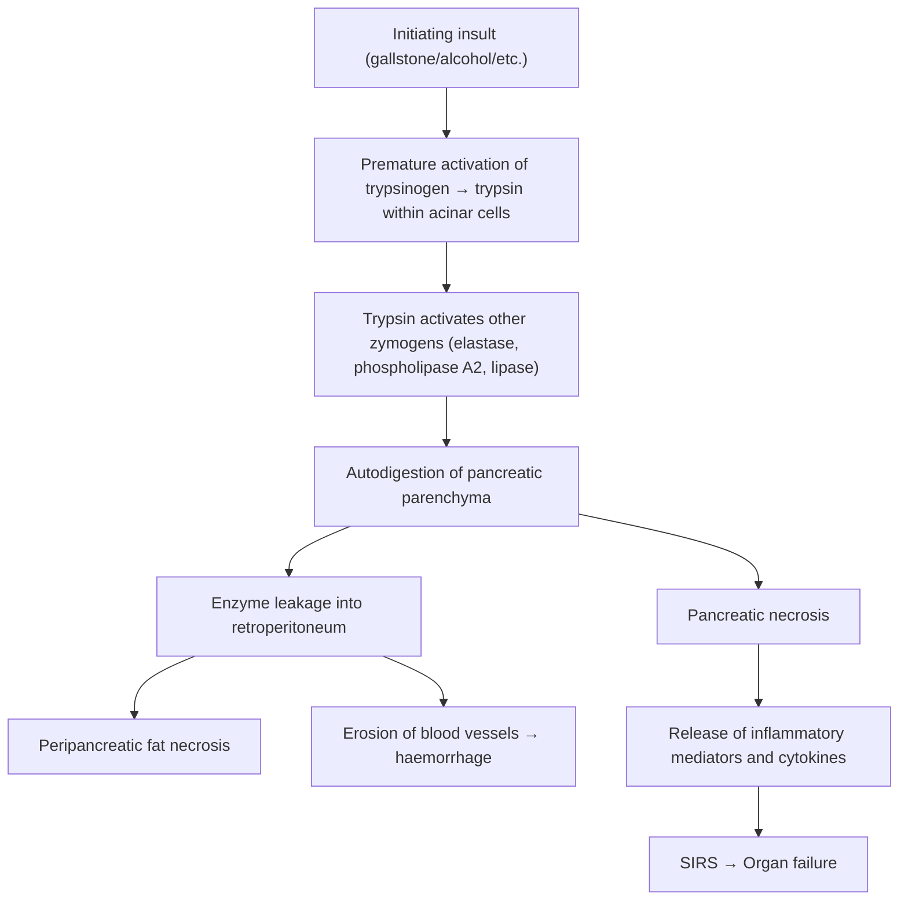
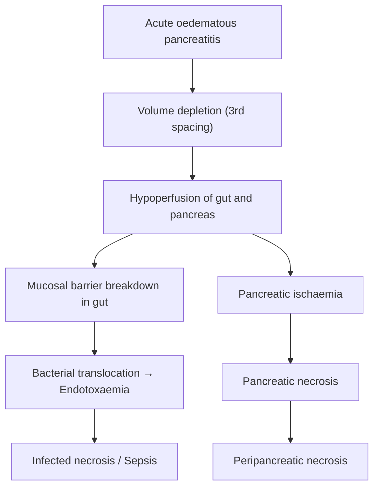

## 1. Definition

Acute pancreatitis is an **acute inflammatory condition of the pancreatic parenchyma** characterised by abdominal pain and elevated levels of pancreatic enzymes in the blood [1][2]. The name itself tells you the condition: "pan" = all, "creas" = flesh (Greek, referring to the fleshy organ), "-itis" = inflammation. So pancreatitis literally means "inflammation of the pancreas."

The key concept is **autodigestion** — the pancreas, which normally produces powerful digestive enzymes meant for the duodenum, begins digesting *itself*. This is what distinguishes pancreatitis from other causes of abdominal pain and makes it potentially lethal.

<Callout title="Core Concept">
Acute pancreatitis = premature activation of pancreatic enzymes (especially trypsinogen → trypsin) within the pancreatic acinar cells → autodigestion → local and systemic inflammation. Everything else — the pain, the complications, the organ failure — flows from this single pathological event.
</Callout>

---

## 2. Epidemiology

- **Incidence**: Approximately 13–45 per 100,000 population per year globally, with incidence rising over recent decades (likely due to increasing obesity, gallstone disease, and alcohol consumption).
- **Age**: Can occur at any age, but peak incidence is in the 4th–6th decades. Gallstone pancreatitis is more common in older adults (especially women), while alcoholic pancreatitis tends to present in younger men (30s–40s).
- **Sex**: Gallstone pancreatitis has a female predominance (mirrors gallstone epidemiology — "Fat, Forty, Female, Fertile, Fair"). Alcoholic pancreatitis has a male predominance.
- **Hong Kong context**: Gallstones are the leading cause. Alcohol is the second most common. Notably, Hong Kong has a relatively high prevalence of hepatobiliary disease including recurrent pyogenic cholangitis (RPC) related to *Clonorchis sinensis* (liver fluke) infection, which can also cause biliary pancreatitis. Post-ERCP pancreatitis is a recognized iatrogenic cause in tertiary centres performing high volumes of ERCP.
- **Mortality**:
  - Overall mortality: ~2–5%
  - Mild acute pancreatitis (interstitial/oedematous): < 1% mortality
  - Severe acute pancreatitis (necrotising with organ failure): **15–40% mortality** [1][3]
  - ***Since the associated mortality of fulminant acute pancreatitis approaches 40%***, early identification of high-risk patients and aggressive supportive care is critical [3].

---

## 3. Risk Factors

The classic mnemonic for causes doubles as risk factors. Think **"I GET SMASHED"**:

| Letter | Risk Factor |
|:-------|:------------|
| I | Idiopathic |
| G | ***Gallstones (55%)*** [4] |
| E | Ethanol / ***Chronic alcoholism (35%)*** [4] |
| T | Trauma (including iatrogenic, e.g. ***post-TOCE***) [4] |
| S | Steroids / Surgery |
| M | ***Metabolic (hyperlipidaemia, hypercalcaemia)*** [4] |
| A | Autoimmune (SLE, Sjögren's, IgG4-related disease) |
| S | Scorpion stings (rare, but classic board fodder) |
| H | ***Hyperlipidaemia / Hypercalcaemia / Hypothermia*** |
| E | ERCP |
| D | ***Drug-induced (chemotherapy, anticonvulsants)*** [4] |

Risk factors for **severe** disease (important for prognosis):
- Age > 55
- Obesity (BMI > 30) — predisposes to peripancreatic fat necrosis
- Organ failure at presentation
- Pleural effusion or pulmonary infiltrates
- APACHE II score ≥ 8 at admission [3]
- CRP > 150 mg/L at 48 hours [2]

---

## 4. Anatomy and Function of the Pancreas

Understanding the anatomy is essential because it explains *why* pancreatitis causes the clinical features it does (retroperitoneal pain, vascular complications, splenic vein thrombosis, etc.).

### 4.1 Gross Anatomy

***The pancreas is a retroperitoneal organ*** lying obliquely across the posterior abdominal wall, with the tail higher than the head [3].

**Four sections (right to left):**

| Section | Anatomical Relations | Clinical Relevance |
|:--------|:---------------------|:-------------------|
| **Head / Uncinate** | Cradled by the C-loop of the duodenum; uncinate process hooks behind the superior mesenteric vessels | Tumours here → obstructive jaundice; oedema of head → bile duct compression |
| **Neck** | Lies anterior to the ***mesenteric vessels and portal vein*** | Inflammation here → portal/SMV thrombosis |
| **Body** | Begins at the left border of the SMV; lies anterior to the aorta, left renal vein, and left adrenal gland | Retroperitoneal inflammation explains back pain |
| **Tail** | Sits close to the ***splenic hilum***, anterior to the left adrenal gland | Tail inflammation → splenic vein thrombosis → left-sided (sinistral) portal hypertension |

### 4.2 Ductal Anatomy

- **Main pancreatic duct (duct of Wirsung)**: Runs the length of the pancreas, joins the **common bile duct (CBD)** at the **ampulla of Vater** (hepatopancreatic ampulla), which opens into the second part of the duodenum at the **major duodenal papilla**.
- **Accessory pancreatic duct (duct of Santorini)**: Drains the upper head; opens at the minor duodenal papilla.
- The **sphincter of Oddi** controls flow of bile and pancreatic juice into the duodenum. This is clinically important because:
  - A gallstone impacting at the ampulla obstructs *both* the CBD and the pancreatic duct → reflux of bile into the pancreatic duct → pancreatitis.
  - Drugs like morphine cause sphincter of Oddi spasm → theoretically worsening obstruction.

> ***Acute biliary pancreatitis*** occurs when a gallstone (particularly small stones from a gallbladder with ***multiple small stones***) passes through a ***wide cystic duct*** and impacts at the ***common channel*** (the shared terminal portion of the CBD and pancreatic duct at the ampulla) [5]. The stone obstructs outflow → bile reflux into the pancreatic duct → enzyme activation → pancreatitis.

### 4.3 Vascular Supply

***Arterial supply***: Dual supply from the **coeliac trunk** and the **superior mesenteric artery (SMA)** [3]:

- **Head**: Superior pancreaticoduodenal arteries (from gastroduodenal artery, a branch of the coeliac trunk) and inferior pancreaticoduodenal arteries (from the SMA) — these form anastomotic arcades around the head.
- **Body and Tail**: Branches of the **splenic artery** (dorsal pancreatic, great pancreatic/pancreatica magna, caudal pancreatic arteries).

***Venous drainage*** [3]:
- Superior and inferior pancreaticoduodenal veins → **SMV**
- Splenic veins → **portal vein**
- This is why pancreatitis can cause **splenic vein thrombosis** (the vein runs along the posterior surface of the pancreas) and **portal vein thrombosis**.

### 4.4 Exocrine and Endocrine Function

| Function | Cells | Products | Clinical Significance |
|:---------|:------|:---------|:---------------------|
| **Exocrine** (98% of pancreas) | Acinar cells | Digestive enzymes: trypsinogen, chymotrypsinogen, proelastase, lipase, amylase, phospholipase A2 | Premature activation → autodigestion |
| **Exocrine** | Ductal cells | Bicarbonate-rich alkaline fluid | Neutralises gastric acid in duodenum |
| **Endocrine** (2% — islets of Langerhans) | β-cells, α-cells, δ-cells | Insulin, glucagon, somatostatin | Destruction → hyperglycaemia / diabetes |

**Normal protective mechanisms against autodigestion:**
1. Enzymes are synthesised as **inactive zymogens** (e.g., trypsinogen, not trypsin)
2. Stored in **zymogen granules** — physically separated from cytoplasm
3. **Pancreatic secretory trypsin inhibitor (PSTI/SPINK1)** — a "safety catch" that inhibits any prematurely activated trypsin
4. Enzymes are only activated in the duodenal lumen by **enterokinase** (which converts trypsinogen → trypsin, and trypsin then activates all other zymogens in a cascade)

Pancreatitis occurs when these protective mechanisms fail.

---

## 5. Aetiology

### 5.1 Overview — ***Aetiology of acute pancreatitis*** [4]

The two dominant causes account for ~90% of cases:

1. ***Gallstones (55%)*** [4]
2. ***Chronic alcoholism (35%)*** [4]
3. ***Miscellaneous causes (10%)*** [4]

A useful mnemonic specifically from senior notes: **GAME ID** [2]:
- **G** = ***Gallstone*** (most common): suspect if history of biliary colic or ***↑ALP***
- **A** = ***Alcohol***: suspect if ***↑AST***
- **M** = ***Metabolic***: hypertriglyceridaemia / hypercalcaemia
- **E** = ***ERCP***: reduced by ***PR NSAID or temporary pancreatic stenting***
- **I** = ***Idiopathic (10%)***
- **D** = ***Drugs*** (NSAIDs, steroids, azathioprine, ACEi, valproate)

### 5.2 Detailed Aetiology with Pathophysiological Mechanisms

#### A. Gallstones (Biliary Pancreatitis)

**Mechanism**: A gallstone (usually small, < 5 mm) migrates from the gallbladder through the cystic duct and impacts at the ampulla of Vater [3][5]:
- Transient or persistent obstruction of the common channel → **reflux of bile into the pancreatic duct** (the "common channel theory")
- Bile activates trypsinogen to trypsin within the pancreatic parenchyma
- Trypsin triggers a cascade of activation of other zymogens → autodigestion
- Additionally, obstruction causes increased intraductal pressure → acinar cell injury

**Clinical clues**: History of biliary colic, female sex, ↑ALP and bilirubin (cholestatic pattern), gallstones visible on USG.

> ***The slide shows that biliary pancreatitis is facilitated by: wide cystic duct, multiple small stones, a common channel larger than the size of the stone*** [5]. This means small stones can easily traverse the cystic duct but then impact at the narrower ampulla.

<Callout title="Why Small Stones Are Dangerous" type="idea">
Counterintuitively, small gallstones (< 5 mm) are more dangerous for pancreatitis than large ones. Large stones get stuck in the cystic duct (causing cholecystitis), but small stones slip through and impact at the ampulla (causing pancreatitis). This is why patients with microlithiasis or biliary sludge are at particular risk.
</Callout>

#### B. Alcohol

**Mechanism** [3]:
- Alcohol increases synthesis of digestive enzymes AND lysosomal enzymes (cathepsin B) by pancreatic acinar cells
- Cathepsin B can convert trypsinogen → trypsin *within* the acinar cell (co-localisation hypothesis)
- Alcohol also causes protein plug formation in small pancreatic ductules → obstruction
- Alcohol is directly toxic to acinar cells, causing oxidative stress and mitochondrial dysfunction
- Usually requires chronic heavy intake (> 4–5 drinks/day for > 5 years), but acute binge can precipitate an acute episode

**Clinical clues**: History of chronic heavy alcohol use, ↑AST (AST:ALT > 2 is suggestive of alcohol), hepatomegaly, stigmata of chronic liver disease.

#### C. Metabolic Causes

**Hypertriglyceridaemia** (TG > 11.3 mmol/L or > 1000 mg/dL):
- ***Lipase is thought to liberate toxic fatty acids into the pancreatic microcirculation*** → microcirculatory impairment and ischaemia → acinar cell injury [3]
- The free fatty acids are directly cytotoxic to acinar cells and capillary endothelium
- Commonly seen in familial hyperlipoproteinaemia (Types I, IV, V), uncontrolled diabetes, pregnancy, alcohol use, certain drugs (oestrogens, tamoxifen, protease inhibitors)

**Hypercalcaemia** (most commonly from hyperparathyroidism):
- ***Ca²⁺ activation of trypsinogen within pancreatic parenchyma*** [3]
- Formation and ***deposition of calcified stones intraductally*** in the pancreatic duct → obstruction [3]
- Calcium also promotes enzyme secretion and increases duct permeability

#### D. Post-ERCP Pancreatitis

- ***Definition: abdominal pain + increase in serum amylase > 3x ULN + requires hospitalisation*** [6]
- ***Pathogenesis: activation of acinar cells by mechanical, chemical or hydrostatic injury*** during the procedure [6]
- Occurs in approximately ***4%*** of ERCP procedures [6]
- ***Risk factors*** [6]:
  - ***Patient factors: young female, suspected sphincter of Oddi dysfunction, history of post-ERCP pancreatitis, recurrent pancreatitis***
  - ***Procedural factors: pre-cut sphincterotomy, pancreatic duct injection***
- ***Prevention*** [6]:
  - ***Pharmacological: PR NSAID (e.g. indomethacin) pre-operatively***
  - ***Mechanical: pancreatic duct stent, guidewire cannulation before contrast injection (by avoiding injection into the pancreatic duct)***

#### E. Drug-Induced Pancreatitis

Mnemonic: **"SAND-TV"** — Steroids, Azathioprine, NSAIDs, Diuretics (furosemide/thiazides), Trimethoprim-sulfamethoxazole, Valproic acid

Additional drugs [3][4]:
- Dipeptidyl peptidase-4 (DPP-4) inhibitors (e.g. sitagliptin — used in diabetes)
- ***Chemotherapy, anticonvulsants*** [4]
- ACE inhibitors [2]

Mechanism varies by drug: direct toxic effect on acinar cells, immunological reaction, increased viscosity of pancreatic juice, or sphincter of Oddi spasm.

#### F. Infections [3]

| Category | Organisms |
|:---------|:----------|
| **Bacteria** | *Mycoplasma*, *Legionella*, *Leptospira* |
| **Viruses** | Mumps, Coxsackievirus B, HBV, EBV, CMV, VZV, HSV, HIV |
| **Fungi** | *Aspergillus* |
| **Parasites** | *Ascaris lumbricoides*, ***Clonorchis sinensis*** (relevant in HK), *Toxoplasma*, *Cryptosporidium* |

*Clonorchis sinensis* is particularly relevant in Hong Kong — these liver flukes reside in the bile ducts and can cause biliary obstruction → pancreatitis. This overlaps with the aetiology of recurrent pyogenic cholangitis (RPC) [7].

#### G. Trauma / Iatrogenic

- ***Blunt abdominal injury*** (e.g. steering wheel injury in RTA — compresses pancreas against the vertebral column) [4]
- ***Iatrogenic: post-TOCE (transarterial oily chemoembolisation)*** [4], post-surgery (especially gastric/biliary surgery)

#### H. Tumours [3]

- **Pancreatic tumours**: Can obstruct the main pancreatic duct
- **Periampullary tumours**: Obstruct the ampulla (ampullary adenoma/carcinoma, cholangiocarcinoma, duodenal carcinoma)
- Always consider in older patients with "idiopathic" first episode of pancreatitis — **do cross-sectional imaging!**

#### I. Autoimmune [2][3]

- **Autoimmune pancreatitis (AIP)**: IgG4-related disease (Type 1) or duct-centric pancreatitis (Type 2)
- **SLE**, **Sjögren's syndrome**, **Primary biliary cholangitis (PBC)**
- Mechanism: immune-mediated ductal and acinar inflammation

#### J. Anatomical / Congenital

- ***Pancreas divisum***: ***Most common congenital anomaly of the pancreas*** [2] — failure of fusion of the dorsal and ventral pancreatic buds → the majority of the pancreas drains through the minor papilla (which may be inadequate → recurrent pancreatitis)
- Annular pancreas, choledochal cysts

#### K. Others [2]
- ***Pregnancy*** (related to gallstones and hypertriglyceridaemia)
- ***Scorpion venom*** (exotic but board-classic — stimulates pancreatic secretion)

---

## 6. Pathophysiology

This is the heart of understanding the disease. Everything — the clinical features, the complications, the management — makes sense once you understand the pathophysiology.

### 6.1 The Initiating Event

***Activation of pancreatic enzymes → Autodigestion of pancreas → Pancreatic necrosis*** [8]

Step by step:

1. **Initiating insult** (gallstone obstruction, alcohol toxicity, etc.) → disruption of normal protective mechanisms
2. ***Unregulated premature activation of pancreatic enzymes, especially trypsin, within pancreatic acinar cells*** [3]
3. Trypsin activates a cascade of other zymogens:
   - **Elastase** → digests blood vessel walls → haemorrhage
   - **Phospholipase A2** → digests cell membranes → cell death
   - **Lipase** → digests peripancreatic fat → **fat necrosis** (the chalky white spots you see at surgery)
4. ***Autodigestion of pancreatic tissues → peripancreatic and pancreatic necrosis*** [3]
5. ***Autodigestion extends beyond the pancreas into the retroperitoneum, digesting peripancreatic tissues, causing fat necrosis and erosion of blood vessels with haemorrhage*** [3]
6. ***Entry of enzymes into the bloodstream may cause respiratory and renal injury and other systemic effects*** [3]

### 6.2 The Inflammatory Cascade (Systemic Events)

***NF-κB-dependent inflammatory pathway regulates the synthesis of multiple cytokines and chemokines*** → recruitment of inflammatory cells (neutrophils, macrophages) → these magnify and propagate systemic inflammation [3].

Key mediators:
- ***Pro-inflammatory cytokines: TNF-α, IL-1, IL-2, IL-6*** [3]
- Chemokines and anti-inflammatory factors
- ***Inflammatory cells, once recruited to the pancreas, cause further acinar cell injury*** → a vicious cycle [3]

This cytokine storm is what converts a *local* pancreatic problem into a *systemic* disease (SIRS → MODS).

### 6.3 Progression from Oedematous to Necrotising Pancreatitis

This is a critical teaching point from the lecture slides:

***Acute oedematous pancreatitis → Volume depletion → Hypoperfusion of gut and pancreas → Mucosal barrier breakdown → Pancreatic necrosis + Peripancreatic necrosis → Endotoxaemia*** [9]

***Reasons for progression*** [10]:
1. ***Hypoperfusion of pancreas*** — as the inflammatory oedema and third-spacing cause volume depletion, the pancreas itself becomes ischaemic, converting potentially reversible oedematous pancreatitis into irreversible necrosis
2. ***Persistent ampullary obstruction by stone*** — ongoing obstruction prevents resolution and drives continued enzyme activation

Also from the slides, the parallel pathway [8]:

***Activation of pancreatic enzymes → Autodigestion of pancreas → Pancreatic necrosis*** (direct enzyme damage pathway)

AND simultaneously:

***Occlusion of blood vessels within the pancreas → Hypoperfusion of pancreas*** → additional ischaemic necrosis [8]

***Enzyme leakage into retroperitoneum → Peripancreatic necrosis*** [8]

<Callout title="Why Aggressive Fluid Resuscitation Matters" type="idea">
The progression from oedematous to necrotising pancreatitis is driven by hypovolaemia → pancreatic hypoperfusion. This is why early aggressive IV fluid resuscitation (goal-directed, typically Lactated Ringer's at 5–10 mL/kg/hr initially) is the cornerstone of management — you are trying to maintain pancreatic perfusion and prevent necrosis.
</Callout>

### 6.4 Why Gut Mucosal Barrier Breakdown Matters

When the gut becomes hypoperfused, the intestinal mucosal barrier breaks down → **bacterial translocation** (gut bacteria, especially Gram-negatives like *E. coli*, *Klebsiella*, enter the bloodstream and reach the necrotic pancreas) → **infected pancreatic necrosis** → **sepsis**. This is the main mechanism by which sterile necrosis converts to infected necrosis, and it is the leading cause of late mortality in severe acute pancreatitis.

---

## 7. Classification

### 7.1 Revised Atlanta Classification (2012) — Morphological Types

Two broad categories based on whether necrosis is present [2]:

| Type | Features | Proportion | Prognosis |
|:-----|:---------|:-----------|:----------|
| ***Interstitial oedematous pancreatitis*** | Diffuse or focal enlargement of pancreas with homogeneous enhancement on CT; no necrosis | ~80% | Usually self-limiting; < 1% mortality |
| ***Necrotising pancreatitis*** | Areas of non-enhancement on contrast CT (= necrosis); can be pancreatic, peripancreatic, or both | ~20% | 15–40% mortality (higher if infected) |

### 7.2 Revised Atlanta Classification — Severity Grading [2][3]

This is the most important classification for clinical practice and exams:

| Severity | Definition | Mortality |
|:---------|:-----------|:----------|
| ***Mild*** | ***NO organ failure and NO local or systemic complications*** | < 1% |
| ***Moderately severe*** | ***Transient organ failure resolving within 48 hours, OR local/systemic complications without persistent organ failure*** | ~2–5% |
| ***Severe*** | ***Persistent organ failure > 48 hours (involving one or multiple organs)*** | 15–40% |

**Organ failure** is defined using the **Modified Marshall Scoring System** for three organ systems:
- **Respiratory**: PaO₂/FiO₂ ≤ 300 (= acute lung injury/ARDS)
- **Cardiovascular**: Systolic BP < 90 mmHg not responsive to fluid resuscitation (= shock)
- **Renal**: Creatinine ≥ 170 μmol/L (= acute kidney injury)

A score of ≥ 2 in any system = organ failure.

<Callout title="Key Exam Point" type="error">
Don't confuse the old "mild vs severe" binary classification with the updated Revised Atlanta 3-tier classification. The moderately severe category was added because many patients have local complications (e.g. pseudocyst) or transient organ failure but recover — lumping them with those who have persistent multi-organ failure overstates their risk.
</Callout>

### 7.3 Scoring Systems for Severity Prediction

#### A. ***Ranson's Criteria*** [2][3]

***Mnemonic: 0 hours = "GALAW", 48 hours = "CHOBBS"*** [2]

**At admission (0 hours) — GALAW:**

| Parameter | Cut-off |
|:----------|:--------|
| **G**lucose | > 11.1 mmol/L |
| **A**ge | > 55 years |
| **L**DH | > 350 U/L |
| **A**ST | > 250 U/L |
| **W**BC | > 16 × 10⁹/L |

**At 48 hours — CHOBBS:**

| Parameter | Cut-off |
|:----------|:--------|
| **C**a²⁺ | < 2 mmol/L (8 mg/dL) |
| **H**ematocrit | Fall by ≥ 10% |
| **O**xygen (PaO₂) | < 8 kPa (60 mmHg) |
| **B**ase deficit | > 4 mEq/L |
| **B**UN | ↑ by ≥ 1.8 mmol/L (5 mg/dL) despite fluids |
| **S**equestration of fluid | > 6000 mL |

**Interpretation** [3]:
- Score < 3: Mortality 0–3% (mild)
- Score ≥ 3: Mortality 11–15% (***severe if score ≥ 3***) [2]
- Score ≥ 6: Mortality ~40%

***Limitation: Cannot be fully calculated until 48 hours after admission*** [3]. ***Validated for alcoholic/gallstone pancreatitis only*** [2].

#### B. ***APACHE II Score*** (Acute Physiology and Chronic Health Examination II) [3]

- ***14 parameters***: Age, rectal temperature, MAP, HR, RR, GCS, A-a gradient or PaO₂, pH or HCO₃, haematocrit, WBC, serum Na⁺, serum K⁺, creatinine, chronic disease points [3]
- **Advantage**: ***Can be calculated at admission and updated daily*** to allow continual reassessment [3]
- **Disadvantage**: ***Somewhat cumbersome and difficult to calculate, which limits its everyday use*** [3]
- **Interpretation** [3]:
  - Score < 8: Mortality < 4%
  - ***Score ≥ 8: Mortality 11–18% (indicates severe acute pancreatitis)*** [2]

#### C. ***Glasgow (Imrie) Score***

- ***≥ 3 out of 8 parameters in the first 48 hours indicates severe attack*** [2]
- Parameters (mnemonic **"PANCREAS"**): PaO₂ < 8 kPa, Age > 55, Neutrophils (WBC) > 15 × 10⁹/L, Calcium < 2 mmol/L, Renal (urea > 16 mmol/L), Enzymes (LDH > 600 U/L), Albumin < 32 g/L, Sugar (glucose > 10 mmol/L)

#### D. ***Balthazar CT Severity Index (CTSI)***

- ***Grade of pancreatitis (0–4) + percentage of necrosis (0–6)*** [2]
- Used to correlate CT findings with prognosis
- Higher scores predict morbidity and mortality

#### E. ***CRP > 150 mg/L at 48 hours*** [2]

- Simple, widely available biomarker
- ***Predicts severe attack*** [2]

#### F. **BISAP Score** (Bedside Index for Severity in Acute Pancreatitis)

- 5 parameters (within 24 hours): BUN > 25 mg/dL, Impaired mental status, SIRS, Age > 60, Pleural effusion
- Score ≥ 3: significantly increased mortality
- Advantage: Can be calculated within 24 hours (faster than Ranson's)

<Callout title="Scoring Systems — What to Remember for Exams">
**Ranson's criteria** — the one to memorize in detail (GALAW + CHOBBS). Know that it requires 48 hours to complete and ≥ 3 = severe.
**APACHE II** — calculated at admission and daily; ≥ 8 = severe.
**Glasgow** — ≥ 3/8 in first 48h = severe.
**CRP > 150 at 48h** — simple predictor of severity.
**BISAP** — quick bedside score within 24h.
</Callout>

---

## 8. Clinical Features

### 8.1 Symptoms

| Symptom | Mechanism / Pathophysiological Basis |
|:--------|:-------------------------------------|
| ***Upper abdominal pain with radiation to back*** [11] | The pancreas is **retroperitoneal** — inflammation irritates the retroperitoneal nerves (coeliac plexus), which refer pain to the **back** (T6–T10 dermatomes). Pain is epigastric because the pancreas lies in the epigastrium. |
| ***Severe, constant pain*** | Unlike biliary colic (which waxes and wanes), pancreatic pain is **constant** because ongoing autodigestion causes sustained tissue inflammation. ***Persists for several hours to days*** [3]. |
| **Rapid onset** (gallstones) vs ***less abrupt*** (alcohol) [3] | Gallstone impaction causes sudden obstruction → sudden enzyme activation. Alcohol causes gradual toxic insult → more insidious onset. |
| ***Relieved by sitting up or leaning forward*** [3] | Leaning forward takes tension off the retroperitoneum and the coeliac plexus. Lying supine causes the inflamed pancreas to press against the vertebral column, worsening pain. This is a classic clinical pearl. |
| ***Nausea and vomiting*** [3][11] | (1) Visceral afferent stimulation from pancreatic inflammation triggers the vomiting centre. (2) Paralytic ileus from retroperitoneal inflammation reduces gut motility → nausea. (3) ***Vomiting is often persistent and does not relieve the pain*** (unlike peptic ulcer where vomiting may relieve). |
| ***Fever*** [11] | Chemical/sterile inflammation triggers the cytokine cascade (TNF-α, IL-1, IL-6 → hypothalamic set point ↑). ***Note: fever in acute pancreatitis is initially "chemical" (i.e. from inflammation, not infection)*** [2]. Infected necrosis should be suspected if fever persists beyond 7–10 days or recurs. |
| **Dyspnoea** [3] | Three mechanisms: (1) ***Diaphragmatic inflammation*** from adjacent pancreatic inflammation, (2) ***Pleural effusions*** (typically left-sided — due to transdiaphragmatic lymphatic drainage of enzyme-rich exudative fluid), (3) ***ARDS*** in severe cases (from systemic cytokine storm → pulmonary capillary leak). |
| ***Tetany*** [2] | ***Transient hypocalcaemia due to fat saponification*** — pancreatic lipase causes fat necrosis → released fatty acids bind (precipitate with) calcium → hypocalcaemia → neuromuscular excitability → tetany [2]. Also, hypoalbuminaemia (from third-spacing) reduces total calcium. |

### 8.2 Signs

#### A. General Examination

| Sign | Mechanism |
|:-----|:----------|
| **Xanthoma and xanthelasma** | Clue to **hypertriglyceridaemia** as the underlying cause [3] |
| **Jaundice** | ***Obstructive jaundice*** due to choledocholithiasis (gallstone in CBD) OR oedema of the head of pancreas compressing the intrapancreatic portion of the CBD [3] |
| ***Tachycardia*** [11] | Hypovolaemia from massive third-spacing of fluid into the retroperitoneum and peritoneal cavity + pain + systemic inflammatory response |
| **Tachypnoea** | Compensation for metabolic acidosis (base deficit), pain, or respiratory compromise (pleural effusion/ARDS) [3] |
| **Hypoxaemia** | ARDS, pleural effusions, atelectasis from diaphragmatic splinting [3] |
| **Hypotension** | Massive fluid third-spacing (up to > 6 L in severe cases — hence "sequestration of fluid > 6000 mL" in Ranson's criteria), vasodilation from SIRS, and haemorrhage if vessel erosion occurs [3] |

#### B. Abdominal Examination

**Inspection:**

| Sign | Description | Mechanism |
|:-----|:------------|:----------|
| **Abdominal distension** | Generalised distension [3] | Paralytic ileus (retroperitoneal inflammation → reflex inhibition of gut motility) and/or ascites (enzyme-rich fluid leaking into the peritoneal cavity) |
| ***Cullen's sign*** | ***Ecchymotic discolouration in the periumbilical region*** [2][3][11] | Retroperitoneal haemorrhage tracking along the falciform ligament to the umbilicus. Indicates **haemorrhagic/necrotising pancreatitis** — a sign of severity. |
| ***Grey Turner's sign*** | ***Ecchymotic discolouration along the flank*** [2][3][11] | Retroperitoneal haemorrhage tracking laterally to the flanks. Same implication as Cullen's sign. |
| ***Fox's sign*** | ***Ecchymotic discolouration over the inguinal ligament*** [2] | Retroperitoneal haemorrhage tracking to the groin. Less commonly tested but mentioned in notes. |
| **Pancreatic panniculitis** [3] | Tender red/violaceous subcutaneous nodules, frequently on distal extremities | Circulating pancreatic lipase causes subcutaneous fat necrosis. Rare but pathognomonic. |

<Callout title="Cullen's and Grey Turner's Signs" type="error">
These signs are LATE findings — they take 24–48 hours to develop. Their presence indicates haemorrhagic/necrotising pancreatitis and carries a poor prognosis. They are NOT specific to pancreatitis — any cause of retroperitoneal haemorrhage (e.g. ruptured AAA) can produce them.
</Callout>

**Palpation:**

| Sign | Mechanism |
|:-----|:----------|
| **Epigastric tenderness** [3] | Direct inflammation of the pancreas in the epigastrium |
| **Guarding** (but often surprisingly less than expected) | The pancreas is **retroperitoneal**, so peritoneal signs may be less prominent than in hollow viscus perforation. However, if enzyme-rich fluid spills into the peritoneal cavity, you get chemical peritonitis with generalised guarding. |
| **Hepatosplenomegaly** [3] | Seen in ***alcoholic pancreatitis*** — coexisting alcoholic liver disease causes hepatomegaly; portal hypertension from splenic vein thrombosis or alcoholic cirrhosis causes splenomegaly. |
| **Palpable epigastric mass** | Late sign — suggests **pseudocyst** formation (> 4 weeks after onset) |

**Percussion:**

| Sign | Mechanism |
|:-----|:----------|
| **Shifting dullness** | Pancreatic ascites — enzyme-rich fluid leaking through disrupted pancreatic duct or from peripancreatic inflammation into the peritoneal cavity |

**Auscultation:**

| Sign | Mechanism |
|:-----|:----------|
| ***Hypoactive/absent bowel sounds*** [3] | Paralytic (adynamic) ileus — retroperitoneal inflammation causes reflex inhibition of peristalsis via the splanchnic nerves |
| **Decreased breath sounds at left base** | Left-sided pleural effusion (more common than right due to anatomical proximity of pancreatic tail to left hemidiaphragm) |

### 8.3 Signs Specifically Suggestive of Severe Disease

These should trigger escalation of care:

- Cullen's / Grey Turner's / Fox's signs (retroperitoneal haemorrhage)
- ***Tachycardia*** with hypotension (shock)
- Oliguria (AKI)
- Confusion/altered mental status (encephalopathy from hypoxia/hypotension/metabolic derangement)
- Respiratory distress (ARDS)
- Abdominal compartment syndrome (tense distension, oliguria, respiratory failure — from massive retroperitoneal oedema)

---

## 9. Clinical Approach to a Patient with Suspected Acute Pancreatitis

A structured approach on the ward:

### Step 1: Recognise the Pattern
- ***Epigastric pain radiating to back, worse lying flat, better leaning forward, with nausea/vomiting*** → think pancreatitis
- ***High level of clinical suspicion*** [11] — the slide emphasises this

### Step 2: Confirm the Diagnosis
- Apply the ***Revised Atlanta diagnostic criteria (2/3)*** [2][3]:
  1. Clinical: typical pain
  2. Biochemical: amylase or lipase ≥ 3× ULN
  3. Imaging: characteristic findings

### Step 3: Establish the Aetiology
- History: alcohol, gallstones, recent ERCP, drugs, family history of hyperlipidaemia
- Investigations: LFT pattern (cholestatic = biliary), lipid panel, calcium, USG for gallstones

### Step 4: Assess Severity
- Ranson's, APACHE II, Glasgow, BISAP scores
- CRP at 48 hours
- CT abdomen with contrast (ideally at 72–96 hours for necrosis assessment)
- Look for organ failure (Modified Marshall Score)

### Step 5: Initiate Management
- (To be covered in detail in the next response)

---

## 10. Summary of Pathophysiology → Clinical Feature Connections

| Pathophysiological Event | Clinical Feature |
|:-------------------------|:-----------------|
| Retroperitoneal inflammation | Epigastric pain radiating to back; relieved by leaning forward |
| Autodigestion by lipase → fat necrosis → Ca²⁺ saponification | Hypocalcaemia → tetany |
| Elastase digesting blood vessels → retroperitoneal haemorrhage | Cullen's, Grey Turner's, Fox's signs |
| Cytokine storm (SIRS) | Fever, tachycardia, tachypnoea, hypotension, organ failure |
| Third-spacing of fluid (> 6 L) | Hypovolaemia → shock, haemoconcentration (↑ Hct), prerenal AKI |
| Paralytic ileus (reflex from retroperitoneal inflammation) | Abdominal distension, hypoactive bowel sounds, vomiting |
| Transdiaphragmatic inflammation/lymphatic drainage | Left pleural effusion, diaphragmatic splinting → dyspnoea |
| Pulmonary capillary leak from cytokines | ARDS |
| Islet cell destruction | Hyperglycaemia |
| Subcutaneous fat necrosis by circulating lipase | Pancreatic panniculitis |
| Bile duct obstruction (stone or oedema of head) | Jaundice |

---

<Callout title="High Yield Summary">

**Definition**: Acute inflammation of pancreatic parenchyma from premature intracellular activation of trypsinogen → autodigestion.

**Aetiology**: Gallstones (55%) > Alcohol (35%) > Miscellaneous (10%) — GAME ID mnemonic.

**Pathophysiology**: Enzyme activation → autodigestion → pancreatic/peripancreatic necrosis → cytokine storm (NF-κB, TNF-α, IL-6) → SIRS → organ failure. Volume depletion → pancreatic hypoperfusion → progression to necrotising pancreatitis.

**Classification (Revised Atlanta)**:
- Morphology: Interstitial oedematous vs. Necrotising
- Severity: Mild (no organ failure) → Moderately severe (transient OF < 48h or local complications) → Severe (persistent OF > 48h)

**Scoring**: Ranson's (GALAW + CHOBBS, ≥ 3 = severe, needs 48h), APACHE II (≥ 8 = severe, can calculate daily), Glasgow (≥ 3/8), CRP > 150 at 48h, BISAP.

**Clinical features**: Epigastric pain radiating to back (retroperitoneal), relieved by leaning forward, N/V, fever. Signs: Cullen's (periumbilical ecchymosis), Grey Turner's (flank ecchymosis), Fox's (inguinal ecchymosis) = haemorrhagic pancreatitis. Tetany from hypocalcaemia (fat saponification).

**Diagnosis**: 2/3 of — (1) Typical pain, (2) Amylase/lipase ≥ 3× ULN, (3) Imaging findings.

</Callout>

---

<ActiveRecallQuiz
  title="Active Recall - Acute Pancreatitis (Definition, Epidemiology, Aetiology, Pathophysiology, Classification, Clinical Features)"
  items={[
    {
      question: "What are the two most common causes of acute pancreatitis and their approximate percentages?",
      markscheme: "Gallstones (55%) and chronic alcoholism (35%). Together they account for approximately 90% of cases. Miscellaneous causes account for the remaining 10%."
    },
    {
      question: "Explain the pathophysiological mechanism by which gallstones cause acute pancreatitis.",
      markscheme: "Small gallstone migrates through cystic duct and impacts at the ampulla of Vater, obstructing the common channel. This causes reflux of bile into the pancreatic duct and increased intraductal pressure, leading to premature activation of trypsinogen to trypsin within acinar cells, triggering a cascade of zymogen activation and autodigestion of the pancreas."
    },
    {
      question: "State the Revised Atlanta diagnostic criteria for acute pancreatitis.",
      markscheme: "Diagnosis requires 2 out of 3: (1) Typical clinical presentation - acute onset of persistent severe epigastric pain often radiating to back, (2) Serum amylase or lipase at least 3 times the upper limit of normal, (3) Characteristic findings on imaging (USG, CT, or MRI)."
    },
    {
      question: "What is the pathophysiological basis of Cullen's sign and Grey Turner's sign in acute pancreatitis?",
      markscheme: "Both result from retroperitoneal haemorrhage due to erosion of blood vessels by activated pancreatic elastase. Cullen's sign is periumbilical ecchymosis (blood tracks along the falciform ligament). Grey Turner's sign is flank ecchymosis (blood tracks laterally). Both indicate haemorrhagic or necrotising pancreatitis and are late signs of severity."
    },
    {
      question: "Using Ranson's criteria, state the parameters assessed at admission (0 hours) using the mnemonic GALAW.",
      markscheme: "G = Glucose > 11.1 mmol/L, A = Age > 55, L = LDH > 350 U/L, A = AST > 250 U/L, W = WBC > 16 x 10^9/L. Score of 3 or more indicates severe pancreatitis."
    },
    {
      question: "Explain why acute pancreatitis can cause hypocalcaemia and what clinical sign this manifests as.",
      markscheme: "Pancreatic lipase causes peripancreatic fat necrosis, releasing fatty acids that bind (precipitate/saponify) with calcium ions, reducing free ionised calcium. Additionally, hypoalbuminaemia from third-spacing reduces total calcium. Clinically manifests as tetany (carpopedal spasm, Chvostek and Trousseau signs)."
    }
  ]}
/>

---

## References

[1] General medical knowledge on acute pancreatitis (standard textbook)
[2] Senior notes: maxim.md (Acute pancreatitis section)
[3] Senior notes: felixlai.md (Acute pancreatitis section)
[4] Lecture slides: Acute pancreatitis.pdf (p3 — Aetiology of acute pancreatitis)
[5] Lecture slides: Acute pancreatitis.pdf (p4 — Acute biliary pancreatitis)
[6] Senior notes: maxim.md (Post-ERCP pancreatitis section)
[7] Senior notes: maxim.md (Gallstone pathology section)
[8] Lecture slides: Acute pancreatitis.pdf (p5 — Activation of pancreatic enzymes pathway)
[9] Lecture slides: Acute pancreatitis.pdf (p6 — Acute oedematous pancreatitis progression)
[10] Lecture slides: Acute pancreatitis.pdf (p7 — Reasons for progression to necrotising pancreatitis)
[11] Lecture slides: Acute pancreatitis.pdf (p8 — Diagnosis of acute pancreatitis clinical features)
