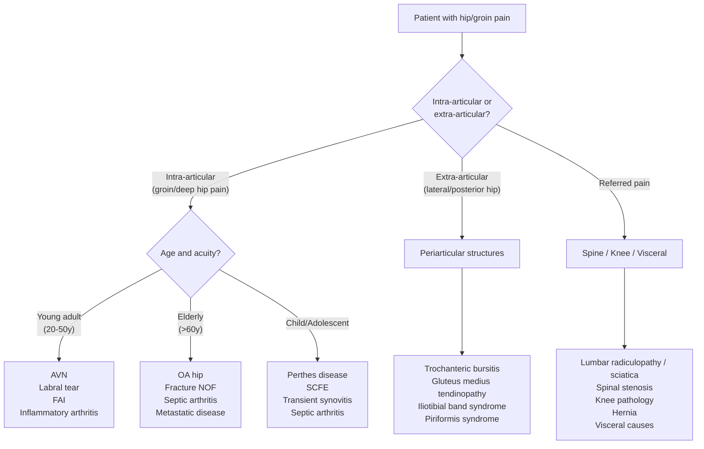

## Differential Diagnosis of AVN of the Hip

When a patient walks into clinic with **hip pain**, you need a systematic framework. The learning outcome from the lecture is clear: ***Formulate differential diagnosis for patients with hip pain*** [1]. AVN is just one cause of hip pain — and conversely, a patient you *think* has AVN may actually have something else entirely. Let's work through this logically.

### Approach to the Differential Diagnosis

The key principle is to think **anatomically** — where is the pain coming from? — and then **by pathological process** (degenerative, inflammatory, infective, traumatic, neoplastic, referred).

Remember two golden rules:
1. ***Pain can be referred to the knee from other sites, most notably the ipsilateral hip. Every patient with knee pain should have a careful examination of the hip*** [5] — and vice versa.
2. Hip pain that is actually **referred from the lumbar spine** (L2-4 dermatomes overlap with the hip region) is extremely common and must always be considered.

### Systematic Differential Diagnosis Framework

---

### Detailed Differential Diagnoses

#### A. Intra-articular Causes (Groin / Deep Hip Pain)

##### 1. Osteoarthritis of the Hip

This is the **most common cause of chronic hip pain** in the elderly and the condition AVN most closely mimics (and eventually becomes).

- ***Secondary OA hip is more common in Chinese population*** [2] — ***primary/idiopathic OA is uncommon in Chinese population*** [1]
- ***Secondary causes include: trauma, infection, inflammatory joint diseases (e.g. RA), crystal deposition diseases (e.g. gout), neuropathic (e.g. Charcot joint), metabolic/endocrine*** [1]
- **How to distinguish from AVN**: OA is typically in patients > 60 years with gradual onset. X-ray shows the classic **LOSS** features (***Loss of joint space, Osteophytes, Subchondral sclerosis, Subchondral cysts***) [4]. AVN in early stages shows sclerosis and crescent sign *without* osteophytes or joint space narrowing — the femoral head shape changes *before* the joint space narrows. In late-stage AVN (Ficat IV), however, it looks identical to secondary OA.
- ***Clinical features***: Hip pain radiating to knee, aggravated by weight-bearing and improved with rest, morning stiffness, externally rotated limb, antalgic gait, end-stage fixed flexion deformity with Trendelenburg gait [2]
- ***DDx of OA hip itself includes: fractures, sciatica, trochanteric bursitis, gluteus medius tendinopathy*** [2]

<Callout title="Key Distinguishing Point">
**AVN vs Primary OA**: AVN typically affects **younger patients (20–50y)** with identifiable risk factors (steroids, alcohol, SLE, trauma). Primary OA affects **older patients (> 60y)**. On X-ray, AVN shows femoral head changes (sclerosis, crescent sign, collapse) with *initially preserved joint space*, while OA shows joint space narrowing as the earliest feature. MRI with the **double line sign** is pathognomonic for AVN.
</Callout>

##### 2. Fracture Neck of Femur (#NOF)

- A critical diagnosis not to miss, especially in the elderly after a fall
- **Why it mimics AVN**: Both cause groin pain worsened by internal rotation. However, #NOF is **acute onset** after trauma (or insidious in stress/insufficiency fractures), while AVN is insidious
- ***Clinical features***: Pain in groin/thigh or referred to knee, exacerbated by **internal rotation** (most sensitive) and axial loading; ***shortened, abducted and externally rotated leg*** [3]
- ***X-ray***: ***Disrupted Shenton's line***, fracture line visible [3]
- **The link**: Displaced intracapsular #NOF (***Garden III/IV***) carries a ***> 95% risk of AVN*** due to disruption of the MCFA [3] — so #NOF is both a differential diagnosis AND a cause of AVN
- ***Intracapsular fractures carry high AVN risk; extracapsular fractures carry low AVN risk*** [3]

##### 3. Septic Arthritis of the Hip

An **orthopaedic emergency** — if you miss this, the joint is destroyed.

- **Why it mimics AVN**: Both cause hip pain with reduced ROM. However, septic arthritis is **acute** with systemic features (fever, malaise)
- ***Investigations***: ***WBC, CRP, ESR, image-guided hip aspiration (cell count, Gram smear, bacterial/fungal/AFB cultures, ± crystals), blood cultures, imaging*** [1]
- ***Imaging***: ***X-rays may show soft-tissue swelling or hip joint capsular distension (with widening of the joint space or even subluxation); radiographic changes in the proximal femoral metaphysis suggest osteomyelitis. MRI may be the most useful test to distinguish proximal femoral osteomyelitis from septic arthritis of the hip. Radioisotope scan*** [1]
- ***Treatment***: ***Antibiotics AFTER joint fluid/synovium are obtained for culture unless haemodynamic instability. Early initiation of antibiotics before obtaining specimens has risk of negative culture → affects antibiotic regime. Surgical drainage — anterior approach in young to preserve blood supply; posterior approach when hip destruction not salvageable and replacement needed. Surgical drainage with antibiotic cement spacer*** [1]
- **The link**: Septic arthritis can itself cause AVN (elevated intra-articular pressure compresses retinacular vessels; bacterial toxins damage endothelium → thrombosis)

| Feature | AVN | Septic Arthritis |
|:---|:---|:---|
| Onset | Insidious | Acute (hours to days) |
| Fever | Absent | Present (often high-grade) |
| CRP/ESR/WBC | Normal (unless underlying cause) | Markedly elevated |
| Joint aspirate | Non-inflammatory | Purulent (WCC > 50,000, > 75% PMN) |
| X-ray | Sclerosis, crescent sign | Soft tissue swelling, joint space widening |

##### 4. Inflammatory Arthritis (RA, SLE, Ankylosing Spondylitis)

- **Rheumatoid arthritis**: Rarely presents as isolated hip involvement, but can cause hip synovitis. Morning stiffness > 60 minutes, polyarticular, symmetrical. X-ray shows periarticular osteopenia and erosions (not sclerosis/crescent sign).
- **Ankylosing spondylitis (AS)**: Young men with inflammatory back pain, sacroiliac joint involvement. Hip involvement occurs in ~30%. X-ray may show SI joint fusion. Distinguished from AVN by the systemic inflammatory features, HLA-B27 positivity, and distinct radiological pattern.
- **SLE**: Important because SLE patients get AVN from both the disease itself (vasculitis, antiphospholipid antibodies) AND steroid treatment. A lupus patient with hip pain may have lupus arthritis OR AVN — MRI is essential to differentiate.
- ***Crystal deposition diseases (e.g. gout)*** [1]: Can cause acute monoarthritis of the hip. Distinguished by joint aspiration showing crystals (negatively birefringent monosodium urate for gout, positively birefringent calcium pyrophosphate for pseudogout).

##### 5. Femoroacetabular Impingement (FAI)

- **Definition**: Abnormal morphology of the femoral head-neck junction (cam type) or acetabulum (pincer type) causes abnormal contact during hip motion → labral damage → cartilage wear → secondary OA
- **Why it mimics AVN**: Both affect young adults with groin pain and limited internal rotation. However, FAI pain is characteristically **activity-related** (especially with flexion and internal rotation activities like squatting) and **C-sign** positive (patient cups their hand over the anterolateral hip)
- **Distinguished by**: MRI/MR arthrography showing labral tears and bony morphology; no marrow signal changes typical of AVN

##### 6. Labral Tear of the Hip

- Often coexists with FAI
- Mechanical symptoms: clicking, catching, locking
- Pain with specific provocative tests (FADIR — Flexion, ADduction, Internal Rotation)
- MR arthrography is the gold standard

##### 7. Transient Osteoporosis of the Hip (Bone Marrow Oedema Syndrome)

- **Self-limiting** condition causing hip pain, typically in middle-aged men or women in the 3rd trimester of pregnancy
- **Why it's critical**: On MRI, it shows **diffuse bone marrow oedema** of the femoral head — this can look very similar to early AVN (Ficat I). However, transient osteoporosis has **no double line sign** and **resolves spontaneously** within 6–12 months
- X-ray may show diffuse osteopenia of the femoral head
- Some consider it a precursor or early form of AVN — the distinction matters because management differs dramatically

<Callout title="Exam Trap" type="error">
**Transient osteoporosis vs Early AVN on MRI**: Both show bone marrow oedema. The key differentiator is the **double line sign on T2W MRI** — present in AVN, absent in transient osteoporosis. Transient osteoporosis also shows **diffuse** oedema throughout the femoral head (not focal), and resolves on serial imaging.
</Callout>

##### 8. Hip Dislocation

- ***Posterior dislocation (90%)***: ***dashboard injury (flexed hip & knee against dashboard in RTA); shortened limb that is adducted, internally rotated and flexed; associated injuries include fracture (femoral head, NOF), sciatic nerve injury; complications include AVN (fracture-dislocation highest risk)*** [6]
- Acute presentation — should not be confused with chronic AVN, but posterior dislocation is a *cause* of subsequent AVN (10–25% risk) [1]

#### B. Paediatric Differentials (Age-Specific)

If the patient is a child or adolescent, the differential changes entirely:

##### 9. Perthes Disease (Legg-Calvé-Perthes Disease)

- ***Idiopathic AVN of proximal femoral epiphysis in children*** [7]
- ***Boys aged 5–10 years*** [7]
- ***Hip pain, loss of internal rotation and abduction*** [7]
- ***X-ray: medial joint space widening, crescent sign*** [7]
- Essentially the paediatric equivalent of adult AVN, but idiopathic

##### 10. Slipped Capital Femoral Epiphysis (SCFE)

- ***Obese boys aged 10–15 years*** [7]
- ***Hip pain that may radiate to knee, antalgic gait, loss of internal rotation, abduction, flexion*** [7]
- ***Complications: slipping at contralateral hip, AVN*** [7]
- Distinguished from AVN by age group, body habitus, and characteristic X-ray (posterior slip of epiphysis relative to metaphysis on frog-leg lateral view)

##### 11. Transient Synovitis (Irritable Hip)

- Most common cause of hip pain in children aged 3–10 years
- Self-limiting viral-associated synovitis
- Must be distinguished from **septic arthritis** (the critical differential) using Kocher criteria (fever, non-weight-bearing, ESR > 40, WCC > 12,000)

#### C. Extra-articular / Periarticular Causes

##### 12. Trochanteric Bursitis / Greater Trochanteric Pain Syndrome

- ***Listed as DDx of OA hip*** [2]
- Inflammation of the bursa overlying the greater trochanter
- **Lateral hip pain** (not groin pain — this is the key distinguishing feature from AVN)
- Tender over the greater trochanter on palpation
- Pain reproduced by resisted hip abduction or lying on the affected side

##### 13. Gluteus Medius Tendinopathy / Tear

- ***Listed as DDx of OA hip*** [2]
- "Rotator cuff of the hip" — degenerative tendinopathy of the gluteus medius insertion at the greater trochanter
- Lateral hip pain, Trendelenburg sign positive if complete tear
- Distinguished from AVN by location of pain (lateral vs groin) and MRI findings

##### 14. Iliotibial Band Syndrome

- Lateral hip/thigh pain, especially in runners
- Snapping sensation over the greater trochanter
- Distinguished by clinical history and examination

##### 15. Piriformis Syndrome

- Deep buttock pain with possible sciatic nerve irritation (the sciatic nerve runs deep to or through the piriformis muscle)
- Pain on internal rotation and sitting
- Distinguished from AVN by the posterior/buttock location and neural symptoms

#### D. Referred Pain

##### 16. Lumbar Spine Pathology (Sciatica / Radiculopathy)

- ***Sciatica: radiculopathy (nerve root compression) at L5–S1 from a herniated (prolapsed) disc; pain, numbness, tingling in the distribution of sciatic nerve; sharp or burning pain that radiates down the posterior or lateral aspect of leg usually to foot or ankle*** [8]
- L2-4 radiculopathy can refer pain to the groin and anterior thigh, mimicking hip pathology
- Distinguished by: dermatomal distribution of pain/numbness, positive straight leg raise, lumbar spine tenderness, neurological signs (weakness, reflex changes)
- ***Differential diagnosis of back pain includes: spondylosis, prolapsed disc, spinal stenosis, cauda equina syndrome, muscle strain, fractures, infection (TB spine), tumour, inflammation (AS), extra-spinal causes*** [9]

##### 17. Knee Pathology Referring to Hip

- Less common direction of referral, but possible via shared femoral/obturator nerve innervation

##### 18. Visceral / Non-Musculoskeletal Causes

- **Inguinal hernia**: Groin pain worsened by Valsalva; palpable lump
- **Nephrolithiasis/pyelonephritis**: Flank → groin radiation, haematuria, fever
- **Gynaecological**: Ovarian cyst, endometriosis, ectopic pregnancy in women
- **Vascular**: Femoral artery aneurysm, iliac artery occlusion (claudication)

#### E. Neoplastic Causes

##### 19. Bone Tumours

- **Primary**: Osteosarcoma (adolescents/young adults — metaphysis of long bones), Ewing's sarcoma, chondrosarcoma
- **Secondary (metastatic)**: Lung, breast, prostate, renal, thyroid — common in elderly; lytic or blastic lesions on X-ray; night pain, weight loss, pathological fracture
- Distinguished from AVN by: constitutional symptoms, destructive/permeative pattern on imaging, soft tissue mass on MRI, raised tumour markers

##### 20. Developmental Dysplasia of the Hip (DDH)

- ***Abnormal development of hip resulting in dysplasia (shallow acetabulum), subluxation, or dislocation*** [10]
- In adults, untreated DDH → secondary OA (from abnormal loading due to inadequate acetabular coverage)
- ***Management includes periacetabular osteotomy (symptomatic dysplasia in young adult with concentrically reduced hip and congruent joint space, before OA changes) or total hip replacement (secondary OA changes, hip subluxation)*** [1]
- Distinguished from AVN by: history (childhood hip problems, clicking hip), X-ray showing acetabular dysplasia rather than femoral head necrosis

---

### Summary Comparison Table: Key Differentials of AVN

| Condition | Typical Patient | Pain Location | Key Investigation Finding | Distinguishing Feature |
|:---|:---|:---|:---|:---|
| **AVN** | 20–50y, steroid/alcohol use | Groin, referred to knee | MRI: double line sign; XR: crescent sign | Risk factors, femoral head changes with preserved joint space early |
| **OA hip** | > 60y | Groin, referred to knee | XR: LOSS features | Osteophytes, joint space narrowing as earliest change |
| **#NOF** | Elderly post-fall | Groin | XR: disrupted Shenton's line | Acute trauma, shortened/externally rotated leg |
| **Septic arthritis** | Any age, immunocompromised | Groin, severe | Aspirate: WCC > 50,000 | Fever, acute onset, hot swollen joint |
| **FAI** | Young active adult | Groin, C-sign | MRI: labral tear, cam/pincer morphology | Activity-related, clicking, FADIR positive |
| **Transient osteoporosis** | Middle-aged male, 3rd trimester | Groin | MRI: diffuse oedema, NO double line sign | Self-limiting, resolves in 6–12 months |
| **Trochanteric bursitis** | Middle-aged, runners | Lateral hip | Clinical diagnosis, USG/MRI if needed | LATERAL pain, NOT groin pain |
| **Lumbar radiculopathy** | Any age | Buttock → leg | MRI spine: disc herniation | Dermatomal, positive SLR, neurological signs |
| **Perthes disease** | Boys 5–10y | Groin, knee referral | XR: medial joint widening, crescent sign | Paediatric, idiopathic |
| **SCFE** | Obese boys 10–15y | Groin, knee referral | XR frog-leg lateral: epiphyseal slip | Obligate external rotation on hip flexion |

---

<Callout title="High Yield Summary">

1. **Systematic approach**: Think intra-articular (degenerative, inflammatory, infective, vascular/AVN, traumatic) vs extra-articular (periarticular soft tissue) vs referred (spine, knee, visceral).

2. **AVN vs OA hip**: AVN is younger (20–50y) with risk factors; early X-ray shows sclerosis/crescent sign with preserved joint space. OA is older (> 60y) with joint space narrowing as earliest feature.

3. **Never miss septic arthritis**: Acute onset, fever, raised inflammatory markers, purulent aspirate. It's an emergency.

4. **Transient osteoporosis vs early AVN**: Both show MRI marrow oedema, but AVN has the double line sign and transient osteoporosis resolves spontaneously.

5. **Always examine the hip in knee pain** and vice versa — shared innervation via femoral and obturator nerves.

6. **Paediatric differentials are age-specific**: Perthes (5–10y), SCFE (10–15y), transient synovitis (3–10y), septic arthritis (any age — emergency).

7. **OA hip in Chinese patients is usually secondary** (trauma, AVN, infection, inflammatory, DDH) — primary OA is uncommon in Chinese populations.

</Callout>

---

<ActiveRecallQuiz
  title="Active Recall - Differential Diagnosis of AVN of Hip"
  items={[
    {
      question: "A 45-year-old man on long-term prednisolone for SLE presents with insidious right groin pain. X-ray shows sclerosis of the femoral head with preserved joint space. What is the most likely diagnosis and how do you confirm it?",
      markscheme: "AVN of the hip. Confirm with MRI showing the double line sign on T2-weighted imaging (outer dark sclerotic line, inner bright granulation tissue line). Also image contralateral hip as 40-80% bilateral in non-traumatic AVN."
    },
    {
      question: "List 4 key features that distinguish septic arthritis of the hip from AVN of the hip.",
      markscheme: "1. Acute onset (hours-days) vs insidious. 2. Systemic features - fever, malaise vs afebrile. 3. Raised inflammatory markers (WBC, CRP, ESR) vs normal. 4. Joint aspirate purulent with WCC > 50,000 and >75% PMN vs non-inflammatory aspirate. 5. X-ray shows soft tissue swelling and joint space widening (effusion) vs sclerosis and crescent sign."
    },
    {
      question: "A 7-year-old boy presents with a limp and right hip pain with loss of internal rotation and abduction. What is the most likely diagnosis and what X-ray finding would you expect?",
      markscheme: "Perthes disease (Legg-Calve-Perthes disease) - idiopathic AVN of the proximal femoral epiphysis. X-ray: medial joint space widening (earliest), crescent sign, sclerosis and fragmentation of the femoral capital epiphysis, femoral head flattening."
    },
    {
      question: "How do you distinguish transient osteoporosis of the hip from early (Ficat stage I) AVN on MRI?",
      markscheme: "Both show bone marrow oedema on MRI. Key differences: 1. AVN shows the double line sign on T2W (pathognomonic) - absent in transient osteoporosis. 2. Transient osteoporosis shows diffuse oedema throughout the femoral head, while AVN is focal. 3. Transient osteoporosis resolves spontaneously within 6-12 months on serial imaging."
    },
    {
      question: "Why must you always examine the hip in a patient presenting with isolated knee pain?",
      markscheme: "Hip and knee share innervation via the femoral and obturator nerves (L2-4). By Hilton's law, nerves supplying a joint also supply muscles moving it and overlying skin. Hip pathology (AVN, OA, fracture) can present as referred knee pain due to convergence of sensory fibres at the spinal cord level. Missing this leads to delayed diagnosis."
    },
    {
      question: "A patient has lateral hip pain worse when lying on that side, with tenderness over the greater trochanter. Internal rotation of the hip is painless. What is the likely diagnosis and why does this exclude AVN?",
      markscheme: "Greater trochanteric pain syndrome (trochanteric bursitis or gluteus medius tendinopathy). This excludes AVN because: 1. Pain is lateral, not in the groin (AVN causes groin/deep hip pain). 2. Internal rotation is painless (AVN characteristically causes pain on internal rotation as it compresses the superolateral necrotic zone). 3. Tenderness is over the greater trochanter, not deep in the joint."
    }
  ]}
/>

## References

[1] Lecture slides: GC 229. Hip Arthritis (1).pdf (p2, p14, p32, p51, p53, p54, p81)
[2] Senior notes: maxim.md (section 6.3 — OA hip, DDx)
[3] Senior notes: maxim.md (section 6.2 — #NOF, Garden classification)
[4] Senior notes: maxim.md (section 9.1 — OA radiological features LOSS)
[5] Lecture slides: GC 228. Knee Osteoarthritis_Part A (1).pdf (p27)
[6] Senior notes: maxim.md (section — Hip dislocation)
[7] Senior notes: maxim.md (section — Perthes disease, SCFE)
[8] Senior notes: felixlai.md (section — Differential diagnosis of intermittent claudication)
[9] Senior notes: maxim.md (section 2.3 — Approach to spine diseases, DDx of back pain)
[10] Senior notes: maxim.md (section 11.1 — Developmental dysplasia of hip)
