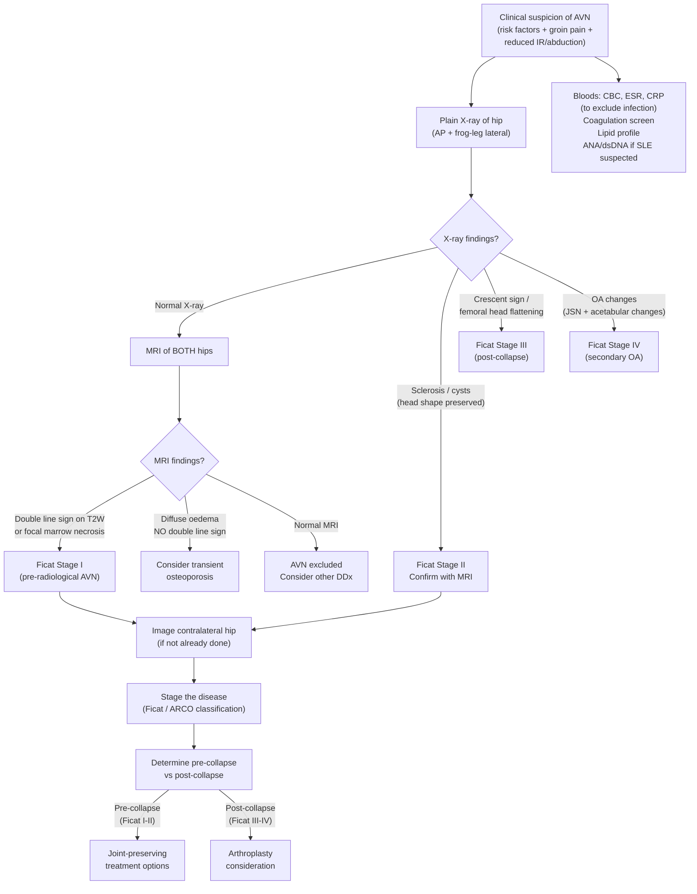
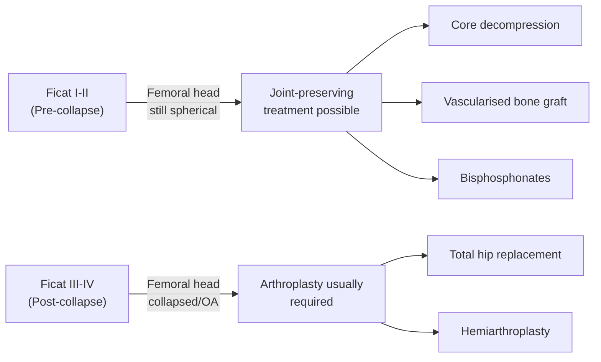

## Diagnosis of AVN of the Hip: Criteria, Algorithm, and Investigations

### Diagnostic Principles

There is no single "diagnostic criterion" for AVN the way you have, say, the Jones criteria for rheumatic fever. Instead, the diagnosis rests on a **triad**:

1. **Clinical suspicion** — the right patient (risk factors) with the right symptoms (insidious groin pain, reduced internal rotation)
2. **Imaging confirmation** — primarily MRI (gold standard) and plain radiography
3. **Exclusion of mimics** — especially septic arthritis, transient osteoporosis, occult fracture, and tumour

The key learning outcome from the lecture: ***Recognize radiological features of common hip disorders*** [1]. This is fundamentally an imaging-based diagnosis.

---

### Clinical Assessment: What to Ask and Why

Before jumping to imaging, a thorough history and examination directs you toward the diagnosis. The lecture emphasises a structured history [1]:

***History:*** [1]
- ***Etiology***: ***Trauma, nature of work, drug / alcohol***
- ***Function***: ***Walking (level ground / stairs), sitting tolerance, limp, shoes and socks, cutting toe nails, getting on and off public transport***
- ***Harris Hip Score*** — a validated functional outcome score

Let me explain why each of these matters:

| History Element | Rationale |
|:---|:---|
| **Trauma** | Femoral neck fracture (15–50% AVN risk) or hip dislocation (10–25%) [1] |
| **Nature of work** | Caisson disease in divers/tunnel workers; heavy manual labour worsens symptoms |
| **Drug history** | ***Steroid > 20 mg/day increases risk*** [1]; immunosuppressants for transplant |
| **Alcohol** | ***Alcohol abuse*** [1]; amount similar to that causing cirrhosis [2] |
| **SLE / autoimmune disease** | Double hit: disease + steroids [2] |
| **Sickle cell disease** | ***Sickle cell anaemia*** — microvascular occlusion [1] |
| **Functional assessment** | Guides treatment urgency and choice; the lecture case: ***22-year-old male, left hip stiffness for 3 years, walking tolerance 30 minutes with stick, limping, difficulty sitting in normal chair, shoes and socks cannot manage, minimal hip pain or back pain*** [1] — notice this patient has severe functional limitation despite "minimal pain" |

> **The Harris Hip Score** is a clinician-administered tool scoring **pain** (44 points), **function** (47 points: gait + activities), **deformity** (4 points), and **range of motion** (5 points), out of 100. Score < 70 = poor outcome, indicating need for intervention. It's used to track disease progression and compare pre/post-operative outcomes.

<Callout title="Clinical Pearl" type="idea">
The lecture case illustrates a crucial point: a young patient with AVN may present with **stiffness and functional limitation as the primary complaint**, with only minimal pain. Don't wait for severe pain to investigate — functional impairment alone should trigger imaging.
</Callout>

---

### Diagnostic Algorithm

Here is the systematic approach from clinical suspicion through to staging:

---

### Investigation Modalities

#### 1. Plain Radiography (X-ray)

**Always the first-line investigation.** Get ***AP and lateral (frog-leg lateral) X-ray of the hip*** [3].

The frog-leg lateral view is particularly important because the **anterolateral femoral head** (the most commonly affected zone) is better visualised when the hip is abducted and externally rotated.

***X-ray findings in AVN*** [1]:

| Finding | Pathological Explanation | Ficat Stage |
|:---|:---|:---|
| **Normal** | Bone necrosis has occurred but no structural change yet — necrotic bone looks the same as live bone on X-ray because the mineral content is unchanged | ***Stage I (pre-radiological, only changes on MRI)*** [1] |
| ***Cyst (radiolucent areas)*** | ***Resorption of dead bone + replacement with fibrous and granulation tissue*** [1] — osteoclasts remove dead trabeculae, replaced by non-mineralised tissue | Stage II |
| ***Sclerosis (radiodense areas)*** | ***Thickened trabeculae due to direct deposition of new bone onto dead bone*** [1] — "creeping substitution" where new bone is appositionally laid on necrotic trabeculae, making them appear denser | Stage II |
| ***Crescent sign*** | ***Subchondral collapse of the necrotic segment*** [1] — a thin lucent line just beneath the subchondral plate representing a fracture through the zone of weakened, resorbed bone. Best seen on the **frog-leg lateral view** | Stage III |
| **Femoral head flattening** | Progression of subchondral collapse → loss of spherical contour | Stage III |
| **Secondary OA changes** | Joint space narrowing, osteophytes, acetabular sclerosis/cysts — once the head collapses and becomes non-spherical, abnormal loading destroys cartilage on both sides | Stage IV |

<Callout title="Understanding the X-ray Progression">
Think of it as a **timeline**: Dead bone initially looks normal on X-ray (Stage I) → repair process creates mixed areas of resorption (cysts) and new bone deposition (sclerosis) (Stage II) → the weakened subchondral zone fractures (crescent sign, Stage III) → the head collapses and OA develops (Stage IV). The X-ray findings reflect the **biological repair process**, not just the necrosis itself.
</Callout>

**Key radiological features to report systematically** [1]:
- **Femoral head**: Shape (spherical or flattened?), density (sclerosis? cysts?), subchondral lucency (crescent sign?)
- **Joint space**: Preserved or narrowed?
- **Acetabulum**: Normal or sclerotic/cystic (indicating secondary OA)?
- **Shenton's line**: Intact? (disrupted in fractures)
- **Comparison with contralateral side**: Essential

<Callout title="Exam Tip" type="error">
**A normal X-ray does NOT exclude AVN.** In Ficat Stage I, the X-ray is completely normal despite active bone necrosis. If you have high clinical suspicion (young patient with steroid/alcohol use and groin pain), proceed to MRI even if the X-ray looks fine. This is one of the most important teaching points.
</Callout>

---

#### 2. MRI — The Gold Standard

***MRI has 99% sensitivity and specificity*** [1] for AVN. It is the single most important investigation.

**Why is MRI so much better than X-ray?**
- MRI detects **marrow changes** (oedema, necrosis, granulation tissue) long before any structural bone change occurs
- X-ray only shows structural changes in mineral density — necrotic bone has the same mineral content as viable bone until the repair process alters it
- MRI can detect AVN **weeks to months** before X-ray changes appear

**Key MRI sequences and findings:**

| Sequence | Finding in AVN | Explanation |
|:---|:---|:---|
| **T1-weighted** | **Low signal band** in the femoral head (geographic, well-demarcated) | Fat in normal marrow gives high T1 signal. Necrotic marrow loses its fat signal → low T1. The reactive interface between viable and necrotic bone appears as a low-signal line. |
| **T2-weighted** | ***Double line sign*** [2] — **pathognomonic** | The outer line is **low signal** (dark) = sclerotic reactive bone. The inner line is **high signal** (bright) = granulation tissue with hypervascularity and oedema at the interface between viable and necrotic bone. This double line represents the body's repair front. |
| **STIR / Fat-suppressed T2** | Bone marrow oedema (high signal) | Oedema in and around the necrotic zone; helps detect early disease and assess activity of the repair process |
| **T1 with gadolinium** | Enhancement of the reactive zone, non-enhancement of necrotic core | Viable tissue enhances (has blood supply); necrotic tissue does not (no blood supply). This can help distinguish viable from non-viable bone for surgical planning. |

***Ficat Stage I is pre-radiological — only changes on MRI*** [1]. This is precisely why MRI is indispensable.

***MRI of contralateral hip*** [1] — always performed because:
- **40–80% of non-traumatic AVN** is bilateral
- The contralateral hip may be asymptomatic but already have MRI-detectable disease
- Early detection of contralateral disease changes management (may allow joint-preserving treatment before collapse occurs)

**How to interpret the MRI systematically:**

1. **Location of necrosis**: Usually **anterolateral superolateral** femoral head (weight-bearing dome) — this is the watershed zone with the most tenuous blood supply
2. **Extent of necrosis**: Quantify as percentage of femoral head involved
   - < 15% (A) — good prognosis
   - 15–30% (B) — intermediate
   - \> 30% (C) — poor prognosis, high collapse risk
3. **Double line sign**: Present? → Confirms AVN
4. **Subchondral fracture**: Low signal line just beneath the articular surface on T1 → Stage III
5. **Femoral head contour**: Spherical or flattened?
6. **Joint space / acetabular changes**: Evidence of secondary OA?
7. **Contralateral hip**: Any signal abnormality?

---

#### 3. Bone Scintigraphy (Technetium-99m Bone Scan)

- **Role**: Largely superseded by MRI but still occasionally used
- **Early AVN**: Shows a **"cold spot"** (decreased uptake) in the femoral head — the necrotic bone has no blood supply, so the radiotracer cannot reach it
- **Later AVN (repair phase)**: Shows **"hot spot"** (increased uptake) — revascularisation and new bone formation take up the tracer avidly
- **"Doughnut sign"**: Central cold area (necrosis) surrounded by a peripheral hot rim (reactive repair zone) — relatively specific for AVN
- **Limitations**: Lower spatial resolution than MRI, cannot quantify necrotic volume, cannot detect the double line sign, higher radiation dose
- **Advantage**: Can screen multiple joints simultaneously (useful if multi-focal AVN suspected, e.g., in sickle cell disease)

---

#### 4. CT Scan

- **Role**: Supplementary; not first-line for diagnosis
- **Strengths**: 
  - Excellent for detecting the **crescent sign** (subchondral fracture) — sometimes better than plain X-ray
  - Detailed assessment of **femoral head contour** and degree of collapse
  - Useful for **pre-operative planning** (quantifying collapse, assessing bone stock)
- **Limitations**: Does not detect early marrow changes (Stage I); involves radiation; soft tissue contrast inferior to MRI

---

#### 5. Laboratory Investigations

Bloods are not used to diagnose AVN directly, but are essential to:
- **Exclude differentials** (especially septic arthritis)
- **Identify the underlying cause** of non-traumatic AVN
- **Pre-operative assessment** if surgery is planned

| Investigation | Purpose | Expected Findings in AVN |
|:---|:---|:---|
| **CBC** | Exclude infection, screen for sickle cell | Normal (unless underlying cause, e.g., sickle cell: low Hb, reticulocytosis) |
| ***ESR, CRP*** [1] | Exclude infection/inflammation | Normal in AVN; elevated in septic arthritis or inflammatory arthritis |
| ***WBC*** [1] | Exclude infection | Normal; elevated in septic arthritis |
| **Coagulation screen** | Screen for thrombophilia | May be abnormal in antiphospholipid syndrome, Factor V Leiden |
| **Lipid profile** | Identify hyperlipidaemia as risk factor | May show hypercholesterolaemia/hypertriglyceridaemia |
| **ANA, anti-dsDNA, complement** | Screen for SLE | Positive in SLE |
| **Antiphospholipid antibodies** | Thrombophilia screen in SLE/unexplained AVN | Positive in antiphospholipid syndrome |
| **Haemoglobin electrophoresis** | Screen for sickle cell disease / thalassaemia | Hb SS in sickle cell disease |
| **LFTs, GGT** | Assess for alcohol-related liver disease | May show elevated GGT (marker of chronic alcohol use) |
| **Uric acid** | Exclude gout if crystal arthritis in differential | Elevated in gout |

**For septic arthritis workup** (when it's in the differential) [1]:
- ***Image-guided hip aspiration: cell count, Gram smear, bacterial/fungal/AFB cultures, ± crystals*** [1]
- ***Blood cultures*** [1]

---

#### 6. Hip Aspiration (Arthrocentesis)

- **Not routinely done for AVN** but essential when **septic arthritis** is in the differential
- Under fluoroscopic or ultrasound guidance
- **Normal synovial fluid**: Clear, viscous, WCC < 200/µL
- **AVN**: Synovial fluid is typically **non-inflammatory** (WCC < 2,000/µL)
- **Septic arthritis**: Purulent, WCC > 50,000/µL, > 75% PMN, positive Gram stain/culture

---

### The Ficat Classification: Integrating Clinical, Radiological, and MRI Findings

***The Ficat classification combines plain XR, MRI, bone scan, and clinical features to guide treatment and prognosis*** [2].

This is the classification that **drives management decisions**, so understanding it in detail is critical:

***Classification and treatment*** [1]:

| ***Ficat Stage*** | ***Criteria*** | ***Imaging Details*** | ***Treatment*** [1] |
|:---|:---|:---|:---|
| ***I*** | ***Normal X-ray; only changes on MRI*** [1] | MRI: double line sign, marrow oedema. Bone scan: cold spot or doughnut sign. X-ray: normal or subtle osteopenia. | ***Core decompression*** |
| ***II*** | ***Sclerotic or cystic lesions on X-ray; femoral head shape preserved*** | X-ray: sclerosis (new bone on dead bone) and/or cysts (resorbed bone replaced by fibrous tissue). No crescent sign. No flattening. MRI: well-defined necrotic zone. | ***Core decompression / vascularised bone graft*** |
| ***III*** | ***Subchondral collapse (crescent sign) on X-ray*** | X-ray: crescent sign (subchondral lucency), ± femoral head flattening. Head has begun to lose spherical shape. | ***Vascularised bone graft / THR*** |
| ***IV*** | ***OA changes*** | X-ray: femoral head collapse + joint space narrowing + acetabular changes (sclerosis, cysts, osteophytes) — secondary OA. | ***THR*** |

**The Critical Division: Pre-collapse vs Post-collapse**

<Callout title="Why Does This Classification Matter So Much?">
Once the femoral head collapses (Ficat III), the spherical joint surface is permanently lost. No amount of bone grafting or decompression can restore it. The only option is to replace the joint. This is why early detection (MRI in high-risk patients) is so important — catching AVN in Ficat I or II gives you a window for joint-preserving treatment.
</Callout>

---

### ARCO Classification (Modern International Standard)

The Association Research Circulation Osseous (ARCO) classification is more detailed and increasingly used in research:

| ARCO Stage | Sub-stage | Definition | Imaging |
|:---|:---|:---|:---|
| **0** | — | All imaging normal; only histological necrosis on biopsy | Normal XR, MRI, bone scan |
| **I** | IA: < 15%, IB: 15–30%, IC: > 30% | XR normal; MRI or bone scan positive | MRI: marrow changes, double line sign |
| **II** | IIA/B/C (same size criteria) | XR abnormal but head shape preserved | XR: sclerosis, cysts; NO crescent sign |
| **III** | IIIA/B/C | Subchondral fracture ± early collapse | Crescent sign; measure depression in mm |
| **IV** | — | Secondary OA | Joint space narrowing, acetabular involvement |

The **sub-staging by size** (A/B/C) is important because necrotic lesion size is the **strongest predictor of collapse**:
- < 15% involvement → low risk of collapse → may not need surgery
- \> 30% involvement → high risk of collapse → more aggressive treatment warranted

---

### Quantifying Necrotic Extent on MRI

Several methods exist to estimate the percentage of femoral head involvement:

1. **Modified Kerboul angle**: Measured on both mid-coronal and mid-sagittal MRI slices. The arc of necrosis is measured on each view and summed:
   - Combined angle < 200° → low risk of collapse
   - Combined angle 200–250° → intermediate
   - Combined angle > 250° → high risk of collapse

2. **Percentage of weight-bearing surface involved**: Estimated on coronal MRI
   - < 1/3 → favourable
   - \> 2/3 → unfavourable

These quantitative measures help predict prognosis and guide surgical decisions.

---

### Special Investigations in Specific Clinical Scenarios

| Scenario | Additional Investigation | Rationale |
|:---|:---|:---|
| Post-femoral neck fracture | Serial MRI at 6 weeks, 3 months, 1 year | Monitor for development of post-traumatic AVN |
| SLE patient on steroids | Baseline MRI of both hips at start of steroid therapy, then periodic screening | High-risk population; early detection |
| Sickle cell disease | Bone scan (multi-joint screening) ± MRI of symptomatic joints | Multi-focal AVN common |
| Unexplained AVN (no obvious risk factor) | Thrombophilia screen, lipid panel, haemoglobin electrophoresis | Identify occult cause |
| ***Suspected septic arthritis in differential*** | ***Image-guided hip aspiration: cell count, Gram smear, bacterial/fungal/AFB cultures, ± crystals; blood cultures*** [1] | ***Antibiotics AFTER obtaining specimens unless haemodynamically unstable*** [1] |

---

### Summary: Diagnostic Approach at a Glance

| Step | Action | Key Points |
|:---|:---|:---|
| **1. History** | Risk factors, functional assessment (Harris Hip Score) | ***Etiology: trauma, drug/alcohol; Function: walking, stairs, sitting, shoes/socks, transport*** [1] |
| **2. Examination** | ROM (especially IR, abduction), gait, Trendelenburg, Thomas' test | Internal rotation most sensitive; examine both hips and knees |
| **3. X-ray** | AP + frog-leg lateral of both hips | Look for sclerosis, cysts, crescent sign, head shape, joint space |
| **4. MRI** | If X-ray normal but clinical suspicion high; or to stage disease | ***99% sensitivity and specificity*** [1]; double line sign pathognomonic; always image contralateral hip |
| **5. Bloods** | ESR, CRP, WBC (exclude infection); cause-specific tests | Normal inflammatory markers in AVN |
| **6. Stage** | Ficat / ARCO classification | Pre-collapse (I–II) vs post-collapse (III–IV) determines management |

---

<Callout title="High Yield Summary">

1. **No formal "diagnostic criteria"** — diagnosis is clinical suspicion + imaging confirmation (primarily MRI).

2. **X-ray findings progress**: Normal → cysts (resorbed bone) + sclerosis (new bone on dead bone) → **crescent sign** (subchondral fracture) → femoral head collapse → secondary OA.

3. ***MRI is 99% sensitive and specific.*** **Double line sign on T2W** is pathognomonic. Always image the **contralateral hip**.

4. ***Ficat Stage I is pre-radiological — only changes on MRI.*** A normal X-ray does NOT exclude AVN.

5. **Ficat classification drives treatment**: Stage I–II (pre-collapse) → core decompression ± bone graft. Stage III–IV (post-collapse) → THR.

6. **Bloods** are normal in AVN but essential to exclude septic arthritis (ESR, CRP, WBC) and identify underlying causes (ANA, lipids, Hb electrophoresis, thrombophilia screen).

7. **Necrotic lesion size on MRI** (modified Kerboul angle or percentage) predicts collapse risk and guides surgical decision-making.

8. ***Harris Hip Score*** is used to quantify functional impact — essential for monitoring and surgical indication.

</Callout>

---

<ActiveRecallQuiz
  title="Active Recall - Diagnosis of AVN of Hip"
  items={[
    {
      question: "What are the three X-ray findings described in the lecture for AVN of the hip, and what does each represent pathologically?",
      markscheme: "1. Cyst: resorption of dead bone + replacement with fibrous and granulation tissue. 2. Sclerosis: thickened trabeculae due to direct deposition of new bone onto dead bone (creeping substitution). 3. Crescent sign: subchondral collapse of the necrotic segment (subchondral fracture)."
    },
    {
      question: "What is the sensitivity and specificity of MRI for AVN? Describe the pathognomonic MRI finding on T2-weighted imaging.",
      markscheme: "MRI has 99% sensitivity and specificity. The double line sign on T2W: outer dark (low signal) line represents sclerotic reactive bone; inner bright (high signal) line represents granulation tissue with hypervascularity at the interface between viable and necrotic bone."
    },
    {
      question: "A patient with risk factors for AVN has a normal hip X-ray. Should AVN be excluded? Explain with reference to the Ficat classification.",
      markscheme: "No. Ficat Stage I is pre-radiological - X-ray is normal but MRI shows changes (double line sign, marrow oedema). Necrotic bone has the same mineral density as viable bone, so X-ray cannot detect early AVN. MRI must be performed if clinical suspicion exists despite normal X-ray."
    },
    {
      question: "Outline the Ficat classification stages and the treatment indicated at each stage.",
      markscheme: "Stage I: Normal XR, MRI positive -> core decompression. Stage II: Sclerotic/cystic lesions, head shape preserved -> core decompression or vascularised bone graft. Stage III: Subchondral collapse (crescent sign) -> vascularised bone graft or THR. Stage IV: OA changes -> THR."
    },
    {
      question: "Why should you always image the contralateral hip when AVN is diagnosed?",
      markscheme: "40-80% of non-traumatic AVN cases have bilateral involvement. The contralateral hip may be asymptomatic but already have MRI-detectable disease (Ficat Stage I). Early detection allows joint-preserving treatment before collapse occurs."
    },
    {
      question: "List 4 blood investigations you would order when evaluating a patient with suspected AVN and explain the purpose of each.",
      markscheme: "1. ESR/CRP/WBC: exclude septic arthritis (normal in AVN, elevated in infection). 2. ANA/anti-dsDNA: screen for SLE as underlying cause. 3. Lipid profile: identify hyperlipidaemia as risk factor (fat emboli mechanism). 4. Haemoglobin electrophoresis: screen for sickle cell disease (microvascular occlusion). Others acceptable: coagulation/thrombophilia screen, LFTs/GGT for alcohol."
    }
  ]}
/>

## References

[1] Lecture slides: GC 229. Hip Arthritis (1).pdf (p2, p8, p14, p15, p16, p20, p51, p53, p85)
[2] Senior notes: maxim.md (section 6.4 — AVN of hip)
[3] Senior notes: maxim.md (section 6.2 — #NOF investigations)
