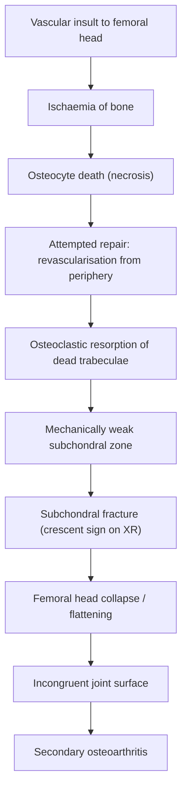

## Definition

Avascular necrosis (AVN) — also called osteonecrosis or aseptic necrosis — literally breaks down as: **"a-"** (without) + **"vascular"** (blood vessels) + **"necrosis"** (cell death). So the name tells you exactly what it is:

> **_Avascular necrosis is a result of impairment of circulation to the femoral head, subsequent bone death and repair — a bone disease_** [1]

More precisely, AVN is the **cellular death of bone components (osteocytes, marrow fat cells, haematopoietic cells)** due to interruption of blood supply to the femoral head [2]. The bone initially dies silently, then the body's attempted repair process paradoxically weakens the subchondral architecture, leading to **structural collapse** of the femoral head and, eventually, secondary osteoarthritis of the hip.

Think of it like this: the bone infarcts (just as myocardium infarcts in an MI), but unlike the heart, dead bone doesn't immediately cause symptoms. It's the _remodelling phase_ — where osteoclasts resorb dead bone faster than osteoblasts can lay down new bone — that causes the subchondral plate to crumble.

<Callout title="Key Concept">
  AVN is NOT just "dead bone." The real clinical problem is the **failed repair
  response**: revascularisation brings osteoclasts that resorb dead trabeculae,
  creating a mechanically weak zone under the articular cartilage.
  Weight-bearing then causes subchondral fracture and femoral head collapse. The
  articular cartilage itself is initially intact (it gets nutrition from
  synovial fluid), which is why early intervention can salvage the joint.
</Callout>

---

## Epidemiology

- **Incidence**: AVN accounts for approximately **10% of total hip replacements** performed worldwide. In the United States, ~10,000–20,000 new cases per year.
- **Age**: Typically affects **younger adults aged 20–50 years** — this is critical because it means these patients have decades of life ahead needing a functioning hip, making joint-preserving strategies important.
- **Sex**: Male > Female (~3–4:1), largely reflecting the higher prevalence of alcohol abuse and traumatic causes in men.
- **Bilateral involvement**: Up to **40–80%** of non-traumatic AVN cases eventually develop contralateral disease — this is why **MRI of the contralateral hip is recommended** [2].
- **_In Hong Kong / Chinese populations_**: The major non-traumatic causes are **corticosteroid use** (e.g., for SLE, nephrotic syndrome, organ transplant recipients) and **alcohol abuse**. The widespread use of traditional Chinese medicine preparations sometimes containing hidden steroids is a recognised risk. Post-traumatic AVN following femoral neck fractures is also very common in the elderly population.

<Callout title="Hong Kong Context" type="idea">
  SLE is relatively more common in Chinese women, and these patients often
  require prolonged corticosteroid therapy — making steroid-induced AVN a
  particularly relevant problem in Hong Kong's rheumatology and orthopaedic
  clinics.
</Callout>

---

## Anatomy and Blood Supply of the Femoral Head

Understanding the blood supply is absolutely fundamental to understanding why AVN happens where it does.

### Arterial Supply (Retrograde)

The femoral head has a **tenuous, predominantly retrograde blood supply** — blood travels "backwards" along the femoral neck to reach the head. This makes it inherently vulnerable [2][3]:

1. **Medial circumflex femoral artery (MCFA)** — **_the main blood supply_** to the femoral head
   - Arises from the profunda femoris (deep femoral) artery
   - Gives off **superior retinacular arteries** that run along the posterosuperior femoral neck, under the capsule, to penetrate the femoral head
   - **This is the artery disrupted in displaced femoral neck fractures** (Garden III/IV), explaining the very high AVN rate (> 95%) in these fractures [3]

2. **Lateral circumflex femoral artery (LCFA)**
   - Also from profunda femoris
   - Gives off **inferior retinacular arteries** — minor contribution

3. **Artery of the ligamentum teres** (foveal artery)
   - Branch of the obturator artery (or sometimes MCFA)
   - Runs within the ligamentum teres to supply a small area around the fovea
   - **Inconsistent and often insufficient** in adults — cannot compensate if MCFA is disrupted
   - More important in children

4. **Nutrient vessels from bone** — minor contribution via intramedullary supply

### Why Is the Femoral Head So Vulnerable?

- The arterial supply is **retrograde and end-arterial** — the retinacular arteries are essentially end arteries with minimal anastomoses
- The arteries run **under the hip capsule** along the femoral neck — intracapsular fractures or raised intracapsular pressure (from haematoma/effusion) can compress them
- The femoral head has **no periosteal blood supply** (it's covered by articular cartilage) — unlike most bones, there's no "backup" from periosteal vessels
- The bone is **deep within the joint**, making collateral circulation development difficult

### Nerve Supply

- **Sciatic, femoral, and obturator nerves** supply the hip joint
- **_Same innervation to knee joint → hip pain can be referred to knee and vice versa_** [2]
- This is why a patient with AVN of the hip may present with knee pain — always examine the hip in a patient with unexplained knee pain!

### Relevant Muscular Anatomy

| Muscle Group               | Key Muscles                                                         | Action                              | Nerve                                  |
| :------------------------- | :------------------------------------------------------------------ | :---------------------------------- | :------------------------------------- |
| **Abductors**              | Gluteus medius & minimus                                            | Hip abduction, pelvis stabilisation | Superior gluteal nerve (L4-S1)         |
| **Deep external rotators** | Piriformis, obturator internus/externus, gemelli, quadratus femoris | External rotation                   | Various (sciatic, obturator)           |
| **Flexors**                | Iliopsoas                                                           | Hip flexion                         | Femoral nerve / direct branches (L1-3) |
| **Adductors**              | Adductor magnus/longus/brevis, gracilis                             | Hip adduction                       | Obturator nerve (L2-4)                 |
| **Extensors**              | Hamstrings, gluteus maximus                                         | Hip extension                       | Sciatic nerve / inferior gluteal nerve |

<Callout title="Clinical Pearl">
  The gluteus medius and minimus are the key abductors. In advanced AVN with
  femoral head collapse and secondary OA, pain-related inhibition of these
  muscles → **Trendelenburg gait** (pelvis drops on the contralateral side
  during single-leg stance). This is important for your clinical exam.
</Callout>

---

## Aetiology and Pathophysiology

### Overview of Causes

The causes of AVN can be broadly divided into **traumatic** and **non-traumatic (atraumatic)**. In all cases, the **final common pathway** is ischaemia of the femoral head.

### A. Traumatic AVN

**_Trauma is the most common cause overall._**

| Traumatic Cause             | AVN Risk         | Mechanism                                                                                                                                                                                                         |
| :-------------------------- | :--------------- | :---------------------------------------------------------------------------------------------------------------------------------------------------------------------------------------------------------------- |
| **_Femoral neck fracture_** | **_15–50%_** [1] | Displaced fracture disrupts the retinacular arteries (especially the MCFA's superior retinacular branches). Intracapsular haematoma further compresses vessels by tamponade. Garden III/IV have the highest risk. |
| **_Hip dislocation_**       | **_10–25%_** [1] | Posterior dislocation (most common type) stretches/tears the MCFA as the femoral head is forced out posteriorly. Delay in reduction (> 6 hours) dramatically increases AVN risk.                                  |
| Femoral head fracture       | Variable         | Direct vascular disruption at fracture site                                                                                                                                                                       |

**Why does displacement matter?** In an intracapsular femoral neck fracture, the retinacular arteries run along the surface of the femoral neck. When the fracture displaces, these vessels are torn or kinked. Blood cannot reach the femoral head. The intracapsular haematoma creates a tamponade effect (like cardiac tamponade but in a joint capsule), further compromising any residual flow.

### B. Non-Traumatic (Atraumatic) AVN

The mnemonic **"ASEPTIC"** can help remember the causes:

| Letter | Cause                          | Details                                                                                                                                                                                                                                                                                                                                                            |
| :----- | :----------------------------- | :----------------------------------------------------------------------------------------------------------------------------------------------------------------------------------------------------------------------------------------------------------------------------------------------------------------------------------------------------------------- |
| **A**  | **_Alcohol abuse_**            | **_Amount similar to cirrhosis_** [2] (~400 mL ethanol/week). Mechanism: fat cell hypertrophy in marrow → increased intraosseous pressure → vascular compression; also direct toxic effect on osteocytes; fat emboli to subchondral vessels.                                                                                                                       |
| **S**  | **_Steroids_**                 | **_> 20 mg/day prednisone increases the risk_** [1]. Most common non-traumatic cause in many series. Mechanism: corticosteroids cause adipocyte hypertrophy in marrow → increased intraosseous pressure → venous outflow obstruction; fat embolism to femoral head vessels; direct osteocyte apoptosis; also promotes osteoporosis making subchondral bone weaker. |
| **E**  | Endocrine/Metabolic            | Gaucher's disease (glucocerebroside accumulation in marrow), hyperlipidaemia, diabetes                                                                                                                                                                                                                                                                             |
| **P**  | Pancreatitis / Pregnancy       | Fat necrosis → fat emboli; increased coagulability in pregnancy                                                                                                                                                                                                                                                                                                    |
| **T**  | Thrombophilia / Coagulopathy   | **_Sickle cell anaemia_** [1] (microvascular occlusion by sickled RBCs in marrow sinusoids), other haemoglobinopathies, antiphospholipid syndrome, Factor V Leiden                                                                                                                                                                                                 |
| **I**  | **_Inflammatory / Infection_** | **_SLE_** [2] (disease itself + steroid treatment = double hit), **_osteomyelitis, septic arthritis_** [2] (elevated intra-articular pressure compresses vessels; bacterial toxins damage endothelium)                                                                                                                                                             |
| **C**  | **_Caisson disease_**          | **_Decompression sickness / "the bends"_** [1][2]: rapid decompression → nitrogen gas comes out of solution in blood → gas bubbles occlude end-arteries in the femoral head. Seen in deep-sea divers and tunnel workers.                                                                                                                                           |

### Pathophysiology: Step by Step

Here is the cascade from initial insult to end-stage disease:

**Detailed explanation of each step:**

1. **Vascular insult** — Whether from fracture, steroid-induced marrow fat expansion, alcohol, or sickle cell occlusion, the end result is reduced arterial inflow or venous outflow obstruction in the femoral head.

2. **Ischaemia and bone cell death** — Osteocytes die within 6–12 hours of complete ischaemia. Marrow fat cells and haematopoietic cells also die. Importantly, **the articular cartilage survives** because it is avascular and gets nutrition from synovial fluid — this is why the joint surface initially looks normal.

3. **Attempted repair ("creeping substitution")** — The body recognises dead bone and tries to revascularise from the surrounding viable bone at the periphery. New blood vessels grow into the necrotic zone, bringing osteoclasts and osteoblasts.

4. **The fatal flaw** — Osteoclasts are more efficient than osteoblasts. They resorb dead trabeculae faster than new bone can be laid down. This creates a **zone of structural weakness** just beneath the subchondral plate.

5. **Subchondral fracture** — Continued weight-bearing on the weakened subchondral bone causes a **crescentic fracture** just below the articular surface (seen as the **_crescent sign_** on X-ray [2]). At this point the patient typically develops significant pain.

6. **Femoral head collapse** — The subchondral plate and overlying cartilage collapse inward. The femoral head loses its spherical shape.

7. **Secondary OA** — An incongruent, non-spherical femoral head articulating with the acetabulum → abnormal loading → progressive cartilage wear → secondary osteoarthritis with joint space narrowing, osteophytes, etc.

<Callout title="Why Does Steroid-Induced AVN Happen?" type="idea">
  Corticosteroids cause **adipocyte hypertrophy** (fat cells in the bone marrow
  enlarge) and **adipocyte hyperplasia** (more fat cells). Since bone marrow is
  enclosed in a rigid bony shell, this fat expansion raises **intraosseous
  pressure**, compressing the thin-walled sinusoidal veins → venous outflow
  obstruction → arterial inflow reduced → ischaemia. Additionally, steroids
  promote **fat emboli** that lodge in small vessels, cause **direct osteocyte
  apoptosis** via glucocorticoid receptor activation, and impair **endothelial
  nitric oxide production** (reducing vasodilation). It's a multi-hit mechanism.
</Callout>

---

## Classification

### Ficat and Arlet Classification (Historical, Still Referenced)

**_The Ficat classification combines plain XR, MRI, bone scan, and clinical features to guide treatment and prognosis_** [2].

| Stage   | Radiographic Findings                                                                                         | Clinical Features                                   | Pathology                                                   |
| :------ | :------------------------------------------------------------------------------------------------------------ | :-------------------------------------------------- | :---------------------------------------------------------- |
| **0**   | Normal XR, normal MRI                                                                                         | Asymptomatic (contralateral hip found on screening) | Histological necrosis only                                  |
| **I**   | Normal XR or minor **_osteopenia_** [2]                                                                       | Mild pain                                           | Early necrosis, no structural change                        |
| **II**  | **_Sclerosis_** (marrow infarct with calcification) [2], cystic changes, but **femoral head shape preserved** | Moderate pain, reduced ROM                          | Mixed sclerosis and lysis from repair; head still spherical |
| **III** | **_Crescent sign_** (subchondral lucency indicating subchondral collapse) [2], femoral head flattening        | Significant pain, restricted motion                 | Subchondral fracture with early collapse                    |
| **IV**  | Femoral head collapse + **secondary OA changes** (joint space narrowing, acetabular changes, osteophytes)     | Severe pain, marked stiffness                       | End-stage: both femoral head and acetabulum involved        |

### Modified Steinberg (University of Pennsylvania) Classification

More detailed quantification that subdivides stages by the extent of femoral head involvement (A: < 15%, B: 15–30%, C: > 30%), which helps guide management more precisely. Uses similar staging principles.

### ARCO (Association Research Circulation Osseous) Classification

The internationally accepted modern classification:

| Stage   | Imaging                                                     | Key Feature                                                           |
| :------ | :---------------------------------------------------------- | :-------------------------------------------------------------------- |
| **0**   | All imaging normal                                          | Biopsy-proven necrosis                                                |
| **I**   | XR normal; **MRI or bone scan positive**                    | MRI shows marrow oedema / necrosis; **_double line sign on T2W MRI_** |
| **II**  | XR abnormal (sclerosis, cysts) but **head shape preserved** | No subchondral fracture                                               |
| **III** | **Crescent sign** or femoral head flattening on XR          | Subchondral fracture ± early collapse                                 |
| **IV**  | Secondary OA with acetabular involvement                    | End-stage disease                                                     |

<Callout title="Exam Tip" type="error">
Students often confuse the Ficat and ARCO stages. The key conceptual division is:
- **Pre-collapse** (Ficat I–II / ARCO I–II): Femoral head is still spherical → **joint-preserving treatment** may work
- **Post-collapse** (Ficat III–IV / ARCO III–IV): Femoral head has lost its shape → **arthroplasty** is often needed

This pre-collapse vs post-collapse distinction drives ALL treatment decisions.

</Callout>

---

## Clinical Features

### Symptoms

| Symptom                                          | Pathophysiological Basis                                                                                                                                                                                                                                                                                                                   |
| :----------------------------------------------- | :----------------------------------------------------------------------------------------------------------------------------------------------------------------------------------------------------------------------------------------------------------------------------------------------------------------------------------------- |
| **_Insidious onset of hip/groin pain_** [2]      | Early stages: bone marrow oedema and increased intraosseous pressure stimulate nociceptors in the periosteum and subchondral bone. The onset is gradual because necrosis itself is painless — pain only appears when the repair process begins or when structural failure starts.                                                          |
| **Pain worsened by weight-bearing and activity** | Mechanical loading on weakened subchondral bone causes micro-fractures and stress on the compromised trabeculae, directly stimulating pain fibres.                                                                                                                                                                                         |
| **Pain at rest in advanced disease**             | Once subchondral fracture occurs (Ficat III), there is ongoing inflammatory response and mechanical irritation even without loading. In Ficat IV with secondary OA, synovitis and capsular inflammation contribute to rest pain.                                                                                                           |
| **Pain referred to the knee**                    | The hip and knee share innervation via the femoral and obturator nerves (Hilton's law: nerves supplying a joint also supply the muscles moving that joint and the skin over them). AVN hip pain can be perceived as knee pain via convergence of sensory fibres at the spinal cord level (L2-4). **_This is a classic examination trap!_** |
| **Pain radiating to the thigh or buttock**       | Sciatic nerve irritation from capsular distension or altered gait biomechanics; obturator nerve referral pattern to the medial thigh.                                                                                                                                                                                                      |
| **Morning stiffness (< 30 min)**                 | In advanced AVN with secondary OA: nocturnal accumulation of inflammatory mediators in the joint; gel phenomenon of synovial fluid. Improves quickly with movement (unlike inflammatory arthritis where stiffness lasts > 60 min).                                                                                                         |
| **Progressive loss of function**                 | As the femoral head collapses and secondary OA develops, the joint becomes mechanically incongruent → painful range of motion → patient limits activity → deconditioning cycle.                                                                                                                                                            |
| **Limp / antalgic gait**                         | Pain causes the patient to shorten the stance phase on the affected side to reduce time spent weight-bearing on the painful hip.                                                                                                                                                                                                           |

<Callout title="Clinical Pearl" type="idea">
  AVN can be **completely asymptomatic** in early stages (Ficat 0/I). It may be
  discovered incidentally on MRI done for other reasons, or when screening the
  contralateral hip after unilateral AVN is diagnosed. Always image both hips.
</Callout>

### Signs

| Sign                                                              | Pathophysiological Basis                                                                                                                                                                                                                                                                                                                                                                                                                                                                                                                                                                           |
| :---------------------------------------------------------------- | :------------------------------------------------------------------------------------------------------------------------------------------------------------------------------------------------------------------------------------------------------------------------------------------------------------------------------------------------------------------------------------------------------------------------------------------------------------------------------------------------------------------------------------------------------------------------------------------------- |
| **_Limited ROM, especially abduction and internal rotation_** [2] | Internal rotation is the most sensitive early finding because: (1) the superolateral femoral head is the most common site of necrosis (this is the weight-bearing dome, which is the most ischaemically vulnerable zone), and internal rotation compresses this area against the acetabulum → pain → reflex muscle guarding; (2) the hip capsule's anterior iliofemoral ligament (Y-ligament of Bigelow) is the strongest and tightest during internal rotation, maximising joint congruence and pressure on the diseased area. Abduction is limited because it also loads the superolateral head. |
| **Pain on passive movement**                                      | Capsular irritation from synovitis and subchondral pathology; inflamed synovium and raised intraosseous pressure stimulate free nerve endings.                                                                                                                                                                                                                                                                                                                                                                                                                                                     |
| **Antalgic gait**                                                 | Shortened stance phase on the affected side to minimise time under load. The patient "hurries off" the painful leg.                                                                                                                                                                                                                                                                                                                                                                                                                                                                                |
| **Trendelenburg gait (late)**                                     | In advanced disease with femoral head collapse, the effective lever arm of the abductors (gluteus medius/minimus) is shortened (because the femoral head has migrated superiorly or collapsed), reducing their mechanical advantage. Pain also causes reflex inhibition of these muscles. During single-leg stance on the affected side, the pelvis drops on the contralateral side.                                                                                                                                                                                                               |
| **Trendelenburg sign positive**                                   | Same mechanism as Trendelenburg gait — test the patient standing on one leg: if the pelvis drops on the unsupported side, the abductors on the stance side are insufficient.                                                                                                                                                                                                                                                                                                                                                                                                                       |
| **Fixed flexion deformity (late stage)**                          | In end-stage disease with secondary OA, the hip capsule contracts in the position of comfort (slight flexion) due to chronic inflammation → fibrosis → fixed flexion. Detected by **Thomas' test**: flex the contralateral hip to flatten the lumbar lordosis; the affected hip rises off the table if a fixed flexion deformity is present.                                                                                                                                                                                                                                                       |
| **Apparent/true leg length discrepancy**                          | If the femoral head collapses, the affected limb shortens (true shortening). Alternatively, a fixed adduction deformity creates apparent shortening.                                                                                                                                                                                                                                                                                                                                                                                                                                               |
| **Externally rotated limb at rest**                               | In severe cases with secondary OA or capsular contracture, the leg assumes an externally rotated position (similar to #NOF) because the external rotators are relatively unopposed when internal rotation is lost.                                                                                                                                                                                                                                                                                                                                                                                 |
| **Muscle wasting (quadriceps, gluteals)**                         | Disuse atrophy from chronic pain and reduced activity.                                                                                                                                                                                                                                                                                                                                                                                                                                                                                                                                             |

### Systematic Clinical Examination of the Hip

A structured approach for your OSCE/clinical exam:

1. **Look** (standing): Gait (antalgic? Trendelenburg?), scars, muscle wasting, posture, leg length, limb position
2. **Look** (supine): Externally rotated limb? Apparent leg length discrepancy? Skin changes?
3. **Feel**: Tenderness over the greater trochanter (bursitis DDx), groin (hip joint tenderness), temperature
4. **Move**:
   - Active then passive ROM
   - **Flexion** (normal ~120°), **extension** (normal ~30°), **abduction** (normal ~45°), **adduction** (normal ~30°), **internal rotation** (normal ~35°), **external rotation** (normal ~45°)
   - Internal rotation in flexion is the most sensitive for intra-articular hip pathology
5. **Special tests**: Thomas' test (fixed flexion deformity), Trendelenburg test, leg length measurement (true: ASIS to medial malleolus; apparent: xiphisternum/umbilicus to medial malleolus)

---

## Risk Factors Summary

Consolidating all risk factors with a focus on Hong Kong relevance:

| Risk Factor                                           | Mechanism                                                                    | HK Relevance                                                                                              |
| :---------------------------------------------------- | :--------------------------------------------------------------------------- | :-------------------------------------------------------------------------------------------------------- |
| **_Femoral neck fracture_**                           | Direct vascular disruption (MCFA)                                            | Very common in elderly osteoporotic patients                                                              |
| **_Hip dislocation_**                                 | Stretching/tearing of MCFA                                                   | RTA, especially motorcyclists                                                                             |
| **_Corticosteroids > 20 mg/day_** [1]                 | Marrow fat expansion, fat emboli, osteocyte apoptosis                        | SLE patients, organ transplant recipients, nephrotic syndrome, some TCM preparations with hidden steroids |
| **_Alcohol abuse_** [1][2]                            | Fat cell hypertrophy, fat emboli, direct osteocyte toxicity                  | Common; social drinking culture                                                                           |
| **_SLE_** [2]                                         | Disease itself (vasculitis, antiphospholipid antibodies) + steroid treatment | Higher prevalence in Chinese women                                                                        |
| **_Sickle cell anaemia_** [1]                         | Microvascular occlusion by sickled RBCs                                      | Rare in Chinese; more relevant in African/South Asian populations                                         |
| **_Caisson disease (decompression sickness)_** [1][2] | Nitrogen gas emboli                                                          | Rare but seen in commercial divers in HK waters                                                           |
| **_Infection (osteomyelitis, septic arthritis)_** [2] | Elevated intra-articular pressure, endothelial damage, thrombosis            | Post-surgical infections, IV drug use                                                                     |
| Haemoglobinopathies (thalassaemia)                    | Marrow hyperplasia, microvascular occlusion                                  | Thalassaemia is common in Southern Chinese                                                                |
| Gaucher's disease                                     | Glucocerebroside accumulation in marrow → intraosseous pressure              | Rare                                                                                                      |
| Hyperlipidaemia                                       | Fat emboli, endothelial dysfunction                                          | Very common in HK (metabolic syndrome)                                                                    |
| Smoking                                               | Endothelial dysfunction, hypercoagulability                                  | Highly prevalent                                                                                          |
| Radiation therapy                                     | Direct vascular and osteocyte damage                                         | Post-radiation for pelvic malignancies                                                                    |
| Organ transplantation                                 | Immunosuppression requires steroids                                          | Renal transplant common in HK                                                                             |

---

## Relevant Comparison: AVN vs OA Hip vs Inflammatory Arthritis

| Feature           | AVN of Hip                            | Primary OA Hip                                                       | Inflammatory (e.g., RA)            |
| :---------------- | :------------------------------------ | :------------------------------------------------------------------- | :--------------------------------- |
| Age               | 20–50 years                           | > 60 years                                                           | Any age                            |
| Pain onset        | Insidious, can be acute with collapse | Gradual                                                              | Gradual with flares                |
| Morning stiffness | < 30 min (if secondary OA)            | < 30 min                                                             | **> 60 min**                       |
| ROM limitation    | Internal rotation, abduction first    | Global, IR lost first                                                | Global, symmetrical                |
| XR early finding  | Sclerosis, crescent sign              | Joint space loss                                                     | Periarticular osteopenia, erosions |
| XR late finding   | Femoral head collapse → secondary OA  | LOSS (Loss of joint space, Osteophytes, Subchondral sclerosis/cysts) | Joint destruction, subluxation     |
| MRI finding       | **_Double line sign_** (T2W)          | Cartilage loss, osteophytes                                          | Synovitis, erosions, marrow oedema |
| Bilateral         | 40–80% (atraumatic)                   | Common but asymmetric                                                | Often bilateral and symmetric      |

---

## Paediatric AVN: Perthes Disease (Legg-Calvé-Perthes Disease)

For completeness and because it's a common exam topic alongside adult AVN [2]:

- **Definition**: **_Idiopathic AVN of the proximal femoral epiphysis in children_** [2]
- **Epidemiology**: Boys aged **5–10 years**, M:F = 4:1
- **Risk factors**: Delayed bone age, low birth weight, short stature, passive smoking exposure
- **Clinical features**: **_Hip pain, loss of internal rotation and abduction_** [2], limp, referred knee pain
- **X-ray**: **_Medial joint space widening, crescent sign_** [2], femoral head fragmentation, sclerosis, flattening
- **Management** [2]:
  - **_Non-operative (age < 8 years)_**: physiotherapy (ROM exercises), activity restriction (non-weight-bearing) — younger children have more remodelling potential
  - **_Operative (age > 8 years)_**: femoral or pelvic osteotomy to contain the femoral head within the acetabulum

---

## Connection to OA Hip and Hip Arthritis Classification

AVN is one of the key **secondary causes of OA hip**. As per the lecture slides [1]:

**_Classification of OA hip:_**

- **_Primary/idiopathic — uncommon in Chinese population_** [1]
- **_Secondary_** [1]:
  - **_Trauma_**
  - **_Infection_**
  - **_Inflammatory joint diseases e.g. RA_**
  - **_Crystal deposition diseases e.g. gout_**
  - **_Neuropathic e.g. Charcot joint_**
  - **_Metabolic/endocrine_**
  - **_AVN (as "unsupported" cartilage due to bone collapse)_** [4]

So AVN sits at the intersection: it is a distinct entity in its early stages, but once it progresses to Ficat IV with acetabular involvement, it becomes indistinguishable from secondary OA and is managed as such.

---

<Callout title="High Yield Summary">

1. **AVN = death of bone due to interrupted blood supply to the femoral head**. The real problem is the failed repair process causing subchondral collapse.

2. **Blood supply**: MCFA (main supply) → retrograde retinacular arteries → end-arterial, vulnerable, no periosteal backup.

3. **Causes** (ASEPTIC): Alcohol, Steroids (> 20 mg/day), SLE/inflammatory, Pancreatitis/Pregnancy, Trauma (#NOF 15–50%, hip dislocation 10–25%), Infection, Caisson disease/Sickle cell.

4. **Clinical features**: Insidious groin pain, worst with weight-bearing. **Internal rotation and abduction limited first**. Pain can be referred to the knee.

5. **Imaging**: XR shows osteopenia → sclerosis → **crescent sign** (subchondral fracture) → collapse → secondary OA. **MRI is more sensitive**: **double line sign on T2W** (outer dark sclerosis + inner bright granulation tissue). Always image the contralateral hip (40–80% bilateral in atraumatic cases).

6. **Classification (Ficat)**: Stage I (normal/osteopenia) → II (sclerosis, head preserved) → III (crescent sign, collapse) → IV (secondary OA). **Pre-collapse (I–II) = joint-preserving; Post-collapse (III–IV) = arthroplasty**.

7. **In HK**: Steroid use (SLE, transplant) and alcohol are the major non-traumatic causes. Secondary OA hip is more common than primary OA in Chinese populations.

8. **Paediatric equivalent**: Perthes disease (idiopathic AVN of proximal femoral epiphysis, boys 5–10 years).

</Callout>

---

<ActiveRecallQuiz
  title="Active Recall - AVN of Hip"
  items={[
    {
      question:
        "What is the main arterial supply to the femoral head, and why does a displaced femoral neck fracture carry a high AVN risk?",
      markscheme:
        "Medial circumflex femoral artery (MCFA) via superior retinacular arteries. Displaced intracapsular fractures (Garden III/IV) disrupt these retrograde end-arteries. Intracapsular haematoma causes tamponade further compromising flow. AVN risk is 15-50% for femoral neck fractures overall.",
    },
    {
      question:
        "Name 5 causes of non-traumatic AVN of the hip and briefly explain the pathophysiology for corticosteroid-induced AVN.",
      markscheme:
        "Causes: Alcohol, Steroids, SLE, Sickle cell anaemia, Caisson disease, Gaucher disease, infection. Steroid mechanism: adipocyte hypertrophy in marrow increases intraosseous pressure, compresses sinusoidal veins causing venous outflow obstruction, fat emboli occlude small vessels, direct osteocyte apoptosis via glucocorticoid receptors.",
    },
    {
      question:
        "What is the crescent sign on X-ray and what does it represent pathologically?",
      markscheme:
        "A subchondral lucency (radiolucent line) seen on AP or frog-leg lateral X-ray. Represents subchondral fracture due to collapse of weakened necrotic trabeculae beneath the articular surface. Indicates Ficat stage III (post-collapse) disease.",
    },
    {
      question:
        "Describe the double line sign on MRI. What imaging sequence is it seen on, and what do the two lines represent?",
      markscheme:
        "Seen on T2-weighted MRI. Outer dark line represents sclerotic reactive bone (low signal on T2). Inner bright line represents granulation tissue with hypervascularity at the interface between viable and necrotic bone (high signal on T2). Pathognomonic for AVN.",
    },
    {
      question:
        "Why is internal rotation the most sensitive physical examination finding in AVN of the hip?",
      markscheme:
        "The superolateral femoral head is the most common site of AVN (weight-bearing zone, most ischaemically vulnerable). Internal rotation compresses this area against the acetabulum, causing pain. The anterior iliofemoral ligament is also tightest during internal rotation, maximising joint congruence and pressure on the diseased area.",
    },
    {
      question:
        "A 35-year-old woman with SLE on long-term prednisolone presents with right hip pain. MRI confirms AVN. What percentage chance is there of contralateral hip involvement, and what investigation should be done?",
      markscheme:
        "40-80% chance of bilateral involvement in non-traumatic AVN. MRI of the contralateral hip should be performed. SLE patients have a double hit: disease itself (vasculitis, antiphospholipid antibodies) plus steroid treatment both contribute to AVN risk.",
    },
  ]}
/>

---

## References

[1] Lecture slides: GC 229. Hip Arthritis (1).pdf (p11, p14, p21, p32)
[2] Senior notes: maxim.md (sections 6.4, 6.1, 6.2, 6.3, 9.1)
[3] Senior notes: maxim.md (section 6.2 — #NOF, Garden classification, intracapsular fractures)
[4] Senior notes: maxim.md (section 9.1 — OA aetiology: AVN as cause of secondary OA)
