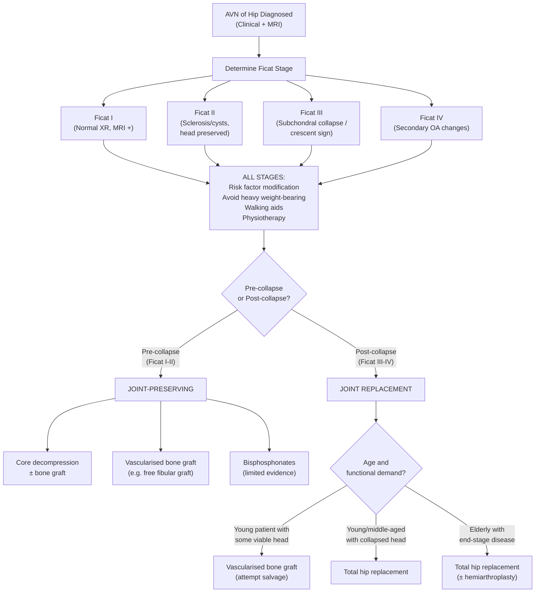

## Management of AVN of the Hip

### Guiding Principles

The management of AVN is driven by a single, critically important concept: **has the femoral head collapsed or not?** Everything flows from this distinction.

- **Pre-collapse (Ficat I–II)**: The femoral head is still **spherical**. The articular surface is intact. There is a window of opportunity for **joint-preserving treatment** — interventions that halt disease progression and allow bone to regenerate.
- **Post-collapse (Ficat III–IV)**: The subchondral bone has fractured, the femoral head has lost its round shape, and often secondary OA has developed. The joint surface is **irrecoverably damaged**. **Joint replacement** is usually the answer.

The lecture's take-home message captures this: ***Total hip replacement is a reliable and durable treatment option for patients with end-stage arthritis*** [1]. But in a 30-year-old with AVN, we desperately want to avoid or delay THR because prostheses have a finite lifespan (~15–25 years), meaning a young patient faces one or more revision surgeries in their lifetime.

***Early referral for specialist care can significantly improve patient's function*** [1] — this is key because catching AVN early (Ficat I–II) opens the door to joint preservation.

---

### Management Algorithm

---

### Stage-by-Stage Treatment

#### A. General Measures (ALL Stages)

These apply regardless of staging and form the foundation of management:

***Treatment — Stage 1 and 2*** [1]:
- ***Risk factor modification: alcohol, steroid*** — Stop or minimise the offending agent. If the patient is on steroids for SLE, work with the rheumatologist to use the lowest effective dose or switch to steroid-sparing agents (e.g., mycophenolate, azathioprine). If alcohol is the cause, complete cessation is essential.
- ***Avoid heavy weight-bearing (running)*** — Continued mechanical loading on necrotic subchondral bone accelerates the progression to collapse. The necrotic zone is structurally weak, and repetitive impact drives microfractures.
- ***Walking aids*** — Crutches or a stick to offload the affected hip during the repair phase. Protected weight-bearing reduces the mechanical stress on the compromised femoral head.
- ***Physiotherapy*** [1] — ***Muscle strengthening, range of motion exercise, cardiopulmonary function, endurance*** — maintains periarticular muscle support, prevents contractures, and preserves function. The lecture cites AAOS evidence: ***Strong evidence supports the use of physical therapy as a treatment to improve function and reduce pain for patients with osteoarthritis of the hip and mild to moderate symptoms*** [1].

***Drugs: bisphosphonate*** [1]:
- ***Treat osteoporosis; lacking RCT evidence*** [1]
- **Rationale from first principles**: Bisphosphonates (e.g., alendronate, zoledronic acid) are **osteoclast inhibitors**. They work by binding to hydroxyapatite in bone and being ingested by osteoclasts, disrupting their function. In AVN, the problem is that osteoclasts resorb dead trabeculae faster than osteoblasts can rebuild. By slowing osteoclast activity, bisphosphonates theoretically **preserve the subchondral architecture** during the repair phase, buying time for osteoblasts to deposit new bone and preventing structural collapse.
- **The evidence gap**: While the mechanism is sound, there is ***lacking RCT evidence*** [1] to definitively prove that bisphosphonates prevent femoral head collapse. Some small studies show promise (reduced pain, delayed collapse), but large RCTs are lacking. They are used as adjunctive therapy, not as a standalone treatment.

<Callout title="Important Concept">
**Why can't we just rest and wait?** Because the natural history of untreated AVN with > 30% femoral head involvement is relentless progression to collapse in ~80% of cases within 2–3 years. The repair process itself (osteoclast resorption) creates the structural weakness. Simple rest does not stop this biological process — you need to either remove the intraosseous pressure (core decompression), provide structural support (bone graft), or slow the resorption (bisphosphonates).
</Callout>

---

#### B. Ficat Stage I — Pre-radiological AVN

***Stage I: Normal X-ray; only changes on MRI → Core decompression*** [1]

##### Core Decompression

This is the **workhorse joint-preserving procedure** for early AVN.

**What it is**: A trephine (a cylindrical drill bit, typically 8–10 mm) is inserted percutaneously through the lateral femoral cortex, up the femoral neck, and into the necrotic zone of the femoral head, under fluoroscopic guidance. A core of bone is removed.

***Treatment — Stage 1 and 2: Decompression*** [1]:
- ***Increased intra-medullary pressure*** — the necrotic zone has elevated intraosseous pressure from marrow oedema, fat cell hypertrophy, and venous congestion. This elevated pressure further impedes arterial inflow (a vicious cycle). Core decompression **physically releases this pressure**.
- ***Re-vascularisation, bone regeneration*** [1] — the decompression tract creates a channel for new blood vessels to grow into the necrotic area. The drilling also stimulates a local healing response (similar to how microfracture works in cartilage repair), bringing mesenchymal stem cells and growth factors.

**Indications**:
- Ficat Stage I (pre-radiological) — best results
- Ficat Stage II (sclerotic/cystic but head preserved) — good results
- Small to medium necrotic lesions (< 30% of femoral head)

**Contraindications**:
- Post-collapse disease (Ficat III–IV) — the structural damage is done; decompression won't restore a collapsed head
- Very large necrotic lesions (> 50% of femoral head) — insufficient viable bone for regeneration
- Active infection

**Outcomes**: ~70% success rate in Ficat I, ~50% in Ficat II. Success is defined as avoiding progression to collapse and avoiding arthroplasty.

##### Combined Core Decompression + Bone Graft

***Treatment — Stage 1 and 2: Bone graft*** [1]:
- ***Debridement of necrotic bone*** — the dead bone is curetted out through the decompression tract
- ***Autograft, allograft, artificial bone graft*** [1]

**Why add bone graft?** Core decompression alone leaves a void. Filling it with bone graft provides:
1. **Structural support** — prevents subchondral collapse during the healing period
2. **Osteogenic cells** (autograft) — if taken from the patient's own iliac crest, the graft contains living osteoblasts
3. **Osteoconductive scaffold** — the graft material provides a lattice for new bone to grow along
4. **Osteoinductive factors** — growth factors (BMPs) in autograft stimulate new bone formation

**Types of bone graft**:
- **Autograft** (from patient's iliac crest): Best biological quality, but limited quantity and donor site morbidity
- **Allograft** (from bone bank): No donor site morbidity, but no living cells
- **Artificial/synthetic bone graft** (calcium phosphate, hydroxyapatite): Scaffold only, no biological activity
- **Bone morphogenetic proteins (BMPs)**: Can be added to enhance osteoinduction

---

#### C. Ficat Stage II — Sclerotic/Cystic Lesions, Head Preserved

***Stage II: Sclerotic or cystic lesions → Core decompression / vascularised bone graft*** [1]

All the Stage I treatments apply, plus:

##### Vascularised Bone Graft (e.g., Free Vascularised Fibular Graft — FVFG)

***Management of AVN: Free vascularized fibular graft (FVFG) — for young patients with viable femoral head*** [3]

**What it is**: A segment of the fibula (typically ~10–12 cm) is harvested along with its **peroneal artery and vein** (keeping the blood supply intact). This vascularised graft is then transplanted into the femoral head through a channel drilled from the lateral femoral cortex, up through the neck, and into the necrotic zone. The peroneal vessels are anastomosed to branches of the lateral femoral circumflex artery using microsurgical techniques.

**Why is this better than non-vascularised bone graft?**
- A non-vascularised graft is dead bone — it must be revascularised by "creeping substitution" from the host bone, which is slow and unreliable in a necrotic zone
- A **vascularised graft brings its own blood supply** — it is a living piece of bone that can immediately support osteogenesis and structural integrity
- The fibula is a cortical bone (strong for its size) and provides **structural strut support** under the subchondral plate, preventing collapse

**Indications**:
- Young patients (< 40–50 years) — high motivation to preserve the native hip
- Ficat Stage II (best) or early Stage III (selected cases with minimal collapse)
- Necrotic lesion size amenable to structural support

**Contraindications**:
- Significant femoral head collapse (Ficat III with > 2–3 mm depression)
- Secondary OA (Ficat IV)
- Active infection
- Patients unfit for prolonged surgery (~4–6 hours)
- Vascular disease precluding microsurgical anastomosis

**Outcomes**: 60–80% hip survival at 5–10 years in Ficat II. Results decline in more advanced stages.

##### Non-vascularised Structural Bone Grafting (Trapdoor / Lightbulb Procedure)

- A window is cut in the femoral head, necrotic bone is curetted out, and structural autograft or allograft is packed in to support the subchondral plate
- Less technically demanding than FVFG but lower success rates
- Rarely performed now as FVFG has superior outcomes

##### Tantalum Rod (Porous Metal Implant)

- A porous tantalum rod inserted into the decompression tract provides immediate structural support to the subchondral bone
- The porous structure allows bone ingrowth
- Mixed results in the literature; used in some centres as an alternative to bone grafting

---

#### D. Ficat Stage III — Subchondral Collapse

***Stage III: Subchondral collapse → Vascularised bone graft / THR*** [1]

This is the transitional stage. Once the crescent sign appears and the head begins to flatten, the options narrow:

- **In young patients** with **minimal collapse** (< 2 mm depression, small lesion): An attempt at **vascularised bone graft** may still be worthwhile to delay THR. However, success rates are lower than in Stage II.
- **In most patients** with **significant collapse**: ***Total hip replacement*** [1] is the treatment of choice.

The decision depends on:
1. **Degree of collapse** — millimetres of femoral head depression
2. **Patient age** — younger patients benefit from any delay in THR
3. **Extent of necrosis** — small lesions may be salvageable; large lesions with > 30% involvement have poor outcomes with joint-preserving surgery
4. **Acetabular involvement** — if the acetabular cartilage is already damaged, joint-preserving surgery will fail regardless

---

#### E. Ficat Stage IV — Secondary OA

***Stage IV: OA changes → THR*** [1]

***Treatment — Stage 3 and 4: Total hip replacement*** [1]:
- ***Quick and reliable procedure*** [1]
- ***Improving implant survivorship*** [1]

By this stage, the discussion is identical to the management of **end-stage OA hip**.

---

### Total Hip Replacement (THR) — The Definitive Procedure

Since THR is the endpoint for most AVN patients, let's go into detail.

**What it is**: Replacement of both the femoral head/neck (with a prosthetic femoral stem + head) and the acetabulum (with a prosthetic acetabular cup). "Total" means both sides of the joint are replaced.

***Management goals*** [1]:
- ***Joint: Restore pain-free stable joint***
- ***Bone — Acetabular side: Restore anatomical hip centre; Femoral side: Correct femoral side deformity***
- ***Soft tissue: Contracted muscles, ligaments and joint capsule; sciatic nerve; femoral shortening***

**Why THR over hemiarthroplasty for AVN?**
- In AVN with secondary OA (Ficat IV), both the femoral head AND acetabulum are damaged → replacing only the femoral side (hemiarthroplasty) would leave damaged acetabular cartilage → continued pain
- ***Joint replacement (hemiarthroplasty / THR)*** [3] — THR is preferred unless the patient is elderly, low-demand, or medically unfit for the longer procedure

**Bearing surfaces in THR** (important for young AVN patients):

| Bearing | Pros | Cons |
|:---|:---|:---|
| **Metal-on-polyethylene** | Reliable long track record, cost-effective | Polyethylene wear → osteolysis over time; concern in young active patients |
| **Ceramic-on-ceramic** | Very low wear rate, excellent for young patients | Risk of ceramic fracture (rare), squeaking |
| **Ceramic-on-polyethylene** (highly cross-linked) | Good wear characteristics, no ceramic-ceramic squeaking | Better than standard polyethylene but still wears |
| **Metal-on-metal** | Low wear | **Largely abandoned** due to metal ion release, adverse local tissue reactions (ALTR), pseudotumours |

For **young AVN patients**, ceramic-on-ceramic or ceramic-on-highly-cross-linked-polyethylene bearings are typically chosen to maximise implant longevity.

**Surgical approaches for THR** [2]:

| ***Approach*** | ***Advantage*** | ***Disadvantage*** |
|:---|:---|:---|
| ***Posterior — most common*** | ***Preserve abductor mechanism → rapid rehab*** | ***Sciatic nerve injury; risk of hip joint dislocation*** |
| ***Anterolateral (modified Hardinge)*** | ***Detach abductor mechanism → good exposure*** | ***Superior gluteal nerve injury*** |
| ***Anterior (Smith-Petersen) — rare*** | ***For open washout of infected hip*** | Limited femoral exposure |
| **Direct anterior (DAA)** | Muscle-sparing (intermuscular plane), lower dislocation risk | Steep learning curve, LCFA injury, femoral fracture risk |

**Post-operative care** [3]:
- ***Prevent dislocation: do not squat / cross legs / flex hip > 90°, abduction pillow, high-low chair***
- Early mobilisation with physiotherapy
- VTE prophylaxis (LMWH, mechanical)
- Follow-up X-rays at regular intervals

**Implant survivorship**: Modern THR prostheses have **> 90% survival at 15 years** and many last > 25 years. This is why the lecture states ***improving implant survivorship*** [1] — advances in bearing surfaces, fixation methods (cemented vs uncemented vs hybrid), and surgical technique continue to extend prosthesis life.

<Callout title="Cemented vs Uncemented Fixation">
- **Cemented** (e.g., Exeter stem): Bone cement (polymethylmethacrylate — PMMA) fills the gap between prosthesis and bone, providing immediate stability. Better for **elderly patients with osteoporotic bone** where biological fixation may be unreliable.
- **Uncemented** (press-fit with porous coating): The prosthesis is press-fit into the bone, and the porous surface allows bone ingrowth over time. Better for **young patients with good bone stock** — no cement-bone interface to fail.
- **Hybrid**: Cemented stem + uncemented cup (common combination).

For young AVN patients, **uncemented THR** is generally preferred because it preserves bone stock for future revision surgery.
</Callout>

---

### Treatment of AVN in the Context of Femoral Neck Fractures

Since post-traumatic AVN after #NOF is a major clinical scenario [4][5]:

***Intracapsular neck of femur fracture — worry of AVN, nonunion*** [4]:
- ***Young patient — reduction and internal fixation*** (to **save the femoral head**; accept the AVN risk and deal with it if it occurs)
- ***Old patient — hemiarthroplasty if displaced, internal fixation if undisplaced*** [4]

***Factors to consider: Age, Displacement*** [5]:
- ***Save the femoral head in young age / undisplaced***
- ***Time of presentation → AVN (6 hours)*** [5] — delay in reduction of displaced fractures beyond ~6 hours significantly increases AVN risk due to prolonged vascular compromise
- ***Patient's general health***
- ***Risk factors for internal fixation: osteoporosis (too comminuted), sepsis*** [5]

***Garden classification management*** [5]:
- ***Undisplaced → internal fixation to prevent displacement***
- ***Displaced + young → reduction and internal fixation to salvage joint***
- ***Displaced + old → partial hip replacement (hemiarthroplasty) to prevent reoperation and control pain***

---

### Analgesic Ladder for AVN (Applicable to All Stages)

***Analgesics — do not affect natural history*** [1]:

The lecture presents a **treatment pyramid** for hip arthritis [1]:

| Level | Treatment | Details |
|:---|:---|:---|
| **Base (mild)** | ***Information and advice, simple analgesics, topical agents, lifestyle, nutraceuticals*** [1] | Education about the condition, weight loss, activity modification |
| **Second tier** | ***NSAIDs, other drugs, physiotherapy or occupational therapy, orthoses, other aids*** [1] | NSAIDs reduce inflammation but have GI/renal/CV side effects; use short courses |
| **Third tier** | ***Injections*** [1] | Intra-articular corticosteroid (temporary relief only, max 3–4/year) |
| **Fourth tier** | ***Surgery — joint preserving: osteotomy, resurfacing*** [1] | Core decompression, bone graft for pre-collapse AVN |
| **Top (severe)** | ***Surgery — joint replacement*** [1] | THR for post-collapse AVN |

***Specific analgesics*** [1]:
- ***Paracetamol (Panadol): first line*** — mechanism: central COX inhibition and serotonergic pathways; safe, few side effects
- ***Tramadol: non-narcotic*** — actually an atypical opioid (mu-receptor agonist + serotonin/norepinephrine reuptake inhibitor); ***combine with paracetamol: synergistic*** effect; ***use if contraindication to NSAIDs***
- ***Opioids: CNS depression, addiction; no routine use*** [1] — reserved for severe acute pain (e.g., post-collapse crisis) or post-operative pain

---

### Special Scenarios

#### Young Patient with AVN (< 40 years)

This is the most challenging clinical situation. The goals are:
1. **Delay THR as long as possible** — every year of native hip preserved avoids future revision surgery
2. **Joint-preserving cascade**: Risk factor modification → Core decompression ± bone graft → FVFG → THR only as last resort
3. ***FVFG for young patients with viable femoral head*** [3]

#### AVN Secondary to DDH

***Management*** [1]:
- ***Periacetabular osteotomy — symptomatic dysplasia in young adult with concentrically reduced hip and congruent joint space, before OA changes***
- ***Total hip replacement — secondary OA changes, hip subluxation***

The lecture case: ***Problems: unstable poor functioning hip, significant leg length discrepancy, proximal femur deformity → Management: total hip replacement*** [1]. This illustrates that in complex AVN (especially with associated deformity), THR must address ***bone (restore anatomical hip centre, correct femoral deformity), joint (restore pain-free stable joint), and soft tissue (contracted muscles, sciatic nerve, femoral shortening)*** [1].

#### Perthes Disease (Paediatric AVN)

Management differs from adults [7]:
- ***Non-operative (age < 8 years)***: Physiotherapy (ROM exercises), activity restriction (non-weight-bearing) — young children have greater remodelling potential
- ***Operative (age > 8 years)***: Femoral or pelvic osteotomy — to contain the femoral head within the acetabulum during the healing phase

---

### Summary: Treatment by Ficat Stage

***Classification and treatment*** [1]:

| ***Ficat Stage*** | ***Criteria*** | ***Treatment*** [1] | Rationale |
|:---|:---|:---|:---|
| ***I*** | ***Normal XR*** | ***Core decompression*** | Decompress elevated intraosseous pressure; stimulate revascularisation; best window for joint preservation |
| ***II*** | ***Sclerotic or cystic lesions*** | ***Core decompression / vascularised bone graft*** | Debride necrotic bone, provide structural support and biological stimulus; prevent subchondral collapse |
| ***III*** | ***Subchondral collapse*** | ***Vascularised bone graft / THR*** | Attempt salvage in young with minimal collapse; THR for significant collapse |
| ***IV*** | ***OA change*** | ***THR*** | Joint surface irrecoverable; reliable pain relief and function restoration |

<Callout title="Exam Tip" type="error">
**Common student mistake**: Recommending core decompression for Ficat III/IV. Once the head has collapsed, decompression cannot restore the spherical shape. Similarly, don't recommend THR for Ficat I — that's a massive overtreatment in a young patient where joint-preserving options exist and have good success rates.
</Callout>

---

### Prevention of AVN

While not strictly "management of established AVN," prevention is critically important:

1. ***Fall prevention measures*** [3] — reduces femoral neck fracture risk, thus reducing post-traumatic AVN
2. ***Treatment of osteoporosis: improve bone mineral content by bisphosphonates and lifestyle modifications*** [3]
3. **Steroid minimisation** — use the lowest effective dose; use steroid-sparing agents in autoimmune diseases
4. **Alcohol cessation** — particularly when amounts approach cirrhosis-level consumption
5. **Early reduction of hip dislocations** — within 6 hours to minimise AVN risk [5]
6. **Careful fracture management** — anatomical reduction and stable fixation of femoral neck fractures to preserve MCFA blood supply

---

<Callout title="High Yield Summary">

1. **Pre-collapse (Ficat I–II) = joint-preserving treatment; Post-collapse (Ficat III–IV) = THR.**

2. **Stage I–II treatment**: Risk factor modification (stop alcohol/steroids) + avoid heavy weight-bearing + walking aids + bisphosphonates (limited evidence) + **core decompression** (relieves intraosseous pressure, stimulates revascularisation) ± **bone graft** (autograft/allograft/artificial — structural support and osteogenesis).

3. **FVFG** (free vascularised fibular graft): For young patients with viable femoral head. Brings its own blood supply → living bone that provides structural strut support. Best results in Ficat II.

4. **Stage III–IV treatment**: ***THR — quick and reliable procedure with improving implant survivorship.*** For young patients with minimal collapse, vascularised bone graft may be attempted first.

5. **THR approaches**: Posterior (most common, preserves abductors, risk of dislocation/sciatic nerve injury); anterolateral (good exposure, superior gluteal nerve risk); anterior (rare).

6. **Post-THR precautions**: No squatting, no crossing legs, no hip flexion > 90°, abduction pillow, high-low chair.

7. **Analgesics**: Paracetamol first-line → tramadol if NSAID contraindicated → opioids only in severe cases (no routine use). Analgesics do NOT affect natural history.

8. **For #NOF with AVN risk**: Young → reduction and internal fixation (save the head). Elderly + displaced → hemiarthroplasty. Time matters — reduce within 6 hours.

</Callout>

---

<ActiveRecallQuiz
  title="Active Recall - Management of AVN of Hip"
  items={[
    {
      question: "State the treatment for each Ficat stage of AVN as outlined in the lecture.",
      markscheme: "Stage I (normal XR): core decompression. Stage II (sclerotic/cystic lesions): core decompression or vascularised bone graft. Stage III (subchondral collapse): vascularised bone graft or THR. Stage IV (OA changes): THR."
    },
    {
      question: "Explain the mechanism by which core decompression works in early AVN. Why does it fail in post-collapse disease?",
      markscheme: "Core decompression reduces elevated intraosseous pressure (from marrow oedema, fat hypertrophy, venous congestion), restoring arterial inflow. The drill tract stimulates revascularisation and brings mesenchymal stem cells for bone regeneration. It fails in post-collapse disease (Ficat III-IV) because the subchondral plate has already fractured and the femoral head has lost its spherical shape, which cannot be restored by pressure relief alone."
    },
    {
      question: "What is a free vascularised fibular graft and why is it preferred over non-vascularised bone graft for AVN?",
      markscheme: "FVFG: a fibular segment harvested with its peroneal artery and vein, transplanted into the femoral head and microsurgically anastomosed to local vessels. Preferred because: 1. Brings its own blood supply - living bone can immediately support osteogenesis. 2. Non-vascularised graft is dead bone requiring slow creeping substitution from host. 3. Cortical fibula provides structural strut support under subchondral plate. Indicated for young patients with viable femoral head, Ficat II or early III."
    },
    {
      question: "Why are bisphosphonates used in AVN despite lacking strong RCT evidence? Explain the mechanism from first principles.",
      markscheme: "Bisphosphonates inhibit osteoclasts by binding hydroxyapatite and disrupting osteoclast function via the mevalonate pathway. In AVN, osteoclasts resorb dead trabeculae faster than osteoblasts rebuild them, creating structural weakness. By slowing osteoclastic resorption, bisphosphonates preserve the subchondral architecture during healing, buying time for osteoblasts to deposit new bone. Despite sound rationale, large RCTs proving prevention of femoral head collapse are lacking."
    },
    {
      question: "A 30-year-old with SLE develops Ficat Stage II AVN of the left hip. Outline your management plan in order of priority.",
      markscheme: "1. Risk factor modification: work with rheumatologist to minimise steroid dose or switch to steroid-sparing agents. 2. Protected weight-bearing: avoid heavy weight-bearing (running), use walking aids. 3. Physiotherapy: ROM exercises, muscle strengthening. 4. Bisphosphonates: adjunctive (limited evidence but reasonable in young patient). 5. Core decompression with bone graft (autograft or vascularised fibular graft given young age). 6. MRI contralateral hip to screen for bilateral disease. 7. If progresses to collapse despite joint-preserving treatment: THR with ceramic bearing surface."
    },
    {
      question: "Name 3 post-operative precautions after total hip replacement and explain why each is necessary.",
      markscheme: "1. No hip flexion beyond 90 degrees - prevents posterior dislocation by avoiding excessive flexion that disengages the femoral head from the acetabular cup. 2. No crossing legs / adduction - prevents dislocation by avoiding adduction across midline. 3. Abduction pillow - maintains hip in abduction during sleep to prevent inadvertent adduction and dislocation. Also: high-low chair (prevents excessive flexion when sitting), no squatting."
    }
  ]}
/>

## References

[1] Lecture slides: GC 229. Hip Arthritis (1).pdf (p20, p21, p22, p23, p24, p33, p38, p39, p45, p63, p64, p81, p103)
[2] Senior notes: maxim.md (section 6.3 — OA hip, surgical approaches)
[3] Senior notes: maxim.md (section 6.2 — #NOF management, post-operative complications, AVN management, prevention)
[4] Lecture slides: GC 235. Osteoporotic Related Fractures.pdf (p42)
[5] Lecture slides: GC 235. Osteoporotic Related Fractures.pdf (p21, p22)
[6] Senior notes: maxim.md (section 9.1 — OA management)
[7] Senior notes: maxim.md (section — Perthes disease management)
