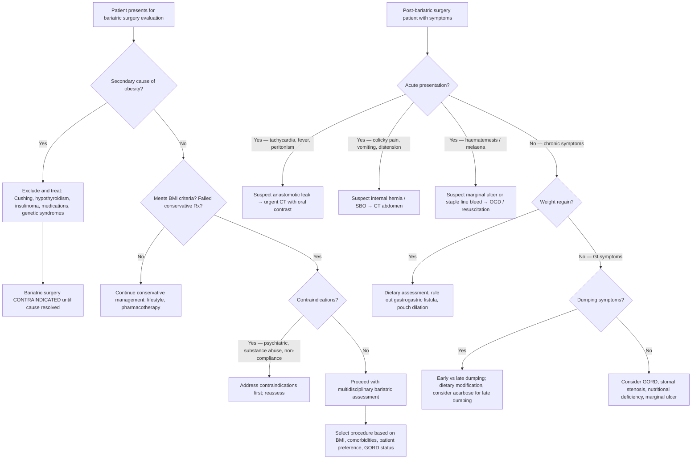

## Differential Diagnosis in the Context of Bariatric Surgery

The differential diagnosis (DDx) in bariatric surgery operates on **two distinct clinical axes**. First, before surgery, you must differentiate **primary (idiopathic) obesity** from **secondary causes of obesity** — because operating on a patient whose obesity is driven by a reversible endocrine or pharmacological cause is a contraindication [2]. Second, after surgery, you must differentiate the **expected post-operative course** from **complications that mimic other conditions**. Both are fair game in exams.

---

### Axis 1: Differential Diagnosis of Obesity — Before Bariatric Surgery

The question here is: **Why is this patient obese?** Most obesity (~95%) is **primary/exogenous** (caloric excess + sedentary lifestyle + polygenic predisposition). However, you must ***exclude reversible causes*** before committing a patient to irreversible surgery [2].

Think systematically using the mnemonic **"COMES"**:

| Category | Condition | Mechanism / Why it causes obesity | Key Distinguishing Features |
|---|---|---|---|
| **C — Cushing syndrome** | Excess cortisol (exogenous steroids, pituitary adenoma, adrenal tumour, ectopic ACTH) | Cortisol → ↑ gluconeogenesis, insulin resistance, ↑ appetite, preferential visceral fat deposition (central obesity), protein catabolism (thin limbs) | ***Central obesity with thin extremities***, moon face, buffalo hump, striae (wide, purple — unlike simple obesity which has narrow, pale striae), proximal myopathy, easy bruising, hypertension, hyperglycaemia |
| **O — Other endocrine** | **Hypothyroidism** | ↓ Basal metabolic rate → reduced energy expenditure; also myxoedema (mucopolysaccharide deposition → non-pitting oedema that adds weight) | Fatigue, cold intolerance, constipation, dry skin, bradycardia, delayed relaxation of ankle jerks. Weight gain is usually modest (5–10 kg), rarely causes morbid obesity alone |
| | **Insulinoma** | Excess insulin → recurrent hypoglycaemia → compensatory ↑ eating (defensive eating to prevent hypoglycaemia) + anabolic effect of insulin (lipogenesis) | Whipple's triad: symptoms of hypoglycaemia, documented low glucose ( < 2.5 mmol/L), resolution with glucose administration. Episodes often fasting-related |
| | **Growth hormone deficiency** | GH promotes lipolysis; deficiency → ↑ fat mass (especially visceral), ↓ lean mass | Central adiposity, reduced muscle mass, fatigue, ↓ bone density. Usually in context of panhypopituitarism |
| | **Hypogonadism** | Testosterone promotes lean mass and lipolysis; deficiency → ↑ visceral fat. Oestrogen excess in males → gynoid fat distribution | Males: ↓ libido, erectile dysfunction, gynaecomastia, reduced body hair. Females: amenorrhoea (but note PCOS can cause both hyperandrogenism and obesity) |
| **M — Medications** | Corticosteroids, insulin, sulfonylureas, atypical antipsychotics (olanzapine, clozapine), valproate, SSRIs/mirtazapine, β-blockers, TZDs | Various: ↑ appetite (central mechanisms), ↓ metabolic rate, insulin resistance, lipogenesis, fluid retention | Temporal relationship between drug initiation and weight gain. Always take a thorough drug history! |
| **E — Eating disorders** | Binge eating disorder (BED) | Recurrent episodes of uncontrolled large-volume eating without compensatory purging → chronic caloric excess | Eating large amounts when not hungry, eating until uncomfortably full, eating alone due to embarrassment, marked distress. Present in ~25–50% of bariatric surgery candidates — must screen |
| **S — Syndromic/Genetic** | Prader-Willi syndrome | Hypothalamic dysfunction → insatiable appetite (hyperphagia), ↓ GH → ↓ lean mass | Childhood onset, intellectual disability, short stature, hypogonadism, hypotonia in infancy |
| | Bardet-Biedl syndrome | Ciliopathy → hypothalamic-pituitary dysfunction | Retinitis pigmentosa, polydactyly, renal anomalies, intellectual disability |
| | MC4R mutations | Most common monogenic cause of obesity; melanocortin 4 receptor deficiency → disrupted hypothalamic satiety signalling | Severe early-onset obesity, hyperphagia, tall stature, hyperinsulinaemia |
| | Leptin/leptin receptor deficiency | Extremely rare; absent leptin signal → hypothalamus never receives "full" signal | Severe early-onset obesity, hypogonadism. Responds to exogenous leptin if leptin-deficient (not receptor-deficient) |

<Callout title="Exam Approach: Secondary Obesity" type="idea">
On an exam, if a patient has features suggesting secondary obesity (e.g., striae that are wide and purple, proximal myopathy, virilisation, childhood onset with intellectual disability), **name the condition and state that it must be excluded/treated before considering bariatric surgery**. The key principle: ***reversible causes of obesity are a contraindication to bariatric surgery*** [2].
</Callout>

---

### Axis 2: Differential Diagnosis of Post-Bariatric Surgery Symptoms

After bariatric surgery, patients may present with symptoms that could represent **normal post-operative changes**, **expected physiological consequences**, or **serious complications**. The DDx here is symptom-driven.

#### A. Post-Bariatric Surgery: Acute Abdomen / Abdominal Pain

| Differential | Mechanism | Distinguishing Features |
|---|---|---|
| ***Anastomotic leak*** | Disruption of staple line (SG) or surgical anastomosis (RYGB) → peritoneal contamination | ***Most feared early complication***. Tachycardia (often the earliest and most reliable sign — even before fever or pain), fever, peritonism, sepsis. CT with oral contrast: extravasation of contrast. Tachycardia > 120 bpm in the first 48 hours post-op = leak until proven otherwise |
| **Staple line bleed** | Bleeding from the long staple line (especially SG) | Tachycardia, hypotension, dropping Hb, blood per drain. Usually within first 24–48 hours |
| ***Internal hernia*** | Mesenteric defects created during RYGB allow bowel to herniate through → closed-loop obstruction → strangulation | ***Specific to RYGB***. Colicky abdominal pain, vomiting, signs of SBO. Can present months to years post-op, especially after significant weight loss (mesenteric fat loss widens defects). CT: "swirl sign" (mesenteric vascular rotation) |
| **Bowel obstruction** (adhesive) | Post-surgical adhesions (any abdominal surgery) | Colicky pain, distension, vomiting, absolute constipation. AXR/CT: dilated bowel with transition point |
| **Marginal ulcer** | Ulcer at the gastrojejunal anastomosis (RYGB) — due to acid exposure on unprotected jejunal mucosa, NSAIDs, smoking, *H. pylori* | Epigastric pain, GI bleeding (haematemesis/melaena). Risk factors: smoking, NSAIDs, *H. pylori* — all should be addressed preoperatively. Diagnosed by OGD |
| **Band slippage/erosion** (gastric banding) | Band slips → gastric prolapse through band → obstruction. Band erosion → penetration into gastric lumen | Acute dysphagia, vomiting, pain. X-ray: "O-sign" (horizontal band = slipped from normal oblique position) |
| **Cholelithiasis / cholecystitis** | Rapid weight loss → ↑ cholesterol saturation of bile (liver mobilises cholesterol from adipose stores) + ↓ gallbladder motility → gallstone formation | Right upper quadrant pain, Murphy's sign positive. Very common (up to 30% develop gallstones in first 6–12 months post-bariatric surgery). Some centres offer prophylactic ursodeoxycholic acid or concurrent cholecystectomy |
| **Acute pancreatitis** | Gallstone migration → ampullary obstruction; or hypertriglyceridaemia | Epigastric pain radiating to back, ↑ amylase/lipase |

#### B. Post-Bariatric Surgery: Nausea and Vomiting

| Differential | Mechanism | Distinguishing Features |
|---|---|---|
| **Overeating** (most common) | ***Restrictive mechanism*** — eating more than the small pouch/sleeve can accommodate | ***Upper abdominal pain and vomiting immediately after eating too much or too fast*** [2]. Self-limited. Patient education is key |
| **Stomal stenosis** | Scarring/narrowing at the gastrojejunal anastomosis (RYGB) or sleeve narrowing (usually at incisura angularis) | Progressive dysphagia, intolerance to solids > liquids. Usually 4–8 weeks post-op. Diagnosed by OGD/barium swallow. Treated by endoscopic balloon dilation |
| **Marginal ulcer** | As above | Epigastric pain ± bleeding |
| ***Internal hernia*** | As above | Intermittent colicky pain + vomiting (SBO pattern) |
| **GORD** (especially post-SG) | SG may worsen GORD: ↑ intragastric pressure in a narrow sleeve, disruption of angle of His, altered LES pressure | Heartburn, regurgitation, especially nocturnal. Chronic GORD post-SG may require conversion to RYGB |
| **Gastrogastric fistula** (RYGB) | Communication between the small gastric pouch and the excluded gastric remnant → food enters remnant → pain, GORD, weight regain | Weight regain + GORD symptoms post-RYGB. Diagnosed by upper GI series or OGD |

#### C. Post-Bariatric Surgery: Weight Loss Failure or Weight Regain

| Differential | Mechanism |
|---|---|
| **Dietary non-compliance** | Most common cause — snacking, high-calorie liquids (smoothies, sugary drinks) that bypass restriction |
| **Pouch/sleeve dilation** | Over time, pouch/sleeve stretches → accommodates more food → reduced restrictive effect |
| **Gastrogastric fistula** (RYGB) | Food enters excluded stomach → absorption from larger surface area |
| **Psychological/eating disorder** | Unaddressed binge eating disorder; emotional eating returns |
| **Inadequate initial procedure** | Pouch too large, limb lengths too short (RYGB) |

#### D. Post-Bariatric Surgery: Dumping Syndrome

***Dumping syndrome*** deserves special attention because it is very commonly tested [1][2]:

- **Early dumping** (15–30 minutes after eating):
  - *Mechanism*: After RYGB, food bypasses the pylorus → rapid delivery of hyperosmolar chyme into the jejunum → osmotic fluid shift into the gut lumen → intravascular volume depletion + gut distension
  - *Symptoms*: Nausea, cramping, diarrhoea, bloating, tachycardia, flushing, diaphoresis, dizziness (vasomotor symptoms from hypovolaemia and autonomic response)

- **Late dumping** (1–3 hours after eating):
  - *Mechanism*: Rapid glucose absorption → exaggerated insulin release → ***reactive hypoglycaemia***
  - *Symptoms*: Diaphoresis, tremor, weakness, confusion, palpitations (adrenergic counter-regulatory response to hypoglycaemia)

<Callout title="Why Dumping Syndrome Can Be 'Therapeutic'">
Interestingly, dumping syndrome after RYGB acts as a form of negative reinforcement — patients quickly learn to avoid simple sugars and high-glycaemic-index foods because they cause unpleasant symptoms. This contributes to long-term dietary modification and weight maintenance. It is a "feature, not a bug" of the RYGB design.
</Callout>

---

### Differential Diagnosis Algorithm — Systematic Approach

---

### Special DDx: Vomiting and Weight Loss — Gastric Cancer vs Post-Bariatric Surgery

This is particularly relevant given the ***gastric cancer lecture*** [1]. A patient with a history of bariatric surgery presenting with **weight loss and vomiting** can be diagnostically challenging:

| Feature | Post-Bariatric Surgery (Expected/Complication) | Gastric Cancer |
|---|---|---|
| **Weight loss** | Expected in first 12–18 months; concern if excessive or after plateau | ***Progressive, unintentional*** weight loss; often with anorexia and early satiety |
| **Vomiting** | Usually related to overeating, stomal stenosis, or dumping | ***Persistent***, may contain food eaten hours/days ago (gastric outlet obstruction); may have haematemesis |
| **Timing** | Early post-op period or related to eating patterns | Insidious onset, progressive |
| **Red flags** | Tachycardia (leak), peritonism, fever | ***Dysphagia (proximal tumour)***, ***palpable epigastric mass***, ***left supraclavicular lymphadenopathy (Virchow's node)***, ***iron deficiency anaemia***, ***acanthosis nigricans (paraneoplastic — malignant type)*** |
| **Investigation** | CT with oral contrast (leak), OGD (stenosis, ulcer) | ***OGD with biopsy*** (gold standard for diagnosis), ***CT TAP for staging*** |

<Callout title="Critical Exam Point" type="error">
***Never assume*** that weight loss and vomiting in a bariatric surgery patient is simply from the surgery. Always consider the possibility of de novo pathology, including gastric cancer — especially if the gastric remnant (in RYGB) is not easily accessible by standard OGD. The excluded gastric remnant in RYGB is a "blind spot" — cancers arising here may present late. Some centres advocate preoperative OGD ± *H. pylori* eradication in all bariatric surgery candidates, especially in high-prevalence regions like East Asia [1][2].
</Callout>

---

### Summary Table: Key Differentials to Exclude Before and After Bariatric Surgery

| Timing | Key Differentials | Approach |
|---|---|---|
| **Pre-operative** | Cushing syndrome, hypothyroidism, insulinoma, medication-induced obesity, genetic syndromes (Prader-Willi, MC4R), eating disorders | Endocrine workup (cortisol, TSH, glucose/insulin), drug history, psychological assessment, genetic testing if early-onset |
| **Early post-operative** ( < 30 days) | Anastomotic leak, staple line bleed, PE/DVT, bowel obstruction, rhabdomyolysis | CT with oral contrast, Hb monitoring, CTPA, CK levels |
| **Late post-operative** ( > 30 days) | Internal hernia, marginal ulcer, stomal stenosis, cholelithiasis, dumping syndrome, nutritional deficiencies, GORD (post-SG), weight regain | CT (swirl sign), OGD, barium swallow, RUQ USS, dietary assessment, micronutrient levels |

---

> **High Yield DDx Points for Exams:**
> 1. Always exclude secondary/reversible causes of obesity before bariatric surgery — especially Cushing syndrome and hypothyroidism.
> 2. Tachycardia > 120 bpm in first 48 hours post-bariatric surgery = anastomotic leak until proven otherwise.
> 3. Internal hernia is specific to RYGB (mesenteric defects) — look for "swirl sign" on CT.
> 4. Dumping syndrome = early (osmotic, vasomotor) vs late (reactive hypoglycaemia). More common after RYGB because pylorus is bypassed.
> 5. Gallstones are very common after rapid weight loss — up to 30% incidence in first year.
> 6. The excluded gastric remnant in RYGB is a "blind spot" for gastric cancer surveillance.

---

<ActiveRecallQuiz
  title="Active Recall - Bariatric Surgery Differential Diagnosis"
  items={[
    {
      question: "Name 4 secondary (reversible) causes of obesity that must be excluded before bariatric surgery, and state one key distinguishing clinical feature for each.",
      markscheme: "1. Cushing syndrome — central obesity with purple striae, moon face, proximal myopathy. 2. Hypothyroidism — fatigue, cold intolerance, bradycardia, elevated TSH. 3. Insulinoma — recurrent fasting hypoglycaemia (Whipple's triad), defensive eating. 4. Medication-induced (corticosteroids, atypical antipsychotics, insulin) — temporal relationship with drug initiation. Also accept: Prader-Willi, GH deficiency, hypogonadism.",
    },
    {
      question: "A patient is 36 hours post-laparoscopic sleeve gastrectomy and develops persistent tachycardia of 125 bpm with low-grade fever. What is the most likely diagnosis and what is the next best investigation?",
      markscheme: "Most likely diagnosis: anastomotic (staple line) leak. Tachycardia is often the earliest sign, even before fever or peritonism. Next best investigation: CT abdomen with oral water-soluble contrast — looking for extravasation of contrast material from the staple line.",
    },
    {
      question: "Explain the pathophysiology of early dumping syndrome vs late dumping syndrome after RYGB. Why does RYGB cause dumping but sleeve gastrectomy rarely does?",
      markscheme: "Early dumping (15-30 min): hyperosmolar chyme rapidly enters jejunum (pylorus bypassed) causing osmotic fluid shift into gut lumen leading to hypovolaemia plus gut distension causing vasomotor symptoms (tachycardia, flushing, dizziness). Late dumping (1-3 hrs): rapid glucose absorption triggers exaggerated insulin release causing reactive hypoglycaemia with adrenergic symptoms. RYGB causes dumping because the pylorus is completely bypassed; in SG the pylorus is preserved allowing controlled gastric emptying.",
    },
    {
      question: "Why are gallstones common after bariatric surgery? State the approximate incidence and one prophylactic measure.",
      markscheme: "Rapid weight loss causes increased hepatic cholesterol mobilisation from adipose stores leading to supersaturation of bile with cholesterol, combined with decreased gallbladder motility (reduced CCK stimulation from reduced food intake). Incidence: up to 30% in the first 6-12 months. Prophylaxis: ursodeoxycholic acid (UDCA) for 6 months post-surgery; some centres perform concurrent cholecystectomy.",
    },
    {
      question: "What is an internal hernia after RYGB? Why does it present months to years after surgery, and what is the characteristic CT finding?",
      markscheme: "Internal hernia: bowel herniates through mesenteric defects created during RYGB construction (e.g., Petersen space, jejunojejunal mesenteric defect). Presents late because significant weight loss reduces mesenteric fat, widening the defects and allowing bowel to herniate. Can cause closed-loop small bowel obstruction and strangulation. CT finding: swirl sign — rotation of mesenteric vessels around a central axis.",
    },
  ]}
/>

---

## References

[1] Lecture slides: GC 212. Weight loss and vomiting gastric cancer; abdominal imaging.pdf
[2] Senior notes: maxim.md (section 3.8 Bariatric surgery)
