## Diagnostic Criteria, Algorithm, and Investigations for Bariatric Surgery

Bariatric surgery is unique in that the "diagnosis" is not of a single disease but of a **clinical state** — severe obesity with or without comorbidities — that meets specific criteria for surgical intervention. The diagnostic workup therefore serves three purposes: (1) **confirming eligibility** (meeting indications, excluding contraindications), (2) **preoperative risk stratification and optimisation**, and (3) **postoperative surveillance and complication detection**. We will cover all three systematically.

---

## 1. Diagnostic Criteria for Bariatric Surgery Candidacy

### 1.1 Eligibility Criteria (Asian Populations — IFSO-APC / ASMBS 2022-2024 Guidelines)

All of the following must be met:

| Criterion | Detail |
|---|---|
| ***Failed conservative management*** | Documented failure of **structured lifestyle intervention** (diet + exercise + behavioural therapy) ± **pharmacotherapy** for at least **6–12 months** |
| ***BMI threshold*** (Asian cut-offs) [2] | ***BMI ≥ 35 kg/m²*** — with or without comorbidities **OR** ***BMI ≥ 30 kg/m²*** with ***T2DM*** or other major obesity-related comorbidities (hypertension, OSA, NAFLD, dyslipidaemia, PCOS) **OR** BMI ≥ 27.5 kg/m² with **poorly controlled T2DM** (emerging indication per IFSO-APC 2024 — "primary metabolic surgery") |
| **Absence of contraindications** [2] | ***No reversible endocrine causes*** (Cushing syndrome, hypothyroidism, insulinoma excluded), ***no active psychiatric disorders***, ***no active substance abuse***, ***patient capable of compliance*** with lifelong follow-up and supplementation |
| **Multidisciplinary team assessment** | Evaluated by surgeon, endocrinologist/physician, dietitian, psychologist/psychiatrist, anaesthetist |
| **Informed consent** | Patient understands risks, benefits, lifelong dietary changes, and need for supplementation |

### 1.2 ABCD Score for Predicting T2DM Remission [2]

When the primary indication is **metabolic surgery for T2DM**, the ***ABCD score*** helps predict likelihood of diabetes remission and guides patient selection:

| Component | Scoring | Rationale |
|---|---|---|
| ***A — Age*** | 0–4 points (younger → higher) | Younger patients have better β-cell reserve and regenerative capacity |
| ***B — BMI*** | 0–3 points (higher → higher) | Greater BMI = more weight to lose = greater metabolic improvement; also correlates with insulin resistance (which is reversible) rather than β-cell failure |
| ***C — C-peptide*** | 0–2 points (higher → higher) | C-peptide reflects **endogenous insulin production**. High C-peptide = functioning β-cells that can respond to improved incretin signalling post-surgery. Low C-peptide = burned-out β-cells = poor chance of remission |
| ***D — Duration of DM*** | 0–1 point (shorter → higher) | Shorter duration = less cumulative glucotoxicity and lipotoxicity = more β-cells still alive |

- ***Total score = 10***
- ***Score > 6 → predicts T2DM remission after bariatric surgery*** [2]
- Score ≤ 2 → very low chance of remission; surgery still beneficial for weight loss but patient should not expect diabetes cure

<Callout title="Clinical Pearl: C-peptide Interpretation">
C-peptide is the **connecting peptide** cleaved from proinsulin when insulin is processed in β-cells. It is secreted in a 1:1 molar ratio with insulin. Unlike insulin, C-peptide is **not extracted by the liver** and has a longer half-life (~30 min vs ~5 min for insulin), making it a far more reliable marker of endogenous insulin secretion. A fasting C-peptide > 1.0 ng/mL (or stimulated C-peptide > 2.0 ng/mL) generally indicates adequate β-cell reserve for metabolic surgery to have a meaningful effect on diabetes.
</Callout>

---

## 2. Preoperative Investigation Algorithm

The preoperative workup is structured as a **multidisciplinary assessment** across several domains. Think of it as asking: *Is this patient safe for surgery? What comorbidities need optimisation? Which procedure is best? What is the baseline for postoperative monitoring?*

### Master Diagnostic Algorithm

```mermaid
graph TD
    A["Patient referred for bariatric surgery"] --> B["Step 1: Confirm eligibility"]
    B --> B1["BMI measurement + documentation of failed conservative Rx"]
    B --> B2["Exclude secondary causes of obesity"]
    B2 --> B2a["TFTs — exclude hypothyroidism"]
    B2 --> B2b["Overnight dexamethasone suppression test or 24hr urine cortisol — exclude Cushing"]
    B2 --> B2c["Fasting glucose/insulin — exclude insulinoma if clinically suspected"]
    B2 --> B2d["Drug history review"]
    
    A --> C["Step 2: Assess comorbidities and surgical risk"]
    C --> C1["Metabolic workup"]
    C1 --> C1a["Fasting glucose, HbA1c, fasting C-peptide — DM assessment + ABCD score"]
    C1 --> C1b["Fasting lipid profile"]
    C1 --> C1c["LFTs — screen for NAFLD/MASLD"]
    C1 --> C1d["BP measurement"]
    
    C --> C2["Cardiorespiratory assessment"]
    C2 --> C2a["ECG — baseline, screen arrhythmia/LVH"]
    C2 --> C2b["CXR"]
    C2 --> C2c["Polysomnography or screening questionnaire — OSA"]
    C2 --> C2d["Echocardiography if clinically indicated"]
    C2 --> C2e["Spirometry if respiratory symptoms"]
    
    C --> C3["GI assessment"]
    C3 --> C3a["OGD — screen for H. pylori, hiatal hernia, Barrett, gastric pathology"]
    C3 --> C3b["Abdominal USS — gallstones, hepatic steatosis"]
    
    C --> C4["Nutritional baseline"]
    C4 --> C4a["Iron studies, ferritin"]
    C4 --> C4b["Vitamin B12, folate"]
    C4 --> C4c["Vitamin D, calcium, PTH"]
    C4 --> C4d["Albumin, prealbumin"]
    C4 --> C4e["Zinc, copper, thiamine"]
    
    C --> C5["Psychological assessment"]
    C5 --> C5a["Screen for depression, eating disorders, substance abuse"]
    C5 --> C5b["Assess motivation and compliance capacity"]
    
    A --> D["Step 3: Anaesthetic assessment"]
    D --> D1["Airway — Mallampati, neck circumference, OSA severity"]
    D --> D2["Venous access assessment"]
    D --> D3["VTE risk stratification"]
    
    A --> E["Step 4: Procedure selection"]
    E --> E1{"Significant GORD?"}
    E1 -->|Yes| E1a["Favour RYGB over SG — RYGB is best for GORD"]
    E1 -->|No| E1b{"BMI > 50 or severe metabolic disease?"}
    E1b -->|Yes| E1c["Consider RYGB or BPD-DS"]
    E1b -->|No| E1d["SG often first choice — simpler, good outcomes"]
    
    A --> F["Step 5: Preoperative optimisation"]
    F --> F1["Correct nutritional deficiencies"]
    F --> F2["Optimise glycaemic control — target HbA1c < 8%"]
    F --> F3["Treat OSA — CPAP initiated preoperatively"]
    F --> F4["Smoking cessation — minimum 4-6 weeks preop"]
    F --> F5["H. pylori eradication if positive"]
    F --> F6["Preoperative weight loss — liver shrinkage diet 2-4 weeks"]
```

---

## 3. Investigation Modalities — Detailed Breakdown

### 3.1 Anthropometric Assessment

| Measurement | Method | Key Findings and Interpretation |
|---|---|---|
| **BMI** | Weight (kg) / Height² (m²) | Defines eligibility. ***Asian cut-offs: ≥ 30 with T2DM, ≥ 35 without*** [2]. Remember BMI does not distinguish fat vs lean mass (can be misleading in muscular individuals or those with oedema) |
| **Waist circumference** | Measured at midpoint between lowest rib and iliac crest | ***Asian cut-offs***: ≥ 90 cm (men), ≥ 80 cm (women) = central obesity. Central adiposity is the strongest correlate of metabolic risk (visceral fat is metabolically active, producing IL-6, TNF-α, resistin) |
| **Neck circumference** | At the level of the cricothyroid membrane | > 43 cm (men), > 41 cm (women) → strong predictor of OSA and difficult intubation |

### 3.2 Blood Investigations

#### A. Excluding Secondary Causes of Obesity

| Test | Target Condition | Key Findings |
|---|---|---|
| ***TSH ± free T4*** | Hypothyroidism | ↑ TSH, ↓ fT4 = primary hypothyroidism. Treat with levothyroxine before considering surgery. Note: hypothyroidism alone rarely causes morbid obesity (usually 5–10 kg gain) but must be optimised |
| ***Overnight 1 mg dexamethasone suppression test (DST)*** | Cushing syndrome | Give 1 mg dexamethasone at 11 pm → measure 8 am cortisol. Normal: cortisol < 50 nmol/L (suppressed). Failure to suppress → Cushing syndrome. Confirm with 24-hour urinary free cortisol or late-night salivary cortisol |
| **Fasting glucose + fasting insulin** (± 72-hour supervised fast) | Insulinoma | Inappropriately elevated insulin ( > 3 µU/mL) and C-peptide ( > 0.6 ng/mL) during documented hypoglycaemia ( < 2.5 mmol/L) = endogenous hyperinsulinism. 72-hour fast is gold standard but only if clinically suspected |

#### B. Metabolic and Diabetes Assessment

| Test | Purpose | Key Findings and Interpretation |
|---|---|---|
| ***Fasting glucose*** | Screen/diagnose T2DM | ≥ 7.0 mmol/L = diabetes; 5.6–6.9 mmol/L = impaired fasting glucose |
| ***HbA1c*** | Assess glycaemic control over prior 2–3 months | ≥ 6.5% = diabetes; 5.7–6.4% = prediabetes. Target preoperatively: < 8% (reduce perioperative infection risk). ***HbA1c also used to monitor T2DM remission post-surgery*** |
| ***Fasting C-peptide*** | Assess β-cell reserve → ***ABCD score*** [2] | > 1.0 ng/mL (fasting) suggests adequate reserve. < 0.5 ng/mL suggests near-complete β-cell failure — surgery unlikely to achieve DM remission but still beneficial for weight |
| ***Fasting lipid profile*** (TC, LDL, HDL, TG) | Assess dyslipidaemia as comorbidity | ↑ TG, ↓ HDL = metabolic syndrome pattern. Baseline for monitoring improvement post-surgery |
| ***LFTs*** (ALT, AST, ALP, GGT, bilirubin, albumin) | Screen for ***NAFLD/MASLD*** | ↑ ALT/AST (typically ALT > AST; ratio reverses in cirrhosis or alcohol). ***Albumin*** also serves as ***nutritional marker*** (half-life ~20 days) [3] — but is confounded by inflammation and liver synthetic function |
| **Fasting insulin** (± HOMA-IR calculation) | Quantify insulin resistance | HOMA-IR = (fasting insulin × fasting glucose) / 22.5. Values > 2.5 suggest insulin resistance. Not routinely required but useful in research/borderline cases |

#### C. Nutritional Baseline

This is essential because ***obese patients can be malnourished*** ("sarcopenic obesity") [3], and bariatric surgery will **worsen** absorption of certain nutrients (especially after RYGB):

| Test | Deficiency Screened | Why This Deficiency Matters in Bariatric Surgery |
|---|---|---|
| ***Iron studies*** (serum iron, ferritin, TIBC, transferrin saturation) | Iron deficiency | Iron is primarily absorbed in the **duodenum** (via DMT1 and ferroportin in enterocytes). RYGB **bypasses the duodenum** → high risk of iron deficiency anaemia post-op. Pre-existing deficiency common in menstruating women and those with poor dietary quality |
| ***Vitamin B12*** | B12 deficiency | B12 absorption requires: (1) gastric acid to release B12 from food, (2) intrinsic factor from parietal cells, (3) absorption in the **terminal ileum**. After SG: reduced acid and intrinsic factor production. After RYGB: both reduced gastric acid AND bypassed duodenum (where B12-IF complex begins its journey). Deficiency → megaloblastic anaemia, peripheral neuropathy, subacute combined degeneration of the cord |
| ***Folate (serum and/or RBC folate)*** | Folate deficiency | Absorbed in the **proximal jejunum** — bypassed in RYGB. Deficiency → megaloblastic anaemia. Especially important in women of childbearing age (neural tube defect prevention) |
| ***Vitamin D + Calcium + PTH*** | Vitamin D deficiency, secondary hyperparathyroidism, osteoporosis risk | Vitamin D (fat-soluble) absorption depends on bile salts + jejunal absorptive surface. Calcium absorbed in the **duodenum** (active, vitamin D-dependent) and jejunum (passive). Both bypassed in RYGB → chronic low Ca²⁺ → ***secondary hyperparathyroidism*** (↑ PTH) → bone resorption → ***metabolic bone disease/osteoporosis***. Obese patients often have baseline vitamin D deficiency (sequestration in adipose tissue) |
| ***Thiamine (Vitamin B1)*** | Thiamine deficiency | Risk of ***Wernicke encephalopathy*** (confusion, ophthalmoplegia, ataxia) in the early postoperative period if patient has prolonged vomiting and is not supplemented. Thiamine is absorbed in the jejunum. Rapidly depleted in starvation states |
| ***Zinc, copper*** | Micronutrient deficiency | Absorbed in the duodenum/proximal jejunum. Deficiency → impaired wound healing (zinc), anaemia/neutropaenia/myelopathy (copper) |
| ***Prealbumin (transthyretin)*** | Acute nutritional status | Half-life ~2 days → ***more sensitive to acute nutritional changes than albumin*** [3]. Useful for monitoring response to preoperative nutritional optimisation |

<Callout title="Why Check Nutrients BEFORE Surgery?" type="error">
Many students assume nutritional deficiencies are only a post-operative concern. In reality, **up to 50% of bariatric surgery candidates have pre-existing micronutrient deficiencies** (especially iron, vitamin D, B12, and folate) due to poor dietary quality — eating calorie-dense but nutrient-poor foods. If you don't correct these deficiencies preoperatively, the patient enters surgery in a compromised state, and the surgery will only make absorption worse. This is why ***preoperative nutritional baseline and correction*** is mandatory [3].
</Callout>

#### D. Haematological and Coagulation

| Test | Purpose | Interpretation |
|---|---|---|
| **FBC (Full Blood Count)** | Screen for anaemia (iron, B12, folate deficiency), polycythaemia (OSA-related chronic hypoxia), thrombocytosis | Microcytic anaemia → iron deficiency; macrocytic → B12/folate; polycythaemia → consider OSA/Pickwickian syndrome |
| **Coagulation (PT/APTT/INR)** | Preoperative haemostasis screen; also assess liver synthetic function (NAFLD) | Prolonged PT/INR → consider coagulopathy (liver disease, vitamin K deficiency) |
| **Group and screen** | Standard preoperative | In case of intraoperative/postoperative haemorrhage |

### 3.3 Cardiorespiratory Investigations

| Investigation | Purpose | Key Findings |
|---|---|---|
| **ECG** | Baseline; screen for arrhythmias, LVH, ischaemia | LVH (from chronic hypertension); AF (common in obese patients); Q waves or ST changes suggesting IHD |
| **CXR** | Baseline; assess cardiomegaly, pulmonary congestion, atelectasis | Cardiomegaly (HTN), elevated hemidiaphragm (abdominal obesity restricting diaphragmatic excursion), basal atelectasis |
| ***Polysomnography*** (or **STOP-BANG questionnaire** for screening) | ***Diagnose and grade OSA*** | ***OSA is present in 60–80% of bariatric surgery candidates***. AHI (apnoea-hypopnoea index): 5–15 = mild, 15–30 = moderate, > 30 = severe. Severe OSA → ***initiate CPAP preoperatively*** (reduces perioperative risk of arrhythmia, desaturation, difficult intubation, post-operative respiratory failure) |
| **Echocardiography** | If clinical suspicion of heart failure, pulmonary hypertension, or significant cardiac disease | Assess LVEF, diastolic function, RV function, pulmonary artery pressure (obesity → pulmonary hypertension from chronic hypoxia/OSA) |
| **Spirometry / PFTs** | If respiratory symptoms or morbid obesity | Restrictive pattern common (↓ FVC, normal FEV1/FVC ratio) due to reduced chest wall compliance from abdominal and thoracic fat |

<Callout title="STOP-BANG Screening for OSA">
**S** = Snoring; **T** = Tired (daytime sleepiness); **O** = Observed apnoeas; **P** = Pressure (treated hypertension); **B** = BMI > 35; **A** = Age > 50; **N** = Neck circumference > 40 cm; **G** = Gender (male). Score ≥ 3 = intermediate-high risk → formal polysomnography indicated.
</Callout>

### 3.4 Gastrointestinal Investigations

| Investigation | Purpose | Key Findings |
|---|---|---|
| ***Upper GI Endoscopy (OGD)*** | ***Preoperative OGD is recommended for all bariatric surgery candidates***, especially in regions with high *H. pylori* and gastric cancer prevalence (East Asia, including HK) [1] | **Screen for**: (1) ***H. pylori*** — eradicate before surgery (reduces marginal ulcer risk post-RYGB; reduces gastric cancer risk in excluded remnant). (2) ***Hiatal hernia*** — may need concurrent repair; influences procedure choice (large hiatal hernia favours RYGB over SG). (3) ***Barrett's oesophagus*** — indicates chronic GORD; ***SG may worsen GORD*** → favour RYGB. (4) ***Gastric pathology*** — polyps, dysplasia, early cancer in the body/fundus (would be removed in SG anyway, but changes surgical planning). (5) ***Peptic ulcer disease*** — treat before surgery |
| ***Abdominal ultrasound (USS)*** | Screen for **gallstones** and ***hepatic steatosis*** [1] | ***Gallstones***: Present in ~20% preoperatively (obesity is a risk factor for cholesterol stones — "fat, female, forty, fertile, fair"). If symptomatic → consider concurrent cholecystectomy. ***Hepatic steatosis***: Echogenic liver on USS; may indicate NAFLD/NASH. Severe steatosis → enlarged left lobe of liver which obscures the GEJ → makes laparoscopic surgery technically difficult → **preoperative liver shrinkage diet** (low-calorie, high-protein for 2–4 weeks) to reduce liver volume |
| **Barium swallow / upper GI series** | Occasionally used to assess anatomy, hiatal hernia, or post-operative complications | Preoperatively: assess hiatal hernia size, oesophageal motility. Postoperatively: assess for anastomotic leak (water-soluble contrast), stomal stenosis, pouch size |

### 3.5 Psychological Assessment

| Assessment | Purpose | Key Findings |
|---|---|---|
| **Structured psychiatric/psychological evaluation** | ***Mandatory*** in all bariatric surgery programmes | Screen for: (1) ***Binge eating disorder (BED)*** — present in 25–50% of candidates; needs treatment (CBT ± pharmacotherapy) before surgery or outcomes are poor. (2) ***Depression/anxiety*** — if severe/uncontrolled, must stabilise first; post-operative mood disorders common. (3) ***Active substance abuse*** — alcohol use disorder especially (contraindication [2]); after RYGB, alcohol absorption is faster and more potent → risk of "addiction transfer". (4) ***Unrealistic expectations*** — patients expecting surgery alone to solve all problems without lifestyle change. (5) **Capacity for compliance** — lifelong vitamin supplementation, follow-up, dietary modification |

<Callout title="Addiction Transfer" type="idea">
After RYGB, alcohol bypasses the stomach (reduced first-pass metabolism) and is absorbed rapidly in the jejunum → higher peak blood alcohol levels from the same amount of alcohol. Combined with the loss of food as an emotional coping mechanism, some patients "transfer" their food addiction to alcohol or other substances. This is called **addiction transfer** and is a real long-term concern. It is one reason why pre-operative psychological screening is so important.
</Callout>

### 3.6 Anaesthetic Assessment

| Assessment | Purpose | Key Findings |
|---|---|---|
| **Airway assessment** | Obese patients have high rates of ***difficult airway*** | Mallampati class III/IV, short thick neck, limited neck extension, ↑ neck circumference → anticipate difficult intubation; may require fibreoptic intubation or awake intubation |
| **VTE risk** | Obese patients are **high risk for DVT/PE** (obesity is an independent VTE risk factor; immobility; venous stasis; hypercoagulable state from chronic inflammation) | All bariatric surgery patients should receive ***VTE prophylaxis***: LMWH (weight-adjusted dosing) + pneumatic compression devices + early mobilisation. Some programmes extend chemoprophylaxis for 2–4 weeks post-discharge |
| **Vascular access** | Difficult peripheral IV access in obese patients | May require ultrasound-guided IV placement or central line |
| **Drug dosing** | Altered pharmacokinetics in obesity | Many drugs need dosing based on **adjusted body weight** or **ideal body weight** rather than total body weight. Lipophilic drugs (e.g., benzodiazepines) have ↑ volume of distribution |

---

## 4. Postoperative Investigation and Surveillance Protocol

### 4.1 Immediate Postoperative (First 48–72 Hours)

The primary concern is detecting **anastomotic leak** and **staple line bleeding**:

| Investigation | Timing | Key Findings |
|---|---|---|
| **Clinical monitoring** (HR, BP, temp, urine output, drain output) | Continuous | ***Tachycardia > 120 bpm is the single most important early sign of anastomotic leak*** — often precedes fever, pain, and peritonism. Falling BP, oliguria, rising lactate = evolving sepsis/haemorrhage |
| ***CT abdomen with oral water-soluble contrast*** | If leak suspected (tachycardia, fever, peritonism) | ***Extravasation of contrast*** from staple line or anastomosis = confirmed leak. Also assess for free fluid, abscess, pneumoperitoneum. ***Gold standard for postoperative leak detection*** |
| **FBC, CRP, lactate** | Daily for first 2–3 days | Rising WCC and CRP trend + ↑ lactate → concerning for leak/sepsis. Dropping Hb → staple line bleed |
| **Upper GI contrast study (water-soluble)** | Some centres perform routinely on POD 1–2; others only if symptomatic | Alternative to CT for leak detection — patient swallows gastrografin under fluoroscopy; look for contrast extravasation. Less sensitive than CT but quicker and avoids radiation from CT |

### 4.2 Short-Term Follow-up (1–6 Months)

| Investigation | Frequency | Purpose |
|---|---|---|
| **Weight tracking** | Every visit (monthly for first 6 months) | Monitor weight loss trajectory; expected: 50–70% excess weight loss at 12 months for SG; 60–80% for RYGB |
| **Nutritional bloods** (iron, B12, folate, vitamin D, calcium, PTH, zinc, copper, thiamine, albumin) | 3 months, 6 months post-op | Early detection of deficiencies — especially iron and B12. Start lifelong supplementation regimen immediately post-op |
| **HbA1c, fasting glucose** | 3 months post-op | Assess T2DM response — many patients can reduce or stop diabetic medications within weeks |
| **Lipid profile, LFTs** | 6 months post-op | Monitor metabolic improvement |
| **OGD** | If symptomatic (dysphagia, pain, GORD, suspected marginal ulcer) | Assess stomal stenosis, marginal ulcer, GORD, band erosion |
| **RUQ USS** | If RUQ pain | Screen for new gallstones (up to 30% incidence in first year) |

### 4.3 Long-Term Surveillance (Annually, Lifelong)

| Investigation | Rationale |
|---|---|
| ***Annual nutritional blood panel*** (iron, B12, folate, vitamin D, calcium, PTH, zinc, copper, albumin) | Lifelong malabsorption risk (especially RYGB). Late-onset deficiencies can develop years later. ***Secondary hyperparathyroidism*** (↑ PTH with low Ca²⁺/vitamin D) → metabolic bone disease if untreated |
| **HbA1c** | Monitor for DM relapse (occurs in ~20–30% within 5 years; risk factors: longer DM duration, lower ABCD score) |
| **DEXA scan** | Every 2 years post-RYGB | Screen for ***osteoporosis*** (calcium/vitamin D malabsorption → bone loss) |
| **Psychological review** | Annually | Screen for depression, eating disorder relapse, substance misuse, body image issues (excess skin) |
| **Dietary/lifestyle review** | Every visit | Reinforce compliance, identify weight regain early |

---

## 5. Postoperative Complication Detection — Specific Imaging and Investigation Findings

| Suspected Complication | Best Investigation | Key Finding |
|---|---|---|
| ***Anastomotic / staple line leak*** | ***CT abdomen with oral water-soluble contrast*** | ***Contrast extravasation***, pneumoperitoneum, free fluid, abscess collection |
| **Staple line bleed** | CT angiography (if haemodynamically stable); OR direct to theatre if unstable | Active contrast blush adjacent to staple line; haemoperitoneum |
| ***Internal hernia*** (RYGB-specific) | ***CT abdomen*** | ***"Swirl sign"*** (mesenteric vascular rotation around a central point), clustered small bowel, closed-loop obstruction |
| **Stomal stenosis** | OGD + barium swallow | Inability to pass endoscope through anastomosis; narrowing on barium swallow. OGD allows therapeutic balloon dilation simultaneously |
| **Marginal ulcer** | OGD | Ulcer at gastrojejunal anastomosis (RYGB); test for *H. pylori*; biopsy to exclude malignancy |
| **Gastrogastric fistula** (RYGB) | Upper GI contrast study or CT with oral contrast | Contrast passing from pouch into excluded gastric remnant |
| **GORD worsening** (post-SG) | OGD + 24-hour pH/impedance study | Oesophagitis on OGD; DeMeester score > 14.7 on pH study; presence of Barrett's oesophagus on biopsy |
| **Gallstones** | RUQ USS | Echogenic foci with posterior acoustic shadowing in gallbladder |
| **Nutritional deficiency** (late) | Blood tests as above | Microcytic anaemia (iron), macrocytic anaemia (B12/folate), ↑ PTH with low Ca²⁺/vitamin D (secondary hyperparathyroidism), ↓ albumin/prealbumin (protein malnutrition) |
| **Dumping syndrome** | Clinical diagnosis; can confirm with oral glucose tolerance test | Early dumping: symptoms 15–30 min post-meal. Late dumping: confirm with reactive hypoglycaemia ( < 3.3 mmol/L) on OGTT at 1–3 hours |
| **Band slip/erosion** (gastric banding) | AXR + OGD | ***"O-sign" on AXR***: band rotated from oblique to horizontal position = slip. OGD: band visible eroding into gastric lumen |

---

> **Key Diagnostic Principles — Summary:**
> 1. Preoperative workup is **multidisciplinary** — not just surgical but medical, nutritional, psychological, and anaesthetic.
> 2. ***OGD is recommended for all bariatric candidates in East Asia*** — to screen for *H. pylori*, hiatal hernia, Barrett's, and gastric pathology (high prevalence region) [1].
> 3. ***Tachycardia is the sentinel sign of anastomotic leak*** — CT with oral contrast is the gold standard investigation.
> 4. ***Nutritional baseline must be established before surgery*** because obese patients are frequently micronutrient-deficient [3].
> 5. ***Lifelong annual nutritional surveillance*** is mandatory — deficiencies can appear years after surgery.
> 6. The ***ABCD score*** (Age, BMI, C-peptide, Duration) with total = 10 and threshold > 6 guides metabolic surgery patient selection for T2DM [2].

---

<ActiveRecallQuiz
  title="Active Recall - Bariatric Surgery: Diagnostics and Investigations"
  items={[
    {
      question: "List the 5 key domains of a preoperative bariatric surgery multidisciplinary assessment.",
      markscheme: "1. Surgical assessment (anatomy, procedure selection). 2. Medical/endocrine (exclude secondary obesity, assess comorbidities — DM, HTN, OSA, lipids). 3. Nutritional assessment (baseline micronutrients, SGA, albumin/prealbumin, correct deficiencies). 4. Psychological/psychiatric (BED, depression, substance abuse, compliance capacity). 5. Anaesthetic (airway assessment, VTE risk, OSA severity, drug dosing in obesity).",
    },
    {
      question: "Why is preoperative OGD recommended for all bariatric surgery candidates in Hong Kong? Name 4 specific findings you are looking for.",
      markscheme: "HK is in a region with high H. pylori prevalence and elevated gastric cancer incidence. OGD screens for: (1) H. pylori infection — eradicate to reduce marginal ulcer risk and gastric cancer in excluded remnant. (2) Hiatal hernia — may need concurrent repair, influences procedure choice. (3) Barrett oesophagus — if present, SG may worsen GORD so favour RYGB. (4) Gastric pathology — polyps, dysplasia, early cancer — changes surgical planning.",
    },
    {
      question: "A patient is 24 hours post-RYGB with a heart rate of 128 bpm, temperature 37.8 degrees C, and mild abdominal discomfort. What is the most important investigation and what finding confirms the diagnosis?",
      markscheme: "Investigation: CT abdomen with oral water-soluble contrast. Confirmatory finding: extravasation of contrast from the anastomosis or staple line, with or without free fluid, pneumoperitoneum, or abscess. Tachycardia is the earliest and most reliable sign of anastomotic leak after bariatric surgery.",
    },
    {
      question: "Explain why iron deficiency anaemia is common after RYGB but less so after sleeve gastrectomy. Where is iron normally absorbed?",
      markscheme: "Iron is primarily absorbed in the duodenum via DMT1 and ferroportin in enterocytes. RYGB completely bypasses the duodenum (food goes from gastric pouch directly to jejunum), so the main absorptive site for iron is excluded. Additionally, reduced gastric acid after RYGB impairs conversion of Fe3+ to Fe2+ (the absorbable form). In sleeve gastrectomy, the duodenum remains in continuity with the food stream, so iron absorption is relatively preserved though somewhat reduced due to lower acid production.",
    },
    {
      question: "What nutritional investigations should be performed annually lifelong after RYGB, and what specific bone-related complication are you screening for?",
      markscheme: "Annual panel: iron studies, vitamin B12, folate, vitamin D, calcium, PTH, zinc, copper, albumin. DEXA scan every 2 years. Screening for secondary hyperparathyroidism and metabolic bone disease/osteoporosis — caused by calcium and vitamin D malabsorption (duodenum bypassed, reduced fat-soluble vitamin absorption) leading to chronic hypocalcaemia, compensatory PTH elevation, and bone resorption.",
    },
  ]}
/>

---

## References

[1] Lecture slides: GC 212. Weight loss and vomiting gastric cancer; abdominal imaging.pdf
[2] Senior notes: maxim.md (section 3.8 Bariatric surgery)
[3] Lecture slides: GC 185. Feed him up before surgery Surgical nutrition, Enteral and parenteral feeding.pdf
