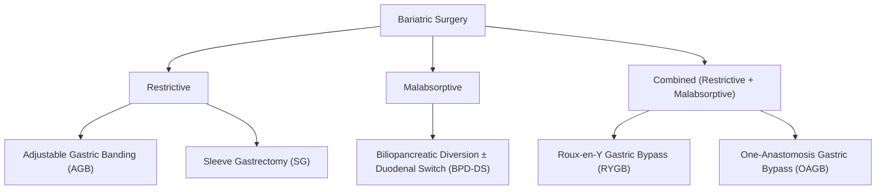

# Bariatric Surgery

## 1. Definition

**Bariatric surgery** (from Greek: *baros* = weight, *iatrike* = medical treatment) refers to a group of surgical procedures performed on the gastrointestinal tract to achieve sustained weight loss in patients with clinically severe obesity, typically after failure of conservative medical management. These procedures work through **restriction** (limiting gastric capacity → early satiety), **malabsorption** (bypassing segments of small bowel → reduced nutrient absorption), or a **combination of both**, and increasingly are recognised to exert profound **metabolic/hormonal effects** independent of weight loss per se — hence the modern term ***metabolic surgery*** [1][2].

<Callout title="Why 'Metabolic Surgery'?">
The term has shifted from purely "bariatric" to "metabolic" because procedures like Roux-en-Y gastric bypass can induce Type 2 Diabetes Mellitus (T2DM) remission within days — long before significant weight loss occurs. This is driven by changes in gut hormones (especially GLP-1, PYY, ghrelin), bile acid signalling, and gut microbiome composition. The surgery treats the *metabolic syndrome*, not just the weight.
</Callout>

---

## 2. Epidemiology and the Obesity Problem

### Global Context
- Worldwide obesity has nearly **tripled since 1975** (WHO 2024). Over 1 billion people globally are now obese (BMI ≥ 30 kg/m²).
- Obesity is a leading modifiable risk factor for T2DM, cardiovascular disease, obstructive sleep apnoea, non-alcoholic fatty liver disease (NAFLD/MASLD), and multiple cancers.

### Hong Kong Context
- Prevalence of obesity (BMI ≥ 30 by WHO Asian criteria) is rising: ~30% of adults in HK are overweight/obese by Asian cut-offs.
- **Asian populations develop metabolic complications at lower BMI thresholds** compared to Caucasians — hence lower BMI cut-offs for surgical indications (see below).
- Bariatric surgery volume in HK has increased significantly, primarily **laparoscopic sleeve gastrectomy (LSG)**, which is the most commonly performed bariatric procedure in HK and globally [1][2].

### Risk Factors for Severe Obesity (requiring surgical consideration)
- Genetic predisposition (polygenic; rarely monogenic e.g. MC4R mutations, leptin deficiency)
- Sedentary lifestyle and caloric excess
- Endocrine causes: hypothyroidism, Cushing syndrome, insulinoma, hypothalamic lesions
- Medications: corticosteroids, atypical antipsychotics, insulin, sulfonylureas, valproate
- Psychological/behavioural: binge eating disorder, depression, childhood trauma
- Socioeconomic factors

---

## 3. Anatomy and Physiology Relevant to Bariatric Surgery

### 3.1 Gastric Anatomy

Understanding the stomach's anatomy is essential because bariatric procedures physically alter it:

| Structure | Relevance to Bariatric Surgery |
|---|---|
| **Fundus** | Highly distensible; main reservoir. Removed in sleeve gastrectomy. Contains most ghrelin-producing cells |
| **Body (Corpus)** | Parietal cells (HCl) and chief cells (pepsinogen). Partially preserved in most procedures |
| **Antrum** | Gastrin-producing G cells; mixes food. Preserved in RYGB pouch but excluded from food stream |
| **Pylorus** | Controls gastric emptying. Preserved in sleeve gastrectomy (important for preventing dumping). Bypassed in RYGB |
| **Greater curvature** | Blood supply from gastroepiploic arcade; line of resection in sleeve gastrectomy |
| **Lesser curvature** | Blood supply from left/right gastric arteries; preserved as the "sleeve" |
| **Angle of His** | Gastroesophageal junction angle; maintained in sleeve to preserve anti-reflux mechanism |

### 3.2 Small Bowel Anatomy

Relevant to malabsorptive procedures:

- **Duodenum**: Main site of iron, calcium, folate absorption; bypassed in RYGB and BPD-DS → deficiency risk
- **Jejunum**: Carbohydrate and protein absorption; bypassed in RYGB (alimentary limb)
- **Ileum**: Bile salt reabsorption (terminal ileum), Vitamin B12 absorption, GLP-1/PYY secretion (L-cells concentrated distally)

### 3.3 Key Hormones in Appetite and Metabolism

| Hormone | Source | Effect | Change After Bariatric Surgery |
|---|---|---|---|
| ***Ghrelin*** | Fundus of stomach (P/D1 cells) | **Orexigenic** (stimulates appetite); rises before meals | **↓↓ after sleeve gastrectomy** (fundus removed). Variable after RYGB |
| ***GLP-1 (Glucagon-Like Peptide-1)*** | L-cells (distal ileum/colon) | **Incretin effect**: stimulates insulin secretion, suppresses glucagon, slows gastric emptying, promotes satiety | ***↑↑ after RYGB*** (rapid nutrient delivery to distal gut → exaggerated incretin response) — **key mechanism for T2DM remission** |
| **PYY (Peptide YY)** | L-cells (distal ileum/colon) | **Anorexigenic** (suppresses appetite), slows GI motility | ↑ after RYGB |
| **Leptin** | Adipose tissue | Signals satiety to hypothalamus; levels proportional to fat mass | ↓ with weight loss (reduced fat mass) |
| **Insulin** | Pancreatic β-cells | Anabolic; promotes glucose uptake | Improved sensitivity; reduced hyperinsulinaemia |
| **Cholecystokinin (CCK)** | I-cells (duodenum/jejunum) | Stimulates satiety, gallbladder contraction, pancreatic secretion | Variable changes |

<Callout title="The Hindgut Hypothesis" type="idea">
After RYGB, undigested nutrients reach the distal small bowel (hindgut) much faster than normal. This stimulates L-cells to release GLP-1 and PYY in an exaggerated fashion — the so-called "hindgut hypothesis." This explains why diabetes improves rapidly post-RYGB, even before significant weight loss. It is essentially surgically induced incretin enhancement — the same principle behind GLP-1 receptor agonist drugs like semaglutide!
</Callout>

---

## 4. Indications for Bariatric Surgery

### 4.1 Standard Indications (Asian Cut-offs)

***Failed medical treatment*** (lifestyle modification ± pharmacotherapy for ≥ 6–12 months) **PLUS** [1][2]:

| Criterion | BMI Threshold (Asian) |
|---|---|
| ***BMI ≥ 35 kg/m²*** | With or without comorbidities |
| ***BMI ≥ 30 kg/m²*** | ***With T2DM*** or other obesity-related comorbidities (hypertension, OSA, NAFLD, dyslipidaemia) |
| BMI ≥ 27.5 kg/m² (emerging) | With poorly controlled T2DM — "metabolic surgery" indication per IFSO-APC 2024 guidelines |

> For **Caucasian populations**, the traditional NIH 1991 criteria use BMI ≥ 40, or BMI ≥ 35 with comorbidities. Asian thresholds are **5 units lower** because Asians develop metabolic complications at lower BMIs due to higher visceral adiposity for a given BMI.

### 4.2 Contraindications [2]

***Contraindications*** include:

- ***Reversible endocrine causes*** of obesity (e.g. untreated hypothyroidism, Cushing syndrome) — must be excluded and treated first
- ***Active psychiatric disorders*** (uncontrolled; must be stabilised)
- ***Active substance abuse*** (alcohol, drugs)
- ***Non-compliance to medical care*** / inability to adhere to lifelong follow-up and supplementation
- Pregnancy or planning pregnancy within 12–18 months
- Advanced malignancy with poor prognosis
- Inability to tolerate general anaesthesia
- Active peptic ulcer disease (relative; treat first)

<Callout title="Exam Pearl" type="error">
A common exam mistake: listing obesity itself as an indication. The question is always *which patients* warrant surgery. You must state: (1) failed conservative management, (2) specific BMI threshold, and (3) absence of contraindications. For Asians, the thresholds are lower — this is frequently tested.
</Callout>

---

## 5. ABCD Score — Predicting T2DM Remission After Bariatric Surgery

***The ABCD score*** is a validated scoring system predicting likelihood of T2DM remission after metabolic/bariatric surgery [2]:

| Parameter | Points |
|---|---|
| ***A — Age*** | Younger age → higher score (better β-cell reserve) |
| ***B — BMI*** | Higher BMI → higher score (more weight to lose → greater metabolic improvement) |
| ***C — C-peptide*** | Higher C-peptide → higher score (reflects residual β-cell function; if β-cells are burned out, surgery won't restore insulin secretion) |
| ***D — Duration of DM*** | Shorter duration → higher score (less β-cell apoptosis) |

- ***Total score = 10***
- ***Score > 6 predicts DM remission after bariatric surgery*** [2]

<Callout title="Why C-peptide?">
C-peptide is co-secreted with insulin in a 1:1 molar ratio from β-cells. Unlike insulin, it is not cleared by the liver and has a longer half-life, making it a reliable marker of endogenous insulin production. A high C-peptide means the pancreas still has functional β-cells — the hormonal changes from surgery (↑GLP-1, improved insulin sensitivity) can "rescue" these cells. A very low C-peptide suggests near-complete β-cell destruction (as in longstanding T2DM or T1DM), and surgery will not reverse diabetes.
</Callout>

---

## 6. Classification and Types of Bariatric Procedures

### 6.1 Overview by Mechanism [2]

### 6.2 Detailed Procedure Descriptions

---

#### A. ***Restrictive Procedures*** — Cause early satiety; overeating → upper abdominal pain [2]

##### i. Adjustable Gastric Banding (AGB) (Lap-Band)

- **Mechanism**: A silicone **cuff/band** is placed around the proximal stomach (just below the GEJ), creating a small pouch above the band. The band is connected to a **subcutaneous port** through which saline can be injected to **inflate/tighten** the band or withdrawn to **loosen** it, allowing adjustable restriction [2].
- **Advantages**: Reversible, adjustable, no GI anastomosis, lowest perioperative risk
- **Disadvantages**: Poorest long-term weight loss; high reoperation rate (30–50%)
- **Largely fallen out of favour** — rarely performed now due to high complication and failure rates

##### ii. ***Sleeve Gastrectomy (SG)*** — Most commonly performed bariatric procedure worldwide and in HK

- **Mechanism**: Approximately **75–80% of the stomach is resected** along the **greater curvature**, leaving a narrow tubular "sleeve" along the **lesser curvature**, roughly the width of a bougie (32–40 Fr). The **fundus is removed** — this is where most **ghrelin-producing cells** reside.
- **Effects**:
  - **Restrictive**: Dramatically reduced gastric volume (from ~1000 mL to ~100–150 mL) → early satiety
  - **Hormonal**: ↓↓ Ghrelin (fundus removed) → reduced hunger drive; also ↑ GLP-1 and PYY (though less than RYGB) due to accelerated gastric emptying and faster nutrient delivery to distal gut
  - **Pylorus preserved** → more physiological gastric emptying than RYGB; lower risk of dumping syndrome
- **Advantages**: Technically simpler (no anastomosis to bowel), no foreign body, no malabsorption of most nutrients, good weight loss
- **Disadvantages**: Irreversible; risk of staple line leak; can worsen GORD (controversial but recognised)

---

#### B. ***Combined (Restrictive + Malabsorptive) Procedures***

##### iii. ***Roux-en-Y Gastric Bypass (RYGB)*** — Gold standard; best long-term data

- **Mechanism**: 
  1. A small **gastric pouch** (~30 mL) is created from the proximal stomach, completely divided from the gastric remnant
  2. The jejunum is divided ~50–75 cm from the ligament of Treitz
  3. The distal cut end of jejunum is brought up and anastomosed to the gastric pouch — this is the ***Roux (alimentary) limb*** (where food travels)
  4. The proximal cut end (carrying bile and pancreatic secretions) is anastomosed further downstream to the Roux limb — this is the ***biliopancreatic (BP) limb***
  5. The point where bile/pancreatic secretions meet food is the ***common channel*** — absorption only occurs here
  
- **Effects**:
  - **Restrictive**: Tiny pouch → early satiety
  - **Malabsorptive**: Duodenum and proximal jejunum bypassed → reduced absorption of iron, calcium, folate, fat-soluble vitamins
  - ***Hormonal (most important)***: Rapid nutrient delivery to distal gut → ***↑↑ GLP-1, PYY*** → enhanced incretin effect → **T2DM remission** (hindgut hypothesis); also foregut exclusion reduces anti-incretin factors (foregut hypothesis)
  - **Dumping syndrome** can occur (see complications) — acts as negative reinforcement against simple sugar intake

##### iv. One-Anastomosis Gastric Bypass (OAGB / Mini Gastric Bypass)

- Similar to RYGB but with only **one anastomosis** (loop gastrojejunostomy rather than Roux-en-Y configuration)
- Simpler, shorter operative time
- Concern: potential for **bile reflux** into the gastric pouch/oesophagus (theoretical carcinogenesis risk)
- Gaining popularity but less long-term data than RYGB

---

#### C. ***Predominantly Malabsorptive Procedures***

##### v. Biliopancreatic Diversion ± Duodenal Switch (BPD-DS)

- **Mechanism**: Sleeve gastrectomy PLUS bypass of a large portion of small bowel. The common channel (where food meets bile/pancreatic juice) is very short (~75–100 cm).
- **Effects**: Greatest weight loss but highest nutritional complication rate
- **Rarely performed** due to severe malabsorption, nutritional deficiencies, and complexity
- Largely reserved for super-morbid obesity (BMI > 50)

---

### 6.3 Comparison Table of Major Procedures

| Feature | Gastric Banding | ***Sleeve Gastrectomy*** | ***RYGB*** | BPD-DS |
|---|---|---|---|---|
| **Mechanism** | ***Restriction*** | ***Restriction + hormonal*** | ***Restriction + malabsorption + hormonal*** | Malabsorption (predominant) + restriction |
| **Excess Weight Loss (% EWL)** | 40–50% | 55–70% | 60–80% | 70–85% |
| **T2DM remission rate** | ~45% | ~60% | ***~80%*** (highest for RYGB) | ~95% |
| **Reversibility** | ***Reversible*** | Irreversible | Technically reversible but rarely done | Irreversible |
| **Operative complexity** | Simple | Intermediate | Complex (2 anastomoses) | Most complex |
| **Perioperative mortality** | 0.05% | 0.1–0.3% | 0.2–0.5% | 0.5–1% |
| **Nutritional deficiency risk** | Low | Low–moderate | ***Moderate–high*** (Fe, Ca, B12, folate, fat-sol vitamins) | Very high |
| **GORD** | May improve | ***May worsen*** | ***Improves (best for GORD)*** | Improves |
| **Dumping syndrome** | No | Rare | ***Yes (common)*** | Yes |
| **Popularity (2024)** | Declining | ***Most popular globally*** | Second most popular | Rare |

---

## 7. Preoperative Assessment and Surgical Nutrition

This section draws heavily on ***surgical nutrition principles*** [3].

### 7.1 Nutritional Assessment Before Surgery

***"Feed him up before surgery"*** — malnourished patients have significantly worse surgical outcomes [3].

***Malnutrition screening and assessment*** is essential preoperatively:

- ***Subjective Global Assessment (SGA)*** — gold standard bedside nutritional assessment tool:
  - Combines history (weight change, dietary intake, GI symptoms, functional capacity) with physical examination (subcutaneous fat loss, muscle wasting, oedema)
  - Classifies patients as: **A** (well-nourished), **B** (mildly/moderately malnourished), **C** (severely malnourished)

- ***Objective nutritional markers***:
  - ***Albumin***: Half-life ~20 days; reflects chronic nutritional status but also acute phase reactant (↓ in inflammation, liver disease, losses)
  - ***Prealbumin (transthyretin)***: Half-life ~2 days; more sensitive to acute nutritional changes
  - ***Transferrin***: Half-life ~8 days
  - **BMI, weight loss trajectory**
  - **Handgrip strength** (functional measure of sarcopenia)

<Callout title="Important" type="error">
***Obese patients can be malnourished!*** This is called "sarcopenic obesity" — adequate or excess fat mass but depleted lean body mass. Do not assume a high BMI = adequate nutrition. Bariatric surgery candidates may have micronutrient deficiencies (iron, vitamin D, B12, folate) even before surgery due to poor dietary quality. Always screen and correct deficiencies preoperatively [3].
</Callout>

### 7.2 Consequences of Malnutrition in Surgical Patients [3]

***Effects of malnutrition*** on surgical outcomes:

| System | Effect of Malnutrition |
|---|---|
| ***Immune function*** | ***↓ Immune function → increased infection risk (wound infections, pneumonia, sepsis)*** |
| ***Wound healing*** | ***Impaired collagen synthesis → poor wound healing, anastomotic dehiscence*** |
| ***Respiratory*** | ***Respiratory muscle weakness → difficulty weaning from ventilator, atelectasis*** |
| ***GI function*** | ***Gut mucosal atrophy → bacterial translocation → sepsis*** |
| ***Cardiac*** | Cardiac muscle wasting → reduced cardiac output |
| ***Psychological*** | Apathy, depression → poor rehabilitation |

### 7.3 Perioperative Nutritional Support [3]

***Key principles***:

1. ***"If the gut works, use it"*** — **enteral nutrition is always preferred over parenteral** [3]
2. ***Early enteral feeding*** is beneficial (within 24–48 hours post-surgery when safe)
3. Preoperative nutritional optimisation (***"prehabilitation"***): aim to correct deficiencies 2–4 weeks before elective surgery

#### Enteral Nutrition [3]

- **Definition**: Nutrition delivered via the GI tract — orally or via feeding tube
- ***Routes***:
  - **Oral**: First line if patient can swallow safely
  - **Nasogastric tube (NGT)**: Short-term ( < 4–6 weeks); stomach must be functional
  - **Nasojejunal tube (NJT)**: Bypasses stomach; useful if gastroparesis or post-gastric surgery
  - ***Percutaneous Endoscopic Gastrostomy (PEG)***: For long-term feeding ( > 4–6 weeks); placed endoscopically through abdominal wall into stomach
  - **Percutaneous Endoscopic Jejunostomy (PEJ)** or **surgical jejunostomy**: For long-term feeding bypassing the stomach

- ***Advantages of enteral over parenteral*** [3]:
  - ***Maintains gut mucosal integrity*** (prevents villous atrophy and bacterial translocation)
  - ***Lower infection risk*** (no central line → no CRBSI)
  - ***Cheaper***
  - ***More physiological*** (stimulates gut hormones, bile flow, immune function)
  - ***Fewer metabolic complications***

- ***Complications of enteral feeding***:
  - **Aspiration pneumonia** (especially NGT in patients with poor GCS or GORD)
  - **Diarrhoea** (osmotic; too rapid infusion; bacterial contamination of feed)
  - **Tube displacement or blockage**
  - ***Refeeding syndrome*** (see below)
  - Abdominal distension, nausea

#### Parenteral Nutrition (PN) [3]

- **Definition**: Intravenous delivery of nutrients (amino acids, glucose, lipids, electrolytes, vitamins, trace elements) bypassing the GI tract entirely
- ***Indications*** — when the gut **cannot be used** or is **insufficient**:
  - ***Intestinal failure*** (short bowel syndrome, severe Crohn's, radiation enteritis)
  - ***Prolonged ileus or bowel obstruction***
  - ***High-output intestinal fistula***
  - ***Severe pancreatitis*** (if enteral not tolerated — note: modern practice favours early enteral even in pancreatitis)
  - Perioperative when enteral not feasible for > 7 days

- ***Routes***:
  - **Peripheral PN (PPN)**: Lower osmolality solutions; for short-term use ( < 2 weeks); limited by peripheral vein tolerance (risk of phlebitis if osmolality > 900 mOsm/L)
  - ***Central PN (TPN — Total Parenteral Nutrition)***: Via central venous catheter (subclavian, internal jugular, PICC); higher osmolality solutions can be given; for longer-term use

- ***Complications of parenteral nutrition*** [3]:
  - **Line-related**: ***Catheter-related bloodstream infection (CRBSI)*** (most feared), pneumothorax (insertion), thrombosis, air embolism
  - **Metabolic**: ***Hyperglycaemia*** (commonest), electrolyte imbalance, ***hepatic steatosis/cholestasis*** (with prolonged use — "PN-associated liver disease"), hypertriglyceridaemia
  - ***Refeeding syndrome***
  - **Gut atrophy** with prolonged use (no enteral stimulation → villous atrophy → bacterial translocation)

<Callout title="Refeeding Syndrome" type="error">
***Refeeding syndrome*** occurs when a chronically malnourished patient is fed too rapidly (enterally or parenterally). The shift from fat/protein catabolism to carbohydrate metabolism drives insulin secretion → intracellular shift of ***phosphate, potassium, and magnesium*** → ***severe hypophosphataemia*** (hallmark), hypokalaemia, hypomagnesaemia. This can cause cardiac arrhythmias, heart failure, seizures, respiratory failure, and death.

***Prevention***: Start feeding slowly ("start low, go slow"), monitor electrolytes closely (especially phosphate), and supplement prophylactically. High-risk groups: anorexia nervosa, chronic alcoholism, prolonged starvation, cancer cachexia [3].
</Callout>

---

## 8. Clinical Features — Presentation of the Obese Patient Being Considered for Bariatric Surgery

### 8.1 Symptoms (with pathophysiological basis)

Patients presenting for bariatric surgery consultation typically have:

| Symptom | Pathophysiological Basis |
|---|---|
| **Excessive weight / inability to lose weight** | Energy imbalance; possible leptin resistance (hypothalamus "deaf" to satiety signals); genetic predisposition |
| **Joint pain (knees, hips, lumbar spine)** | Mechanical loading on weight-bearing joints → accelerated osteoarthritis. Every 1 kg of weight = 3–5 kg extra force across the knee joint |
| **Snoring / witnessed apnoeas / daytime somnolence** | ***Obstructive sleep apnoea (OSA)***: pharyngeal fat deposition → upper airway collapse during sleep → intermittent hypoxia → daytime sleepiness, ↑ cardiovascular risk |
| **Exertional dyspnoea** | Obesity hypoventilation syndrome; ↓ lung compliance (abdominal fat restricts diaphragmatic excursion); ↑ work of breathing; may have coexistent heart failure |
| **Heartburn / acid regurgitation** | ***GORD***: ↑ intra-abdominal pressure → incompetent LES → acid reflux; also hiatal hernia more common in obesity |
| **Polyuria, polydipsia** | T2DM: insulin resistance → hyperglycaemia → osmotic diuresis |
| **Skin changes (acanthosis nigricans, skin tags, intertrigo)** | Insulin resistance → hyperinsulinaemia → keratinocyte/fibroblast proliferation (acanthosis nigricans); skin folds → moisture trapping → fungal/bacterial infection (intertrigo) |
| **Menstrual irregularity / subfertility** | ***PCOS***: hyperinsulinaemia → ovarian androgen excess → anovulation; also ↑ aromatisation of androgens to oestrogens in adipose tissue |
| **Depression / low self-esteem** | Psychosocial stigma; neuroinflammation from chronic low-grade inflammation; leptin/serotonin pathway dysregulation |
| **Headaches (pseudotumour cerebri)** | Idiopathic intracranial hypertension — mechanism unclear but associated with obesity, especially in young women |

### 8.2 Signs (with pathophysiological basis)

| Sign | Pathophysiological Basis |
|---|---|
| **↑ BMI, ↑ waist circumference** | Central/visceral adiposity — metabolically more active and harmful than subcutaneous fat; produces inflammatory cytokines (TNF-α, IL-6) |
| **Elevated blood pressure** | Hyperinsulinaemia → Na+ retention, sympathetic activation; RAAS activation; endothelial dysfunction |
| ***Acanthosis nigricans*** (velvety hyperpigmentation in skin folds — neck, axillae, groin) | Hallmark of **insulin resistance**; insulin and IGF-1 stimulate epidermal keratinocyte and fibroblast proliferation |
| **Skin tags (acrochordons)** | Associated with insulin resistance (same mechanism) |
| **Intertrigo** (erythema in skin folds) | Maceration from moisture in deep skin folds → secondary candidal/bacterial infection |
| **Hepatomegaly** | ***NAFLD/MASLD*** — hepatic steatosis from insulin resistance → lipogenesis in liver |
| **Striae (stretch marks)** | Rapid weight gain → dermis stretching beyond elastic limit → collagen rupture |
| **Bilateral leg oedema** | Chronic venous insufficiency (obesity → ↑ venous pressure in lower limbs); may also be right heart failure, hypoalbuminaemia |
| **Mallampati class III/IV** (difficult airway) | Pharyngeal fat deposition, short thick neck → anaesthetic concern |
| **Neck circumference > 43 cm (men), > 41 cm (women)** | Strong predictor of OSA |

---

## 9. Obesity-Related Comorbidities (The Metabolic Syndrome)

***The metabolic syndrome*** is a cluster of interconnected metabolic abnormalities driven by visceral obesity and insulin resistance:

**Diagnostic criteria (IDF 2005 — Asian cut-offs):**
- Central obesity: waist circumference ≥ 90 cm (men) or ≥ 80 cm (women) in Asians
- Plus ≥ 2 of:
  - Triglycerides ≥ 1.7 mmol/L
  - HDL < 1.03 mmol/L (men) or < 1.29 mmol/L (women)
  - BP ≥ 130/85 mmHg or on treatment
  - Fasting glucose ≥ 5.6 mmol/L or diagnosed T2DM

***Bariatric surgery can achieve remission of metabolic syndrome components*** — this is the key rationale for metabolic surgery [1][2].

| Comorbidity | Mechanism | Resolution Rate After Bariatric Surgery |
|---|---|---|
| ***T2DM*** | Insulin resistance + progressive β-cell failure | ***~80% remission after RYGB*** (via ↑GLP-1, ↑insulin sensitivity) |
| Hypertension | ↑ SNS activity, Na+ retention, RAAS activation | ~60–70% improvement |
| Dyslipidaemia | ↑ VLDL synthesis, ↓ HDL | ~70% improvement |
| ***OSA*** | Pharyngeal fat, central respiratory drive affected | ~85% improvement |
| NAFLD/MASLD | Hepatic insulin resistance → steatosis → steatohepatitis | ~90% improvement in steatosis |
| GORD | ↑ IAP, hiatal hernia | Improves after RYGB; may worsen after SG |

---

## 10. Relevance of Surgical Oncology Principles

While bariatric surgery is not oncological surgery per se, the ***principles of surgical oncology*** are relevant because: [4]

1. ***Obesity is a risk factor for multiple cancers*** — endometrial, breast (post-menopausal), colorectal, oesophageal adenocarcinoma, hepatocellular, pancreatic, renal cell, gastric
2. Bariatric surgery has been shown to ***reduce cancer incidence*** by 33–50% (Swedish Obese Subjects study)
3. ***Preoperative nutritional optimisation*** principles apply equally to bariatric and cancer surgery [3][4]
4. ***Enhanced Recovery After Surgery (ERAS)*** protocols — originally developed for colorectal surgery — are now standard in bariatric surgery:
   - ***Early oral feeding***
   - ***Early mobilisation***
   - ***Multimodal analgesia*** (opioid-sparing)
   - ***VTE prophylaxis*** (obese patients are high VTE risk)

<Callout title="High Yield: Obesity and Cancer">
***Mechanism of obesity → cancer***: (1) Chronic hyperinsulinaemia → ↑IGF-1 → mitogenic signalling (cell proliferation, anti-apoptosis); (2) ↑ aromatase activity in adipose tissue → ↑ oestrogen → oestrogen-dependent tumours (endometrial, breast); (3) Chronic low-grade inflammation (↑TNF-α, IL-6) → pro-tumorigenic microenvironment; (4) Altered adipokines (↓ adiponectin, ↑ leptin) [4].
</Callout>

---

## 11. Connection to Inflammatory Bowel Disease (IBD)

While IBD is not directly related to bariatric surgery, the lecture slides on ***IBD*** [5] highlight important principles of nutritional management in surgical patients:

- ***Crohn's disease*** patients may develop **strictures requiring surgical resection** → risk of **short bowel syndrome** → may require long-term PN
- ***Nutritional deficiencies*** in IBD (iron, B12, folate, zinc, vitamin D) parallel those seen post-bariatric surgery
- ***Exclusive enteral nutrition (EEN)*** is a first-line treatment for paediatric Crohn's disease — demonstrating the therapeutic power of nutritional management
- The ***gut microbiome*** is altered in both IBD and post-bariatric surgery, contributing to metabolic changes

---

## 12. Gastric Cancer Context

The lecture on ***gastric cancer*** [1] is relevant because:

- ***Weight loss and vomiting*** in the context of gastric cancer must be distinguished from post-bariatric surgery complications
- ***Post-gastrectomy nutritional consequences*** (dumping syndrome, vitamin B12 deficiency, iron deficiency) are identical to those after RYGB because both involve gastric bypass/resection
- ***Abdominal imaging*** techniques (CT, US) used to assess gastric cancer are the same modalities used to assess bariatric surgery complications (e.g., CT with oral contrast for suspected anastomotic leak)
- ***Staging of gastric cancer*** involves nutritional assessment — just as bariatric surgery requires preoperative nutritional optimisation [1][3]

---

<Callout title="High Yield Summary">

**Definition**: Bariatric (metabolic) surgery = surgical procedures on the GI tract for sustained weight loss and metabolic improvement in severe obesity after failed conservative management.

**Key Indications (Asian)**: Failed medical Rx + BMI ≥ 35 (with/without comorbidities) OR BMI ≥ 30 with T2DM.

**Contraindications**: Reversible endocrine causes, active psychiatric disorders, substance abuse, non-compliance.

**ABCD Score**: Age, BMI, C-peptide, Duration of DM. Total = 10. Score > 6 → predicts T2DM remission.

**Procedures**:
- **Restrictive**: Gastric banding (declining), Sleeve gastrectomy (most popular)
- **Combined**: RYGB (gold standard for metabolic effect, ~80% T2DM remission)
- **Malabsorptive**: BPD-DS (rarely done)

**Key Hormonal Changes**: ↓ Ghrelin (especially SG — fundus removed), ↑↑ GLP-1 and PYY (especially RYGB — hindgut hypothesis) → T2DM remission.

**Nutritional Principles**: "If the gut works, use it" — enteral > parenteral. Correct deficiencies preoperatively. Watch for refeeding syndrome (hypophosphataemia hallmark). Obese patients can be malnourished (sarcopenic obesity).

**Preoperative Assessment**: Nutritional status (SGA), exclude reversible causes of obesity, assess comorbidities (OSA, T2DM, HTN, NAFLD), psychological evaluation.

</Callout>

---

<ActiveRecallQuiz
  title="Active Recall - Bariatric Surgery (Definition, Epidemiology, Anatomy, Etiology, Classification, Clinical Features)"
  items={[
    {
      question: "What are the BMI indications for bariatric surgery in Asian populations, and why are they different from Caucasian cut-offs?",
      markscheme: "BMI >= 35 (with or without comorbidities) OR BMI >= 30 with T2DM, after failed conservative management. Asian cut-offs are 5 units lower because Asians develop metabolic complications at lower BMIs due to higher visceral adiposity for a given BMI.",
    },
    {
      question: "Explain the ABCD score: what does each letter stand for, the total score, and the threshold that predicts T2DM remission after bariatric surgery.",
      markscheme: "A = Age (younger = higher score), B = BMI (higher = higher score), C = C-peptide (higher = higher score, reflects beta-cell reserve), D = Duration of DM (shorter = higher score). Total = 10. Score > 6 predicts DM remission.",
    },
    {
      question: "Why does Roux-en-Y gastric bypass achieve higher T2DM remission rates than sleeve gastrectomy? Explain the hormonal mechanism.",
      markscheme: "RYGB delivers undigested nutrients rapidly to the distal gut (hindgut hypothesis), causing exaggerated GLP-1 and PYY release from L-cells. GLP-1 is an incretin that stimulates insulin secretion, suppresses glucagon, and improves insulin sensitivity. This effect is greater in RYGB than SG because RYGB bypasses more proximal gut. SG mainly reduces ghrelin (fundus removal) with less incretin enhancement.",
    },
    {
      question: "Why is enteral nutrition preferred over parenteral nutrition? List at least 4 advantages.",
      markscheme: "1. Maintains gut mucosal integrity (prevents villous atrophy and bacterial translocation). 2. Lower infection risk (no central line, no CRBSI). 3. Cheaper. 4. More physiological (stimulates gut hormones, bile flow, immune function). 5. Fewer metabolic complications (less hyperglycaemia, hepatic steatosis).",
    },
    {
      question: "What is refeeding syndrome? Name the hallmark electrolyte abnormality and explain why it occurs.",
      markscheme: "Refeeding syndrome occurs when a chronically malnourished patient is fed too rapidly. Carbohydrate reintroduction drives insulin secretion, which causes intracellular shift of phosphate, potassium, and magnesium. Hallmark = severe hypophosphataemia. Can cause cardiac arrhythmias, heart failure, respiratory failure, seizures, and death. Prevention: start low, go slow; monitor and supplement electrolytes.",
    },
    {
      question: "List 3 contraindications to bariatric surgery.",
      markscheme: "Any 3 of: (1) Reversible endocrine causes of obesity (e.g. untreated hypothyroidism, Cushing syndrome), (2) Active/uncontrolled psychiatric disorders, (3) Active substance abuse, (4) Non-compliance to medical care/inability to adhere to lifelong follow-up, (5) Pregnancy or planning pregnancy within 12-18 months, (6) Advanced malignancy with poor prognosis.",
    },
  ]}
/>

---

## References

[1] Lecture slides: GC 212. Weight loss and vomiting gastric cancer; abdominal imaging.pdf
[2] Senior notes: maxim.md (section 3.8 Bariatric surgery)
[3] Lecture slides: GC 185. Feed him up before surgery Surgical nutrition, Enteral and parenteral feeding.pdf
[4] Lecture slides: GC 202. Surgery may cure your cancer Surgical oncology - Notes.pdf
[5] Lecture slides: Inflammatory bowel disease.pdf
