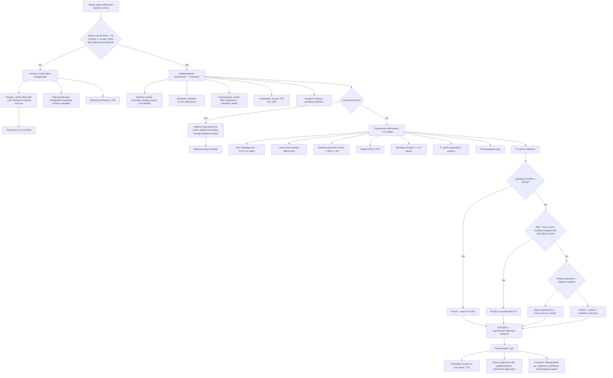

## Management of Bariatric Surgery — Algorithm and Treatment Modalities

The management of bariatric surgery is not simply "the operation." It is a **lifelong continuum** spanning preoperative optimisation, intraoperative surgical technique, and decades of postoperative care. Think of the operation itself as the midpoint, not the endpoint. The best bariatric outcomes come from **multidisciplinary programmes** where surgeon, physician/endocrinologist, dietitian, psychologist, exercise physiologist, and nursing specialist work in concert.

---

## 1. Master Management Algorithm

---

## 2. Conservative Management (Non-Surgical)

Every bariatric surgery candidate must have ***failed conservative management*** before qualifying for surgery [2]. Understanding what constitutes conservative management — and why it fails — is essential.

### 2.1 Lifestyle Intervention (First-Line, Always)

| Component | Detail | Why It Often Fails |
|---|---|---|
| **Dietary modification** | Caloric deficit of 500–750 kcal/day; structured meal plans; Mediterranean or DASH-type diets; reduce processed foods | Metabolic adaptation: as weight is lost, basal metabolic rate drops (the body "defends" its set point); hunger hormones (↑ ghrelin, ↓ leptin, ↓ PYY) increase — biology fights against sustained weight loss |
| **Physical activity** | 150–300 min/week moderate-intensity aerobic exercise + resistance training | Difficult in severe obesity due to joint pain, breathlessness, embarrassment; exercise alone produces modest weight loss (~2–3 kg) without dietary change |
| **Behavioural therapy** | CBT for eating behaviours; stimulus control; self-monitoring (food diary, weighing); stress management | Requires long-term engagement; relapse rates high without ongoing support |

> The fundamental problem: **lifestyle modification alone achieves ~3–5% body weight loss** on average, and **most patients regain weight within 2–5 years.** For a patient with BMI 45, this is clinically insignificant. This is precisely why surgery exists — it is the only intervention that produces **durable, sustained weight loss of 20–35%** total body weight.

### 2.2 Pharmacotherapy (Second-Line, Adjunct)

***Anti-obesity medications*** are increasingly important — some newer agents approach surgical levels of weight loss:

| Drug | Mechanism | Expected Weight Loss | Key Points |
|---|---|---|---|
| ***Semaglutide*** (Wegovy, 2.4 mg/week SC) | ***GLP-1 receptor agonist*** — mimics the incretin effect. Slows gastric emptying → early satiety. Acts on hypothalamic appetite centres → reduced hunger. ↑ Insulin secretion, ↓ glucagon | ~15–17% total body weight (STEP trials) | Game-changing drug; also has cardiovascular benefit. Common side effects: nausea, vomiting (usually self-limited). CI: personal/family history of medullary thyroid cancer, MEN2 (GLP-1RA → C-cell hyperplasia in animal models) |
| ***Tirzepatide*** (Mounjaro/Zepbound, SC weekly) | ***Dual GIP + GLP-1 receptor agonist*** — combines two incretin pathways | ~20–22% total body weight (SURMOUNT trials) — approaches surgical weight loss | Newest agent; even more effective than semaglutide for weight loss. Similar side effect profile |
| **Liraglutide** (Saxenda, 3.0 mg/day SC) | GLP-1 receptor agonist (shorter-acting than semaglutide) | ~8% total body weight | Older GLP-1RA; largely superseded by semaglutide for obesity indication |
| **Orlistat** (Xenical) | Pancreatic lipase inhibitor → blocks ~30% of dietary fat absorption in the gut | ~3–4% total body weight | Side effects: steatorrhoea, faecal urgency, fat-soluble vitamin malabsorption. Poor tolerability limits use |
| **Naltrexone-bupropion** (Contrave) | Naltrexone (opioid antagonist) + bupropion (noradrenaline-dopamine reuptake inhibitor) → synergistic effect on hypothalamic POMC neurons to reduce appetite | ~5–6% total body weight | CI: uncontrolled hypertension, seizure history, eating disorders (bupropion lowers seizure threshold) |
| **Phentermine-topiramate** (Qsymia) | Phentermine (sympathomimetic → noradrenaline release → appetite suppression) + topiramate (GABA enhancement, carbonic anhydrase inhibition → reduces appetite through multiple pathways) | ~10% total body weight | Not widely available outside USA. CI: cardiovascular disease, pregnancy (topiramate is teratogenic — cleft palate) |

<Callout title="GLP-1 Receptor Agonists and Bariatric Surgery" type="idea">
The GLP-1RA revolution has changed the bariatric landscape. Semaglutide and tirzepatide achieve weight loss that was previously only possible with surgery. However, key differences remain: (1) **Weight is regained when the drug is stopped** (surgery is permanent). (2) **Surgery still produces superior T2DM remission** (mechanical + hormonal changes > pharmacological GLP-1 alone). (3) Surgery is a **one-time intervention** vs lifelong medication (cost and compliance). (4) Some patients may use GLP-1RA as a **bridge to surgery** (preoperative weight loss → safer operation) or as **adjunct post-surgery** if weight loss is inadequate. The interplay between pharmacotherapy and surgery is the frontier of obesity medicine.
</Callout>

---

## 3. Preoperative Optimisation — "Feed Him Up Before Surgery"

Drawing directly from ***surgical nutrition principles*** [3], preoperative preparation is critical:

### 3.1 The Liver Shrinkage Diet

- ***Very Low Calorie Diet (VLCD)*** — typically 800–1000 kcal/day, high protein, low carbohydrate — for ***2–4 weeks before surgery***
- **Why?**: In morbid obesity, the ***left lobe of the liver is massively enlarged with fatty infiltration (steatosis)***. This enlarged liver sits directly over the gastro-oesophageal junction and proximal stomach — the operative field. An enlarged liver makes laparoscopic access extremely difficult and increases risk of intraoperative liver injury.
- The VLCD depletes hepatic glycogen stores (within 24–48 hours) and then mobilises hepatic triglycerides → liver shrinks by 10–20% in volume within 2 weeks. This provides **critical operative space**.
- Also initiates weight loss, improves glycaemic control, and psychologically prepares the patient for post-operative dietary changes.

### 3.2 Nutritional Correction [3]

- ***Correct all identified micronutrient deficiencies before surgery*** — especially iron, vitamin D, B12, folate, thiamine
- ***Protein optimisation***: Aim for 60–80 g protein/day preoperatively to preserve lean mass
- ***If severely malnourished (SGA Class C)***: Consider delaying surgery for 2–4 weeks of intensive nutritional support [3]

### 3.3 Medical Optimisation

| Comorbidity | Preoperative Target | Rationale |
|---|---|---|
| ***T2DM*** | ***HbA1c < 8%*** (ideally < 7.5%) | Hyperglycaemia → impaired wound healing (glycosylation of structural proteins, impaired neutrophil function, endothelial dysfunction) → increased surgical site infection |
| ***Hypertension*** | BP < 140/90 mmHg | Reduce perioperative cardiovascular risk |
| ***OSA*** | ***Initiate CPAP if AHI > 15*** | Untreated OSA → perioperative respiratory failure risk (desaturation during induction, post-extubation obstruction, opioid sensitivity); CPAP improves upper airway patency and oxygenation |
| ***Smoking*** | ***Cessation ≥ 4–6 weeks preoperatively*** | Smoking → impaired wound healing (nicotine causes vasoconstriction → tissue ischaemia), increased marginal ulcer risk post-RYGB, increased respiratory complications. Active smoking is a relative contraindication to RYGB |
| ***H. pylori*** | ***Eradicate if positive on preoperative OGD*** | Post-RYGB, the excluded gastric remnant is inaccessible to standard OGD → *H. pylori* in the remnant → risk of peptic ulcer, gastric cancer in a "blind" area. Also reduces marginal ulcer risk at the gastrojejunal anastomosis |
| **VTE risk** | Plan prophylaxis | All bariatric patients are high VTE risk (obesity + surgery + immobility). Plan: LMWH (enoxaparin 40 mg SC or weight-adjusted higher dose), pneumatic compression devices, early mobilisation |

### 3.4 Psychological Preparation

- Set **realistic expectations**: Average excess weight loss is 50–70% (not 100%). Weight loss plateaus at 12–18 months. Some weight regain (5–10%) is normal at 2–5 years.
- **Dietary counselling**: Post-operative diet progression (liquid → puree → soft → regular over 4–6 weeks). Lifelong small meals, high protein, low simple carbohydrate. No drinking with meals (fills the small pouch with liquid instead of nutrient-dense food).
- **Support groups**: Peer support improves long-term adherence.

---

## 4. Surgical Management — Procedure Details and Selection

### 4.1 Procedure Selection Algorithm

The choice of procedure is individualised based on:

| Factor | Influence on Procedure Choice |
|---|---|
| ***GORD*** | ***If significant GORD or Barrett's oesophagus → RYGB*** (SG may worsen GORD by increasing intragastric pressure and disrupting the angle of His) |
| **BMI** | BMI 30–45: SG or RYGB both excellent. BMI > 50 ("super-morbid"): RYGB or BPD-DS (greater weight loss needed); or staged approach (SG first → conversion to RYGB later if inadequate) |
| ***T2DM severity / ABCD score*** | ***Higher ABCD score → RYGB preferred*** (superior T2DM remission rates ~80% vs ~60% for SG) [2]. If primary goal is metabolic surgery, RYGB has the best evidence |
| **Surgeon expertise and centre volume** | High-volume bariatric centres have lower complication rates. Surgeon comfort with RYGB (technically more demanding) matters |
| **Patient preference** | After full informed consent discussing pros/cons of each procedure |
| **Need for endoscopic access to stomach** | RYGB creates an excluded gastric remnant that is difficult to access. If patient has known gastric pathology needing surveillance, SG preserves access. If in a region with high gastric cancer risk (East Asia), some argue for SG to maintain surveillance ability — though preoperative OGD with *H. pylori* eradication mitigates this [1] |
| **Revision surgery** | Failed SG → convert to RYGB (most common revision). Failed RYGB → lengthening of limbs, or conversion to BPD-DS |

### 4.2 Detailed Surgical Technique and Principles

#### A. ***Sleeve Gastrectomy (SG)*** — Most Commonly Performed Worldwide and in HK

**Technique**:
1. ***Laparoscopic approach*** (standard; open rare)
2. Patient in reverse Trendelenburg position (head up) → gravity pulls abdominal contents caudally, improving exposure
3. Mobilise greater curvature: divide gastrocolic ligament and short gastric vessels using energy device (LigaSure/Harmonic scalpel) from ~5 cm proximal to the pylorus up to the angle of His
4. Insert calibration bougie (32–40 Fr) along the lesser curvature — this determines sleeve width
5. ***Sequential stapled division*** of the stomach along the bougie using endoscopic linear staplers — from antrum to angle of His
6. The resected greater curvature (containing the fundus) is removed as specimen → sent to pathology
7. ***Staple line reinforcement***: Oversewing, buttress material, or fibrin sealant — reduces bleed and leak risk (technique varies by surgeon)
8. **No anastomosis** — this is a purely resective procedure
9. Test for leak intraoperatively: air insufflation via NGT with the staple line submerged in saline (look for bubbles) or methylene blue test

**Key technical points**:
- Starting point 5 cm from pylorus preserves the antral pump → maintained gastric emptying → lower dumping risk
- Bougie size matters: too narrow (< 32 Fr) → higher stenosis and leak risk; too wide (> 40 Fr) → less restriction → reduced weight loss
- The angle of His must be included in the resection to avoid a functional fundus remnant (which would dilate and reduce restriction)

#### B. ***Roux-en-Y Gastric Bypass (RYGB)***

**Technique**:
1. ***Laparoscopic approach*** (standard)
2. **Create gastric pouch**: Divide the stomach using endoscopic linear staplers to create a small pouch (~30 mL) from the cardia/proximal lesser curvature, completely separated from the gastric remnant
3. **Identify ligament of Treitz**: Trace small bowel distally from Treitz for ~50–75 cm → divide jejunum here
4. **Create the Roux (alimentary) limb**: Bring the distal cut end of jejunum up (antecolic or retrocolic route) and anastomose to the gastric pouch → ***gastrojejunostomy*** (using linear or circular stapler, or hand-sewn). This is where food enters the small bowel.
5. **Create the biliopancreatic (BP) limb reconnection**: Anastomose the proximal cut end of jejunum (carrying bile and pancreatic juice) to the Roux limb ~75–150 cm downstream from the gastrojejunostomy → ***jejunojejunostomy***
6. **Close mesenteric defects**: Peterson's space (between Roux limb mesentery and transverse mesocolon) and the jejunojejunostomy mesenteric defect → ***critical to prevent internal hernia*** [2]
7. Test gastrojejunostomy for integrity: methylene blue or air leak test

**Limb length terminology** (frequently tested):

| Limb | Definition | Clinical Significance |
|---|---|---|
| ***Biliopancreatic (BP) limb*** | From ligament of Treitz to the jejunojejunostomy — carries bile and pancreatic juice but no food | Length determines degree of malabsorption. Longer BP limb = more malabsorption |
| ***Roux (Alimentary) limb*** | From gastrojejunostomy to jejunojejunostomy — carries food but no digestive enzymes | Food travels through this limb undigested. Typical length: 75–150 cm |
| ***Common channel*** | From jejunojejunostomy to ileocaecal valve — where food meets bile/pancreatic juice and absorption occurs | Shorter common channel = more malabsorption. In standard RYGB, the common channel is long (most of the ileum) → moderate malabsorption. In BPD-DS, common channel is very short → severe malabsorption |

#### C. ***Adjustable Gastric Banding (AGB)*** — Historical; Rarely Performed Now

**Technique**: Silicone band placed around the proximal stomach via ***pars flaccida technique*** (through the lesser omentum), creating a small pouch above the band. ***Band is connected to a subcutaneous port*** (usually on the anterior rectus sheath) via silicone tubing. Saline is ***injected into the port*** to inflate/tighten the band (more restriction) or withdrawn to loosen it [2].

**Why it has fallen out of favour**:
- Poorest long-term weight loss (~40% EWL)
- High reoperation/removal rate (30–50% within 10 years)
- Complications: band slippage, band erosion into gastric wall, port-site infection, oesophageal dilation, reflux
- Entirely replaced by SG and RYGB in modern practice

#### D. ***Biliopancreatic Diversion with Duodenal Switch (BPD-DS)***

**Technique**: SG + division of duodenum just beyond the pylorus + bypass of most of the small bowel, leaving only ~75–100 cm common channel.

**Indication**: Super-morbid obesity (BMI > 50) where maximum weight loss is needed. Rarely performed due to severe nutritional complications.

---

## 5. Intraoperative Management Principles

| Principle | Detail | Rationale |
|---|---|---|
| ***Laparoscopic approach*** | Standard for all bariatric procedures | Lower wound complications (SSI, hernia) in obese patients; faster recovery; less pain; earlier mobilisation. Open approach reserved for complex revisions or conversions |
| **Pneumoperitoneum** | CO₂ insufflation to 15 mmHg | Higher pressures may be needed in obese patients for adequate working space but increase risk of haemodynamic compromise (↓ venous return, ↑ airway pressures) |
| **Patient positioning** | Reverse Trendelenburg + legs apart (French position) or supine split-leg | Improves exposure; reduces diaphragmatic splinting |
| **VTE prophylaxis** | Pneumatic compression devices applied pre-induction; LMWH given 2–12 hours preop or postop (varies by protocol) | Bariatric patients are among the highest-risk groups for VTE. Enoxaparin dose: 40 mg BD (some protocols use weight-adjusted 0.5 mg/kg BD) |
| **Antibiotic prophylaxis** | Single dose IV at induction (cefazolin 2–3 g — higher dose for BMI > 40) | Prevent SSI; dose must be weight-adjusted in obesity (standard 1 g dose is subtherapeutic) |
| ***Leak testing*** | Intraoperative air or methylene blue test of staple line/anastomosis | Early detection prevents missed leaks presenting as sepsis on the ward |

---

## 6. Postoperative Management

### 6.1 Immediate Postoperative Care (Day 0–3)

| Domain | Management | Rationale |
|---|---|---|
| ***Monitoring*** | ***Hourly vitals — especially HR*** (tachycardia > 120 bpm = concern for leak/bleed) [2] | Anastomotic leak is the most feared early complication. Tachycardia is the sentinel sign |
| ***Pain management*** | ***Multimodal analgesia*** — paracetamol + NSAIDs (if no contraindication) + local anaesthetic wound infiltration ± PCA opioid (minimize opioid use) | ***ERAS protocol***: opioid-sparing approach reduces ileus, respiratory depression (especially dangerous in OSA patients), nausea. Avoid NSAIDs if RYGB (marginal ulcer risk) — some centres avoid, others allow short courses |
| ***VTE prophylaxis*** | LMWH (enoxaparin 40 mg BD or weight-adjusted) + pneumatic compression + ***early mobilisation (day 0 — same day as surgery)*** | Obese patients are at very high VTE risk. Early ambulation is the single most important non-pharmacological measure |
| ***Diet*** | ***Clear liquids on day 0–1*** (sips of water once fully awake) → progress as tolerated | ***Early oral feeding*** is part of ERAS; maintains gut mucosal integrity [3]. Some centres perform routine upper GI contrast study on POD 1 before advancing diet |
| **Glucose monitoring** | Finger-prick glucose QID | Diabetic patients often have dramatic reduction in glucose within hours of surgery (especially RYGB — incretin effect). Must ***reduce or stop insulin/sulfonylureas immediately*** to avoid hypoglycaemia. Metformin usually stopped perioperatively (AKI risk) and cautiously restarted |
| **Respiratory care** | Incentive spirometry, chest physiotherapy, semi-upright positioning, ***CPAP if known OSA*** | Obese patients are at high risk of atelectasis, hypoventilation, and desaturation. OSA patients who stop CPAP postoperatively can develop life-threatening respiratory failure |

### 6.2 Dietary Progression — Postoperative Diet Protocol

This is one of the most practically important aspects of management, directly from ***nutritional principles*** [3]:

| Phase | Timing | Content | Rationale |
|---|---|---|---|
| **Phase 1: Clear liquids** | Day 0–1 | Water, clear broth, sugar-free jelly, diluted juice | Test tolerance; minimal stress on staple lines/anastomosis |
| **Phase 2: Full liquids** | Day 2 to Week 1–2 | Protein shakes, milk, smooth soups, yoghurt (strained) | Deliver protein (aim 60–80 g/day via supplements) while allowing surgical healing |
| **Phase 3: Puree** | Week 2–4 | Blended meats, hummus, pureed vegetables, cottage cheese | Gradual reintroduction of solid texture; still low volume (60–120 mL per meal) |
| **Phase 4: Soft solids** | Week 4–6 | Soft fish, scrambled eggs, soft cooked vegetables, ground meat | Test mechanical tolerance of the new gastric anatomy |
| **Phase 5: Regular diet** | Week 6+ | Small, protein-first meals; avoid simple sugars, carbonated drinks, tough meats | Lifelong dietary principles: eat slowly, chew thoroughly, protein with every meal, stop when full, no drinking with meals (displaces food from tiny pouch) |

<Callout title="Why 'Protein First'?">
After bariatric surgery, total food volume is drastically reduced. If the patient fills their small pouch/sleeve with carbohydrates or fats first, they will not have room for protein — leading to muscle wasting, hair loss, and poor wound healing. The rule of "protein first" ensures adequate protein intake (~60–80 g/day) within the limited volume. This is why every bariatric programme employs a dedicated dietitian.
</Callout>

### 6.3 Lifelong Supplementation Protocol

***All bariatric surgery patients require lifelong vitamin and mineral supplementation*** — the specific regimen depends on the procedure:

| Supplement | Sleeve Gastrectomy | RYGB | Rationale |
|---|---|---|---|
| **Multivitamin** (bariatric-specific) | 1 daily | 2 daily | Covers multiple micronutrients; higher dose for RYGB due to malabsorption |
| ***Vitamin B12*** | 1000 µg/day sublingual or 1000 µg IM monthly | 1000 µg/day sublingual or 1000 µg IM monthly | Reduced intrinsic factor production (SG: less gastric acid; RYGB: less acid + bypassed duodenum). Sublingual/IM bypasses GI absorption |
| ***Iron*** (with vitamin C) | 45–60 mg elemental iron/day | 45–60 mg elemental iron/day (may need IV iron if oral not tolerated/absorbed) | Duodenum bypassed in RYGB; reduced acid impairs Fe³⁺ → Fe²⁺ conversion. Vitamin C co-administration enhances non-haem iron absorption (reduces Fe³⁺ to Fe²⁺) |
| ***Calcium citrate*** (not carbonate) | 1200–1500 mg/day in divided doses | 1200–1500 mg/day in divided doses | ***Calcium citrate*** is preferred over carbonate because citrate does NOT require gastric acid for absorption — critical after SG/RYGB where acid is reduced. Calcium carbonate requires acid environment for ionisation and absorption |
| ***Vitamin D3*** | 3000 IU/day (titrate to 25-OH-D > 75 nmol/L) | 3000 IU/day (titrate to levels) | Fat-soluble vitamin; absorption impaired with fat malabsorption. Synergistic with calcium for bone health. Deficiency → secondary hyperparathyroidism → osteoporosis |
| ***Folate*** | 400–800 µg/day | 800–1000 µg/day | Absorbed in proximal jejunum (bypassed in RYGB). Essential for women of childbearing age (neural tube defect prevention — advise contraception for 12–18 months post-surgery) |
| **Thiamine (B1)** | As needed | As needed (especially if prolonged vomiting) | Rapidly depleted in starvation/vomiting. Deficiency → ***Wernicke encephalopathy*** (confusion, ophthalmoplegia, ataxia) — a surgical emergency. Supplement empirically if any prolonged vomiting post-bariatric surgery |
| **Zinc, copper** | Included in bariatric multivitamin | Included; may need additional supplementation | Zinc and copper compete for absorption (excess zinc → copper deficiency). Monitor levels annually |

<Callout title="Calcium Citrate vs Calcium Carbonate" type="error">
This is a commonly tested pharmacology point. ***Calcium carbonate requires an acidic environment for dissolution and absorption.*** After bariatric surgery (especially RYGB), gastric acid production is markedly reduced → calcium carbonate is poorly absorbed. ***Calcium citrate is soluble in any pH*** and does not require acid → it is the preferred calcium supplement in all bariatric surgery patients. This same principle applies to iron — ferrous fumarate or bisglycinate may be better tolerated and absorbed than ferrous sulfate in the achlorhydric post-bariatric stomach.
</Callout>

### 6.4 Medication Adjustment Post-Surgery

| Medication | Adjustment | Rationale |
|---|---|---|
| ***Insulin / Sulfonylureas*** | ***Reduce dose immediately (often by 50% or stop) on POD 0*** | Rapid improvement in insulin sensitivity post-surgery (especially RYGB). Continuing pre-op doses → ***severe hypoglycaemia***. Monitor glucose closely and titrate |
| **Metformin** | Stop perioperatively; restart when renal function confirmed normal and oral intake established | AKI risk perioperatively. After restart, may eventually discontinue if DM in remission |
| **Antihypertensives** | Reduce/stop as BP normalises | Weight loss → ↓ SNS activity, ↓ Na⁺ retention, ↓ RAAS activation → BP drops. Continuing unchanged doses → hypotension |
| **Statins** | Continue initially; reassess at 3–6 months when lipids improve | Many patients can reduce or stop statins as weight loss improves lipid profile |
| **CPAP** | Continue until OSA resolution confirmed by repeat polysomnography | OSA improves with weight loss but may take months; premature discontinuation → recurrence of apnoeas |
| ***NSAIDs*** | ***Avoid lifelong after RYGB*** | NSAIDs → prostaglandin inhibition → reduced mucosal blood flow → ***marginal ulcer*** at the unprotected gastrojejunal anastomosis. Use paracetamol or COX-2 inhibitors with caution instead |
| **Oral contraceptive pill** | Switch to non-oral contraception (IUD, implant, injection) post-RYGB | Malabsorption after RYGB may reduce OCP efficacy → unplanned pregnancy risk (pregnancy should be avoided for 12–18 months post-surgery due to rapid nutritional flux and teratogenicity concerns of deficiencies) |
| ***Crushed/liquid formulations*** | All oral medications should be ***crushed or given in liquid form*** for the first 2–4 weeks post-surgery | SG/RYGB → small gastric volume cannot accommodate large tablets; also, enteric-coated or extended-release formulations may not be properly absorbed. Transition back to whole tablets when tolerating solid food |

---

## 7. Management of Specific Postoperative Complications

### 7.1 Anastomotic / Staple Line Leak

| Aspect | Management |
|---|---|
| **Clinical suspicion** | ***Tachycardia > 120 bpm*** (earliest sign), fever, peritonism, raised WCC/CRP, tachypnoea |
| **Investigation** | ***CT abdomen with oral water-soluble contrast*** → extravasation confirms leak |
| **Management — depends on clinical stability and timing** | |
| *Stable, contained leak, early detection* | ***Nil by mouth + IV antibiotics + percutaneous drainage*** of any collection (interventional radiology). Consider endoscopic stent placement across the leak site. Start TPN if prolonged NPO anticipated [3] |
| *Unstable, free leak, peritonitis* | ***Emergency return to theatre*** → laparoscopic/open washout, attempt primary repair or drainage, wide drainage, +/- feeding jejunostomy for enteral nutrition distal to the leak [3] |
| **Nutritional support** | ***"If the gut works, use it"*** — if a feeding jejunostomy can be placed distal to the leak, enteral feeding is preferred over TPN [3]. If gut cannot be used → ***TPN via central line*** [3] |

### 7.2 Internal Hernia (Post-RYGB)

| Aspect | Management |
|---|---|
| **Presentation** | Colicky abdominal pain, vomiting, signs of SBO. Can present months to years post-RYGB |
| **Investigation** | CT: ***swirl sign*** |
| **Management** | ***Urgent surgical exploration*** (laparoscopic) — reduce hernia, assess bowel viability (if strangulated → resect necrotic segment), ***close all mesenteric defects*** |

### 7.3 Marginal Ulcer

| Aspect | Management |
|---|---|
| **Prevention** | ***Avoid NSAIDs lifelong. Eradicate H. pylori preoperatively. Smoking cessation.*** PPI for 3–6 months post-RYGB (some programmes use lifelong PPI) |
| **Treatment** | High-dose PPI (omeprazole 40 mg BD). Check and treat *H. pylori*. Stop NSAIDs and smoking. If refractory → surgical revision (excision of ulcer, revision of gastrojejunostomy) |

### 7.4 Dumping Syndrome

| Type | Management |
|---|---|
| ***Early dumping*** | ***Dietary modification*** (first-line): avoid simple sugars, eat small frequent meals, separate solids and liquids (drink 30 min before or after meals, not during), increase fibre and protein. Lie down after meals if symptomatic |
| ***Late dumping*** | Dietary modification as above. If persistent → ***acarbose*** (alpha-glucosidase inhibitor — slows carbohydrate digestion → reduces rapid glucose absorption → blunts the insulin spike → prevents reactive hypoglycaemia). Dose: 50–100 mg with meals |
| **Refractory** | Consider octreotide (somatostatin analogue — inhibits insulin/GLP-1 release, slows GI motility). Rarely needed |

### 7.5 Nutritional Deficiencies

| Deficiency | Management |
|---|---|
| **Iron deficiency anaemia** | Oral ferrous fumarate with vitamin C; if oral not absorbed/tolerated → ***IV iron infusion*** (ferric carboxymaltose — single dose, rapid, well-tolerated) |
| **Vitamin B12 deficiency** | IM hydroxocobalamin 1000 µg every 3 months; or high-dose sublingual B12 daily |
| **Vitamin D deficiency / secondary hyperparathyroidism** | High-dose vitamin D3 (50,000 IU/week for 8–12 weeks loading → maintenance 3000–5000 IU/day). Calcium citrate. Monitor PTH — goal to normalise |
| **Thiamine deficiency / Wernicke** | ***IV thiamine 500 mg TDS for 3–5 days*** (Pabrinex) → switch to oral 100 mg daily. This is a medical emergency — treat empirically if suspected before waiting for levels |
| **Protein malnutrition** | Dietary protein optimisation; protein supplements. If severe with hypoalbuminaemia and oedema → may need short-term PN support [3] |

### 7.6 GORD Worsening After SG

| Aspect | Management |
|---|---|
| **Mild** | PPI (lifelong if needed), dietary/lifestyle modification (elevate head of bed, avoid late meals) |
| **Severe / refractory / Barrett's developing** | ***Conversion from SG to RYGB*** — the definitive treatment for intractable GORD post-SG. RYGB diverts bile away from the oesophagus and reduces acid exposure |

### 7.7 Weight Regain

| Cause | Management |
|---|---|
| **Dietary non-compliance** | Re-engagement with dietitian and psychologist; support groups; consider GLP-1 RA adjunct therapy |
| **Pouch/sleeve dilation** | Endoscopic revision (transoral outlet reduction — TORe — for dilated RYGB pouch outlet; endoscopic sleeve gastroplasty for dilated SG) |
| **Gastrogastric fistula** (RYGB) | Surgical repair of fistula |
| **Inadequate initial procedure** | Surgical revision: SG → RYGB conversion; RYGB → limb lengthening (distal RYGB) or conversion to BPD-DS |

---

## 8. Follow-Up Schedule — Lifelong

| Timepoint | Assessment |
|---|---|
| **2 weeks** | Wound check, dietary progression, hydration status |
| **1 month** | Weight, dietary compliance, medication adjustment, psychological check-in |
| **3 months** | Weight, nutritional bloods, HbA1c, medication adjustment |
| **6 months** | Weight, nutritional bloods, lipids, LFTs, comorbidity reassessment |
| **12 months** | Comprehensive review — all of above + body composition assessment |
| ***Annually thereafter (lifelong)*** | ***Nutritional blood panel (iron, B12, folate, VitD, Ca, PTH, zinc, copper, albumin)***; HbA1c; weight; psychological review; DEXA every 2 years post-RYGB; dietary review |

---

> **Key Management Principles — Summary:**
> 1. Conservative management must be attempted and documented as failed before surgery [2].
> 2. Preoperative optimisation is not optional — liver shrinkage diet, nutritional correction, CPAP for OSA, smoking cessation, *H. pylori* eradication, glycaemic control [3].
> 3. Procedure selection is individualised — GORD favours RYGB; simplicity favours SG; T2DM remission favours RYGB; super-morbid obesity may favour BPD-DS.
> 4. Postoperative care = ERAS protocol + dietary progression + medication adjustment + lifelong supplementation.
> 5. Avoid NSAIDs lifelong after RYGB (marginal ulcer). Use calcium citrate not carbonate (acid-independent absorption). Crush medications for first 2–4 weeks.
> 6. Lifelong follow-up is mandatory — nutritional deficiencies can present years later.

---

<ActiveRecallQuiz
  title="Active Recall - Bariatric Surgery: Management"
  items={[
    {
      question: "What is the purpose of the liver shrinkage diet before bariatric surgery, and what does it involve?",
      markscheme: "Purpose: The enlarged, steatotic left lobe of liver overlies the operative field at the GEJ, making laparoscopic access difficult and increasing risk of liver injury. A VLCD (800-1000 kcal/day, high protein, low carb) for 2-4 weeks depletes hepatic glycogen and mobilises hepatic triglycerides, reducing liver volume by 10-20%. Also initiates weight loss and improves glycaemic control.",
    },
    {
      question: "Why must calcium citrate (not carbonate) be used after bariatric surgery? Why is this same principle relevant to iron supplementation?",
      markscheme: "Calcium carbonate requires an acidic gastric environment for dissolution and absorption. After SG/RYGB, gastric acid production is markedly reduced, so calcium carbonate is poorly absorbed. Calcium citrate is soluble at any pH and does not require acid. Same principle for iron: gastric acid converts Fe3+ to the absorbable Fe2+ form. Reduced acid post-surgery impairs this conversion. Ferrous fumarate or bisglycinate may be better absorbed than ferrous sulfate in the achlorhydric environment.",
    },
    {
      question: "A patient 6 months post-RYGB develops epigastric pain and melaena. What is the most likely diagnosis, and what are 3 modifiable risk factors that should have been addressed?",
      markscheme: "Most likely: marginal ulcer at the gastrojejunal anastomosis. Three modifiable risk factors: (1) NSAID use — must avoid lifelong after RYGB. (2) Smoking — causes mucosal ischaemia. (3) H. pylori infection — should have been eradicated preoperatively. Management: high-dose PPI, stop NSAIDs, check and treat H. pylori, smoking cessation.",
    },
    {
      question: "Describe the dietary management of early dumping syndrome after RYGB. If late dumping persists despite dietary changes, what pharmacological agent can be used and how does it work?",
      markscheme: "Early dumping dietary management: avoid simple sugars and high-GI foods, eat small frequent meals, separate solids and liquids (drink 30 min before/after meals, not during), increase protein and fibre, lie down after meals. For persistent late dumping: acarbose (alpha-glucosidase inhibitor) — slows carbohydrate digestion in the brush border of the small intestine, reducing rapid glucose absorption, blunting the exaggerated insulin spike, and preventing reactive hypoglycaemia. Dose 50-100 mg with meals.",
    },
    {
      question: "Why must insulin and sulfonylurea doses be immediately reduced or stopped on the day of RYGB, and what is the underlying mechanism?",
      markscheme: "RYGB causes rapid improvement in insulin sensitivity and dramatically increased GLP-1 secretion (incretin effect from hindgut stimulation) within hours of surgery, even before significant weight loss. If pre-operative doses of insulin or sulfonylureas are continued unchanged, the patient will develop severe hypoglycaemia. Insulin should be reduced by approximately 50% on POD 0, with close glucose monitoring and further titration. Sulfonylureas (which stimulate insulin secretion) should typically be stopped.",
    },
    {
      question: "A patient develops intractable GORD with Barrett oesophagus 2 years after sleeve gastrectomy. What is the definitive management?",
      markscheme: "Conversion from sleeve gastrectomy to Roux-en-Y gastric bypass (RYGB). RYGB is the definitive treatment for intractable GORD post-SG because it diverts bile away from the oesophagus and reduces acid exposure to the oesophageal mucosa. SG can worsen GORD by increasing intragastric pressure in the narrow sleeve and disrupting the angle of His.",
    },
  ]}
/>

---

## References

[1] Lecture slides: GC 212. Weight loss and vomiting gastric cancer; abdominal imaging.pdf
[2] Senior notes: maxim.md (section 3.8 Bariatric surgery)
[3] Lecture slides: GC 185. Feed him up before surgery Surgical nutrition, Enteral and parenteral feeding.pdf
