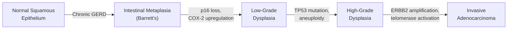

## Complications of Barrett's Esophagus

### Overview

The complications of Barrett's esophagus are a direct consequence of the ongoing pathological process — chronic acid and bile reflux injuring an already abnormal mucosa. The metaplastic columnar epithelium, while more acid-tolerant than the native squamous epithelium, is by no means invulnerable. It can still ulcerate, scar, bleed, and — most importantly — undergo malignant transformation.

The four major complications listed in the senior notes [2][13]:

> ***Complications of Barrett's esophagus:***
> 1. ***Esophageal stricture***
> 2. ***Esophageal ulceration***
> 3. ***Esophageal hemorrhage***
> 4. ***Adenocarcinoma of esophagus (CA esophagus)***

Let's explore each in depth, explaining the pathophysiology from first principles and connecting back to how each complication presents, is diagnosed, and is managed.

---

### 1. Esophageal Stricture (Peptic Stricture)

#### Pathophysiology

A "stricture" (Latin: *strictura* = narrowing, from *stringere* = to draw tight) is a fibrous narrowing of the esophageal lumen.

Here's the sequence:
1. **Chronic acid/bile reflux** → ongoing mucosal inflammation in the Barrett's segment
2. **Repeated cycles of injury and repair** → fibroblast activation → collagen deposition in the **submucosa and muscularis**
3. **Progressive fibrosis** → circumferential scar tissue contracts → lumen narrows
4. The result is a **peptic stricture** — a fibrotic narrowing typically occurring at or near the squamocolumnar junction

This is essentially the same process as scar contracture anywhere in the body — chronic inflammation leads to fibrosis, and fibrosis leads to contraction and narrowing. The esophagus happens to be a tube, so contraction of scar tissue shrinks the tube's diameter.

#### Clinical Features

- **Progressive mechanical dysphagia** — solids before liquids (because the lumen narrows gradually)
  - Why solids first? A partially narrowed lumen can still pass liquids (which conform to any shape) but cannot pass solid food boluses that exceed the luminal diameter. Symptoms typically appear when the lumen narrows to < 13 mm (normal ~20 mm). Complete obstruction (dysphagia for liquids too) occurs when the lumen reaches < 9 mm.
- **Food impaction** — a food bolus gets stuck at the stricture site → acute presentation requiring emergency endoscopic removal
- Patients often **modify their diet** unconsciously — eating slower, chewing more, avoiding certain solid foods — and may not report dysphagia until the stricture is quite advanced

#### Diagnosis

- **OGD**: Visible narrowing of the lumen; fibrotic, pale, smooth appearance (benign stricture) vs irregular, friable, nodular (malignant stricture). **Biopsies must always be taken** from any stricture to exclude malignancy — a Barrett's-associated stricture could harbour adenocarcinoma within its walls.
- **Barium swallow**: Smooth, tapered narrowing with proximal dilation in benign stricture; irregular "apple-core" or shouldered narrowing in malignant stricture.

#### Management

- **Endoscopic balloon dilation or bougie dilation** — physically stretches the stricture by passing progressively larger dilators through it. The "rule of three" applies: do not increase the dilator diameter by more than 3 mm (or 3 French sizes) in a single session, to minimize perforation risk.
- **Intensify PPI therapy** — reduce ongoing acid injury that drives fibrosis
- **Repeat dilation** as needed (strictures often recur — "refractory stricture")
- For refractory strictures: consider **temporary self-expanding stent** placement, **intralesional steroid injection** (triamcinolone — reduces fibrosis), or ultimately **surgical resection** if unmanageable endoscopically
- Always biopsy to exclude underlying malignancy

<Callout title="Benign vs Malignant Stricture — Must Distinguish" type="error">
Every stricture in a Barrett's patient is malignant until proven otherwise. A peptic stricture is smooth and tapered on endoscopy/barium swallow, while a malignant stricture is irregular, asymmetric, and shouldered. **Biopsy is mandatory** — even an innocent-looking stricture can harbour underlying adenocarcinoma.
</Callout>

---

### 2. Esophageal Ulceration (Barrett's Ulcer)

#### Pathophysiology

Barrett's ulcers develop within the metaplastic columnar epithelium of the Barrett's segment. The mechanism:

1. The metaplastic columnar epithelium is more acid-resistant than squamous epithelium, but it is **not immune** to acid-peptic injury
2. Areas of columnar epithelium exposed to particularly high concentrations of acid and/or bile (especially at the junction between Barrett's and squamous epithelium, where acid "pools") undergo focal **necrosis**
3. Necrosis extends through the mucosa → **ulceration** (breach of the epithelial surface extending at least into the muscularis mucosae)
4. Deep ulcers can penetrate into the **submucosa** or even the **muscularis propria**, risking hemorrhage from submucosal vessels or perforation

Barrett's ulcers are essentially the esophageal equivalent of peptic ulcers in the stomach/duodenum — same acid-driven mechanism, different location.

#### Clinical Features

- **Odynophagia** (painful swallowing — the ulcer is directly irritated by the food bolus or acid contact)
- **Retrosternal pain** (continuous or exacerbated by eating/swallowing)
- **Upper GI bleeding** (hematemesis, coffee-ground vomiting, melena, or occult bleeding causing iron deficiency anemia) — if the ulcer erodes into a submucosal vessel
- An ulcer within a Barrett's segment should always raise the **suspicion of underlying malignancy** — adenocarcinoma can present as an ulcerated lesion

#### Diagnosis

- **OGD with biopsy**: Visualize the ulcer; take multiple biopsies from the ulcer edges and base to exclude underlying dysplasia or adenocarcinoma
- **Histology**: Distinguish between a benign peptic ulcer (inflammatory debris, granulation tissue, regenerative epithelium) and a malignant ulcer (dysplastic/carcinomatous cells)

#### Management

- **High-dose PPI** — eliminate the acid drive; promote ulcer healing
- **Biopsy** all ulcers to exclude malignancy
- **Repeat OGD in 6–8 weeks** to confirm healing and take follow-up biopsies — a non-healing ulcer is suspicious for malignancy
- Treat *H. pylori* if present (though *H. pylori* is less commonly implicated in Barrett's-related ulcers than in gastric/duodenal ulcers)
- Address risk factors: reduce NSAID use, smoking cessation

---

### 3. Esophageal Hemorrhage

#### Pathophysiology

Bleeding in Barrett's esophagus can occur from several sources:

1. **Barrett's ulceration** — the most common mechanism. Deep ulcers erode into submucosal arterioles or venules → bleeding. This is analogous to a bleeding peptic ulcer in the stomach.
2. **Erosive esophagitis** — the surrounding squamous epithelium (not the Barrett's segment itself) may still have active reflux esophagitis with superficial erosions that ooze blood
3. **Adenocarcinoma** — tumour neovascularization produces fragile, abnormal blood vessels that bleed easily. Erosion of tumour into larger vessels (left gastric artery branches, aortic branches) can cause **massive hemorrhage** [19]

#### Clinical Features

Presentation depends on the severity and rate of bleeding:

| Severity | Presentation | Mechanism |
|---|---|---|
| **Occult / chronic** | Iron deficiency anemia (fatigue, pallor, dyspnea on exertion); positive fecal occult blood test | Slow, imperceptible oozing from superficial erosions or small ulcers |
| **Overt / acute** | Hematemesis (vomiting blood — bright red or coffee-ground), melena (black tarry stools) | Erosion into a submucosal vessel; larger-volume bleeding |
| **Massive** | Hemodynamic instability (tachycardia, hypotension, shock), hematemesis | Erosion into a major vessel (rare, typically from advanced adenocarcinoma eroding into aortic branches) |

Coffee-ground vomiting occurs because hemoglobin is converted to **hematin** (dark brown) by gastric acid — this tells you the blood has been in contact with acid for some time (slower bleed) rather than brisk arterial hemorrhage (bright red hematemesis).

#### Diagnosis

- **Urgent OGD** — identifies the bleeding source, allows assessment of severity (Forrest classification for ulcer bleeding), and enables endoscopic hemostasis
- **CBC**: Assess Hb/Hct for anemia severity
- **Iron studies**: Confirm iron deficiency if chronic presentation
- **Group and crossmatch**: Prepare for possible transfusion

#### Management

- **Resuscitation**: ABC approach, IV access, IV fluid resuscitation, blood transfusion if Hb < 7–8 g/dL (or earlier if hemodynamically unstable)
- **IV PPI** (e.g., omeprazole 80 mg bolus then 8 mg/hr infusion) — raises gastric pH to > 6, promoting platelet aggregation and clot stability (clots dissolve at pH < 5.4 due to pepsin activity)
- **Endoscopic hemostasis**: Injection therapy (dilute adrenaline 1:10,000), thermal coagulation (bipolar electrocoagulation, heater probe), mechanical (hemoclips), or combination
- Treat the underlying cause (optimize PPI, eradicate *H. pylori*, biopsy to exclude malignancy)
- If endoscopic hemostasis fails: interventional radiology (angiographic embolization) or surgery (very rare)

---

### 4. Adenocarcinoma of the Esophagus — The Most Feared Complication

This is the reason Barrett's esophagus matters clinically. Everything about Barrett's management — the surveillance, the biopsies, the ablation — exists to prevent or catch this complication early.

#### Pathophysiology: The Metaplasia → Dysplasia → Carcinoma Sequence

As covered extensively in previous sections, Barrett's esophagus predisposes to adenocarcinoma via a stepwise molecular progression:

#### Key Statistics

- ***Risk of developing cancer is 30–100× compared with the normal population*** [13]
- Annual progression rate: ~**0.5% per year** (or ~1 in 200 patient-years) [3]
- ***~7% of Barrett's patients*** develop adenocarcinoma over their lifetime [14]
- ***Adenocarcinoma affects the lower 1/3 of the esophagus*** (where Barrett's develops) and ***is not multicentric*** (unlike SCC) [19]
- ***Prognosis is poor if diagnosed late: > 50% metastasis at presentation, 5-year survival is just 5–10%*** [16] — this is precisely why surveillance exists: to catch it early when it IS curable

#### Risk Factors for Progression Within Barrett's

Not all Barrett's patients are equally likely to develop cancer. Higher-risk features include:

| Factor | Why It Increases Risk |
|---|---|
| **Long-segment Barrett's ( ≥ 3 cm)** | More metaplastic "real estate" → more cells at risk for dysplastic transformation |
| **Presence of dysplasia (especially HGD)** | Already partway along the malignant progression pathway |
| **Male sex** | Hormonal factors; possibly testosterone-driven proliferation |
| **Ongoing active reflux** (not on PPI or inadequate suppression) | Continued acid/bile injury drives DNA damage and proliferation |
| **Obesity (visceral)** | Pro-inflammatory adipokines; insulin/IGF-1 promote cell proliferation |
| **Smoking** | Mutagenic; impairs DNA repair mechanisms |
| **Family history of esophageal adenocarcinoma** | Shared genetic susceptibility |
| **Absence of *H. pylori*** | No protective atrophic effect → more acid production → more reflux injury [3] |

#### Modes of Spread [19]

Once adenocarcinoma develops, it can spread via:

| Mode | Details |
|---|---|
| ***Direct spread*** | Into adjacent mediastinal structures (trachea → ***tracheoesophageal fistula***, aorta, pericardium, vertebral body). Facilitated by the **absence of serosa** in the thoracic esophagus |
| ***Lymphatic spread*** | To regional lymph nodes — celiac nodes, mediastinal nodes (and distally to ***Virchow's node*** in the left supraclavicular fossa, signifying disseminated disease) |
| ***Hematogenous spread*** | ***Metastasis to lungs, liver, bones, adrenals*** [19] |

#### Clinical Features of Barrett's-Related Adenocarcinoma

- ***Painless progressive dysphagia*** — the hallmark presentation; occurs when ≥ 75% of the lumen is occluded [16]
- **Weight loss** — combination of reduced intake (dysphagia, anorexia) and cancer cachexia (TNF-α, IL-6 mediated)
- **Odynophagia** — usually indicates extra-esophageal involvement [16]
- **UGIB** (hematemesis, melena, anemic symptoms) — from tumour surface ulceration or vessel erosion
- **Regurgitation / aspiration pneumonia** — from esophageal obstruction [16]
- Signs of locally advanced disease:
  - ***Hoarseness of voice*** — left recurrent laryngeal nerve palsy (the nerve loops under the aortic arch and ascends between the trachea and esophagus — vulnerable to invasion by distal esophageal tumours) [16]
  - **Horner's syndrome** — involvement of the sympathetic chain
  - **Respiratory symptoms / stridor** — tracheal invasion or tracheoesophageal fistula
  - **Hypercalcemia** — humoral hypercalcemia of malignancy (PTHrP secretion, ~10% of SCC; less common in adenocarcinoma)
  - **Virchow's node** (left supraclavicular lymphadenopathy) — distant metastasis via thoracic duct

#### Diagnosis and Staging (When Adenocarcinoma Is Found)

- ***OGD + biopsy*** — confirmatory histological diagnosis [6]
- ***EUS*** — best for T and N staging [6]
- ***CT / PET-CT*** — for distant metastasis (M staging) [6]
- Diagnostic laparoscopy for OGJ tumours (detect peritoneal seeding) [6]

#### Management

The management depends on staging (covered in detail in the management section):

| Stage | Approach |
|---|---|
| **T1a (intramucosal)** | EMR/ESD ± RFA — endoscopic eradication [2] |
| **T1b (submucosal)** | Esophagectomy + LN dissection [16] |
| **T2–T3, node positive** | Neoadjuvant chemoRT + esophagectomy [17] |
| **T4b / metastatic** | Palliative: stenting, chemoRT, nutritional support [18] |

#### Prognosis

The prognosis of esophageal adenocarcinoma is overall poor because most patients present at an **advanced stage**:

| Stage at Diagnosis | 5-Year Survival |
|---|---|
| T1a (mucosal, detected by surveillance) | ~85–95% (excellent if caught early) |
| T1b (submucosal) | ~60–70% |
| Locally advanced (T3/N+) | ~15–25% |
| ***Metastatic*** | ***5–10%*** [16] |

This enormous difference in survival between early and late detection is the **entire justification for Barrett's surveillance programs**. Catching adenocarcinoma at T1a (through surveillance biopsies) transforms a nearly lethal diagnosis into a curable one.

---

### 5. Complications of Barrett's Treatment

For completeness, we should also address iatrogenic complications arising from the treatment of Barrett's esophagus:

#### Complications of Endoscopic Eradication Therapy (EMR/RFA)

| Complication | Mechanism | Management |
|---|---|---|
| **Post-treatment stricture** (~5–10% after RFA) | Circumferential ablation → circumferential healing → concentric scar formation | Endoscopic dilation; preventable by avoiding treating > 75% of circumference in one session |
| **Perforation** (~1% EMR, ~5% ESD) | Resection extends too deep through muscularis propria | Endoscopic clips if small; surgical repair if large |
| **Bleeding** | Vessel injury during resection | Endoscopic hemostasis (clips, coagulation) |
| **Buried Barrett's** | Neosquamous epithelium regrows OVER residual metaplastic glands in the submucosa, hiding them from surface visualization | This is why post-treatment surveillance with biopsies (including of neosquamous epithelium) is essential |
| **Incomplete eradication** | Residual metaplastic islands persist | Additional RFA sessions; continued surveillance |

<Callout title="Buried Barrett's — A Hidden Danger" type="idea">
After RFA, the surface may look beautifully normal — healthy neosquamous epithelium everywhere. But in approximately 5–10% of cases, nests of metaplastic columnar cells persist **underneath** the neosquamous layer (in the submucosa). These "buried" cells are invisible on standard endoscopy and can still undergo dysplastic transformation. This is why **post-treatment surveillance must continue** — even after apparent complete eradication. NBI and biopsies of neosquamous mucosa help detect this.
</Callout>

#### Complications of Esophagectomy

| Complication | Frequency | Mechanism |
|---|---|---|
| **Anastomotic leak** | ~10–15% | Failure of the surgical join between the gastric conduit and remaining esophagus → mediastinitis, sepsis |
| **Pneumonia** | ~15–20% | Aspiration, recurrent laryngeal nerve injury impairing cough/swallowing, prolonged intubation |
| **Recurrent laryngeal nerve injury** | ~5–10% | Surgical dissection near the nerve (especially cervical anastomosis) → hoarseness, aspiration risk |
| **Chylothorax** | ~2–5% | Thoracic duct injury during mediastinal dissection → lymphatic fluid accumulation in pleural space |
| **Conduit necrosis** | ~1–2% | Ischemia of the gastric conduit (blood supply relies on right gastroepiploic artery after mobilization) |
| **Dumping syndrome** | Variable | Loss of pyloric regulation after esophagogastrectomy → rapid gastric emptying into small bowel |
| **Mortality** | ~2–5% (high-volume centres) | Multi-organ failure, sepsis from leak, cardiopulmonary complications |

#### Complications of Fundoplication [14]

Already detailed in the management section but listed here for completeness:
- ***Gas bloat syndrome*** (90%, especially Nissen) [14]
- ***Dysphagia*** (50% early, 10% long-term) [14]
- Reflux recurrence (wrap too loose)
- ***Perforation → mediastinitis*** [14]
- ***Slipped Nissen*** [14]

---

### Summary of Complications — At a Glance

| Complication | Pathophysiological Basis | Key Clinical Feature | Key Management |
|---|---|---|---|
| ***Esophageal stricture*** | Chronic inflammation → fibrosis → luminal narrowing | Progressive dysphagia (solids > liquids) | Endoscopic dilation + PPI; biopsy to exclude malignancy |
| ***Esophageal ulceration*** | Acid/bile injury to metaplastic mucosa → focal necrosis | Odynophagia, retrosternal pain | High-dose PPI; biopsy to exclude malignancy; repeat OGD |
| ***Esophageal hemorrhage*** | Ulcer erosion into submucosal vessels | Hematemesis, melena, IDA | Resuscitation; IV PPI; endoscopic hemostasis |
| ***Adenocarcinoma*** | Metaplasia → dysplasia → carcinoma sequence (30–100× risk) | Painless progressive dysphagia + weight loss | Stage-dependent: EET for T1a; esophagectomy for T1b+; neoadjuvant chemoRT; palliative for metastatic |
| Buried Barrett's (post-treatment) | Residual metaplastic glands hidden under neosquamous epithelium | Asymptomatic (discovered on surveillance biopsy) | Continued surveillance with biopsies of neosquamous epithelium |

---

<Callout title="High Yield Summary">

**Complications of Barrett's Esophagus — Key Exam Points:**

1. **Four major complications**: esophageal stricture, esophageal ulceration, esophageal hemorrhage, and adenocarcinoma of the esophagus
2. **Stricture**: chronic inflammation → fibrosis → luminal narrowing → progressive mechanical dysphagia for solids then liquids. ALWAYS biopsy to exclude malignancy. Treat with endoscopic dilation + PPI
3. **Ulceration**: acid-peptic injury to metaplastic mucosa. Presents with odynophagia and retrosternal pain. Always biopsy — ulcer may harbour cancer. Follow up with repeat OGD at 6–8 weeks
4. **Hemorrhage**: from ulcer erosion into submucosal vessels. May present acutely (hematemesis/melena) or chronically (iron deficiency anemia). Manage with resuscitation + IV PPI + endoscopic hemostasis
5. **Adenocarcinoma**: the most feared complication. Cancer risk is 30–100× normal population; ~0.5%/year progression rate. Prognosis catastrophic if caught late ( < 10% 5-year survival for metastatic disease) but excellent if caught early (85–95% for T1a). This justifies the entire surveillance program
6. **Buried Barrett's**: post-RFA complication where metaplastic glands persist under neosquamous epithelium — invisible on surface inspection. Requires ongoing surveillance with biopsy even after complete eradication
7. **Treatment complications**: post-RFA stricture (~5–10%), EMR perforation (~1%), ESD perforation (~5%), esophagectomy anastomotic leak (~10–15%)
8. **Key principle**: every stricture and every ulcer in a Barrett's patient must be biopsied to exclude malignancy

</Callout>

---

<ActiveRecallQuiz
  title="Active Recall - Complications of Barrett's Esophagus"
  items={[
    {
      question: "Name the four major complications of Barrett's esophagus.",
      markscheme: "(1) Esophageal stricture. (2) Esophageal ulceration. (3) Esophageal hemorrhage. (4) Adenocarcinoma of the esophagus. The cancer risk is 30-100x the normal population.",
    },
    {
      question: "Explain the pathophysiology of peptic stricture formation in Barrett's esophagus and describe how it presents clinically.",
      markscheme: "Chronic acid and bile reflux causes repeated mucosal injury and repair cycles in the Barrett's segment. Fibroblast activation leads to collagen deposition in the submucosa and muscularis. Progressive fibrosis and scar contracture narrows the esophageal lumen circumferentially. Presents as progressive mechanical dysphagia, solids before liquids, because a partially narrowed lumen can still pass liquids but not solid boluses. Symptoms appear when lumen is less than 13 mm. Always biopsy to exclude malignancy.",
    },
    {
      question: "What is buried Barrett's? Why is it clinically significant and how should it be managed?",
      markscheme: "Buried Barrett's occurs when neosquamous epithelium regrows OVER residual metaplastic columnar glands in the submucosa after RFA treatment. These buried nests are invisible on standard surface endoscopy but can still undergo dysplastic transformation and malignant progression. Occurs in approximately 5-10% of cases. Managed by continued post-treatment surveillance with biopsies of neosquamous epithelium. NBI may help detect it.",
    },
    {
      question: "A Barrett's patient presents with hematemesis and melena. Outline your immediate management approach.",
      markscheme: "ABC resuscitation: secure airway, large-bore IV access x 2, IV fluid resuscitation. Blood transfusion if Hb less than 7-8 or hemodynamically unstable. Group and crossmatch. IV PPI (e.g. omeprazole 80 mg bolus then 8 mg/hr infusion) to raise gastric pH above 6 and promote clot stability. Urgent OGD for diagnosis and endoscopic hemostasis (injection adrenaline, thermal coagulation, hemoclips). Biopsy the bleeding source to exclude underlying adenocarcinoma. If endoscopic hemostasis fails: interventional radiology or surgery.",
    },
    {
      question: "Why does early detection of Barrett's-related adenocarcinoma dramatically change prognosis? Quote relevant survival figures.",
      markscheme: "T1a (intramucosal) adenocarcinoma detected through surveillance has 85-95% 5-year survival and can be treated endoscopically (EMR/ESD). In contrast, metastatic adenocarcinoma has only 5-10% 5-year survival, with more than 50% of patients presenting with metastatic disease. This enormous difference in survival between early and late detection is the entire justification for Barrett's surveillance programs.",
    },
  ]}
/>

## References

[2] Senior notes: felixlai.md (Barrett's complications and management, felix:541)
[3] Senior notes: maxim.md (Barrett's oesophagus section, maxim:109)
[6] Senior notes: maxim.md (CA esophagus investigations, maxim:118)
[13] Senior notes: felixlai.md (Barrett's complications and surveillance, felix:542)
[14] Senior notes: maxim.md (GERD surgical treatment and fundoplication complications, maxim:107)
[16] Senior notes: maxim.md (CA esophagus epidemiology and prognosis, maxim:116)
[17] Senior notes: maxim.md (CA esophagus staging and treatment, maxim:121)
[18] Senior notes: felixlai.md (Palliative treatment, felix:562)
[19] Senior notes: felixlai.md (Esophageal cancer overview and clinical features, felix:544, felix:549)
