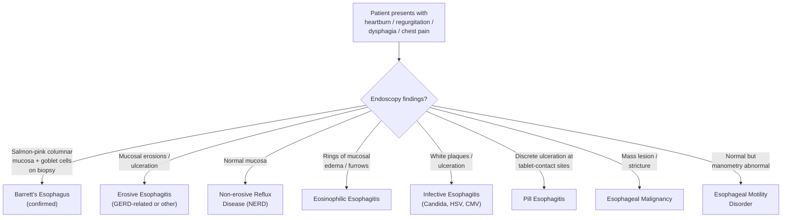
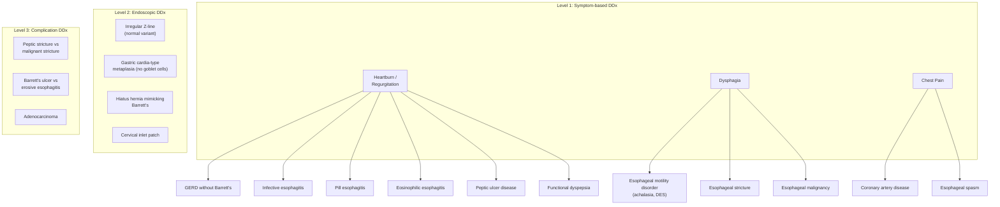

## Differential Diagnosis of Barrett's Esophagus

### Framing the Problem

Before diving into the differentials, let's be clear about what we're differentiating and why. Barrett's esophagus itself is **asymptomatic** — it produces no symptoms on its own [1][2]. What brings the patient to attention is either:

1. **Symptoms of underlying GERD** (heartburn, regurgitation, dysphagia, chest pain) — so we need to differentiate causes of these symptoms
2. **Endoscopic findings** — salmon-pink columnar mucosa in the distal esophagus seen during OGD — so we need to differentiate conditions that can mimic the endoscopic appearance of Barrett's
3. **Complications of Barrett's** (dysphagia from stricture, bleeding from ulceration, weight loss from adenocarcinoma) — so we need to differentiate causes of these presentations

The differential diagnosis therefore operates on **three levels**: (A) clinical/symptom-based DDx for the presenting GERD-like symptoms, (B) endoscopic DDx for what looks like Barrett's on OGD, and (C) DDx of Barrett's complications (especially dysphagia and upper GI bleeding).

---

### A. Clinical / Symptom-Based Differential Diagnosis

Since Barrett's patients present with symptoms of GERD, the DDx is essentially the **differential diagnosis of GERD-like symptoms** [7]:

#### 1. Gastroesophageal Reflux Disease (GERD) Without Barrett's

- **By far the most common cause** of the symptoms that bring a Barrett's patient to medical attention [7]
- GERD is present in ~90% of Barrett's patients, but only ~10% of GERD patients develop Barrett's [3]
- **Key distinction**: GERD without Barrett's will show either normal mucosa (non-erosive reflux disease — NERD) or erosive esophagitis on endoscopy, but **no columnar metaplasia** above the GEJ
- **Pathophysiology**: Same as Barrett's — LES dysfunction, hiatus hernia, delayed clearance — but the mucosal response has not yet progressed to metaplasia [7][8]

#### 2. Infective Esophagitis [7]

- Causes: ***Candida albicans*** (most common), ***HSV***, ***CMV*** (especially in immunocompromised — HIV/AIDS, transplant recipients, chemotherapy)
- **Why it mimics Barrett's/GERD**: Causes odynophagia, dysphagia, and retrosternal pain
- **How to differentiate**: 
  - Endoscopically: Candida → white adherent plaques; HSV → shallow, well-circumscribed ulcers with raised yellow edges; CMV → deep, large, single ulcers
  - Clinical context: immunosuppression is the key clue
  - Biopsy: viral inclusions (CMV — owl-eye intranuclear inclusions; HSV — multinucleated giant cells with Cowdry type A inclusions), fungal hyphae (Candida)
- **Pathophysiology**: Direct pathogen invasion of esophageal mucosa. Candida causes superficial mucosal invasion; HSV and CMV cause epithelial cell lysis and ulceration

#### 3. Pill Esophagitis [7]

- Caused by direct chemical injury from medications lodging in the esophagus
- Common culprits: **NSAIDs, bisphosphonates (alendronate), tetracyclines (doxycycline), potassium chloride, iron supplements**
- **Why it mimics Barrett's/GERD**: Retrosternal pain, odynophagia, dysphagia
- **How to differentiate**: History of taking pills without adequate water, often in patients with motility problems or who take medications at bedtime. Endoscopy shows discrete ulceration at known "sticking points" (aortic arch, left atrium compression, above the LES) rather than the diffuse columnar change of Barrett's
- **Pathophysiology**: The tablet dissolves locally, creating a high-concentration acid or alkali environment → focal chemical burn → ulceration

#### 4. Eosinophilic Esophagitis (EoE)

- A chronic, immune-mediated/antigen-driven esophageal disease characterized by **eosinophilic infiltration** of the esophageal mucosa ( ≥ 15 eosinophils per high-power field on biopsy)
- **Why it mimics Barrett's/GERD**: Presents with dysphagia (especially for solids), heartburn that may not respond to PPI, food impaction
- **How to differentiate**: 
  - Epidemiology: Younger patients (20s–40s), often with atopic history (asthma, eczema, food allergies)
  - Endoscopy: Characteristic rings ("trachealization" / ringed esophagus / "feline esophagus"), linear furrows, white exudates/plaques, mucosal edema — very different from the salmon-pink tongues of Barrett's
  - Biopsy: Dense eosinophilic infiltrate — no goblet cells or intestinal metaplasia
  - Fails to respond to standard PPI therapy (unlike GERD/Barrett's)
- **Pathophysiology**: Food or aeroallergens trigger a Th2-mediated immune response → eotaxin-3 release → eosinophil recruitment to esophageal mucosa → inflammation → fibrosis → stricture

#### 5. Esophageal Motility Disorders [7][9]

These can present with dysphagia, regurgitation, and chest pain — mimicking GERD/Barrett's symptoms:

| Disorder | Key Features | How to Differentiate |
|---|---|---|
| **Achalasia** | Dysphagia for **both solids AND liquids** from onset; regurgitation of undigested food; failure of LES relaxation [9] | Esophageal manometry: ↑ LES resting pressure, incomplete LES relaxation, aperistalsis. Barium swallow: bird-beak sign [9][10] |
| **Diffuse esophageal spasm** | Intermittent dysphagia + non-cardiac chest pain; normal between episodes | Manometry: ≥ 20% premature contractions with normal LES relaxation. Barium swallow: corkscrew esophagus |
| **Jackhammer esophagus** | Severe chest pain + dysphagia; hypercontractile peristalsis | Manometry: distal contractile integral > 8000 mmHg·cm·s with normal LES relaxation [9] |
| **Scleroderma esophagus** | Dysphagia + severe GERD (due to LES incompetence); often part of systemic sclerosis (CREST syndrome) | Manometry: absent peristalsis in distal 2/3 + very low LES pressure. Look for systemic features (Raynaud's, sclerodactyly, calcinosis) |

<Callout title="Achalasia vs GERD — A Common Exam Trap" type="error">
Both achalasia and GERD can present with **heartburn and regurgitation** [9]. However, the mechanisms are completely different:
- In **GERD**: acid refluxes from stomach → esophagus (true acid reflux)
- In **achalasia**: food ferments in the dilated, stagnant esophagus → lactic acid production → mimics heartburn; regurgitated material is undigested and non-acidic

**Esophageal manometry** is diagnostic — it differentiates achalasia (↑ LES pressure, absent peristalsis) from GERD. Both achalasia and GERD can present with heartburn, but esophageal manometry is diagnostic of achalasia [9].
</Callout>

#### 6. Peptic Ulcer Disease [11]

- Gastric or duodenal ulcers can produce **epigastric pain** that overlaps with GERD symptoms
- **How to differentiate**: Duodenal ulcer pain classically improves with eating (buffered by food) and worsens 2–3 hours later ("hunger pain"); gastric ulcer pain may worsen with eating. Neither typically causes regurgitation. OGD is diagnostic.
- **Risk factors**: ***H. pylori***, ***NSAIDs***, ***stress***, ***excess gastric acid*** [11]

#### 7. Non-Ulcer (Functional) Dyspepsia [7]

- Chronic epigastric pain/discomfort without an identifiable structural or biochemical cause
- Diagnosis of exclusion after OGD, *H. pylori* testing, and other workup are negative
- **Rome IV criteria**: bothersome postprandial fullness, early satiation, epigastric pain, or epigastric burning without structural explanation

#### 8. Coronary Artery Disease [7]

- **This is the critical one you must never miss.** Esophageal pain and cardiac pain share the same spinal afferent pathways (T1–T5 dermatomes), making them clinically indistinguishable by symptom description alone.
- Cardiac chest pain must be **excluded first** in any patient presenting with retrosternal pain, especially if the patient has cardiovascular risk factors.
- **How to differentiate**: ECG, cardiac biomarkers (troponin), exercise stress testing. GERD-related chest pain is more likely to be postprandial, related to body position, relieved by antacids, and associated with other reflux symptoms. Anginal pain is more likely exertional, relieved by rest/nitrates, and associated with dyspnea.
- That said, nitrates relax both coronary arteries AND the LES — so relief with nitroglycerin does NOT reliably distinguish cardiac from esophageal pain.

<Callout title="Golden Rule">
In any patient with retrosternal chest pain, **always exclude cardiac causes before attributing symptoms to GERD/Barrett's**. A missed MI is far more dangerous than a missed diagnosis of reflux.
</Callout>

---

### B. Endoscopic Differential Diagnosis

When the endoscopist sees columnar-appearing mucosa in the distal esophagus, the DDx includes:

| Endoscopic Finding | Condition | How to Distinguish from Barrett's |
|---|---|---|
| Salmon-pink columnar mucosa with goblet cells on biopsy | **Barrett's esophagus (confirmed)** | Diagnostic — requires BOTH endoscopic and histological criteria [2][4] |
| Salmon-pink columnar mucosa WITHOUT goblet cells | **Gastric cardia-type or fundic-type columnar metaplasia** | No goblet cells on biopsy → NOT Barrett's by most guidelines (AGA/ACG). The BSG, however, accepts columnar metaplasia without goblet cells. |
| Irregular Z-line ( < 1 cm proximal migration) | **Irregular Z-line (normal variant)** | Z-line is naturally irregular in many people. Proximal migration of < 1 cm is generally considered a **normal variant** and does not meet criteria for Barrett's [3] |
| Columnar-appearing mucosa with short gastric folds extending up | **Short-segment hiatus hernia** | The apparent "columnar mucosa" is actually gastric mucosa that has herniated above the diaphragm. Careful identification of the GEJ (top of gastric folds) vs Z-line is crucial [5] |
| Mass / ulcerated area in distal esophagus | **Esophageal adenocarcinoma or gastric cardia cancer** | Biopsy shows invasive carcinoma, not just metaplasia. May arise from pre-existing Barrett's (Siewert Type I) [6] |
| Inlet patch (heterotopic gastric mucosa in upper esophagus) | **Cervical inlet patch** | Salmon-pink island in the **proximal** esophagus (near UES), NOT the distal esophagus. Ectopic gastric mucosa, not metaplastic change |

<Callout title="The GEJ vs Z-line Distinction is Everything" type="error">
The **entire diagnosis of Barrett's** hinges on accurately identifying two landmarks: the GEJ (top of gastric folds) and the Z-line (squamocolumnar junction). In a normal esophagus, these coincide. In Barrett's, the Z-line migrates **proximal to the GEJ** [2][4]. If the endoscopist misidentifies the GEJ (e.g., in a hiatus hernia where gastric folds are above the diaphragm), they may over- or under-diagnose Barrett's. This is why endoscopic expertise matters and why biopsies are mandatory for confirmation.
</Callout>

---

### C. Differential Diagnosis of Barrett's Complications

When a patient with known Barrett's develops **new symptoms**, consider:

#### Progressive Dysphagia

| Cause | Mechanism | Key Features |
|---|---|---|
| **Peptic stricture** | Chronic inflammation → fibrosis → luminal narrowing | Gradual onset, solids > liquids, responds to dilation [2] |
| **Esophageal adenocarcinoma** | Malignant mass obstructing lumen | ***Painless progressive dysphagia*** is malignancy until proven otherwise [12]; associated weight loss, anorexia |
| **Schatzki ring** | Mucosal ring at the SCJ | Intermittent dysphagia especially with large boluses ("steakhouse syndrome") |
| **Eosinophilic esophagitis** | Eosinophilic inflammation → fibrotic remodeling | Young, atopic, rings/furrows on endoscopy |

#### Upper GI Bleeding [11]

| Cause | Mechanism |
|---|---|
| **Barrett's ulceration** | Deep ulcers in metaplastic epithelium eroding into submucosal vessels |
| **Erosive esophagitis** | Severe acid-related mucosal erosion with capillary bleeding |
| **Esophageal adenocarcinoma** | Tumour neovascularization with friable vessels; erosion into larger vessels |
| **Mallory-Weiss tear** | Mucosal laceration at GEJ from forceful retching [11] |
| **Esophagogastric varices** | Portal hypertension → dilated submucosal veins (in patients with concurrent liver disease) [11] |

---

### Summary: Systematic Approach to DDx of Barrett's Esophagus

---

### High-Yield Comparison Table: Key Differentials at a Glance

| Feature | Barrett's Esophagus | Achalasia | Eosinophilic Esophagitis | Esophageal Adenocarcinoma | GERD (without Barrett's) |
|---|---|---|---|---|---|
| **Age / Sex** | Middle-aged male | Any age, M=F [9] | Young, male, atopic | > 60, male | Any age |
| **Dysphagia type** | Solids (if stricture) | Solids AND liquids [9] | Solids, food impaction | Progressive solids → liquids [12] | Uncommon unless stricture |
| **Heartburn** | Yes (from GERD) | Yes (but from fermentation) [9] | May be present (PPI-refractory) | Late symptom | Yes |
| **Key endoscopic finding** | Salmon-pink columnar mucosa | Dilated esophagus, tight cardia [10] | Rings, furrows, white exudates | Mass / ulcerated lesion | Erosions (LA A–D) or normal |
| **Key histology** | Goblet cells (intestinal metaplasia) | N/A | ≥ 15 eos/HPF | Invasive adenocarcinoma | Squamous inflammation |
| **Key investigation** | OGD + biopsy [2] | Manometry [9] | OGD + biopsy | OGD + biopsy + EUS/CT staging [6] | Clinical ± OGD |
| **Cancer risk** | Yes (0.5%/year) [3] | Yes (SCC) [9] | No | Already cancer | If develops Barrett's |

<Callout title="High Yield Summary">

**DDx of Barrett's Esophagus — Key Points:**

1. Barrett's is asymptomatic — you are differentiating the **symptoms of underlying GERD** and the **endoscopic appearance**
2. The most important clinical DDx includes: GERD without Barrett's, infective esophagitis, pill esophagitis, eosinophilic esophagitis, esophageal motility disorders (especially achalasia), peptic ulcer disease, functional dyspepsia, and **coronary artery disease** (must exclude first)
3. The most important endoscopic DDx includes: irregular Z-line (normal variant), gastric cardia-type metaplasia (no goblet cells), hiatus hernia mimicking Barrett's, and cervical inlet patch
4. **Both achalasia and GERD can present with heartburn and regurgitation** — esophageal manometry differentiates them
5. **Painless progressive dysphagia = malignancy until proven otherwise** — always biopsy
6. Barrett's diagnosis requires BOTH endoscopic evidence (Z-line proximal to GEJ) AND histological confirmation (goblet cells)
7. Always exclude **cardiac chest pain** before attributing retrosternal pain to esophageal causes

</Callout>

---

<ActiveRecallQuiz
  title="Active Recall - Barrett's Esophagus Differential Diagnosis"
  items={[
    {
      question: "A patient presents with heartburn and regurgitation of undigested food. How would you differentiate GERD from achalasia?",
      markscheme: "Both present with heartburn and regurgitation. In GERD, refluxate is acidic gastric content. In achalasia, regurgitated material is undigested and non-acidic (from fermentation in stagnant esophagus). Esophageal manometry is diagnostic: achalasia shows raised LES resting pressure, incomplete LES relaxation, and aperistalsis. GERD manometry may show low LES pressure but normal peristalsis.",
    },
    {
      question: "Name three conditions that can mimic the endoscopic appearance of Barrett's esophagus and explain how you would distinguish each.",
      markscheme: "(1) Irregular Z-line (normal variant) - less than 1 cm proximal migration, no goblet cells on biopsy. (2) Gastric cardia-type columnar metaplasia - salmon-pink mucosa but biopsy shows columnar cells WITHOUT goblet cells. (3) Hiatus hernia - gastric folds above diaphragm may be mistaken for columnar-lined esophagus; careful identification of GEJ (top of gastric folds) vs Z-line is key.",
    },
    {
      question: "A 30-year-old atopic male presents with intermittent solid food dysphagia and heartburn unresponsive to PPI. What is the most likely diagnosis and what would you expect on OGD and biopsy?",
      markscheme: "Eosinophilic esophagitis (EoE). OGD: rings (trachealization), linear furrows, white exudates/plaques, mucosal edema. Biopsy: at least 15 eosinophils per high-power field. Key clue: young, atopic, PPI-refractory heartburn, intermittent solid food dysphagia or food impaction.",
    },
    {
      question: "Why must you always consider coronary artery disease in the differential diagnosis of a patient presenting with retrosternal chest pain attributed to GERD?",
      markscheme: "Esophageal pain and cardiac pain share the same spinal afferent pathways (T1-T5 dermatomes), making them clinically indistinguishable by symptom description alone. Additionally, nitroglycerin relieves both angina (coronary vasodilation) and esophageal spasm (LES relaxation), so nitrate response does not differentiate them. A missed MI has far worse consequences than a missed GERD diagnosis.",
    },
    {
      question: "List the differential diagnosis of GERD-like symptoms as per the senior notes.",
      markscheme: "Infective esophagitis, pill esophagitis, eosinophilic esophagitis, esophageal motor disorders (achalasia, diffuse esophageal spasm), peptic ulcer disease, non-ulcer (functional) dyspepsia, and coronary artery disease.",
    },
  ]}
/>

## References

[1] Senior notes: felixlai.md (Barrett's esophagus overview, felix:535)
[2] Senior notes: felixlai.md (Barrett's diagnosis and clinical features, felix:540, felix:541)
[3] Senior notes: maxim.md (Barrett's oesophagus section, maxim:109)
[4] Senior notes: felixlai.md (Barrett's diagnostic criteria, felix:540)
[5] Senior notes: maxim.md (Hiatal hernia section, maxim:110, maxim:111)
[6] Senior notes: maxim.md (CA esophagus investigations, maxim:118)
[7] Senior notes: felixlai.md (GERD differential diagnosis, felix:521)
[8] Senior notes: felixlai.md (GERD overview and pathogenesis, felix:518, felix:520)
[9] Senior notes: felixlai.md (Achalasia section, felix:529, felix:530)
[10] Senior notes: maxim.md (Achalasia section, maxim:104)
[11] Senior notes: felixlai.md (Upper GI bleeding differential diagnosis, felix:499)
[12] Senior notes: maxim.md (Dysphagia differential diagnosis, maxim:94)
