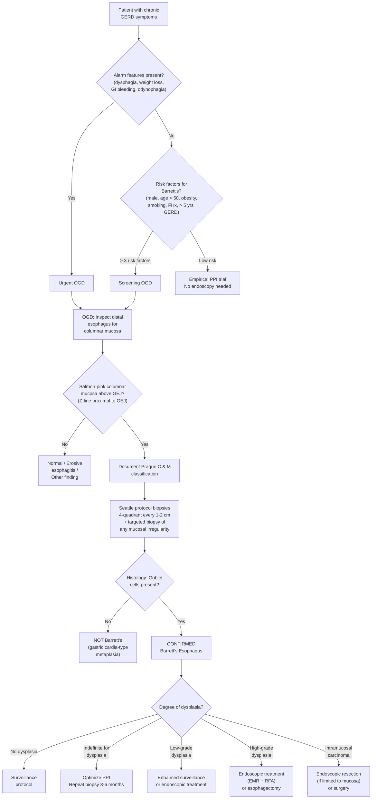
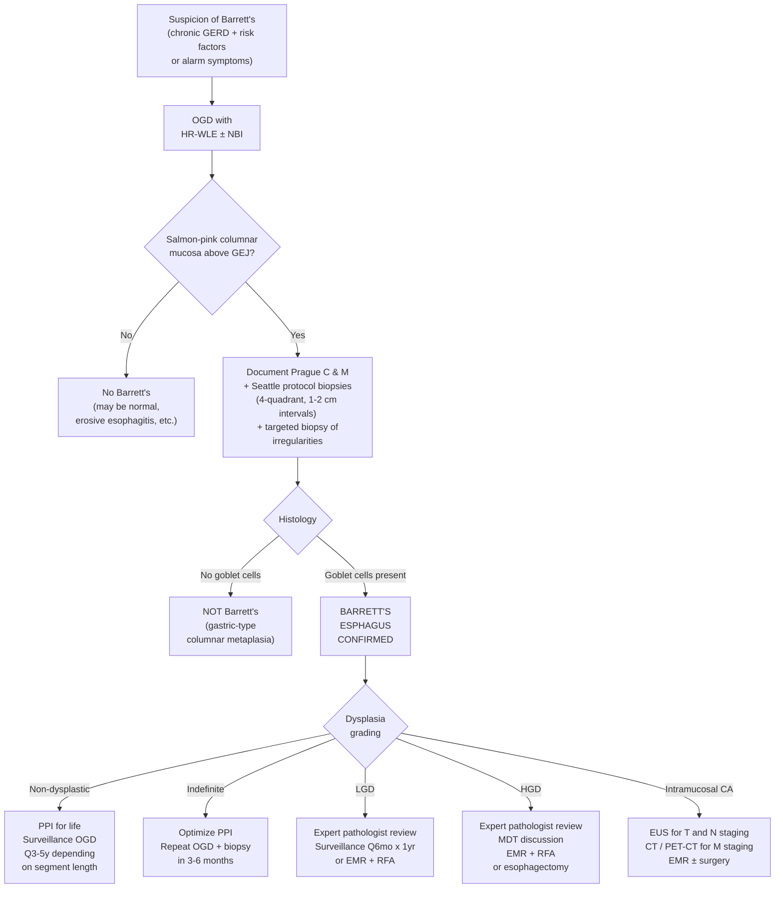

## Diagnostic Criteria for Barrett's Esophagus

### The Two Pillars of Diagnosis

Barrett's esophagus is fundamentally a **histopathological diagnosis made in an endoscopic context**. You cannot diagnose it by symptoms alone (it's asymptomatic), by blood tests, or by imaging. You need an endoscope AND a microscope.

> ***Two criteria must be fulfilled by endoscopic examination to diagnose Barrett's esophagus*** [4]:
> 1. ***The endoscopist must document that columnar epithelium lines the distal esophagus***
> 2. ***Histological examination of biopsy specimen from that columnar epithelium must reveal specialized intestinal metaplasia (characterized by goblet cells)***

Let's unpack why both are needed and what each means from first principles.

---

### Criterion 1: Endoscopic Documentation of Columnar Epithelium in the Distal Esophagus

#### Identifying the Two Key Landmarks

The entire endoscopic diagnosis hinges on the relationship between two landmarks [4]:

| Landmark | Definition | Endoscopic Appearance |
|---|---|---|
| ***Gastroesophageal junction (GEJ / EGJ)*** | The anatomical line where the esophagus ends and stomach begins. ***Defined endoscopically at the level of the most proximal extent of the gastric folds*** [4] | Where the tubular esophagus transitions to rugal folds of the stomach |
| ***Squamocolumnar junction (SCJ / Z-line)*** | The visible line where two epithelial types meet. ***Squamous epithelium = pale, pink, glossy appearance. Columnar epithelium = reddish (salmon-pink) color and velvet-like texture*** [4] | A visible colour change — pale glossy → salmon-pink velvety |

#### The Logic of Diagnosis

- ***Normally, the GEJ/EGJ and squamocolumnar junction coincide*** = the entire esophagus is lined by stratified squamous epithelium [4][2]
- ***When the squamocolumnar junction is located proximal to the GEJ/EGJ*** = the distal esophagus is lined by columnar epithelium [2]. This is the endoscopic hallmark of Barrett's.

Think of it this way: if the "colour change" line (Z-line) has migrated upward from where the stomach begins (GEJ), then there must be a segment of the esophagus that is now covered by the "wrong" epithelium — columnar instead of squamous. That segment is the Barrett's segment.

#### Prague C & M Classification — Standardizing the Report [3]

Once columnar mucosa is identified above the GEJ, the endoscopist must quantify the extent using the **Prague C & M classification**:

- **C** = **Circumferential** extent: length of the full 360° circumferential segment of columnar mucosa measured from the GEJ upward
- **M** = **Maximal** extent: length of the longest tongue or island of columnar mucosa measured from the GEJ upward (this is always ≥ C)

Example: **C2M5** = 2 cm of circumferential Barrett's, with the longest tongue extending 5 cm above GEJ.

**Why standardize?** Because Barrett's segment length correlates with cancer risk (longer = higher risk), and you need reproducible measurements to compare over serial surveillance endoscopies. Without Prague C & M, one endoscopist's "short segment" might be another's "long segment."

#### Length-Based Classification [2][3]

| Classification | Distance between GEJ and Z-line | Cancer Risk |
|---|---|---|
| ***Long-segment Barrett's esophagus (LSBE)*** | ***≥ 3 cm*** [2] | Higher — more metaplastic tissue = more "real estate" for dysplastic change |
| ***Short-segment Barrett's esophagus (SSBE)*** | ***< 3 cm*** [2] | Lower but still significant |
| Ultra-short segment | < 1 cm | Controversial; some guidelines require > 1 cm of proximal migration of Z-line for diagnosis [3] |

<Callout title="Proximal Migration Threshold" type="error">
The senior notes state that diagnosis requires ***proximal migration of squamocolumnar junction (Z-line) > 1 cm*** [3]. A Z-line that is irregular or displaced by less than 1 cm is generally considered a **normal variant** and does not warrant biopsy or Barrett's labelling. This avoids overdiagnosis — the Z-line is naturally somewhat irregular in many healthy individuals.
</Callout>

#### Endoscopic Appearance Summary

| Feature | Normal Esophagus | Barrett's Esophagus |
|---|---|---|
| **Squamous epithelium** | ***Pale-pink and glossy*** [4] | Pale-pink and glossy (above the Barrett's segment) |
| **Columnar epithelium** | Not present in esophagus | ***Salmon-pink and velvety texture*** [4] — appears as tongues or circumferential segments extending above the GEJ |
| **GEJ and Z-line** | ***Coincide*** [4] | ***Z-line is proximal to the GEJ*** [4] |

---

### Criterion 2: Histological Confirmation of Intestinal Metaplasia with Goblet Cells

Why isn't endoscopic appearance alone sufficient? Because:
1. Columnar epithelium in the distal esophagus could be **gastric cardia-type** (no goblet cells) — this does NOT carry the same cancer risk
2. Visual assessment alone has limited specificity — inflammation, hiatus hernia, and normal variants can confuse the picture
3. **Goblet cells** are the histological hallmark that defines the "intestinal" nature of the metaplasia and confirms the cancer-predisposing phenotype

#### What Are Goblet Cells?

Goblet cells are mucus-secreting cells with a characteristic "goblet" (wine glass) shape. They are normally found in the **intestine** but NOT in the esophagus or gastric cardia. Their presence in the esophageal epithelium proves that the metaplasia is of the **specialized intestinal type** — the type associated with cancer progression via the metaplasia–dysplasia–carcinoma sequence.

On histology, goblet cells are identified by:
- Distended, mucin-filled cytoplasm (stains blue with Alcian blue at pH 2.5)
- Nucleus pushed to the base of the cell
- Interspersed among columnar absorptive-type cells

<Callout title="International Variation in Diagnostic Criteria" type="idea">
There is a guideline discrepancy you should be aware of:
- **ACG / AGA (American)**: Require goblet cells (intestinal metaplasia) on biopsy to diagnose Barrett's
- **BSG (British)**: Accept **columnar metaplasia** of any type (including gastric cardia-type without goblet cells) as sufficient for Barrett's diagnosis

For **HKUMed exams**, follow the standard definition requiring goblet cells unless specifically told otherwise. The rationale: goblet cells mark the specific metaplastic phenotype with proven cancer risk.
</Callout>

---

### The Biopsy Protocol: Seattle Protocol

Simply seeing Barrett's mucosa and taking one random biopsy is not enough. Dysplasia can be **patchy and invisible** — a single biopsy can easily miss it. Therefore, a systematic biopsy protocol is essential.

> ***The "Seattle protocol": biopsy every 1–2 cm in 4 quadrants*** [3]

This means:
- ***Endoscopic 4-quadrant biopsy should be performed and obtained at 1-cm intervals*** [2] (or 2-cm intervals for surveillance of non-dysplastic Barrett's)
- Biopsies are taken at the 12, 3, 6, and 9 o'clock positions at each level throughout the entire Barrett's segment
- ***Any mucosal irregularities in the segment should be removed with endoscopic resection with pathological evaluation*** [2] — visible lesions (nodules, ulcers, raised areas) are biopsied or resected separately because they have the highest yield for dysplasia/carcinoma

**Why 4-quadrant?** Dysplasia is often focal and not uniformly distributed across the Barrett's segment. The more biopsies you take, the higher the detection rate. The Seattle protocol maximizes sampling coverage of the entire metaplastic segment.

**Why 1–2 cm intervals?** Modeling studies show that intervals wider than 2 cm significantly reduce the sensitivity for detecting dysplasia. At 1-cm intervals, the detection rate for HGD approaches 95%.

---

## Diagnostic Algorithm

### When to Investigate for Barrett's?

Barrett's is typically discovered in one of three settings:

1. **Incidental finding** during OGD performed for GERD symptoms
2. **Targeted screening** of high-risk individuals (discussed below)
3. **Investigation of alarm symptoms** (dysphagia, weight loss, GI bleeding) — where Barrett's complications or adenocarcinoma may be the underlying cause

#### Indications for OGD in GERD [8]:

***OGD is indicated in patients with symptoms of GERD to evaluate for esophagitis, strictures and Barrett's esophagus*** [8]. Specific indications include:

- ***Alarming features***: dysphagia, odynophagia, hematemesis, melena, anemia, vomiting, weight loss, family history of esophageal or gastric cancer, chronic NSAID usage [8]
- ***History of esophageal stricture*** who have recurrent dysphagia [8]
- ***Suspected complications*** such as esophagitis and Barrett's esophagus [8]
- ***Persistent symptoms despite PPIs*** [8]
- ***Severe esophagitis (LA Grade C–D) after 8 weeks of PPIs*** to assess healing [8]
- ***Evaluation before anti-reflux surgery*** [8]

#### Screening Recommendations (ACG 2022)

Screening OGD for Barrett's should be considered in patients with **chronic GERD symptoms ( > 5 years)** who have **≥ 3 additional risk factors**:
- Male sex
- Age > 50
- Caucasian ethnicity
- Central/visceral obesity (waist circumference > 102 cm in men, > 88 cm in women)
- Current or past smoking
- Family history of Barrett's or esophageal adenocarcinoma in a first-degree relative

### Complete Diagnostic Algorithm

---

## Investigation Modalities

### 1. Upper Gastrointestinal Endoscopy (OGD) — The Core Investigation

***OGD with biopsy*** is the **diagnostic investigation of choice** for Barrett's esophagus. It serves both diagnostic and surveillance roles [3][4][8].

#### What the Endoscopist Does

| Step | Action | Purpose |
|---|---|---|
| 1 | Identify the **GEJ** (top of gastric folds) | Establish the anatomical lower boundary |
| 2 | Identify the **Z-line** (squamocolumnar junction) | Determine if there is proximal migration above the GEJ |
| 3 | Measure and document **Prague C & M** | Standardized reporting of Barrett's segment length [3] |
| 4 | Inspect for **mucosal irregularities** (nodules, ulcers, depressed areas) | Suspicious for dysplasia/carcinoma — these get targeted biopsy or EMR |
| 5 | Perform **Seattle protocol biopsies** (4-quadrant, every 1–2 cm) [2][3] | Systematic sampling to detect occult dysplasia |
| 6 | Document associated findings | Hiatus hernia, esophagitis grade (LA classification), strictures |

#### Key Endoscopic Findings and Their Interpretation

| Finding | Interpretation |
|---|---|
| ***Salmon-pink, velvety mucosa*** extending above GEJ [4] | Columnar epithelium in the esophagus — suspect Barrett's, needs biopsy confirmation |
| Tongues/fingers of salmon-pink mucosa extending up from GEJ | Non-circumferential Barrett's (M > C in Prague classification) |
| Circumferential salmon-pink segment | Circumferential Barrett's (C component in Prague classification) |
| Islands of salmon-pink mucosa | Islands of columnar metaplasia within squamous epithelium |
| Nodularity / raised lesion within Barrett's segment | **High suspicion for dysplasia or early adenocarcinoma** — must undergo targeted biopsy or EMR |
| Ulceration within Barrett's segment | Barrett's ulcer — complication; also raises concern for underlying malignancy |
| Stricture within Barrett's segment | Peptic stricture — fibrotic complication; must biopsy to exclude malignant stricture |

### 2. Enhanced Endoscopic Imaging Techniques

Standard white-light endoscopy can miss flat dysplasia. Several advanced techniques improve detection:

#### a) ***Narrow Band Imaging (NBI)*** [3][13]

- ***High-resolution endoscopic technique that enhances fine structures of mucosal surface without the use of dyes*** [13]
- **How it works**: NBI uses optical filters to narrow the wavelength of illuminating light to blue (415 nm) and green (540 nm) bands. These short wavelengths are preferentially absorbed by **hemoglobin** → mucosal surface capillaries and mucosal pit patterns become dramatically more visible
- **Why it helps in Barrett's**: Dysplastic Barrett's has an **irregular mucosal pattern** and **irregular vascular pattern** that is much better visualized with NBI than white light. This guides targeted biopsies and increases dysplasia detection
- **Classification**: The BING (Barrett's International NBI Group) criteria classify mucosal and vascular patterns as regular (non-dysplastic) or irregular (dysplastic)

#### b) ***Chromoendoscopy*** [3][13]

Chromoendoscopy involves spraying dyes onto the mucosal surface to enhance visualization of mucosal architecture:

| Dye | Mechanism | Use in Barrett's |
|---|---|---|
| ***Lugol's iodine*** [13] | ***Has an affinity for glycogen in squamous epithelium*** → normal squamous epithelium stains dark brown/green-brown; ***areas with depleted glycogen (inflammation, dysplasia, early malignancy) show absence of dye uptake*** [13] | Mainly used for **SCC detection** in squamous esophagus; less specific for Barrett's dysplasia detection |
| **Methylene blue** | Absorbed by intestinal-type epithelium (metaplastic) but not by squamous or gastric-type epithelium | Highlights Barrett's segment vs surrounding squamous; can help identify areas of dysplasia (which absorb less dye) |
| **Acetic acid** (2–3%) | Causes reversible acetylation of cellular proteins → transient whitening of epithelium; dysplastic areas lose the white colour faster (early loss of acetowhitening) | Cheap, effective for guiding targeted biopsies in Barrett's surveillance |
| **Indigo carmine** | Contrast dye that pools in mucosal grooves → highlights surface topography | Enhances visualization of mucosal irregularities, nodules, and flat dysplasia |

#### c) ***High-Resolution White Light Endoscopy (HR-WLE)*** [13]

- Modern HD endoscopes with > 1 million pixels provide significantly better resolution than standard endoscopes
- Current guidelines recommend that Barrett's surveillance should be performed with **at minimum HR-WLE** (preferably with NBI or chromoendoscopy)

#### d) Confocal Laser Endomicroscopy (CLE)

- Provides **real-time in-vivo microscopy** of the esophageal mucosa at cellular level during endoscopy
- Can visualize goblet cells, glandular architecture, and vascular patterns without formal biopsy
- Emerging technology — not yet standard of care but promising for "optical biopsy" to guide targeted sampling

#### e) Volumetric Laser Endomicroscopy (VLE)

- Uses optical coherence tomography (OCT) to produce cross-sectional images of the esophageal wall
- Can scan the entire Barrett's segment circumferentially in a single pass
- Helps identify subsurface structures (buried Barrett's, submucosal invasion) invisible to surface endoscopy

<Callout title="The Trend in Barrett's Surveillance">
The field is moving toward **targeted biopsy** guided by advanced imaging (NBI, chromoendoscopy, AI-assisted detection) rather than relying solely on random Seattle protocol biopsies. The rationale: random biopsies sample < 5% of the Barrett's surface area, so dysplasia detection depends heavily on luck. Advanced imaging helps you "see" the dysplasia and biopsy it directly. Current best practice combines advanced imaging WITH Seattle protocol biopsies for maximum sensitivity.
</Callout>

### 3. Histopathological Examination — The Final Arbiter

Biopsies are processed and examined by a GI pathologist. The critical questions on the pathology report:

| Question | Answer Options | Significance |
|---|---|---|
| **Are goblet cells present?** | Yes / No | Confirms or excludes Barrett's (in ACG/AGA framework) |
| **Is there dysplasia?** | No dysplasia / Indefinite / LGD / HGD | Determines management pathway |
| **Is there invasive carcinoma?** | No / Intramucosal / Submucosal | Determines if endoscopic vs surgical treatment needed |

#### Grading Dysplasia — What the Pathologist Looks For

| Grade | Histological Criteria | Key Features |
|---|---|---|
| **Non-dysplastic** | Intestinal metaplasia with goblet cells; normal cytology and architecture | Regular glands, basally located nuclei, mature surface epithelium |
| **Indefinite for dysplasia** | Changes that could be reactive (from inflammation) or truly dysplastic — cannot be certain | Optimize acid suppression (PPI) to reduce inflammation → repeat biopsy in 3–6 months |
| **Low-grade dysplasia (LGD)** | Nuclear enlargement, hyperchromasia, stratification, mild architectural distortion — **confined to lower half of crypts**; surface maturation preserved | Often overdiagnosed — recommend expert GI pathologist confirmation |
| **High-grade dysplasia (HGD)** | Severe cytological atypia (loss of nuclear polarity, prominent nucleoli, increased mitoses) extending to **surface epithelium**; marked architectural complexity (cribriform, villiform, back-to-back glands); NO invasion through basement membrane | This is essentially carcinoma in situ — high risk of concurrent or imminent invasive cancer |
| **Intramucosal carcinoma** | Invasion through basement membrane into **lamina propria** but NOT into submucosa | Can still be treated endoscopically (low risk of LN metastasis: < 2% for T1a) |

<Callout title="Expert Pathologist Review is Essential" type="error">
Dysplasia grading in Barrett's has **significant inter-observer variability**, even among experienced pathologists. Current guidelines mandate that any diagnosis of dysplasia should be **confirmed by at least one expert GI pathologist** before management decisions are made. Over-calling LGD leads to unnecessary intervention; under-calling HGD leads to delayed treatment.
</Callout>

### 4. Investigations to Assess the Underlying GERD

While OGD + biopsy diagnoses Barrett's, you may also need to assess the underlying GERD for management purposes (especially if considering anti-reflux surgery) [14]:

| Investigation | What It Measures | Key Findings | When to Use |
|---|---|---|---|
| ***Ambulatory 24-hour esophageal pH monitoring*** (Gold standard for GERD) [14] | Intraluminal esophageal pH over 24 hours | ***pH < 4 for more than 6–7% of study time is diagnostic of reflux disease*** [14] | Diagnosis uncertain; persistent symptoms on PPI; pre-operative assessment for anti-reflux surgery |
| ***Esophageal manometry*** [14] | LES pressure and esophageal body peristalsis | Excludes achalasia, DES, scleroderma esophagus; identifies hypotensive LES | Pre-operative assessment for anti-reflux surgery (mandatory); locating LES before pH probe placement |
| **Combined impedance-pH monitoring** | Both acid and non-acid reflux events (including weakly acidic and gas reflux) | Identifies non-acid reflux as a cause of persistent symptoms on PPI | Persistent symptoms despite adequate PPI therapy |

### 5. Investigations When Dysplasia or Malignancy Is Suspected

If biopsies from the Barrett's segment reveal **HGD or intramucosal carcinoma**, further staging investigations are needed to determine if there is invasive cancer or nodal involvement:

| Investigation | Purpose | Key Findings |
|---|---|---|
| ***Endoscopic ultrasound (EUS)*** [6] | ***Best for T and N staging*** [6] — assesses depth of wall invasion and regional lymph nodes | ***T staging: distinguish T1a (mucosal) vs T1b (submucosal)*** — this determines endoscopic vs surgical treatment [6]. ***N staging: EUS-guided FNAC of suspicious LN (hypoechoic, > 1 cm, spherical, homogeneous)*** [6] |
| ***CT whole body with contrast*** [6] | ***Locoregional involvement (T3/4) and distant metastasis (M)*** [6] | Liver metastases, lung metastases, mediastinal LN enlargement, peritoneal disease |
| ***PET-CT*** [6] | ***Distant metastasis (M) and metabolic activity assessment*** [6] | FDG-avid primary tumour and metastases; ***can assess metabolic response after neoadjuvant chemoRT / detect recurrence*** [6] |
| **Diagnostic laparoscopy** | ***Recommended for OGJ tumours (adenoCA) for hepatic / peritoneal seeding*** [6] | Detects occult peritoneal metastases missed by CT/PET |

### 6. Baseline Blood Tests

These are not diagnostic for Barrett's but are part of the overall assessment:

| Test | Purpose |
|---|---|
| **CBC** | Detect iron deficiency anemia (chronic occult bleeding from Barrett's ulceration) |
| **Iron studies** | Confirm iron deficiency if anemia present |
| **LFTs** | Baseline before PPI therapy; assess for liver metastases if malignancy suspected |
| **RFT** | Baseline; assess hydration status |
| **Clotting** | Pre-procedural assessment before OGD/EMR |

---

## Surveillance Protocol After Diagnosis

Once Barrett's is confirmed, a surveillance strategy is implemented based on the degree of dysplasia. The ***goal of surveillance is to improve outcomes by detecting dysplasia or esophageal CA early enough to provide effective treatment*** [13]:

### Surveillance Schedule

| Dysplasia Grade | Surveillance Interval | Notes |
|---|---|---|
| ***Non-dysplastic, LSBE (≥ 3 cm)*** | ***OGD + biopsy every 3 years*** [2][3] (BSG: every 2–3 years) | Lower cancer risk but segment length warrants monitoring |
| ***Non-dysplastic, SSBE ( < 3 cm)*** | ***OGD + biopsy every 5 years*** [3] (BSG: every 3–5 years) | Even lower risk; intervals can be longer |
| **Indefinite for dysplasia** | Optimize PPI → repeat OGD in 3–6 months | Inflammation may be causing atypia; acid suppression may resolve it |
| ***Low-grade dysplasia*** | ***OGD at 6 months for one year, then annually if negative*** [2][3] **OR** endoscopic treatment (EMR + RFA) | Expert pathologist confirmation mandatory; endoscopic treatment increasingly preferred |
| ***High-grade dysplasia*** | ***Endoscopic treatment advised (EMR + RFA)*** [2][3]; ***intense surveillance every 3 months*** if patient declines treatment | Must be confirmed by expert pathologist; MDT discussion recommended |

<Callout title="ALL Barrett's Patients Get PPI">
***ALL patients with Barrett's esophagus should receive PPI whether they are symptomatic or not*** [2]. The rationale: continued acid suppression (1) reduces ongoing mucosal injury, (2) may promote partial regression of metaplasia (squamous re-epithelialization), and (3) may reduce the risk of dysplastic progression. This is lifelong therapy.
</Callout>

---

## Summary: Putting the Diagnostic Pathway Together

---

<Callout title="High Yield Summary">

**Diagnostic Criteria and Investigations for Barrett's Esophagus:**

1. **Two mandatory criteria**: (a) Endoscopic documentation of columnar epithelium lining distal esophagus (Z-line proximal to GEJ), AND (b) Histological confirmation of specialized intestinal metaplasia with **goblet cells**
2. **GEJ** = defined by top of gastric folds; **Z-line** = visible squamocolumnar junction. Normally they coincide; in Barrett's, Z-line is proximal to GEJ
3. **Prague C & M classification** standardizes reporting: C = circumferential extent, M = maximal extent
4. **Seattle protocol**: 4-quadrant biopsies every 1–2 cm + targeted biopsy/EMR of any mucosal irregularity
5. **Enhanced imaging**: NBI, chromoendoscopy (Lugol's iodine for SCC, acetic acid/methylene blue for Barrett's), HR-WLE — improve dysplasia detection
6. **Dysplasia grading** determines management: non-dysplastic → surveillance; LGD → enhanced surveillance or EMR/RFA; HGD → EMR/RFA or esophagectomy
7. **ALL Barrett's patients receive lifelong PPI** regardless of symptoms
8. If HGD/early cancer found → **EUS for T & N staging + CT/PET-CT for M staging**
9. **Expert GI pathologist review** is mandatory for any dysplasia diagnosis (high inter-observer variability)
10. **Ambulatory 24-hr pH monitoring** is the gold standard for confirming GERD (pH < 4 for > 6–7% of study time)

</Callout>

---

<ActiveRecallQuiz
  title="Active Recall - Barrett's Esophagus Diagnosis and Investigations"
  items={[
    {
      question: "State the two mandatory criteria for diagnosing Barrett's esophagus.",
      markscheme: "(1) Endoscopic documentation that columnar epithelium lines the distal esophagus (Z-line proximal to GEJ). (2) Histological examination of biopsy specimens from that columnar epithelium reveals specialized intestinal metaplasia characterized by goblet cells. Both must be present.",
    },
    {
      question: "Define the GEJ and Z-line endoscopically. How do they relate in a normal esophagus vs Barrett's esophagus?",
      markscheme: "GEJ (gastroesophageal junction) is defined endoscopically at the most proximal extent of the gastric folds. Z-line (squamocolumnar junction) is the visible line where pale glossy squamous epithelium meets salmon-pink velvety columnar epithelium. Normal: GEJ and Z-line coincide. Barrett's: Z-line is proximal to GEJ, indicating columnar epithelium lining the distal esophagus.",
    },
    {
      question: "What is the Seattle protocol and why is it used?",
      markscheme: "Seattle protocol: systematic 4-quadrant biopsies taken every 1-2 cm throughout the entire Barrett's segment, plus targeted biopsy or EMR of any visible mucosal irregularity. It is used because dysplasia in Barrett's is often focal and invisible, and random sampling of less than 5% of the Barrett's surface area risks missing dysplastic areas. Systematic biopsies maximize detection sensitivity.",
    },
    {
      question: "What does NBI stand for, how does it work, and why is it useful in Barrett's surveillance?",
      markscheme: "Narrow Band Imaging. Uses optical filters to narrow illuminating light to blue (415 nm) and green (540 nm) wavelengths that are preferentially absorbed by haemoglobin, enhancing visualization of mucosal surface capillaries and pit patterns. In Barrett's, dysplastic areas show irregular mucosal and vascular patterns that are more visible with NBI than standard white light, enabling targeted biopsies and improved dysplasia detection.",
    },
    {
      question: "A Barrett's surveillance biopsy shows high-grade dysplasia. What additional investigations are needed and why?",
      markscheme: "Needs expert GI pathologist review to confirm diagnosis (high inter-observer variability). If confirmed: EUS for T staging (depth of wall invasion - distinguish T1a vs T1b) and N staging (EUS-guided FNAC of suspicious LN). CT whole body with contrast for locoregional involvement and distant metastasis. PET-CT for distant metastasis and metabolic activity. Diagnostic laparoscopy may be considered for OGJ adenocarcinoma to detect peritoneal seeding.",
    },
    {
      question: "What is the Prague C and M classification? A Barrett's segment has 4 cm of full-circumference involvement and a tongue extending 7 cm above the GEJ. How would you classify it?",
      markscheme: "Prague C and M: standardized endoscopic classification. C = circumferential extent of columnar mucosa above GEJ. M = maximal extent of longest tongue above GEJ. This case: C4M7. It is classified as long-segment Barrett's (M >= 3 cm). Longer segments carry higher cancer risk and require more vigilant surveillance.",
    },
  ]}
/>

## References

[2] Senior notes: felixlai.md (Barrett's management and classification, felix:541)
[3] Senior notes: maxim.md (Barrett's oesophagus section, maxim:109, maxim:110)
[4] Senior notes: felixlai.md (Barrett's diagnostic criteria, felix:540)
[6] Senior notes: maxim.md (CA esophagus investigations and staging, maxim:118)
[8] Senior notes: felixlai.md (OGD indications for GERD, felix:523)
[13] Senior notes: felixlai.md (Barrett's surveillance methods, felix:542; Chromoendoscopy and NBI, felix:551)
[14] Senior notes: felixlai.md (Esophageal manometry and pH monitoring, felix:522)
