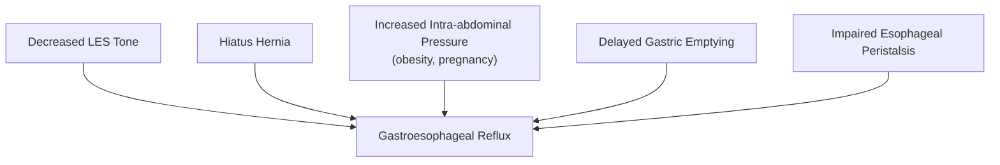
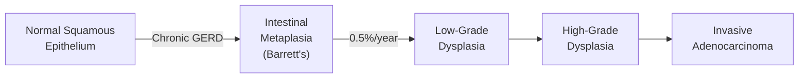
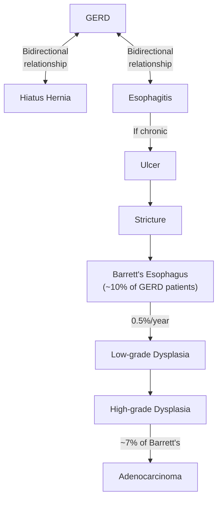
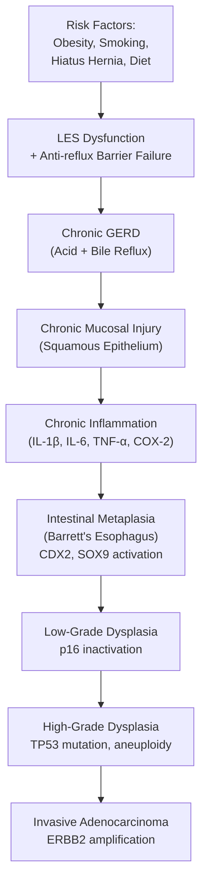

# Barrett's Esophagus

## Definition

Barrett's esophagus (BE) is the condition in which **any extent of metaplastic columnar epithelium that predisposes to cancer development replaces the stratified squamous epithelium that normally lines the distal esophagus** [1][2]. The key defining histological feature is the presence of **specialized intestinal metaplasia characterized by mucus-secreting goblet cells** [2][3].

Let's break down the name and concept:
- "Barrett's" — named after Norman Barrett, a British thoracic surgeon who first described the condition in 1950 (though he initially misinterpreted it).
- "Metaplasia" — "meta" = change, "plasia" = formation/growth — one mature cell type is replaced by another mature cell type. This is an **adaptive** response: the intestinal-type columnar epithelium handles chronic acid exposure far better than the native delicate squamous epithelium. Think of it as the esophagus "giving up" and transforming its lining to cope with relentless acid injury.

This is clinically critical because Barrett's esophagus is the **only known precursor lesion for esophageal adenocarcinoma**, following the metaplasia → dysplasia → carcinoma sequence [1][2].

<Callout title="Key Concept">
Barrett's esophagus is an **adaptation mechanism** — intestinal epithelium withstands exposure to acidic reflux better than native esophageal squamous epithelium. However, this "protective" adaptation paradoxically predisposes to adenocarcinoma. The cellular turnover and genetic instability inherent to metaplastic tissue creates a fertile ground for dysplastic changes.
</Callout>

---

## Epidemiology

### Global and Hong Kong Context

- **Male predominance**: M:F ratio ≈ **2:1** [1]
- **Mean age of diagnosis**: ~55 years old, typically discovered during endoscopic examination of **middle-aged and older adults** [1]
- Prevalence in patients undergoing endoscopy for GERD symptoms: approximately **5–15%**
- General population prevalence (from autopsy and screening studies): estimated at **1–2%**, suggesting many cases are undiagnosed
- In **Hong Kong**, squamous cell carcinoma (SCC) remains the most common esophageal cancer subtype (**~90%** of cases) [4], unlike Western countries where adenocarcinoma has overtaken SCC. However, with increasing Westernization of diet, rising obesity rates, and increasing GERD prevalence in Asia, the incidence of Barrett's esophagus and esophageal adenocarcinoma is **rising** in Hong Kong and other Asian populations.
- The annual risk of progression from Barrett's esophagus to adenocarcinoma is approximately **0.5% per year** (or ~1 in 200 patient-years) [3]. While this sounds low, over decades of surveillance, it becomes clinically significant.

<Callout title="Hong Kong Context" type="idea">
Although Barrett's-related adenocarcinoma is still less common than SCC in HK, the trend is shifting. A rising prevalence of GERD and obesity in Asian populations means Barrett's esophagus is becoming increasingly relevant in local clinical practice. Don't dismiss Barrett's as a "Western disease."
</Callout>

### Risk Factors

| Risk Factor | Mechanism / Explanation |
|---|---|
| **Chronic GERD** (strongest risk factor) | Sustained acid + bile reflux causes repeated injury to squamous epithelium → triggers metaplastic change as a protective adaptation [1][2] |
| **Obesity** (especially central/visceral) | ↑ Intra-abdominal pressure → mechanical disruption of LES → worsens reflux; adipose tissue also produces pro-inflammatory cytokines (TNF-α, IL-6) that promote metaplasia [1] |
| **Hiatus hernia** | Disrupts the anatomical anti-reflux barrier (loss of intra-abdominal esophageal segment, ↓ angle of His, ↓ crural diaphragm compression) → enables prolonged acid exposure [1][2] |
| **Erosive esophagitis** | Indicates severe mucosal injury already occurring → more likely to trigger reparative metaplasia [1] |
| **Male sex** | Hormonal theory: estrogen may be protective (pre-menopausal women have lower rates); testosterone/androgen effects may promote progression |
| **Age > 50** | Cumulative acid exposure over decades; age-related decline in esophageal motility and LES tone |
| **Caucasian ethnicity** | Genetic predisposition (though Asian incidence is rising) |
| **Smoking** | Weakens LES tone, reduces salivary bicarbonate (impairs acid neutralization), direct mucosal toxicity |
| **Family history of Barrett's/esophageal adenocarcinoma** | Genetic susceptibility — first-degree relatives have a 7–10× increased risk |
| **Dietary factors** | High fat diet → ↑ gastric acid secretion, ↓ LES tone; low fruit/vegetable intake → reduced antioxidant protection |

**Protective factor** — an interesting one:

- ***H. pylori* infection is considered a protective factor** against Barrett's esophagus [3]. Why? *H. pylori*-associated **atrophic gastritis** leads to **parietal cell atrophy** → reduced gastric acid secretion → less acid available to reflux into the esophagus. The eradication of *H. pylori* in developed nations may paradoxically have contributed to the rise of GERD and Barrett's esophagus. This is the so-called "*H. pylori* paradox" — eradicating it reduces peptic ulcer and gastric cancer risk but may increase GERD-related disease.

<Callout title="Must Know for Exams" type="error">
Do NOT confuse risk factors for SCC vs adenocarcinoma of the esophagus. Barrett's esophagus predisposes to **adenocarcinoma** (lower 1/3), NOT squamous cell carcinoma (upper 2/3). SCC risk factors are alcohol, smoking, hot drinks, achalasia, Plummer-Vinson syndrome, caustic injury. Adenocarcinoma risk factors centre on GERD → Barrett's → cancer.
</Callout>

---

## Anatomy and Function

Understanding the anatomy is essential to understanding why Barrett's occurs where it does and how we diagnose it.

### Esophageal Anatomy Overview

The esophagus is a muscular tube extending from **C6 (cricopharyngeus / upper esophageal sphincter)** to **T10/T11 (where it enters the stomach through the diaphragmatic hiatus)** [5]. It is approximately 25 cm long in adults.

#### Divisions

| Part | Extent | Muscle Type | Arterial Supply | Venous Drainage | Lymphatic Drainage |
|---|---|---|---|---|---|
| **Cervical** | Cricopharyngeus → suprasternal notch | Skeletal | Inferior thyroid artery (← thyrocervical trunk) | Brachiocephalic veins | Deep cervical nodes |
| **Thoracic** | Suprasternal notch → diaphragm | Mixed skeletal + smooth | ***Esophageal branches of thoracic aorta*** [5] | Azygos veins (→ IVC) | Mediastinal (superior + posterior) nodes |
| **Abdominal** | Diaphragm → cardia of stomach | Smooth | ***Esophageal branches of left gastric artery*** [5] | ***Left gastric vein*** (→ portal vein) [5] | Along left gastric / celiac nodes |

[1][2][5]

#### Key Anatomical Points for Barrett's

- The **lower esophageal sphincter (LES)** is not a true anatomical sphincter but a **physiological high-pressure zone** (~3–4 cm long) maintained by intrinsic smooth muscle tone + extrinsic compression from the crural diaphragm.
- The ***gastroesophageal junction (GEJ) / esophagogastric junction (EGJ)*** is the anatomical landmark defined endoscopically at the level of the **most proximal extent of the gastric folds** [2].
- The ***squamocolumnar junction (SCJ / Z-line)*** is the visible line where the **pale, glossy squamous epithelium** meets the **salmon-pink, velvety columnar epithelium** [2].

#### Histological Layers (inside out)

The esophageal wall, like the rest of the GI tract, follows the general layered structure [5]:

1. **Mucosa**: stratified squamous non-keratinized epithelium (this is what gets replaced in Barrett's)
2. **Submucosa**: contains **Meissner's plexus** (submucosal plexus — controls secretory activity) and **interstitial cells of Cajal** (pacemaker cells)
3. **Muscularis propria**: outer longitudinal + inner circular muscle layers with ***Auerbach's (myenteric) plexus*** in between — controls muscle contraction and peristalsis [2]
4. **Adventitia** (cervical and thoracic) / **Serosa** (abdominal, below diaphragm)

<Callout title="Why No Serosa Matters">
The thoracic esophagus **lacks a serosa** — it only has adventitia. This has profound surgical implications: (1) esophageal cancers invade adjacent structures **earlier** because there is no serosal barrier; (2) esophageal anastomoses are more prone to **leakage** compared to other GI anastomoses; (3) perforation leads rapidly to **mediastinitis**.
</Callout>

#### Physiological Constrictions

These are clinically relevant as they are where foreign bodies get stuck and where tumours may be located. A useful mnemonic: **ABCD** [5]:
- **A**rch of aorta
- **B**ronchus (left main stem bronchus)
- **C**ricoid cartilage (at the UES — narrowest point)
- **D**iaphragmatic hiatus

#### Anti-Reflux Mechanisms

Understanding what normally prevents reflux helps explain why Barrett's develops when these mechanisms fail:

1. **LES tone** (intrinsic smooth muscle tone): normally ~15–30 mmHg above intragastric pressure
2. **Crural diaphragm** (extrinsic compression): acts as a "pinch-cock" around the esophagus during inspiration
3. **Intra-abdominal segment of esophagus**: positive intra-abdominal pressure compresses it shut
4. **Angle of His** (acute angle between esophagus and gastric fundus): acts as a flap valve
5. **Mucosal rosette/fold**: mucosal folds at the GEJ create a valve-like effect
6. **Esophageal peristalsis**: clears any refluxed material back into the stomach
7. **Salivary bicarbonate**: neutralizes residual acid in the esophagus

When multiple mechanisms fail (as in hiatus hernia + obesity + LES dysfunction), the stage is set for chronic GERD → Barrett's.

---

## Etiology (Focused on Hong Kong)

### The Central Etiology: Chronic GERD

Barrett's esophagus develops as a **consequence of chronic, usually long-standing GERD** [1][2]. In Hong Kong, the prevalence of GERD has been increasing, with current estimates of ~6–9% of the population experiencing weekly reflux symptoms. This mirrors global trends driven by:
- Increasing **obesity** rates (especially visceral/central obesity)
- Adoption of **Western dietary patterns** (high-fat, processed foods)
- **Ageing population** (reduced esophageal motility, increased hiatus hernia prevalence)
- Widespread use of medications that relax the LES (calcium channel blockers, anticholinergics, benzodiazepines)

### Contributing Factors Particularly Relevant in HK

| Factor | Relevance in HK |
|---|---|
| Rising obesity | BMI trends increasing, especially among men aged 40–60 |
| Declining *H. pylori* prevalence | As sanitation improves and eradication therapy is widespread, the "protective" effect is lost → more acid → more GERD → more Barrett's |
| Ageing population | One of the most rapidly ageing populations globally → more cumulative acid exposure |
| Dietary westernization | High-fat diets, late-night eating culture, alcohol consumption |
| Smoking prevalence | Still significant, especially among older males |
| High prevalence of hiatus hernia in elderly | Diaphragmatic weakening with age |

---

## Pathophysiology

The pathophysiology of Barrett's esophagus follows a logical cascade. Let's walk through it step by step:

### Step 1: Failure of Anti-Reflux Mechanisms → GERD

As described above, when multiple anti-reflux mechanisms fail:

**Key mechanisms of LES dysfunction** [2]:
- **↓ LES tone**: The intrinsic smooth muscle becomes hypotonic → less effective barrier. Factors: fatty foods, alcohol, chocolate, caffeine, smoking, drugs (CCBs, nitrates, anticholinergics)
- **Transient LES relaxations (TLESRs)**: These are the **most common mechanism** of reflux — inappropriate, non-swallowing-related relaxations mediated by a vagal reflex triggered by gastric distension. They are more frequent and prolonged in GERD patients.
- **Hiatus hernia**: Anatomically, the LES sits within the diaphragmatic hiatus. When the GEJ herniates into the thorax (sliding hiatus hernia — Type I), the crural diaphragm no longer reinforces the LES. Additionally, the **intra-abdominal esophageal segment** is shortened or lost, and the **angle of His** becomes obtuse [2][5]. This creates a "two-sphincter" problem — the LES and crural diaphragm are now separated.

### Step 2: Chronic Acid (± Bile) Exposure → Mucosal Injury

- Normal esophageal pH is ~7 (neutral). In GERD, the distal esophageal pH drops to < 4 for prolonged periods.
- **Acid** (HCl) and **pepsin** cause direct epithelial damage (pepsin is activated at low pH and causes proteolytic destruction).
- **Bile salts** (duodenogastroesophageal reflux) are particularly important in Barrett's pathogenesis — bile salts at neutral or slightly acidic pH are toxic to squamous epithelium and promote intestinal metaplasia via activation of CDX2, a key intestinal transcription factor.
- Inflammatory mediators (IL-1β, IL-6, IL-8, TNF-α) are released in response to mucosal injury → inflammatory infiltrate → further tissue damage.

### Step 3: Metaplasia — The Cellular Response

- **Metaplasia** is a reversible adaptive response in which one differentiated cell type is replaced by another that is better suited to the hostile environment.
- In Barrett's: **stratified squamous epithelium → specialized intestinal columnar epithelium** containing **goblet cells** (intestinal-type metaplasia).
- Why intestinal-type? The intestinal epithelium has evolved to handle acidic/enzymatic environments. Goblet cells produce protective mucus. Columnar cells have a much thicker glycocalyx and secrete bicarbonate.
- This switch is driven by alteration of **stem cell differentiation** at the basal layer. The progenitor cells in the squamous epithelium (or possibly from the GEJ cardiac glands, or possibly from circulating bone marrow-derived stem cells) are reprogrammed by:
  - Chronic inflammation
  - Activation of transcription factors: **CDX1**, **CDX2** (caudal-type homeobox genes — master regulators of intestinal differentiation), **SOX9**, **HNF4α**
  - Epigenetic changes
  - Hedgehog and BMP signaling pathway activation

### Step 4: Dysplasia → Adenocarcinoma (The Metaplasia–Dysplasia–Carcinoma Sequence)

This is the dreaded progression and the whole reason we care about Barrett's:

- **Intestinal metaplasia → Low-grade dysplasia (LGD)**: Cells show architectural distortion and nuclear abnormalities but confined to the lower portion of crypts
- **LGD → High-grade dysplasia (HGD)**: More severe cytological and architectural abnormalities; nuclear changes extend to the surface epithelium; carcinoma in situ
- **HGD → Invasive adenocarcinoma**: Penetration through the basement membrane

Key molecular events along this progression:
- **p53 mutations** (most common — TP53 loss of function → loss of cell cycle checkpoint → uncontrolled proliferation)
- **p16/CDKN2A** inactivation (loss of cell cycle inhibition at G1/S checkpoint)
- **Aneuploidy** (chromosomal instability)
- **ERBB2 (HER2)** amplification (in some adenocarcinomas — targetable with trastuzumab)
- Telomerase activation, COX-2 overexpression

> ***The risk of developing esophageal adenocarcinoma is 30–100× compared with the normal population*** [2].

<Callout title="The Metaplasia–Dysplasia–Carcinoma Sequence" type="idea">
This is the conceptual backbone of Barrett's management. Everything we do — surveillance endoscopy, biopsies, ablation, resection — is aimed at **catching and intervening in this progression** before invasive cancer develops. The entire surveillance strategy is built around detecting dysplasia early.
</Callout>

---

## Classification

### By Segment Length

| Classification | Definition | Significance |
|---|---|---|
| ***Long-segment Barrett's esophagus (LSBE)*** | Distance between GEJ and Z-line **≥ 3 cm** [2] | Higher cancer risk; requires more vigilant surveillance |
| ***Short-segment Barrett's esophagus (SSBE)*** | Distance between GEJ and Z-line **< 3 cm** [2] | Lower cancer risk but still significant; more common |
| **Ultra-short segment** | < 1 cm of columnar mucosa above GEJ | Controversial — some guidelines don't consider this true Barrett's unless goblet cells are confirmed |

### Prague C & M Classification [3]

This is the **internationally standardized endoscopic classification system** for Barrett's esophagus:

- **C** = **Circumferential** extent: the length of the circumferential (full 360°) segment of columnar mucosa above the GEJ
- **M** = **Maximal** extent: the length of the longest tongue/island of columnar mucosa above the GEJ (including non-circumferential extensions)

Example: "C3M5" means 3 cm of circumferential Barrett's and the longest tongue extends 5 cm above the GEJ.

Why does this matter? It standardizes reporting, allows comparison between endoscopies, and helps stratify cancer risk (longer segments = higher risk).

### By Histological Degree of Dysplasia

| Grade | Histological Features | Clinical Implication |
|---|---|---|
| **Non-dysplastic** | Intestinal metaplasia with goblet cells; no cytological or architectural atypia | Surveillance only |
| **Indefinite for dysplasia** | Changes that could be dysplasia but may be due to inflammation/regeneration | Optimize PPI therapy → repeat biopsy in 3–6 months |
| **Low-grade dysplasia (LGD)** | Cytological atypia (enlarged, hyperchromatic nuclei) confined to lower half of crypts; preserved surface maturation | Enhanced surveillance or endoscopic treatment |
| **High-grade dysplasia (HGD)** | Severe cytological atypia extending to the surface; architectural complexity; but no invasion through basement membrane | Endoscopic treatment (EMR ± RFA) or surgery |
| **Intramucosal carcinoma** | Invasion through basement membrane into lamina propria but not into submucosa | Endoscopic resection feasible (low LN metastasis risk) |

<Callout title="Diagnosis Requires TWO Things" type="error">
To diagnose Barrett's esophagus, you need **BOTH**: (1) Endoscopic evidence of columnar mucosa lining the distal esophagus (proximal migration of Z-line), AND (2) Histological confirmation of **specialized intestinal metaplasia with goblet cells** on biopsy [2]. Without goblet cells on histology, you cannot confirm Barrett's (in most guidelines — though the British Society of Gastroenterology accepts columnar metaplasia without goblet cells).
</Callout>

---

## Clinical Features

### A Critical Point First

> ***Specialized intestinal columnar metaplasia of Barrett's esophagus causes NO symptoms by itself*** [2].

Barrett's esophagus is **clinically silent**. It does not produce any symptoms on its own. What patients experience are the symptoms of the **underlying GERD** (and occasionally complications of Barrett's itself, like stricture or ulceration). This is why Barrett's is typically discovered **incidentally** during endoscopy performed for GERD symptoms, or during screening/surveillance.

### Symptoms

All symptoms below are attributable to the underlying **GERD** or to **complications of Barrett's**:

#### 1. Heartburn (Most Common Presenting Symptom)
- **Description**: Burning sensation in the **retrosternal or epigastric area**, may radiate to the throat [2]
- **Pathophysiological basis**: Acid refluxate (pH < 4) directly stimulates chemosensitive nociceptors (TRPV1 receptors — transient receptor potential vanilloid 1) in the esophageal mucosa. Inflammatory mediators (bradykinin, prostaglandins, substance P) released from the injured mucosa further sensitize these nerve endings. The burning quality reflects activation of the same C-fibers that detect thermal pain.
- **Pattern**: Most commonly experienced in the **postprandial period** (after meals — when gastric acid secretion peaks and gastric distension triggers TLESRs). Worse with **lying down** or **bending forward** (gravity no longer helps keep acid in the stomach) [2].
- **Relieved by antacids** (directly neutralize acid → reduce nociceptor stimulation) [2].

<Callout title="Paradox Alert" type="idea">
Some Barrett's patients actually report **fewer** heartburn symptoms than typical GERD patients. Why? Because the metaplastic columnar epithelium is **less sensitive** to acid than the native squamous epithelium — the very adaptation that defines Barrett's also reduces symptom perception. This means Barrett's can be **"silent"** and patients may present late.
</Callout>

#### 2. Acid Regurgitation
- **Description**: Perception of refluxed gastric content flowing up the chest to the throat or mouth; acidic taste; regurgitation of acidic material mixed with small amounts of undigested food [2]
- **Pathophysiological basis**: Incompetent LES + increased gastric pressure → retrograde flow of gastric contents. The acid stimulates pharyngeal chemoreceptors, producing the sour/bitter taste. This is distinct from vomiting — regurgitation is effortless and not preceded by nausea.

#### 3. Dysphagia
- **Description**: Difficulty swallowing, typically for solids > liquids [2]
- **Pathophysiological basis**: Several mechanisms:
  - **Peptic stricture**: Chronic inflammation → fibrosis → circumferential narrowing of the esophageal lumen. Patients with **long-standing heartburn** are at higher risk. Strictures cause **progressive mechanical dysphagia** (solids before liquids) [2].
  - **Esophageal motility dysfunction**: GERD can cause secondary dysmotility (inflammation → muscle damage → abnormal peristalsis).
  - **Malignant stricture**: If Barrett's has progressed to adenocarcinoma, an obstructing mass can cause dysphagia — this is an **alarm symptom** requiring urgent investigation.
- **Clinical significance**: Dysphagia in a Barrett's patient is a **red flag** — needs urgent endoscopic evaluation to rule out malignancy or tight stricture.

#### 4. Chest Pain (Non-Cardiac)
- **Pathophysiological basis**: Esophageal pain fibers share the same spinal afferent pathways (T1–T5) as cardiac pain fibers → referred to the same dermatomes. Acid-induced esophageal spasm or mucosal inflammation can perfectly mimic angina. Always exclude cardiac causes first.

#### 5. Water Brash (Hypersalivation) [2]
- **Description**: Sudden filling of the mouth with clear, slightly salty fluid.
- **Pathophysiological basis**: This is a **vagal reflex**. Acid in the distal esophagus stimulates vagal afferents → efferent vagal response → increased salivary gland secretion. The saliva is rich in bicarbonate — it's the body's attempt to neutralize esophageal acid. Water brash is NOT the same as regurgitation (no gastric contents in the mouth, just saliva).

#### 6. Extra-Esophageal Symptoms of GERD [2]
These occur due to either (a) **direct contact** of refluxate with extra-esophageal structures, or (b) **vagally-mediated reflexes**:

| Symptom | Mechanism |
|---|---|
| **Chronic cough** | Micro-aspiration of acid into the tracheobronchial tree → irritation of cough receptors; or vagally-mediated reflex cough from acid in distal esophagus |
| **Hoarseness of voice** | Acid reflux reaching the larynx → posterior laryngitis → vocal cord edema and inflammation (relates to ***GC 216 lecture on dysphonia***) [6] |
| **Throat tightness / Globus sensation** | Cricopharyngeal spasm or upper esophageal sphincter dysfunction secondary to acid irritation |
| **Dental erosions** | Chronic acid exposure to tooth enamel (erosion of lingual surfaces of upper teeth is classic) |
| **Sleep disturbances** | Nocturnal reflux → arousals, cough, choking episodes |
| **Asthma exacerbation** | Micro-aspiration → bronchospasm; or vagal reflex → bronchospasm |

#### 7. Symptoms of Barrett's Complications
- **Upper GI bleeding** (hematemesis/melena): From **Barrett's ulceration** — deep ulcers in metaplastic epithelium that erode into submucosal vessels [3]
- **Progressive dysphagia**: From **peptic stricture** formation — fibrotic narrowing of the Barrett's segment
- **Progressive dysphagia + weight loss**: **Alarm symptoms** suggesting malignant transformation to adenocarcinoma

### Signs

Barrett's esophagus typically has **no specific physical signs** on examination. However, you may find signs related to:

#### Signs of Chronic GERD
- **Dental erosion**: Loss of enamel on the lingual (inner) surfaces of upper teeth — pathognomonic of chronic acid reflux reaching the oral cavity
- **Pharyngeal erythema**: Posterior pharynx redness from chronic acid irritation
- **Hoarse voice**: If posterior laryngitis has developed

#### Signs of Complications
- **Pallor**: If chronic bleeding from Barrett's ulceration has caused iron deficiency anemia
- **Weight loss / cachexia**: Alarm sign suggesting malignant transformation
- **Epigastric tenderness**: Non-specific, may be present with active esophagitis
- **Left supraclavicular lymphadenopathy (Virchow's node / Troisier's sign)**: Suggests metastatic esophageal or gastric adenocarcinoma — a late finding indicating **disseminated disease** [2]

<Callout title="Alarm Features in Barrett's / GERD (Red Flags)" type="error">
The following mandate urgent endoscopy:
- **Dysphagia** (progressive, especially for solids)
- **Odynophagia** (painful swallowing)
- **Unintentional weight loss**
- **GI bleeding** (hematemesis, melena, iron deficiency anemia)
- **Persistent vomiting**
- **Palpable mass or lymphadenopathy**
- **Age > 55 with new-onset symptoms**

These suggest either complicated Barrett's (stricture, ulcer) or malignant transformation to adenocarcinoma.
</Callout>

---

## Relationship with GERD, Hiatus Hernia, and Esophagitis

These three conditions are **inter-related but can occur independently** [3]:

[3]

Key relationships:
- **Almost all patients** who develop esophagitis, Barrett's esophagus, and peptic strictures **have hiatus hernia** [2]. Hiatus hernia is the most important anatomical contributor.
- However, not all patients with hiatus hernia develop GERD, and not all GERD patients have hiatus hernia.
- **~10% of GERD patients** develop Barrett's esophagus [3].
- **~7% of Barrett's patients** develop adenocarcinoma over their lifetime [3].

---

## Esophageal Anatomy — Relevance to Barrett's Complications and Spread

If Barrett's progresses to adenocarcinoma, understanding the anatomy becomes critical for staging and management:

- **Adenocarcinoma** arising from Barrett's occurs in the **lower 1/3** of the esophagus (where Barrett's develops) [1][2]
- ***Unlike SCC, adenocarcinoma is NOT multicentric*** [2] — it arises from a single focus within the Barrett's segment
- The ***Siewert classification*** categorizes tumours at the EGJ [2]:
  - ***Type I***: 5 to 1 cm proximal to Z-line — adenocarcinoma of **distal esophagus** arising from Barrett's metaplasia
  - ***Type II***: 1 cm proximal to 2 cm distal to Z-line — true **cardia carcinoma**
  - ***Type III***: 2 to 5 cm distal to Z-line — **subcardial gastric carcinoma** infiltrating EGJ from below

<Callout title="Siewert Classification" type="idea">
This classification is clinically important because it determines the surgical approach: Type I is treated as esophageal cancer (esophagectomy), while Types II and III are treated as gastric cancer (gastrectomy). In Barrett's-related adenocarcinoma, you're most commonly dealing with Siewert Type I.
</Callout>

---

## Summary of Pathophysiology — Putting It All Together

Here is the complete pathophysiological cascade from risk factors to cancer:

---

<Callout title="High Yield Summary">

**Barrett's Esophagus — Key Points for Exams:**

1. **Definition**: Replacement of normal distal esophageal stratified squamous epithelium by specialized intestinal columnar epithelium with **goblet cells** — a metaplastic adaptation to chronic acid injury
2. **Etiology**: Develops from **chronic GERD**; key risk factors include obesity, hiatus hernia, male sex, Caucasian ethnicity, smoking, family history
3. **Protective factor**: *H. pylori* infection (causes parietal cell atrophy → less acid)
4. **Classification**: Long-segment (≥ 3 cm) vs Short-segment ( < 3 cm); Prague C&M classification for standardized reporting
5. **Diagnosis requires BOTH**: (a) Endoscopic evidence of columnar mucosa in distal esophagus (Z-line proximal to GEJ), AND (b) Histological confirmation of goblet cells
6. **Clinical features**: Barrett's itself is **asymptomatic** — symptoms are from underlying GERD (heartburn, regurgitation, dysphagia) or complications (ulceration, stricture, bleeding, adenocarcinoma)
7. **Cancer risk**: 30–100× normal population; ~0.5%/year progression rate; follows metaplasia → LGD → HGD → adenocarcinoma sequence
8. **Alarm features**: Progressive dysphagia, weight loss, GI bleeding, odynophagia → urgent endoscopy
9. **In HK**: SCC still predominant esophageal cancer (~90%), but adenocarcinoma incidence is rising with Westernization of diet and increasing obesity/GERD
10. **All Barrett's patients need lifelong PPI** regardless of symptoms

</Callout>

---

<ActiveRecallQuiz
  title="Active Recall - Barrett's Esophagus (Definition, Epidemiology, Pathophysiology, Clinical Features)"
  items={[
    {
      question: "What TWO criteria are required to diagnose Barrett's esophagus on endoscopy?",
      markscheme: "(1) Endoscopic documentation that columnar epithelium lines the distal esophagus (Z-line proximal to GEJ). (2) Histological confirmation of specialized intestinal metaplasia with goblet cells on biopsy.",
    },
    {
      question: "Explain why H. pylori infection is considered a PROTECTIVE factor against Barrett's esophagus.",
      markscheme: "H. pylori causes chronic gastritis and parietal cell atrophy, leading to reduced gastric acid secretion (hypochlorhydria). Less acid reflux means less esophageal mucosal injury, reducing the stimulus for metaplastic change. This is the H. pylori paradox.",
    },
    {
      question: "Describe the metaplasia-dysplasia-carcinoma sequence in Barrett's esophagus, including one key molecular event at the dysplasia stage.",
      markscheme: "Normal squamous epithelium -> intestinal metaplasia (Barrett's) -> low-grade dysplasia -> high-grade dysplasia -> invasive adenocarcinoma. Key molecular events: TP53 mutation (loss of cell cycle checkpoint), p16/CDKN2A inactivation, aneuploidy.",
    },
    {
      question: "Why might a patient with Barrett's esophagus paradoxically report FEWER heartburn symptoms than a typical GERD patient?",
      markscheme: "The metaplastic columnar epithelium is less sensitive to acid than native squamous epithelium. The adaptive change that defines Barrett's also reduces acid-induced nociceptor stimulation, meaning patients may have less symptomatic reflux despite ongoing mucosal injury.",
    },
    {
      question: "What is the Prague C and M classification? Give an example.",
      markscheme: "Standardized endoscopic classification for Barrett's. C = circumferential extent of columnar mucosa above GEJ. M = maximal extent of the longest tongue of columnar mucosa. Example: C3M5 means 3 cm circumferential Barrett's with longest tongue at 5 cm above GEJ.",
    },
    {
      question: "A 60-year-old man with known Barrett's esophagus presents with progressive dysphagia for solids and weight loss. What is the most concerning diagnosis and what anatomical feature of the esophagus facilitates early local spread?",
      markscheme: "Most concerning diagnosis: malignant transformation to esophageal adenocarcinoma. The thoracic esophagus lacks a serosa (only adventitia), which allows early invasion into adjacent mediastinal structures without a serosal barrier to limit spread.",
    },
  ]}
/>

---

## References

[1] Senior notes: felixlai.md (Barrett's esophagus section, felix:535)
[2] Senior notes: felixlai.md (Barrett's diagnosis, clinical features, management, and complications sections, felix:538, felix:540, felix:541, felix:542)
[3] Senior notes: maxim.md (Barrett's oesophagus section, maxim:109, maxim:110)
[4] Senior notes: maxim.md (CA esophagus epidemiology, maxim:116)
[5] Senior notes: maxim.md (Upper GI anatomy section, maxim:90)
[6] Lecture slides: GC 216. Dysphonia Laryngitis, voice abuse, tumour and laryngeal cancer.pdf
