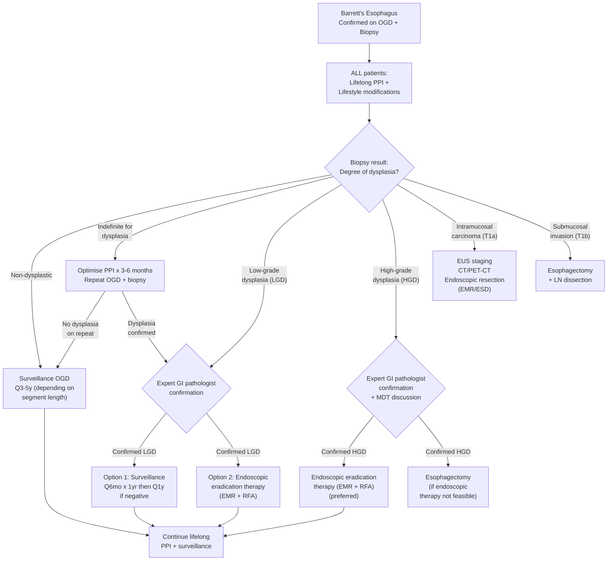

## Management of Barrett's Esophagus

### Overarching Principles

Before diving into specifics, let's establish the management philosophy. Barrett's management rests on **three pillars**:

1. **Treat the underlying cause** → Acid suppression (PPI) to halt ongoing mucosal injury
2. **Surveil for progression** → Endoscopic surveillance to catch dysplasia early
3. **Intervene when dysplasia develops** → Endoscopic eradication therapy (EET) or surgery to prevent/treat adenocarcinoma

> ***Treatment approaches depend on the result of the biopsy specimen*** [2]

The management algorithm is entirely **stratified by the degree of dysplasia** on biopsy. This is logical from first principles: a non-dysplastic Barrett's segment has a low annual cancer risk (~0.5%/year), so watchful waiting is appropriate. But high-grade dysplasia is essentially carcinoma in situ with a ~6–19% annual risk of progressing to invasive cancer — here you must act.

---

### Master Management Algorithm

---

### Pillar 1: Medical Therapy — Acid Suppression for ALL Patients

#### Proton Pump Inhibitors (PPIs) — The Foundation

> ***ALL patients with Barrett's esophagus should receive PPI whether they are symptomatic or not*** [2]

This is a critical exam point. Let's understand why:

**Mechanism of PPIs**: PPIs ("proton pump inhibitors") — the name tells you what they do. They irreversibly inhibit the **H⁺/K⁺-ATPase** (the "proton pump") on the apical surface of gastric parietal cells. This is the final common pathway for acid secretion, regardless of the stimulus (histamine, acetylcholine, gastrin). By blocking this pump, PPIs reduce gastric acid output by ~90–95%.

**Why lifelong PPI in Barrett's?**
1. **Reduce ongoing acid injury**: Even though metaplasia is already established, continued acid + bile exposure drives the inflammatory milieu that promotes the metaplasia → dysplasia → carcinoma sequence. PPIs markedly reduce acid exposure.
2. **May promote partial regression**: Some studies show that with sustained acid suppression, small islands of squamous epithelium can re-grow within the Barrett's segment ("squamous re-epithelialization"). Complete regression is rare, but any reduction in metaplastic area theoretically reduces cancer risk.
3. **May slow dysplastic progression**: Observational data suggest PPI use is associated with ~50% reduction in the risk of progression to HGD/adenocarcinoma. The mechanism: reduced acid-driven DNA damage, reduced cell proliferation rate, reduced inflammatory cytokine milieu.

**Practical prescribing** [15]:
- ***Examples: Omeprazole, esomeprazole, lansoprazole, pantoprazole, rabeprazole*** [15]
- **Dose**: High-dose (e.g., omeprazole 20 mg BD or esomeprazole 40 mg daily) — aim to fully suppress acid
- **Timing**: ***ALL PPIs except dexlansoprazole should be administered 30 min–1 hour before meals*** (before parietal cells are stimulated to secrete acid) ***to ensure maximal efficacy*** [15]. Why? PPIs bind to actively secreting proton pumps. If taken on an empty stomach without subsequent eating, fewer pumps are active → drug is wasted. Taking the PPI before breakfast activates the pumps as food arrives, and the drug catches them in their active state.

<Callout title="PPI Only Changes pH, Not Reflux" type="error">
PPIs ***only change acidic reflux into non-acidic reflux (change the pH) but do NOT prevent reflux*** [15]. The reflux mechanism (incompetent LES, hiatus hernia) is unaffected. Therefore:
- **Heartburn** is relieved (reduced acidity → less nociceptor stimulation)
- **Regurgitation usually remains uncorrected** since the reflux mechanism is not affected — this may require **anti-reflux surgery** [15]

This is a common misconception that loses marks in exams.
</Callout>

#### Lifestyle Modifications

These target the underlying GERD and are adjunctive to PPIs [15]:

| Modification | Mechanism |
|---|---|
| **Weight loss** | Reduces intra-abdominal pressure → reduces mechanical force on LES → less reflux |
| **Elevation of bed head** (15–20 cm blocks) | Gravity assists esophageal clearance during sleep; reduces nocturnal acid exposure [15] |
| **Avoidance of late meals** (***eating later than 2–3 hours before bedtime***) [15] | Allows gastric emptying before lying down → less acid available to reflux |
| ***Low-fat diet; avoidance of chocolate, spicy food, coffee*** [15] | Fat, chocolate, caffeine all lower LES tone; coffee also stimulates acid secretion |
| **Smoking cessation** | Smoking reduces LES tone + reduces salivary bicarbonate (impairs acid neutralization) |
| ***Avoid alcohol*** [15] | Directly relaxes LES + irritates esophageal mucosa |
| ***Avoidance of tight belts, corsets*** [15] | Reduce external compression on abdomen that could increase intra-abdominal pressure |
| **Eat small frequent meals** | Smaller meals produce less gastric distension → fewer transient LES relaxations |

#### H2-Receptor Antagonists (H2RAs) — Adjunctive Role [15]

- **Mechanism**: Block histamine H2 receptors on parietal cells → reduce acid secretion (but only one of three stimulatory pathways, so less potent than PPIs)
- ***Examples: Cimetidine, Famotidine*** [15]
- **Role in Barrett's**: Sometimes added at bedtime for nocturnal acid breakthrough (acid secretion that occurs during sleep despite daytime PPI). However, ***regular use of H2RA will lead to tolerance and loss of therapeutic effects*** → should be used **intermittently** only [15]
- Not a substitute for PPI in Barrett's

#### Aspirin / Chemoprevention

- There is growing evidence that **low-dose aspirin** may reduce the risk of progression from Barrett's to adenocarcinoma by ~50% (via COX-2 inhibition → reduced prostaglandin-mediated cell proliferation and angiogenesis)
- The **AspECT trial** (2018) showed that high-dose PPI + aspirin together provided the greatest reduction in progression
- **Current guidelines**: Aspirin chemoprevention is NOT routinely recommended for all Barrett's patients, but may be considered in those already taking aspirin for cardiovascular indications. The decision should weigh bleeding risk vs cancer prevention benefit.

---

### Pillar 2: Endoscopic Surveillance

The ***goal of surveillance is to improve outcomes by detecting dysplasia or esophageal CA early enough to provide effective treatment*** [13].

#### Surveillance Schedule (by Dysplasia Grade)

| Dysplasia Grade | Surveillance Protocol | Rationale |
|---|---|---|
| **Non-dysplastic, LSBE ( ≥ 3 cm)** | ***OGD + biopsy every 3 years*** [2][3] | Longer segments have more metaplastic tissue at risk; moderate cancer risk warrants regular (but not intense) monitoring |
| **Non-dysplastic, SSBE ( < 3 cm)** | ***OGD + biopsy every 5 years*** [3] | Shorter segment = lower cancer risk; less frequent surveillance is sufficient |
| **Indefinite for dysplasia** | Optimise PPI for 3–6 months → repeat OGD + biopsy | Inflammation may mimic dysplasia; acid suppression reduces inflammatory atypia. If repeat shows no dysplasia, revert to routine surveillance |
| ***Low-grade dysplasia (confirmed)*** | ***OGD at 6 months x 2, then annually if negative*** [2][3] **OR** endoscopic eradication therapy (EMR + RFA) | LGD has ~0.5–1.3%/year progression rate; enhanced surveillance or treatment both acceptable. Trend is towards treatment especially if confirmed on repeat |
| ***High-grade dysplasia (confirmed)*** | ***Endoscopic eradication therapy (EMR + RFA) advised*** [2][3]; ***intense surveillance every 3 months*** if patient declines [3] | HGD has ~6–19%/year progression risk and may already harbour occult invasive cancer in up to 40% of cases — treatment strongly recommended |

#### Surveillance Technique

- ***Methods of surveillance*** [13]:
  - ***Chromoendoscopy***
  - ***High-resolution white light endoscopy***
  - ***Narrow band imaging (NBI)***
- **Seattle protocol biopsies** (4-quadrant, every 1–2 cm) + targeted biopsy/EMR of any visible mucosal abnormality
- **Expert GI pathologist review** mandatory for any dysplasia diagnosis

#### When to STOP Surveillance

Consider discontinuing surveillance when:
- Patient's life expectancy is < 5 years (comorbidities, advanced age)
- Patient declines continued surveillance
- Patient has had complete eradication of intestinal metaplasia (CEIM) confirmed on 2 consecutive endoscopies after treatment — but even then, surveillance continues at reduced frequency (every 1–3 years) because of risk of **recurrence / buried Barrett's**

---

### Pillar 3: Endoscopic and Surgical Intervention for Dysplasia

This is where the management becomes most nuanced. The key principle:

> Visible lesions (nodules, raised areas) → **resect** (EMR/ESD) for histological staging → then **ablate** the remaining flat Barrett's segment (RFA) to prevent metachronous neoplasia.

#### A. Endoscopic Eradication Therapy (EET)

This is the **preferred treatment** for confirmed LGD and HGD in Barrett's. It has two components that are usually combined:

##### 1. Endoscopic Mucosal Resection (EMR) — "Resect the visible"

***Endoscopic mucosal resection (EMR): Snare resection of dysplastic lesion*** [16]

**What it is**: A technique to remove a discrete mucosal lesion (nodule, raised area) from the esophageal wall by snaring it after lifting it off the submucosa with a submucosal injection.

**How it works**: ***Using hyaluronic acid + saline to elevate the lesion → snare and remove*** [17]. The submucosal injection creates a "cushion" that lifts the mucosa away from the muscularis propria, making resection safer (reduces perforation risk).

**Why EMR is critical**:
1. ***Any mucosal irregularities in the Barrett's segment should be removed with endoscopic resection with pathological evaluation*** [2] — visible lesions have the highest likelihood of harbouring HGD or carcinoma
2. The resected specimen provides **full-thickness mucosal histology** — far more accurate than a biopsy for assessing depth of invasion (T-staging: T1a vs T1b), differentiation, and completeness of resection
3. It is both **diagnostic AND therapeutic** — you treat the lesion AND get the definitive pathology answer

**Limitations of EMR** [16]:
- ***EMR is not effective for lesions > 2 cm since piecemeal resection is often necessary which increases chance of complications and makes it impossible to be conclusive about the completeness of resection at lateral margin*** [16]

##### 2. Endoscopic Submucosal Dissection (ESD) — For Larger Lesions

***Endoscopic submucosal dissection (ESD): Dissect lesions from the submucosa — ESD can remove larger lesions intact*** [16]

**Advantages over EMR**:
- ***ESD has higher en-bloc resection rate*** [17] — the entire lesion is removed in one piece regardless of size
- Better histological assessment of lateral and deep margins → more certain about completeness of resection
- Lower local recurrence rate

**Disadvantages**:
- More technically demanding
- Higher risk of perforation (~5% vs ~1% for EMR)
- Longer procedure time
- Requires specialist expertise

##### 3. Radiofrequency Ablation (RFA) — "Ablate the flat Barrett's"

***Endoscopic radiofrequency ablation (RFA) to ablate the remaining metaplastic epithelium*** [2]

**What it is**: After visible lesions are resected by EMR/ESD, the remaining flat Barrett's segment (which harbours no visible lesions but is still metaplastic) is ablated using heat energy delivered by a balloon-mounted or focal electrode array placed within the esophagus.

**How it works**: RFA delivers controlled radiofrequency energy (~12 J/cm², 300 W) to the mucosal surface. This generates thermal injury to a precise depth (~1 mm — mucosa and superficial submucosa only), destroying the metaplastic epithelium. When the ablated area heals in the acid-suppressed environment (high-dose PPI), **neosquamous epithelium** regrows in its place.

**Why ablate the flat Barrett's?** Because residual non-dysplastic Barrett's epithelium is still at risk for developing NEW dysplastic foci (metachronous neoplasia). Removing all metaplastic tissue achieves **complete eradication of intestinal metaplasia (CEIM)** — this is the treatment goal.

**Typical protocol**: EMR of visible lesions → healing period (6–8 weeks) → RFA of remaining flat Barrett's → repeat RFA sessions every 2–3 months until CEIM is achieved (usually 2–4 sessions)

**Success rates**: CEIM achieved in ~75–90% of patients; dysplasia eradication in > 90%

##### Combined EMR + RFA — The Standard of Care

> ***Low-grade dysplasia: Endoscopic mucosal resection (EMR) followed by endoscopic radiofrequency ablation (RFA) to ablate the remaining metaplastic epithelium*** [2]
>
> ***High-grade dysplasia: Endoscopic mucosal resection (EMR) followed by endoscopic radiofrequency ablation (RFA) to ablate the remaining metaplastic epithelium*** [2]

| Indication | Treatment | Rationale |
|---|---|---|
| **Confirmed LGD** (if opting for treatment) | EMR of visible lesions + RFA of flat Barrett's | Eliminates dysplastic tissue + prevents future dysplasia in remaining metaplasia |
| **Confirmed HGD** | EMR of visible lesions + RFA of flat Barrett's | Eliminates HGD + any occult early cancer + remaining at-risk metaplasia |
| **Intramucosal carcinoma (T1a)** | EMR/ESD of the cancer + RFA of remaining Barrett's | T1a has < 2% LN metastasis risk → endoscopic resection is curative in most cases [16] |

##### Indications for Endoscopic Therapy [16]

- ***Superficial cancer that is limited to mucosa (T1a)*** [16]
- Patients who preferred esophageal preservation [16]
- Confirmed LGD or HGD on biopsy (expert pathologist confirmed)

##### Contraindications / When NOT to Do Endoscopic Therapy

- ***Tumour invasion into submucosa (T1b) (even without visible LN involvement) should receive esophagectomy with LN dissection due to high frequency (20–25%) of concurrent findings of positive LNs*** [16]
- Poorly differentiated adenocarcinoma on EMR specimen (higher LN metastasis risk even if T1a)
- Lymphovascular invasion on histology
- Positive deep margin on EMR specimen
- Long-segment Barrett's with multifocal HGD (relative — may still attempt EET but higher failure rate)

<Callout title="T1a vs T1b — The Critical Distinction" type="error">
This is a make-or-break distinction in management:
- **T1a (mucosal)**: Invasion into lamina propria or muscularis mucosae — LN metastasis risk < 2% → **endoscopic resection** is adequate
- **T1b (submucosal)**: Invasion into submucosa — LN metastasis risk 20–25% → ***must proceed to esophagectomy with LN dissection*** [16]

This is why **EMR provides superior staging information** compared to biopsies alone — you need the full-thickness specimen to confidently distinguish T1a from T1b.
</Callout>

##### Advantages and Disadvantages of Endoscopic Therapy [16]

| | Advantages | Disadvantages |
|---|---|---|
| | ***Esophageal preservation*** [16] | ***Technically demanding*** [16] |
| | ***Reduced post-treatment mortality*** [16] | ***Lack of long-term outcomes and recurrence data*** [16] |
| | Avoids thoracotomy/laparotomy | Risk of "buried Barrett's" (metaplasia under neosquamous epithelium) |
| | Shorter hospital stay, faster recovery | Does not remove regional lymph nodes |
| | Repeatable | Requires ongoing surveillance even after CEIM |

#### B. Other Ablation Techniques

| Technique | Mechanism | Current Role |
|---|---|---|
| **Cryotherapy** (liquid nitrogen / CO₂) | Extreme cold → cellular necrosis → mucosal destruction | Alternative to RFA; useful for strictured segments where RFA balloon cannot be deployed |
| **Photodynamic therapy (PDT)** | Photosensitizing agent (e.g., porfimer sodium) accumulates in Barrett's tissue → activated by laser light → generates reactive oxygen species → tissue destruction | Largely replaced by RFA due to side effects (photosensitivity, stricture formation) |
| **Argon plasma coagulation (APC)** | Ionized argon gas delivers non-contact thermal energy | Used for small residual islands of Barrett's after RFA; not for primary treatment |

#### C. Anti-Reflux Surgery

Anti-reflux surgery (fundoplication) addresses the **underlying cause** of Barrett's (GERD) but does NOT directly treat or reverse the metaplasia.

##### Indications for Anti-Reflux Surgery in Barrett's [15][14]:
- ***Failure to respond to long-term medical maintenance therapy*** [15]
- ***Presented with severe regurgitation*** (PPIs don't prevent reflux, only change pH) [15]
- ***Barrett's esophagus*** (as an indication for surgery per senior notes) [15]
- ***Young and fit PPI-dependent patients*** (to avoid lifelong PPI) [14]
- ***GERD / complications unresponsive to medical treatment*** [14]

##### Contraindications [14]:
- ***Aperistalsis → risk of dysphagia*** [14] (if the esophagus cannot propel food past a tight wrap, the patient will have severe dysphagia)

##### Pre-operative Workup [14]:
- ***Esophageal manometry*** (mandatory — to confirm GERD, exclude achalasia, assess peristalsis)
- ***24h ambulatory pH monitoring*** (confirm pathological acid reflux)
- ***OGD + biopsy*** (document Barrett's extent, exclude malignancy)

##### Types of Fundoplication [14]:

| Type | Description | Characteristics |
|---|---|---|
| ***Nissen (Total)*** | ***360° wrap*** | ***More durable, but more dysphagia*** [14] |
| ***Toupet (Partial)*** | ***Posterior 270° wrap*** | ***Preferred in Chinese — less dysphagia*** [14] |
| ***Dor / Watson*** | ***Anterior 90–180° wrap*** | Used in Heller's myotomy (for achalasia) [14] |

##### Goals of Fundoplication [14]:
- ***Close the hiatal defect***
- ***Restore the pressure around LES and angle of His***
- ***Lengthen the intra-abdominal part of oesophagus***

##### Specific Complications of Fundoplication [14]:

| Complication | Mechanism | Management |
|---|---|---|
| ***Gas bloat syndrome (90%, especially Nissen)*** | ***Improved anti-reflux mechanism*** → inability to belch or vomit, abdominal distension, flatulence | ***Self-limiting in 4 weeks*** [14] |
| ***Dysphagia (50% early post-op, 10% long-term)*** | Wrap ***too tight*** → mechanical obstruction | ***Ix: Water-soluble contrast swallow. Tx: endoscopic Bougie balloon dilation / revise fundoplication*** [14] |
| **Recurrence of reflux** | Wrap ***too loose*** | May need redo surgery or return to PPI |
| ***Surgical emphysema*** | ***Gas absorbed in mediastinum*** [14] | Usually self-limiting |
| ***Perforation → mediastinitis*** [14] | Intraoperative esophageal injury | Emergency surgical repair |
| ***Slipped Nissen*** | ***Wrap slides down, GEJ retracts into chest*** [14] | Surgical revision |

**Efficacy**: ***PPI independence rate ~60%*** [14]

<Callout title="Does Fundoplication Prevent Cancer in Barrett's?">
This is a commonly asked question. The short answer: **probably not**. While fundoplication effectively controls reflux symptoms and may slow progression, there is **no definitive evidence** that anti-reflux surgery prevents the development of adenocarcinoma in Barrett's esophagus. Patients with Barrett's still require **continued endoscopic surveillance** after fundoplication.
</Callout>

#### D. Esophagectomy — The Definitive But Morbid Option

> ***Esophagectomy — Only therapy that removes all neoplastic epithelium along with any occult malignancy and regional LNs — Associated with high procedure-related morbidity and mortality*** [2]

##### Indications for Esophagectomy in Barrett's

- ***Tumour invasion into submucosa (T1b)*** [16] — even without visible LN involvement — due to **20–25% concurrent positive LN rate**
- **Failed endoscopic therapy** (recurrent HGD after multiple EET attempts)
- **HGD/T1a with poor prognostic features on EMR** (poor differentiation, lymphovascular invasion, positive deep margin)
- Patient preference (some prefer definitive surgery over repeated endoscopic sessions)

##### Approaches [16]:

| Approach | Description |
|---|---|
| **Transthoracic esophagectomy (TTE)** (Ivor Lewis / McKeown) | Abdominal + thoracic approach; allows extensive mediastinal lymphadenectomy |
| **Transhiatal esophagectomy (THE)** | Abdominal + cervical approach; avoids thoracotomy (lower pulmonary morbidity) but limited mediastinal LN dissection |
| **Minimally invasive esophagectomy (MIE)** | Laparoscopic + thoracoscopic; reduced surgical trauma, faster recovery |

##### Reconstruction

After removing the esophagus, continuity must be restored — typically with a **gastric conduit** (stomach is fashioned into a tube and pulled up into the chest/neck to reconnect with the remaining esophagus). Alternatives: colonic interposition, jejunal interposition.

##### Morbidity and Mortality

- Operative mortality: ~2–5% in high-volume centres (higher in low-volume centres)
- Major complications: anastomotic leak (~10–15%), pneumonia, chylothorax, recurrent laryngeal nerve injury (hoarseness), conduit necrosis
- This is why endoscopic therapy is **strongly preferred** when feasible — it avoids these serious surgical risks

---

### Management of Barrett's Complications

| Complication | Management |
|---|---|
| ***Esophageal stricture*** [2] | Endoscopic balloon dilation or bougie dilation; intensify PPI; repeat as needed |
| ***Esophageal ulceration (Barrett's ulcer)*** [2] | High-dose PPI; biopsy to exclude underlying malignancy; treat *H. pylori* if present |
| ***Esophageal hemorrhage*** [2] | Endoscopic hemostasis (injection, thermal, clips); IV PPI; blood transfusion if needed |
| ***Adenocarcinoma*** [2] | Stage-dependent: EET for T1a; esophagectomy for T1b+; neoadjuvant chemoRT for locally advanced; palliative for metastatic |

---

### Palliative Management (If Barrett's Has Progressed to Advanced Esophageal Adenocarcinoma)

For completeness, if Barrett's has already progressed to **unresectable or metastatic adenocarcinoma** [18]:

- ***Esophageal dilation with stenting*** — self-expanding metallic stents (SEMS) to maintain luminal patency and allow swallowing [18]
- ***Palliative chemoRT*** — cisplatin + 5-FU based regimens [18]
- ***Nutritional support*** — ***PEG (percutaneous endoscopic gastrostomy) or PEJ (jejunostomy) tube*** [18]
- ***Endoluminal laser*** — restore lumen in 90% of cases [18]
- Targeted therapy: **Trastuzumab** (anti-HER2) for HER2-positive adenocarcinoma; **Ramucirumab** (anti-VEGFR2); immune checkpoint inhibitors (nivolumab, pembrolizumab) for PD-L1 positive disease — these reflect current 2025–2026 treatment paradigms

---

### Summary Table: Management by Dysplasia Grade

| Grade | Medical | Endoscopic Surveillance | Endoscopic Treatment | Surgery |
|---|---|---|---|---|
| **Non-dysplastic** | ***Lifelong PPI*** + lifestyle mods [2] | ***Q3-5y*** [2][3] | Not indicated | Not for Barrett's alone |
| **Indefinite** | Optimise PPI x 3–6 months | Repeat OGD + biopsy after optimization | Not indicated until clarified | No |
| **LGD (confirmed)** | Lifelong PPI | ***Q6mo x 1yr, then Q1y*** [2][3] | ***EMR + RFA*** (increasingly preferred) [2] | No |
| **HGD (confirmed)** | Lifelong PPI | ***Q3mo if declining treatment*** [3] | ***EMR + RFA (advised)*** [2][3] | ***Esophagectomy if endoscopic Rx not feasible*** [2] |
| **T1a (intramucosal CA)** | Lifelong PPI | Post-treatment surveillance | EMR/ESD + RFA | If poor prognostic features on EMR |
| **T1b (submucosal CA)** | Neoadjuvant chemoRT may be considered | N/A | ***Not suitable*** [16] | ***Esophagectomy + LN dissection*** [16] |

---

<Callout title="High Yield Summary">

**Management of Barrett's Esophagus — Key Exam Points:**

1. **ALL Barrett's patients get lifelong PPI** regardless of symptoms — reduces acid injury, may slow dysplastic progression
2. PPIs change pH but do NOT prevent reflux — regurgitation requires anti-reflux surgery
3. Management is **stratified by dysplasia grade**: non-dysplastic → surveillance; LGD → enhanced surveillance OR EMR + RFA; HGD → EMR + RFA (preferred) or esophagectomy
4. **Endoscopic eradication therapy (EET)**: EMR for visible lesions (diagnostic + therapeutic) → RFA for remaining flat Barrett's → goal = complete eradication of intestinal metaplasia (CEIM)
5. **T1a vs T1b**: T1a (mucosal, < 2% LN met) → endoscopic resection; T1b (submucosal, 20–25% LN met) → esophagectomy + LN dissection
6. **EMR limitation**: not effective for lesions > 2 cm (piecemeal resection). ESD achieves higher en-bloc resection rates for larger lesions
7. **Anti-reflux surgery (fundoplication)**: indicated for PPI failure, severe regurgitation, young PPI-dependent patients. Nissen (360°) vs Toupet (270°, preferred in Chinese for less dysphagia). Does NOT prevent cancer — surveillance must continue
8. **Complications of fundoplication**: gas bloat syndrome (most common, self-limiting), dysphagia (too tight), reflux recurrence (too loose), slipped Nissen, perforation
9. **Esophagectomy**: definitive but morbid (2–5% mortality, 10–15% leak rate). Reserved for T1b, failed EET, or poor prognostic features
10. **Post-treatment surveillance continues** even after CEIM — risk of recurrence/buried Barrett's

</Callout>

---

<ActiveRecallQuiz
  title="Active Recall - Barrett's Esophagus Management"
  items={[
    {
      question: "Why must ALL Barrett's patients receive lifelong PPI, even if they are asymptomatic?",
      markscheme: "Lifelong PPI reduces ongoing acid injury to the metaplastic epithelium, may promote partial squamous re-epithelialization, and may slow progression through the metaplasia-dysplasia-carcinoma sequence (associated with approximately 50% reduction in progression to HGD/adenocarcinoma). PPIs change acid reflux into non-acid reflux but do not prevent reflux itself.",
    },
    {
      question: "Describe the standard endoscopic eradication therapy protocol for confirmed HGD in Barrett's esophagus.",
      markscheme: "Step 1: EMR of any visible mucosal irregularities (nodules, raised areas) for histological staging and therapeutic removal. Step 2: Healing period of 6-8 weeks. Step 3: RFA of remaining flat Barrett's segment to ablate residual metaplastic epithelium. Step 4: Repeat RFA sessions every 2-3 months until complete eradication of intestinal metaplasia (CEIM) is achieved (usually 2-4 sessions). Continue lifelong PPI and post-treatment surveillance.",
    },
    {
      question: "A Barrett's patient undergoes EMR of a visible nodule. Histology shows adenocarcinoma invading the submucosa (T1b) with no lymphovascular invasion. What is the next step and why?",
      markscheme: "Esophagectomy with lymph node dissection is required. Even without visible LN involvement, T1b tumours have a 20-25% rate of concurrent positive lymph nodes. Endoscopic therapy alone is NOT sufficient for T1b because it does not remove regional lymph nodes. This is the critical T1a vs T1b distinction.",
    },
    {
      question: "Name the three types of fundoplication, state which is preferred in Chinese patients, and explain one specific complication of Nissen fundoplication with its mechanism.",
      markscheme: "Nissen (total 360 degree), Toupet (posterior 270 degree), Dor/Watson (anterior 90-180 degree). Toupet is preferred in Chinese patients because it causes less dysphagia. Gas bloat syndrome (most common complication of Nissen, 90%): the improved anti-reflux mechanism prevents the patient from belching or vomiting, causing abdominal distension and flatulence. It is self-limiting within 4 weeks.",
    },
    {
      question: "What are the surveillance intervals for non-dysplastic Barrett's esophagus? How do they differ by segment length?",
      markscheme: "Long-segment Barrett's (>= 3 cm): OGD + biopsy every 3 years. Short-segment Barrett's (< 3 cm): OGD + biopsy every 5 years. Longer segments have more metaplastic tissue at risk, warranting more frequent surveillance. All patients continue lifelong PPI regardless.",
    },
    {
      question: "State one advantage and one disadvantage of ESD compared to EMR for Barrett's-related dysplastic lesions.",
      markscheme: "Advantage: ESD has a higher en-bloc resection rate, allowing removal of larger lesions intact in a single piece, giving better histological assessment of margins and lower local recurrence. Disadvantage: ESD is more technically demanding, has a higher perforation rate (approximately 5% vs 1% for EMR), and requires longer procedure time and specialist expertise.",
    },
  ]}
/>

## References

[2] Senior notes: felixlai.md (Barrett's management, felix:541)
[3] Senior notes: maxim.md (Barrett's oesophagus management and surveillance, maxim:109, maxim:110)
[13] Senior notes: felixlai.md (Barrett's surveillance methods, felix:542)
[14] Senior notes: maxim.md (GERD surgical treatment and fundoplication, maxim:107)
[15] Senior notes: felixlai.md (GERD medical and surgical treatment, felix:525, felix:526, felix:527)
[16] Senior notes: felixlai.md (Esophageal cancer endoscopic and surgical treatment, felix:555)
[17] Senior notes: maxim.md (EMR/ESD and esophagectomy, maxim:121)
[18] Senior notes: felixlai.md (Palliative treatment of esophageal cancer, felix:562)
