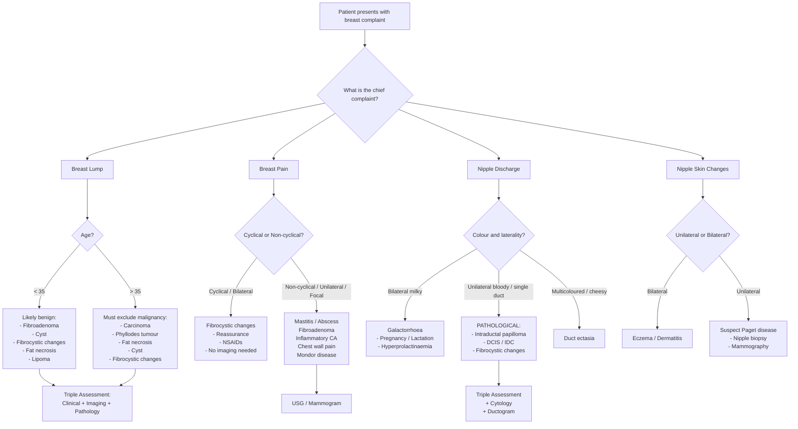

## Differential Diagnosis of Benign Breast Disease

The differential diagnosis of a breast complaint is fundamentally about one question: **is this cancer, or is it not?** Every patient presenting with a breast lump, breast pain, or nipple discharge must be worked through a systematic differential that risk-stratifies benign conditions while actively excluding malignancy. The approach depends on the **presenting complaint** (lump vs. pain vs. discharge), the **patient's age**, and the **clinical characteristics** of the lesion.

---

### Guiding Principles of the Differential Diagnosis

Before we enumerate specific differentials, understand the logic:

1. **Age is the single most important discriminator.** In a 22-year-old with a mobile rubbery lump, fibroadenoma is overwhelmingly likely. In a 55-year-old with a hard fixed lump, carcinoma must be at the top of your list until proven otherwise. Why? Because the incidence of malignancy rises steeply with age, while many benign conditions peak in the reproductive years.

2. **Triple assessment is mandatory for every breast lump** — clinical examination + imaging (mammography ± USG) + pathology (core needle biopsy or FNAC). No single element alone is sufficient. The differential guides which investigations you request, but the investigation results refine the differential.

3. **Benign conditions can mimic cancer** (and vice versa). Fat necrosis, sclerosing adenosis, radial scars, diabetic mastopathy, and IGM can all produce hard, irregular, fixed masses with skin changes and suspicious imaging — you cannot exclude malignancy without tissue diagnosis.

4. **Some benign conditions are themselves risk factors for cancer** (ADH, ALH, multiple papillomas) — so even after confirming a benign diagnosis, the differential "cancer" remains relevant for long-term surveillance.

---

### A. Differential Diagnosis of a Breast Lump

This is the most common presentation. The lecture slide provides a clean framework [1]:

> ***DDx of breast mass:***
> - ***Benign: Fibroadenoma, Cysts, Phyllodes tumour (benign), Others (skin lesions etc)***
> - ***Malignant: Carcinoma (in situ, invasive), Phyllodes tumour (malignant)***

#### Age-Based Differential Table [2]

| Consistency | ***Young ( < 35)*** | ***Old ( > 35)*** |
|:--|:--|:--|
| **Soft** | Fibrocystic changes | Fibrocystic changes |
| **Firm** | ***Fibroadenoma*** | ***Carcinoma*** |
| | Fat necrosis | Fat necrosis (with bruising history) |
| | Lipoma | Lipoma |
| | Breast cyst (tense, fluctuant) | ***Phyllodes tumour*** (freely mobile) |

Let's now walk through each differential systematically, explaining **why** each condition presents the way it does and **how** to distinguish them:

#### 1. Fibroadenoma — "The Breast Mouse"

- **Who:** Young women 15–35 (peak reproductive age) [3][4]
- **Why this age?** Fibroadenoma is a hormonally-dependent fibroepithelial neoplasm — it develops during the period of maximal lobular development and oestrogen stimulation.
- **Key distinguishing features:** ***Well-defined, rubbery, highly mobile, non-tender*** [3]. The high mobility ("breast mouse") occurs because it is encapsulated with no desmoplastic reaction tethering it to surrounding tissue.
- **What could fool you?** A small phyllodes tumour is clinically indistinguishable from fibroadenoma — suspect phyllodes if the mass is **large ( > 5 cm)**, **rapidly growing**, or in an **older patient ( > 40)** [3].
- **Cancer risk:** Simple fibroadenoma = **NO** increased risk. Complex fibroadenoma = slightly increased risk [3].

#### 2. Breast Cyst

- **Who:** Perimenopausal women (35–55), during the involution phase of the ANDI framework [2][4]
- **Why this age?** As lobules involute, efferent ductules may become obstructed → fluid accumulates → cyst formation. This is a normal part of breast involution gone slightly awry.
- **Key distinguishing features:** Soft to firm (depending on tension), fluctuant, smooth, mobile, may be tender (especially if enlarging rapidly) [3].
- **What could fool you?** A tense cyst can feel firm and mimic a solid mass. USG easily resolves this — cysts are **anechoic with posterior acoustic enhancement**. Also, an intracystic papilloma or intracystic carcinoma can have a solid component within the cyst wall — **blood-stained aspirate or a solid component on USG** mandates further investigation [2][4].

#### 3. Fibrocystic Changes (Fibroadenosis)

- **Who:** Reproductive-age women (25–55) [3][4]
- **Why?** Exaggeration of normal cyclical hormonal changes → stromal fibrosis + microcysts + hyperplasia.
- **Key distinguishing features:** ***Cyclical painful nodularity*** (not a discrete mass), bilateral, upper outer quadrants, worsens premenstrually. ***Serosanguinous nipple discharge*** may occur [4].
- **What could fool you?** A dominant area of fibrosis can feel like a discrete mass and mimic carcinoma. If there's a dominant palpable abnormality, it must undergo triple assessment.

#### 4. Phyllodes Tumour

- **Who:** Older women ( > 40, median 42–45) [3]
- **Why important?** Straddles the benign-malignant spectrum. ***Can be malignant and metastasize via blood (not lymph) — ALND not required*** [4].
- **Key distinguishing features:** Smooth, painless, mobile mass — resembles a large fibroadenoma but with **rapid growth** and often **large size**. Overlying skin may be shiny and stretched [3].
- **Red flags for malignancy:** Very large size, rapid growth, cystic areas on USG.

#### 5. Fat Necrosis

- **Who:** Any age, but key history of ***trauma or iatrogenic cause (e.g., breast reconstruction)*** [2]
- **Why it mimics cancer:** Ischaemic necrosis of fat lobules → inflammatory response → fibrosis and dystrophic calcification → hard, irregular, fixed mass with skin dimpling, nipple retraction. ***Mimics CA both clinically AND radiologically*** [2][4]. ***Core biopsy is required to differentiate*** [2].
- **Key distinguishing feature from cancer:** History of trauma/surgery + ecchymosis. But even with this history, biopsy is mandatory.

#### 6. Lipoma

- **Who:** Any age
- **Why?** Benign adipose tissue tumour; can occur in the subcutaneous tissue overlying the breast.
- **Key distinguishing features:** Soft, well-defined, lobulated, non-tender, mobile. Sits in the **subcutaneous plane** (movable with the skin, not deep to it).
- **What could fool you?** Large lipomas can be hard to distinguish from other soft masses by palpation alone. USG shows a well-circumscribed, compressible, echogenic mass.

#### 7. Breast Carcinoma — ***The Diagnosis You Must Never Miss***

- **Who:** Older women ( > 35, rising steeply after 50); ***median age 55 in Hong Kong*** [5]
- **Key distinguishing features:** ***Hard, irregular, fixed, non-tender mass, mostly at the upper outer quadrant*** [5]. Skin tethering, peau d'orange, nipple retraction, bloody nipple discharge, axillary lymphadenopathy.
- **Special types that can present differently:**
  - ***Paget's disease of the nipple:*** ***Eczematous changes involving the nipple*** → ***associated with malignancy within the same breast*** → ***malignant epithelial (Paget) cells infiltrate and proliferate in the epidermis, causing thickening of the nipple and areolar skin*** [1][8][9]. ***97% has underlying breast carcinoma, about half present with a breast mass*** [9]. ***50–60 years old*** [9]. ***Diagnosis: incisional biopsy*** [9]. Must be distinguished from eczema of the nipple — eczema is typically bilateral, Paget's is unilateral.
  - ***Inflammatory breast cancer (T4d):*** Invasion of local lymphatic ducts → painful, swollen breast with cutaneous oedema involving at least 1/3 of the breast (***peau d'orange***) [5]. Can mimic mastitis — the key differentiator is **failure to respond to antibiotics** and the presence of **skin biopsy showing dermal lymphatic invasion**.
- **Why carcinoma is hard and fixed:** Malignant cells induce a **desmoplastic reaction** (fibroblast activation and collagen deposition) in surrounding tissue, creating a hard mass. The tumour **invades** Cooper's ligaments (→ skin tethering/dimpling), the pectoral fascia (→ fixation to chest wall), and lymphatics (→ peau d'orange).

#### 8. Sclerosing Adenosis / Radial Scars

- **Who:** Any age [4]
- **Why important?** ***Can mimic CA*** clinically and radiologically — presents as a spiculated mass on mammography [4]. The sclerotic stroma distorts the lobular architecture, making it look infiltrative.
- **Management:** Conservative or excision to ***rule out CA*** [4]. Core biopsy is essential.

#### 9. Inflammatory/Infective Conditions (Mastitis, Abscess, IGM)

- These enter the differential when there is **pain, erythema, swelling, or warmth** — features not typical of most breast cancers (except inflammatory breast cancer).
- **Lactational mastitis:** Lactating woman, first 3 months postpartum, ***S. aureus***, responds to antibiotics [2][3].
- **Periductal mastitis/abscess:** Young smoker, subareolar, may have fistula [3].
- **Idiopathic granulomatous mastitis:** Young parous woman, hard irregular mass mimicking cancer, diagnosis of exclusion [3].
- **Key trap:** ***Inflammatory breast cancer*** can mimic mastitis. Always consider this if a "mastitis" in a non-lactating woman fails to respond to antibiotics, or if a lactating woman does not improve within 48–72 hours.

#### 10. Mondor's Disease

- **Superficial sclerosing thrombophlebitis** → ***palpable subcutaneous cord*** along the ***thoraco-epigastric vein*** [2].
- Self-limiting. Important mainly because the palpable cord can alarm the patient. Distinguished from other pathology by its **linear, cord-like** nature following the course of a superficial vein.

#### 11. Skin Lesions

- The lecture slide notes ***"Others (skin lesions etc)"*** [1] as part of the DDx. Sebaceous cysts (epidermal inclusion cysts), accessory nipples, and dermatofibromas over the breast can all present as palpable "breast lumps."
- **Key distinguishing feature:** They are in the **skin**, not the breast parenchyma — they move with the skin, are superficial, and USG shows they arise from the cutaneous/subcutaneous layer.

---

### B. Differential Diagnosis of Mastalgia (Breast Pain) [2]

| Type | DDx | Key Features |
|:--|:--|:--|
| ***Cyclical*** | ***Fibrocystic changes (MC)*** | Bilateral, diffuse, premenstrual worsening, improves after menses |
| ***Non-cyclical*** | ***Acute mastitis*** | Lactating woman, erythema, fever, tenderness |
| | Fibroadenoma | Usually painless but large or rapidly growing lesions can cause discomfort |
| | ***Inflammatory CA breast*** | Non-lactating woman, peau d'orange, fails antibiotics |
| | Chest wall pain (Tietze's syndrome, musculoskeletal) | Reproducible with palpation of costochondral junction; not truly breast pain |
| | Mondor's disease | Subcutaneous cord, tender along vein course |

**Approach:**
- ***Cyclical or bilateral diffuse pain → no imaging required, reassurance, conservative (NSAID)*** [2]
- ***Non-cyclical / unilateral / focal pain → USG / mammogram*** to investigate [2]

> Why does cyclical pain not need imaging? Because cyclical mastalgia is almost always due to physiological hormonal fluctuation (oestrogen-driven stromal oedema) and is extremely rarely associated with malignancy. Non-cyclical or focal pain, however, may indicate an underlying structural lesion.

---

### C. Differential Diagnosis of Nipple Discharge [2][3][6]

This is a common exam scenario. The approach hinges on **laterality, number of ducts, colour, and spontaneity**.

**Key history questions [2]:**
- Is it true nipple discharge (from the duct orifice) or fluid from a skin lesion?
- Unilateral or bilateral?
- Single duct or multiple ducts?
- Colour (milky, yellow/green, bloody)?
- Spontaneous or expressible only?
- Recent pregnancy/breastfeeding?

#### Differential by Colour and Pattern [2][6]

| Colour | Single Duct / Unilateral | Multiple Ducts / Bilateral | Pathophysiology |
|:--|:--|:--|:--|
| **Milky** | — | Pregnancy, lactation | Prolactin-driven milk production |
| | | ***Galactorrhoea*** (hyperprolactinaemia: prolactinoma, drugs — antipsychotics, metoclopramide; hypothyroidism, CKD) | ↑ Prolactin → milk production outside of lactation context [6] |
| **Yellow / Green** | ***Ductal ectasia*** (creamy, cheesy, multicoloured) | ***Infection (mastitis, abscess)*** | Duct ectasia: inspissated secretions in dilated ducts; Infection: purulent exudate [2] |
| | Fibrocystic changes | ***Hyperprolactinaemia*** | |
| **Bloody / Serosanguinous** | ***Intraductal papilloma*** (most common cause of bloody discharge) [6] | Fibrocystic changes with active intraductal component | Papilloma: friable fibrovascular core bleeds easily into the duct lumen [6] |
| | ***CA breast / DCIS*** | | Tumour neovascularisation and erosion into ducts → bloody discharge |
| | Duct ectasia (occasionally blood-stained) | | |

<Callout title="Pathological Nipple Discharge — Must Know">
***Pathological discharge*** = **spontaneous, persistent, unilateral, single-duct**. Can be serous, sanguineous, or serosanguineous. ***Malignancy is the underlying cause in 5–15% of cases; the most common associated malignancy is DCIS*** [6]. All pathological discharges require triple assessment ± cytology ± ductogram/ductoscopy.
</Callout>

#### Specific Differentials for Bloody Nipple Discharge [6]

1. ***Intraductal papilloma*** (most common cause) — friable fibrovascular core bleeds; solitary papilloma in large subareolar duct → single-duct bloody discharge
2. ***DCIS / Invasive ductal carcinoma*** — tumour erodes into duct; always exclude with mammography + core biopsy
3. ***Fibrocystic changes with active intraductal component*** — duct ectasia, intraductal hyperplasia, plasma cell mastitis [6]

---

### D. Differential Diagnosis of Nipple Eczema / Skin Changes

This deserves a dedicated section because of the critical differential of ***Paget's disease of the nipple***.

| Feature | Eczema / Dermatitis | ***Paget's Disease of the Nipple*** |
|:--|:--|:--|
| Laterality | Usually **bilateral** | ***Unilateral*** |
| Distribution | Areola first, then nipple | ***Nipple first, then areola*** |
| Edge | Poorly defined | ***Well-demarcated*** |
| Response to steroids | Improves | Does **NOT** improve |
| Underlying mass | No | ***97% has underlying breast carcinoma*** [9] |
| Age | Any | ***50–60 years old*** [9] |
| Histology | Spongiosis | ***Paget cells (large, pale, malignant intraepithelial adenocarcinoma cells) in nipple epidermis*** [1][8][9] |
| Diagnosis | Clinical | ***Incisional biopsy / full-thickness wedge biopsy*** [8][9] |

> ***Paget cells arise from mammary ducts to the nipple epidermis*** [9]. ***Erythema and eczematous lesion of the nipple → erosion and ulceration*** [9]. ***Treat underlying CA breast*** [9].

<Callout title="Critical Exam Trap" type="error">
A unilateral nipple eczema that does not respond to topical steroids is Paget's disease until proven otherwise. ***Almost always (80%+) associated with an underlying breast cancer (usually HER2 +ve)*** [8]. **Never dismiss unilateral nipple changes as "just eczema" without biopsy.**
</Callout>

---

### E. Pre-malignant Lesions in the Differential

When a biopsy reveals certain histological findings, you must consider pre-malignant lesions in your differential framework:

| Lesion | Nature | Cancer Risk | Key Action |
|:--|:--|:--|:--|
| ***ADH*** | Proliferative with atypia | ***4–5× risk*** | ***If found on core biopsy → excisional biopsy MUST be performed to rule out malignancy*** [7] |
| ***ALH*** | Proliferative with atypia | ***4–5× risk*** | Same as above; also enhanced surveillance [3] |
| ***DCIS*** | Carcinoma in situ | Precursor to invasive ductal CA (1%/year) [7] | Definitive surgical management + adjuvant therapy |
| ***LCIS*** | Carcinoma in situ | Precursor and **marker** of bilateral invasive CA (1%/year) [7] | Classical: observation; Non-classical (pleomorphic): excision [7] |

> Why must ADH on core biopsy lead to excisional biopsy? Because core needle biopsy samples only a small portion of the lesion. ADH and low-grade DCIS sit on a histological continuum — what looks like ADH on a core may actually be DCIS (or worse) when the entire lesion is examined. The **upgrade rate** from ADH to DCIS/invasive cancer on excision biopsy is approximately **15–30%** [7].

---

### F. Gynaecomastia — DDx in the Male Breast [10]

When a male presents with breast enlargement, the differential is:

| Diagnosis | Key Features |
|:--|:--|
| **Physiological gynaecomastia** | Newborn, adolescent, elderly; bilateral, concentric, tender |
| **Pathological gynaecomastia** | Altered oestrogen:androgen ratio — liver disease, drugs (***spironolactone***), hypogonadism, ***testicular tumour***, androgen insensitivity |
| **Pseudo-gynaecomastia (lipomastia)** | Fat deposition only; no glandular tissue; obese men |
| ***Male breast carcinoma*** | ***Unilateral, hard, non-tender, eccentric mass with lymphadenopathy*** in an ***older man without risk factors*** [10] |

**Suspect malignancy in the male breast if [10]:**
- Old patient
- Unilateral
- Non-tender, hard
- Lymphadenopathy
- Risk factors: ***BRCA2 carrier, Klinefelter's syndrome (XXY), prior radiation, increased oestrogen exposure*** [5]

---

### Differential Diagnosis Algorithm — Decision Flowchart

The following mermaid diagram integrates the presenting complaint with the DDx and the triple-assessment pathway:

---

### Master Comparison Table — Putting It All Together

| Condition | Peak Age | Mass Character | Pain | Discharge | Skin Changes | Mobility | Cancer Risk | Key Distinguishing Feature |
|:--|:--|:--|:--|:--|:--|:--|:--|:--|
| ***Fibroadenoma*** | 15–35 | Rubbery, well-defined | No | No | No | +++ | None (simple) | "Breast mouse" — most mobile |
| ***Phyllodes*** | > 40 | Large, smooth/lobulated | No | No | Shiny, stretched | ++ | Yes (malignant type) | Rapid growth, large size |
| ***Breast cyst*** | 35–55 | Smooth, fluctuant | ± | No | No | ++ | None | USG: anechoic, posterior enhancement |
| ***Fibrocystic changes*** | 25–55 | Diffuse nodularity | Cyclical | Serous | No | — | None to 2× | Cyclical worsening, bilateral |
| ***Intraductal papilloma*** | Perimenopausal | Small, subareolar | No | ***Bloody*** | No | — | 1.5–2× | Single-duct bloody discharge |
| ***Duct ectasia*** | > 50 | Subareolar | No | ***Cheesy, multicoloured*** | Nipple retraction | — | None | Creamy discharge, older woman |
| ***Fat necrosis*** | Any | Hard, irregular | ± | No | Dimpling, retraction | ± | None | ***Mimics CA*** — history of trauma |
| ***Mastitis / Abscess*** | Lactating | Diffuse induration | Yes | Purulent | Erythema, warmth | — | None | Lactating, responds to antibiotics |
| ***IGM*** | Young, parous | Hard, irregular | ± | No | Erythema, sinuses | — | None | ***Mimics CA*** — diagnosis of exclusion |
| ***Sclerosing adenosis / Radial scars*** | Any | Hard, spiculated (mammogram) | No | No | No | — | 1.5–2× | ***Mimics CA*** radiologically |
| ***Carcinoma*** | > 40 | ***Hard, irregular, fixed*** | Usually no | ***Bloody*** | ***Peau d'orange, tethering*** | Fixed | — | ***Non-tender, fixed, lymphadenopathy*** |
| ***Paget's disease*** | 50–60 | ± underlying mass | Pain/burning | Bloody | ***Unilateral nipple eczema*** | — | ***97% associated CA*** | Unilateral, doesn't respond to steroids |
| ***Inflammatory CA*** | Any | No discrete mass | Yes | No | ***Peau d'orange ( > 1/3 breast)*** | — | — | Mimics mastitis, fails antibiotics |

---

<Callout title="High Yield Summary">

**1. Differential of a breast lump is age-dependent:** Young ( < 35) → fibroadenoma, cyst, FBC. Old ( > 35) → carcinoma first, then phyllodes, cyst, fat necrosis.

**2. Triple assessment is ALWAYS required** for any breast lump — never diagnose clinically alone.

**3. Conditions that mimic carcinoma (exam favourites):** Fat necrosis, sclerosing adenosis/radial scars, IGM, diabetic mastopathy, phyllodes tumour → all need core biopsy.

**4. Pathological nipple discharge** = spontaneous, unilateral, single-duct, bloody/serous. Malignancy in 5–15%. Most common benign cause = intraductal papilloma. Most common malignancy = DCIS.

**5. Paget's disease of the nipple** = unilateral nipple eczema, does NOT respond to steroids, 97% has underlying breast carcinoma. Diagnosis by incisional biopsy. Paget cells arise from mammary ducts to nipple epidermis.

**6. ADH on core biopsy → excisional biopsy is MANDATORY** (upgrade rate to DCIS/cancer ~15–30%).

**7. Inflammatory breast cancer mimics mastitis** — suspect if non-lactating woman with "mastitis" fails antibiotics, or skin oedema involves ≥ 1/3 of the breast.

**8. Male breast cancer DDx:** Unilateral, hard, non-tender mass + lymphadenopathy in older man. Risk factors: BRCA2, Klinefelter, oestrogen exposure.

</Callout>

---

<ActiveRecallQuiz
  title="Active Recall - Differential Diagnosis of Benign Breast Disease"
  items={[
    {
      question: "A 50-year-old woman presents with a unilateral eczematous lesion of the nipple that has not responded to topical steroids for 6 weeks. What is the most likely diagnosis, what percentage have an underlying malignancy, and how do you confirm the diagnosis?",
      markscheme: "Paget disease of the nipple. 97% have an underlying breast carcinoma (often HER2+). Diagnosis confirmed by incisional biopsy or full-thickness wedge biopsy of the nipple showing Paget cells (malignant intraepithelial adenocarcinoma cells in the nipple epidermis). Mammography is mandatory to identify the underlying carcinoma.",
    },
    {
      question: "Name three benign breast conditions that can mimic breast carcinoma clinically or radiologically, and explain why each mimics cancer.",
      markscheme: "1) Fat necrosis: fibrosis and dystrophic calcification after ischaemic necrosis of fat produces a hard irregular mass with skin dimpling and spiculated appearance on mammogram. 2) Sclerosing adenosis or radial scars: sclerotic stroma distorts lobular architecture creating spiculated lesions on imaging. 3) Idiopathic granulomatous mastitis: granulomatous inflammation produces a hard irregular mass with skin changes. All require core biopsy to exclude malignancy.",
    },
    {
      question: "A perimenopausal woman presents with spontaneous bloody discharge from a single duct. List the differential diagnoses in order of likelihood and state the most common benign and malignant causes.",
      markscheme: "DDx: 1) Intraductal papilloma (most common benign cause - friable fibrovascular core bleeds into duct), 2) DCIS (most common malignant cause), 3) Invasive ductal carcinoma, 4) Fibrocystic changes with active intraductal component (duct ectasia, intraductal hyperplasia). Malignancy accounts for 5-15% of pathological nipple discharge cases.",
    },
    {
      question: "ADH is found on core needle biopsy. What is the mandatory next step and why?",
      markscheme: "Excisional biopsy is MANDATORY. Reason: core biopsy samples only a small portion of the lesion. ADH and low-grade DCIS are on a histological continuum. The upgrade rate from ADH on core biopsy to DCIS or invasive carcinoma on excision is approximately 15-30%. The full lesion must be examined to exclude a more advanced pathology.",
    },
    {
      question: "How do you differentiate inflammatory breast cancer from lactational mastitis?",
      markscheme: "Inflammatory breast cancer: non-lactating woman (or lactating woman not responding to antibiotics), skin oedema involving at least one-third of breast (peau d'orange), no discrete mass, fails to respond to antibiotics, skin biopsy shows dermal lymphatic invasion by tumour cells. Lactational mastitis: lactating woman (usually first 3 months postpartum), responds to antibiotics within 48-72 hours, S. aureus most common organism, localised erythema and induration.",
    },
    {
      question: "In a male patient with unilateral breast enlargement, what features suggest breast carcinoma rather than gynaecomastia?",
      markscheme: "Suspect malignancy if: older patient without known risk factors for gynaecomastia, unilateral mass, non-tender hard mass within breast tissue (vs. rubbery concentric mass in gynaecomastia), eccentric to nipple, associated axillary lymphadenopathy. Risk factors for male breast CA: BRCA2 mutation, Klinefelter syndrome (XXY), oestrogen therapy, prior radiation.",
    },
  ]}
/>

---

## References

[1] Lecture slides: GC 181. Breast mass breast cancer; benign breast diseases; mammography; breast cancer screening.pdf (p20 — DDx of breast mass; p34 — Paget's disease of nipple)
[2] Senior notes: maxim.md (Sections 8.2, 8.5 — Common breast complaints, Benign breast disease)
[3] Senior notes: felixlai.md (Sections on Benign breast disease, Fibrocystic breast changes, Neoplasms, Infective and inflammatory breast diseases)
[4] Senior notes: maxim.md (Section 8.6 — Benign breast tumours)
[5] Senior notes: maxim.md (Section 8.4 — Breast malignancy, clinical features, risk factors)
[6] Senior notes: felixlai.md (Section on Nipple discharge and inversion — Types, DDx)
[7] Senior notes: maxim.md (Section 8.4 — Pre-malignant lesions, ADH/ALH, DCIS/LCIS)
[8] Senior notes: felixlai.md (Section on Paget disease of the nipple)
[9] Lecture slides: GC 201. Skin ulcers skin and subcutaneous lesions; skin cancer.pdf (p47 — Paget's disease of nipple)
[10] Senior notes: maxim.md (Section 8.7 — Gynaecomastia)
