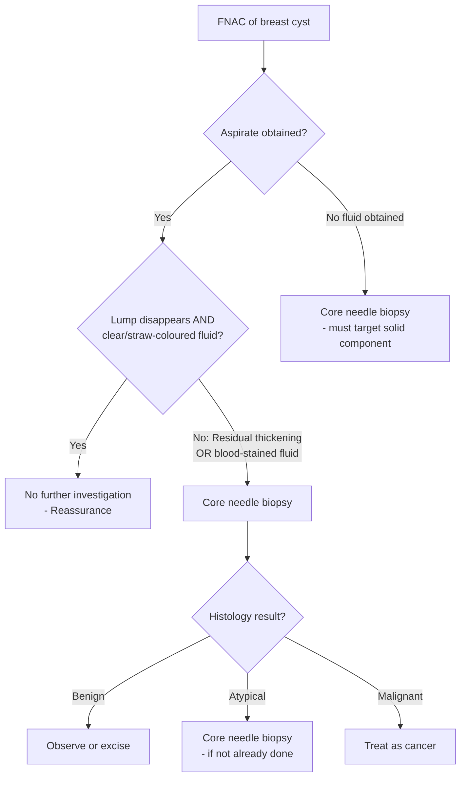
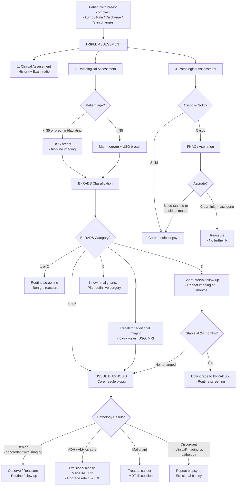

## Diagnostic Approach to Benign Breast Disease

### The Foundational Principle: Triple Assessment

Every breast complaint — whether lump, pain, or discharge — must undergo ***Triple Assessment***. This is the single most important diagnostic concept in breast surgery. The lecture slide states it unequivocally [11][12]:

> ***"Triple Assessment of a Breast Lesion: Clinical assessment, Imaging assessment, Cytological/Histological assessment. On no account should any one parameter alone be used to decide on definitive treatment."*** [12]

Why three components? Because no single modality is perfect:

| Component | Sensitivity Alone | What It Misses |
|:--|:--|:--|
| ***Clinical (history + examination)*** | ***50–85%*** | Small, deep, or non-palpable lesions; early cancers in dense breasts |
| ***Radiology (mammography ± USG)*** | ***~90%*** | Some cancers in very dense breasts; cannot definitively distinguish benign from malignant |
| ***Pathology (FNAC or core biopsy)*** | ***~91%*** | Sampling error; FNAC cannot assess architecture |
| ***Combined Triple Assessment*** | ***Sensitivity 99.6%, Specificity 93%*** | Almost nothing — that's the point [11] |

> ***"Triple Assessment is positive if any of above is positive, but negative when all three negative. If findings do not all correlate, further investigations or monitoring is necessary."*** [11]

This means: if even ONE component is suspicious, you proceed as though it could be malignant until proven otherwise. You only reassure the patient and discharge when **all three components are concordantly benign**.

<Callout title="The Cardinal Rule" type="error">
Never diagnose or manage a breast lesion on clinical grounds alone. Never reassure a patient based on a "normal mammogram" if the mass is clinically suspicious. Never ignore a suspicious biopsy because the imaging looked benign. ALL THREE must agree.
</Callout>

---

### Component 1: Clinical Assessment

This is the "C" of triple assessment — your history and physical examination.

#### History Taking — ***"Must Know"*** [2]

The history systematically covers:

**Mass characteristics:**
- **Onset and progression** — How long has it been there? Getting bigger? (Rapid growth → phyllodes or malignancy)
- **Cyclical changes / mastalgia** — Does it change with the menstrual cycle? (Cyclical = likely fibrocystic changes)

**Nipple symptoms:**
- **Discharge** — Colour? Unilateral/bilateral? Single/multiple duct? Spontaneous/expressible? (Bloody + single duct + spontaneous = pathological → papilloma or cancer)
- **Retraction** — New onset? (Cancer, duct ectasia, periductal mastitis)

**Skin changes:**
- ***Itchiness, erythema, dimpling, peau d'orange*** [2] — suggest malignancy or inflammatory breast disease

**Constitutional symptoms:**
- ***Weight loss, bone pain, SOB*** [2] — suggest metastatic disease (bone, lung)

**Risk factors for malignancy [2]:**
- ***FHx: BRCA — any CA breast/ovary/prostate/pancreas***
- ***PMHx: breast disease (e.g., DCIS), breast RT***
- ***Oestrogen exposure: age of menarche, age of menopause, parity, breastfeeding, use of COC/HRT***

#### Physical Examination [2]

**Position:** Patient at **45°**, arms by sides, then raised above the head, then pressing on hips (contracts pectoralis — to reveal fixation to muscle).

**Inspection:**
- ***Size, symmetry, surgical scars (e.g., LN biopsy), skin changes (e.g., ulceration, dimpling, peau d'orange)*** [2]
- ***Nipple changes — the "5 D's": Deviation, Discolouration, Dermatitis, Depression (retraction), Discharge*** [2]

> Why inspect with arms raised and then with hands on hips? Arms raised tenses the skin → makes dimpling and tethering more obvious. Hands on hips contracts pectoralis major → if the lump is fixed to the muscle, it will become less mobile or the skin over it will dimple.

**Palpation of breast** (start from the normal side) [2]:
- ***Comment on: site, size, shape, border, surface, consistency, tenderness, mobility (to skin and to muscle)***
- ***Include the axillary tail of the breast***

**Palpation of axilla [2]:**
- ***Groups: anterior (pectoral), posterior (subscapular), medial (chest wall), lateral (humeral), apical***
- ***Comment: number, site, size, consistency, tenderness, fixation***

**Additional examination:**
- Examine the **contralateral breast** (synchronous bilateral disease?)
- Examine the **supraclavicular fossa** (supraclavicular lymphadenopathy = advanced disease)
- Examine the **liver** (hepatomegaly → liver metastasis) [3]
- Examine the **spine/bones** (tenderness → bone metastasis) [3]

---

### Component 2: Radiological Assessment (Imaging)

The choice of imaging modality depends on the patient's **age** and **breast density**. The logic is simple: mammography uses X-rays, and dense glandular breast tissue appears white on X-ray (just like tumours do), making it hard to spot lesions. Dense breasts = young women. Fatty breasts = older women. Therefore:

- ***Mammography: only for females > 35 years*** (poor resolution in dense breasts of young females) [2]
- ***USG breast: for ALL patients*** [2]
- **MRI breast: not routinely done** — reserved for specific indications [2][3]

#### A. Mammography

***"Gold standard"*** for breast imaging and screening [2]. Uses **low-dose X-rays** to produce high-contrast images of the breast tissue.

**Standard Views [2][3]:**
- ***Craniocaudal (CC) view*** — X-ray beam travels top-to-bottom. Shows **medial-to-lateral extent** of the breast. Used to localize masses as inner vs. outer quadrant.
- ***Mediolateral oblique (MLO) view*** — X-ray beam travels at ~45° from superomedial to inferolateral. Includes the **axillary tail, axillary lymph nodes, and upper outer quadrant** in detail. The pectoralis major muscle should be visible to the level of the nipple to confirm adequate positioning.

> ***CC view → outer vs inner quadrant; MLO view → upper vs lower half of the breast*** (the dividing line is perpendicular to pectoralis major) [2].

**Advantages [2]:**
- ***Gold standard*** — high sensitivity for calcifications (which USG cannot detect)
- Less operator-dependent than USG
- Can be used for annual screening
- Safe even in pregnant women (with abdominal shielding)

**Limitations [2][3]:**
- ***Cannot make a definitive diagnosis*** — can only depict a mass as abnormal or suspicious [3]
- ***Obscuration by dense breast tissue*** — in young women, dense parenchyma can mask lesions [3]
- Limited ability to visualize the chest wall and axilla (better on MLO view)
- Radiation exposure (though very low dose)

**Mammographic Abnormalities to Look For [3]:**

| Feature | Benign | Malignant |
|:--|:--|:--|
| **Mass shape** | Smooth, round, well-defined | ***Spiculated (stellate), irregular*** |
| **Mass borders** | Circumscribed | ***Irregular, indistinct*** |
| **Density** | Fat-containing (radiolucent), symmetric | ***Asymmetrical density*** |
| **Architecture** | Normal | ***Architectural distortion (e.g., tent sign)*** |
| **Calcification content** | ***Rim-like, large coarse, smooth round/oval*** | ***Pleomorphic microcalcifications*** |
| **Calcification distribution** | Vascular/skin calcification (benign) | ***Linear branching microcalcifications, clustered microcalcifications ( > 5/mm²)*** |
| **Other** | — | ***Pectoralis major involvement (MLO view), skin thickening/tethering, nipple involvement*** [2] |

> **Why are microcalcifications important?** Microcalcifications ( < 0.5 mm) often represent calcium deposits within areas of necrosis or active secretion in neoplastic cells. **DCIS classically presents as clustered pleomorphic microcalcifications** on mammography. Benign calcifications tend to be large, coarse, round, and uniform — they represent degenerative or vascular calcification.

**Condition-Specific Mammographic Findings:**

| Condition | Mammographic Appearance |
|:--|:--|
| **Fibroadenoma** | Well-circumscribed, round/oval mass; may have coarse ("popcorn") calcifications in older lesions |
| **Breast cyst** | Well-circumscribed, round mass (cannot distinguish from solid on mammogram alone → needs USG) |
| **Phyllodes tumour** | ***Smooth, polylobulated mass resembling a fibroadenoma*** [3]; may be very large |
| **Duct ectasia** | ***Dilated calcified ducts*** in the subareolar region [4] |
| **Fat necrosis** | Oil cyst (radiolucent centre with calcified rim), or ***spiculated mass mimicking carcinoma*** [4] |
| **DCIS** | ***Clustered pleomorphic microcalcifications*** — this is the classic and most common presentation [7] |
| **Invasive carcinoma** | Spiculated mass, architectural distortion, pleomorphic microcalcifications |
| **Sclerosing adenosis / Radial scar** | Spiculated lesion ***mimicking carcinoma*** [5] |

#### B. BI-RADS Classification (Breast Imaging Reporting and Data System)

***BI-RADS*** is the standardized reporting system used for **both mammographic and ultrasound findings** [3][11][13]. It converts imaging findings into a management recommendation. From the lecture slide [13]:

> ***"Mammogram Reporting: BIRADS"***
> - ***Category 0: need further investigations***
> - ***Category 1: normal***
> - ***Category 2: benign***
> - ***Category 3: probably benign ( < 2% malignant)***
> - ***Category 4: suspicious of malignancy***
> - ***Category 5: highly suggestive of malignancy 95%***
> - ***Category 6: malignancy proven with biopsy***

Expanded with management [3][6]:

| BI-RADS Category | Description | Likelihood of Malignancy | Management |
|:--|:--|:--|:--|
| **0** | ***Incomplete — need additional imaging*** | N/A | Recall for additional imaging (e.g., spot compression, USG) |
| **1** | ***Negative — normal*** | ***~0%*** | Routine screening |
| **2** | ***Benign*** | ***~0%*** | Routine screening |
| **3** | ***Probably benign*** | ***> 0% but ≤ 2%*** | ***Short-interval follow-up (6 months)*** with surveillance mammography [3][6] |
| **4** | ***Suspicious*** | ***> 2% to < 95%*** | ***Tissue diagnosis (biopsy)*** |
| | 4A: low suspicion | 3–10% | |
| | 4B: moderate suspicion | 11–50% | |
| | 4C: high suspicion | 51–94% | |
| **5** | ***Highly suggestive of malignancy*** | ***≥ 95%*** | ***Tissue diagnosis (biopsy)*** |
| **6** | ***Known biopsy-proven malignancy*** | N/A | ***Surgical excision when clinically appropriate*** |

> **Why is BI-RADS 3 managed with follow-up rather than biopsy?** Because the malignancy risk is only 1–2%. Performing biopsies on all BI-RADS 3 lesions would subject a huge number of women to unnecessary invasive procedures. Instead, short-interval imaging (typically 6 months) monitors for any change. If the lesion is stable at 24 months, it is downgraded to BI-RADS 2. If it grows or changes, it is upgraded to BI-RADS 4 and biopsied.

#### C. Ultrasound (USG)

***USG should be performed for ALL patients presenting with a breast complaint*** [2]. It is the **first-line imaging** in young women ( < 35), pregnant, or lactating women because there is no radiation and the dense glandular tissue of young breasts is better penetrated by ultrasound than X-rays.

**Roles of USG [2][3]:**
- ***Distinguish cysts from solid lesions*** — this is the single most important role. A simple cyst on USG needs no further investigation.
- ***Improved sensitivity and specificity combined with mammogram***, especially in young women with dense breast tissue [2]
- ***Guide FNAC, biopsy, and clipping before neoadjuvant chemotherapy*** [2]
- ***Assess axillary lymph nodes*** [2] — look for loss of fatty hilum (suspicious for metastasis)
- Identify presence of a prominent vascular supply (Doppler)
- Characterize solid masses as likely benign or malignant

**Limitations [2][3]:**
- ***Operator-dependent***
- ***Cannot pick up most calcifications*** (microcalcifications are virtually invisible on USG) [2]
- ***NOT useful as a screening tool*** on its own [2]

**USG Features — Benign vs. Malignant [3]:**

| Feature | Benign | Malignant |
|:--|:--|:--|
| **Shape** | ***Wider-than-tall (ellipsoid)*** | ***Taller-than-wide (fir-tree shape)*** |
| **Margin** | ***Smooth, macrolobulation*** | ***Spiculated or angular, microlobulation*** |
| **Echogenicity** | ***Hyperechoic, thin echogenic capsule*** | ***Hypoechoic*** |
| **Calcification** | ***Absent*** | ***Internal calcification, posterior acoustic shadowing*** |
| **Vascularity** | ***Absent*** | ***Central vascularity*** |

> ***Suspicious features on USG: "SHIT CME"*** — a mnemonic for: **S**piculated margins, **H**ypoechoic, **I**rregular shape, **T**aller-than-wide, **C**alcification (internal), **M**icrolobulation, **E**nhancement (posterior shadowing or central vascularity) [2]

> ***Suspicious lymph node: loss of fatty hilum*** [2] — normal axillary lymph nodes have an echogenic fatty hilum. When this is replaced by hypoechoic cortical thickening, suspect metastatic infiltration.

**Condition-Specific USG Findings:**

| Condition | USG Appearance |
|:--|:--|
| **Simple breast cyst** | ***Anechoic***, well-circumscribed, round/oval, thin wall, ***posterior acoustic enhancement*** (sound passes easily through fluid). No solid component. → No further investigation needed [4] |
| **Complex/indeterminate cyst** | Cyst with internal echoes, thick septations, or a solid component → needs aspiration or biopsy |
| **Fibroadenoma** | Well-circumscribed, hypoechoic, solid, homogeneous, wider-than-tall, smooth margins. May have gentle lobulations. |
| **Phyllodes tumour** | ***Solid hypoechoic, well-circumscribed, resembling fibroadenoma*** but may contain ***cystic areas*** (the clefts/cystic spaces within the tumour increase suspicion) [3] |
| **Carcinoma** | Hypoechoic, taller-than-wide, spiculated margins, posterior acoustic shadowing, internal vascularity |
| **Abscess** | Irregular, thick-walled, hypoechoic/heterogeneous fluid collection; may contain internal debris |
| **Fibrocystic changes** | Diffuse heterogeneous echotexture with scattered small cysts and areas of fibrosis |

#### D. MRI Breast

***Not routinely performed in the work-up of an undiagnosed breast mass*** [3][2]. Has ***high sensitivity but low specificity*** — meaning it finds almost everything, but many of those findings turn out to be benign, leading to ***unnecessary biopsies*** [2].

**Indications for Breast MRI [3][2]:**
- ***Equivocal results from mammogram or ultrasound***
- ***Assessment of patients with breast implants*** (silicone implant rupture evaluation)
- ***Identify patients with clinically occult tumour presenting with positive axillary lymph nodes*** (unknown primary)
- ***Suspected multicentric or bilateral malignancy***, especially ***invasive lobular carcinoma (ILC)*** — ILC is notorious for being underestimated on mammography because it grows in a diffuse, infiltrative pattern without forming a distinct mass
- Determine extent of disease accurately, especially ***chest wall involvement***
- Identify extent of ***residual disease after excision showing positive margins***
- ***Pre-operative evaluation*** to improve surgical planning
- ***Monitor results of neoadjuvant therapy***
- ***Screening in high-risk patients (genetic predisposition — e.g., BRCA carriers)***

**MRI Features Suggestive of Malignancy [3]:**
- Spiculated or irregular margins
- Rim-like enhancement
- Heterogeneous internal enhancement
- Enhancing internal septa
- ***Rapid uptake of contrast*** — nearly all invasive breast carcinomas enhance on gadolinium-contrast MRI (but some benign lesions also enhance, hence the low specificity)

---

### Component 3: Pathological Assessment (Cytology / Histology)

This is the definitive arm of triple assessment. Imaging tells you something is there; pathology tells you **what** it is.

The lecture slide lists the methods [14]:

> ***"Methods of Biopsy of breast lumps: Fine Needle Aspiration, Core Biopsy (trucut biopsy), Excisional biopsy. If palpable — direct. If non-palpable — with image guidance."***

#### A. Fine Needle Aspiration Cytology (FNAC)

- Uses a **21–23 gauge needle** — no local anaesthesia needed [6]
- Provides a **cytological** diagnosis (individual cell morphology)
- **Cannot assess tissue architecture** — therefore ***cannot distinguish carcinoma in situ from invasive carcinoma*** [6]. This is a critical limitation.

**Best used for:**
- **Cystic lesions** — aspiration is both diagnostic and therapeutic [6]
- Low-risk presentations (e.g., non-palpable mass, equivocal mammogram)

**Approach to FNAC of a Cyst [6]:**

> **Why send blood-stained aspirate for cytology?** Blood-stained fluid may indicate an intracystic papilloma or intracystic carcinoma. The blood comes from a vascular solid component within the cyst that has been disrupted by the needle.

#### B. Core Needle Biopsy (CNB) — ***First Line for Histological Diagnosis*** [6]

- Uses a **9–14 gauge needle** with **local anaesthesia** [6]
- Provides a **histological** diagnosis — can assess:
  - ***Tissue architecture*** (is it in situ or invasive?)
  - ***Tumour grading***
  - ***Receptor status (ER/PR/HER2)*** [6]
- ***Performed if BI-RADS ≥ 4*** [6]

**Guidance methods for non-palpable lesions [6]:**
- **USG-guided** — for masses visible on ultrasound
- **Stereotactic (X-ray guided)** — for microcalcifications visible only on mammography
- **Tomosynthesis-guided (3D mammogram)** — uses multiple X-ray angles
- **MRI-guided** — for lesions seen only on MRI

**Enhanced technique: Vacuum-assisted core biopsy (VACB)** — uses suction to pull tissue into the needle bore, obtaining larger and more representative samples. ***Increases yield*** compared to standard core biopsy [6].

**Condition-Specific Histological Findings on Core Biopsy:**

| Condition | Key Histological Findings |
|:--|:--|
| **Fibroadenoma** | Biphasic pattern — benign epithelial component with fibroblastic stroma. Pericanalicular (stroma around ducts) or intracanalicular (stroma compresses ducts into slit-like spaces) pattern |
| **Phyllodes tumour** | ***Increased cellularity, mitosis, stromal overgrowth and fragmentation***; leaf-like projections [3]. Cannot reliably be diagnosed by FNAC alone — ***at least core needle biopsy is required*** [3] |
| **Intraductal papilloma** | Fibrovascular cores lined by epithelial and myoepithelial cells (the dual cell layer confirms benign nature; loss of myoepithelial layer raises concern for malignancy) |
| **Fibrocystic changes** | Fibrosis, cystic dilatation, apocrine metaplasia, variable hyperplasia |
| **ADH** | Uniform epithelial cells with monomorphic round nuclei, partially filling the duct (does NOT completely fill it — if it does, reclassify as DCIS) [3] |
| **ALH** | Monomorphic, evenly spaced, dyshesive cells partially filling the lobule [3] |
| **DCIS** | Malignant cells within the TDLU without stromal invasion. Comedo type shows central necrosis → dystrophic calcification [7] |
| **Fat necrosis** | Necrotic fat cells, lipid-laden macrophages (foam cells), foreign body giant cells, fibrosis |
| **IGM** | ***Granulomatous lesions centred on breast lobules*** [3]. Must send for ***Gram stain, bacterial culture, AFB stain and culture, fungal stain and culture*** to exclude infective causes [3] |
| **Sclerosing adenosis** | Increased acini per lobule with sclerotic stroma — distorted architecture can mimic invasive carcinoma, but myoepithelial layer is preserved |

<Callout title="Critical Biopsy Rule" type="error">
***If ADH or ALH is found on core biopsy → excisional biopsy MUST be performed to rule out malignancy*** [7]. This is because core biopsy only samples a small part of the lesion, and the "upgrade rate" to DCIS or invasive carcinoma on full excision is approximately 15–30%.
</Callout>

#### C. Excisional Biopsy

***Indicated when core biopsy reveals a suspicious lesion but is not diagnostic*** — i.e., there is clinical-pathological discordance, or the core shows atypia that may underrepresent the true pathology [6][3].

**Localizing Non-Palpable Lesions for Excisional Biopsy [6]:**

When a lesion is non-palpable (detected only on imaging), the surgeon needs guidance to find it during surgery. Several localization methods exist:

| Method | Description | Notes |
|:--|:--|:--|
| ***Hook-wire localization (HWL)*** | A wire with a hook is inserted into the breast under image guidance, tip at the lesion. Surgeon excises around the wire. | ***Problems: extensive normal tissue removal, wire outside skin, risk of broken wire*** [6] |
| ***Radioactive seed localization (RSL)*** | ***125I-labelled titanium seed*** inserted 0–5 days prior to surgery | More flexible scheduling than HWL |
| ***Radio-opaque lesion localization (ROLL)*** | ***99mTc-labelled albumin-based colloid*** injected within 24 hours of surgery | Allows gamma probe guidance intraoperatively |
| ***Magseed localization*** | ***Non-radioactive*** magnetic seed | Increasingly popular; no radiation logistics |
| ***On-table USG*** | Intraoperative ultrasound guidance | For USG-visible lesions only |

---

### Condition-Specific Diagnostic Algorithms

#### Breast Cyst — Diagnostic Pathway

| Step | Finding | Action |
|:--|:--|:--|
| 1. USG | ***Simple cyst (anechoic, posterior enhancement, thin wall)*** | ***Reassurance. No further investigation*** [4] |
| 2. If symptomatic or large | Aspiration under USG guidance | If fluid is clear and mass disappears → reassurance |
| 3. If blood-stained aspirate, recurrence, or radiology suspicious | ***Core biopsy*** [4] | To exclude intracystic carcinoma |
| 4. If solid component present | Core biopsy → surgery if needed | Must exclude intracystic papilloma or carcinoma |

#### Fibroadenoma — Diagnostic Pathway

| Step | Finding | Action |
|:--|:--|:--|
| 1. Clinical | Mobile, rubbery, well-defined, non-tender lump in a young woman | Clinically consistent with fibroadenoma |
| 2. USG (± Mammogram if > 35) | Well-circumscribed, hypoechoic solid mass, wider-than-tall | Supports diagnosis |
| 3. Core needle biopsy | Biphasic fibroepithelial lesion | Confirms diagnosis. ***Definitive diagnosis can only be confirmed with core needle biopsy or excision*** [3] |
| 4. If < 2 cm + clinically and radiologically consistent | ***Conservative (observation)*** | Follow-up with repeat USG at 6–12 months |
| 5. If > 2 cm, symptomatic, or growing | ***Wide local excision*** or vacuum-assisted excision / cryoablation [3] | |

#### Phyllodes Tumour — Diagnostic Pathway

| Step | Finding | Action |
|:--|:--|:--|
| 1. Clinical suspicion | Large, rapidly growing mass in a woman > 40 resembling a fibroadenoma | Phyllodes tumour on the differential |
| 2. Mammography + USG | ***Smooth, polylobulated mass; USG may show cystic areas*** [3] | Raises suspicion |
| 3. Core needle biopsy (***minimum required***) | ***Increased cellularity, mitosis, stromal overgrowth*** [3] | FNAC is NOT reliable for phyllodes [3] |
| 4. If indeterminate or clinical-pathological discordance | ***Excisional biopsy*** [3] | |

#### Nipple Discharge — Diagnostic Pathway [2]

| Step | Finding | Action |
|:--|:--|:--|
| 1. History | Bilateral, milky, multiductal | Likely galactorrhoea → check prolactin, TSH, medications |
| 2. History | ***Unilateral, single-duct, spontaneous, bloody*** | ***Pathological discharge*** → triple assessment |
| 3. Triple assessment | Mammography + USG + core biopsy of any mass | Rule out carcinoma/DCIS |
| 4. Additional investigations | ***Nipple discharge cytology, ductogram/ductoscopy*** [2] | Identify the lesion within the duct |
| 5. If papilloma confirmed | ***Microdochectomy*** [3] | Surgical excision of the affected duct |

#### IGM — Diagnostic Pathway [3]

| Step | Finding | Action |
|:--|:--|:--|
| 1. Core needle biopsy | ***Granulomatous lesions centred on breast lobules*** | Provisional diagnosis of granulomatous mastitis |
| 2. Send biopsy for | ***Gram stain, bacterial culture, AFB stain and culture, fungal stain and culture*** | Exclude TB, fungal infections |
| 3. Exclude systemic granulomatous disease | CXR (sarcoidosis, TB), ACE level, autoimmune panel | Exclude sarcoidosis, GPA |
| 4. Additional workup | ***Serum prolactin, HBV serology (pre-steroid workup)*** | |
| 5. Diagnosis of exclusion | All infective and systemic causes excluded | → IGM confirmed |

#### Gynaecomastia — Diagnostic Pathway [10]

| Step | Finding | Action |
|:--|:--|:--|
| 1. Clinical | Bilateral/unilateral rubbery mass from nipple | Consistent with gynaecomastia |
| 2. Suspect malignancy if | ***Unilateral, hard, non-tender, eccentric, lymphadenopathy, older man*** | → Triple assessment |
| 3. Bloods | ***LFT*** (liver disease), ***sex hormone profile*** (oestrogen, testosterone, SHBG) [10] | Identify hormonal cause |
| 4. Testicular assessment | ***Testicular USG, AFP, βHCG*** [10] | Exclude testicular tumour |

---

### Master Diagnostic Algorithm — Comprehensive Flowchart

---

### Special Investigations

#### Ductogram (Galactogram)

- **Indication:** Pathological nipple discharge (unilateral, single-duct, bloody/serous) when the triple assessment does not identify a clear mass [2]
- **Technique:** A fine cannula is inserted into the discharging duct orifice at the nipple → contrast is injected → mammographic images taken
- **Findings:** Filling defect within the duct = intraductal papilloma or intraductal carcinoma; duct irregularity or cutoff = suspicious for malignancy
- **Limitation:** Technically challenging; success depends on identifying the correct duct

#### Ductoscopy

- **Direct visualization** of the inside of the duct using a microendoscope ( < 1 mm diameter)
- Can visualize and sometimes biopsy intraductal lesions
- Not widely available; mainly in specialized centres

#### Nipple Discharge Cytology

- Smear of nipple discharge on a glass slide → stain → examine for malignant cells
- **Low sensitivity** — a negative result does not exclude malignancy
- Useful as an adjunct but never as a sole investigation

#### Blood Tests (when indicated)

| Test | Indication | Rationale |
|:--|:--|:--|
| **Prolactin** | Galactorrhoea, IGM | Exclude hyperprolactinaemia / assess IGM |
| **TSH** | Galactorrhoea | Hypothyroidism → ↓ prolactin clearance → galactorrhoea |
| **LFT** | Gynaecomastia, staging for cancer | Liver disease → ↑ oestrogen; liver metastasis |
| **Sex hormone profile** | Gynaecomastia | Oestrogen:androgen ratio |
| **AFP, βHCG** | Gynaecomastia | Exclude testicular tumour |
| **HBV serology** | IGM (pre-steroid) | Check before initiating corticosteroids |

---

<Callout title="High Yield Summary">

**1. Triple Assessment = Clinical + Radiological + Pathological.** Sensitivity 99.6%, specificity 93%. Positive if ANY component is positive. Negative only when ALL THREE are negative. Never use one parameter alone.

**2. Imaging choice by age:** < 35 → USG first; > 35 → Mammogram + USG. MRI is NOT routine — reserved for equivocal cases, implants, occult primary with positive nodes, ILC, BRCA screening.

**3. BI-RADS drives management:** 0 = recall; 1–2 = routine; 3 = 6-month follow-up; 4–5 = tissue diagnosis (biopsy); 6 = known cancer, plan surgery.

**4. USG suspicious features mnemonic: "SHIT CME"** — Spiculated, Hypoechoic, Irregular, Taller-than-wide, Calcification, Microlobulation, Enhancement.

**5. Core needle biopsy is first-line for histological diagnosis.** FNAC is for cysts. CNB gives architecture + grading + receptor status.

**6. ADH/ALH on core biopsy → excisional biopsy is MANDATORY** (upgrade rate 15–30%).

**7. Mammographic red flags:** Spiculated mass, clustered pleomorphic microcalcifications, architectural distortion, asymmetric density.

**8. Simple cyst on USG (anechoic, posterior enhancement) → NO further investigation needed.**

**9. Phyllodes cannot be reliably diagnosed by FNAC — at least core biopsy is required.** Look for increased cellularity, stromal overgrowth, and cystic areas on USG.

**10. Non-palpable lesion localization for excisional biopsy:** Hook-wire, radioactive seed, ROLL, Magseed, on-table USG.

</Callout>

---

<ActiveRecallQuiz
  title="Active Recall - Diagnostics of Benign Breast Disease"
  items={[
    {
      question: "What is triple assessment, what is its sensitivity and specificity, and when is it considered positive vs. negative?",
      markscheme: "Triple assessment = clinical (history and examination) + radiological (mammogram and/or USG) + pathological (FNAC or core biopsy). Sensitivity 99.6%, specificity 93%. Positive if ANY one component is positive. Negative only when ALL THREE are concordantly negative. If findings do not correlate, further investigation or monitoring is necessary.",
    },
    {
      question: "List the BI-RADS categories 0 through 6 with their likelihood of malignancy and recommended management for each.",
      markscheme: "0: Incomplete, recall for additional imaging. 1: Negative, 0%, routine screening. 2: Benign, 0%, routine screening. 3: Probably benign, up to 2%, 6-month follow-up imaging. 4: Suspicious (4A 3-10%, 4B 11-50%, 4C 51-94%), tissue diagnosis (biopsy). 5: Highly suggestive of malignancy, 95%+, tissue diagnosis. 6: Known biopsy-proven malignancy, surgical excision when appropriate.",
    },
    {
      question: "A 30-year-old woman presents with a breast lump. What is the first-line imaging modality and why? What imaging features on USG suggest malignancy?",
      markscheme: "First-line imaging is USG (not mammography) because young women have dense breasts which obscure lesions on mammography, and USG involves no radiation. Suspicious USG features (SHIT CME): Spiculated margins, Hypoechoic, Irregular shape, Taller-than-wide orientation, internal Calcification, Microlobulation, central vascularity (Enhancement). Also posterior acoustic shadowing.",
    },
    {
      question: "Compare FNAC and core needle biopsy for breast lesions: needle gauge, anaesthesia, what each can assess, and the main limitation of each.",
      markscheme: "FNAC: 21-23G needle, no LA needed, provides cytological diagnosis (cell morphology only). Cannot assess tissue architecture (cannot distinguish in situ from invasive carcinoma). CNB: 9-14G needle, requires LA, provides histological diagnosis including architecture, tumour grading, and receptor status (ER/PR/HER2). Limitation: sampling error (may miss the most abnormal area). If core biopsy is discordant with clinical/imaging findings, excisional biopsy is needed.",
    },
    {
      question: "A core biopsy of a mammographically detected lesion shows atypical ductal hyperplasia. What is the mandatory next step and what is the rationale?",
      markscheme: "Mandatory excisional biopsy. Rationale: core biopsy samples only a small portion of the lesion. ADH and low-grade DCIS exist on a histological continuum. The upgrade rate from ADH on core biopsy to DCIS or invasive carcinoma on excision is approximately 15-30%. The full lesion must be examined histologically to exclude a higher-grade pathology.",
    },
    {
      question: "Name four methods for localizing non-palpable breast lesions for excisional biopsy and state one advantage or disadvantage of each.",
      markscheme: "1) Hook-wire localization: disadvantage - extensive normal tissue removal, risk of wire migration or breakage. 2) Radioactive seed localization (125I seed): advantage - can be placed 0-5 days before surgery (flexible scheduling). 3) ROLL (99mTc-albumin colloid): advantage - gamma probe guidance intraoperatively; disadvantage - must inject within 24h of surgery. 4) Magseed: advantage - non-radioactive, no radiation logistics needed. Also acceptable: on-table USG for USG-visible lesions.",
    },
  ]}
/>

---

## References

[1] Lecture slides: GC 181. Breast mass breast cancer; benign breast diseases; mammography; breast cancer screening.pdf (p20 — DDx of breast mass)
[2] Senior notes: maxim.md (Sections 8.2, 8.3 — Common breast complaints, Assessment of breast mass)
[3] Senior notes: felixlai.md (Sections on Neoplasms — Phyllodes tumour diagnosis; Imaging — Mammography, USG, MRI; IGM diagnosis)
[4] Senior notes: maxim.md (Section 8.5 — Benign breast disease: inflammatory and non-inflammatory conditions)
[5] Senior notes: maxim.md (Section 8.6 — Benign breast tumours: sclerosing adenosis/radial scars)
[6] Senior notes: maxim.md (Section 8.3 — Radiological and pathological assessment, FNAC approach, CNB, excisional biopsy, localization methods)
[7] Senior notes: maxim.md (Section 8.4 — Pre-malignant lesions, DCIS/LCIS)
[10] Senior notes: maxim.md (Section 8.7 — Gynaecomastia)
[11] Lecture slides: The Managment of breast cancer_Prof A Kwong 20_2_2020.pdf (p10 — Triple Assessment sensitivity/specificity)
[12] Lecture slides: The Managment of breast cancer_Prof A Kwong 20_2_2020.pdf (p9 — Triple Assessment principle)
[13] Lecture slides: The Managment of breast cancer_Prof A Kwong 20_2_2020.pdf (p16 — BI-RADS classification)
[14] Lecture slides: The Managment of breast cancer_Prof A Kwong 20_2_2020.pdf (p25 — Methods of Biopsy)
