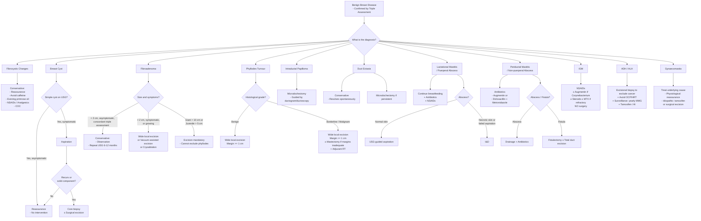

## Management of Benign Breast Disease

### Overarching Management Philosophy

The management of benign breast disease is guided by **three principles**:

1. **Exclude malignancy first** — Triple assessment must be completed before any management plan is finalised. No treatment decision should be made on a single parameter alone [11][12].
2. **Risk-stratify for future cancer** — Certain benign conditions carry an increased risk of subsequent breast cancer (ADH/ALH 4–5×, proliferative without atypia 1.5–2×). Management must include appropriate surveillance and risk-reduction strategies [3][7].
3. **Minimise harm** — Many benign conditions are self-limiting or require only conservative management. Unnecessary surgery can cause scarring, breast dimpling, damage to the ductal system, and mammographic changes that complicate future surveillance [3].

The lecture slide on ***"Management of breast conditions"*** [15] frames this as a structured approach from conservative to surgical, condition by condition. Let's work through each systematically.

---

### Master Management Algorithm

---

### Condition-by-Condition Management

---

#### 1. Fibrocystic Breast Changes (FBC)

**Why is management conservative?** FBC is a physiological aberration of the hormonal cycle, not a true disease. Non-proliferative FBC confers **NO increased cancer risk** [3]. The goal is symptom relief.

| Modality | Details | Mechanism / Rationale |
|:--|:--|:--|
| **Reassurance** | Explain the benign nature; this is NOT cancer and does NOT cause cancer (non-proliferative type) | Reduces anxiety — the most important intervention |
| ***Avoid caffeine*** [4] | Reduce methylxanthine intake (coffee, tea, chocolate) | Methylxanthines may increase cyclic AMP in breast tissue → ? increased cyst formation and breast tenderness (evidence is weak but commonly advised) |
| ***Evening primrose oil*** [4] | Gamma-linolenic acid supplement | May modulate prostaglandin metabolism → reduce breast pain. Evidence is modest but harmless |
| ***Analgesics (NSAIDs)*** [4] | Topical or oral NSAIDs | Prostaglandin inhibition → reduce inflammation and pain |
| ***COC pills*** [4] | Low-dose combined oral contraceptives | Suppress ovulation → reduce cyclical hormonal fluctuations → reduce cyclical breast pain and nodularity. Paradoxical — oestrogen in COC might worry you, but by suppressing the LH/FSH-driven cycle, the breast tissue gets a more stable hormonal environment |
| **Danazol** | Synthetic androgen; rarely used due to side effects | Suppresses gonadotropins → reduces oestrogen stimulation of breast tissue. Effective but androgenic side effects (acne, hirsutism, weight gain) limit use |
| **Tamoxifen** | SERM — only for severe refractory mastalgia | Blocks oestrogen receptors on breast epithelium → reduces proliferative stimulus |

> **When to investigate further:** If there is a **dominant palpable mass** within the background of fibrocystic changes, it must undergo triple assessment to exclude a cancer hiding within the FBC.

---

#### 2. Breast Cysts

The management of breast cysts is beautifully algorithmic:

| Scenario | Management | Rationale |
|:--|:--|:--|
| **Simple cyst on USG, asymptomatic** | ***Reassurance — no further investigation*** [4] | Simple cysts (anechoic, thin wall, posterior enhancement) have virtually zero malignancy risk |
| **Simple cyst, symptomatic (painful)** | ***Aspiration*** under USG guidance [4] | Therapeutic and diagnostic — relieves symptoms instantly |
| **Aspirate is clear/straw-coloured AND mass disappears** | ***No further investigation*** [6] | Confirms it was a simple cyst |
| **Aspirate is blood-stained** | ***Send for cytology + core biopsy*** [4][6] | Blood-stained aspirate raises concern for intracystic papilloma or carcinoma |
| **Residual mass after aspiration** | ***Core biopsy*** [6] | A persistent mass suggests a solid component — needs histological diagnosis |
| **Cyst recurs after aspiration** | ***Core biopsy ± surgical excision*** [4] | Recurrence is concerning and warrants tissue diagnosis |
| **Complex cyst (solid component on USG)** | ***Core biopsy ± excision*** | Solid component may be intracystic carcinoma |

---

#### 3. Fibroadenoma

**The key decision: observe or excise?**

The management hinges on **size, symptoms, growth, and subtype** [3][5]:

| Indication | Management | Rationale |
|:--|:--|:--|
| ***Size < 2 cm + clinical and radiographic appearance consistent with fibroadenoma*** [3] | ***Conservative (observation)*** — repeat USG at 6–12 months | Simple fibroadenoma has NO cancer risk; unnecessary surgery causes scarring and mammographic artefacts |
| ***Symptomatic, size > 2 cm, or increasing in size*** [3][5] | ***Wide local excision*** | Growing fibroadenoma needs excision to exclude phyllodes (which looks identical on imaging) |
| ***Giant fibroadenoma ( > 10 cm)*** [3] | ***Excision mandatory*** | ***Cannot be distinguished from Phyllodes tumour on physical examination or imaging*** [3] |
| ***Juvenile fibroadenoma ( > 5 cm or persists to adulthood)*** [3] | ***Excision recommended*** | Risk of breast cancer increases with persistence into adulthood |
| Patient desires removal but wishes to avoid surgery | ***USG-guided cryoablation or vacuum-assisted excision*** [3] | Minimally invasive alternatives |

<Callout title="Important Exam Point" type="error">
***It is NOT necessary to excise all biopsy-proven fibroadenomas*** [3]. Surgical excision can induce ***scarring, dimpling of the breast from tumour removal, damage to the ductal system, and mammographic changes*** [3] that complicate future surveillance. Only excise for specific indications.
</Callout>

---

#### 4. Phyllodes Tumour

Phyllodes tumour management is distinctly different from fibroadenoma because of its propensity for **local recurrence** (even benign forms) and potential for **distant metastasis** (malignant forms). The treatment is primarily surgical, with adjuvant therapy for borderline/malignant subtypes.

##### Surgical Management [3][5]

| Modality | Indication | Details |
|:--|:--|:--|
| ***Wide local excision (WLE)*** | ***Standard of care for ALL Phyllodes tumours*** [3] | ***Surgical margins ≥ 1 cm*** for borderline and malignant phyllodes; 1 cm also acceptable for benign [3][5]. The tumour must be **completely excised** — positive margins lead to unacceptably high local recurrence rates [3] |
| ***Mastectomy*** | Borderline or malignant Phyllodes when ***negative margins cannot be achieved by WLE***, or when the ***tumour is too large such that BCT will result in suboptimal cosmetic outcomes*** [3] | Equally effective as WLE as long as adequate margins are achieved. ***NOT indicated for benign Phyllodes*** unless the above circumstances apply [3] |
| ***Axillary lymph node dissection (ALND)*** | ***NOT indicated*** [3][5] | Phyllodes metastasizes haematogenously (to lungs), NOT via lymphatics. Axillary lymphadenopathy in phyllodes is almost always reactive, not metastatic [3] |

> **Why ≥ 1 cm margins?** Phyllodes tumours have pseudopodia-like projections at their edges that extend beyond the apparent tumour boundary. If you excise with only a sliver of normal tissue (like you would for a fibroadenoma), these projections remain and seed local recurrence. The 1 cm margin ensures clearance of these microscopic extensions.

##### Adjuvant Therapy [3]

| Modality | Indication | Details |
|:--|:--|:--|
| ***Adjuvant radiotherapy*** | ***Borderline or malignant Phyllodes tumour ONLY — NOT for benign*** [3] | Should be administered ***even after mastectomy if adequate surgical margins cannot be achieved*** because of tumour location [3] |
| ***Chemotherapy*** | ***Highly selected patients with large ( > 5 cm), high-risk, or recurrent malignant Phyllodes*** [3] | ***Regimen = Doxorubicin + Ifosfamide*** [3] — these are soft tissue sarcoma-type agents because malignant phyllodes behaves like a sarcoma |
| ***Hormonal therapy*** | ***NOT effective*** [3] | Phyllodes tumours do not express significant hormone receptors |
| ***Targeted therapy*** | ***NOT effective*** [3] | No validated molecular targets |

##### Surveillance [3]

- ***Breast examination every 6 months***
- ***Annual CXR and mammograms*** — CXR specifically because the most common site of distant metastasis is the lungs

---

#### 5. Intraductal Papilloma

The lecture slide explicitly states [15]:

> ***"Treatment: Microdochectomy — Excision of the diseased duct — Usually guided by ductogram / ductoscopy"***

| Modality | Indication | Details |
|:--|:--|:--|
| ***Microdochectomy*** | ***Standard approach for a papilloma diagnosed by biopsy*** [3][15] | Excision of the **single affected lactiferous duct** and its associated lobules. Guided by ductogram or ductoscopy to identify the correct duct. The entire duct from nipple to periphery should be excised to ensure complete removal. |
| ***Major duct excision (Hadfield's procedure)*** | ***Persistent spontaneous discharge*** where the specific duct cannot be identified, or ***multiple papillomas*** | Excision of ***all retroareolar ducts*** [6]. More extensive than microdochectomy. Results in inability to breastfeed from that breast. |

> **Why not just observe a papilloma?** Because (a) the bloody discharge is distressing to the patient, (b) the papilloma carries a slight increased risk of malignancy (1.5–2×), and (c) you cannot be 100% certain the discharge isn't from a coexisting DCIS without excising and examining the entire duct.

**Contraindication to observation:** Multiple papillomas (diffuse papillomatosis) carry a higher cancer risk and should be excised.

---

#### 6. Duct Ectasia

| Modality | Indication | Rationale |
|:--|:--|:--|
| ***Conservative (first-line)*** | Most patients [3] | ***Generally does not require surgery; often resolves spontaneously***, sometimes with a residual subareolar nodule [3]. The condition is self-limiting as part of normal involution. |
| ***Microdochectomy*** | ***Persistent symptoms*** (persistent discharge, persistent mass) [3][4] | Excision of the affected dilated duct |
| ***Major duct excision (Hadfield's)*** | Multiple dilated ducts or recurrence | Excision of all subareolar ducts |

> Why is surgery rarely needed? Duct ectasia is an involutional process — the ducts dilate, accumulate secretions, and may cause transient symptoms. As involution completes, the process burns itself out. Surgery is only for persistent, bothersome symptoms.

---

#### 7. Lactational Mastitis ± Puerperal Breast Abscess

This is one of the most clinically important management algorithms. The key principle: ***do NOT stop breastfeeding*** [3][4].

##### Mastitis (without abscess)

| Step | Intervention | Rationale |
|:--|:--|:--|
| 1 | ***Continue breastfeeding*** — complete emptying with pumping or hand expression [3] | Stagnant milk is the culture medium for bacteria. Emptying the breast removes this medium. Breastmilk antibodies are also protective for the infant. Stopping breastfeeding worsens engorgement and perpetuates the infection. |
| 2 | ***Symptomatic relief: NSAIDs or cold compress*** [3] | Anti-inflammatory and analgesic |
| 3 | ***Antibiotics*** [3][4] | Cover ***S. aureus*** (most common organism): ***1st-generation cephalosporin (Cephalexin) or Dicloxacillin*** [3] or ***Cloxacillin*** [4]. These are narrow-spectrum anti-staphylococcal agents. |

##### Breast Abscess (complicating mastitis) [3]

Diagnosis of abscess is made by ***failure to respond to antibiotics within 48–72 hours***, ***USG evidence of abscess cavity***, or ***aspiration of pus*** [3].

| Scenario | Management | Rationale |
|:--|:--|:--|
| ***Overlying skin is normal (not ischaemic)*** | ***USG-guided needle aspiration*** [3][4] | Less invasive; can be repeated. Allows the abscess to collapse while antibiotics treat the surrounding infection. |
| ***Overlying skin is ischaemic/necrotic, OR abscess not responsive to aspiration*** | ***Incision and drainage (I&D)*** [3][4] | Necrotic skin means the tissue is devitalized and will not heal over a drained cavity — must be debrided and drained openly. Also required if aspiration fails to resolve the abscess. |

> **Why aspiration first, not I&D?** In a lactating woman, I&D creates a wound that can interfere with breastfeeding, is cosmetically less favourable, and takes longer to heal. Aspiration (often repeated 2–3 times over a week) combined with antibiotics resolves most abscesses without needing a surgical wound.

<Callout title="Clinical Pearl" type="idea">
If a "mastitis" in a non-lactating woman fails to respond to antibiotics, think of two diagnoses: (1) **Inflammatory breast cancer** — arrange urgent imaging and skin biopsy; (2) **Periductal mastitis / subareolar abscess** — especially in a smoker.
</Callout>

---

#### 8. Periductal Mastitis ± Non-puerperal Breast Abscess / Mammary Duct Fistula

This is a **recurrent condition** in young, smoking women. The management is stepwise but the key is that **definitive cure requires excision of the diseased duct**.

| Step | Intervention | Details |
|:--|:--|:--|
| **Acute periductal mastitis** | ***Empirical antibiotics*** | ***Amoxicillin-clavulanate (Augmentin)*** — covers staph, strep, and anaerobes (Bacteroides) in a single agent [3]. **OR** ***Dicloxacillin + Metronidazole*** — dicloxacillin for staph/strep, metronidazole for anaerobes [3]. Why cover anaerobes? Because periductal mastitis (unlike lactational mastitis) often involves mixed flora including Bacteroides. |
| **Subareolar abscess** | ***Antibiotics + Abscess drainage*** | ***USG-guided fine needle aspiration*** (first-line) **OR** ***Incision and drainage (I&D)*** [3] |
| ***Periareolar fistula*** | ***Fistulectomy with primary closure + antibiotic coverage ± Total duct excision*** [3] | The fistula is a communication between a diseased subareolar duct and the periareolar skin. Simply draining the abscess will NOT cure the fistula — the underlying duct must be excised. |
| | ***Lay open the fistula to granulate ± Total duct excision*** [3] | Alternative approach — lay the tract open and let it heal by secondary intention from the base |
| **Smoking cessation** | Essential for all patients | Smoking is the root cause — toxic metabolites damage the duct epithelium → squamous metaplasia → obstruction → recurrence. Without smoking cessation, recurrence is virtually guaranteed. |

> **Why is total duct excision sometimes needed?** If the abscess and fistula have affected multiple ducts (not just one), excising a single duct won't prevent recurrence from adjacent diseased ducts. Total (major) duct excision removes all the subareolar ducts and is definitive.

---

#### 9. Idiopathic Granulomatous Mastitis (IGM)

IGM is unique in that ***surgical excision is NOT recommended*** [3]. This is counterintuitive — you have a hard mass that mimics cancer, so the instinct is to "cut it out." But surgery in IGM leads to **slow wound healing, fistula formation, and recurrence** because the underlying granulomatous inflammation persists at the wound margins.

| Step | Intervention | Rationale |
|:--|:--|:--|
| 1 | ***NSAIDs*** | First-line for localized pain [3]. Anti-inflammatory effect on granulomatous inflammation. |
| 2 | ***Amoxicillin-clavulanate (Augmentin)*** | ***Only if Corynebacterium kroppenstedtii infection is recovered from biopsy*** [3]. ***Doxycycline*** for penicillin allergy. |
| 3 | ***Corticosteroids ± Methotrexate (MTX)*** | ***Not routine*** — reserved for patients ***unresponsive to NSAIDs or antibiotics*** [3]. ***Reduces swelling but may not alter the natural history*** [3]. ***Tapering/discontinuation is associated with rebound inflammation*** [3]. |
| 4 | **Watchful waiting** | ***Self-limiting disease — complete resolution in 9–12 months*** [3]. The natural history will ultimately prevail. |
| ✗ | ***Surgical excision — NOT recommended*** [3] | ***Often followed by slow wound healing*** [3], fistula formation, and cosmetic deformity. Only considered as a last resort for very large, refractory masses. |

---

#### 10. Atypical Ductal Hyperplasia (ADH) / Atypical Lobular Hyperplasia (ALH)

ADH and ALH occupy a critical position — they are the **highest-risk benign lesions** (4–5× cancer risk) and sit on the continuum towards carcinoma in situ. Management has two arms: **diagnostic completion** and **risk reduction** [3].

##### Diagnostic Completion

| Action | Rationale |
|:--|:--|
| ***Excisional biopsy MUST be performed if ADH/ALH found on core biopsy*** [7] | Core biopsy only samples part of the lesion. Upgrade rate to DCIS or invasive cancer is ~15–30%. The full lesion must be examined. |

##### Risk Reduction and Surveillance [3]

| Modality | Details | Mechanism |
|:--|:--|:--|
| ***Avoidance of OC pills and HRT*** | Remove exogenous oestrogen exposure [3] | Oestrogen drives proliferation of the already atypical epithelium → increases progression risk |
| ***Yearly mammography*** [3] | Enhanced imaging surveillance | Detect any new malignancy early |
| ***Twice-yearly breast examination*** [3] | Clinical surveillance | Complement imaging |
| ***Hormonal therapy — SERMs (tamoxifen)*** [3] | Selective oestrogen receptor modulator | Blocks oestrogen at the breast receptor → reduces proliferative stimulus → reduces cancer risk by ~50% in high-risk women. Side effects: hot flushes, increased risk of endometrial cancer, VTE. |
| ***Hormonal therapy — Aromatase inhibitors (AIs)*** [3] | e.g., Anastrozole, Exemestane (postmenopausal women only) | Blocks aromatase enzyme in peripheral adipose tissue → reduces conversion of androgens to oestrogen → reduces oestrogen levels. Cannot be used in premenopausal women (would trigger compensatory ↑ in ovarian oestrogen production via feedback). |

> **Why tamoxifen for a "benign" condition?** ADH/ALH carry a 4–5× increased cancer risk. Tamoxifen reduces this risk by approximately 50%. The benefit outweighs the risk in appropriately selected patients. This is **chemoprevention**, not treatment of cancer.

---

#### 11. Fat Necrosis

| Modality | Details | Rationale |
|:--|:--|:--|
| ***Reassurance*** [4] | Once malignancy has been excluded by core biopsy | Fat necrosis is self-limiting. The inflammatory/fibrotic process will gradually resolve or stabilise. |
| ***Analgesics*** [4] | NSAIDs for pain | Symptomatic relief |
| **No surgery needed** (usually) | Unless symptomatic mass persists or patient desires removal | Excision may be considered for cosmetic reasons or persistent pain, but is not oncologically necessary |

---

#### 12. Mondor's Disease

| Modality | Details | Rationale |
|:--|:--|:--|
| ***Reassurance*** [4] | Self-limiting condition — resolves in 4–8 weeks | Superficial thrombophlebitis recanalises spontaneously |
| ***Analgesics (NSAIDs)*** [4] | Anti-inflammatory and pain relief | Reduces perivenous inflammation |
| ***Warm compression*** [4] | Local heat application | Promotes vasodilation and resolution of the thrombus |

---

#### 13. Gynaecomastia [10]

| Scenario | Management | Details |
|:--|:--|:--|
| **Treat underlying cause** | Address the root of the oestrogen:androgen imbalance | Stop offending drugs (spironolactone, cimetidine, etc.), treat liver disease, treat hypogonadism |
| ***Physiological*** | ***Reassurance*** [10] | Newborn (resolves weeks), adolescent (resolves within 2 years in most), elderly (stable) |
| ***Idiopathic / Persistent*** | ***Tamoxifen*** [10] | Blocks oestrogen receptors at the breast → reduces glandular proliferation |
| | ***Surgical excision (subcutaneous mastectomy)*** [10] | For cosmetic concerns, failed medical therapy, or diagnostic uncertainty |

---

#### 14. Sclerosing Adenosis / Radial Scars

| Modality | Indication | Rationale |
|:--|:--|:--|
| ***Conservative*** [5] | If core biopsy confirms benign pathology concordant with imaging | Low malignancy risk (proliferative without atypia, 1.5–2×) |
| ***Excision to rule out CA*** [5] | If there is any clinical-pathological discordance, or if the radial scar is large / associated with atypia | Radial scars can harbour occult malignancy at their centre |

---

#### 15. Nipple Discharge — Management by Cause [6]

| Cause | Management |
|:--|:--|
| **Galactorrhoea from prolactinoma** | ***Bromocriptine / Cabergoline*** (dopamine agonists → suppress prolactin secretion) [6]. ***Transsphenoidal resection*** if refractory to DA agonists, or in women with giant adenoma planning pregnancy [6]. |
| **Drug-induced galactorrhoea** | ***Reassurance and continuation of drug, OR taper/change medication*** [6] |
| **Pathological discharge — papilloma** | ***Microdochectomy*** (excision of single duct + associated lobules), ***guided by ductogram or ductoscopy*** [6][15] |
| **Pathological discharge — cause unclear** | ***Major duct excision*** (excision of all retroareolar ducts) — ***for persistent spontaneous discharge*** [6] |

---

### Surgical Procedures — Quick Reference

| Procedure | What It Involves | When to Use |
|:--|:--|:--|
| **Microdochectomy** | Excision of a **single lactiferous duct** and its lobules | ***Intraductal papilloma, single-duct pathological discharge, duct ectasia (if persistent)*** [3][15] |
| **Major duct excision (Hadfield's procedure)** | Excision of **all retroareolar ducts** | Multiple duct disease, recurrent periductal mastitis, persistent multiduct discharge [6] |
| **Wide local excision (WLE)** | Excision of the lesion with a margin of normal tissue | ***Fibroadenoma ( > 2 cm), Phyllodes tumour (≥ 1 cm margin)*** [3][5] |
| **Excisional biopsy** | Complete removal of a lesion for histological diagnosis | ***ADH/ALH on core biopsy, discordant triple assessment findings*** [6][7] |
| **Fistulectomy ± Total duct excision** | Excision of the fistula tract ± all subareolar ducts | ***Mammary duct fistula complicating periductal mastitis*** [3] |
| **Simple mastectomy** | Removal of entire breast without axillary dissection | Phyllodes tumour if WLE margins cannot be achieved [3] |
| **Subcutaneous mastectomy** | Removal of breast glandular tissue preserving skin/nipple | ***Gynaecomastia (cosmetic/symptomatic)*** [10] |
| **I&D** | Incision through skin, drainage of pus cavity | ***Breast abscess with necrotic skin or failed aspiration*** [3] |

---

### Contraindications — Important Points

| Intervention | Contraindication / When NOT to Use | Reason |
|:--|:--|:--|
| ***Stopping breastfeeding*** in lactational mastitis | ***NOT required*** [3] | Stopping worsens engorgement and perpetuates infection |
| ***ALND*** in Phyllodes tumour | ***NOT indicated*** [3][5] | Phyllodes spreads haematogenously, not lymphatically |
| ***Radiotherapy*** for benign Phyllodes | ***NOT indicated*** [3] | Only for borderline/malignant Phyllodes |
| ***Hormonal therapy*** for Phyllodes | ***NOT effective*** [3] | Phyllodes doesn't express significant HR |
| ***Targeted therapy*** for Phyllodes | ***NOT effective*** [3] | No validated targets |
| ***Surgical excision*** for IGM | ***NOT recommended*** [3] | Slow wound healing, fistula, recurrence |
| ***Aromatase inhibitors*** in premenopausal women | Contraindicated without ovarian suppression | Feedback loop → compensatory ↑ ovarian oestrogen |
| ***Excision of ALL biopsy-proven fibroadenomas*** | ***NOT necessary*** [3] | Causes unnecessary scarring, dimpling, ductal damage, mammographic artefacts |
| ***Routine steroids/MTX*** for IGM | ***Not recommended as first-line*** [3] | May not alter natural history; rebound on tapering |

---

### Management Summary Table by Condition

| Condition | First-Line | Surgical Option | Adjuvant / Additional | Surveillance |
|:--|:--|:--|:--|:--|
| **FBC** | Reassurance, NSAIDs, avoid caffeine, evening primrose oil, COC | None (unless dominant mass) | Tamoxifen (severe refractory) | Routine |
| **Breast cyst** | Reassurance ± Aspiration | Excision if recurs/solid component | — | Re-examine after aspiration |
| **Fibroadenoma** | Observation if < 2 cm | WLE if > 2 cm / symptomatic / growing | Cryoablation, VACB | USG at 6–12 months |
| **Phyllodes** | — | ***WLE with ≥ 1 cm margin*** | ***RT (borderline/malignant); Chemo (malignant, selected)*** | ***6-monthly exam + annual CXR + MMG*** |
| **Papilloma** | — | ***Microdochectomy*** | — | Routine |
| **Duct ectasia** | Conservative | Microdochectomy if persistent | — | Routine |
| **Lactational mastitis** | ***Breastfeeding + Antibiotics + NSAIDs*** | I&D if abscess with necrotic skin | — | Review 48–72h |
| **Periductal mastitis** | ***Augmentin or Dicloxacillin + Metronidazole*** | Fistulectomy ± total duct excision | ***Smoking cessation*** | — |
| **IGM** | ***NSAIDs ± Augmentin ± Steroids/MTX*** | ***NOT recommended*** | — | Self-limiting 9–12 months |
| **ADH/ALH** | ***Avoid OCP/HRT*** | ***Excisional biopsy (mandatory)*** | ***Tamoxifen / AI*** | ***Yearly MMG + 6-monthly exam*** |
| **Fat necrosis** | Reassurance + Analgesics | Excision only if symptomatic | — | Routine |
| **Mondor's** | Reassurance + NSAIDs + Warm compress | — | — | Self-limiting |
| **Gynaecomastia** | Treat cause; reassurance; tamoxifen | Subcutaneous mastectomy | — | Testicular USG if indicated |

---

<Callout title="High Yield Summary">

**1. Fibroadenoma:** Observe if < 2 cm and concordant. Excise if > 2 cm, symptomatic, growing, giant ( > 10 cm), or juvenile ( > 5 cm / persists). Do NOT excise all fibroadenomas — causes unnecessary harm.

**2. Phyllodes:** WLE with ≥ 1 cm margins (all grades). Mastectomy only if margins cannot be achieved. ALND NOT indicated. RT only for borderline/malignant. Chemo (Doxorubicin + Ifosfamide) for selected malignant cases. Hormonal and targeted therapy NOT effective. Follow-up with 6-monthly exam + annual CXR + mammogram.

**3. Intraductal papilloma:** Microdochectomy guided by ductogram/ductoscopy. Major duct excision if duct cannot be identified or multiple papillomas.

**4. Lactational mastitis:** Continue breastfeeding + antibiotics (Cephalexin/Dicloxacillin/Cloxacillin) + NSAIDs. Abscess → USG aspiration first; I&D only if necrotic skin or failed aspiration.

**5. Periductal mastitis:** Augmentin (or Dicloxacillin + Metronidazole) for anaerobic cover. Fistula requires fistulectomy ± total duct excision + smoking cessation.

**6. IGM:** NSAIDs first. Augmentin only if Corynebacterium positive. Steroids ± MTX for refractory cases. Surgery NOT recommended — self-limiting in 9–12 months.

**7. ADH/ALH:** Excisional biopsy mandatory on core biopsy finding. Risk reduction: avoid OCP/HRT + tamoxifen/AI + yearly mammography + 6-monthly clinical exam.

**8. Duct ectasia:** Conservative first; microdochectomy if persistent.

**9. Gynaecomastia:** Treat cause → reassurance → tamoxifen → surgical excision.

</Callout>

---

<ActiveRecallQuiz
  title="Active Recall - Management of Benign Breast Disease"
  items={[
    {
      question: "A 25-year-old woman has a 1.5 cm well-defined rubbery mobile breast lump. Core biopsy confirms fibroadenoma. What is the management, and what are the specific indications for surgical excision of fibroadenoma?",
      markscheme: "Management: conservative observation with repeat USG at 6-12 months (size < 2 cm, concordant triple assessment). Indications for excision: symptomatic, size > 2 cm, increasing in size, giant fibroadenoma > 10 cm (cannot exclude phyllodes), juvenile fibroadenoma > 5 cm or persisting to adulthood. Not necessary to excise all biopsy-proven fibroadenomas as surgery causes scarring, dimpling, ductal damage, and mammographic changes.",
    },
    {
      question: "Outline the complete management of a phyllodes tumour including surgery, margins, role of ALND, adjuvant RT, chemo, hormonal and targeted therapy.",
      markscheme: "Surgery: wide local excision with margins at least 1 cm (standard for all grades). Mastectomy if adequate margins cannot be achieved or tumour-to-breast ratio is too large. ALND: NOT indicated (haematogenous spread, not lymphatic). RT: borderline and malignant phyllodes only, NOT benign; even post-mastectomy if margins inadequate. Chemo: Doxorubicin + Ifosfamide for selected large > 5 cm, high-risk, or recurrent malignant phyllodes. Hormonal therapy: NOT effective. Targeted therapy: NOT effective. Surveillance: 6-monthly breast exam + annual CXR + mammogram.",
    },
    {
      question: "A lactating woman presents with a painful red breast and fever not responding to 3 days of antibiotics. USG shows a 3 cm fluid collection with normal overlying skin. What is the diagnosis and management?",
      markscheme: "Diagnosis: puerperal breast abscess complicating lactational mastitis (diagnosed by failure to respond to antibiotics + USG evidence of abscess cavity). Management: continue breastfeeding (do NOT stop), continue antibiotics (Cephalexin or Dicloxacillin covering S. aureus), USG-guided needle aspiration (first-line because overlying skin is normal). I&D only if skin is necrotic/ischaemic or abscess fails to respond to aspiration. NSAIDs for symptomatic relief.",
    },
    {
      question: "Why is surgical excision NOT recommended for idiopathic granulomatous mastitis, and what is the stepwise medical management?",
      markscheme: "Surgery NOT recommended because IGM is a granulomatous inflammatory condition where surgical excision is followed by slow wound healing, fistula formation, and recurrence due to persistent inflammation at wound margins. Stepwise management: 1) NSAIDs for pain, 2) Amoxicillin-clavulanate only if Corynebacterium recovered from biopsy (doxycycline if penicillin allergic), 3) Corticosteroids plus or minus methotrexate for cases unresponsive to NSAIDs/antibiotics (but not routine - may not alter natural history, rebound on tapering), 4) Watchful waiting - self-limiting, resolves in 9-12 months.",
    },
    {
      question: "ADH is found on core biopsy. Describe the complete management plan including mandatory next step, lifestyle modifications, surveillance strategy, and chemoprevention options.",
      markscheme: "Mandatory: excisional biopsy (upgrade rate to DCIS or invasive cancer 15-30%). Lifestyle: avoid OC pills and HRT (reduce exogenous oestrogen exposure). Surveillance: yearly mammography + twice-yearly breast examination (for both breasts, as risk is bilateral). Chemoprevention: SERMs (tamoxifen) - blocks oestrogen at breast receptor, reduces cancer risk by approximately 50%; aromatase inhibitors (postmenopausal women only) - blocks peripheral oestrogen synthesis.",
    },
    {
      question: "Compare the antibiotic regimens and rationale for lactational mastitis versus periductal mastitis.",
      markscheme: "Lactational mastitis: 1st-gen cephalosporin (Cephalexin) or Dicloxacillin or Cloxacillin. Rationale: covers S. aureus (most common organism); anaerobic cover not needed because infection arises from skin commensals entering via nipple cracks. Periductal mastitis: Amoxicillin-clavulanate (Augmentin) OR Dicloxacillin + Metronidazole. Rationale: mixed flora including anaerobes (Bacteroides) due to squamous metaplasia and duct obstruction from smoking; therefore need anaerobic cover (clavulanate or metronidazole).",
    },
  ]}
/>

---

## References

[3] Senior notes: felixlai.md (Sections on Fibroadenoma management, Phyllodes tumour management, Intraductal papilloma management, Duct ectasia management, Lactational mastitis management, Periductal mastitis management, IGM management, ADH/ALH management)
[4] Senior notes: maxim.md (Sections 8.5 — Benign breast disease: inflammatory and non-inflammatory conditions management)
[5] Senior notes: maxim.md (Section 8.6 — Benign breast tumours management)
[6] Senior notes: felixlai.md (Section on Nipple discharge management — medical and surgical; maxim.md Section 8.3 — Pathological assessment and FNAC approach)
[7] Senior notes: maxim.md (Section 8.4 — Pre-malignant lesions: ADH/ALH excisional biopsy)
[10] Senior notes: maxim.md (Section 8.7 — Gynaecomastia management)
[11] Lecture slides: The Managment of breast cancer_Prof A Kwong 20_2_2020.pdf (p10 — Triple Assessment)
[12] Lecture slides: The Managment of breast cancer_Prof A Kwong 20_2_2020.pdf (p9 — Triple Assessment principle)
[15] Lecture slides: GC 181. Breast mass breast cancer; benign breast diseases; mammography; breast cancer screening.pdf (p9 — Management of breast conditions; p19 — Microdochectomy)
