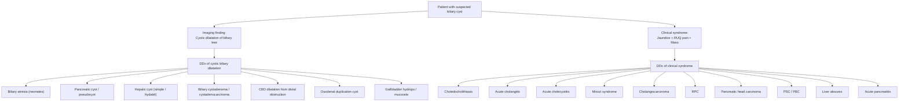

## Differential Diagnosis of Biliary Cysts

The differential diagnosis of a biliary cyst revolves around a fundamental clinical question: **what else can cause cystic/dilated structures in or around the biliary tree, or produce the same symptom complex (jaundice + RUQ pain + abdominal mass)?**

To reason through this systematically, let's think about what biliary cysts actually look like to the clinician and on imaging:

1. **On imaging**: A cystic dilatation of the bile duct (intra- or extrahepatic).
2. **Clinically**: Some combination of obstructive jaundice, RUQ pain, palpable mass, cholangitis, and/or pancreatitis.

We must therefore differentiate biliary cysts from conditions that mimic either their **imaging appearance** or their **clinical presentation** — or both.

---

### Organising Framework

I find it most useful to split the differential into two axes:

**A. Conditions that mimic cystic biliary dilatation on imaging** (the "what else could that cyst be?" question).

**B. Conditions that present with a similar clinical syndrome** (jaundice ± RUQ pain ± mass ± cholangitis).

---

### A. Conditions Mimicking Cystic Biliary Dilatation on Imaging

These are conditions that can look like a "cyst" in the biliary region on USG, CT, or MRCP:

#### 1. Biliary Atresia (Neonatal DDx)

- **Why it mimics**: In neonates, both biliary atresia and biliary cysts present with ***prolonged neonatal jaundice***, dark urine, and pale stools [6]. On USG, biliary atresia shows a ***contracted gallbladder*** and ***triangular cord sign*** (fibrous remnant of extrahepatic duct), which must be distinguished from a dilated cystic duct in choledochal cyst [6].
- **How to differentiate**: 
  - Biliary atresia → **no visible bile ducts** / small/absent gallbladder / triangular cord sign at porta hepatis.
  - Biliary cyst → **visible cystic dilatation** of the bile duct; gallbladder often present.
  - ***E-HIDA scan*** (hepatobiliary iminodiacetic acid): In biliary atresia, there is ***absence of isotope in the intestine*** (no biliary excretion). In biliary cyst, isotope accumulates in the cyst and may still reach the intestine (unless completely obstructed) [6].
  - ***Operative cholangiogram*** is the gold standard for biliary atresia [6].

<Callout title="Neonatal Jaundice — The Critical DDx" type="error">
In a neonate with conjugated hyperbilirubinaemia, the two most important surgical diagnoses to differentiate are **biliary atresia** (needs Kasai procedure within 60 days) and **choledochal cyst** (needs excision). Getting this wrong has devastating consequences. USG is the first-line imaging for both. Remember: biliary atresia = **contracted GB, triangular cord sign**; choledochal cyst = **cystic dilatation of bile duct**.
</Callout>

#### 2. Pancreatic Cyst / Pseudocyst

- **Why it mimics**: A cyst in the head of the pancreas (e.g., ***intraductal papillary mucinous neoplasm (IPMN)***, mucinous cystic neoplasm, serous cystadenoma, or pseudocyst) can be adjacent to or compress the distal CBD, mimicking a distal choledochal cyst (Type III) on imaging [7].
- **How to differentiate**:
  - Pancreatic pseudocyst: History of pancreatitis, thick wall, no epithelial lining (hence "pseudo-"), arises from pancreatic parenchyma not from the bile duct wall.
  - IPMN: Communicates with the pancreatic duct (not the bile duct), seen on MRCP as grape-like cystic dilatations of the pancreatic duct.
  - MRCP clearly delineates whether the cyst arises from the **biliary tree** or the **pancreatic duct** [2].

#### 3. Hepatic Cyst (Simple Cyst / Hydatid Cyst)

- **Why it mimics**: Simple hepatic cysts are extremely common and can be located near the hilum, mimicking intrahepatic biliary cysts (Type IVa or V). Hydatid cysts (Echinococcus granulosus) can also appear as large cystic structures in the liver.
- **How to differentiate**:
  - Simple hepatic cysts: **Do not communicate with the biliary tree**. On MRCP, there is no connection to bile ducts. Thin-walled, anechoic on USG.
  - Hydatid cysts: May show daughter cysts, membrane detachment ("water lily sign"), or calcification. Echinococcus serology positive. Travel history (sheep-farming regions).
  - Biliary cysts (Type V / Caroli): Directly **communicate with intrahepatic bile ducts** — this is the key distinguishing feature on MRCP. May show the "central dot sign" on CT (portal vein radicle surrounded by dilated duct).

#### 4. Biliary Cystadenoma / Cystadenocarcinoma

- **Why it mimics**: These are rare true neoplastic cysts of the biliary epithelium. They appear as large, multiloculated cystic masses within the liver, mimicking Type IVa or V biliary cysts.
- **How to differentiate**:
  - Cystadenoma: **Multiloculated** with internal septae, mural nodules, mucin-secreting epithelium. Predominantly in **middle-aged women**.
  - On MRCP: Does not show the saccular ductal communication pattern of Caroli disease.
  - Biopsy/resection shows ovarian-type stroma (in the mucinous subtype).
  - **Key point**: Any biliary cyst with mural nodularity or solid components should raise concern for cystadenoma/cystadenocarcinoma or malignant transformation within a choledochal cyst.

#### 5. CBD Dilatation from Distal Obstruction (Not a True Cyst)

- **Why it mimics**: Any cause of distal CBD obstruction (***choledocholithiasis***, ***pancreatic head carcinoma***, ***periampullary carcinoma***, ***chronic pancreatitis***) can cause upstream CBD dilatation that may look fusiform, mimicking a Type I biliary cyst [8][9].
- **How to differentiate**:
  - **Age**: Biliary cysts are congenital and typically present in young patients; malignant obstruction presents in the elderly.
  - **Imaging**: In distal obstruction, the dilatation tapers to a point of obstruction (the "cut-off" sign). In a true biliary cyst, the cyst has a defined wall and the duct calibre changes abruptly at the cyst margins.
  - **APBJ**: Present in biliary cysts (70–90%), absent in reactive dilatation.
  - ***CBD > 8 mm on USG suggests dilatation*** [9]; but true biliary cysts are typically much larger and more globular.
  - Post-cholecystectomy or post-ERCP sphincterotomy can cause mild CBD dilatation (up to 10 mm) that is physiological, not a cyst [4].

#### 6. Duodenal Duplication Cyst

- **Why it mimics**: A duplication cyst of the second part of the duodenum can appear adjacent to the distal CBD and mimic a Type III choledochal cyst (choledochocele).
- **How to differentiate**:
  - Duplication cyst: Has a muscular wall with intestinal mucosa. Does not communicate with the bile duct on MRCP.
  - Choledochocele: Communicates with the CBD and protrudes into the duodenal lumen.
  - EUS (endoscopic ultrasound) can distinguish the layers of the cyst wall.

#### 7. Gallbladder Hydrops / Mucocele

- **Why it mimics**: A massively distended gallbladder (hydrops from cystic duct obstruction) can appear as a large cystic RUQ mass, mimicking a large Type I choledochal cyst on quick USG assessment.
- **How to differentiate**:
  - Hydrops: The cyst is clearly the **gallbladder** (connects to cystic duct, fundus projects inferiorly). Contains mucoid/clear fluid. Cystic duct stone may be visible.
  - Biliary cyst: The cyst is the **bile duct itself**; the gallbladder is a separate structure.
  - MRCP unambiguously resolves this.

---

### B. Conditions Mimicking the Clinical Syndrome

These conditions produce overlapping symptoms (jaundice, RUQ pain, fever, mass) but are NOT cystic dilatations of the bile duct:

#### 1. Choledocholithiasis (CBD Stone) [9]

| Feature | Choledocholithiasis | Biliary Cyst |
|---|---|---|
| **Age** | Middle-aged/elderly | Young (< 10 years typically) |
| **Pain pattern** | Colicky or constant RUQ, associated with fatty meals | Chronic/recurrent, not meal-related |
| **Jaundice** | Intermittent or acute | Intermittent or progressive |
| **Mass** | No palpable mass | Palpable cystic mass (children) |
| **USG** | Stone in CBD ± dilated CBD | **Cystic dilatation** of the duct itself |
| **MRCP** | Filling defect in CBD | Fusiform/saccular cyst ± APBJ |

#### 2. Acute Cholangitis [3]

- Presents with ***Charcot's triad: fever + jaundice + RUQ pain*** (present in ~2/3 of patients) [3].
- However, acute cholangitis is a **complication** of biliary cysts, not an alternative diagnosis. If a young patient presents with cholangitis, always ask: *why is this young person getting cholangitis?* — and consider an underlying biliary cyst or APBJ.

#### 3. Acute Cholecystitis [10]

- Presents with RUQ pain, fever, positive Murphy's sign.
- Distinguished from biliary cysts by: USG showing gallbladder wall thickening (> 3 mm), pericholecystic fluid, gallstones in GB. The bile duct itself is not cystically dilated.
- Pain > 6 hours (vs. biliary colic < 6 hours) [10].

#### 4. Mirizzi Syndrome [11]

- ***CHD obstruction caused by extrinsic compression from an impacted stone in Hartmann's pouch/cystic duct*** [11].
- Can present with ***jaundice + RUQ pain + palpable gallbladder*** (an ***exception to Courvoisier's Law***) [11].
- **How to differentiate from biliary cyst**:
  - Mirizzi: Gallstone impacted in cystic duct/Hartmann's pouch with external compression of CHD. USG shows ***dilatation above the level of gallbladder neck*** with ***abrupt change to normal CBD below*** [11].
  - Biliary cyst: Intrinsic cystic dilatation of the bile duct itself. No impacted stone in the cystic duct.
  - MRCP resolves the distinction definitively.

#### 5. Cholangiocarcinoma [3][5]

- ***Cholangiocarcinoma is a complication*** of biliary cysts (10–30% lifetime risk) but also enters the DDx when a biliary cyst patient develops new symptoms.
- Perihilar cholangiocarcinoma (***Klatskin tumour***) can cause hilar stricturing that mimics a biliary cyst on initial imaging [5].
- **Red flags for malignant transformation within a known biliary cyst**: New-onset weight loss, progressive painless jaundice, rising CA 19-9, solid mural nodules within the cyst on imaging.
- ***Risk factors for cholangiocarcinoma include: PSC, RPC, choledochal cysts, Caroli's disease, Lynch syndrome, Clonorchis sinensis, Thorotrast*** [5].

#### 6. Recurrent Pyogenic Cholangitis (RPC) [4]

- ***"Hong Kong disease"*** — recurrent bacterial cholangitis with ***intrahepatic pigment stones and intrahepatic biliary obstruction (strictures)*** [4].
- Shares features with biliary cysts: intrahepatic ductal dilatation, recurrent cholangitis, left lobe predilection.
- **How to differentiate**:
  - RPC: **Acquired** condition. Intrahepatic stone disease with stricture-dilatation pattern. Brown pigment stones formed *de novo* in bile ducts. ***Left intrahepatic ducts*** predominantly. Middle-aged onset. History of parasitic exposure.
  - Biliary cyst: **Congenital**. Defined cystic dilatation. APBJ present. Presents younger.
  - CT in RPC: ***Central dilated bile ducts with peripheral tapering, left lobe predilection, liver atrophy*** [4].

#### 7. Primary Sclerosing Cholangitis (PSC) [12]

- ***Chronic progressive disorder characterized by inflammation, fibrosis and stricturing of bile ducts*** [12].
- Can cause intrahepatic and extrahepatic ductal changes that mimic biliary cysts on imaging.
- **How to differentiate**:
  - PSC: ***Strong association with ulcerative colitis***. Shows "beading" pattern (alternating strictures and dilatations) on MRCP. p-ANCA positive. No APBJ. Middle-aged males.
  - Biliary cyst: Congenital. Discrete cystic dilatation (not beading). APBJ present. Young females.

#### 8. Primary Biliary Cholangitis (PBC) [13]

- ***Autoimmune destruction of small intralobular bile ducts*** → chronic cholestasis [13].
- Presents with pruritus, fatigue, cholestatic LFTs.
- Distinguished from biliary cysts by: AMA positive, no cystic dilatation on imaging, ***extreme female predominance (90–95%)***, middle-aged.

#### 9. Pancreatic Head Carcinoma [14]

- ***Painless progressive obstructive jaundice*** in the elderly is ***malignant biliary obstruction until proven otherwise*** [8].
- Can cause dilated CBD mimicking Type I biliary cyst.
- Distinguished by: age (elderly), weight loss, ***Courvoisier's sign positive*** (palpable non-tender gallbladder in painless jaundice) [14], pancreatic mass on CT, CA 19-9 elevated.

#### 10. Liver Abscess [3][11]

- Pyogenic or amoebic liver abscess can appear as a cystic hepatic lesion on USG.
- Distinguished by: fever, leukocytosis, elevated inflammatory markers, thick irregular wall with internal debris (not clear fluid), no communication with bile ducts.
- ***Listed as a differential for infected choledochal cysts*** [3].

#### 11. Acute Pancreatitis [1]

- Biliary cysts with APBJ can present with pancreatitis. Conversely, pancreatitis from any cause can produce a pseudocyst that mimics a biliary cyst.
- Elevated serum amylase/lipase, clinical context, and MRCP showing the origin of the cyst (bile duct vs. pancreas) differentiate the two.

---

### Summary Differential Diagnosis Table

| Condition | Key Distinguishing Features from Biliary Cyst |
|---|---|
| **Biliary atresia** | Neonate; no visible bile duct; contracted GB; triangular cord sign; absent intestinal isotope on HIDA |
| **Pancreatic cyst/pseudocyst** | Arises from pancreas not bile duct; communicates with pancreatic duct; history of pancreatitis |
| **Simple hepatic cyst** | No communication with bile ducts; thin-walled; incidental; asymptomatic |
| **Hydatid cyst** | Daughter cysts; serology positive; travel history; no biliary communication |
| **Biliary cystadenoma** | Multiloculated; mural nodules; septations; middle-aged women |
| **CBD dilatation (distal obstruction)** | Tapering to obstruction point; older age; identifiable distal cause |
| **Duodenal duplication cyst** | Muscular wall; no biliary communication; EUS confirms intestinal layers |
| **Choledocholithiasis** | Filling defect in CBD; older patient; no APBJ; no cystic wall |
| **Acute cholangitis** | Is a complication, not a differential per se; investigate for underlying cause |
| **Cholecystitis** | GB wall thickening; pericholecystic fluid; Murphy's sign; bile duct normal |
| **Mirizzi syndrome** | Stone in Hartmann's pouch; extrinsic compression of CHD; no intrinsic cyst |
| **Cholangiocarcinoma** | Solid mass; stricturing; older patient; rising CA 19-9; may arise within a cyst |
| **RPC** | Acquired; pigment stones; stricture-dilatation pattern; left lobe; middle-age |
| **PSC** | UC association; beading on MRCP; p-ANCA; no APBJ |
| **PBC** | AMA positive; small duct disease; no cystic dilatation; middle-aged women |
| **Pancreatic head CA** | Elderly; painless jaundice; Courvoisier positive; pancreatic mass |
| **Liver abscess** | Fever; thick wall; debris; no ductal communication |

---

<Callout title="Clinical Approach to the DDx" type="idea">

When confronted with a cystic biliary lesion:

1. **Age**: Young → biliary cyst, biliary atresia (neonate). Old → malignant obstruction, pancreatic cyst.
2. **APBJ present?** → Strongly favours biliary cyst.
3. **Does the cyst communicate with the bile duct?** → Yes = biliary cyst or Caroli disease. No = hepatic cyst, hydatid, pancreatic cyst.
4. **Acquired vs. congenital**: History of pancreatitis (pseudocyst), surgery (post-op dilatation), parasites (RPC).
5. **MRCP** is the single most useful investigation to resolve the differential — it delineates ductal anatomy, cyst communication, and APBJ in one study.

</Callout>

> **High Yield**: The most important differential in neonates is **biliary atresia** (Kasai procedure needed within 60 days). The most important differential in adults is **malignant transformation within the cyst** (cholangiocarcinoma) or **malignant biliary obstruction** mimicking a cyst. Always think: is this a true congenital cyst, or reactive dilatation from obstruction?

---

<ActiveRecallQuiz
  title="Active Recall - Differential Diagnosis of Biliary Cysts"
  items={[
    {
      question: "A neonate presents with prolonged conjugated jaundice, pale stools, and dark urine. USG shows a cystic structure at the porta hepatis. What are the two most important surgical diagnoses to differentiate and how would you distinguish them?",
      markscheme: "Biliary atresia vs choledochal cyst. Biliary atresia: contracted/absent GB, triangular cord sign at porta hepatis, absence of isotope in intestine on HIDA scan. Choledochal cyst: visible cystic dilatation of bile duct, GB usually present, isotope accumulates in cyst on HIDA. Operative cholangiogram is gold standard for biliary atresia. Key urgency: Kasai procedure needed within 60 days for biliary atresia.",
    },
    {
      question: "How would you differentiate Caroli disease (Type V biliary cyst) from simple hepatic cysts and hydatid cysts on imaging?",
      markscheme: "Caroli disease: intrahepatic cystic dilatations that COMMUNICATE with the biliary tree on MRCP; central dot sign on CT (portal vein radicle surrounded by dilated duct). Simple hepatic cyst: NO communication with bile ducts, thin-walled, anechoic, asymptomatic. Hydatid cyst: daughter cysts, water lily sign, membrane detachment, calcification; positive Echinococcus serology; no biliary communication unless ruptured into ducts.",
    },
    {
      question: "An elderly patient presents with painless progressive jaundice. USG shows a dilated CBD. How do you differentiate this from a Type I biliary cyst?",
      markscheme: "Age (elderly vs young); in distal obstruction the CBD tapers to a point of obstruction (cut-off sign) whereas a true cyst has a defined cyst wall with abrupt calibre change; Courvoisier sign positive in malignant obstruction (palpable non-tender GB) but negative in congenital cyst; no APBJ in reactive dilatation; CT/MRCP shows pancreatic mass or periampullary tumour in malignant obstruction; painless progressive obstructive jaundice in elderly is malignant until proven otherwise.",
    },
    {
      question: "A young woman in Hong Kong presents with recurrent cholangitis and intrahepatic ductal dilatation with stricturing, predominantly in the left lobe. What are the two main differential diagnoses and how do you distinguish them?",
      markscheme: "Biliary cyst (Type IVa or V) vs Recurrent Pyogenic Cholangitis (RPC). RPC: acquired, middle-age onset, intrahepatic pigment stones formed de novo, stricture-dilatation pattern, left lobe predilection, brown pigment stones, associated with Clonorchis sinensis. Biliary cyst: congenital, presents younger, defined cystic dilatation (not stricture-dilatation), APBJ present in 70-90%. CT in RPC shows central dilated ducts with peripheral tapering and liver atrophy.",
    },
    {
      question: "Name three conditions where cystic or dilated biliary structures on imaging represent acquired pathology rather than a congenital biliary cyst.",
      markscheme: "Any three of: (1) CBD dilatation from distal obstruction (choledocholithiasis, pancreatic head CA, periampullary CA); (2) Pancreatic pseudocyst compressing/adjacent to CBD; (3) Post-cholecystectomy or post-ERCP physiological CBD dilatation; (4) RPC with stricture-dilatation pattern; (5) PSC with beading pattern. Key principle: acquired dilatation has identifiable cause and no APBJ.",
    },
  ]}
/>

## References

[1] Senior notes: felixlai.md (Biliary cysts section)
[2] Senior notes: maxim.md (Choledochal cyst section)
[3] Senior notes: felixlai.md (Acute cholangitis section)
[4] Senior notes: maxim.md (Recurrent pyogenic cholangitis section); felixlai.md (RPC section)
[5] Senior notes: maxim.md (Cholangiocarcinoma section); felixlai.md (Cholangiocarcinoma section)
[6] Senior notes: maxim.md (Hepatobiliary conditions — paediatric section)
[7] Senior notes: maxim.md (Pancreatic cyst section)
[8] Lecture slides: Malignant biliary obstruction.pdf; Senior notes: maxim.md (Obstructive jaundice section)
[9] Senior notes: maxim.md (Choledocholithiasis section); felixlai.md (Choledocholithiasis section)
[10] Senior notes: maxim.md (Acute cholecystitis section); felixlai.md (Acute cholecystitis section)
[11] Senior notes: maxim.md (Mirizzi syndrome section); felixlai.md (Mirizzi syndrome section)
[12] Senior notes: felixlai.md (Primary sclerosing cholangitis section)
[13] Senior notes: felixlai.md (Primary biliary cholangitis section)
[14] Senior notes: felixlai.md (Pancreatic cancer section)
