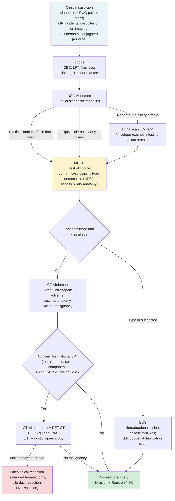
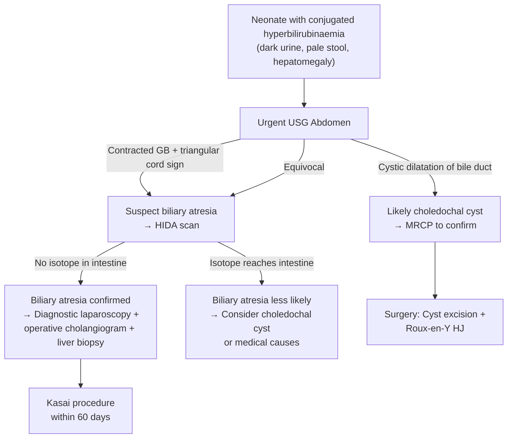

## Diagnostic Criteria for Biliary Cysts

Unlike conditions such as acute cholangitis (which has codified Tokyo Guidelines criteria) or acute cholecystitis (Tokyo criteria with defined scoring), **biliary cysts do not have a formal "diagnostic criteria" scoring system**. The diagnosis is primarily **imaging-based**, supported by clinical context and biochemistry.

That said, the diagnosis of a biliary cyst requires establishing three things:

1. **Presence of a cystic dilatation** that communicates with the biliary tree.
2. **Classification** of the cyst type (Todani).
3. **Assessment for APBJ** and **exclusion of malignancy**.

Let me walk you through the diagnostic approach logically, from bedside to operating theatre.

<Callout title="Key Diagnostic Principle">
The diagnosis of a biliary cyst is made when imaging demonstrates a cystic dilatation that **communicates with the biliary tree** (distinguishing it from hepatic cysts, pancreatic cysts, or other non-biliary cystic lesions). ***MRCP is the test of choice for diagnosing and evaluating biliary cysts*** [1]. ***USG is the initial diagnostic modality*** [2]. ***CT determines extent*** [2].
</Callout>

---

## Diagnostic Algorithm

The approach follows a stepwise logic: **Clinical suspicion → Bloods → Initial imaging (USG) → Definitive imaging (MRCP) → Pre-operative planning (CT ± ERCP) → Operative confirmation**.

<Callout title="The Three-Investigation Triad for Biliary Cysts" type="idea">
Think of it as: ***USG (Diagnostic) → MRCP (Anatomy) → CT (Extent)*** [2]. This is the framework from the senior notes and is exactly how you should answer an exam question about investigating a suspected biliary cyst.
</Callout>

---

## Investigation Modalities — Detailed Breakdown

### 1. Biochemical Tests (Blood Investigations)

Blood tests in biliary cysts are often **normal** in uncomplicated cases. They become abnormal when there are complications (cholangitis, pancreatitis, malignancy). Here is what to order and why:

#### a) CBC with Differentials [1]

| Finding | Significance | Pathophysiological Basis |
|---|---|---|
| Normal | Uncomplicated biliary cyst | No active infection or inflammation |
| ***Leukocytosis (↑ WBC with neutrophil predominance)*** | ***Complicated by acute cholangitis*** [1] | Biliary stasis → bacterial colonization → systemic inflammatory response → bone marrow releases neutrophils |
| Thrombocytopenia | If planning for invasive procedure (ERCP) [15] | Check platelet count to assess bleeding risk before instrumentation |
| Pancytopenia | If secondary biliary cirrhosis has developed | Chronic biliary obstruction → cirrhosis → portal hypertension → hypersplenism → destruction of all cell lines |

#### b) Liver Function Tests (LFT) [1][15]

| Finding | Significance | Pathophysiological Basis |
|---|---|---|
| ***Serum liver tests are often normal in patients with biliary cysts*** [1] | Uncomplicated, non-obstructing cyst | Small cysts may not significantly obstruct bile flow |
| ***Hyperbilirubinaemia (↑ conjugated bilirubin)*** | Biliary obstruction | Cyst compresses or obstructs bile duct → conjugated bilirubin cannot be excreted into duodenum → backs up into blood |
| ***Cholestatic pattern (↑ ALP, ↑ GGT)*** [1] | Biliary obstruction | ALP is concentrated on the canalicular membrane of hepatocytes; when bile flow is obstructed, ALP is induced and "leaks" into serum. GGT confirms hepatobiliary origin of ALP elevation (vs. bone). |
| ↑ AST/ALT | Hepatocellular injury from chronic obstruction | Prolonged cholestasis → secondary hepatocyte damage → transaminase leak |

> **Why does obstructive jaundice cause a cholestatic pattern?** Because ALP and GGT are enzymes located on the biliary canalicular membrane. When bile cannot flow (obstruction), there is back-pressure on the canaliculi, inducing synthesis and release of these enzymes into the bloodstream. This is fundamentally different from hepatocellular damage (where AST/ALT are released from damaged hepatocytes).

#### c) Clotting Profile (PT/INR) [15]

| Finding | Significance | Pathophysiological Basis |
|---|---|---|
| ↑ PT/INR | ***Coagulopathy due to Vitamin K deficiency from decreased absorption of fat-soluble vitamins due to obstructive jaundice*** [15] | Bile salts don't reach the duodenum → fat malabsorption → fat-soluble vitamins (A, D, E, **K**) not absorbed → Vitamin K is essential for hepatic synthesis of clotting factors II, VII, IX, X → coagulopathy |

<Callout title="Clinical Pearl" type="idea">
Always check clotting before any invasive biliary procedure (ERCP, PTC, surgery). If PT is prolonged, give **IV Vitamin K** (phytomenadione) and recheck — if it corrects, the coagulopathy is from cholestasis (Vitamin K deficiency). If it doesn't correct, there is hepatocellular dysfunction (the liver can't make clotting factors even with adequate Vitamin K substrate).
</Callout>

#### d) Serum Amylase / Lipase [1]

| Finding | Significance | Pathophysiological Basis |
|---|---|---|
| ***↑ Serum amylase level if complicated by acute pancreatitis*** [1] | Concurrent pancreatitis | APBJ allows biliary-to-pancreatic reflux → activation of pancreatic enzymes within the pancreas → autodigestion → amylase/lipase leak into blood |
| Normal | No concurrent pancreatitis | — |

#### e) Tumour Markers [15]

| Marker | Role | Interpretation |
|---|---|---|
| **CA 19-9** | Screen for cholangiocarcinoma within the cyst | ***CEA and CA 19-9 are often elevated but are not diagnostically useful since they lack sensitivity and specificity*** [15]. CA 19-9 can also be raised in any cholestatic condition (cholangitis, choledocholithiasis) and other GI cancers (pancreatic, gastric, colorectal) [5]. However, a markedly elevated or rising CA 19-9 in a known biliary cyst should raise suspicion for malignant transformation. |
| **CEA** | Adjunctive marker | Similarly non-specific. ***Serial assay after resection might aid in diagnosis of persistent or recurrent disease*** [15]. |
| **AFP** | Differentiate from HCC | If an intrahepatic cystic lesion is found, AFP helps distinguish cholangiocarcinoma (AFP usually normal) from HCC (AFP often elevated) [5]. |

<Callout title="Tumour Markers — Know Their Limitations" type="error">
CA 19-9 and CEA are **not useful as screening tools** for malignancy in biliary cysts. They lack both sensitivity and specificity. A normal CA 19-9 does **not** exclude cholangiocarcinoma. Their main role is in **monitoring** after surgical excision — a rising level post-operatively suggests recurrence.
</Callout>

#### f) Additional Bloods (if indicated)

| Test | When to order | Why |
|---|---|---|
| Blood culture | If cholangitis suspected (fever + jaundice + RUQ pain) | Identify causative organism and guide antibiotic therapy [16] |
| RFT (Renal function) | Pre-operative workup; if sepsis suspected | Assess for hepatorenal syndrome, contrast-induced nephropathy risk, sepsis-related AKI |
| Stool for ova and parasites | Hong Kong / endemic area [4] | Screen for ***Clonorchis sinensis*** which may co-exist with biliary cysts and contribute to cholangitis |

---

### 2. Radiological Investigations

This is the core of biliary cyst diagnosis. Let me walk through each modality in the logical order you'd use clinically:

#### a) Transabdominal Ultrasound (USG) — ***Initial diagnostic modality*** [2]

**Why USG first?**
- Non-invasive, no radiation, no contrast, readily available, cheap, can be done at bedside.
- Excellent for detecting biliary dilatation and gallstones.

**Key Findings in Biliary Cysts:**

| Finding | What It Tells You |
|---|---|
| **Cystic, anechoic structure** continuous with the bile duct | Confirms presence of a biliary cyst |
| **Fusiform or saccular dilatation of the CBD** | Type I cyst |
| **Intrahepatic ductal dilatation** with cystic areas | Type IVa or V |
| ***Dilated CBD ( > 8 mm)*** [9] | Biliary obstruction — but need to distinguish true cyst from reactive dilatation |
| Gallstones within the cyst | Cystolithiasis (complication) |
| Sludge/echogenic material in the cyst | Stasis, possible infection |

**Limitations of USG** [1]:
- ***Results affected by patient's body habitus, presence of bowel gas, and limited visualisation due to overlying structures*** [1].
- ***Frequently misses Type III choledochal cysts*** [1] — because the choledochocele is located in the intraduodenal (intramural) segment of the distal CBD, which is deep in the retroperitoneum behind the duodenum, where bowel gas obscures the view.
- Cannot reliably demonstrate APBJ.
- Cannot fully characterise intrahepatic disease (Type IVa, V).
- Operator-dependent [10].

**In neonates:**
- USG is the first-line investigation for conjugated neonatal jaundice.
- Must distinguish from biliary atresia: ***contracted GB + triangular cord sign*** = biliary atresia [6]; **cystic dilatation of bile duct** = choledochal cyst [6].

> **CBD normal limits** (exam pearl from senior notes): ***CBD limit: 0.1 cm for every 10 years old*** [17]. So a 60-year-old can have a CBD of up to 6 mm normally. Post-cholecystectomy, the CBD may dilate by 1–2 mm as the bile duct assumes a reservoir function. CBD > 8 mm is generally considered pathological [9][17].

#### b) Endoscopic Ultrasound (EUS) [1]

**When to use:**
- When transabdominal USG is equivocal or limited.
- When Type III (choledochocele) is suspected — EUS provides excellent visualisation of the intraduodenal distal CBD.
- To assess the cyst wall for mural nodularity or solid components (malignancy screening).
- To evaluate the pancreaticobiliary junction.

**Key Advantages:**
- ***Demonstrates extrahepatic biliary cysts and provides detailed images of the cyst wall and pancreaticobiliary junction*** [1].
- ***NOT limited by body habitus, bowel gas, or overlying structures*** [1].
- Can guide FNA if there is a suspicious solid component.

**Limitations:**
- Requires endoscopy (invasive, sedation needed).
- Cannot assess intrahepatic ducts as well as MRCP.
- ***EUS cannot reach the lumen of the bile duct in majority of cases*** [15] — so for detailed cholangiography, MRCP or ERCP is needed.

#### c) Magnetic Resonance Cholangiopancreatography (MRCP) — ***Test of choice*** [1][2]

This is the single most important investigation for biliary cysts. Let me explain why from first principles.

**What is MRCP?**
- ***Non-contrast, T2-weighted*** MRI sequence [17].
- T2-weighted images make fluid appear **bright white** (hyperintense). Since bile is fluid, the entire biliary tree "lights up" on T2 sequences, creating a beautiful cholangiogram without needing to inject any contrast.
- "MR" = magnetic resonance; "CP" = cholangiopancreatography ("cholangio-" = bile duct, "pancreat-" = pancreas, "-graphy" = imaging).

**Why is MRCP the test of choice?** [1]

| Advantage | Explanation |
|---|---|
| ***Confirms that the cysts communicate with the biliary tree*** | This is the defining feature that distinguishes a biliary cyst from a hepatic cyst, pancreatic cyst, or other non-biliary lesion |
| **Delineates the full biliary anatomy** | Shows the exact type (Todani classification), extent of intrahepatic involvement, and relationship to hepatic duct confluence |
| **Demonstrates APBJ** | Can show the long common channel where the pancreatic duct joins the CBD outside the duodenal wall — critical for operative planning and malignancy risk assessment |
| ***Does NOT expose patients to ionising radiation*** | Especially important in children (most biliary cysts present < 10 years) |
| ***Does not have risks of cholangitis and pancreatitis associated with ERCP*** [1] | ERCP injects contrast under pressure into the biliary tree, risking cholangitis and post-ERCP pancreatitis. MRCP avoids this entirely. |
| **Non-invasive** | No sedation required (in older children/adults). No endoscopy. |

**Key MRCP Findings in Biliary Cysts:**

| Finding | Todani Type | Interpretation |
|---|---|---|
| Fusiform/saccular CBD dilatation with communication to biliary tree | **Type I** | Most common finding |
| Diverticulum off the CBD | **Type II** | Rare; side-pocket projecting from duct |
| Intraduodenal cystic lesion communicating with distal CBD | **Type III** | Choledochocele |
| Both intra- and extrahepatic cystic dilatation | **Type IVa** | Assess extent of intrahepatic involvement for operative planning |
| Multiple extrahepatic cysts only | **Type IVb** | Less common |
| Multiple saccular intrahepatic dilatations communicating with bile ducts | **Type V** | Caroli disease; look for "central dot sign" (better on CT) |
| Long common channel with pancreatic duct joining CBD > 1 cm from ampulla | **APBJ** | Present in 70–90%; critical prognostic and operative finding |
| Mural nodularity / irregularity within the cyst | **Malignancy** | Suggests cholangiocarcinoma arising within the cyst; requires further workup |

#### d) CT Abdomen with Contrast — ***Determines extent*** [2][1]

**When to use:**
- After MRCP has confirmed and classified the cyst.
- Pre-operative planning: **anatomy**, **extent**, **vascular relationships**, and **malignancy screening**.

**Key CT Findings:**

| Finding | Significance |
|---|---|
| ***Detects all types of biliary cysts including determining intrahepatic disease in patients with Type IV and V*** [1] | Full anatomical mapping |
| ***Demonstrates continuity of cyst with biliary tree*** [1] | Confirms biliary origin |
| ***Examines relationship of cyst to surrounding structures*** [1] | Vascular anatomy (hepatic artery, portal vein) — essential for safe surgical excision |
| ***Evaluates for presence of malignancy*** [1] | Enhancing mural nodule, soft tissue mass within or adjacent to cyst, lymphadenopathy, liver metastases |
| **"Central dot sign"** (Caroli disease) | Portal vein radicle surrounded by dilated intrahepatic duct — pathognomonic for Type V |
| **Calcification within cyst wall** | Chronic cyst; raises concern for malignant transformation |

**Limitations:**
- Radiation exposure (relevant in children — minimise if possible).
- Less detailed biliary anatomy compared to MRCP.
- Not useful for detecting gallstones (***only 75% of gallstones identified on CT*** [17]).

> ***Biliary cysts should be differentiated from cysts that do NOT communicate with the biliary tree including pancreatic, mesenteric and hepatic cysts*** [1]. This is the single most important interpretation point on imaging.

#### e) ERCP (Endoscopic Retrograde Cholangiopancreatography) [1][15]

**What is ERCP?**
- An endoscopic procedure where a duodenoscope is passed to the ampulla of Vater, the bile duct is cannulated, and contrast is injected under fluoroscopy to visualise the biliary tree.
- "Endoscopic" = via endoscope; "Retrograde" = contrast flows backwards (upstream) from the ampulla; "Cholangio-" = bile duct; "Pancreat-" = pancreas; "-graphy" = imaging.

**Role in Biliary Cysts:**
- Largely **replaced by MRCP** as a diagnostic tool [15].
- Still useful when:
  - **Therapeutic intervention** is needed: biliary stenting for cholangitis, sphincterotomy for Type III cyst.
  - **Brush cytology** is needed to evaluate for cholangiocarcinoma.
  - MRCP is contraindicated (e.g., MRI-incompatible implant) or equivocal.

**Key Findings on ERCP:**
- Cholangiogram shows the cystic dilatation and its relationship to the biliary tree.
- Can demonstrate APBJ (long common channel).
- Can identify stones within the cyst.
- Brush cytology of the cyst wall for malignant cells.

**Risks of ERCP** (why we prefer MRCP):
- Post-ERCP **pancreatitis** (3–5% risk) — contrast injection into the pancreatic duct.
- **Cholangitis** — introduction of bacteria into an obstructed system.
- **Perforation** of the duodenum or bile duct.
- **Bleeding** after sphincterotomy.

#### f) Percutaneous Transhepatic Cholangiography (PTC) [17]

**When to use:**
- ***Preferred to ERCP*** when obstruction is ***at or above the level of confluence of hepatic ducts*** [17] — because ERCP approaches from below (retrograde) and cannot easily pass proximal high-grade obstructions.
- Useful in Type IVa with high intrahepatic obstruction.
- Can be combined with **percutaneous transhepatic biliary drainage (PTBD)** for decompression.

**Complications:** ***Bacteraemia (thus antibiotic prophylaxis required), haemobilia*** [17].

#### g) Cholescintigraphy (HIDA Scan) [17][6]

**What is it?**
- ***HIDA*** = Hepatobiliary Iminodiacetic Acid scan. A nuclear medicine study where a technetium-99m-labelled IDA compound is injected IV, taken up by hepatocytes, and excreted into bile.
- You then image the abdomen with a gamma camera to follow the tracer through the biliary tree.

**Role in Biliary Cysts:**
- Primarily used in **neonates** to differentiate biliary cyst from biliary atresia.
- In biliary atresia: ***absence of isotope in the intestine*** [6] (no biliary excretion at all).
- In biliary cyst: Isotope accumulates in the cyst and may eventually reach the intestine (unless completely obstructed).
- ***Pre-treatment with 5 days of phenobarbitone*** (a liver enzyme inducer that increases biliary secretion) improves the sensitivity of the test [6].

#### h) Operative Cholangiogram [6]

- ***Gold standard for confirming the diagnosis*** in paediatric surgery settings [6].
- Performed intra-operatively: contrast is injected directly into the biliary tree via the cystic duct or gallbladder during surgery.
- Delineates the cyst anatomy in real-time, confirms communication with the biliary tree, identifies APBJ, and guides the extent of excision.
- Especially important in neonates where pre-operative imaging may be inconclusive.

---

### Summary: Investigation Algorithm — The Three-Step Approach

| Step | Modality | Purpose | Key Findings |
|---|---|---|---|
| **1. Screen** | ***USG*** | Initial diagnostic modality | Cystic dilatation of bile duct; exclude gallstones; assess GB |
| **2. Define** | ***MRCP*** | Test of choice for anatomy | Confirm cyst communicates with biliary tree; classify Todani type; demonstrate APBJ |
| **3. Stage** | ***CT*** | Determine extent + exclude malignancy | Intrahepatic involvement; vascular anatomy; mural nodules; lymphadenopathy; metastases |
| *(If needed)* | ***EUS*** | Distal/equivocal lesions; cyst wall assessment | Type III characterisation; FNA of suspicious nodule |
| *(If needed)* | ***ERCP*** | Therapeutic (stent, sphincterotomy) or tissue sampling | Decompression for cholangitis; brush cytology; Type III treatment |
| *(Neonates)* | ***HIDA scan*** | Differentiate from biliary atresia | Isotope reaches intestine = NOT biliary atresia |
| *(Intra-op)* | ***Operative cholangiogram*** | Gold standard confirmation | Real-time biliary anatomy; confirms APBJ; guides excision |

---

### 3. Special Considerations

#### Neonatal Diagnostic Approach

In a neonate with conjugated jaundice, the diagnostic pathway is specifically designed to differentiate biliary cyst from biliary atresia as rapidly as possible:

#### Assessment for Malignancy Within a Known Biliary Cyst

For any patient with a known biliary cyst (especially Type I or IVa, and especially if age > 20), you must actively look for malignant transformation:

| Investigation | Finding Suggesting Malignancy |
|---|---|
| **CT with contrast** | Enhancing solid component / mural nodule within the cyst; lymphadenopathy; liver metastases |
| **MRCP** | Irregularity of cyst wall; stricture within adjacent bile duct |
| **EUS + FNA** | Cytology showing malignant cells from cyst wall nodule |
| **ERCP + brush cytology** | Malignant cells on biliary brushings |
| **CA 19-9** | Markedly elevated or rapidly rising (though non-specific) |
| **PET-CT** | FDG-avid lesion within the cyst wall |

<Callout title="High Yield Exam Points">

1. ***USG = Diagnostic; MRCP = Anatomy; CT = Extent*** — this is the investigation triad for biliary cysts [2].
2. ***MRCP is the test of choice*** — confirms biliary communication, classifies type, demonstrates APBJ, no radiation, no risk of cholangitis/pancreatitis [1].
3. ***USG frequently misses Type III cysts*** due to bowel gas obscuring the intraduodenal segment [1].
4. ***Blood tests are often normal*** in uncomplicated biliary cysts [1].
5. In neonates, the critical DDx is **biliary atresia** — HIDA scan (absence of intestinal isotope) and ***operative cholangiogram (gold standard)*** differentiate the two [6].
6. CA 19-9 and CEA are ***not diagnostically useful*** for screening but are used for ***monitoring after excision*** [15].
7. Always assess for **APBJ** and **malignancy** as part of the diagnostic workup — these dictate the surgical approach and urgency.

</Callout>

---

<ActiveRecallQuiz
  title="Active Recall - Diagnosis and Investigation of Biliary Cysts"
  items={[
    {
      question: "What is the three-step investigation approach for a suspected biliary cyst and what does each modality assess?",
      markscheme: "Step 1: USG (initial diagnostic modality — detect cystic dilatation, exclude gallstones). Step 2: MRCP (test of choice — confirm cyst communicates with biliary tree, classify Todani type, demonstrate APBJ, no radiation or risk of cholangitis/pancreatitis). Step 3: CT (determine extent of intrahepatic involvement, vascular anatomy, exclude malignancy — mural nodules, lymphadenopathy, metastases).",
    },
    {
      question: "Why is MRCP preferred over ERCP as the primary diagnostic tool for biliary cysts?",
      markscheme: "MRCP is non-invasive, uses T2-weighted sequences where fluid/bile appears bright without contrast injection. Does not expose patients to ionising radiation (important in children). Does not carry risks of post-ERCP pancreatitis, cholangitis, perforation, or bleeding. Provides excellent anatomical detail of biliary tree and can demonstrate APBJ. ERCP is reserved for therapeutic indications (stenting, sphincterotomy for Type III) or tissue sampling (brush cytology).",
    },
    {
      question: "A neonate presents with conjugated jaundice. USG shows a contracted gallbladder and a triangular cord sign at the porta hepatis. What is the most likely diagnosis, what confirmatory investigation would you arrange, and what pre-treatment enhances its sensitivity?",
      markscheme: "Most likely diagnosis: biliary atresia. Confirmatory investigation: HIDA scan (hepatobiliary iminodiacetic acid scan) — will show absence of isotope in the intestine, confirming failed biliary excretion. Pre-treatment: 5 days of phenobarbitone (liver enzyme inducer, increases biliary secretion to improve sensitivity). Gold standard confirmation: operative cholangiogram with liver biopsy at diagnostic laparoscopy.",
    },
    {
      question: "What blood test findings would you expect in an uncomplicated biliary cyst versus one complicated by cholangitis?",
      markscheme: "Uncomplicated: liver tests often normal; may have mild cholestatic pattern (raised ALP, GGT) and conjugated hyperbilirubinaemia. CBC normal. Amylase normal. Complicated by cholangitis: leukocytosis with neutrophil predominance; raised CRP/ESR; cholestatic LFT pattern with raised bilirubin; raised amylase if concurrent pancreatitis; positive blood cultures; possible raised PT/INR from Vitamin K malabsorption.",
    },
    {
      question: "Why does USG frequently miss Type III choledochal cysts, and what alternative imaging modality would you use?",
      markscheme: "Type III (choledochocele) is located in the intraduodenal/intramural portion of the distal CBD, deep in the retroperitoneum behind the duodenum. Bowel gas in the duodenum obscures this area on transabdominal USG. Alternative: EUS (endoscopic ultrasound) provides excellent visualisation of the intraduodenal distal CBD because the transducer is placed directly in the duodenum, bypassing bowel gas. MRCP also visualises this area well.",
    },
  ]}
/>

## References

[1] Senior notes: felixlai.md (Biliary cysts — Diagnosis and Radiological tests sections)
[2] Senior notes: maxim.md (Choledochal cyst — Investigations section)
[4] Senior notes: maxim.md (Recurrent pyogenic cholangitis section)
[5] Senior notes: maxim.md (Cholangiocarcinoma — Investigations section); felixlai.md (Cholangiocarcinoma — Diagnosis section)
[6] Senior notes: maxim.md (Hepatobiliary conditions — paediatric table: biliary atresia and choledochal cyst)
[9] Senior notes: maxim.md (Choledocholithiasis section)
[10] Senior notes: maxim.md (Biliary colic — USG findings section)
[15] Senior notes: felixlai.md (Malignant biliary obstruction — Biochemical tests section; Gallbladder cancer — Tumour markers section)
[16] Senior notes: maxim.md (Acute cholangitis section)
[17] Senior notes: maxim.md (HBP investigations section)
