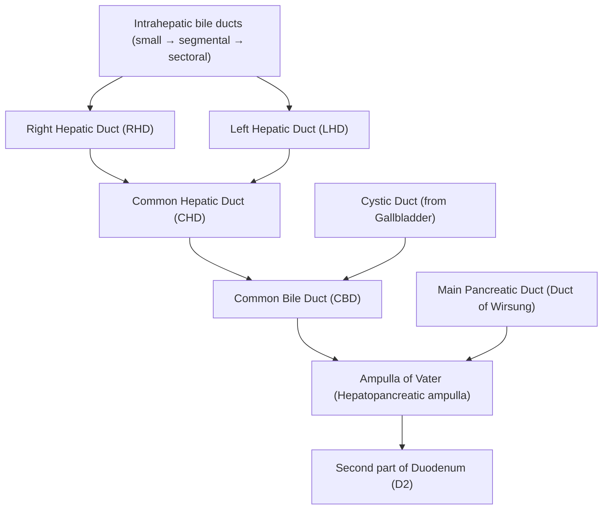
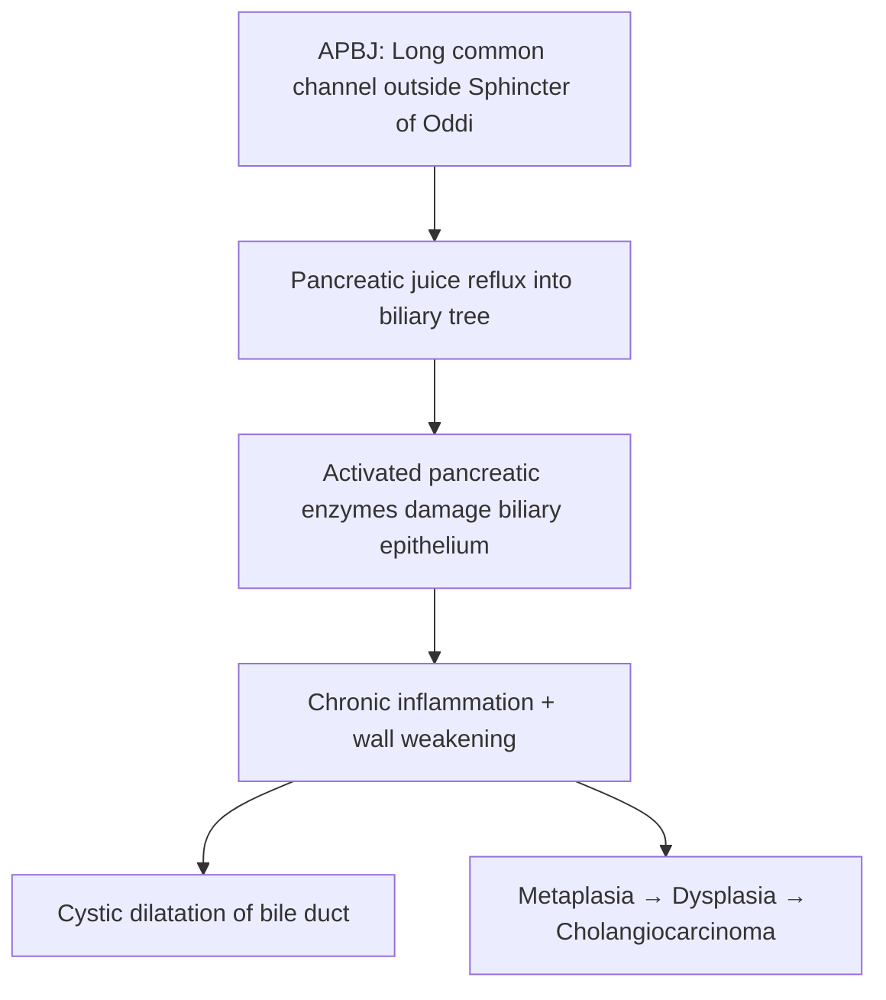
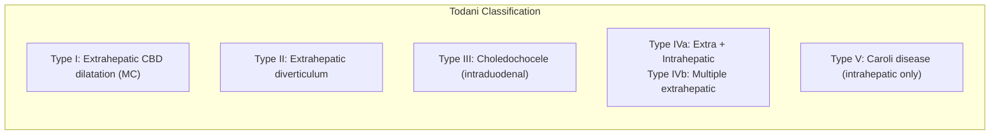
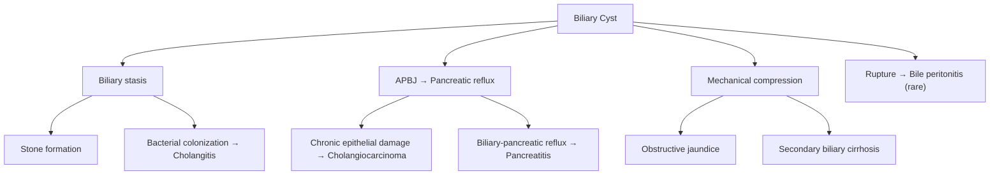

# Biliary Cysts (Choledochal Cysts)

## 1. Definition

Biliary cysts are **congenital cystic dilatations** that can occur singly or multiply throughout the biliary tree — both intrahepatic and extrahepatic bile ducts [1][2].

- The term ***"choledochal cyst"*** was coined in 1959, originally referring only to extrahepatic bile duct dilatations [1].
  - "Choledocho-" = common bile duct (Greek: *choledochos* = "receiving bile"); "cyst" = fluid-filled sac (Greek: *kystis* = bladder/sac).
  - So the name literally means "a cystic sac of the common bile duct."
- The nomenclature was **expanded in 1977** to include intrahepatic cysts and **further refined in 2003** to incorporate the concept of an abnormal pancreaticobiliary junction (APBJ) [1].
- The modern umbrella term ***"biliary cyst"*** is preferred because it captures the full spectrum — extrahepatic, intrahepatic, or both.

<Callout title="Why Does This Matter?">
Biliary cysts are pre-malignant. They carry a significantly increased risk of **cholangiocarcinoma**, especially **Type I and Type IV** cysts and those associated with APBJ. This is the single most important reason we treat them surgically rather than observe [1][2].
</Callout>

---

## 2. Epidemiology

| Feature | Detail |
|---|---|
| **Sex** | ***Female predominance (M:F ≈ 1:3–4)*** [1] |
| **Ethnic predilection** | ***Biliary cysts and APBJ are especially common in Asians*** (incidence ~1 in 1,000 in Japan vs. ~1 in 100,000–150,000 in Western populations) [1] |
| **Age at presentation** | ***Majority present before age 10*** (~60% diagnosed in childhood) [1][2] |
| **Adult diagnosis** | Up to **50%** of patients may not be diagnosed until adulthood — often discovered incidentally on imaging or when complications (cholangitis, pancreatitis, malignancy) develop [1] |
| **Incidence trend** | Increasing detection in adults due to widespread use of cross-sectional imaging (CT, MRCP, USG) |

<Callout title="High Yield" type="idea">
Think of biliary cysts as a disease of **young Asian females** — but remember that a substantial proportion present in adulthood, often with complications. In Hong Kong, always keep biliary cysts in your differential for unexplained biliary dilatation in a young patient.
</Callout>

---

## 3. Anatomy and Function of the Biliary System (Foundation)

To understand biliary cysts, you must first understand the normal anatomy they distort.

### 3.1 Normal Biliary Anatomy

- **Intrahepatic bile ducts** → drain bile produced by hepatocytes.
- **Right and Left Hepatic Ducts** → join at the hilum to form the **Common Hepatic Duct (CHD)**.
- **CHD + Cystic Duct** → form the **Common Bile Duct (CBD)** (~7–8 cm long, < 6 mm diameter normally).
- **CBD + Main Pancreatic Duct** → enter the duodenum at the **Ampulla of Vater**, surrounded by the **Sphincter of Oddi**.

### 3.2 Normal Pancreaticobiliary Junction

- The CBD and pancreatic duct normally join **within the duodenal wall** (intramural segment), forming a very short common channel (< 5 mm) controlled by the Sphincter of Oddi.
- The Sphincter of Oddi prevents reflux of duodenal content and pancreatic juice into the biliary tree.

### 3.3 Function of the Biliary Tree

- Transports bile (containing bile salts, bilirubin, cholesterol, phospholipids) from the liver to the duodenum for fat digestion and waste excretion.
- The **gallbladder** stores and concentrates bile between meals.

---

## 4. Etiology

### 4.1 Congenital vs. Acquired

Biliary cysts can be **congenital** (the vast majority) or rarely **acquired** [1].

| | Congenital | Acquired |
|---|---|---|
| **Mechanism** | Abnormal embryological development of the biliary epithelium | Post-surgical (e.g., post-cholecystectomy), post-inflammatory |
| **Proportion** | > 95% | Rare |
| **Key association** | APBJ, fibrocystic liver disease | Prior biliary surgery/instrumentation |

### 4.2 The Central Aetiological Theory: Abnormal Pancreaticobiliary Junction (APBJ)

This is the dominant aetiological concept you must understand:

***APBJ is present in 70–90% of patients with biliary cysts*** [1].

#### What is APBJ?

- **APBJ** = the pancreatic duct joins the CBD **> 1 cm proximal** to the Ampulla of Vater (i.e., outside the duodenal wall) [1].
- This creates a **long common channel** that lies **outside the regulatory influence of the Sphincter of Oddi**.

#### Why does APBJ cause biliary cysts?

The pathophysiology is elegant and logical:

1. **Loss of sphincteric control** → The Sphincter of Oddi normally prevents reflux. When the junction is proximal (outside the duodenal wall), the sphincter cannot control the long common channel.
2. **Pancreatic juice reflux into the biliary tree** → Pancreatic enzymes (lipase, phospholipase A₂, trypsin, elastase) are activated and directly contact biliary epithelium.
3. **Chemical damage to biliary epithelium** → Chronic inflammation, epithelial destruction, and weakening of the bile duct wall.
4. **Cystic dilatation** → The weakened, inflamed bile duct wall progressively dilates under normal intraluminal pressure → forming a cyst.
5. **Malignant transformation** → Chronic inflammation and epithelial turnover → metaplasia → dysplasia → cholangiocarcinoma.

#### Congenital Embryological Theory (Supplementary)

- During embryological development, the biliary epithelium undergoes a **solid cord phase** followed by **recanalization** (vacuolization).
- ***Congenital cysts may result from unequal proliferation of embryologic biliary epithelial cells before bile duct canalization is complete*** [1].
- This leads to areas of ductal weakness and dilatation.

<Callout title="Tying it Together" type="idea">
Think of two insults:
1. **Structural weakness** from abnormal embryological development.
2. **Chemical insult** from reflux of pancreatic juice through APBJ.

Both contribute, and APBJ is the stronger, more clinically relevant mechanism — especially for malignant risk.
</Callout>

### 4.3 Hong Kong / Asian Context

In Hong Kong and East Asia, biliary cysts are significantly more common than in the West. Relevant associations include:

- **APBJ** — more common in Asian populations (genetic/developmental predisposition) [1].
- **Parasitic infection** (***Clonorchis sinensis*** — transmitted by consumption of raw/undercooked freshwater fish 淡水魚) — causes chronic biliary inflammation that may synergistically worsen outcomes in patients with pre-existing biliary cysts [3][4].
- **Recurrent pyogenic cholangitis (RPC)** (the ***"Hong Kong disease"***) — shares overlapping pathology with biliary cysts (intrahepatic stone formation, stricturing, biliary stasis) [4].

<Callout title="Hong Kong Relevance" type="error">
For HKUMed exams, always mention:
1. APBJ as the dominant aetiology.
2. The malignant risk (cholangiocarcinoma).
3. Clonorchis sinensis as a regional parasitic association.
4. RPC as a related biliary condition common in Hong Kong.
</Callout>

---

## 5. Classification: Todani Classification (Modified Alonso-Lej)

This is the universally used classification system. ***Most commonly Type I*** [2].

| Type | Description | Frequency | Key Points |
|---|---|---|---|
| **Type I** | ***Fusiform or saccular dilatation of the extrahepatic bile duct (CBD)*** | **50–80%** (most common) | Subclassified into Ia (cystic), Ib (focal segmental), Ic (fusiform/diffuse). Highest malignancy risk with Type Ic. |
| **Type II** | ***Diverticulum (true diverticulum) of the extrahepatic bile duct*** | **2–3%** | A side-pocket protruding from the CBD wall. Rare. |
| **Type III** | ***Choledochocele — cystic dilatation of the intraduodenal (intramural) portion of the distal CBD*** | **1–5%** | Protrudes into the duodenal lumen. "Choledocho-" = bile duct, "-cele" = swelling/herniation. Lowest malignancy risk. |
| **Type IV** | ***Multiple cysts*** | **15–35%** | **IVa**: Extrahepatic + intrahepatic (more common, higher malignancy risk). **IVb**: Multiple extrahepatic only. |
| **Type V** | ***Caroli disease — multiple saccular or cystic dilatations of the intrahepatic bile ducts*** | **~20%** | Caroli disease = isolated intrahepatic cystic dilatation. **Caroli syndrome** = Caroli disease + congenital hepatic fibrosis. Associated with autosomal recessive polycystic kidney disease (ARPKD). |

<Callout title="Exam Essentials">
- **Type I** = most common (~50–80%).
- **Type IVa** = second most common; involves both intrahepatic and extrahepatic ducts.
- **Type V (Caroli disease)** = purely intrahepatic; associated with congenital hepatic fibrosis and ARPKD.
- **Types I and IV** carry the **highest malignancy risk**.
- **Type III (choledochocele)** has the **lowest malignancy risk** and may be managed with endoscopic sphincterotomy rather than excision.
</Callout>

### 5.1 Caroli Disease vs. Caroli Syndrome

| Feature | Caroli Disease | Caroli Syndrome |
|---|---|---|
| Bile duct changes | Multiple saccular intrahepatic dilatations | Same as Caroli disease |
| Hepatic fibrosis | Absent | **Present** (congenital hepatic fibrosis) |
| Renal association | Variable | Strongly associated with **ARPKD** |
| Portal hypertension | Absent | May develop (due to hepatic fibrosis) |
| Inheritance | Autosomal recessive | Autosomal recessive |
| Gene | *PKHD1* (fibrocystin/polyductin) | *PKHD1* |

- Think of Caroli **syndrome** as the **more severe** form on a disease spectrum — biliary cysts + hepatic fibrosis + renal cysts.
- "Caroli" — named after Jacques Caroli, French gastroenterologist who described the condition.

---

## 6. Pathophysiology — Consequences of Biliary Cysts

Understanding the pathophysiology of biliary cysts explains every clinical feature and complication:

### 6.1 Biliary Stasis

- Cystic dilatation creates a "sump" where bile pools and stagnates instead of flowing freely to the duodenum.
- **Consequence**: Stone formation (choledocholithiasis), bacterial colonization, cholangitis.

### 6.2 Reflux of Pancreatic Juice (via APBJ)

- Activated pancreatic enzymes continuously damage the cyst epithelium.
- **Consequence**: Chronic inflammation, epithelial hyperplasia, malignant transformation.

### 6.3 Chronic Inflammation → Malignant Transformation

- The cyst epithelium undergoes a **metaplasia–dysplasia–carcinoma sequence** analogous to Barrett's oesophagus.
- **Risk of cholangiocarcinoma**: 
  - Overall lifetime risk: **10–30%** in untreated biliary cysts.
  - Risk **increases with age** (especially after 20 years of age).
  - Highest in **Type I and Type IVa** cysts.
  - Also elevated in patients with APBJ even without overt cystic dilatation.

### 6.4 Obstruction

- Cysts can compress adjacent structures (CBD, hepatic ducts, portal vein).
- **Consequence**: Obstructive jaundice, secondary biliary cirrhosis (if chronic), portal hypertension.

### 6.5 Infection

- Stagnant bile is an excellent culture medium.
- **Consequence**: Recurrent cholangitis, liver abscess.

### 6.6 Pancreatitis

- In APBJ, the long common channel allows not only pancreatic-to-biliary reflux but also biliary-to-pancreatic reflux.
- Bile reflux into the pancreatic duct → activation of pancreatic enzymes within the pancreas → **acute pancreatitis**.

### 6.7 Rupture (Rare)

- Thin-walled cysts (especially in neonates) can rupture, leading to **bile peritonitis**.

---

## 7. Clinical Features

### 7.1 Presentation by Age Group

| Children (< 10 years) | Adults |
|---|---|
| More likely to present with the **classic triad** | Classic triad present in only **~20%** |
| Abdominal mass more common | Abdominal pain dominant |
| Jaundice common | Complications often the presenting feature (cholangitis, pancreatitis, malignancy) |

### 7.2 Symptoms

***Classic triad: Jaundice + Abdominal pain + Abdominal mass*** [1][2]

> The classic triad is present in only about **20–30% of adults** but is more common in children. Don't rely on the full triad for diagnosis.

| Symptom | Pathophysiological Basis |
|---|---|
| ***Jaundice*** | Cyst causes obstruction of bile flow → conjugated hyperbilirubinaemia → bilirubin deposits in skin and sclerae → yellow discolouration. May be **intermittent** (partial obstruction) or **progressive** (if malignancy develops). |
| ***Abdominal pain*** | Typically **RUQ or epigastric**. Caused by: (1) distension of the cyst wall; (2) secondary cholangitis; (3) pancreatitis from APBJ-mediated reflux; (4) biliary colic from stone formation within the cyst. |
| ***Abdominal mass*** | A large cystic dilatation (especially Type I) can be palpable as a smooth, non-tender (or mildly tender) RUQ mass, particularly in thin children. |
| ***Pruritus*** | Cholestasis → bile salts retained in blood → deposit in skin → stimulate itch receptors (C-fibres). Often accompanies jaundice. |
| ***Fever*** | Indicates secondary infection — ascending cholangitis. Biliary stasis → bacterial colonization → systemic inflammatory response. May present as **Charcot's triad** (fever + jaundice + RUQ pain). |
| ***Nausea and vomiting*** | (1) Biliary obstruction reflexively stimulates vagal afferents → nausea. (2) Associated pancreatitis. (3) Duodenal compression by large cysts. |
| ***Weight loss*** | Chronic biliary obstruction → impaired fat absorption (bile salts don't reach duodenum) → steatorrhoea and caloric loss. Also suggests malignant transformation. |
| ***Pancreatitis symptoms*** | Epigastric pain radiating to the back, worse after meals — from APBJ-mediated biliary/pancreatic reflux. |

### 7.3 Signs

| Sign | Pathophysiological Basis |
|---|---|
| **Jaundice** (icteric sclerae, yellow skin) | Conjugated hyperbilirubinaemia from biliary obstruction. Scleral icterus detectable at bilirubin > 35–50 µmol/L because scleral elastin has high affinity for bilirubin. |
| **Palpable RUQ mass** | Large extrahepatic cyst or hepatomegaly from intrahepatic cysts. Smooth, cystic, may be mildly tender. In neonates, may be the sole presenting sign. |
| **RUQ tenderness** | Cyst distension, cholangitis, or associated cholecystitis. If positive Murphy's sign → think superimposed cholecystitis. |
| **Hepatomegaly** | Intrahepatic cysts (Type IVa, V) → liver enlargement. Chronic biliary obstruction → secondary biliary cirrhosis → hepatomegaly (early) or shrunken liver (late). |
| **Fever + rigors** | Ascending cholangitis — stasis allows Gram-negative organisms (E. coli, Klebsiella) to proliferate → systemic bacteraemia → fever with rigors. |
| **Signs of chronic liver disease** (spider naevi, palmar erythema, ascites) | If long-standing biliary obstruction has led to secondary biliary cirrhosis (especially in Type IVa or V with congenital hepatic fibrosis in Caroli syndrome). |
| **Courvoisier-negative gallbladder** | The gallbladder is typically not distended because the cystic duct insertion is usually into or proximal to the cyst; the obstruction is intrinsic rather than distal. Contrast with periampullary tumours where the gallbladder is palpably distended (Courvoisier's Law). |
| **Peritoneal signs** (guarding, rebound tenderness) | Rare — suggests cyst rupture with bile peritonitis (chemical peritonitis from leaked bile) or perforation of a superimposed empyema. |

### 7.4 Presentation in Neonates

- May present with **obstructive jaundice** mimicking biliary atresia.
- Palpable abdominal mass.
- Acholic (pale) stools + dark urine.
- Must differentiate from biliary atresia — imaging (USG → MRCP) is essential.

### 7.5 Clinical Features by Type

| Type | Typical Presentation |
|---|---|
| **I** | Classic triad in children. In adults: RUQ pain, jaundice, cholangitis. |
| **II** | Often incidental finding. Can present as acute abdomen if diverticulum twists or becomes infected. |
| **III (Choledochocele)** | Often asymptomatic. May cause recurrent pancreatitis or duodenal obstruction. |
| **IVa** | Similar to Type I but more complex — intrahepatic involvement means recurrent cholangitis, hepatolithiasis, and higher malignancy risk. |
| **V (Caroli)** | Recurrent cholangitis is the hallmark. Hepatolithiasis. If Caroli syndrome → signs of portal hypertension and renal disease (ARPKD). |

---

## 8. Key Associations and Related Conditions

### 8.1 Biliary Cysts and Cholangiocarcinoma

This is the most critical association:

- ***Associated with increased risk of cholangiocarcinoma (CC) especially patients with Type I and IV biliary cysts and those with APBJ*** [1][3].
- ***Fibrocystic liver disease leads to cholangiocarcinoma by biliary stasis, chronic inflammation from reflux of pancreatic juice, abnormalities in bile salt transporter proteins resulting in unstable bile content or deconjugation of carcinogens previously conjugated in the liver*** [3].
- Risk increases with age — this is why prophylactic surgical excision is recommended even in asymptomatic patients.
- The malignancy can arise **within the cyst itself** or in **any part of the biliary tree** (including residual bile duct after incomplete excision).

### 8.2 Biliary Cysts as a Risk Factor for Gallbladder Cancer

- ***Choledochal cysts*** and ***abnormal pancreaticobiliary tract*** are listed as risk factors for gallbladder carcinoma [5].
- This is because APBJ affects the entire biliary epithelium, including the gallbladder.

### 8.3 Biliary Cysts and Recurrent Pyogenic Cholangitis (RPC)

- Biliary cysts (especially Type IVa and V) share pathological features with RPC: intrahepatic dilatation, stricturing, and stone formation [4].
- In Hong Kong, biliary cysts and RPC can co-exist, particularly with Clonorchis sinensis infection.

---

## 9. Summary Table: Biliary Cysts at a Glance

| Feature | Detail |
|---|---|
| **Definition** | Congenital cystic dilatation of biliary tree |
| **Most common type** | Type I (50–80%) |
| **Key association** | APBJ (70–90%) |
| **Classic triad** | Jaundice + RUQ pain + abdominal mass |
| **Most important complication** | Cholangiocarcinoma (10–30% lifetime risk) |
| **Demographics** | Young Asian females; majority present < 10 years |
| **Investigation of choice** | USG (initial) → MRCP (anatomical detail) |
| **Definitive treatment** | Radical excision of cyst + Roux-en-Y hepaticojejunostomy |

---

<Callout title="High Yield Summary">

**Must-know points for biliary cysts:**

1. **Definition**: Congenital cystic dilatations of the biliary tree (intra- and/or extrahepatic).
2. **Epidemiology**: Female predominance (1:3–4), common in Asians, most diagnosed before age 10.
3. **Aetiology**: APBJ present in 70–90% → allows pancreatic juice reflux → epithelial damage → cyst formation and malignant transformation.
4. **Todani Classification**: Type I (most common, ~50–80%), Type IVa (2nd most common), Type V = Caroli disease.
5. **Classic triad**: Jaundice + abdominal pain + abdominal mass (more common in children; only ~20–30% of adults).
6. **Malignancy risk**: 10–30% lifetime risk of cholangiocarcinoma, highest in Types I and IVa, risk increases with age.
7. **Hong Kong relevance**: APBJ common in Asians; Clonorchis sinensis adds synergistic risk; RPC is a related condition.
8. **Caroli disease** = Type V = intrahepatic cystic dilatation. Caroli **syndrome** = + congenital hepatic fibrosis + ARPKD.
9. **Type III (choledochocele)** has the lowest malignancy risk.
10. **Treatment** (preview): Radical excision + Roux-en-Y hepaticojejunostomy to prevent cholangiocarcinoma.

</Callout>

---

<ActiveRecallQuiz
  title="Active Recall - Biliary Cysts (Definition, Epidemiology, Aetiology, Classification, Clinical Features)"
  items={[
    {
      question: "What is an abnormal pancreaticobiliary junction (APBJ) and how does it lead to biliary cyst formation and cholangiocarcinoma?",
      markscheme: "APBJ = pancreatic duct joins CBD more than 1 cm proximal to Ampulla of Vater, outside sphincter of Oddi control. Creates long common channel allowing reflux of pancreatic juice into biliary tree. Activated enzymes damage biliary epithelium causing chronic inflammation, wall weakening, and cystic dilatation. Chronic inflammation drives metaplasia-dysplasia-carcinoma sequence leading to cholangiocarcinoma. Present in 70-90% of biliary cyst patients.",
    },
    {
      question: "List the Todani classification types and state which is the most common and which carries the highest malignancy risk.",
      markscheme: "Type I: extrahepatic CBD dilatation (most common, 50-80%). Type II: extrahepatic diverticulum. Type III: choledochocele (intraduodenal, lowest malignancy risk). Type IVa: intra + extrahepatic cysts. Type IVb: multiple extrahepatic. Type V: Caroli disease (intrahepatic only). Highest malignancy risk: Types I and IVa.",
    },
    {
      question: "What is the classic triad of biliary cysts and what is the pathophysiological basis for each component?",
      markscheme: "Triad: jaundice (biliary obstruction causing conjugated hyperbilirubinaemia), abdominal pain (cyst wall distension, cholangitis, pancreatitis, or stone formation), and abdominal mass (large palpable cyst, especially Type I in children). Present in only 20-30% of adults.",
    },
    {
      question: "Distinguish between Caroli disease and Caroli syndrome.",
      markscheme: "Caroli disease = Type V biliary cyst = multiple saccular dilatations of intrahepatic bile ducts only. Caroli syndrome = Caroli disease PLUS congenital hepatic fibrosis, strongly associated with ARPKD, may cause portal hypertension. Both autosomal recessive, PKHD1 gene mutation.",
    },
    {
      question: "A 25-year-old woman in Hong Kong presents with recurrent RUQ pain, intermittent jaundice, and episodes of fever. USG shows fusiform dilatation of the CBD with intrahepatic duct dilatation. What is the most likely diagnosis, and what definitive management would you recommend and why?",
      markscheme: "Type IVa biliary cyst (Todani classification). Definitive management: radical excision of the cyst with Roux-en-Y hepaticojejunostomy. Rationale: prevent cholangiocarcinoma (10-30% lifetime risk), reduce recurrent cholangitis and stricture risk. Simple drainage or cyst-enterostomy is inadequate because residual cyst epithelium retains malignant potential.",
    },
  ]}
/>

## References

[1] Senior notes: felixlai.md (Biliary cysts section)
[2] Senior notes: maxim.md (Choledochal cyst section)
[3] Senior notes: felixlai.md (Cholangiocarcinoma etiology section)
[4] Senior notes: maxim.md (Recurrent pyogenic cholangitis section); felixlai.md (RPC section)
[5] Senior notes: felixlai.md (Gallbladder cancer risk factors section); maxim.md (Gallbladder carcinoma section)
