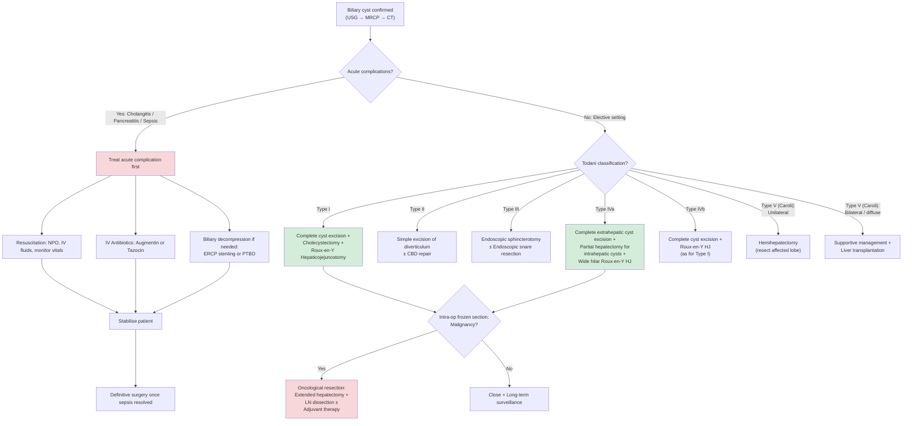
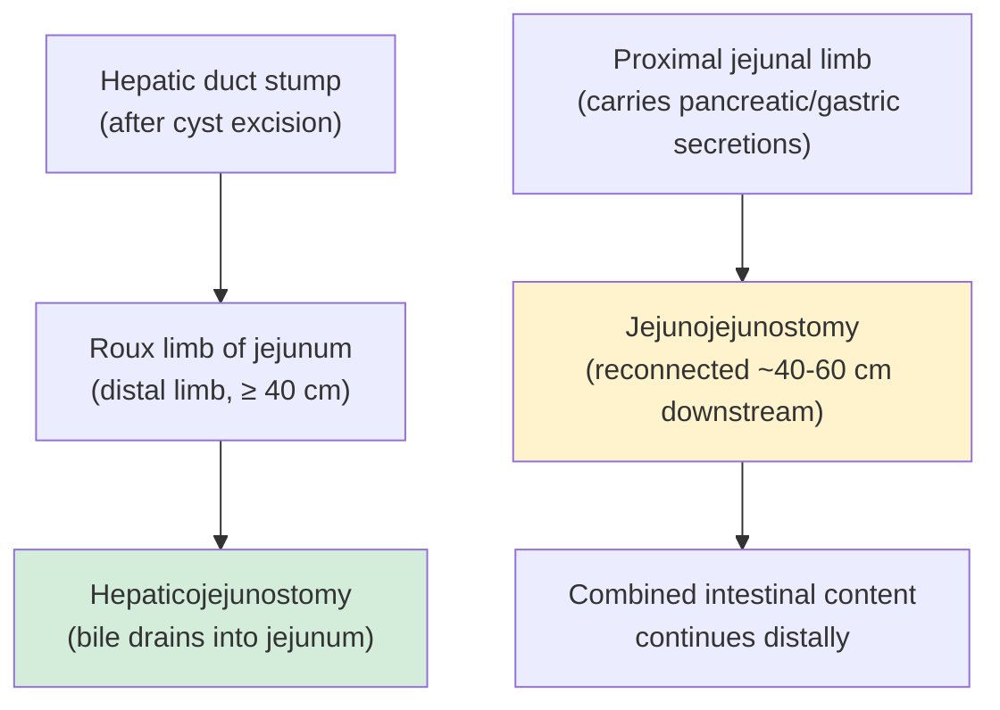

## Management of Biliary Cysts

### Guiding Principles — Why We Treat

Before diving into the specifics, understand the fundamental logic behind treating biliary cysts:

1. **Biliary cysts are pre-malignant.** The lifetime risk of cholangiocarcinoma is **10–30%** and increases with age. This is the single most compelling reason for definitive surgery [1].
2. **Conservative observation is NOT acceptable** for most types. Unlike simple hepatic cysts (which can be watched), biliary cysts have ongoing exposure to pancreatic juice reflux (via APBJ) that causes progressive epithelial damage and malignant transformation.
3. **Internal drainage procedures (cyst-enterostomy) are obsolete.** Older operations that simply drained the cyst into the bowel (without excising it) left the diseased epithelium in situ — the malignancy risk persisted or even increased. Modern management demands **complete excision** of the cyst [2].
4. **The gallbladder must also be removed.** Because APBJ affects the entire biliary epithelium including the gallbladder, and the gallbladder is in the surgical field. ***Prophylactic cholecystectomy is indicated in patients with APBJ but no biliary cysts because of the increased risk of gallbladder cancer*** [1].

<Callout title="The Core Principle">
***Radical excision of cyst + biliary tract reconstruction using a Roux-en-Y loop of jejunum (hepaticojejunostomy or choledochojejunostomy)*** [2]. The goals are threefold: ***prevent development of cholangiocarcinoma***, ***reduced risk of stricture***, ***reduced risk of recurrent cholangitis*** [2].
</Callout>

---

### Management Algorithm

---

### Treatment by Todani Type — Detailed Breakdown

#### Type I: Complete Surgical Excision + Roux-en-Y Hepaticojejunostomy

This is the **most common type** and the **paradigm** for biliary cyst surgery. Understanding this operation well means you understand all the others.

**What is done:**

***Type I = Complete surgical excision + Roux-en-Y hepaticojejunostomy*** [1]

1. **Complete excision of the cyst**: The entire dilated extrahepatic bile duct (cyst) is removed, from the hepatic duct confluence above down to the intrapancreatic CBD below. The cystic epithelium — which harbours the pre-malignant potential — is completely eliminated.
2. **Cholecystectomy**: The gallbladder is removed because (a) the cystic duct inserts into or near the cyst, and (b) APBJ exposes gallbladder epithelium to pancreatic juice → increased gallbladder cancer risk.
3. **Roux-en-Y Hepaticojejunostomy (HJ)**: A loop of jejunum is divided, the distal limb (the "Roux limb") is brought up to the hepatic duct stump and anastomosed end-to-side. The proximal limb is reconnected to the jejunum further downstream (jejunojejunostomy), creating the characteristic "Y" shape.

**Why Roux-en-Y?**

Let me break down the name:
- **Roux** = César Roux, Swiss surgeon who devised this technique.
- **en-Y** = "in [the shape of] Y" (French).
- **Hepatico-** = hepatic duct; **-jejunostomy** = surgical connection to jejunum.

The Roux-en-Y configuration is chosen over simpler options (like choledochoduodenostomy) because:

| Advantage | Explanation |
|---|---|
| **Prevents bile reflux** | The long Roux limb (typically ≥ 40 cm) creates a conduit long enough that duodenal content and food cannot reflux up to the biliary anastomosis. This prevents ascending cholangitis and further epithelial damage. |
| ***Reconstruction required to provide biliary drainage from the liver*** [1] | After the entire extrahepatic duct is excised, bile has nowhere to go. The Roux limb provides a new pathway for bile to reach the intestine. |
| **Reduced stricture risk** | The wide mouth of the hepaticojejunostomy is less prone to stricture than a direct duct-to-duodenum anastomosis [2]. |

**Why not just drain the cyst into the duodenum (internal drainage)?**

Historically, cyst-enterostomy (e.g., cystoduodenostomy or cystojejunostomy) was performed — creating a window between the cyst and bowel without removing the cyst. This is now **obsolete** because:

- The cyst epithelium remains in situ → ongoing malignancy risk (actually **increased** risk due to intestinal reflux into the cyst).
- Biliary stasis within the residual cyst → stone formation → recurrent cholangitis.
- Studies showed cholangiocarcinoma rates of up to **30%** in patients with undrained/internally drained cysts.

***Due to significant risk of malignancy and cyst excision can reduce complications such as recurrent cholangitis, cystolithiasis, choledocholithiasis and pancreatitis*** [1]

**Long-term complications of Roux-en-Y HJ:**

***Most frequent long-term complication of Roux-en-Y hepatojejunostomy is stenosis of biliary-enteric anastomosis leading to jaundice, cirrhosis or cholangitis*** [1]

This occurs because:
- Any surgical anastomosis heals by scar tissue formation.
- The biliary-enteric junction is particularly prone to cicatricial (scar) narrowing because: (a) small calibre of the hepatic duct; (b) bile is a relatively corrosive fluid; (c) ischaemia at the suture line.
- Stricture → bile stasis → recurrent cholangitis → secondary biliary cirrhosis.
- **Prevention**: Meticulous surgical technique with tension-free, well-vascularised, mucosa-to-mucosa anastomosis.

---

#### Type II: Simple Excision

***Type II = Simple excision of cysts*** [1]

- Type II cysts are **diverticula** — true outpouchings (side pockets) from the CBD wall.
- The diverticulum is excised and the defect in the CBD wall is closed primarily (sutured).
- ***Extensive resection reserved for cysts with complicated presentations including jaundice or malignancy in the cyst*** [1].
- Because these are rare (2–3% of biliary cysts), the malignancy risk is lower, and a simple excision is usually sufficient.

---

#### Type III: Endoscopic Management

***Type III = Endoscopic sphincterotomy*** [1]

This is the **exception** to the rule of surgical excision. Why?

- Type III = choledochocele = cystic dilatation of the **intraduodenal** (intramural) portion of the distal CBD.
- The cyst protrudes into the duodenal lumen.
- It has the **lowest malignancy risk** of all Todani types.
- Surgical excision would require duodenotomy and potentially damage the pancreatic duct, which shares the common ampulla.

**Procedure:**
- ***Endoscopic snare resection can be performed for Type IIIA cyst*** (cyst lined by biliary epithelium) [1].
- ***Surgical or endoscopic resection can be performed for Type IIIB cyst*** (cyst lined by duodenal epithelium) [1].
- Endoscopic sphincterotomy effectively "unroofs" the cyst, allowing free drainage of bile into the duodenum and decompressing the choledochocele.

<Callout title="Type III is the Only Type Managed Endoscopically" type="idea">
This is an exam favourite. All other types require surgical excision. Type III is the exception because: (1) low malignancy risk, (2) intraduodenal location amenable to endoscopic access, (3) surgery would risk pancreatic duct injury.
</Callout>

---

#### Type IV: Complete Excision ± Partial Hepatectomy + Roux-en-Y HJ

***Type IV = Complete surgical excision + Roux-en-Y hepatojejunostomy*** [1]

Type IV is subdivided into IVa (intra- + extrahepatic) and IVb (multiple extrahepatic only):

**Type IVa (more common, more complex):**
- ***Patients with intrahepatic cysts (Type IVA) require partial hepatectomy for excision of cyst and reconstruction with wide hilar Roux-en-Y hepatojejunostomy*** [1].
- The extrahepatic cyst is excised just as in Type I.
- For intrahepatic cysts: if confined to one lobe (usually left), a **formal hepatectomy** (left hepatectomy most commonly) is performed to excise the intrahepatic cystic disease entirely.
- If intrahepatic disease is bilateral but resectable, staged procedures or extensive hepatectomy with portal vein embolisation (to grow the future liver remnant) may be required.
- A **wide hilar anastomosis** is created to drain all remaining intrahepatic ducts into the Roux limb.

**Type IVb (multiple extrahepatic only):**
- Managed as for Type I — complete excision of all extrahepatic cysts + Roux-en-Y HJ.

---

#### Type V (Caroli Disease): Supportive ± Hepatectomy ± Liver Transplantation

***Type V = Supportive + Liver transplantation*** [1]

This is the most difficult type to manage because the cystic disease is **purely intrahepatic** and often diffuse:

**Unilateral disease (confined to one lobe):**
- ***Caroli disease can be treated with hemihepatectomy when it is confined to one side of the lobe*** [1].
- Left lobe involvement is more common → left hepatectomy.
- Curative if all diseased liver is removed.

**Bilateral / diffuse disease:**
- ***Treatment is largely supportive and is aimed at dealing with problems such as recurrent cholangitis and sepsis*** [1].
- Supportive measures include:
  - **Antibiotics** for episodes of cholangitis.
  - **Ursodeoxycholic acid** (UDCA) to improve bile flow and reduce stone formation.
  - **ERCP/PTBD** for stone clearance and drainage of infected segments.
- ***Patients with bilateral disease may eventually need a liver transplantation*** [1].
- Liver transplantation is the definitive cure for diffuse Caroli disease/syndrome, especially if complicated by:
  - Recurrent intractable cholangitis.
  - Secondary biliary cirrhosis with portal hypertension.
  - Associated congenital hepatic fibrosis (Caroli syndrome).
  - Suspicion of cholangiocarcinoma (if still within transplant criteria).

---

### Summary Table: Management by Todani Type

| Type | Surgery | Key Details |
|---|---|---|
| **I** | ***Complete excision + Cholecystectomy + Roux-en-Y HJ*** | Most common operation. Remove all cyst epithelium. |
| **II** | ***Simple diverticulum excision + CBD repair*** | Extensive resection if malignancy/complications |
| **III** | ***Endoscopic sphincterotomy ± snare resection*** | Only type managed endoscopically. Lowest malignancy risk. |
| **IVa** | ***Complete excision + Partial hepatectomy + Wide hilar Roux-en-Y HJ*** | Must address intrahepatic cysts with hepatectomy |
| **IVb** | ***Complete excision + Roux-en-Y HJ*** | As for Type I |
| **V unilateral** | ***Hemihepatectomy*** | Curative if confined to one lobe |
| **V bilateral** | ***Supportive + Liver transplantation*** | Definitive cure for diffuse disease |

---

### Management of Acute Complications (Before Definitive Surgery)

Definitive surgery should **never** be performed in the setting of active sepsis/cholangitis. The acute complication must be managed first.

#### Acute Cholangitis Complicating a Biliary Cyst

The approach follows the same **"RAD"** framework used for any acute cholangitis [16]:

***Management of cholangitis: Resuscitation → Antibiotics → Drainage*** [18][19]

| Step | Action | Details |
|---|---|---|
| **R — Resuscitation** | ***NPO, IV fluids, monitor vitals and I/O*** [16] | Septic patients need aggressive fluid resuscitation. Correct coagulopathy (IV Vitamin K). Correct electrolyte abnormalities. |
| **A — Antibiotics** | ***IV Augmentin (mild) or IV Tazocin (severe)*** [16] | Broad-spectrum coverage against Gram-negatives (E. coli, Klebsiella) + anaerobes. Adjust based on culture results. |
| **D — Drainage** | ***Biliary decompression*** | Urgent if Reynolds pentad (shock + confusion) or failure to respond to antibiotics within 24 hours [16]. |

**Biliary Drainage Options for Acute Cholangitis:**

| Modality | Indication | Mechanism |
|---|---|---|
| ***ERCP + biliary stenting (1st line)*** [19][20] | Standard first-line approach. ***Endoscopic retrograde cholangiopancreatography ± biliary stenting*** [20]. Role: biliary drainage and decompression, NOT definitive stone removal at this stage [16]. | Stent placed across the obstruction to allow bile to drain into the duodenum, decompressing the infected biliary tree. |
| ***PTBD*** [16][18] | ***Indicated when ERCP is unsuccessful, unavailable, or contraindicated*** [21]. | Percutaneous transhepatic approach to drain bile externally. Useful when ERCP cannot access proximal intrahepatic disease. |
| ***Surgical drainage (ECBD)*** [20] | ***Failure of endoscopic drainage or deterioration despite endoscopic drainage*** [20]. ***Open approach for emergency case*** [20]. | Exploration of common bile duct with T-tube placement for decompression. High mortality (~30%) in emergency setting — last resort [16]. |

***QMH practice: ERCP → PTBD → ECBD*** [3]

<Callout title="Relative Contraindications for ERCP" type="error">
***Altered GI anatomy e.g. Billroth II gastrectomy, Roux-en-Y*** [20] — the side-viewing duodenoscope cannot reach the ampulla if the anatomy has been surgically altered. In these patients, use PTBD or surgical drainage instead.
</Callout>

#### Acute Pancreatitis Complicating a Biliary Cyst

- Supportive management: NPO, IV fluids, analgesia, monitor for organ failure.
- ERCP only if there is concurrent cholangitis or persistent biliary obstruction.
- Definitive cyst excision deferred until pancreatitis resolves.

---

### Special Scenarios

#### APBJ Without Biliary Cyst

***Prophylactic cholecystectomy is indicated in patients with APBJ but no biliary cysts because of the increased risk of gallbladder cancer*** [1].

Why? Because APBJ allows pancreatic juice reflux into the gallbladder even when the bile duct itself is not cystically dilated. This chronic chemical insult to the gallbladder epithelium increases gallbladder cancer risk. Cholecystectomy removes the at-risk organ.

#### Malignancy Discovered Intra-operatively

- **Intra-operative frozen section** should be performed on the cyst wall and any suspicious areas during excision [5].
- If cholangiocarcinoma is confirmed:
  - The operation is converted to an **oncological resection**: extended hepatectomy, bile duct resection, portal lymph node dissection, and reconstruction with Roux-en-Y HJ.
  - Adjuvant chemotherapy may be considered post-operatively.

#### Incidentally Discovered Biliary Cyst (Asymptomatic)

- Even if asymptomatic, surgical excision is recommended for **all types except Type III** (which can be observed if small and asymptomatic).
- The malignancy risk is age-dependent and cumulative — waiting only increases the risk.
- The only exception is the patient who is unfit for surgery (advanced age, severe comorbidities), in whom the risks of surgery outweigh the benefits.

#### Biliary Cyst in Pregnancy

- Surgery is ideally deferred to the second trimester (if symptomatic) or post-partum.
- If cholangitis develops during pregnancy, drainage (ERCP or PTBD under radiation-minimised technique) and antibiotics should be instituted first.

---

### Roux-en-Y Hepaticojejunostomy — Understanding the Reconstruction

Since this is the reconstruction used in the majority of biliary cyst surgeries, let me detail it further:

**Key surgical points:**
- The **Roux limb** must be long enough (≥ 40 cm) to prevent reflux of enteric content to the biliary anastomosis.
- The anastomosis should be **tension-free** and **well-vascularised** (checking for pink, bleeding mucosa at the anastomotic edge).
- **Mucosa-to-mucosa** suturing technique is essential for optimal healing and patency.
- A **wide hilar anastomosis** is critical when reconstructing Type IVa cysts — all residual intrahepatic ducts must drain into the Roux limb.

---

### Post-operative Management and Long-term Surveillance

After definitive surgery, patients require lifelong surveillance because:

1. **Anastomotic stricture** — the most common long-term complication [1].
2. **Residual intrahepatic disease** — particularly in Type IVa where complete intrahepatic excision may not be possible.
3. **Cholangiocarcinoma risk persists** (albeit reduced) — malignancy can arise in any residual biliary epithelium, including the bile duct stump at the anastomosis.

| Surveillance Component | Frequency | Purpose |
|---|---|---|
| **LFT** | 6–12 monthly | Detect anastomotic stricture (rising ALP/GGT/bilirubin) |
| **CA 19-9** | 6–12 monthly | ***Serial assay after resection to aid in diagnosis of persistent or recurrent disease*** [15] |
| **USG abdomen** | Annually | Detect intrahepatic stone formation, abscess, recurrent dilatation |
| **MRCP** | As needed / every 2–3 years | Assess anastomotic patency, residual intrahepatic disease |
| **CT/MRI with contrast** | If suspicion of malignancy | Evaluate for cholangiocarcinoma |

---

### Contraindications and Considerations

| Scenario | Management Modification |
|---|---|
| **Active cholangitis/sepsis** | Treat sepsis first (RAD). Surgery deferred until patient stabilised. |
| **Confirmed cholangiocarcinoma within the cyst** | Oncological resection (not simple cyst excision). May require extended hepatectomy + LN dissection + adjuvant chemotherapy. |
| **Patient unfit for major surgery** (elderly, severe comorbidities) | For Type III: endoscopic management is sufficient. For others: ERCP/PTBD for drainage + surveillance if surgery risk is prohibitive. Consider palliative stenting. |
| **Roux-en-Y reconstruction not feasible** (hostile abdomen, prior extensive surgery) | Alternatives: choledochoduodenostomy (higher reflux risk — less preferred) or hepaticoduodenostomy. Roux-en-Y remains the gold standard when technically possible. |
| **Bilateral diffuse Caroli disease** | Liver transplantation is the only curative option. Surgery alone cannot excise all disease. |

---

### Paediatric-Specific Management

***Complete excision of cyst and GB; Reconstruction with Roux-en-Y hepaticojejunostomy*** [6]

- In neonates, the key differential is biliary atresia. Once choledochal cyst is confirmed (operative cholangiogram), proceed to excision + reconstruction.
- Surgery can be performed safely in infants. Minimally invasive (laparoscopic or robotic) approaches are increasingly used in paediatric centres.
- Post-operative: long-term follow-up for anastomotic stricture and growth/nutritional monitoring.

---

<Callout title="High Yield Summary — Management of Biliary Cysts">

1. **All biliary cysts (except Type III) require surgical excision** — to prevent cholangiocarcinoma, recurrent cholangitis, and stone formation.
2. **Type I and IVb**: Complete cyst excision + cholecystectomy + Roux-en-Y hepaticojejunostomy.
3. **Type II**: Simple excision of diverticulum.
4. **Type III**: Endoscopic sphincterotomy ± snare resection (only type managed endoscopically; lowest malignancy risk).
5. **Type IVa**: Complete excision + partial hepatectomy (for intrahepatic cysts) + wide hilar Roux-en-Y HJ.
6. **Type V unilateral**: Hemihepatectomy. **Bilateral**: Supportive + liver transplantation.
7. **APBJ without cyst**: Prophylactic cholecystectomy (increased gallbladder cancer risk).
8. **Internal drainage (cyst-enterostomy) is obsolete** — leaves pre-malignant epithelium in situ.
9. **Most common long-term complication**: Anastomotic stricture of the biliary-enteric anastomosis.
10. **Acute cholangitis**: Treat first with RAD (Resuscitation, Antibiotics, Drainage) before definitive surgery.

</Callout>

---

<ActiveRecallQuiz
  title="Active Recall - Management of Biliary Cysts"
  items={[
    {
      question: "Describe the definitive surgical management of a Type I biliary cyst. Why is internal drainage (cyst-enterostomy) no longer performed?",
      markscheme: "Complete surgical excision of the entire extrahepatic cyst + cholecystectomy + Roux-en-Y hepaticojejunostomy. Internal drainage (cyst-enterostomy) is obsolete because it leaves the pre-malignant cyst epithelium in situ, maintaining or increasing cholangiocarcinoma risk (up to 30%). Excision removes the at-risk epithelium. Roux-en-Y reconstruction provides biliary drainage, prevents bile reflux (long Roux limb ≥ 40 cm), reduces stricture risk, and reduces recurrent cholangitis.",
    },
    {
      question: "Which Todani type is managed endoscopically rather than surgically, and why?",
      markscheme: "Type III (choledochocele). Managed with endoscopic sphincterotomy with or without snare resection. Reasons: (1) lowest malignancy risk of all types; (2) located in the intraduodenal segment, accessible endoscopically; (3) surgical excision would risk injury to the pancreatic duct sharing the ampulla. Type IIIA can be snare-resected, Type IIIB can be managed endoscopically or surgically.",
    },
    {
      question: "A patient with a Type IVa biliary cyst has intrahepatic cysts confined to the left lobe with extrahepatic cyst involvement. What operation would you perform?",
      markscheme: "Complete excision of the extrahepatic cyst + left hepatectomy (to excise the intrahepatic cysts) + cholecystectomy + wide hilar Roux-en-Y hepaticojejunostomy. The wide hilar anastomosis ensures all residual right intrahepatic ducts drain into the Roux limb. Intra-operative frozen section should be sent to rule out malignancy.",
    },
    {
      question: "What is the most common long-term complication following Roux-en-Y hepaticojejunostomy for biliary cyst excision, and what clinical features would suggest it?",
      markscheme: "Anastomotic stricture of the biliary-enteric anastomosis. Leads to jaundice (rising bilirubin), cholestatic LFTs (rising ALP/GGT), recurrent cholangitis (fever, RUQ pain), and eventually secondary biliary cirrhosis if untreated. Caused by scar tissue formation at the anastomotic site. Detected by rising LFTs, USG showing proximal duct dilatation, confirmed by MRCP.",
    },
    {
      question: "A patient with bilateral diffuse Caroli disease presents with recurrent cholangitis refractory to antibiotic and endoscopic treatment. What is the definitive management?",
      markscheme: "Liver transplantation. Rationale: bilateral diffuse disease cannot be excised by hepatectomy alone because insufficient liver remnant would remain. Supportive management (antibiotics, ERCP/PTBD for stone clearance, ursodeoxycholic acid) is used as a bridge. Liver transplantation cures the biliary disease and any associated congenital hepatic fibrosis. Hemihepatectomy is only appropriate for unilateral Caroli disease.",
    },
    {
      question: "Why is prophylactic cholecystectomy indicated in patients with APBJ but no biliary cyst?",
      markscheme: "APBJ creates a long common channel outside the Sphincter of Oddi control, allowing pancreatic juice to reflux into the entire biliary tree including the gallbladder. Chronic exposure of gallbladder epithelium to activated pancreatic enzymes causes inflammation, metaplasia, dysplasia, and increased risk of gallbladder cancer. Removing the gallbladder eliminates the at-risk organ. This is recommended even in the absence of overt cystic dilatation.",
    },
  ]}
/>

## References

[1] Senior notes: felixlai.md (Biliary cysts — Treatment section)
[2] Senior notes: maxim.md (Choledochal cyst — Management section)
[3] Senior notes: felixlai.md (Acute cholangitis — Treatment section: QMH practice)
[4] Senior notes: maxim.md (Recurrent pyogenic cholangitis section)
[5] Senior notes: maxim.md (Gallbladder carcinoma — Treatment section; Cholangiocarcinoma — Management section)
[6] Senior notes: maxim.md (Hepatobiliary conditions — paediatric table: choledochal cyst)
[15] Senior notes: felixlai.md (Malignant biliary obstruction — Tumour markers section)
[16] Senior notes: maxim.md (Acute cholangitis — Acute management RAD section)
[18] Lecture slides: Malignant biliary obstruction.pdf (p15, p17)
[19] Lecture slides: GC 200. RUQ pain, jaundice and fever Cholecytitis and cholangitis Imaging of GI system.pdf (p14)
[20] Lecture slides: GC 200. RUQ pain, jaundice and fever Cholecytitis and cholangitis Imaging of GI system.pdf (p15)
[21] Senior notes: felixlai.md (Percutaneous transhepatic biliary drainage section)
