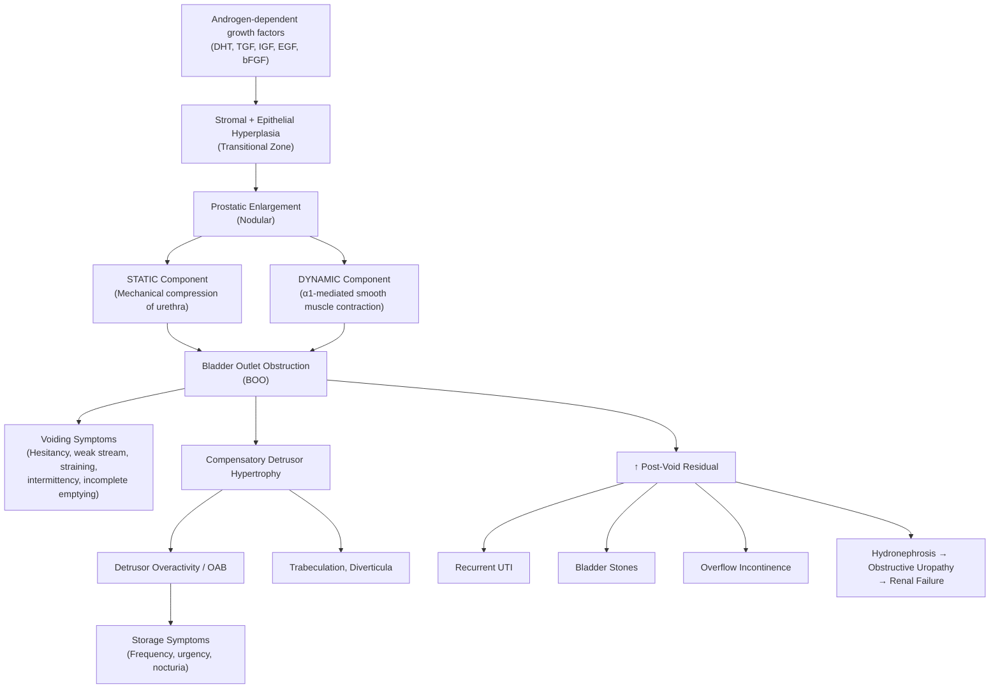

# Benign Prostatic Hyperplasia (BPH)

---

## 1. Definition

**_Benign Prostatic Hyperplasia (BPH)_** is defined as the **benign (non-malignant) proliferation of both glandular epithelial and stromal tissues** within the **transitional zone** of the prostate gland, resulting in progressive nodular enlargement of the prostate [1][2][3].

Let's break the name down:

- **Benign** = non-cancerous (i.e., cells proliferate but do not invade or metastasize)
- **Prostatic** = relating to the prostate gland
- **Hyperplasia** = ↑ number of cells (as opposed to _hypertrophy_, which means ↑ cell size)

This is an important distinction: BPH is a **hyperplastic** process — there are genuinely _more cells_, not just bigger cells. The enlarged prostate mechanically compresses the prostatic urethra, producing **lower urinary tract symptoms (LUTS)**. However — and this is a critical clinical pearl — **_not all LUTS is due to BPH, and ≥1/3 of men with LUTS do NOT have bladder outlet obstruction (BOO)_** [4].

<Callout title="Key Concept" type="error">
  BPH ≠ LUTS ≠ BOO. These are three overlapping but distinct entities. A man can
  have histological BPH without symptoms, LUTS without BPH (e.g., overactive
  bladder), or BOO without BPH (e.g., urethral stricture). Always think beyond
  BPH when evaluating LUTS.
</Callout>

---

## 2. Epidemiology

### 2.1 Prevalence and Incidence

- **_Histological BPH begins at ~age 30_** and increases with age [3]:
  - **8% at 31–40 years**
  - **40–50% at 51–60 years**
  - **_>80% at >80 years_** [3]
- However, **only ~10% of men with histological BPH present with clinical symptoms** [3]. This makes sense: the prostate can enlarge without necessarily compressing the urethra enough to cause symptoms.
- **_~50% of patients at age 50 have LUTS related to BPH_** [2][5].
- **_Typical symptomatic age: 50–80 years_** — the prostate starts increasing in size at ~age 40 and becomes symptomatic around 50 [5].

### 2.2 In Hong Kong

- BPH is the most common cause of LUTS in older men in Hong Kong.
- With an ageing population, the burden of BPH and its complications (AROU, urinary retention, obstructive uropathy) continues to rise.
- **_AROU (acute retention of urine) is the most common urological emergency_**, with **BPH accounting for ~53% of male AROU** cases [4].
- AROU incidence in males: **7/1,000 men per year**; 10% in men in their 70s and ~30% in men in their 80s over a 5-year period [4].

---

## 3. Risk Factors

**_The etiology and risk factors for BPH include_** [1]:

| Risk Factor                                                            | Explanation                                                                                                                                                                                                                                                  |
| ---------------------------------------------------------------------- | ------------------------------------------------------------------------------------------------------------------------------------------------------------------------------------------------------------------------------------------------------------ |
| **_1. Age_**                                                           | The single most important risk factor. Histological BPH is virtually universal in very old men. Prostate growth is a continuous process from ~30 years onward. Androgen exposure over decades drives cumulative hyperplasia [1][3].                          |
| **_2. Race_**                                                          | Higher prevalence in Black men (larger prostate volumes, earlier symptom onset) compared to Asian men. However, with westernised diets and ageing populations, prevalence in Asia is converging [1].                                                         |
| **_3. Diet_**                                                          | Western diets (high fat, high red meat) are associated with ↑ BPH risk. The mechanism is likely related to obesity and metabolic syndrome effects on hormonal milieu [1].                                                                                    |
| **_4. Metabolic syndrome_**                                            | HTN, dyslipidaemia, obesity, insulin resistance, and type 2 DM are all associated with ↑ BPH severity. Hyperinsulinaemia may stimulate prostatic growth factors. Sympathetic overactivity in metabolic syndrome also ↑ dynamic component of obstruction [1]. |
| **_5. Genetics (role unclear)_**                                       | Familial clustering is observed. Men with a first-degree relative with BPH requiring surgery before age 60 have a 4× risk. The exact genetic loci remain unclear [1].                                                                                        |
| **_6. Growth factors (basic fibroblastic GF, insulin-like GF, etc.)_** | These are androgen-dependent growth factors that mediate the stromal–epithelial interaction driving hyperplasia (detailed below) [1].                                                                                                                        |
| **_Androgens (DHT)_**                                                  | Absolutely essential. Castrated men and those with 5α-reductase deficiency do NOT develop BPH — proving the androgen-dependent nature of the disease [3].                                                                                                    |

<Callout title="High Yield – Risk Factors from Lecture">
  ***Risk factors for BPH per the lecture: Age, Race, Diet, Metabolic syndrome,
  Genetics (role unclear), Growth factors (bFGF, IGF, etc.)*** [1]. The Olmsted
  County Study showed that ***rates of AROU increase with increasing age,
  increasing prostate size, increasing BPH symptoms, and decreasing maximal
  urine flow rate*** [6].
</Callout>

---

## 4. Anatomy and Function of the Prostate

### 4.1 Basic Anatomy

The prostate is a **walnut-sized exocrine gland** (~20g in a young adult) located **inferior to the bladder base**, **anterior to the rectum**, and **surrounding the proximal (prostatic) urethra**. It sits within the **true pelvis**, anchored by the **puboprostatic ligaments**.

The **prostatic urethra** runs through the centre of the gland — this is why prostatic enlargement causes urinary obstruction (the urethra is literally being squeezed).

**Key anatomical relations:**

- **Superior:** bladder neck
- **Inferior:** urogenital diaphragm (external urethral sphincter)
- **Posterior:** rectum (this is why we can palpate the prostate on DRE)
- **Lateral:** levator ani muscles
- **Anterior:** symphysis pubis, Santorini venous plexus

### 4.2 Zonal Anatomy (McNeal Classification)

This is **extremely high-yield** because different diseases affect different zones:

| Zone                                                | % of Glandular Tissue | Key Relations                              | Clinical Significance                                                                        |
| --------------------------------------------------- | --------------------- | ------------------------------------------ | -------------------------------------------------------------------------------------------- |
| **_Anterior zone (Anterior fibromuscular stroma)_** | Non-glandular         | Covers anterior surface                    | **_Fibromuscular, not glandular_** — no BPH or cancer here [2]                               |
| **_Central zone_**                                  | ~25%                  | **_Surrounds ejaculatory ducts_**          | Rarely affected by cancer (< 8%) [2]                                                         |
| **_Transitional zone_**                             | ~5–10% (young)        | Surrounds proximal prostatic urethra       | **_Common site of BPH (median lobe)_** — this zone undergoes massive expansion in BPH [2]    |
| **_Periurethral zone_**                             | Small glands          | **_Surrounds prostatic urethra_** directly | Also involved in early BPH nodule formation [2]                                              |
| **_Peripheral zone_**                               | ~70%                  | Posterolateral aspect                      | **_Common site of prostate cancer and inflammation (posterior lobe)_** — palpable on DRE [2] |

<Callout title="Why BPH is Symptomatic but Prostate Cancer Often Isn't (Early On)">
***BPH arises in the transitional zone*** — right around the urethra. So even moderate enlargement compresses the urethra and causes voiding symptoms early.

**_Prostate cancer arises in the peripheral zone_** — far from the urethra. It can grow silently for years before it's large enough to compress the urethra or invade surrounding structures. This is why **_prostate cancer usually presents late with symptoms since it is located at the posterior aspect_** [2].

</Callout>

### 4.3 Function of the Prostate

- Produces **prostatic fluid** (~30% of seminal volume), which contains:
  - **Prostate-specific antigen (PSA):** a serine protease that liquefies the seminal coagulum post-ejaculation
  - **Citric acid, zinc, fibrinolysin, and prostatic acid phosphatase**
- Prostate growth and function depend on **androgens**, specifically **_dihydrotestosterone (DHT)_**, which is converted from testosterone by the enzyme **_5α-reductase_** within the prostate [2][3].

### 4.4 Hormonal Regulation

```
Testes → Testosterone → (5α-reductase in prostate) → DHT
                                                        ↓
                                           Binds androgen receptors
                                           on epithelial + stromal cells
                                                        ↓
                                           Stimulates cell proliferation
                                           and inhibits apoptosis
```

- Both **prostatic epithelial cells** and **stromal cells** express **androgen receptors** and depend on DHT for growth [2].
- Two isoforms of 5α-reductase exist:
  - **Type 1:** found in skin, liver (minor role in prostate)
  - **Type 2:** predominant in prostate — this is the therapeutic target of **5α-reductase inhibitors (5ARIs)** like finasteride (type 2 selective) and dutasteride (dual type 1+2)

---

## 5. Etiology and Pathophysiology

### 5.1 Etiology

The precise etiology is **_incompletely understood_** but is generally considered **_androgen-dependent_** [3][5]. Key etiological concepts:

1. **_Increased proliferation: reawakening of embryonic processes in prostatic stroma which induces epithelial cell proliferation_** [1] — during embryological development, the urogenital sinus mesenchyme instructs prostatic budding. In BPH, a similar stromal–epithelial interaction is "switched back on" in adulthood, driving glandular growth.

2. **_Decreased apoptosis_** [1] — it's not just that more cells are being born; fewer cells are dying. The net result is tissue accumulation.

3. **_Mediated by androgen-dependent growth factors_** [1]:
   - **_TGF (transforming growth factor)_**
   - **_IGF (insulin-like growth factor)_**
   - **_EGF (epidermal growth factor)_**
   - **_bFGF (basic fibroblastic growth factor)_**

4. **_Initial micronodule formation in the transitional zone and periurethral region, later fusing to become macronodules_** [1] — this explains the progressive, nodular enlargement pattern seen histologically and on imaging.

### 5.2 Pathophysiology — The Three-Component Model

The pathophysiology of symptomatic BPH can be elegantly understood through **three components** [3][5]:

#### Component 1: Bladder Outlet Obstruction (BOO)

BOO from BPH has **_two sub-components_**:

| Component               | Mechanism                                                                                                                           | Therapeutic Target                                                                                                   |
| ----------------------- | ----------------------------------------------------------------------------------------------------------------------------------- | -------------------------------------------------------------------------------------------------------------------- |
| **_Static component_**  | **_Stromal hyperplasia mediated by DHT via 5α-reductase_** → mechanical compression of urethra by enlarged prostate tissue [5]      | **_5α-reductase inhibitors (5ARIs)_** — reduce DHT → shrink prostate volume by ~20-30% over 6-12 months              |
| **_Dynamic component_** | **_Smooth muscle hypertrophy and contraction mediated by α1-adrenergic receptors_** → functional narrowing of prostatic urethra [5] | **_α1-adrenergic blockers_** — relax smooth muscle → ↓ functional obstruction → rapid symptom relief (days to weeks) |

**Why are there two components?** The prostate stroma contains a large proportion of **smooth muscle cells** with abundant **α1-adrenergic receptors** (especially the α1A subtype). Sympathetic nervous system activation (e.g., during stress, cold, or with sympathomimetic drugs) causes contraction of this smooth muscle, worsening obstruction _dynamically_ on top of the fixed _static_ mechanical compression. This is why men with BPH notice worse symptoms when they're stressed, cold, or taking decongestants (which are α-agonists).

#### Component 2: Detrusor Response and Overactive Bladder (OAB)

- Chronic BOO leads to **compensatory detrusor hypertrophy** (the bladder muscle works harder to push urine past the obstruction).
- This hypertrophy causes:
  - **_Detrusor instability / overactive bladder_** — explaining the **storage (irritative) symptoms** (frequency, urgency, nocturia) seen in BPH [5]
  - **Trabeculated bladder** — visible thickening of bladder wall with interlacing muscle bundles
  - **Bladder diverticula** — mucosa herniates between hypertrophied muscle bundles (these are "false" or "pulsion" diverticula)
- **_Up to 30–60% of BOO patients develop secondary detrusor overactivity_** — postulated to be due to ↑intravesical pressure → tissue ischaemia → smooth muscle injury and cholinergic denervation supersensitivity [4]

#### Component 3: Complications of Chronic Obstruction

Chronic urinary stasis (↑ post-void residual volume) leads to:

- **Recurrent UTI** (stagnant urine is an excellent culture medium)
- **Bladder stones** (urinary stasis → crystallisation)
- **Overflow incontinence** (bladder so full it "overflows")
- **Upper tract dilatation (hydronephrosis)** → **obstructive uropathy** → **renal impairment**

### 5.3 Pathophysiology Flow Diagram



---

## 6. Classification

### 6.1 Histological vs Clinical BPH

| Aspect             | Histological BPH                    | Clinical BPH                                     |
| ------------------ | ----------------------------------- | ------------------------------------------------ |
| Definition         | Microscopic evidence of hyperplasia | Symptomatic LUTS attributable to BPH             |
| Prevalence         | Very high (>80% men >80y)           | Much lower (~10% of those with histological BPH) |
| Clinical relevance | None unless symptomatic             | Drives management decisions                      |

### 6.2 Classification by Symptom Severity (IPSS)

The **_International Prostate Symptom Score (IPSS)_** is used to **quantify the severity of LUTS** [4][5]:

- Involves **7 questions** covering:
  - **_Voiding symptoms:_** incomplete emptying, intermittency, weak stream, straining
  - **_Storage symptoms:_** frequency, urgency, nocturia
- Each question scored 0–5 (total 0–35)
- Plus a **quality of life (QoL) question** scored 0–6

| IPSS Score  | Severity       |
| ----------- | -------------- |
| **_1–7_**   | **_Mild_**     |
| **_8–19_**  | **_Moderate_** |
| **_20–35_** | **_Severe_**   |

<Callout title="IPSS Is NOT Diagnostic" type="error">
  ***IPSS is used to quantify severity of LUTS, predict treatment response,
  guide treatment decisions, and monitor response to treatment — it is NOT a
  diagnostic tool*** [4]. A high IPSS does not mean the patient has BPH; it
  means they have significant LUTS. The cause still needs to be determined.
</Callout>

### 6.3 LUTS Classification by Phase

**_Traditional LUTS classification: "FUN" + "DISH"_** [5]:

| Phase               | Type              | Mnemonic                                                      | Symptoms                                                                                                                                                                | Pathophysiological Basis                                                                                                              |
| ------------------- | ----------------- | ------------------------------------------------------------- | ----------------------------------------------------------------------------------------------------------------------------------------------------------------------- | ------------------------------------------------------------------------------------------------------------------------------------- |
| **_Storage phase_** | **_Irritative_**  | **F**requency, **U**rgency, **N**octuria                      | **_Frequency_** (尿频), **_Urgency_** (尿急) ± urge incontinence, **_Nocturia_** (夜尿)                                                                                 | Detrusor overactivity (secondary to BOO), local pathology (stone, UTI, tumour), systemic causes (↑ fluid intake, polyuria from DM/DI) |
| **_Voiding phase_** | **_Obstructive_** | **D**ribbling, **I**ntermittent, **S**training, **H**esitancy | **_Dribbling_** (尿末滴漏), **_Intermittent stream_** (尿流斷續), **_Incomplete emptying_** (尿意未盡), **_Straining_** (谷), **_Hesitancy_** (等尿), **_Weak stream_** | BOO from BPH (static + dynamic), urethral stricture, CA prostate; or bladder hypocontractility (nerve or detrusor muscle problem)     |

- **_BPH typically presents with both obstructive and irritative symptoms, with obstructive symptoms predominating_** [5]
- **_Bladder outlet obstruction typically presents with predominantly voiding symptoms_** [2]
- **_Overactive bladder typically presents with predominantly storage symptoms_** [2]

### 6.4 Retention of Urine Classification

| Type                                    | Onset        | Pain                   | Mechanism                                                                           | Typical Cause                                          |
| --------------------------------------- | ------------ | ---------------------- | ----------------------------------------------------------------------------------- | ------------------------------------------------------ |
| **_Acute retention of urine (AROU)_**   | **_Sudden_** | **_Painful_**          | **_Normal innervation_** — bladder tries to contract but can't overcome obstruction | **_BPH_**, drugs, constipation [4]                     |
| **_Chronic retention of urine (CROU)_** | Gradual      | **_Usually painless_** | **_Abnormal innervation_** — detrusor hypocontractility, loss of sensation          | **_DM_** (diabetic cystopathy), neurogenic bladder [4] |

---

## 7. Clinical Features

### 7.1 Symptoms

#### A. Lower Urinary Tract Symptoms (LUTS)

**_BPH presents with LUTS: both obstructive and irritative symptoms, with obstructive >> irritative_** [5].

**Voiding (Obstructive) Symptoms — "DISH + Weak Stream":**

| Symptom                              | Description                                 | Pathophysiological Basis                                                                                                                                                        |
| ------------------------------------ | ------------------------------------------- | ------------------------------------------------------------------------------------------------------------------------------------------------------------------------------- |
| **_Hesitancy_** (等尿)               | Delay in initiation of urinary stream       | Detrusor must generate ↑ pressure to overcome obstruction; takes longer to build up sufficient pressure to open the compressed urethra                                          |
| **_Weak stream_**                    | Reduced force and calibre of urinary stream | BOO (static + dynamic) → ↑ urethral resistance → reduced flow rate for any given detrusor pressure                                                                              |
| **_Straining_** (谷)                 | Need to use abdominal muscles to void       | **_Higher bladder pressure is needed_** to overcome obstruction; patient recruits Valsalva manoeuvre to augment intravesical pressure [5]                                       |
| **_Intermittency_** (尿流斷續)       | Stream starts and stops                     | Detrusor fatigue during prolonged voiding against high resistance; detrusor contracts in waves rather than sustained contraction. Also associated with **_residual urine_** [5] |
| **_Terminal dribbling_** (尿末滴漏)  | Dribbling at end of micturition             | **_Weakened pelvic floor_** + residual urine in prostatic urethra that drains by gravity after detrusor relaxes [5]                                                             |
| **_Incomplete emptying_** (尿意未盡) | Sensation of residual urine after voiding   | Genuinely elevated post-void residual (PVR) due to inability of detrusor to completely empty bladder against obstruction                                                        |

**Storage (Irritative) Symptoms — "FUN":**

| Symptom                 | Description                                                  | Pathophysiological Basis                                                                                                                                                                |
| ----------------------- | ------------------------------------------------------------ | --------------------------------------------------------------------------------------------------------------------------------------------------------------------------------------- |
| **_Frequency_** (尿频)  | Voiding >8 times/day                                         | Incomplete emptying → ↓ functional bladder capacity; secondary detrusor overactivity from BOO; local irritation from UTI/stone                                                          |
| **_Urgency_** (尿急)    | Sudden, compelling desire to void that is difficult to defer | **_Detrusor overactivity_** — uninhibited detrusor contractions secondary to BOO-induced bladder wall remodelling (ischaemia → denervation supersensitivity) [4]                        |
| **_Nocturia_** (夜尿)   | Waking ≥1 time at night to void                              | Multifactorial: ↓ functional bladder capacity, detrusor overactivity, ↑ nocturnal urine production (loss of circadian ADH rhythm in elderly), nocturnal polyuria from CHF/renal disease |
| **_Urge incontinence_** | Involuntary leakage associated with urgency                  | Severe detrusor overactivity overwhelming sphincter resistance                                                                                                                          |

#### B. Complications-Related Symptoms

| Symptom                                                                       | Pathophysiological Basis                                                                                                                                                                                                |
| ----------------------------------------------------------------------------- | ----------------------------------------------------------------------------------------------------------------------------------------------------------------------------------------------------------------------- |
| **_Gross haematuria_**                                                        | **_Ruptured dilated bladder neck veins_** — chronic BOO causes congestion and dilatation of submucosal veins at the bladder neck and prostatic urethra. These fragile veins rupture, causing painless haematuria [4][5] |
| **_Fever, dysuria_**                                                          | **_Recurrent UTI_** — urinary stasis (↑ PVR) provides a static pool for bacterial colonisation and growth [5]                                                                                                           |
| **_Strangury_** (painful, frequent urination of small volumes with straining) | **_Bladder/urethral stones_** — urinary stasis → crystal nucleation and growth → stones irritate bladder mucosa [4]                                                                                                     |
| **_Uraemic symptoms_** (nausea, fatigue, anorexia, pruritus)                  | **_Obstructive uropathy_** → bilateral hydronephrosis → ↓ GFR → accumulation of uraemic toxins                                                                                                                          |
| **_Overflow incontinence_**                                                   | **_Chronic retention_** — bladder is so distended that intravesical pressure exceeds urethral resistance; urine "overflows" in small amounts, often without sensation                                                   |
| **_Sudden, painful inability to void_**                                       | **_AROU_** — acute-on-chronic obstruction, often precipitated by a trigger (see below)                                                                                                                                  |

#### C. Precipitating Factors for AROU in BPH

**_Common precipitating factors_** [4]:

| Factor                                                                      | Mechanism                                                                                                                                                                                                                                         |
| --------------------------------------------------------------------------- | ------------------------------------------------------------------------------------------------------------------------------------------------------------------------------------------------------------------------------------------------- |
| **Constipation**                                                            | Rectal distension directly compresses the prostatic urethra (**_usually NOT a standalone aetiology but rather a precipitating factor with background prostatic enlargement_** [4])                                                                |
| **UTI**                                                                     | Pain → reflex urethral sphincter spasm → ↑ outflow resistance                                                                                                                                                                                     |
| **Anaesthesia or analgesia** (especially opioids, anticholinergics)         | ↓ detrusor contractility (anticholinergic effect); opioids also ↑ sphincter tone                                                                                                                                                                  |
| **Immobility**                                                              | **_Poor voiding when supine_** — gravitational assistance for voiding is lost [4]                                                                                                                                                                 |
| **Painful perianal conditions** (thrombosed haemorrhoids, perianal abscess) | Reflex inhibition of micturition from perineal pain                                                                                                                                                                                               |
| **Excessive fluid intake** (especially **_alcohol_**)                       | Alcohol: diuresis (ADH suppression) + sedation + smooth muscle relaxation of detrusor; combined rapid bladder filling with impaired detrusor contraction                                                                                          |
| **_Drugs_**                                                                 | **Sympathomimetics** (e.g., pseudoephedrine in cold remedies): ↑ α1-stimulation → ↑ dynamic obstruction. **Anticholinergics**: ↓ detrusor contraction. **Diuretics**: rapid bladder filling. **Calcium channel blockers**: ↓ detrusor contraction |

<Callout title="Drug-Precipitated AROU" type="idea">
  Always ask about **over-the-counter cold medications** in a man presenting
  with AROU. Pseudoephedrine (a sympathomimetic α-agonist found in many
  decongestants) directly worsens the dynamic component of BOO. Similarly,
  first-generation antihistamines (e.g., chlorpheniramine) have strong
  anticholinergic effects that impair detrusor contraction.
</Callout>

### 7.2 Signs

#### A. General Examination

| Sign                                            | Significance                                                                                                                                  |
| ----------------------------------------------- | --------------------------------------------------------------------------------------------------------------------------------------------- |
| **General condition / neurological assessment** | Rule out neurological causes of LUTS (e.g., PD, stroke, MS, spinal cord disease — these can cause detrusor overactivity or underactivity) [4] |
| **Signs of chronic kidney disease**             | Pallor, uraemic frost (rare), fluid overload — suggesting obstructive uropathy from chronic BPH                                               |

#### B. Abdominal Examination

| Sign                                                           | Significance                                                                                                                                                                                     |
| -------------------------------------------------------------- | ------------------------------------------------------------------------------------------------------------------------------------------------------------------------------------------------ |
| **_Distended bladder_** (palpable/percussible suprapubic mass) | Suggests urinary retention (acute or chronic). In AROU, the bladder is **tender**; in CROU, it is often **non-tender** because the sensory stretch fibres have been chronically desensitised [4] |
| **Loin tenderness / ballotable kidneys**                       | May suggest hydronephrosis from chronic obstruction                                                                                                                                              |

#### C. Genital Examination

| Sign                   | Significance                                                                   |
| ---------------------- | ------------------------------------------------------------------------------ |
| **_Phimosis_**         | Tight foreskin can itself cause BOO — must be checked as a co-contributor [5]  |
| **Meatal stenosis**    | Another potential cause of BOO                                                 |
| **Urethral discharge** | Suggests urethritis → consider urethral stricture as alternative cause of LUTS |

#### D. Digital Rectal Examination (DRE)

This is **the most important physical examination** in a man with LUTS. DRE assesses:

| DRE Finding in BPH                                   | Significance                                                                                                                              |
| ---------------------------------------------------- | ----------------------------------------------------------------------------------------------------------------------------------------- |
| **_Smooth, enlarged prostate (>3 finger breadths)_** | Consistent with BPH; normal prostate is ~2 FB [5]                                                                                         |
| **_Non-tender_**                                     | BPH is typically non-tender. Tenderness suggests prostatitis                                                                              |
| **_Median sulcus present_**                          | The median sulcus (groove between left and right lobes) is preserved in BPH but may be obliterated in advanced BPH or prostate cancer [5] |
| **_Rubbery / firm-elastic consistency_**             | Consistent with benign tissue. Hard/nodular/irregular consistency raises concern for **_prostate cancer_**                                |
| **_Anal tone intact_**                               | Important to assess — reduced anal tone suggests neurological cause (e.g., cauda equina syndrome, which can cause urinary retention) [5]  |
| **Rectal pathology**                                 | Assess for rectal masses, loaded rectum (constipation as precipitant)                                                                     |

<Callout title="DRE Pearls" type="idea">
  - DRE **underestimates** prostate size — it only palpates the posterior
  surface (peripheral zone). A prostate that feels "normal" on DRE can still
  have significant transitional zone enlargement causing obstruction. - A
  **hard, irregular, nodular** prostate with **loss of median sulcus** should
  raise alarm for ***prostate cancer*** → check PSA, consider biopsy. - Always
  document anal tone — a lax anal sphincter in a patient with urinary retention
  is a **red flag for cauda equina syndrome** (surgical emergency!).
</Callout>

#### E. Summary of Clinical Presentation by Level of Complication

**_Complications of BPH can be understood by level_** [5]:

| Level                   | Complication                                         | Mechanism                                                          |
| ----------------------- | ---------------------------------------------------- | ------------------------------------------------------------------ |
| **_Prostate level_**    | **_Bleeding (ruptured dilated bladder neck veins)_** | Chronic congestion → venous dilatation → rupture                   |
| **_Bladder level_**     | **_AROU_**                                           | Acute-on-chronic obstruction, often precipitated                   |
|                         | **_Recurrent UTI_**                                  | Urinary stasis (↑ PVR) → bacterial growth                          |
|                         | **_Bladder stone_**                                  | Urinary stasis → crystal nucleation                                |
|                         | Diverticulum                                         | Mucosal herniation through hypertrophied detrusor                  |
|                         | **_Chronic retention ± overflow incontinence_**      | Progressive detrusor failure against chronic obstruction           |
| **_Upper tract level_** | **_Recurrent hydronephrosis_**                       | Back-pressure from chronically full bladder → ureteral obstruction |
|                         | Obstructive uropathy                                 | Bilateral hydronephrosis → parenchymal damage                      |
|                         | **_Renal failure_**                                  | End-stage consequence of bilateral obstructive uropathy            |

---

## 8. Approach to Evaluation — History and Physical Examination

### 8.1 History-Taking Framework

**_Approach to LUTS evaluation_** [4]:

1. **LUTS characterisation:** onset, duration, severity, storage vs voiding predominance
2. **Other urinary symptoms:** haematuria, pain, dysuria
3. **Sexual history:** associated urethritis, urethral strictures
4. **Past medical history:**
   - Complete **_drug history_** (drugs causing retention!)
   - History of **_neurological disease_** (stroke, PD, MS, SCI, DM)
   - Previous urological surgery or instrumentation
5. **_Bladder diary for ≥3 days_** — especially important if frequency/nocturia are prominent [4][5]
6. **Assessment of complications:** episodes of retention, UTI, haematuria, renal impairment
7. **_IPSS questionnaire_** — quantifies symptom severity and QoL impact [4][5]

### 8.2 Physical Examination Checklist

1. **General:** neurological screen (gait, lower limb neurology)
2. **Abdomen:** distended bladder (palpation + percussion)
3. **_Genitalia:_** phimosis, meatal stenosis
4. **_DRE:_** anal tone, prostate size/consistency/tenderness, median sulcus, rectal pathology [5]

---

<Callout title="High Yield Summary">

**Definition:** BPH = benign proliferation of glandular epithelial + stromal tissue in the transitional zone of the prostate → nodular enlargement → bladder outlet obstruction → LUTS.

**Epidemiology:** Histological BPH present in >80% of men >80y; only ~10% symptomatic. Symptomatic age typically 50–80y.

**Risk Factors:** **_Age, race, diet, metabolic syndrome, genetics (unclear), growth factors (bFGF, IGF, EGF, TGF)_**

**Zonal Anatomy:** **_Transitional zone = BPH; Peripheral zone = cancer_**

**Pathophysiology — Two components of BOO:**

- **_Static:_** stromal hyperplasia (DHT/5α-reductase) → 5ARI target
- **_Dynamic:_** smooth muscle contraction (α1 receptors) → α-blocker target
- **_Secondary detrusor overactivity_** (30-60% of BOO patients) → storage symptoms

**Clinical Features:**

- **_Voiding (obstructive) > Storage (irritative)_**
- Voiding: hesitancy, weak stream, straining, intermittency, terminal dribbling, incomplete emptying
- Storage: frequency, urgency, nocturia
- Complications by level: prostate (bleeding), bladder (AROU, UTI, stones, diverticula), upper tract (hydronephrosis, renal failure)

**DRE in BPH:** smooth, enlarged (>3FB), non-tender, median sulcus present, rubbery, anal tone intact

**IPSS:** Mild 1–7, Moderate 8–19, Severe 20–35 (NOT diagnostic — only quantifies severity)

**AROU:** Most common urological emergency. BPH = 53% of male AROU. Precipitants: constipation, UTI, anaesthesia, drugs, immobility, alcohol.

</Callout>

---

<ActiveRecallQuiz
  title="Active Recall - BPH: Definition, Epidemiology, Anatomy, Pathophysiology, Clinical Features"
  items={[
    {
      question:
        "Name the two components of bladder outlet obstruction in BPH and their respective pharmacological targets.",
      markscheme:
        "Static component: stromal hyperplasia mediated by DHT via 5-alpha-reductase, targeted by 5-alpha-reductase inhibitors (e.g., finasteride). Dynamic component: smooth muscle contraction mediated by alpha-1 adrenergic receptors, targeted by alpha-1 blockers (e.g., tamsulosin).",
    },
    {
      question:
        "Which zone of the prostate is affected by BPH, and which zone is the common site of prostate cancer? Why does BPH cause symptoms earlier than prostate cancer?",
      markscheme:
        "BPH: transitional zone (surrounds prostatic urethra, so even modest enlargement compresses urethra causing early symptoms). Prostate cancer: peripheral zone (posterior, far from urethra, so grows silently until advanced).",
    },
    {
      question:
        "What are the six risk factors for BPH listed in the lecture slides?",
      markscheme:
        "1. Age, 2. Race, 3. Diet, 4. Metabolic syndrome, 5. Genetics (role unclear), 6. Growth factors (bFGF, IGF, EGF, TGF).",
    },
    {
      question:
        "Explain why 30-60% of patients with BOO from BPH also develop storage (irritative) symptoms.",
      markscheme:
        "Chronic BOO leads to compensatory detrusor hypertrophy. This causes increased intravesical pressure leading to tissue ischaemia, smooth muscle injury, and cholinergic denervation supersensitivity, resulting in secondary detrusor overactivity (overactive bladder) presenting as frequency, urgency, and nocturia.",
    },
    {
      question:
        "List five common precipitating factors for acute retention of urine (AROU) in a man with BPH.",
      markscheme:
        "Any five of: constipation, UTI, anaesthesia/analgesia (opioids/anticholinergics), immobility, painful perianal conditions, excessive fluid intake (especially alcohol), drugs (sympathomimetics, anticholinergics, diuretics, calcium channel blockers).",
    },
    {
      question:
        "Describe the expected DRE findings in BPH versus prostate cancer.",
      markscheme:
        "BPH: smooth, enlarged (more than 3 finger breadths), non-tender, rubbery consistency, median sulcus preserved, anal tone intact. Prostate cancer: hard, irregular, nodular, may have loss of median sulcus, may be non-tender or fixed.",
    },
  ]}
/>

---

## References

[1] Lecture slides: Benign Prostatic Hyperplasia.pdf (p5–6)
[2] Senior notes: felixlai.md (section on prostate anatomy and BPH)
[3] Senior notes: Ryan Ho Urogenital.pdf (p172, section 8.3.2 Benign Prostatic Hyperplasia)
[4] Senior notes: Ryan Ho Fundamentals.pdf (p349–355, section on LUTS, AROU, and BPH approach)
[5] Senior notes: maxim.md (section on LUTS and BPH)
[6] Lecture slides: GC 180. Benign prostatic hyperplasia, bladder outlet obstruction and urinary retention.pdf (p27)
