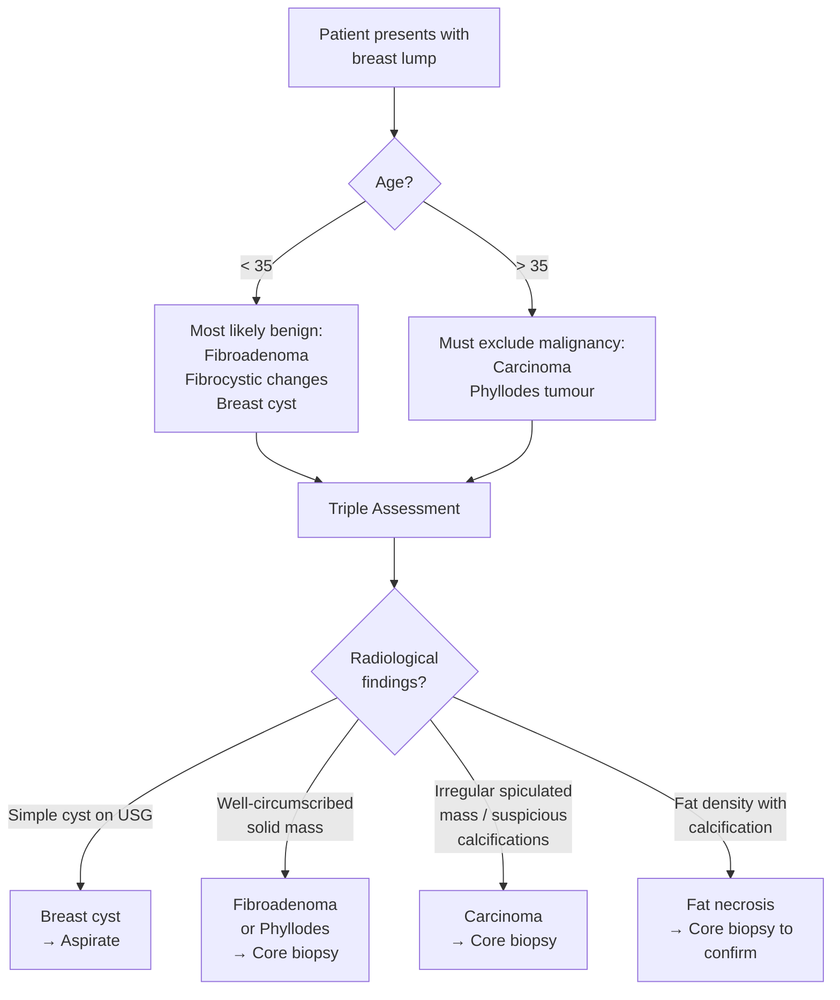
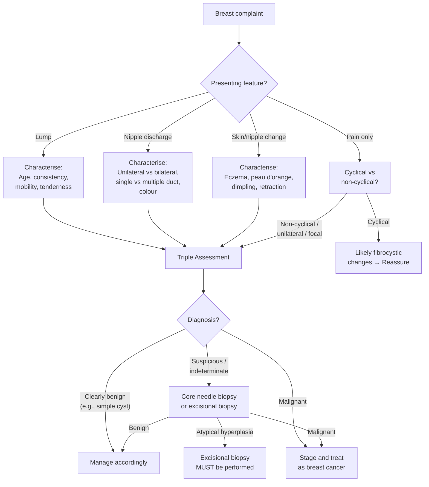

## Differential Diagnosis of Breast Cancer

The differential diagnosis of breast cancer really means: "A patient presents with a breast complaint — what could it be other than cancer, and how do I systematically work through the possibilities?" The approach differs depending on the **presenting complaint**: a **breast lump**, **nipple discharge**, **nipple/skin change**, or **mastalgia**. We will cover each systematically, explain *why* each mimicker can look like cancer, and clarify the distinguishing features.

---

### 1. Framework for Thinking About the Differential

Before diving in, understand the conceptual scaffold. Breast pathology can be classified under the **ANDI framework** (Aberrations of Normal Development and Involution) [2][8]:

- **Development (15–25 years):** Fibroadenoma, juvenile hypertrophy
- **Cyclical changes (25–55 years):** Fibrocystic changes, cyclical mastalgia, nodularity
- **Involution ( > 35–55 years):** Cysts, duct ectasia, sclerosing adenosis

Superimposed on this physiological framework are **neoplastic** (benign and malignant), **infective/inflammatory**, and **miscellaneous** conditions. The key clinical question is always: **Is this cancer or not?** — which is why the **triple assessment** (clinical + radiological + pathological) exists.

---

### 2. Differential Diagnosis by Presenting Complaint

#### 2.1 Breast Lump — The Most Common Presentation

The DDx depends heavily on **age** and **characteristics** of the lump [2]:

| | ***Young ( < 35)*** | ***Older ( > 35)*** |
|---|---|---|
| **Soft** | Fibrocystic changes | Fibrocystic changes |
| **Firm** | ***Fibroadenoma*** | ***Carcinoma*** |
| | Fat necrosis | Fat necrosis (bruising history) |
| | Lipoma | Lipoma |
| | Breast cyst (tense, fluctuant) | ***Phyllodes tumour*** (freely mobile) |

> **Why does age matter?** Because the pre-test probability of malignancy changes dramatically with age. In a 20-year-old, a firm mobile lump is overwhelmingly likely to be a fibroadenoma. In a 55-year-old, the same lump mandates urgent triple assessment to exclude carcinoma. The background incidence of breast cancer rises exponentially with age (accumulation of somatic mutations + longer cumulative oestrogen exposure).

Now let us go through each differential in detail.

---

#### 2.1.1 Fibroadenoma

The ***most common benign tumour of the breast*** [1][2].

| Feature | Detail | Why / Mechanism |
|---|---|---|
| **Nature** | Benign solid tumour containing glandular and fibrous tissue (fibro = fibrous; adeno = glandular; -oma = tumour) | Proliferation of both stromal and epithelial components of the TDLU [1][2] |
| **Age** | Reproductive age (15–35) | Likely a **hormonally-dependent neoplasm** — increases in size during pregnancy or with oestrogen-based OCP; persists during reproductive years; ***decreases in size or regresses after menopause*** [1] |
| **Clinical presentation** | ***"Breast mouse"*** — a highly mobile, well-defined, rubbery, non-tender mass [1] | The tumour is encapsulated within its own pseudocapsule and sits freely within breast tissue, hence the extreme mobility (slides under your finger like a mouse running away) |
| **Distinguishing from cancer** | Mobile (cancer is fixed), smooth borders (cancer is irregular), non-tender, does NOT cause skin changes or nipple retraction | Cancer invades Cooper's ligaments (dimpling, fixation) and ducts (retraction) — fibroadenoma does not |
| **Cancer risk** | ***Simple fibroadenoma: NO increased risk***; ***Complex fibroadenoma*** (with papillary apocrine changes, ductal hyperplasia, sclerosing adenosis): ***higher risk*** [1] | Complex histological changes indicate increased proliferative activity within the lesion |
| **Giant fibroadenoma** | Defined as > 10 cm; ***CANNOT be distinguished from Phyllodes tumour on examination or imaging*** → must excise [1] | Both are fibroepithelial lesions; the stroma in Phyllodes is more cellular and can become malignant |
| **Management** | Conservative if < 2 cm with concordant imaging; ***wide local excision if symptomatic, > 2 cm, or increasing in size*** [1][2] | Not necessary to excise every biopsy-proven fibroadenoma — surgery can cause scarring and breast deformity |

#### 2.1.2 Breast Cyst

| Feature | Detail | Why / Mechanism |
|---|---|---|
| **Nature** | ***Epithelial-lined fluid-filled cavity*** derived from the TDLU [1][8] | Fluid accumulates due to distension and obstruction of the efferent ductule of the TDLU [1] |
| **Age** | Young to perimenopausal women | Part of the involutionary spectrum — lobular involution with cystic dilation |
| **Clinical presentation** | Soft, fluctuant, well-defined, mobile lump; may be tender (especially with acute enlargement causing sudden-onset pain) [1][8] | Rapid distension of the cyst wall stretches pain fibres |
| **Distinguishing from cancer** | ***USG: simple anechoic fluid-filled structure*** with posterior acoustic enhancement — definitively benign. Complex cysts (with internal echoes/septae/solid component) need further workup | Cancer is a solid mass on USG; a simple cyst is never cancer |
| **Management** | Reassurance; ***aspiration*** (therapeutic and diagnostic — if blood-stained aspirate, recurrent, or radiologically suspicious → cytology and further workup) [2][8] | If the cyst disappears completely after aspiration and the fluid is not bloody, it is benign. Recurrence or solid component → excision |

#### 2.1.3 Fibrocystic Changes (Fibroadenosis)

The ***most common benign disorder of the breast*** [1][8].

| Feature | Detail | Why / Mechanism |
|---|---|---|
| **Nature** | NOT a disease but a spectrum of histopathological changes: stromal fibrosis, macro/microcysts, apocrine metaplasia, hyperplasia, adenosis [1] | Result of hormonal imbalance — ***oestrogen predominance over progesterone*** causing exaggerated cyclical changes [1] |
| **Age** | Reproductive (premenopausal) | Driven by menstrual cycle hormonal fluctuations |
| **Clinical presentation** | ***Cyclical painful mass/nodularity*** (worse before menses, improves after onset of menstrual flow); serosanguinous nipple discharge possible [1][8] | Oestrogen-driven proliferation and oedema in the first half of the cycle → engorgement and tenderness pre-menstrually; regression with progesterone withdrawal |
| **Distinguishing from cancer** | Cyclical variation (cancer lumps do NOT wax and wane with menstrual cycle); bilateral and diffuse rather than a single discrete hard mass | Cancer grows progressively; fibrocystic changes fluctuate |
| **Cancer risk** | Depends on histology (see ACP table [4]): ***no increased risk*** for simple cysts, fibrosis, mild hyperplasia; ***slightly increased (1.5–2×)*** for moderate/florid hyperplasia; ***moderately increased (5×) for atypical hyperplasia (ductal or lobular)*** [4] | Atypia = cells are acquiring pre-malignant features (abnormal architecture and cytology) |
| **Management** | Reassurance, avoid caffeine, evening primrose oil, analgesics, COC (to suppress cyclical hormonal fluctuation) [8] | — |

#### 2.1.4 Phyllodes Tumour

"Phyllodes" from Greek *phyllon* = leaf — refers to the characteristic **leaf-like architecture** on histology [1][2].

| Feature | Detail | Why / Mechanism |
|---|---|---|
| **Nature** | ***Fibroepithelial tumour*** (aka serocystic disease of Brodie) — classified as benign, borderline, or malignant [1][2] | Similar to fibroadenoma but with more cellular stroma that can undergo malignant transformation |
| **Age** | ***Older women ( > 40)*** [2] | Unlike fibroadenoma which peaks in youth |
| **Clinical presentation** | ***Smooth, painless, mobile mass*** — can grow very large rapidly [2] | Rapid stromal proliferation → fast growth distinguishes it from the slowly growing fibroadenoma |
| **Distinguishing from cancer** | Mobile (cancer is fixed), smooth surface; but ***can be malignant*** — and malignant Phyllodes ***metastasises via blood (haematogenous), NOT lymphatics → ALND is NOT required*** [2] | Sarcomatous stroma spreads haematogenously like other sarcomas, not via lymphatic routes like carcinomas |
| **Axillary lymphadenopathy** | Occurs in ~20% but is usually ***reactive*** (not metastatic) [1] | The large tumour causes local inflammation → reactive nodal hyperplasia |
| **Management** | ***Wide local excision with margin of at least 1 cm*** (mastectomy if adequate margin cannot be achieved) [2] | Wide margins are essential because of the high local recurrence rate; unlike fibroadenoma, simple enucleation is inadequate |

<Callout title="Phyllodes vs Fibroadenoma — Key Distinction" type="error">
Giant fibroadenoma ( > 10 cm) ***CANNOT be distinguished from Phyllodes tumour on physical examination or imaging*** [1]. If you cannot differentiate, you must excise. On core needle biopsy, features favouring Phyllodes include: increased stromal cellularity, mitoses, stromal overgrowth, leaf-like architecture, and fragmentation [1].
</Callout>

#### 2.1.5 Fat Necrosis

| Feature | Detail | Why / Mechanism |
|---|---|---|
| **Nature** | ***Ischaemic necrosis of fat lobules*** [8] | Disrupted blood supply to fat → necrosis → inflammatory repair → fibrosis → hard lump |
| **Risk factors** | ***Trauma, iatrogenic (e.g., breast reconstruction, surgery, radiation)*** [8] | Direct physical damage to adipose tissue |
| **Clinical presentation** | ***Mimics carcinoma clinically***: painless lump with ***skin dimpling, nipple retraction*** [8] | Fibrosis from fat necrosis tethers Cooper's ligaments and ducts, producing the same signs as cancer |
| **Imaging** | ***Mimics carcinoma radiologically*** — spiculated mass, calcifications [8] | Dystrophic calcification in necrotic fat; surrounding fibrosis creates spiculated margins |
| **Diagnosis** | ***Core biopsy to differentiate from cancer*** [8] — shows foamy macrophages, giant cells, fibrosis, fat globules surrounded by inflammatory infiltrate | The only way to be certain is tissue diagnosis |
| **Management** | Reassurance, analgesics [8] | Self-limiting; no treatment needed once cancer is excluded |

#### 2.1.6 Lipoma

| Feature | Detail |
|---|---|
| **Nature** | Benign tumour of mature adipose tissue |
| **Clinical presentation** | Soft, well-defined, non-tender, mobile subcutaneous mass |
| **Distinguishing from cancer** | Soft consistency (cancer is hard); superficial and mobile; on imaging, fat density with thin capsule |
| **Management** | Conservative unless symptomatic → excision |

#### 2.1.7 Other Conditions Mimicking a Breast Lump

| Condition | Key Points |
|---|---|
| **Sclerosing adenosis / Radial scars** | ***Pathological diagnosis: lobular lesions with increased fibrosis*** [2]; ***can mimic carcinoma*** both clinically and on mammography → core biopsy to differentiate [2] |
| **Adenoma** | Benign glandular tumour, older age; ***can mimic carcinoma*** [2] |
| **Diabetic (DM) mastopathy** | Occurs in premenopausal women with Type 1 DM; hard mass from lymphocytic infiltration and fibrosis; ***does NOT increase breast cancer risk*** [1]; autoimmune-mediated |
| **Pseudoangiomatous stromal hyperplasia (PASH)** | Benign stromal proliferation; can present as a firm mass; biopsy to exclude angiosarcoma [1] |
| **Idiopathic granulomatous mastitis (IGM)** | ***Rare benign inflammatory disease mimicking carcinoma***; young parous women; ***self-limiting (resolves 9–12 months)***; ***NO increased cancer risk***; diagnosis of exclusion after excluding TB, sarcoidosis; biopsy shows granulomatous lesions centred on lobules [1] |

---

#### 2.2 Nipple Discharge

Nipple discharge is the second most common breast complaint. The critical question is: **Is this physiological or pathological?** [1][2]

**History-taking for nipple discharge** [2]:
- ***True nipple discharge?*** (from the nipple orifice, not skin)
- ***Unilateral or bilateral?***
- ***Colour of discharge?***
- ***Recent pregnancy/breastfeeding?***
- ***Single duct or multiple ducts?***
- ***Spontaneous or expressible?***

| Feature | Likely Benign | Suspicious for Malignancy |
|---|---|---|
| Laterality | Bilateral | ***Unilateral*** |
| Number of ducts | Multiple | ***Single duct*** |
| Colour | Milky, yellow, green | ***Bloody or serosanguinous*** |
| Spontaneity | Only with expression | ***Spontaneous*** |

**DDx by colour** [1][2]:

| Colour | Differential Diagnosis | Mechanism |
|---|---|---|
| **Milky (bilateral, multiple ducts)** | Physiological (pregnancy, lactation), ***Galactorrhoea*** (hyperprolactinaemia: prolactinoma, antipsychotics like haloperidol/risperidone, antiemetics like metoclopramide/domperidone, hypothyroidism, CKD) [1] | Prolactin drives milk production; any cause of elevated prolactin → bilateral milky discharge. Drug-induced: dopamine normally inhibits prolactin release from the anterior pituitary; dopamine antagonists (antipsychotics, metoclopramide) remove this inhibition → hyperprolactinaemia |
| **Yellow/green/black (multicoloured)** | ***Ductal ectasia*** [1][8] | Abnormal dilatation of subareolar ducts with accumulation of lipid-rich secretions → "creamy, cheesy" discharge; can be green/blue/black depending on duration and oxidation of lipid material |
| **Serous/serosanguinous** | ***Intraductal papilloma*** (most common cause of pathological nipple discharge) [1][2], fibrocystic changes, DCIS | Papilloma: muscularis arteries supply the peduncle but lymphatics/veins are compromised → increased vascular pressure → transudate into duct lumen [1] |
| ***Bloody*** | ***Intraductal papilloma*** (bleeding from friable papilloma surface), ***CA breast/DCIS***, fibrocystic changes with active intraductal component [1][2] | Tumour or papilloma erodes into blood vessels within the duct wall → haemorrhagic discharge |

> ***Malignancy is the underlying cause in 5–15% of cases of pathological nipple discharge, and the most common malignancy associated is DCIS*** [1].

**Investigations for nipple discharge** [2]:
- ***Triple assessment***
- ***± Nipple discharge cytology***
- ***± Ductogram / ductoscopy*** (to localise intraductal lesion before microdochectomy)

---

#### 2.3 Nipple/Skin Changes

| Condition | Presentation | Mechanism | How to Distinguish from Cancer |
|---|---|---|---|
| ***Paget's disease of the nipple*** [1][3][9] | ***Eczematous changes involving the nipple***; unilateral; ***associated with malignancy within the same breast (~80%)***; ***malignant epithelial (Paget) cells infiltrate and proliferate in the epidermis, causing thickening of the nipple and areolar skin*** [9] | Malignant intraepithelial adenocarcinoma cells migrate from underlying ductal carcinoma into nipple epidermis via lactiferous ducts | This IS cancer (or associated with cancer). Not a mimic but a **special presentation** of breast cancer. Diagnosed by ***full-thickness wedge biopsy*** showing Paget cells [1]. ***Mammography mandatory*** to look for associated mass and exclude synchronous cancers [1] |
| **Nipple eczema (dermatitis)** | Bilateral, involves areola more than nipple, itchy, responds to topical steroids | Contact dermatitis or atopic eczema — allergen-mediated immune response | Bilateral involvement and areolar predominance favours eczema. Paget's is ***unilateral, centred on the nipple***, does not respond to steroids, and progressively worsens |
| **Duct ectasia** | ***Nipple retraction*** (from periductal fibrosis), "blue breast" (cyst with dark fluid), multicoloured discharge [8] | Dilated subareolar ducts → inflammation → fibrosis → nipple retraction and periductal mastitis | ***NOT associated with increased cancer risk*** [1]; nipple retraction from duct ectasia is often bilateral and gradual, while cancer-related retraction is unilateral and progressive |
| ***Inflammatory breast cancer (IBC)*** [1][2] | ***Painful swollen breast with erythema, oedema, peau d'orange involving at least 1/3 of breast***; ***T4d*** | ***Invasion of local dermal lymphatic ducts*** by tumour → lymphatic obstruction → cutaneous oedema [2] | ***IBC resembles mastitis*** but is ***NOT a true inflammatory process*** — ***no fever, no leukocytosis*** (unlike mastitis which has both) [1]. If "mastitis" does not respond to antibiotics within 1–2 weeks → must biopsy to exclude IBC |
| **Lactational mastitis** | Tender, swollen, erythematous breast in a breastfeeding woman; fever, leukocytosis; may progress to abscess [1] | ***S. aureus*** (most common) or streptococci enter through nipple fissures → infection of breast tissue → suppurative inflammation [8] | Fever + leukocytosis + lactational context → mastitis. Responds to antibiotics. If no response → consider abscess or IBC |
| **Mondor's disease** | ***Palpable subcutaneous cord*** along the breast/chest wall; chest pain [8] | ***Superficial sclerosing thrombophlebitis*** of breast/chest wall veins (***thoraco-epigastric vein*** most common, also lateral thoracic, superior epigastric) [8] | The palpable cord is diagnostic; no breast mass; self-limiting |

<Callout title="Paget's Disease vs. Nipple Eczema" type="error">
A classic exam trap. **Paget's** = ***unilateral***, centred on the **nipple**, does NOT respond to steroids, progressively worsens, associated with underlying carcinoma. **Eczema** = usually **bilateral**, involves the **areola** more than the nipple, responds to topical steroids. When in doubt, ***biopsy*** [9].
</Callout>

---

#### 2.4 Mastalgia (Breast Pain)

| Type | Most Common Cause | Other Differentials | Approach |
|---|---|---|---|
| ***Cyclical*** (worsens pre-menstrually, improves after menses) | ***Fibrocystic changes*** (most common) [2] | Normal physiological | ***Cyclical or bilateral diffuse pain: no imaging required; reassurance, conservative (NSAID)*** [2] |
| ***Non-cyclical*** (constant, no relationship to cycle) | Acute mastitis, fibroadenoma, ***inflammatory breast cancer*** [2] | Costochondritis (Tietze syndrome), fat necrosis, breast cyst (acute enlargement), diabetic mastopathy | ***Non-cyclical / unilateral / focal pain: USG / mammogram*** to exclude malignancy [2] |

> **Why is breast cancer usually painless?** Most breast cancers grow insidiously within the parenchyma without acutely stretching the breast capsule or involving pain-sensitive structures. Exceptions include inflammatory breast cancer (dermal lymphatic obstruction → rapid oedema → stretching → pain) and locally advanced cancers invading the chest wall or intercostal nerves.

---

### 3. Pre-malignant Conditions (High-Risk Lesions)

These deserve special mention because they sit on the continuum between benign and malignant — they are **not yet cancer** but significantly increase the risk and may harbour occult malignancy [1][5]:

#### 3.1 Atypical Ductal Hyperplasia (ADH) / Atypical Lobular Hyperplasia (ALH)

| Feature | Detail | Why / Mechanism |
|---|---|---|
| **Definition** | Proliferative lesions with cellular atypia arising from breast ducts (ADH) or lobules (ALH) [1] | Represent an intermediate step between normal hyperplasia and carcinoma in situ — cells show architectural distortion and cytological atypia but do not fully meet criteria for CIS |
| **ADH pathology** | Proliferation of uniform epithelial cells with monomorphic round nuclei filling **part but not entirely** the involved duct [1] | If the duct is **completely** filled with atypical cells → DCIS. ADH = partially involved |
| **ALH pathology** | Monomorphic, evenly spaced dyshesive cells filling **part but not entirely** the involved lobule [1] | If the lobule is **completely** filled → LCIS. ALH = partially involved |
| **Cancer risk** | ***ADH: 4–5× increased relative risk of invasive breast cancer*** [1]; ***ALH: similar risk*** [1] | Cells have already acquired some pre-malignant mutations; further hits can complete the transformation |
| **Critical management point** | ***If atypical hyperplasia found on core needle biopsy → excisional biopsy MUST be performed to rule out associated malignancy*** [1][2] | Core needle biopsy samples only a small portion of the lesion. There may be adjacent DCIS or invasive cancer that was missed by the needle. Excisional biopsy examines the entire lesion |
| **If excision shows malignancy** | Manage according to final histology (DCIS/IDC, LCIS/ILC) [1] | — |
| **If excision shows no malignancy** | Two options: (1) ***Surveillance*** with imaging + physical exam, or (2) ***Chemoprevention with tamoxifen*** [1] | Tamoxifen blocks ER → reduces oestrogen-driven proliferation → reduces risk of progression to invasive cancer |
| **Ongoing management** | ***Avoidance of OCP and HRT***; yearly mammography; twice-yearly breast exam; SERMs or aromatase inhibitors [1] | Remove exogenous oestrogen sources that fuel proliferation |

#### 3.2 DCIS and LCIS

Already covered in detail in the Classification section, but worth reiterating in the DDx context:

- ***DCIS: precursor to invasive ductal carcinoma (~1%/year). Mammographic microcalcifications. Manage with surgery ± RT ± endocrine therapy*** [2][3][7]
- ***LCIS: premalignant condition rather than true cancer*** [7][9] — a ***marker and precursor for bilateral invasive carcinoma (~1%/year)***. Usually an incidental finding. Classical LCIS → observation; pleomorphic LCIS → excision [2]

<Callout title="LCIS — A Premalignant Condition, NOT Cancer">
***Lobular carcinoma in-situ (LCIS) is really a premalignant condition rather than cancer*** [7][9]. Despite the name "carcinoma," classical LCIS is managed conservatively with observation because it is a **marker of increased bilateral risk** rather than a direct precursor at that specific site. This is fundamentally different from DCIS, which IS a direct precursor to ipsilateral IDC.
</Callout>

---

### 4. Differential Diagnosis of Breast Mass — Lecture Slide Summary

***From the lecture slides (GC 181)*** [3]:

> ***DDx of breast mass:***
> - ***Benign:***
>   - ***Fibroadenoma***
>   - ***Cysts***
>   - ***Phyllodes tumour (Benign)***
>   - ***Others (skin lesions etc)***
> - ***Malignant:***
>   - ***Carcinoma***
>     - ***In situ***
>     - ***Invasive***
>   - ***Phyllodes tumour (Malignant)***

---

### 5. Master Differential Diagnosis Table — Summary

| Condition | Age | Consistency | Mobility | Tenderness | Key Distinguishing Feature | Cancer Risk |
|---|---|---|---|---|---|---|
| **Fibroadenoma** | 15–35 | Rubbery/firm | ***Most mobile*** | Non-tender | "Breast mouse"; regresses post-menopause | Simple: nil; Complex: increased |
| **Breast cyst** | Premenopausal | Soft, fluctuant | Mobile | ± Tender | Disappears on aspiration; anechoic on USG | Nil |
| **Fibrocystic changes** | Premenopausal | Nodular | — | ***Cyclical tenderness*** | Waxes and wanes with cycle | Depends on histology |
| **Phyllodes tumour** | > 40 | Firm | Mobile | Non-tender | Rapid growth; leaf-like histology | Can be malignant |
| **Fat necrosis** | Any | Hard | Variable | Non-tender | ***Mimics cancer*** clinically + radiologically; trauma history | Nil |
| **Lipoma** | Any | Soft | Mobile | Non-tender | Subcutaneous; fat density on imaging | Nil |
| **Sclerosing adenosis** | Any | Hard | — | — | ***Mimics cancer*** on imaging | Nil |
| **ADH/ALH** | Any | — | — | — | Usually incidental on biopsy; ***5× risk*** | Yes (high risk) |
| **DCIS** | Any | Non-palpable | — | — | ***Microcalcifications*** on mammogram | Precursor to IDC |
| **LCIS** | Any | Non-palpable | — | — | ***Incidental finding; loss of E-cadherin*** | Marker/precursor bilateral |
| **IDC** | > 40 | ***Hard*** | ***Fixed*** | ***Non-tender*** | Irregular, spiculated, skin/nipple changes | — (IS cancer) |
| **ILC** | Older | Hard but diffuse | Variable | Non-tender | ***Difficult to detect*** (Indian file pattern); E-cadherin negative | — (IS cancer) |
| **IBC** | Any | Oedematous | — | ***Painful*** | ***Peau d'orange ≥ 1/3 breast; erythema; no fever*** | — (IS cancer, T4d) |
| **Paget's disease** | Any | ± Underlying mass | — | ± Tender | ***Unilateral nipple eczema; Paget cells on biopsy*** | ~80% underlying cancer |
| **Mastitis** | Lactating | Indurated | — | ***Very tender*** | ***Fever + leukocytosis***; responds to antibiotics | Nil |
| **Duct ectasia** | Older ( > 50) | Subareolar mass | — | — | ***Multicoloured cheesy discharge; nipple retraction*** | Nil |
| **Intraductal papilloma** | Perimenopausal | Small/non-palpable | — | — | ***Bloody nipple discharge (most common cause)*** | Slightly increased |
| **IGM** | Young parous | Hard | — | Tender | ***Mimics cancer; diagnosis of exclusion; self-limiting*** | Nil |

---

### 6. Approach Algorithm — Putting It All Together

---

<Callout title="High Yield Summary — Differential Diagnosis of Breast Cancer">

1. **DDx of breast lump by age:** Young → fibroadenoma, cyst, fibrocystic changes. Old → carcinoma, Phyllodes tumour. Fat necrosis and lipoma at any age.

2. **Fibroadenoma** = most common benign tumour; "breast mouse" — highly mobile, rubbery, well-defined; hormonally dependent; simple type = no cancer risk.

3. **Phyllodes tumour** = fibroepithelial; can be malignant; metastasises via blood NOT lymphatics → ALND not required; excise with ≥ 1 cm margin.

4. **Fat necrosis** = mimics cancer clinically AND radiologically → core biopsy mandatory to differentiate.

5. **Nipple discharge:** Most common pathological cause = intraductal papilloma. Suspicious features: unilateral, single duct, bloody, spontaneous. Malignancy in 5–15% of pathological discharge (most commonly DCIS).

6. **Paget's disease** = unilateral nipple eczema + underlying cancer (~80%, usually HER2+). DDx from bilateral nipple eczema (dermatitis).

7. **IBC vs. mastitis:** IBC = peau d'orange ≥ 1/3 breast, erythema, NO fever/leukocytosis; Mastitis = fever + leukocytosis, responds to antibiotics.

8. **ADH/ALH** = high-risk lesions (4–5× risk); if found on core biopsy → MUST do excisional biopsy to rule out adjacent malignancy.

9. **LCIS** = premalignant condition, NOT true cancer; marker of bilateral risk; observe unless pleomorphic type.

10. **Triple assessment (clinical + radiological + pathological)** resolves virtually all diagnostic dilemmas.

</Callout>

---

<ActiveRecallQuiz
  title="Active Recall - Differential Diagnosis of Breast Cancer"
  items={[
    {
      question: "A 45-year-old woman presents with a rapidly growing, smooth, painless, mobile breast mass measuring 12 cm. What is the most likely diagnosis, how does it spread if malignant, and what is the minimum surgical margin required?",
      markscheme: "Phyllodes tumour (giant fibroadenoma cannot be distinguished). If malignant, metastasises haematogenously (NOT lymphatics) so ALND is not required. Requires wide local excision with at least 1 cm margin; mastectomy if adequate margin cannot be achieved."
    },
    {
      question: "List 4 features of nipple discharge that are suspicious for underlying malignancy. What is the most common cause of pathological nipple discharge, and what proportion of pathological nipple discharge is caused by malignancy?",
      markscheme: "Suspicious features: (1) unilateral, (2) single duct, (3) bloody/serosanguinous, (4) spontaneous. Most common cause of pathological discharge = intraductal papilloma. Malignancy accounts for 5-15% of pathological discharge (most commonly DCIS)."
    },
    {
      question: "How do you clinically distinguish inflammatory breast cancer from lactational mastitis? Why is this distinction critical?",
      markscheme: "IBC: erythema and peau d'orange involving at least 1/3 of breast, NO fever, NO leukocytosis (NOT a true inflammatory process; tumour invades dermal lymphatics causing obstruction). Mastitis: fever, leukocytosis, responds to antibiotics. Critical because IBC is aggressive (T4d) and requires systemic therapy, not antibiotics. If suspected mastitis does not improve with antibiotics within 1-2 weeks, must biopsy to exclude IBC."
    },
    {
      question: "A core needle biopsy of a breast lesion shows atypical ductal hyperplasia (ADH). What is the mandatory next step and why?",
      markscheme: "Excisional biopsy MUST be performed. Reason: core needle biopsy only samples a small portion of the lesion; there may be adjacent DCIS or invasive cancer that was not sampled. ADH confers 4-5x increased relative risk of breast cancer. If excision shows no malignancy: surveillance + consider chemoprevention with tamoxifen."
    },
    {
      question: "Compare Paget's disease of the nipple with nipple eczema (dermatitis). Give at least 4 distinguishing features.",
      markscheme: "Paget's: (1) unilateral, (2) centred on nipple, (3) does NOT respond to topical steroids, (4) progressive worsening, (5) associated with underlying breast carcinoma in ~80% (usually HER2+), (6) biopsy shows Paget cells in epidermis. Eczema: (1) often bilateral, (2) involves areola more than nipple, (3) responds to steroids, (4) no underlying carcinoma."
    },
    {
      question: "Explain why fat necrosis is an important differential diagnosis for breast cancer. What causes it and how is it definitively diagnosed?",
      markscheme: "Fat necrosis mimics carcinoma both clinically (painless hard lump, skin dimpling, nipple retraction due to fibrosis of Cooper's ligaments) and radiologically (spiculated mass, dystrophic calcifications). Caused by ischaemic necrosis of fat lobules following trauma or iatrogenic injury (e.g., breast reconstruction). Definitive diagnosis requires core biopsy showing foamy macrophages, giant cells, fibrosis, and fat necrosis with no malignant cells."
    }
  ]}
/>

---

## References

[1] Senior notes: felixlai.md (Sections on fibroadenoma, breast cysts, fibrocystic changes, Phyllodes tumour, duct ectasia, mastitis, IGM, nipple discharge, ADH/ALH, Paget's disease, IBC, breast cancer clinical features)
[2] Senior notes: maxim.md (Sections 8.2, 8.3, 8.6, breast carcinoma clinical features, DCIS/LCIS, benign breast tumours, inflammatory/non-inflammatory breast conditions)
[3] Lecture slides: GC 181. Breast mass breast cancer; benign breast diseases; mammography; breast cancer screening.pdf (pp. 20, 33, 34)
[4] Senior notes: maxim.md (ACP Consensus table on relative risk from benign breast disease)
[5] Lecture slides: The Managment of breast cancer_Prof A Kwong 20_2_2020.pdf (pp. 30, 33)
[7] Lecture slides: GC 181. Breast mass breast cancer; benign breast diseases; mammography; breast cancer screening.pdf (p. 33)
[8] Senior notes: maxim.md (Sections 8.5 inflammatory/non-inflammatory breast conditions, Mondor's disease)
[9] Lecture slides: GC 181. Breast mass breast cancer; benign breast diseases; mammography; breast cancer screening.pdf (p. 34)
