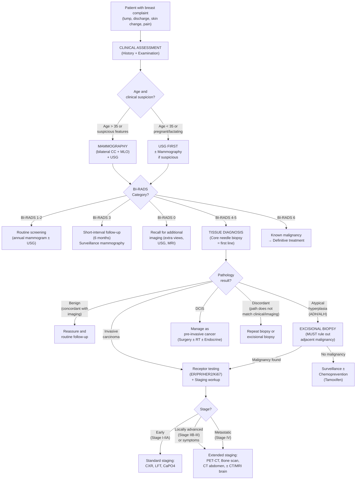

## Diagnosis of Breast Cancer — Diagnostic Criteria, Algorithm & Investigation Modalities

---

### 1. The Overarching Principle: Triple Assessment

The diagnosis of breast cancer is **never** made on the basis of a single test. It relies on the **Triple Assessment** — a synergistic combination of three independent pillars, each compensating for the weaknesses of the others [10][11]:

| Pillar | Modality | Sensitivity (alone) |
|---|---|---|
| ***1. Clinical*** | History and physical examination | ***50–85%*** [10] |
| ***2. Radiological*** | Mammography ± USG (± MRI) | ***~90%*** [10] |
| ***3. Pathological*** | FNA cytology or core needle biopsy (histology) | ***~91%*** [10] |

> ***Combined sensitivity of triple assessment: 99.6%; specificity: 93%*** [10].

***Key rules*** [10]:
- ***Triple Assessment is positive if ANY one of the above is positive***
- ***Triple Assessment is negative ONLY when ALL THREE are negative***
- ***If findings do not all correlate → further investigations or monitoring is necessary***

> **Why does this work so well?** Each component catches what the others miss. A small tumour may be non-palpable clinically but visible on mammogram (microcalcifications). A tumour in dense breast tissue may be mammographically occult but palpable or visible on USG. And imaging alone cannot distinguish a benign from malignant lesion with certainty — tissue diagnosis resolves ambiguity. The triple assessment is essentially a Bayesian system: the post-test probability after three concordant negative results is extremely low.

---

### 2. Pillar 1 — Clinical Assessment

Already covered in detail in the Clinical Features section, but the key diagnostic elements are summarised here for completeness:

#### 2.1 History [1][2]

- **Mass:** onset, progression, cyclical changes
- **Nipple:** discharge (colour, unilateral/bilateral, single/multiple duct), retraction
- **Skin:** dimpling, peau d'orange, erythema, itchiness
- **Constitutional symptoms:** weight loss, bone pain, SOB (metastatic disease)
- **Risk factor assessment:** family history (BRCA — CA breast/ovary/prostate/pancreas), personal history (breast disease, chest RT), oestrogen exposure (menarche, menopause, parity, breastfeeding, COC/HRT)

#### 2.2 Physical Examination [1][2]

- **Positioning:** 45° or sitting
- **Exposure:** Clavicle to upper abdomen, both breasts and axillae

**Inspection:**
- ***Size, symmetry, scars (3 Ss)*** [1]
- Skin changes: ulceration, dimpling, peau d'orange, erythema
- ***Nipple changes — the 5 Ds: Deviation, Discolouration, Dermatitis, Depression (retraction), Discharge*** [1]

**Palpation of breast** (start with normal side):
- Comment on: ***site, size, shape, border, surface, consistency, tenderness, mobility (to skin and to pectoralis muscle)*** [2]
- Include axillary tail

**Palpation of axilla:**
- ***Five groups: anterior, posterior, medial, lateral, apical*** [2]
- Comment on: ***number, site, size, consistency, tenderness, fixation*** [2]

**Examination for metastatic disease** [1]:
- ***Examine liver for hepatomegaly***
- ***Examine bone for bone tenderness***
- Examine lungs for effusion
- Neurological examination if brain metastasis suspected

---

### 3. Pillar 2 — Radiological Assessment

#### 3.1 Mammography — The Primary Imaging Modality

Mammography (mammo = breast; -graphy = imaging) uses **low-dose X-rays** to produce images of breast tissue. It is the ***primary imaging modality for early detection of breast cancer*** [1][2].

**When to use mammography:**
- ***Only for females > 35 years*** — because younger women have denser breasts (more glandular tissue, less fat), reducing mammographic sensitivity ("finding a white tumour in a white background") [2]
- Can be performed in ***pregnant women with shielding*** [2]
- Always perform ***bilateral mammography*** when breast cancer is suspected (to detect ***synchronous contralateral breast cancer***) [2][4]

**Standard views** [1][2]:

| View | Description | What it best shows |
|---|---|---|
| ***Craniocaudal (CC)*** | X-ray beam from above, breast compressed top-to-bottom | Inner vs. outer quadrant (mediolateral localisation) |
| ***Mediolateral oblique (MLO)*** | X-ray beam angled 45° from medial to lateral | ***Axillary tail, axillary lymph nodes, upper outer quadrant*** in detail; upper vs. lower half (line perpendicular to pectoralis major); pectoralis major involvement [2] |

> **Why these two views?** Together they provide two perpendicular projections that allow triangulation of a lesion's position within the breast. The CC view shows medial-lateral location; the MLO view shows superior-inferior location and uniquely captures the axillary tail (where many cancers occur).

**How to present a mammogram** [2] *(important!)*:
1. ***Breast tissue appropriate for age*** (comment on density)
2. ***Views: CC and MLO***
3. ***Location of mass*** — MLO: upper vs. lower half; CC: outer vs. inner quadrant
4. ***Features of malignancy***

**Mammographic Features — Benign vs. Malignant** [1]:

**Mass features:**
- ***Spiculated (stellate) opacity with irregular borders → suggests malignancy*** [1][2]
- ***Architectural distortion*** (e.g., tent sign) → suggests malignancy [2]
- Smooth, well-circumscribed mass → suggests benign

**Calcification features** [1]:

| | ***Benign features*** | ***Malignant features*** |
|---|---|---|
| **Content** | ***Rim-like calcification*** | ***Pleomorphic*** (irregular shapes and sizes) |
| | ***Large coarse calcifications*** | |
| | ***Smooth round or oval calcifications*** | |
| **Distribution** | ***Vascular and skin calcification*** | ***Linear branching microcalcifications*** (following duct distribution — cancer growing along ducts deposits calcium in a linear pattern) |
| | | ***Clustered microcalcifications*** ( > 5/mm²) [1] |

> **Why do cancers cause microcalcifications?** In DCIS especially, malignant cells within ducts undergo necrosis (particularly in the comedo subtype). The necrotic debris undergoes ***dystrophic calcification*** — calcium phosphate deposits in dead tissue. These tiny calcifications ( < 0.5 mm) are often the earliest mammographic sign of DCIS, visible before a palpable mass develops. This is why mammographic screening saves lives — it catches cancer at the pre-invasive stage.

**Other malignant mammographic signs** [2]:
- ***Pectoralis major involvement*** (only assessable on MLO view)
- ***Skin thickening / tethering***
- ***Nipple involvement***

**Mammographic advantages** [2]:
- ***Gold standard*** for breast cancer screening
- ***More sensitive for calcifications*** than USG
- ***Less operator-dependent*** than USG
- Used for annual screening

**Mammographic limitations** [1][2]:
- ***Can only depict a mass as abnormal or suspicious but cannot make definitive diagnosis*** [1]
- ***Obscuration of borders and extent of primary tumour by dense breast tissues*** (reduced sensitivity in young, dense breasts) [1]
- ***Limited localisation; difficult to see chest wall and axilla*** [2]
- Radiation exposure (small dose)

#### 3.2 Ultrasound (USG)

| Feature | Detail |
|---|---|
| **Role** | ***Diagnostic follow-up of an abnormal screening mammogram***; ***first imaging study in young women ( < 35) or women who are pregnant or lactating*** [1]; ***for all patients*** as adjunct [2] |
| **Advantages** | ***Improved sensitivity and specificity combined with mammogram, especially in young women with dense breast tissue*** [2]; ***distinguishes cysts from solid lesions***; ***guides FNAC, biopsy, and clipping before neoadjuvant chemotherapy***; ***assesses axillary lymph nodes*** [2]; no radiation |
| **Limitations** | ***NOT useful as screening*** (alone); ***operator-dependent***; ***cannot pick up most calcifications*** [2] |

**USG Features — Benign vs. Malignant** [1]:

| Feature | ***Benign*** | ***Malignant*** |
|---|---|---|
| **Shape** | ***Wider-than-taller (ellipsoid)*** | ***Taller-than-wide (fir-tree shape)*** |
| **Margin** | ***Smooth margins; macrolobulation*** | ***Spiculated or angular margins; microlobulation*** |
| **Echogenicity** | ***Hyperechogenicity; thin echogenic capsule*** | ***Hypoechogenicity*** |
| **Calcification** | ***Absent*** | ***Internal calcification; posterior acoustic shadowing*** |
| **Vascularity** | ***Absent*** | ***Central vascularity*** |

> **Mnemonic for suspicious USG features: "SHIT CME"** [2] — same features used for thyroid nodule assessment: **S**olid, **H**ypoechoic, **I**rregular margins, **T**aller-than-wide, **C**alcification (micro), **M**icrolobulation, **E**xtra-thyroidal extension (in breast context = chest wall invasion).

**USG assessment of axillary lymph nodes** [2]:
- ***Suspicious LN feature: loss of fatty hilum*** (normal LN has a central hyperechoic fatty hilum; metastatic replacement obliterates this)

**Roles of USG in characterising masses** [1]:
- ***Simple cyst*** (anechoic, posterior acoustic enhancement, well-defined walls) → ***no further intervention*** due to low cancer risk
- ***Indeterminate cyst*** → ***aspiration under USG guidance***
- ***Intracystic mass*** → ***aspiration or biopsy***
- ***Solid mass*** → characterise as benign or malignant; ***absence of flow on Doppler does NOT exclude malignancy*** [1]

#### 3.3 MRI Breast

| Feature | Detail |
|---|---|
| **Characteristics** | ***High sensitivity but low specificity***; better characterisation of soft tissues without radiation [1] |
| **Routine use** | ***NOT routinely performed in the workup of an undiagnosed breast mass*** [1][2] |
| **Concern** | ***Unnecessary biopsies may be performed*** due to false positives (low specificity) [2] |

***Indications for breast MRI*** [1][2]:

1. ***Equivocal results from mammogram or USG***
2. ***Assessment of patients with breast implants*** (implants obscure tissue on mammogram)
3. ***Identify patients with clinically occult tumour presenting with positive axillary LN*** (unknown primary) [2]
4. ***Suspected multicentric or bilateral malignancy, especially invasive lobular carcinoma (ILC)*** (ILC is notorious for being mammographically and clinically occult due to its diffuse infiltrating pattern)
5. ***Determine extent of disease accurately, especially chest wall involvement*** (not fully included on mammographic projections)
6. ***Identify extent of residual disease after excision with positive margins***
7. ***Pre-operative evaluation to improve surgical planning*** (help surgeons obtain clean margins)
8. ***Monitor results of neoadjuvant therapy*** (assess tumour shrinkage)
9. ***Screening in high-risk patients*** (genetic predisposition, e.g., BRCA carriers)
10. ***Paget's disease with negative mammogram*** [2]

***MRI malignant features*** [1]:
- ***Spiculated or irregular margins***
- ***Rim-like enhancement***
- ***Heterogeneous internal enhancement***
- ***Enhancing internal septa***
- ***More rapid uptake of contrast is characteristic of malignant mass*** (nearly all invasive breast carcinomas enhance on gadolinium-contrast MRI; some benign lesions also enhance — hence low specificity) [1]

#### 3.4 BI-RADS Classification (Breast Imaging Reporting and Data System)

BI-RADS is a standardised reporting system ***applicable to both mammographic and ultrasound findings*** [1][10][11]. It translates subjective radiological impressions into a universally understood risk category that dictates the next management step:

| ***BI-RADS Category*** | ***Assessment*** | ***Likelihood of Malignancy*** | ***Management*** |
|---|---|---|---|
| ***0*** | ***Incomplete assessment*** | N/A | ***Recall for additional imaging*** [1][10] |
| ***1*** | ***Negative (normal)*** | ***0%*** | ***Routine screening*** [1][10] |
| ***2*** | ***Benign*** | ***0%*** | ***Routine screening*** [1][10] |
| ***3*** | ***Probably benign*** | ***> 0% but ≤ 2% ( < 2% malignant)*** | ***Short-interval (6-month) follow-up with surveillance mammography*** [1][10] |
| ***4*** | ***Suspicious abnormality*** | ***> 2% to < 95%*** | ***Tissue diagnosis (biopsy)*** [1][10] |
| | ***4A: low suspicion*** | *** > 2% to ≤ 10%*** | |
| | ***4B: moderate suspicion*** | *** > 10% to ≤ 50%*** | |
| | ***4C: high suspicion*** | *** > 50% to < 95%*** | |
| ***5*** | ***Highly suggestive of malignancy*** | ***≥ 95%*** | ***Tissue diagnosis (biopsy)*** [1][10] |
| ***6*** | ***Known biopsy-proven malignancy*** | N/A | ***Surgical excision when clinically appropriate*** [1][10] |

<Callout title="BI-RADS — The Decision-Maker">
BI-RADS is the bridge between imaging and action. The key thresholds to remember:
- **BI-RADS 3** = probably benign → 6-month follow-up (don't biopsy yet, but don't ignore)
- **BI-RADS 4** = suspicious → BIOPSY (this is where most diagnostic biopsies are triggered)
- **BI-RADS 5** = almost certainly malignant → BIOPSY (but still need tissue confirmation before definitive surgery)
- **BI-RADS 6** = already proven → proceed to definitive treatment planning
</Callout>

#### 3.5 Staging Imaging — For Metastatic Workup

Once breast cancer is diagnosed, staging investigations are needed to determine the extent of disease [1][2][4]:

| Investigation | Target | When to perform |
|---|---|---|
| ***CXR*** | ***Lung metastasis*** | All patients with invasive cancer |
| ***USG abdomen*** | ***Liver metastasis*** | Baseline; if LFT abnormal |
| ***Bone scan (99mTc-MDP)*** | ***Bone metastasis*** | If symptoms (bone pain), elevated ALP/Ca²⁺, or locally advanced disease |
| ***PET-CT*** | ***Whole-body staging — detects distant metastases*** | ***Patients with stage IIIA or above regardless of symptoms; patients with symptoms of metastasis*** [1][4] |
| ***CT abdomen*** | ***Liver, adrenal, ovarian metastasis*** | When further characterisation needed |
| ***CT or MRI brain*** | ***Brain metastasis*** | If neurological symptoms present |

***PET-CT indications*** [1]:
- ***Workup for metastasis in patients presenting with locally advanced (T3 or greater, N2/3, M0) or inflammatory breast cancer***
- ***Patients presenting with symptoms of metastasis***
- ***Patients with stage IIIA or above regardless of symptoms***

**Bloods for staging** [2][4]:
- ***LFT*** — liver metastasis (elevated transaminases, ALP, bilirubin)
- ***Calcium and phosphate (CaPO₄)*** — bone metastasis (hypercalcaemia from osteolytic metastases)
- ***Tumour markers: CA 15.3, CEA*** — not diagnostic but useful for monitoring treatment response and recurrence [4]

---

### 4. Pillar 3 — Pathological Assessment (Tissue Diagnosis)

This is the **definitive** pillar. No matter how suspicious the clinical and radiological findings, ***you cannot definitively diagnose breast cancer without tissue confirmation*** [10].

#### 4.1 Methods of Tissue Sampling

| Method | Needle Size | What It Provides | Advantages | Disadvantages | When to Use |
|---|---|---|---|---|---|
| ***FNAC (Fine Needle Aspiration Cytology)*** | 21–23G | ***Cytological diagnosis*** (individual cells) | No LA needed, smaller needle, quick, less painful [2] | ***Cannot assess architecture*** (cannot distinguish in-situ from invasive); cannot determine grade or receptor status [2] | ***Low-risk lesions (e.g., non-palpable mass, equivocal mammogram); simple cysts*** [2] |
| ***Core needle biopsy (CNB)*** — ***FIRST LINE*** [2] | 9–14G | ***Histological diagnosis*** (tissue core with architecture) | ***Architectural assessment, tumour grading, receptor status (ER/PR/HER2)*** [2] | Requires local anaesthesia, larger needle, more painful | ***BI-RADS 4 or above; any suspicious lesion*** [2] |
| ***Excisional biopsy*** | N/A (surgical) | Complete removal of lesion | Definitive; complete architectural assessment | Invasive procedure, may alter breast cosmesis | ***When core biopsy reveals a suspicious but not diagnostic lesion; clinical-pathological discordance*** [2] |

<Callout title="FNAC vs. Core Biopsy — Why Core Biopsy is First Line" type="idea">
Think of it this way: FNAC gives you individual cells — like looking at scattered leaves. Core biopsy gives you a tissue core — like looking at a branch with leaves still attached. To determine whether cancer is in-situ (confined within the duct/lobule) or invasive (breached through the basement membrane), you NEED to see the architecture (the relationship of cells to the basement membrane). FNAC cannot provide this. Core biopsy can also provide **tumour grade** and **receptor status** (ER, PR, HER2) — essential for treatment planning.
</Callout>

#### 4.2 FNAC Approach — For Cystic and Solid Lesions [2]

**If the lesion is cystic:**
- ***Lump disappears after aspiration + clear fluid*** → no further investigation needed
- ***Residual thickening after aspiration OR blood-stained fluid*** → proceed to ***core biopsy***

**If the lesion is solid (FNAC result):**
- ***Benign*** → observe or excise
- ***Atypical*** → ***core needle biopsy*** (need architecture)
- ***Malignant*** → treat as cancer

#### 4.3 Core Needle Biopsy — Image-Guided for Non-Palpable Lesions [2]

For non-palpable masses detected on screening:

| Guidance Method | Description |
|---|---|
| ***USG-guided*** | Real-time visualisation; most commonly used |
| ***Stereotactic (X-ray guided)*** | Uses mammographic coordinates to target microcalcifications not visible on USG |
| ***Tomosynthesis-guided (3D mammogram)*** | Multiple X-ray projections; better localisation than 2D stereotactic |
| ***MRI-guided*** | For lesions only visible on MRI |
| ***Vacuum-assisted core biopsy*** | ***Increases yield*** by obtaining larger tissue samples through suction [2] |

#### 4.4 Excisional Biopsy — Localisation Techniques for Non-Palpable Lesions [2]

When excisional biopsy is needed for a non-palpable lesion, the surgeon needs guidance to find it:

| Technique | Description | Considerations |
|---|---|---|
| ***Hook-wire localisation (HWL)*** | Wire with hook inserted into the lesion under mammographic/USG guidance pre-operatively | ***Problems: extensive normal tissue removal, wire protrudes outside skin (risk of dislodgement), risk of broken wire*** [2] |
| ***Radioactive seed localisation (RSL)*** | ***¹²⁵I-labelled titanium seed inserted 0–5 days prior to surgery*** [2] | More convenient timing; seed stays in place |
| ***Radio-opaque lesion localisation (ROLL)*** | ***⁹⁹ᵐTc-labelled albumin-based colloid injected within 24h of surgery*** [2] | Used in centres with nuclear medicine facilities |
| ***Magseed localisation*** | ***Non-radioactive magnetic seed*** [2] | No radiation handling; can be placed weeks before surgery |
| ***On-table USG*** | Intra-operative real-time ultrasound guidance [2] | Useful for USG-visible lesions |

#### 4.5 Breast Cancer Receptor Testing — Mandatory for All New Diagnoses

***Every newly diagnosed breast cancer MUST be tested for ER, PR, and HER2 status*** — for both therapeutic and prognostic purposes [1][11]:

| Receptor | How Assessed | Positive Definition | Why It Matters |
|---|---|---|---|
| ***ER (Oestrogen Receptor)*** | ***Immunohistochemistry (IHC)*** | ***ER positive: ER in > 1% of tumour cells by IHC*** [1] | Determines eligibility for endocrine therapy (tamoxifen, aromatase inhibitors) |
| ***PR (Progesterone Receptor)*** | ***IHC*** | ***PR positive: PR in > 1% of tumour cells by IHC*** [1] | PR expression is oestrogen-driven → confirms functional ER pathway; PR+ further refines prognosis within HR+ group |
| ***HER2*** | ***IHC and/or FISH*** | ***IHC 3+: uniform intense membrane staining of ≥ 10% of tumour cells*** [1] ***OR FISH positive: HER2/CEP17 ratio ≥ 2.0 OR ratio < 2.0 with average HER2 copy number ≥ 6 signals/cell*** [1] | Determines eligibility for anti-HER2 therapy (trastuzumab); prognostic (HER2+ = more aggressive but targetable) |
| ***Ki67*** | ***IHC*** | Percentage of proliferating cells; cut-off varies (typically ≥ 20% = high) | Distinguishes Luminal A (low Ki67) from Luminal B (high Ki67); high Ki67 = more aggressive but more chemo-responsive |

***HER2 biochemistry and clinical significance*** [1]:
- ***HER2 = Human Epidermal growth factor Receptor 2 (erbB2 gene)***
- ***HER2 gene amplification is the primary mechanism for HER2 protein overexpression***
- HER2 is a transmembrane tyrosine kinase receptor. ***Attachment of epidermal growth factor to HER2 receptors stimulates proliferation of breast cancer cells***
- ***HER2 protein overexpression in breast cancer is associated with*** [1]:
  - ***Higher risk of recurrence***
  - ***Higher mortality***
  - ***Relative resistance to hormonal treatment***
  - ***Less benefit from some forms of chemotherapy***

**IHC Scoring for HER2:**

| Score | Interpretation | Action |
|---|---|---|
| 0 or 1+ | Negative | No anti-HER2 therapy |
| 2+ | ***Equivocal*** | ***Reflex FISH testing*** to determine gene amplification |
| 3+ | ***Positive*** | Anti-HER2 therapy indicated |

> **Sample pathology report interpretation** [11]: A report stating "ER Negative, PR Negative, HER2 Score 0" with Ki67 60% describes a ***triple-negative breast cancer*** with high proliferative index — the most aggressive subtype with the fewest targeted therapeutic options. E-cadherin positive confirms ductal (not lobular) differentiation. Negative p63 staining confirms absence of myoepithelial cells around invasive foci, confirming invasiveness [11].

---

### 5. Diagnostic Criteria — Specific Entities

#### 5.1 Invasive Breast Carcinoma

There is no single "diagnostic criterion" — it is diagnosed by the combination of:
1. **Clinical suspicion** (hard, irregular, fixed mass ± skin/nipple changes)
2. **Radiological suspicion** (BI-RADS 4 or 5)
3. **Histological confirmation** on core needle biopsy showing malignant epithelial cells that have ***invaded through the basement membrane*** into the stroma

#### 5.2 DCIS [1]

- ***Usually asymptomatic and non-palpable*** — detected by ***mammographic microcalcifications*** (linear branching or clustered pleomorphic) [1]
- ***Occasionally palpable*** (especially if large or high-grade)
- ***Histology***: Malignant cells within TDLU with ductal predominance, WITHOUT invasion through basement membrane
- ***Grading***: Low, Intermediate, ***High Grade*** [5][7]
  - High-grade (comedo) DCIS: central necrosis → ***dystrophic calcification*** → the characteristic mammographic microcalcifications
- ***Prognostic***: ***Van Nuys Prognostic Index*** (considers size, margin width, grade/necrosis, age) [2] — guides treatment intensity

#### 5.3 LCIS [1]

- ***NO symptoms or findings on physical examination AND mammography in most cases*** [1]
- ***Incidental finding on breast biopsy*** performed for another reason [1]
- ***Usually multifocal + multicentric + bilateral*** [1]
- ***Easily missed by mammography*** (rarely associated with microcalcifications) [1]
- ***E-cadherin NEGATIVE*** on IHC — this stain is used to ***clarify borderline cases between DCIS and LCIS*** (DCIS is E-cadherin positive; LCIS is negative due to loss of this cell-cell adhesion molecule) [1]
- ***LCIS is NOT considered cancer or a pre-invasive lesion by itself*** — removed from AJCC staging system. Rather, it is an ***indicator of increased risk (~1%/year)*** for cancer in either breast [1]

#### 5.4 Inflammatory Breast Cancer (IBC) [1]

Diagnostic criteria (all must be met):
1. ***Rapid onset of breast erythema, oedema, peau d'orange or warm breast ± underlying palpable mass***
2. ***Erythema occupying at least 1/3 of the breast***
3. ***Duration of history no more than 6 months***
4. ***Pathological confirmation of invasive carcinoma*** (skin punch biopsy showing ***tumour emboli in dermal lymphatics*** is characteristic but not required)

#### 5.5 Paget's Disease of the Nipple [1]

- ***Full-thickness wedge biopsy of the nipple*** showing ***Paget cells*** (malignant intraepithelial adenocarcinoma cells within the nipple epidermis)
- ***Mammography mandatory*** to look for associated mass and exclude synchronous cancers or widespread calcification [1]

---

### 6. Complete Diagnostic Algorithm

---

### 7. Concordance — The Final Check

After triple assessment, all three pillars must be reviewed together for **concordance** [10]:

| Scenario | Interpretation | Action |
|---|---|---|
| All three concordant BENIGN | True negative; cancer extremely unlikely | Routine follow-up |
| All three concordant MALIGNANT | True positive; diagnosis established | Proceed to staging and treatment |
| ***Any discordance*** (e.g., clinically suspicious but biopsy benign) | ***Findings do not correlate → further investigation needed*** [10] | Repeat biopsy (preferably excisional), consider MRI, MDT discussion |
| ***Triple assessment positive if ANY one is positive*** [10] | Cannot dismiss malignancy | Must resolve with tissue diagnosis |

<Callout title="The Golden Rule of Triple Assessment" type="error">
***Never dismiss a clinically suspicious lump just because the mammogram or initial biopsy is negative.*** The sensitivity of each component alone is imperfect. If there is discordance between any two pillars, you must investigate further — usually with repeat/excisional biopsy. ***Triple Assessment is positive if ANY one of the three is positive*** [10].
</Callout>

---

### 8. Summary of Investigation Modalities with Key Findings

| Investigation | Key Benign Findings | Key Malignant Findings | Role |
|---|---|---|---|
| **Mammography** | Smooth round mass, rim-like calcification, large coarse calcification | ***Spiculated mass, pleomorphic microcalcifications, linear branching calcifications, clustered calcifications > 5/mm², architectural distortion, skin thickening*** | Primary screening and diagnostic imaging |
| **USG** | Wider-than-taller, smooth margins, hyperechoic, thin capsule, no vascularity; simple cyst = anechoic + posterior enhancement | ***Taller-than-wide, spiculated/angular margins, hypoechoic, internal calcification, posterior acoustic shadowing, central vascularity*** | Adjunct to mammography; first-line in young women; guide biopsies |
| **MRI** | Smooth margins, slow uniform enhancement | ***Spiculated margins, rim-like enhancement, heterogeneous internal enhancement, rapid contrast uptake*** | Not routine; for specific indications (ILC extent, occult primary, implants, treatment monitoring) |
| **Core biopsy** | Normal/benign histology (fibroadenoma, fibrocystic changes) | ***Invasive carcinoma with grade, receptor status (ER/PR/HER2/Ki67)*** | Definitive diagnosis; provides all information for treatment planning |
| **FNAC** | Benign cells; cyst fluid | Malignant cells (but no architecture) | Quick assessment; simple cysts; low-risk lesions |
| **PET-CT** | No FDG-avid lesions | FDG-avid primary and metastatic lesions | Staging for locally advanced/metastatic disease |
| **Bone scan** | Normal uptake | Multifocal increased uptake (hot spots) | Detecting skeletal metastases |
| **Bloods** | Normal | Elevated ALP/Ca (bone met), elevated transaminases (liver met), elevated CA15.3/CEA | Staging and monitoring |

---

<Callout title="High Yield Summary — Diagnosis of Breast Cancer">

1. **Triple Assessment** = Clinical + Radiological + Pathological. Combined sensitivity 99.6%, specificity 93%. Positive if ANY one is positive. Negative only when ALL three are negative.

2. **Mammography**: Primary imaging for > 35 years; CC + MLO views; malignant features = spiculated mass, pleomorphic/linear branching microcalcifications, architectural distortion. Not sensitive in dense breasts.

3. **USG**: First-line for < 35 years, pregnant, lactating; distinguishes cyst from solid; guides biopsy. Malignant = taller-than-wide, hypoechoic, spiculated, central vascularity.

4. **BI-RADS**: Standardised reporting. BI-RADS 4–5 → tissue diagnosis (biopsy). BI-RADS 3 → 6-month follow-up.

5. **Core needle biopsy = first-line** for tissue diagnosis. Provides architecture, grade, receptor status. FNAC only for low-risk/cystic lesions.

6. **Receptor testing (ER/PR/HER2/Ki67)** is mandatory for all new diagnoses — determines molecular subtype and guides therapy.

7. **HER2**: IHC 3+ or FISH-amplified = positive. IHC 2+ = equivocal → reflex FISH. HER2+ = higher recurrence, higher mortality, but targetable with trastuzumab.

8. **MRI**: High sensitivity, low specificity. Not routine. Indications: occult primary with positive axillary LN, ILC extent, implants, treatment response monitoring.

9. **Staging**: CXR (lung), USG abdomen (liver), bone scan (bone), PET-CT (stage ≥ IIIA or symptomatic), bloods (LFT, Ca/PO₄, CA15.3, CEA).

10. **Discordance** between any pillars → further investigation (repeat/excisional biopsy). Never dismiss a suspicious lesion on incomplete assessment.

</Callout>

---

<ActiveRecallQuiz
  title="Active Recall - Diagnosis of Breast Cancer"
  items={[
    {
      question: "What are the three pillars of Triple Assessment, their individual sensitivities, and the combined sensitivity? What is the rule for positivity?",
      markscheme: "Clinical (50-85%), Radiological/mammogram+USG (90%), Pathological/FNA or core biopsy (91%). Combined sensitivity 99.6%, specificity 93%. Positive if ANY one is positive; negative only when ALL three are negative. If findings do not correlate, further investigation is needed."
    },
    {
      question: "A mammogram shows clustered pleomorphic microcalcifications in a linear branching pattern. What is the most likely diagnosis, and what is the pathological mechanism producing these calcifications?",
      markscheme: "DCIS (ductal carcinoma in situ), especially comedo/high-grade subtype. Mechanism: malignant cells within ducts undergo central necrosis (comedo necrosis). The necrotic debris undergoes dystrophic calcification (calcium phosphate deposition in dead tissue). The linear branching pattern reflects cancer growing along the ductal system."
    },
    {
      question: "Compare FNAC and core needle biopsy for breast lesion diagnosis. Why is core needle biopsy first-line?",
      markscheme: "FNAC: small needle (21-23G), no LA needed, provides cytology (individual cells) only. Cannot assess architecture (cannot distinguish in-situ from invasive), cannot determine grade or receptor status. Core biopsy: larger needle (9-14G), requires LA, provides histology with architecture. Can assess invasion, tumour grade, and receptor status (ER/PR/HER2). Core biopsy is first-line because treatment planning requires architectural and receptor information that FNAC cannot provide."
    },
    {
      question: "List the BI-RADS categories 0 through 6 with their management recommendations. At which category is tissue diagnosis first indicated?",
      markscheme: "0: Incomplete - recall for more imaging. 1: Negative (0%) - routine screening. 2: Benign (0%) - routine screening. 3: Probably benign (up to 2%) - 6-month follow-up. 4: Suspicious (2-95%) - tissue diagnosis. 4A: low (2-10%), 4B: moderate (10-50%), 4C: high (50-95%). 5: Highly suggestive (over 95%) - tissue diagnosis. 6: Biopsy-proven malignancy - surgical excision. Tissue diagnosis first indicated at BI-RADS 4."
    },
    {
      question: "A newly diagnosed breast cancer biopsy report states ER negative, PR negative, HER2 IHC score 0, Ki67 60%. What molecular subtype is this? What receptor testing must be performed on ALL new breast cancers and why?",
      markscheme: "Triple-negative (basal-like) breast cancer. All new breast cancers MUST be tested for ER, PR, and HER2 for therapeutic and prognostic purposes. ER/PR positive = eligible for endocrine therapy (tamoxifen/AI). HER2 positive (IHC 3+ or FISH-amplified) = eligible for anti-HER2 therapy (trastuzumab). Triple-negative = no targeted therapy available, relies on cytotoxic chemo, PARP inhibitors if BRCA-mutant, immunotherapy if PD-L1+. Ki67 60% = high proliferative index = aggressive but potentially chemo-responsive."
    },
    {
      question: "When is PET-CT indicated in the staging workup of breast cancer? What bloods should be checked for staging and what do they screen for?",
      markscheme: "PET-CT indications: (1) locally advanced disease - T3 or greater, N2/3, M0 or inflammatory breast cancer; (2) symptoms of metastasis; (3) stage IIIA or above regardless of symptoms. Bloods: LFT (liver metastasis), calcium and phosphate (bone metastasis - hypercalcaemia from osteolytic lesions), tumour markers CA15.3 and CEA (monitoring response and recurrence, not diagnostic)."
    }
  ]}
/>

---

## References

[1] Senior notes: felixlai.md (Sections on mammography, ultrasound, MRI, PET-CT, histopathological diagnosis, receptor testing, DCIS, LCIS, clinical examination, IBC diagnostic criteria, Paget's disease)
[2] Senior notes: maxim.md (Sections 8.3 clinical and radiological assessment, pathological assessment, FNAC approach, excisional biopsy localisation techniques, BI-RADS, DCIS/LCIS, staging investigations)
[4] Senior notes: maxim.md (Staging investigations — bloods, tumour markers, imaging)
[5] Lecture slides: The Managment of breast cancer_Prof A Kwong 20_2_2020.pdf (p. 33 — histological types)
[7] Lecture slides: GC 181. Breast mass breast cancer; benign breast diseases; mammography; breast cancer screening.pdf (p. 33 — breast cancers classification)
[10] Lecture slides: The Managment of breast cancer_Prof A Kwong 20_2_2020.pdf (p. 10 — Triple Assessment)
[11] Lecture slides: GC 181. Breast mass breast cancer; benign breast diseases; mammography; breast cancer screening.pdf (p. 31 — sample pathology report); The Managment of breast cancer_Prof A Kwong 20_2_2020.pdf (p. 16 — BI-RADS)
