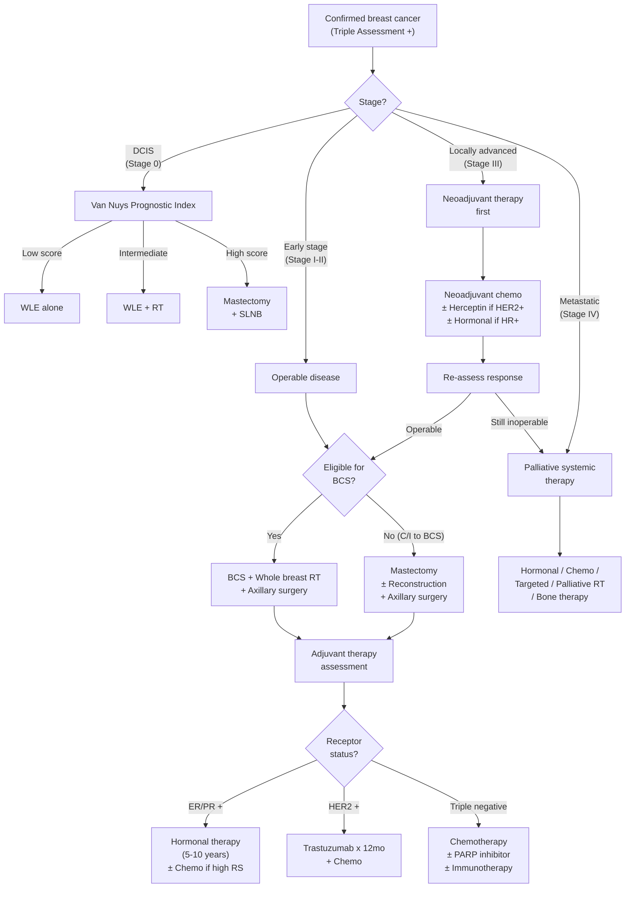
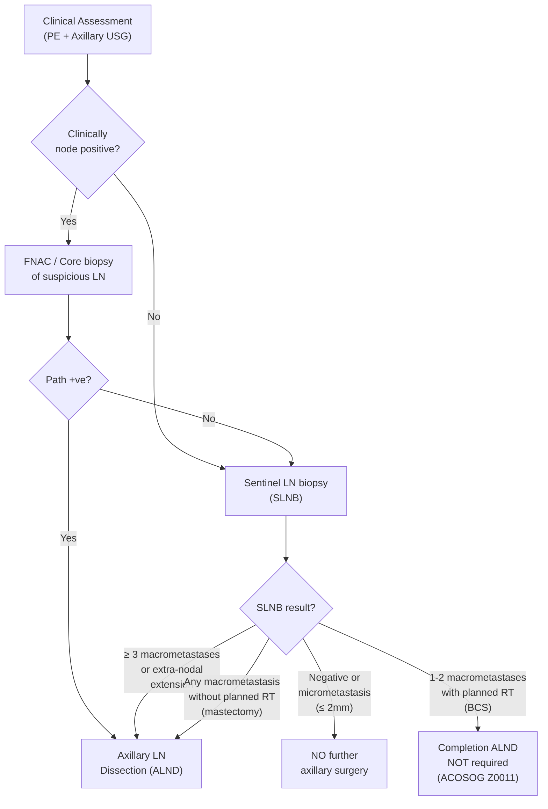

## Management of Breast Cancer — Algorithm, Treatment Modalities, Indications & Contraindications

---

### 1. Overarching Treatment Philosophy

Before diving into specifics, understand the two fundamental goals of breast cancer treatment and the therapeutic "weapons" available [12][13]:

**Goals:**
1. ***Locoregional control*** → Surgery + Radiotherapy
2. ***Systemic control*** → Chemotherapy + Hormonal therapy + Targeted therapy

***Choice of treatment depends on*** [12]:
- ***Type of initial surgical treatment***
- ***Age / menopausal status***
- ***Tumour size***
- ***Number of involved lymph nodes***
- ***Tumour grade***
- ***Oestrogen / Progesterone receptor status***
- ***HER2 gene amplification***
- ***Gene signatures***

> Think of it as two parallel battlefields: the **local** battlefield (the breast and axilla — controlled by the surgeon and radiation oncologist) and the **systemic** battlefield (micrometastatic disease anywhere in the body — controlled by the medical oncologist with drugs). Both must be addressed for cure.

---

### 2. Master Management Algorithm

---

### 3. Surgical Management — The Local Battlefield

***Surgery for breast cancers*** has two components that are planned independently [13][14]:

1. **Breast surgery** — what to do with the primary tumour
2. **Axillary surgery** — what to do with the lymph nodes

***Aims*** [12][13]:
- ***Oncological outcome*** (complete removal of cancer with negative margins)
- ***Cosmetic outcome*** (preserve as much normal tissue as possible)

***Surgical strategy combinations*** [14]:
- ***Mastectomy + SLNB***
- ***Mastectomy + Axillary Dissection (MRM)***
- ***Breast Conserving Surgery (BCS) + SLNB***
- ***BCS + Axillary Dissection***

#### 3.1 Breast Conservation Therapy (BCT)

***BCT = Breast Conservation Surgery (BCS/Wide Local Excision/Lumpectomy) + Post-operative breast irradiation*** [1][12]

This is the preferred approach when feasible because it ***allows women with invasive breast cancer to preserve the breast with good cosmetic result*** [1] while achieving equivalent survival to mastectomy (proven in multiple randomised trials — NSABP B-06, Milan I).

**Principles:**
- ***Complete surgical removal of tumour with negative surgical margins*** [1]
- ***Negative margin defined as "no ink on tumour"*** [2] — meaning no tumour cells at the inked cut surface
  - ***Wider margin does NOT reduce recurrence or improve survival*** because adjuvant whole-breast RT eliminates subclinical foci [2]
  - ***Positive margin (ink on tumour) → > 2× increase in ipsilateral breast tumour recurrence (IBTR)*** [2]
- ***Adjuvant radiotherapy is COMPULSORY in BCT*** to eliminate subclinical foci of disease in the ipsilateral breast [1]

**Selection criteria for BCS** [1]:
- ***Tumour ≤ T2 ( ≤ 5 cm)*** without chest wall or skin involvement
- ***Appropriate tumour-to-breast ratio*** (cosmetically acceptable result after excision)
- ***Tumour is NOT multicentric***
- ***Absence of distant metastasis***
- ***Patient MUST agree to post-operative radiotherapy***

***Contraindications to BCS*** [1][2][12] ***(must know!)***:

| Contraindication | Why |
|---|---|
| ***Multicentric disease (different quadrants)*** [12] | Cannot encompass multiple separate tumour foci in a single excision with acceptable cosmesis |
| ***High tumour-to-breast ratio ( > 20%)*** [2][12] | ***BCS will not result in a good cosmetic result*** [12]; adequate resection would cause significant deformity (can be ***downstaged by neoadjuvant chemo***) [2] |
| ***Diffuse malignant-appearing microcalcifications on imaging*** [1][2] | Suggests widespread DCIS throughout the breast; cannot achieve clear margins with limited excision |
| ***Persistently positive margins after multiple re-excision attempts*** [1][2] | Indicates diffuse/extensive disease not amenable to conservation |
| ***Inflammatory breast cancer*** [2] | Tumour cells diffusely infiltrate dermal lymphatics throughout the breast → cannot achieve local control with limited excision |
| ***Tumour too close to or involving NAC*** [2][12] | ***Cancer underneath nipple or nipple involvement*** [12] |
| ***Where radiation therapy is contraindicated*** [12]: | |
| — ***Pregnancy*** (1st/2nd trimester) [12] | Radiation is teratogenic; possible in 3rd trimester (defer RT until after delivery) [1] |
| — ***Prior history of therapeutic radiation to the affected chest wall/breast*** [1][12] | Combined doses would be excessively high → unacceptable toxicity |
| — ***Connective tissue disease (e.g., SLE, scleroderma, Sjögren's)*** [2][12] | Poor skin/tissue healing; fistula formation; abnormal fibrotic response to radiation |
| ***Patient choice (refuses adjuvant RT)*** [2] | BCT without RT has unacceptably high local recurrence rate |
| ***Prophylactic intent (e.g., BRCA carrier)*** [2] | Prophylactic mastectomy removes all breast tissue to maximise risk reduction |

***Relative contraindication*** [12]:
- ***Multifocal disease (same quadrant)*** — may still be resectable in a single excision if feasible

#### 3.2 Mastectomy

***Indications*** [2]:
- ***Contraindication to BCS*** (any of the above)
- ***Patient choice*** (desire to avoid post-operative radiation, further screening, or biopsy)
- ***Prophylaxis*** for patients with BRCA1/2 mutations or hereditary breast-ovarian syndrome [1]
- ***Similar efficacy to BCS*** (mastectomy does not improve survival over BCT — it simply removes more tissue) [2]

**Types of Mastectomy:**

| Type | What Is Removed | What Is Preserved | Indications | Contraindications |
|---|---|---|---|---|
| ***Simple (total) mastectomy*** | All breast tissue + nipple-areolar complex (NAC) | Axillary contents, pectoral muscles | ***Clinically node-negative*** (SLNB performed separately) [1] | — |
| ***Skin-sparing mastectomy*** | Breast parenchyma + NAC | ***Overlying breast skin envelope + inframammary fold*** [1] | ***Therapeutic mastectomy with immediate reconstruction*** (DCIS, Stage I–III invasive); ***prophylactic mastectomy*** [1] | ***Inflammatory breast cancer*** (cancer cells in dermal lymphatics — keeping the skin risks leaving cancer behind) [1] |
| ***Nipple-areolar sparing mastectomy*** | Breast parenchyma + major ducts from nipple lumen | ***NAC dermis and epidermis + skin envelope*** [1] | ***Small-to-moderate breasts with minimal ptosis; tumour < 2 cm with tumour-to-NAC distance > 2 cm***; prophylactic mastectomy [1] | ***Inflammatory breast cancer; Paget's disease of the nipple; nipple changes or discharge*** [1] |
| ***Modified radical mastectomy (MRM)*** | ***Whole breast + overlying skin + axillary LN (Level I + II)*** [2] | Pectoral muscles | ***Clinically node-positive disease*** [2] | — |
| ***Radical mastectomy (Halsted)*** | Breast + skin + pectoralis major + axillary LN | — | ***Not performed*** in modern practice due to excessive morbidity without survival benefit [2] | — |

> **Why did we move away from radical mastectomy?** Halsted in the 1890s believed cancer spread in an orderly centrifugal fashion — remove more tissue, better cure. The Fisher hypothesis (1970s) revolutionised thinking: breast cancer is a systemic disease from early on, and local control (whether by mastectomy or BCT + RT) combined with systemic therapy determines survival, not the extent of surgery alone. This is why BCT achieves equivalent survival to mastectomy.

**Practical surgical details** [2]:
- ***Drains: Jackson-Pratt drain (closed suction)*** — placed through separate stab wounds inferolateral to main incision; ± 2nd drain at axilla if MRM
- ***Remove drains if output < 30 mL/day × 2 days*** [2]
- ***Locally advanced cases***: may require removal of part of pectoralis muscle for margin; ***place clips in anticipation of subsequent RT***; positive margin → adjuvant RT [2]

#### 3.3 Breast Reconstruction

| Timing | Detail |
|---|---|
| ***Immediate reconstruction*** | Performed at the time of mastectomy. ***Advantages: superior cosmetic results, reduced surgical costs, reduced psychosocial impact of breast loss, spares another surgery*** [1] |
| ***Delayed reconstruction*** | ***Indicated in patients requiring post-operative radiotherapy*** [1] (RT causes fibrosis and contracture of reconstructed tissue, compromising cosmetic result) |

**Methods:**
- ***Autologous tissue flaps*** — e.g., TRAM (transverse rectus abdominis myocutaneous) flap, DIEP (deep inferior epigastric perforator) flap, latissimus dorsi flap
- ***Implant-based*** [13]:
  - **One-stage:** Permanent implant inserted at time of mastectomy
  - **Two-stage:** Tissue expander placed at mastectomy → gradually inflated → replaced with permanent implant [1]

---

### 4. Axillary Management — The Lymph Node Question

The axilla is managed independently from the breast. The key question is: **Are the lymph nodes involved?** [1]

#### 4.1 Sentinel Lymph Node Biopsy (SLNB)

***The sentinel LN is the first draining LN group — the "gatekeeper" of the rest of the axillary LN*** [2][12].

***Purpose:*** ***To find the first lymph node which drains the tumour*** [12]. If the sentinel node is negative, the remainder of the axilla is overwhelmingly likely to be negative too, and the patient is spared the morbidity of full axillary dissection.

***Indications*** [1][2]:
- ***Early breast cancer with clinically negative nodes*** (for staging the axilla with less morbidity than ALND)
- ***Early stage (T1 or T2) cancer*** [1]
- ***DCIS with planned mastectomy*** (because SLNB cannot be done after mastectomy if occult invasive cancer is found — the lymphatic drainage is permanently altered) [1]
- ***DCIS with suspicious features*** (suspicion of harbouring synchronous invasive cancer: > 5 cm, palpable mass, high-grade/comedo) [1]

***Contraindications*** [1]:
- **Absolute:**
  - ***Clinically positive nodes*** (should proceed directly to ALND)
  - ***Inflammatory breast cancer (T4d)*** (should be treated with ALND)
- **Relative:**
  - ***Tumour > 5 cm (T3)***
  - ***Tumour with chest wall or skin involvement (T4a–T4c)***
  - ***Previous breast or axillary procedures*** (disruption of lymphatic drainage → increased false-negative rate)

***Technique*** [1][2][12]:
- ***Dual tracer injection*** to intradermal / subareolar / intratumoral region [2]:
  - ***Technetium-99m-labelled albumin*** — injected the day before surgery; detected intra-operatively by gamma probe [2]. ***Contraindicated in pregnancy*** [2].
  - ***Blue dye (methylene blue / isosulfan blue)*** — injected intra-operatively for ***direct visualisation*** of blue lymphatic channels and nodes [2]
- ***Injection should not be close to axilla*** (avoids interference) and ***lateral to previous scars*** (may block lymphatic drainage) [2]
- ***Remove maximum 3–4 sentinel LN*** [2] (HK practice: up to 4) [1]
- ***Frozen section of the LN to be done intraoperatively*** [12] — if positive, can proceed to ALND in the same operation

**SLN Identification** [1]:
- By blue dye: any blue node or any non-blue node with blue afferent lymphatic
- By radioactivity: remove the node with highest radioactive count (gamma probe); subsequent nodes removed by the ***"10% rule"*** — all nodes with > 10% of the ex vivo count of the hottest node should also be removed [1]

***Results and management*** [2]:

| SLNB Finding | Management |
|---|---|
| ***No metastasis*** | ***No further axillary surgery*** |
| ***Micrometastasis (≤ 2 mm)*** | ***No further axillary surgery*** |
| ***Macrometastasis ( > 2 mm) × 1–2 LN, with planned RT (BCS)*** | ***Completion ALND NOT required*** (per ACOSOG Z0011 trial) [12] — ***with Z0011 study, for suitable patients with minimal tumour load in the axillary LN and receiving breast conservation surgery and radiation, axillary dissection may not be necessary*** [12] |
| ***Macrometastasis × ≥ 3 LN*** | ***Axillary dissection*** [2] |
| ***Extra-nodal extension*** | ***Axillary dissection*** [2] |
| ***Sentinel LN not found*** | ***Axillary dissection*** [2] |

**Limitations of SLNB** [2]:
- ***False-negative rate: 9.8%*** (NSABP B-32 trial)
- ***Only 75% of lymphatics drain to axilla*** (some drain to internal mammary chain)
- Skip metastases possible

**New advancements** [2]: ICG (indocyanine green fluorescence), SPIO (supra-paramagnetic iron oxide) — non-radioactive alternatives.

#### 4.2 Axillary Lymph Node Dissection (ALND)

***Indications*** [1][2]:
- ***Clinically positive nodes*** (by palpation / USG axilla)
- ***Positive sentinel LN*** (per criteria above — all patients receiving mastectomy without radiation with any macrometastasis; > 2 positive SLNs in BCT patients)
- ***Inflammatory breast cancer (T4d)*** [2]

***Extent of resection*** [1][2]:
- ***Standard: Level I (lateral to pec minor) + Level II (deep to pec minor)*** — typically yields ≥ 10 lymph nodes [1]
- ***Level III dissection is NOT indicated unless grossly positive Level III nodes*** — increases morbidity significantly without improving survival; skip metastasis to Level III is rare [1][2]

***Structures to preserve*** [1]:
- Thoracodorsal artery, vein, and nerve
- Long thoracic nerve

***Complications of ALND*** [2] — **remember the 4 nerves**:

| Complication | Mechanism |
|---|---|
| ***Seroma*** | Disruption of lymphatic channels → fluid collection |
| ***Long thoracic nerve injury*** | ***Winged scapula*** (denervation of serratus anterior → inability to protract scapula → medial border protrudes) |
| ***Thoracodorsal nerve injury*** | ***Weakness of latissimus dorsi → weak adduction and internal rotation of shoulder*** |
| ***Medial pectoral nerve injury*** | ***Denervation of pectoralis major*** → wasting |
| ***Intercostobrachial nerve injury*** | ***Paraesthesia of axilla, medial arm, and lateral chest wall*** (this is a sensory nerve — T2 intercostal branch that crosses the axilla; almost always sacrificed in ALND) |
| ***Upper limb lymphoedema*** | Disruption of axillary lymphatic drainage → chronic limb swelling; management = ***pneumatic compression device*** [2] |
| ***Upper limb lymphangiosarcoma*** | ***Stewart-Treves syndrome*** — rare malignant transformation in chronically lymphoedematous limb (years after ALND) [2] |

---

### 5. Adjuvant (Systemic) Therapy — The Systemic Battlefield

***All patients must be assessed for adjuvant therapies*** [2]. The decision depends on:
- **Patient factors:** age, menopausal status, medical comorbidities (especially cardiac and renal), family/social situation
- **Tumour factors:** size, axillary LN status, ER/PR/HER2 status, tumour histology and grading (Ki67), resection margin, operation performed (BCS vs MRM), genomic studies

#### 5.1 Chemotherapy

##### 5.1.1 Neoadjuvant Chemotherapy

***Given before surgery in operable disease*** [12][15]:

***Rationale*** [1][15]:
- ***Reduce size of tumour → increase breast conservation surgery rate*** [15]
- ***Improve local control and long-term outcome*** [15]
- ***Especially if complete pathological response*** (pCR) — ***likely to translate to improvement of long-term outcome*** [15]
- Provide ***prognostic*** information (response to neoadjuvant therapy predicts outcome) [2]
- Allow addition of different adjuvant regimens [2]

***Indications*** [1][2]:
- ***Locally advanced (T3 or Stage III) cancer that is inoperable*** [2]
- ***Large operable tumour that may be converted from mastectomy to BCS*** [2]
- ***Limited node-positive (cN1) cancer*** — conversion from cN1 to cN0 may potentially avoid ALND and convert to SLNB with regional nodal irradiation [1]
- ***HER2-positive or triple-negative breast cancer*** — these subtypes are expected to receive chemotherapy at some point and are associated with higher likelihood of response (higher pCR rates) [1]

***Practical point*** [2]: ***Mark the location of tumour with metal clip / radioactive seed*** before starting neoadjuvant therapy — in case the tumour becomes undetectable after treatment (excellent response), the surgeon needs to know where to operate.

***Disadvantages of neoadjuvant therapy*** [2]:
- ***No proven overall survival benefit compared to adjuvant therapy*** (same drugs, different timing)
- ***May upstage if no response to treatment*** (tumour grows during treatment → opportunity for surgery may be lost)

***Regimen:*** ***Anthracycline-based: Doxorubicin + Cyclophosphamide + Paclitaxel (ACT)*** [1] ± ***Herceptin if HER2+*** [2]

##### 5.1.2 Adjuvant Chemotherapy

***Rationale*** [1]:
- ***↓ Risk of recurrence***
- ***↓ Breast cancer mortality rate***

***Indications*** [1]:

| Subtype | Indication for Adjuvant Chemo |
|---|---|
| ***ER/PR+, HER2−*** | ***High recurrence score (RS) by Gene Expression Profiling*** (OncotypeDX) — chemo benefit likely outweighs risk; see below |
| ***ER/PR−, HER2−*** (triple negative) | ***Chemotherapy is the ONLY form of treatment*** — not candidates for hormonal or targeted therapy [1] |
| ***HER2+*** | Chemo typically given with anti-HER2 therapy |

***Regimens*** [1]:

| Regimen | Components | Notes |
|---|---|---|
| ***Anthracycline-based*** | ***Doxorubicin + Cyclophosphamide + Paclitaxel (ACT)*** | First-line; most commonly used |
| ***Taxane-based*** | Cyclophosphamide + Docetaxel | ***Indicated in patients with cardiac disease*** (anthracyclines are cardiotoxic) |
| ***CMF*** | ***Cyclophosphamide + Methotrexate + Fluorouracil*** | ***Conventional regimen before the era of anthracyclines*** [1]; rarely used now |

##### 5.1.3 Gene Expression Profiling — OncotypeDX (21-Gene Recurrence Score)

This deserves special mention because it is the key tool that determines whether ER+ patients benefit from chemotherapy [1]:

- ***Well-validated gene expression profile to predict chemotherapy benefit for women with ER+ breast cancer and either limited or no nodal involvement***
- Performed on ***formalin-fixed, paraffin-embedded*** tissue of the excised invasive component
- Provides a ***Recurrence Score (RS)***:

| RS | Risk Category | Implication |
|---|---|---|
| ***RS < 18*** | ***Low risk*** | Chemo benefit ***will NOT outweigh*** risk of side effects; tamoxifen alone sufficient |
| ***RS 18–31*** | ***Intermediate risk*** | Unclear whether chemo benefit outweighs risk; benefit ***does not appear to be large*** |
| ***RS > 31*** | ***High risk*** | Chemo benefit ***likely outweighs*** risk; ***↓ recurrence rate with tamoxifen + chemo vs. tamoxifen alone*** |

> **Why is this important?** Without genomic profiling, many ER+ patients received chemotherapy "just in case." OncotypeDX allows us to identify the ~70% of ER+ patients who do NOT benefit from chemo (low RS) — sparing them unnecessary toxicity. Only those with high RS derive meaningful benefit.

#### 5.2 Radiotherapy

***NO role of neoadjuvant radiotherapy*** in breast cancer treatment [1].

##### 5.2.1 Adjuvant Radiotherapy

***Rationale*** [1][2]:
- ***↓ Locoregional recurrence rate***
- ***↓ Breast cancer mortality rate***

| Type | Indications | Complications |
|---|---|---|
| ***Whole Breast Radiation Therapy (WBRT)*** | ***ALL patients undergoing BCS*** (compulsory component of BCT) [1][2]; ***Post-mastectomy patients with high-risk features:*** ***node+ ≥ 4 involved LN***; ***node− T2 with high-grade, high-risk receptor biology, or lymphovascular invasion***; ***T3 or T4 primary***; ***positive surgical margins*** [1][2] | **Short-term:** ***skin fibrosis***, telangiectasia, arm oedema; **Long-term:** rib fracture, ***cardiotoxicity***, ***pulmonary fibrosis/pneumonitis***, ***lymphoedema***, ***RT-induced secondary malignancy*** [1][2] |
| ***Regional Nodal Irradiation*** | ***Node+ ≥ 4 involved LN***; ***node− T2 with high-risk features***; ***T3/T4 primary*** [1] | ***Lymphoedema, axillary fibrosis*** [1] |

> **Why is RT compulsory after BCS?** The surgeon removes the macroscopic tumour, but microscopic disease (subclinical foci) may remain in the surrounding breast tissue. RT sterilises these residual foci, reducing local recurrence from ~30–40% (BCS alone) to ~5–10% (BCS + RT) — making BCT equivalent to mastectomy.

#### 5.3 Hormonal (Endocrine) Therapy

***Indicated in ALL ER/PR+ cases unless contraindicated*** [2].

***Rationale:*** Breast cancers that express ER depend on oestrogen for proliferation. Blocking this pathway → tumour growth arrest and apoptosis. This is the longest-duration adjuvant treatment — ***total treatment for 5–10 years*** [2].

| Agent | Class | Mechanism | Who Can Receive | Side Effects |
|---|---|---|---|---|
| ***Tamoxifen*** | ***SERM (Selective Oestrogen Receptor Modulator)*** | Competitively binds ER in breast tissue → blocks oestrogen from activating proliferative gene transcription. However, acts as an oestrogen *agonist* in the endometrium and bone | ***Pre- and post-menopausal women*** | ***Weight gain, hot flushing, ↑ risk of endometrial carcinoma (agonist effect in uterus), VTE (DVT/PE)*** [2] |
| ***Aromatase Inhibitors (AIs)*** — letrozole, anastrozole, exemestane | ***Aromatase inhibitor*** | Blocks the enzyme aromatase that converts adrenal androgens to oestrogen in peripheral adipose tissue. In post-menopausal women, this is the primary oestrogen source (ovaries are inactive) | ***Post-menopausal women ONLY*** (in pre-menopausal women, ovarian oestrogen production is NOT dependent on aromatase in adipose tissue — so AIs alone are ineffective) | ***Osteoporosis/fractures*** (oestrogen is protective for bone), arthralgia, cardiovascular risk [2] |
| ***GnRH analogues*** (e.g., goserelin) | ***GnRH agonist → ovarian suppression*** | Continuous GnRH stimulation → desensitisation of pituitary → ↓ LH/FSH → ↓ ovarian oestrogen production | ***Pre-menopausal women*** (combined with tamoxifen or exemestane for greater efficacy — ***SOFT, TEXT trials***) [2] | Menopausal symptoms, osteoporosis |
| ***Bilateral oophorectomy*** | ***Surgical ovarian ablation*** | Permanent removal of ovarian oestrogen source | Pre-menopausal (rarely done now) [2] | Surgical menopause |

> ***Hormonal therapy is NOT given concurrently with chemotherapy*** [2]. Why? Tamoxifen arrests breast cancer cell proliferation (G1 arrest). Chemotherapy targets rapidly dividing cells. If you stop cells from dividing (tamoxifen) and then give chemo (which kills dividing cells), the chemo won't work as well — the cancer cells are "hidden" in quiescence. So **chemo first, then endocrine therapy sequentially**.

> ***AIs are more effective than tamoxifen*** in post-menopausal women [2], but both remain valid options. The choice depends on side-effect profile and patient tolerance.

#### 5.4 Targeted Therapy

##### 5.4.1 Anti-HER2 Therapy

***Trastuzumab (Herceptin)*** [1][2]:
- ***IV infusion monthly (Q1mo) × 12 months*** [2]
- ***Indicated in ALL patients with HER2+ breast cancer*** [1] — defined by IHC 3+ or FISH-amplified
- Mechanism: Monoclonal antibody targeting the extracellular domain of HER2 receptor → blocks downstream signalling (RAS-MAPK, PI3K-Akt) → also triggers antibody-dependent cellular cytotoxicity (ADCC)
- ***Side effects: Cardiotoxicity*** [2] — ***not used concurrently with anthracyclines*** (both are cardiotoxic; sequential use reduces cardiac risk); ***hypersensitivity reactions*** [2]

> ***Lapatinib: NOT to be administered in adjuvant setting*** — lack of demonstrated benefit in trials; no role in routine HER2+ adjuvant therapy [1].

##### 5.4.2 PARP Inhibitors

- ***Olaparib*** — indicated for ***high-risk BRCA carriers*** [2]
- Mechanism: BRCA-mutant cells are already deficient in homologous recombination DNA repair. PARP inhibitors block the remaining base excision repair pathway → ***synthetic lethality*** (cancer cells cannot repair DNA by any mechanism → accumulation of lethal DNA damage → apoptosis). Normal cells with one functioning BRCA allele survive.

##### 5.4.3 CDK4/6 Inhibitors

- ***Abemaciclib*** — for ***high-risk ER+ breast cancer*** [2]
- Mechanism: CDK4/6 drive G1→S cell cycle progression; inhibiting them arrests proliferation of ER+ cancer cells (which are particularly dependent on cyclin D-CDK4/6 pathway)

#### 5.5 Other Systemic Therapies

***Bisphosphonates / Denosumab*** [1][2]:
- ***Osteoclast inhibitors — indicated for palliation in patients with bone metastasis*** [1]
- ***Bisphosphonates*** (e.g., pamidronic acid, zoledronic acid): reduce bone resorption → ***improve symptoms of bone pain, reduce skeletal-related events (SREs), improve QOL*** [1]
  - ***SREs = pathological fractures, spinal cord compression, hypercalcaemia of malignancy*** [1]
- ***Denosumab (RANKL monoclonal antibody)*** [1][2]: RANKL is the ligand that activates osteoclasts; blocking it → potent osteoclast inhibition
  - ***Slight benefit over bisphosphonates in preventing SREs and analgesic effect; counterbalanced by greater cost*** [1]
  - ***Advantage: quick monthly SC injection (not a prolonged IV infusion)*** [1]

---

### 6. Treatment by Stage — Putting It All Together

| Stage | Neoadjuvant | Surgery | Adjuvant Systemic | Adjuvant RT |
|---|---|---|---|---|
| ***DCIS (Stage 0)*** | None | ***Van Nuys Index***: Low = WLE; Intermediate = WLE + RT; High = Mastectomy + SLNB [1]. Margin ≥ 2 mm [1]. ALND ***NOT*** indicated for pure DCIS [1] | ***ER/PR+ DCIS → Tamoxifen/AI*** (reduces recurrence/contralateral cancer, no survival benefit) [1]. ***No chemo. No targeted therapy*** [1] | If intermediate score + BCT [1] |
| ***LCIS*** | None | ***Prophylaxis: Bilateral simple mastectomy + reconstruction*** (selected high-risk); otherwise ***close surveillance*** [1] | ***Chemoprevention: Tamoxifen*** [1] | — |
| ***Early (Stage I–II)*** | Consider if ***large tumour convertible from mastectomy to BCS*** [2]; ***HER2+ or TNBC*** (will need chemo anyway, better to give upfront) [1] | ***BCS + SLNB*** (preferred if eligible) ***OR Mastectomy ± reconstruction + SLNB/ALND*** [1] | ***± Chemo*** (based on OncotypeDX for ER+, mandatory for TNBC), ***± Hormonal therapy*** (all ER/PR+), ***± Trastuzumab*** (all HER2+), ***± PARP inhibitor*** (BRCA+) [1][2] | After BCS (WBRT) [1]; after mastectomy if high-risk features [1] |
| ***Locally advanced (Stage III)*** | ***Neoadjuvant chemo ± Herceptin*** [1][2] | ***BCS or Mastectomy*** (depending on response) + ***SLNB or ALND*** [1] | As per receptor status | ***Post-mastectomy RT*** (high-risk); post-BCS WBRT [1] |
| ***Metastatic (Stage IV)*** | — | ***Palliative*** — surgery not for cure; may be used for local symptom control (e.g., fungating tumour) | ***Hormonal therapy*** (ER/PR+), ***Chemo*** (organ metastasis: liver, lung), ***Targeted therapy*** (HER2), ***Bone therapy*** (bisphosphonates/denosumab for bone mets), ***± Immunotherapy*** (TNBC PD-L1+) [2] | ***Palliative RT*** — brain metastasis, cord compression, SVCO, painful bone mets [2]; ***steroids for brain met*** [2] |

---

### 7. Complications of Mastectomy [2]

| Complication | Mechanism / Explanation |
|---|---|
| ***Seroma*** | Lymphatic/serosanguinous fluid collection in dead space after tissue removal |
| ***Haematoma*** | Surgical bleeding |
| ***Wound infection*** | Contamination of surgical site |
| ***Skin flap / NAC necrosis*** (if reconstruction) | Compromised blood supply to the thin skin flaps |
| ***Arm/shoulder pain, numbness, frozen shoulder*** | Nerve injury + post-operative immobility |
| ***Phantom breast syndrome*** | ***Altered chest wall sensation that may persist years after surgery*** [2] — similar to phantom limb pain; the brain's somatosensory cortex retains a "map" of the breast |

---

<Callout title="High Yield Summary — Management of Breast Cancer">

1. ***BCT = BCS + RT (compulsory).*** Equivalent survival to mastectomy. Margin = "no ink on tumour."

2. ***Contraindications to BCS:*** Multicentric disease, high tumour-breast ratio, diffuse microcalcifications, persistent positive margins, IBC, C/I to RT (pregnancy, prior RT, CTD), patient refusal of RT.

3. ***SLNB:*** For clinically node-negative early stage. Dual tracer (Tc-99m + blue dye). Max 3–4 nodes. If 1–2 positive SLN + planned RT (BCS) → ALND may NOT be needed (Z0011).

4. ***ALND:*** Clinically positive nodes, ≥ 3 positive SLN, IBC. Standard = Level I + II. Level III only if grossly positive.

5. ***Neoadjuvant chemo:*** Locally advanced/inoperable; downstage to enable BCS; mark tumour with clip/seed. Especially effective in HER2+ and TNBC (high pCR rate).

6. ***Adjuvant chemo:*** High OncotypeDX RS for ER+/HER2−; all TNBC; with trastuzumab for HER2+.

7. ***Hormonal therapy (5–10 years):*** All ER/PR+. Tamoxifen (pre/post-menopausal); AI (post-menopausal only, more effective); GnRH agonist (pre-menopausal). NOT concurrent with chemo.

8. ***Trastuzumab:*** All HER2+; IV Q1mo × 12mo. S/E = cardiotoxicity (not concurrent with anthracyclines).

9. ***Palliative:*** Bone mets → bisphosphonates/denosumab. Brain mets/cord compression/SVCO → RT ± steroids.

10. ***ALND complications:*** Long thoracic nerve (winged scapula), thoracodorsal nerve (weak shoulder adduction/IR), intercostobrachial nerve (paraesthesia medial arm), lymphoedema, Stewart-Treves syndrome.

</Callout>

---

<ActiveRecallQuiz
  title="Active Recall - Management of Breast Cancer"
  items={[
    {
      question: "List 6 contraindications to breast-conserving surgery. For each, explain why BCS is not appropriate.",
      markscheme: "(1) Multicentric disease - cannot encompass separate quadrant foci in one excision. (2) High tumour-to-breast ratio (>20%) - poor cosmetic result. (3) Diffuse malignant microcalcifications - suggests widespread DCIS, cannot achieve clear margins. (4) Persistently positive margins - indicates diffuse disease. (5) Inflammatory breast cancer - tumour cells in dermal lymphatics throughout breast. (6) C/I to RT (pregnancy 1st/2nd trimester, prior chest RT, connective tissue disease like scleroderma) - RT is compulsory after BCS. Also: patient refuses RT, prophylactic intent (BRCA carrier)."
    },
    {
      question: "Describe the ACOSOG Z0011 trial finding and its clinical significance for axillary management after sentinel lymph node biopsy.",
      markscheme: "Z0011 found that for patients with 1-2 positive sentinel lymph nodes undergoing BCS with planned whole-breast RT, completion axillary dissection did NOT improve overall survival, disease-free survival, or locoregional recurrence compared to no further axillary surgery. Clinical significance: suitable patients with minimal tumour load in axillary LN receiving BCT can be spared ALND and its morbidity (lymphoedema, nerve injuries, frozen shoulder)."
    },
    {
      question: "A 52-year-old post-menopausal woman has ER+/PR+/HER2- breast cancer with OncotypeDX RS of 35. What adjuvant systemic therapy would you recommend and why?",
      markscheme: "RS >31 = high risk. Recommend: (1) Adjuvant chemotherapy (anthracycline-based: ACT - doxorubicin + cyclophosphamide + paclitaxel) because benefit of chemo outweighs risk at high RS - reduces distant recurrence when added to tamoxifen. (2) After chemo completion, aromatase inhibitor (e.g., letrozole) for 5-10 years (post-menopausal, more effective than tamoxifen). Hormonal therapy NOT concurrent with chemo because tamoxifen arrests cell cycling, reducing chemo efficacy."
    },
    {
      question: "Explain the rationale for neoadjuvant chemotherapy in breast cancer. What must be done before starting neoadjuvant therapy and why?",
      markscheme: "Rationale: (1) Tumour shrinkage to increase BCS rate (convert from mastectomy to BCS). (2) Improve local control. (3) Provides prognostic information (pCR predicts better outcome). (4) Allows addition of different adjuvant regimens. Before starting: mark tumour location with metal clip or radioactive seed - because if tumour becomes undetectable after treatment (complete clinical response), surgeon needs to know where to operate. Disadvantage: may upstage if no response."
    },
    {
      question: "Name the 4 nerves at risk during axillary lymph node dissection and the clinical consequence of injuring each.",
      markscheme: "(1) Long thoracic nerve - winged scapula (serratus anterior denervation). (2) Thoracodorsal nerve - weakness of latissimus dorsi (weak shoulder adduction and internal rotation). (3) Medial pectoral nerve - wasting of pectoralis major. (4) Intercostobrachial nerve - paraesthesia of axilla, medial arm, and lateral chest wall (sensory nerve, almost always sacrificed). Also: lymphoedema from lymphatic disruption; late: Stewart-Treves syndrome (lymphangiosarcoma)."
    },
    {
      question: "Why are aromatase inhibitors only used in post-menopausal women? Why is hormonal therapy not given concurrently with chemotherapy?",
      markscheme: "AIs block aromatase enzyme converting adrenal androgens to oestrogen in peripheral adipose tissue. In post-menopausal women, this is the primary oestrogen source (ovaries inactive), so AIs effectively suppress oestrogen. In pre-menopausal women, the ovaries are the dominant oestrogen source and are NOT dependent on peripheral aromatase - so AIs alone are ineffective (unless combined with ovarian suppression by GnRH agonist). Hormonal therapy not concurrent with chemo: tamoxifen arrests cell cycle (G1 arrest), but chemo targets rapidly dividing cells. If cells are arrested, chemo cannot kill them effectively - so chemo is given first, then hormonal therapy sequentially."
    }
  ]}
/>

---

## References

[1] Senior notes: felixlai.md (Sections on BCT, mastectomy types, breast reconstruction, lymph node management, SLNB, ALND, chemotherapy, radiotherapy, hormonal therapy, targeted therapy, bisphosphonates, DCIS/LCIS management, gene expression profiling, treatment by stage)
[2] Senior notes: maxim.md (Sections on BCS, mastectomy, axillary management, SLNB, ALND, adjuvant therapy assessment table, neoadjuvant therapy, palliative therapy, complications)
[12] Lecture slides: The Managment of breast cancer_Prof A Kwong 20_2_2020.pdf (pp. 37, 39, 42, 55, 68)
[13] Lecture slides: GC 181. Breast mass breast cancer; benign breast diseases; mammography; breast cancer screening.pdf (pp. 32, 36)
[14] Lecture slides: GC 181. Breast mass breast cancer; benign breast diseases; mammography; breast cancer screening.pdf (p. 44)
[15] Lecture slides: The Managment of breast cancer_Prof A Kwong 20_2_2020.pdf (p. 68)
