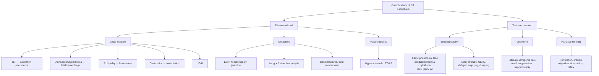

## Complications of CA Esophagus

Complications of esophageal cancer fall into two broad categories: **(A) complications of the disease itself** (the tumour doing damage) and **(B) complications of treatment** (the price we pay for attempting to cure or palliate it). Both are high-yield and commonly tested.

---

### A. Complications of the Disease (Tumour-Related)

These complications arise directly from the tumour's local invasion, lymphatic/hematogenous spread, and systemic metabolic effects. They follow logically from the anatomy covered in Part 1 — the esophagus sits in the mediastinum surrounded by vital structures, and it has no serosal barrier to slow invasion.

#### 1. Tracheoesophageal Fistula (TEF) and Aspiration Pneumonia

| Feature | Detail |
|---|---|
| **Mechanism** | The esophagus and trachea/left main bronchus are in direct contact in the upper and mid-thorax. Tumour (usually mid-esophageal SCC) invades through the adventitia into the posterior membranous wall of the trachea or bronchus, creating an abnormal communication — a fistula. Swallowed food and saliva pass directly into the airway. |
| ***Clinical presentation*** | ***Aspiration pneumonia — secondary to formation of tracheobronchial fistula*** [1]; coughing on swallowing (pathognomonic — Ono's sign); recurrent lower respiratory tract infections; choking; fever |
| **Why it matters** | TEF is a devastating complication — once established, the patient aspirates with every swallow. Median survival after TEF formation is measured in weeks without intervention. |
| **Management** | Covered esophageal stent (SEMS) to seal the fistula; covered tracheal/bronchial stent ("double stenting" if needed); palliative RT may help shrink tumour around the fistula; NPO + nutritional support (PEG/jejunostomy); antibiotics for aspiration pneumonia |

**Why does TEF occur so readily in esophageal cancer?** The posterior wall of the trachea is membranous (no cartilaginous rings posteriorly) — it is the weakest part of the trachea. The esophagus lies directly behind it with only loose adventitial connective tissue between. With no esophageal serosa to slow invasion, the tumour erodes through both walls relatively quickly.

<Callout title="TEF from Radiation — An Iatrogenic Risk" type="error">
TEF can also be ***iatrogenic*** — radiotherapy causes tumour necrosis, and if the tumour is invading the trachea, necrosis of the tumour tissue creates a fistula. This is why ***bronchoscopy is performed for upper/mid tumours*** and ***tracheal stenting may be placed before RT*** to prevent this complication [2].
</Callout>

#### 2. Aortoesophageal Fistula — Massive Hemorrhage

| Feature | Detail |
|---|---|
| **Mechanism** | Tumour (or stent erosion, or post-RT necrosis) invades through the esophageal wall into the aorta or its branches (esophageal arteries, pulmonary arteries). The high-pressure arterial system is then in direct communication with the esophageal lumen. |
| ***Clinical presentation*** | ***Massive bleeding from aorta — secondary to infiltration of tumour into aorta*** [1]; presents as catastrophic hematemesis; often preceded by a "herald bleed" (small sentinel bleed hours to days before the fatal exsanguination) |
| **Prognosis** | Almost universally fatal — exsanguination occurs within minutes |
| **Management** | Resuscitation is often futile; thoracic endovascular aortic repair (TEVAR) has been attempted in rare cases; palliative/supportive care |

**Charcot's triad of aortoesophageal fistula** (classic but rarely tested): mid-thoracic pain → herald bleed → exsanguinating hematemesis after a symptom-free interval.

#### 3. Recurrent Laryngeal Nerve Palsy (Hoarseness)

| Feature | Detail |
|---|---|
| **Mechanism** | The left recurrent laryngeal nerve (RLN) loops under the aortic arch and ascends in the tracheoesophageal groove. Mid/upper thoracic esophageal tumours or metastatic mediastinal lymph nodes compress or invade the nerve → ipsilateral vocal cord paralysis → breathy hoarseness. |
| **Clinical significance** | Hoarseness in a patient with esophageal cancer indicates **locally advanced disease** — usually T4 or significant nodal disease in the aortopulmonary window. It may preclude curative resection. |
| **Consequence** | Beyond hoarseness, a paralysed vocal cord cannot close properly during swallowing → aspiration risk (the glottis cannot seal the airway). This compounds the aspiration risk from TEF or regurgitation. |

#### 4. Esophageal Obstruction → Malnutrition and Dehydration

| Feature | Detail |
|---|---|
| **Mechanism** | Progressive tumour growth narrows the lumen. Dysphagia appears when ≥ 60–75% of the lumen is obstructed (lumen < 13 mm). As the tumour grows further, even liquids cannot pass. |
| **Consequences** | Severe weight loss (cancer cachexia amplified by starvation); dehydration → pre-renal AKI; electrolyte derangements (hypokalemia, hyponatremia from vomiting); micronutrient deficiency; immunosuppression → susceptibility to infection |
| **Management** | Esophageal stenting or dilatation; nutritional support (PEG, jejunostomy, TPN); rehydration |

#### 5. Upper GI Hemorrhage

| Feature | Detail |
|---|---|
| **Mechanism** | Ulceration of the friable tumour surface → chronic low-grade bleeding (occult) → iron deficiency anemia. Rarely, erosion into a major vessel (aorta, pulmonary artery) → acute catastrophic UGIB (see aortoesophageal fistula above). |
| **Presentation** | Chronic: pallor, fatigue, microcytic anemia. Acute: hematemesis, melena, hemodynamic instability |

#### 6. Metastatic Complications

These arise from hematogenous and lymphatic spread:

| Site | Complication | Mechanism |
|---|---|---|
| **Liver** | Hepatomegaly, jaundice, ascites, liver failure | Metastatic deposits replace hepatic parenchyma; portal vein/hepatic vein involvement |
| **Lung** | Cough, hemoptysis, dyspnea, pleural effusion | Parenchymal metastases; lymphangitis carcinomatosis; malignant pleural effusion |
| **Bone** | Pathological fractures, spinal cord compression, hypercalcemia | Osteolytic metastases weaken bone; vertebral collapse can compress the spinal cord |
| **Adrenal** | Usually asymptomatic; rarely adrenal insufficiency | Bilateral adrenal metastases (uncommon to cause clinical insufficiency) |
| **Brain** | Headache, seizures, focal neurological deficits | Parenchymal metastases with surrounding edema |

#### 7. Paraneoplastic Syndromes

| Syndrome | Mechanism | Histology |
|---|---|---|
| ***Hypercalcaemia of malignancy (HHM)*** | ***PTHrP secretion (10% of SCC)*** [2] — PTH-related peptide mimics PTH → ↑ osteoclastic bone resorption + ↑ renal calcium reabsorption | SCC predominantly |
| Hypertrophic osteoarthropathy | Periosteal new bone formation in long bones; clubbing; joint pain; mechanism uncertain (VEGF, PDGF release?) | Both histologies |

<Callout title="Hypercalcaemia in Esophageal SCC">
***Hypercalcaemia: HHM — PTHrP (10%)*** [2]. If a patient with known esophageal SCC becomes confused, constipated, and polyuric, check the corrected calcium. Hypercalcaemia of malignancy is the most common metabolic emergency in cancer and is treated with aggressive IV hydration + IV zoledronic acid (bisphosphonate) + calcitonin for rapid effect.
</Callout>

---

### B. Complications of Treatment

#### B1. Complications of Esophagectomy [1][2]

Esophagectomy is one of the highest-morbidity operations in surgery. Understanding complications from first principles requires knowing what gets disturbed during the operation.

##### Early Complications (Post-operative)

| Complication | Incidence | Mechanism (First Principles) | Diagnosis and Management |
|---|---|---|---|
| ***Pulmonary complications*** [1] | — | — | — |
| ***Atelectasis*** [1] | Very common | ***One-lung ventilation during surgery*** [2] collapses the operative lung; post-op pain causes splinting → shallow breathing → mucus plugging → lobar/segmental collapse | CXR: loss of volume, opacification; Rx: ***chest physiotherapy, encourage coughing, deep breathing, early mobilisation*** [1] |
| ***Pneumonia*** [1] | ***20%*** [2] | ***Due to smoker status, thoracotomy, one-lung ventilation, vocal cord palsy*** [2] — all contribute to poor secretion clearance and aspiration risk | Sputum culture; antibiotics; chest physiotherapy |
| **Bronchospasm** [1] | — | Irritation of airways during one-lung ventilation; pre-existing COPD/asthma | Nebulised bronchodilators |
| **ARDS** [1] | Rare | Systemic inflammatory response to major surgery; fluid overload; aspiration; sepsis | Ventilatory support in ICU; lung-protective ventilation |
| ***Pulmonary embolism*** [1] | — | Venous stasis (prolonged surgery + post-op immobility) + hypercoagulability of malignancy → DVT → PE | CTPA; therapeutic anticoagulation; prophylaxis: LMWH + TED stockings + early mobilisation |
| **Respiratory failure** [1] | — | Culmination of multiple pulmonary insults (atelectasis + pneumonia + effusion + pain) | Ventilatory support; address underlying cause |
| ***Cardiac complications*** [1] | — | — | — |
| ***Atrial fibrillation (AF)*** [1] | ~15–25% | Mediastinal dissection irritates the vagus nerve and pericardium; fluid shifts; electrolyte imbalances (hypokalemia, hypomagnesemia); systemic inflammatory response | Rate control (beta-blockers, amiodarone); correct electrolytes; often self-limiting |
| ***Myocardial infarction*** [1] | Rare | Demand ischemia (tachycardia + hypotension + anemia in a patient with pre-existing coronary disease) | Troponin, ECG; cardiology input |

##### Conduit-Related Complications

| Complication | Incidence | Mechanism (First Principles) | Diagnosis and Management |
|---|---|---|---|
| ***Anastomotic leak*** [1][2] | ***10%*** [2] | The anastomosis between the gastric conduit and the remaining esophagus fails to heal. ***Risk factors: poor blood supply of esophagus, tension of conduit, absence of serosa, use of neoadjuvant RT, surgeon technique*** [2]. The ***esophagus lacks serosa*** → no serosal seal to protect the anastomosis. The conduit's blood supply is tenuous at its tip (furthest from the right gastroepiploic artery). | ***Patient is usually kept NPO 5–7 days following surgery*** [1]; ***gastrografin swallow can be performed to check for leak from day 5–7 before initiating oral intake*** [1]; Rx: ***NPO, IV fluids, TPN, antibiotics, monitor drain output*** [2]; ***cervical anastomotic leak: lay open wound for drainage*** (three-stage only) [1][2]; ***intrathoracic leak: associated with high mortality rate; large or poorly drained leaks require operative exploration*** [1]; ***endoscopic: stenting, endoscopic vacuum therapy (EndoSponge)*** [2] |
| ***Conduit ischaemia*** [2] | — | The gastric conduit survives on the right gastroepiploic and right gastric arteries after ligation of left-sided supply. The conduit tip (furthest from the blood supply) is most vulnerable. Complete ischaemia = conduit necrosis — a surgical emergency. | ***Suspect if sepsis or metabolic acidosis within first 24 hours*** [2]; ***prevention: intraoperative ICG*** (indocyanine green fluorescence angiography) [2]; ***investigations: CT thorax + abdomen with contrast, OGD*** [2]; ***conservative if mild (Types 1/2); take down anastomosis if severe (Type 3): cervical esophagostomy + resection of ischaemic conduit*** [2] |
| ***Anastomotic stricture*** [1][2] | Late | Scar tissue formation at the anastomosis during healing → progressive narrowing → recurrent dysphagia weeks to months post-op | ***Requires endoscopic dilation*** [2]; may need multiple sessions; refractory strictures may need temporary stenting |

**Why is anastomotic leak the most feared complication?** Consider the location:
- ***Intrathoracic anastomosis (Ivor-Lewis)***: leak → saliva, gastric contents, and bacteria spill into the mediastinum → ***mediastinitis*** → sepsis → multi-organ failure. Mortality 30–50%.
- ***Cervical anastomosis (McKeown)***: leak → drains externally through the neck wound → ***much safer***, can be managed by laying the wound open. This is why some surgeons prefer the McKeown approach despite its higher leak rate — the consequences of a leak are far less severe [2].

##### Injury to Neighbouring Structures

| Structure Injured | Incidence | Consequence | Management |
|---|---|---|---|
| ***Recurrent laryngeal nerve (RLN)*** [1][2] | ***20%*** [2] — ***during LN dissection*** | ***Hoarseness; increased risk of aspiration pneumonia*** [1] (paralysed vocal cord cannot protect the airway during swallowing) | Speech therapy; medialization thyroplasty if persistent; swallowing precautions |
| ***Vagus nerve*** [2] | Virtually universal | ***Delayed gastric emptying*** [2] — vagal denervation → loss of coordinated gastric motility → gastroparesis | ***Routine pyloroplasty*** is performed at the time of surgery to pre-empt this [2]; post-op prokinetics (metoclopramide, erythromycin) |
| ***Thoracic duct*** [1][2] | — | ***Chylothorax*** — chyle (lymphatic fluid rich in triglycerides and chylomicrons) leaks into the pleural space | ***Diagnosis: increase in chest tube output + change from serosanguinous to milky appearance with enteral alimentation*** [1]; ***output is not milky initially due to absence of fat ingestion immediately post-operatively*** [1]; ***TG > 110 mg/dL or chylomicrons in pleural fluid is diagnostic*** [1][2]; Rx: ***NPO + TPN; octreotide; surgical ligation (right thoracotomy + ligation of thoracic duct stump) if output > 1 L/day*** [1][2] |
| ***Other organs*** [2] | Rare | ***Descending aorta, pulmonary vein, trachea/bronchus, heart*** — intraoperative injury | Immediate surgical repair |

<Callout title="Chylothorax — Why the Drain Is NOT Milky on Day 1">
***Output is not milky initially due to absence of fat ingestion immediately post-operatively*** [1]. The patient is NPO post-operatively and receiving TPN (which goes straight into the bloodstream). Only when enteral feeding is started and dietary fat is absorbed via lacteals → thoracic duct → does the leak become milky. This is why chylothorax may not be recognised until day 2–3 when enteral feeds (via jejunostomy) begin. The key is to watch for a ***sudden increase in drain output*** that changes character.
</Callout>

##### Late Complications [1][2]

| Complication | Mechanism | Management |
|---|---|---|
| ***Anastomotic stricture*** [1][2] | Fibrosis at the anastomosis → progressive dysphagia | ***Endoscopic dilation*** [2]; refractory cases may need stenting or surgical revision |
| ***Post-operative GERD*** [1][2] | The gastric conduit has no sphincter mechanism; it is essentially an open tube from the neck/thorax to the stomach → free reflux | ***PPI, motility agents*** [2]; elevate head of bed; dietary modification |
| ***Biliary reflux*** [2] | Bile from the duodenum refluxes into the gastric conduit and upwards — PPI is ineffective because bile reflux is alkaline, not acidic | Sucralfate (mucosal protection); bile acid binders (cholestyramine); prokinetics |
| ***Delayed gastric emptying*** [1][2] | Vagotomy (see above) despite pyloroplasty | Prokinetics; dietary modification (small frequent meals); rarely endoscopic pyloric intervention |
| **Dumping syndrome** | Loss of pyloric regulation (pyloroplasty + vagotomy) → rapid emptying of hyperosmolar content into small bowel → early dumping (fluid shifts → vasomotor symptoms within 30 min of eating) and late dumping (reactive hypoglycaemia 1–3 hours post-meal) | Dietary modification (small, frequent, low-carbohydrate meals); acarbose for late dumping; octreotide for refractory cases |
| ***Functional disorders*** [1] | ***GERD, dysphagia, delayed gastric emptying*** [1] — all grouped under this umbrella | Multifaceted approach as above |

#### B2. Complications of Chemotherapy and Radiotherapy [2]

| Complication | Mechanism |
|---|---|
| ***RT-induced fibrosis*** [2] | Radiation damages connective tissue → progressive fibrosis of the mediastinum and esophageal bed months to years later → stricture, dysmotility |
| ***Worsened dysphagia*** [2] | Radiation-induced mucosal oedema and inflammation during treatment → transient worsening before improvement; long-term stricture |
| **Radiation esophagitis** | Acute mucosal inflammation → odynophagia, dysphagia; self-limiting but distressing |
| **Iatrogenic TEF** | Tumour necrosis from RT in a tumour invading the trachea → fistula formation (see above) |
| **Myelosuppression** | Chemotherapy (cisplatin, 5-FU) → bone marrow suppression → neutropenia, anemia, thrombocytopenia |
| **Nephrotoxicity** | Cisplatin is directly nephrotoxic (proximal tubular damage) → aggressive hydration and renal monitoring is mandatory |
| **Mucositis** | 5-FU and radiation → oral and esophageal mucosal breakdown → pain, infection risk |

#### B3. Complications of Palliative Stenting [1]

| Complication | Mechanism |
|---|---|
| ***Perforation*** [1] | Dilation before stent placement or stent expansion forces → esophageal wall rupture |
| ***Erosion*** [1] | Stent edges erode into the esophageal or tracheal wall over time → fistula or bleeding |
| ***Obstruction of tube*** [1] | Tumour ingrowth through uncovered portions of the stent; food impaction |
| ***Migration of the stent*** [1] | Stent moves distally (especially if tumour shrinks with chemoRT); can cause gastric outlet obstruction or small bowel obstruction |
| **Reflux** | Stent across the EGJ → abolishes sphincter function → intractable GERD |
| ***Inability to give RT after stenting*** [2] | Metal stent causes dose inhomogeneity and scatter artefact during radiotherapy planning; also risk of fistula if tumour necroses around the stent |

---

### Summary: Complications at a Glance

---

<Callout title="High Yield Summary — Complications">

**Disease-related:**
- **TEF** — most feared local complication; coughing on swallowing is pathognomonic; managed with covered SEMS ± tracheal stent.
- **Aortoesophageal fistula** — almost universally fatal massive hemorrhage; herald bleed precedes exsanguination.
- **RLN palsy** — hoarseness indicates locally advanced disease (T4/nodal); also increases aspiration risk.
- **Hypercalcaemia (PTHrP)** — 10% of SCC; confusion, constipation, polyuria; treat with hydration + bisphosphonate.

**Esophagectomy (early):**
- **Pneumonia (20%)** — smoker, thoracotomy, one-lung ventilation, RLN palsy.
- **Anastomotic leak (10%)** — intrathoracic leak = mediastinitis (life-threatening); cervical leak = safer (lay open wound). Check with gastrografin swallow day 5–7.
- **Conduit ischaemia** — suspect if sepsis/metabolic acidosis within 24 hours; prevent with intraoperative ICG.
- **Chylothorax** — milky drain output after enteral feeding starts; TG > 110 diagnostic; NPO + TPN + octreotide; surgery if > 1 L/day.
- **RLN injury (20%)** — during LN dissection.

**Esophagectomy (late):** Anastomotic stricture (endoscopic dilation), GERD (PPI), biliary reflux, delayed gastric emptying, dumping syndrome.

**ChemoRT:** RT-induced fibrosis, worsened dysphagia, iatrogenic TEF, myelosuppression, cisplatin nephrotoxicity.

**Palliative stenting:** Perforation, erosion, migration, obstruction, inability to give subsequent RT.

</Callout>

---

<ActiveRecallQuiz
  title="Active Recall - Complications of CA Esophagus"
  items={[
    {
      question: "A patient with mid-esophageal SCC develops coughing every time they swallow liquids. What complication has developed, what is the anatomical basis, and how would you manage it?",
      markscheme: "Tracheoesophageal fistula (TEF). The mid-esophagus is directly adjacent to the posterior membranous wall of the trachea, which lacks cartilaginous support. Tumour invades through the esophageal adventitia (no serosa) into the trachea, creating a fistula. Management: covered self-expanding metallic stent to seal the esophageal side of the fistula, possibly double stenting (tracheal stent also); NPO and nutritional support via PEG or jejunostomy; antibiotics for aspiration pneumonia.",
    },
    {
      question: "On post-operative day 3 after McKeown esophagectomy, the patient develops fever and the neck wound becomes erythematous with purulent discharge. What is the most likely complication, and why is this safer than if it occurred in an Ivor-Lewis procedure?",
      markscheme: "Anastomotic leak. In McKeown (3-stage), the anastomosis is cervical — a leak drains externally through the neck wound (can be managed by laying the wound open for drainage). In Ivor-Lewis (2-stage), the anastomosis is intrathoracic — a leak causes mediastinitis (contamination of the mediastinum with saliva and gastric contents) which has very high mortality.",
    },
    {
      question: "Explain why chylothorax after esophagectomy may not be apparent until day 2-3 post-operatively.",
      markscheme: "The thoracic duct is injured during mediastinal dissection. However, immediately post-operatively the patient is NPO and receiving TPN intravenously. Chyle production requires dietary fat absorption via intestinal lacteals into the thoracic duct. Only when enteral feeding (via jejunostomy) is started on day 2-3 does dietary fat enter the lymphatic system, and the drain output changes from serosanguinous to milky. Before enteral feeding, the leak is present but not recognisable as chyle.",
    },
    {
      question: "A patient with esophageal SCC develops confusion, constipation, and polyuria. Their corrected calcium is 3.4 mmol/L. What is the diagnosis, mechanism, and immediate treatment?",
      markscheme: "Hypercalcaemia of malignancy due to PTHrP secretion (humoral hypercalcaemia of malignancy, seen in approximately 10% of esophageal SCC). PTHrP mimics PTH, increasing osteoclastic bone resorption and renal calcium reabsorption. Immediate treatment: aggressive IV normal saline rehydration (dilution and calciuresis), IV zoledronic acid (bisphosphonate — inhibits osteoclasts), calcitonin for rapid but short-lived calcium lowering.",
    },
    {
      question: "Why is routine pyloroplasty performed during esophagectomy? What happens if it is not done?",
      markscheme: "During esophagectomy, the vagus nerves are inevitably transected. The vagus provides motor innervation for coordinated gastric emptying via pyloric relaxation. Without vagal input, the pylorus remains tonically contracted causing gastroparesis (delayed gastric emptying). Pyloroplasty surgically widens the pyloric channel to allow passive gastric drainage, pre-empting this problem. If not done, the patient develops persistent nausea, vomiting, bloating, and aspiration risk from a full, non-emptying gastric conduit.",
    },
  ]}
/>

## References

[1] Senior notes: felixlai.md (Esophageal cancer — Prognosis/Complications section, Post-operative complications table, Prevention of complications, Palliative treatment, Chylothorax details)
[2] Senior notes: maxim.md (Complications of esophagectomy — Early and Late, Neoadjuvant therapy side effects, Palliative treatments, Clinical features including hypercalcaemia)
