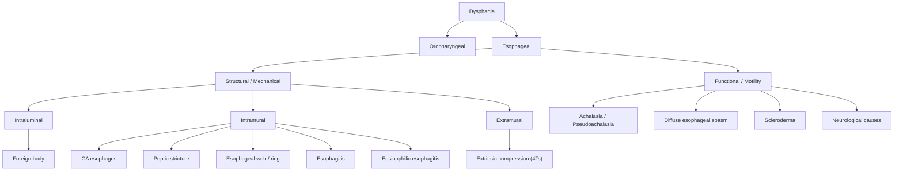

## Differential Diagnosis of CA Esophagus

The differential diagnosis of esophageal carcinoma is really the differential diagnosis of its **cardinal presenting symptom — progressive dysphagia** — plus its secondary features (odynophagia, weight loss, UGIB, hoarseness). When a patient walks in with difficulty swallowing, your job is to systematically work through the possibilities before landing on malignancy.

The clinical thinking starts from first principles: dysphagia means something is wrong with the passage of food from the pharynx to the stomach. The problem is either **structural** (something physically blocking the lumen or compressing it from outside) or **functional** (the motility machinery is broken, but there's no physical obstruction). Let's build this out.

---

### Organising Framework: Structural vs Functional Dysphagia

<Callout title="The Golden Rule of Dysphagia">
***Painless progressive dysphagia (over weeks) is malignancy until proven otherwise*** [2]. This is the single most important triage principle. Progressive means the dysphagia worsens over time — solids first, then semi-solids, then liquids — reflecting a growing mass that progressively narrows the lumen. Functional causes (e.g., achalasia) classically affect both solids AND liquids from the outset because the problem is motility, not a physical blockage.
</Callout>

---

### Detailed Differential Diagnosis

#### A. Structural / Mechanical Causes (Solids > Liquids, Progressive)

These mimic CA esophagus because they produce **progressive dysphagia predominantly for solids**. The key to distinguishing them lies in the history, risk factors, and endoscopic/radiological findings.

##### 1. Intramural Causes

| Condition | Key Distinguishing Features | Why It Mimics CA Esophagus | How to Differentiate |
|---|---|---|---|
| ***CA esophagus (SCC or ADC)*** [1][2] | Progressive dysphagia for solids → liquids; weight loss; elderly male smoker/drinker; risk factors for SCC or ADC | — This is the diagnosis you're trying to confirm or exclude | ***OGD + biopsy*** — the gold standard; gives histological diagnosis |
| **Peptic stricture** (from chronic GERD / reflux esophagitis) [1][6] | Long history of ***heartburn and acid regurgitation*** predating the dysphagia; dysphagia is for solids, usually slowly progressive over months to years; responds to dilatation; benign stricture on OGD (smooth, concentric narrowing at the lower esophagus) | Progressive solid dysphagia in the distal esophagus — same location as ADC | OGD: smooth, concentric narrowing without mucosal mass; biopsy shows fibrosis, no malignant cells; long GERD history |
| ***Esophageal webs / rings*** [2] | **Webs** = thin mucosal folds in the upper/mid esophagus (associated with ***Plummer-Vinson syndrome: triad of post-cricoid dysphagia, IDA, esophageal web*** [2]); **Schatzki ring** = mucosal ring at the squamocolumnar junction (lower esophagus); dysphagia is typically ***intermittent*** (especially for solid boluses like bread/meat), not relentlessly progressive | Solid food dysphagia at a fixed location | OGD or barium swallow: thin, shelf-like projection; intermittent rather than progressive pattern; no mass |
| **Esophagitis** (various aetiologies) [1][6] | ***Erosive esophagitis*** from GERD: heartburn history; ***Infective esophagitis*** (Candida, HSV, CMV): typically in immunocompromised patients (HIV, transplant, chemotherapy); ***Pill esophagitis***: history of taking bisphosphonates, doxycycline, KCl, NSAIDs with minimal water | Odynophagia ± dysphagia, may cause stricture | OGD: characteristic ulcers (Candida = white plaques; HSV = discrete shallow ulcers; pill = discrete deep ulcer at level of aortic arch); biopsy + culture; drug history |
| ***Eosinophilic esophagitis (EoE)*** | Young male with history of atopy (asthma, eczema, allergic rhinitis); intermittent dysphagia and food impaction; "trachealization" of esophagus on OGD (concentric rings, linear furrows, white exudates) | Dysphagia in a younger patient, can be progressive | OGD: "ringed esophagus" appearance; biopsy: ≥ 15 eosinophils per high-power field; atopic history; responds to topical steroids/PPI |
| **Corrosive / caustic stricture** [2] | History of ***caustic ingestion*** (alkali or acid); stricture develops months to years later; ***alkali causes liquefaction necrosis with transmural damage; acid causes coagulative necrosis with eschar*** [2] | Long, tight stricture causing progressive dysphagia; also carries a risk of developing SCC (latency 30–40 years) | Clear history of caustic ingestion; OGD: long, irregular stricture; biopsy to exclude malignancy |
| ***Other esophageal malignancies (rare)*** [2] | ***Neuroendocrine tumour, leiomyoma, GIST, lymphoma*** | Mass lesion causing progressive dysphagia | OGD + biopsy ± EUS: submucosal mass with intact overlying mucosa (GIST, leiomyoma) vs mucosal mass; IHC for CD117/c-KIT (GIST) [7] |

<Callout title="GIST vs CA Esophagus on OGD" type="idea">
A GIST or leiomyoma arises from the **muscularis propria** (the muscle wall) and grows outward (exophytic) or inward (endophytic) as a smooth, rounded submucosal bulge with **intact overlying mucosa**. In contrast, carcinoma arises from the **mucosa** and appears as an irregular, ulcerated, friable mass. This distinction on OGD is a big clue [7].
</Callout>

##### 2. Intraluminal Causes

| Condition | Key Features | How to Differentiate |
|---|---|---|
| **Foreign body** [2] | Acute onset dysphagia (not progressive); history of ingestion event (fish bone, denture, food bolus); common in children and elderly | Acute onset, clear history; lateral neck X-ray or CT may show radio-opaque FB; OGD for removal |

##### 3. Extramural Causes — The "4Ts" Mnemonic [2]

These are structures **outside** the esophagus compressing it from the exterior. Think about what surrounds the esophagus at each level:

| Cause | Mechanism | How to Differentiate |
|---|---|---|
| ***Tumour / Lymph nodes*** (e.g., ***CA lung, lymphoma***) [2] | Mediastinal or hilar lymphadenopathy, or a lung tumour directly compressing the esophagus | CT thorax: extrinsic mass compressing esophagus; OGD: smooth extrinsic compression with intact mucosa; biopsy of the LN/mass |
| ***Thyroid*** (retrosternal goitre) [2] | Large goitre extending into the superior mediastinum; may also cause stridor and SVC obstruction | Neck examination: palpable goitre; CT neck/thorax: retrosternal extension; thyroid function tests |
| ***Thymus*** (thymoma) [2] | Anterior mediastinal mass in a patient with or without myasthenia gravis | CT thorax: anterior mediastinal mass; anti-AChR antibodies if MG suspected |
| ***Thoracic aortic aneurysm*** [2] | Large aortic aneurysm compressing the esophagus; more common in elderly with cardiovascular risk factors | CT aortogram: aneurysmal dilatation; pulsatile mass on OGD (do NOT biopsy!) |

#### B. Functional / Motility Causes (Solids AND Liquids from Onset)

Functional causes produce dysphagia for **both solids and liquids simultaneously** from the beginning because the problem is peristaltic failure rather than a physical blockage. This is the key historical discriminator.

| Condition | Key Features | How to Differentiate from CA Esophagus |
|---|---|---|
| ***Achalasia*** [1][6] | Progressive dysphagia for ***both solids and liquids*** (~100%); regurgitation of undigested food with ***acidic smell (fermentation)***; chest pain; difficulty belching; age 35–45 (younger than typical CA); ***bird-beak sign on barium swallow*** | ***High-resolution esophageal manometry (HRM)***: elevated IRP, aperistalsis, failed LES relaxation (the triad) [6]; OGD: dilated esophagus with food residue, tight cardia that can be traversed with gentle pressure [1] |
| ***Pseudoachalasia*** [1][6] | Clinically and manometrically identical to achalasia BUT caused by ***malignancy at the EGJ invading the esophageal neural plexus*** (direct invasion) or paraneoplastic syndrome [1] | Suspect if: age > 60, rapid symptom onset ( < 6 months), marked weight loss, ***shouldering/heaping on barium swallow*** [6]; ***differentiate by OGD + EUS*** [6] — reveals tumour at the cardia |
| **Diffuse esophageal spasm (DES)** [1][6] | ***Intermittent*** dysphagia for solids and liquids; severe chest pain (can mimic angina); "corkscrew esophagus" on barium swallow | ***Esophageal manometry***: premature contractions in ≥ 20% of swallows but ***normal LES relaxation*** (IRP is normal) [1][6] — this distinguishes it from achalasia |
| **Jackhammer (nutcracker) esophagus** [1] | Intense chest pain, dysphagia; extremely high-amplitude contractions | Esophageal manometry: distal contractile integral (DCI) > 8000 mmHg·s·cm; normal LES relaxation |
| **Scleroderma (systemic sclerosis)** [2] | Progressive dysphagia AND severe heartburn (GERD); Raynaud's phenomenon, sclerodactyly, skin tightening; smooth muscle atrophy and fibrosis of the esophageal wall → absent peristalsis in the distal 2/3 + incompetent LES | Clinical features of systemic sclerosis (skin, Raynaud's); manometry: absent peristalsis in distal esophagus + low/absent LES pressure (opposite of achalasia where LES pressure is HIGH) |
| **Neurological causes** [2] | ***Stroke, MND, Parkinson's disease, MS, myasthenia gravis, muscle dystrophies*** — typically cause ***oropharyngeal*** dysphagia (difficulty initiating swallow, nasal regurgitation, coughing/choking) rather than esophageal dysphagia | The dysphagia is oropharyngeal in nature (difficulty initiating a swallow, "food won't go down from the throat"); neurological examination findings; videofluoroscopy |
| **Sjögren's syndrome** [2] | Dry mouth (xerostomia) → difficulty forming and propelling bolus; dysphagia is mainly oropharyngeal | Dry eyes + dry mouth; anti-Ro/La antibodies; Schirmer's test |

<Callout title="Achalasia vs Pseudoachalasia — A Critical Distinction" type="error">
This is an exam favourite. Both present with dysphagia for solids and liquids, regurgitation, and weight loss. Both have the same manometric triad. The red flags for pseudoachalasia are: **age > 60**, **rapid onset of symptoms ( < 6 months)**, **severe weight loss**, and **shouldering on barium swallow** (suggesting an extrinsic mass). ***OGD + EUS is the key investigation to differentiate*** — it reveals the cardia tumour in pseudoachalasia [1][6].
</Callout>

#### C. Gastric / EGJ Causes That May Present Similarly

| Condition | Why It May Be Confused with CA Esophagus | How to Differentiate |
|---|---|---|
| **CA stomach (especially proximal / cardia)** [8] | Siewert Type II/III tumours can present with dysphagia by obstructing the EGJ from below; constitutional symptoms overlap | OGD: tumour centered at the cardia/fundus; ***Siewert classification*** determines whether it's staged as esophageal or gastric [1]; EUS and CT for staging |
| **Gastric outlet obstruction (GOO)** from distal gastric cancer | Presents with vomiting, early satiety, weight loss — but **not dysphagia** (food enters the stomach fine, it just can't leave) | Projectile vomiting of undigested food; succussion splash; OGD: distal gastric/pyloric mass |

#### D. Conditions Presenting with UGIB (Overlap with CA Esophagus)

Since CA esophagus can present with hematemesis, melena, or IDA, the UGIB differential must be considered [5]:

| Condition | Key Features |
|---|---|
| ***Peptic / duodenal ulcer*** [5] | ***4 major risk factors: H. pylori + NSAIDs + stress + excess gastric acid*** [5]; epigastric pain related to meals |
| ***Esophagogastric varices*** [5] | History of liver cirrhosis / portal hypertension; massive hematemesis |
| ***Erosive esophagitis / esophageal ulcers*** [5] | Long GERD history; erosive changes on OGD |
| ***Mallory-Weiss syndrome*** [5] | ***Forceful retching/vomiting*** preceding hematemesis; longitudinal mucosal tear at EGJ [5] |
| ***Gastritis / duodenitis*** [5] | Drug-induced (NSAIDs, aspirin), alcohol, stress; typically self-limited |
| ***Dieulafoy's lesion*** [5] | Aberrant submucosal vessel that erodes overlying epithelium without a primary ulcer; massive, intermittent UGIB |
| ***Upper GI malignancy*** [5] | Constitutional symptoms (weight loss, anorexia) distinguish this from benign causes |

---

### Approach to the Differential: Key History Questions

These are the questions that help you sort through the differential at the bedside [1]:

| Question | What It Discriminates | Reasoning |
|---|---|---|
| ***"Do you have problems initiating a swallow or does food get stuck a few seconds after swallowing?"*** [1] | Oropharyngeal vs esophageal dysphagia | Initiation difficulty = oropharyngeal (neurological/muscular); food sticking = esophageal (structural/motility) |
| ***"Do you have problems swallowing solids, liquids, or both?"*** [1] | Mechanical vs motility | ***Inability to swallow liquid suggests a motility disorder; inability to swallow solid then progressing to liquid suggests a mechanical disorder*** [1] |
| ***"Have your symptoms progressed, remained stable, or been intermittent?"*** [1] | Malignancy vs benign | ***Rapidly progressive dysphagia suggests malignancy; intermittent dysphagia suggests primary or secondary motility disorders*** [1] |
| ***"Can you point to where food gets stuck?"*** [1] | Localisation | ***Cervical region → oropharyngeal; suprasternal notch / retrosternal → esophageal*** [1] |
| ***Associated symptoms*** [1] | Various | ***Coughing/choking/nasal regurgitation → oropharyngeal; heartburn/regurgitation → GERD; weight loss/anorexia → malignancy; hoarseness → RLN invasion (locally advanced CA); choking on swallowing → TE fistula*** |

---

### Summary Table: Quick DDx of Progressive Dysphagia

| Feature | CA Esophagus | Peptic Stricture | Achalasia | Eosinophilic Esophagitis | Extrinsic Compression |
|---|---|---|---|---|---|
| **Age** | 60–70 | Any (long GERD hx) | 35–45 | 20–40 | Varies |
| **Onset** | Progressive (weeks–months) | Slowly progressive (months–years) | Progressive (months–years) | Intermittent with food impaction | Variable |
| **Solids vs liquids** | Solids → liquids | Solids | Solids AND liquids | Solids (food impaction) | Solids |
| **Pain** | Odynophagia (late) | Heartburn | Chest pain, regurgitation | Chest pain | Varies |
| **Weight loss** | Prominent | Mild | Mild–moderate | Mild | Varies |
| **Key investigation** | OGD + biopsy | OGD | Manometry | OGD + biopsy (≥ 15 eos/HPF) | CT thorax |

---

### Why Must We Exclude CA Esophagus First?

The reason ***painless progressive dysphagia is malignancy until proven otherwise*** [2] is a matter of urgency and consequences:
1. **Prognosis worsens rapidly with delay** — by the time the lumen is narrowed enough to cause dysphagia, the tumour is usually T3 or beyond
2. **Window for curative surgery is narrow** — only ~30–40% of patients are candidates for surgery at diagnosis; further delay drops this further
3. **All other causes are either benign or treatable without the same urgency** — peptic stricture can be dilated, achalasia can be managed medically/endoscopically, webs/rings can be disrupted

Therefore the **first investigation in any patient with progressive dysphagia is OGD with biopsy** — this simultaneously diagnoses and excludes malignancy [2][6].

---

> **High Yield Exam Points:**
> - Progressive dysphagia for solids → liquids = mechanical obstruction until proven otherwise → CA esophagus is the number one concern
> - Solids AND liquids from onset = motility disorder (achalasia, DES, scleroderma)
> - Intermittent dysphagia with food impaction in a young atopic male = eosinophilic esophagitis
> - Pseudoachalasia mimics achalasia but is caused by cardia malignancy — suspect if age > 60, rapid onset, severe weight loss
> - Extramural "4Ts": Tumour/LN, Thyroid, Thymus, Thoracic aortic aneurysm
> - Always perform OGD + biopsy as the first-line investigation for progressive dysphagia

---

<ActiveRecallQuiz
  title="Active Recall - Differential Diagnosis of CA Esophagus"
  items={[
    {
      question: "A 65-year-old male smoker presents with 3 months of progressive dysphagia for solids, now also affecting liquids, with 8 kg weight loss. What is the most likely diagnosis and the first investigation you would order?",
      markscheme: "Most likely diagnosis: CA esophagus (progressive mechanical dysphagia in elderly male with smoking history and weight loss). First investigation: OGD with biopsy for histological diagnosis.",
    },
    {
      question: "How do you distinguish achalasia from CA esophagus based on the pattern of dysphagia?",
      markscheme: "Achalasia: dysphagia for both solids AND liquids from the onset (motility disorder — peristaltic failure, not physical blockage). CA esophagus: dysphagia for solids first, then progressing to liquids over weeks-months (mechanical obstruction — growing mass progressively narrows lumen).",
    },
    {
      question: "What are the red flags that differentiate pseudoachalasia from true achalasia?",
      markscheme: "Red flags for pseudoachalasia: (1) Age > 60, (2) Rapid symptom onset less than 6 months, (3) Severe weight loss, (4) Shouldering or heaping on barium swallow suggesting extrinsic mass. Differentiate by OGD plus EUS which reveals a tumour at the cardia or EGJ.",
    },
    {
      question: "Name the 4Ts of extramural causes of esophageal dysphagia and give an example of each.",
      markscheme: "Tumour or lymph nodes (e.g., CA lung, lymphoma), Thyroid (retrosternal goitre), Thymus (thymoma), Thoracic aortic aneurysm.",
    },
    {
      question: "A 28-year-old male with a history of asthma presents with intermittent dysphagia and recurrent food impaction. OGD shows concentric rings and linear furrows. What is the diagnosis and what biopsy finding confirms it?",
      markscheme: "Diagnosis: Eosinophilic esophagitis (EoE). Biopsy confirmation: 15 or more eosinophils per high-power field in esophageal mucosal biopsies.",
    },
    {
      question: "Why is scleroderma-related dysphagia associated with severe GERD, whereas achalasia is not?",
      markscheme: "In scleroderma, smooth muscle atrophy and fibrosis causes both absent peristalsis in the distal esophagus AND low or absent LES pressure — the incompetent LES allows free reflux. In achalasia, the LES pressure is HIGH (failure to relax) which actually prevents reflux. Both have absent peristalsis, but the LES tone is opposite.",
    },
  ]}
/>

## References

[1] Senior notes: felixlai.md (Esophageal cancer, Achalasia, Barrett's esophagus, Head and neck cancer sections)
[2] Senior notes: maxim.md (CA esophagus, Dysphagia differential diagnosis, Barrett's oesophagus, Corrosive esophagitis, Zenker's diverticulum sections)
[5] Senior notes: felixlai.md (UGIB differential diagnosis section); maxim.md (UGIB section)
[6] Senior notes: felixlai.md (Achalasia diagnosis section, GERD section, Dysphagia history taking); maxim.md (Achalasia section, GERD section)
[7] Senior notes: maxim.md (GIST section)
[8] Senior notes: maxim.md (CA stomach / Siewert classification section)
