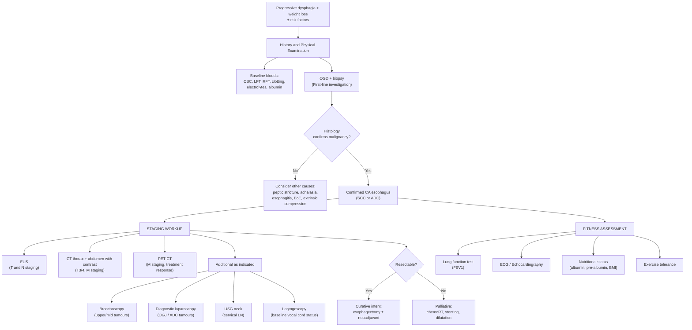

## Diagnostic Criteria, Algorithm, and Investigations for CA Esophagus

### Conceptual Framework — What Are We Trying to Achieve?

When a patient presents with suspected esophageal cancer (typically progressive dysphagia + weight loss in an elderly male), the diagnostic workup has **three sequential goals**:

1. **Confirm the diagnosis** — histological proof of malignancy (OGD + biopsy)
2. **Stage the disease** — determine T, N, and M (EUS, CT, PET-CT, ± laparoscopy, ± bronchoscopy)
3. **Assess fitness for treatment** — can this patient tolerate surgery? (bloods, lung function, cardiac assessment, nutritional status)

The reason staging comes after histological confirmation is simple: there's no point doing a PET-CT on a benign peptic stricture. And the reason fitness assessment matters is that esophagectomy is one of the biggest operations in surgery — perioperative mortality is 2–5% even in high-volume centres.

---

### 1. Diagnostic Criteria

There are no formal "diagnostic criteria" in the same way as, say, rheumatoid arthritis or heart failure. The diagnosis of esophageal cancer is **histopathological** — you need tissue.

> ***Diagnosis: OGD + biopsy — confirmatory histological diagnosis and pre-op assessment*** [2]

The OGD report must document [2]:
- ***Proximal margin (distance from incisors)*** — determines anatomical location (cervical / upper / mid / lower thoracic)
- ***Span of tumour*** — longitudinal extent
- ***% involvement of luminal circumference*** — circumferential vs partial
- ***Whether the scope can pass through*** — complete obstruction implies advanced disease and affects further investigations (e.g., EUS probe may not pass)

The biopsy provides:
- **Histological type** — SCC vs ADC (critical because management pathways differ)
- **Degree of differentiation** — well / moderately / poorly differentiated
- **Molecular markers** — HER2 status (for ADC, determines eligibility for trastuzumab), PD-L1 (immunotherapy eligibility), MSI status

<Callout title="Biopsy is Non-Negotiable" type="error">
***Biopsy should be taken for all lesions in the esophagus irrespective of how trivial they appear and the indication for the examination*** [1]. A senior will never forgive you for scoping a patient, seeing a lesion, and not biopsying it. Even if it looks like benign esophagitis, take tissue — early malignancy can be subtle.
</Callout>

---

### 2. Diagnostic Algorithm

The algorithm follows the three goals above in a stepwise fashion. You don't jump to PET-CT before confirming malignancy on biopsy.

<Callout title="Staging Is Only for Patients Fit for Curative Treatment">
***Staging investigations are only indicated for patients suitable for potentially curative therapies*** [1]. If a patient is clearly unfit for any treatment (e.g., severe comorbidities, widely disseminated disease obvious on clinical examination), extensive staging adds cost, delay, and discomfort without changing management.
</Callout>

---

### 3. Investigation Modalities — Detailed Breakdown

#### 3A. Physical Examination [1]

Before any investigation, a thorough clinical assessment guides the workup:

| Domain | What to Look For | Why |
|---|---|---|
| ***General examination*** | ***Pallor*** (chronic blood loss or malnutrition); ***Jaundice*** (liver metastasis); ***Dehydration and cachexia*** (hydration and nutritional status) [1] | Determines fitness for surgery and identifies metastatic disease |
| ***Lymphadenopathy*** | ***Left supraclavicular lymph node (Virchow's node)*** — since the lymphatic drainage is through the thoracic duct [1] | ***Enlarged supraclavicular LN indicates disseminated disease*** — finding this on examination may preclude curative surgery |
| ***Abdominal examination*** | ***Abdominal scars*** (previous surgery affects choice of surgical approach); ***Hepatomegaly*** (liver metastasis); ***Ascites*** (liver metastasis / peritoneal seeding); ***PR examination*** (look for rectal deposits) [1] | Identifies metastatic disease and surgical planning |
| ***Neurological examination*** | Evaluation of neuromuscular causes of dysphagia [1] | Rules out oropharyngeal/functional causes |
| ***Voice assessment*** | Hoarseness | Suggests RLN invasion → locally advanced disease |

#### 3B. Blood Tests [1][2]

| Test | Purpose | Interpretation |
|---|---|---|
| ***CBC with differentials*** [1] | Detect anemia (iron deficiency from chronic bleeding); assess WBC for infection (aspiration pneumonia); platelet count for pre-op | Microcytic hypochromic anemia → chronic blood loss |
| ***Clotting profile*** [1] | ***Pre-operative assessment before OGD*** and surgery | Coagulopathy → bleeding risk; may indicate liver dysfunction |
| ***Electrolyte profile*** [1] | ***Assess for electrolyte abnormalities due to vomiting*** | Hypokalemia, hypochloremic metabolic alkalosis from persistent vomiting |
| ***LFT*** [1] | ***Albumin and pre-albumin to evaluate nutritional status; evaluate for possible liver metastasis*** [1] | Low albumin → malnutrition (surgical risk factor); raised ALP/GGT/bilirubin → liver mets |
| ***RFT*** [1] | ***Assess pre-renal causes of dehydration*** | Raised urea:creatinine ratio → pre-renal AKI from dehydration |
| ***Lung function test*** [1] | ***Assess pulmonary function before surgery*** | ***FEV1 < 1.25 L is a poor candidate for thoracotomy — 40% risk of death from respiratory failure within 4 years*** [1]; transhiatal approach should be considered instead |
| ***Tumour markers*** (CEA, CA19-9) [9] | Not diagnostic; used for ***follow-up and monitoring recurrence*** | Elevated pre-op level → useful as a baseline for post-treatment surveillance |
| ***Laryngoscopy*** [2] | ***Baseline vocal cord status*** before any treatment | Documents pre-existing RLN dysfunction; critical before surgery or radiotherapy that may affect the RLN |

<Callout title="FEV1 Cut-off — A High-Yield Surgical Pearl">
***Patients with FEV1 < 1.25 L are poor candidates for thoracotomy*** because there is a ***40% risk of death from respiratory failure within 4 years***. In such patients, ***transhiatal (THE) esophagectomy should be considered since the pulmonary morbidity is less than thoracotomy*** [1]. This is because THE avoids opening the chest (thoracotomy), so there is less post-operative pulmonary compromise. The patient factor counterpart from Maxim's notes: ***FEV1 > 1.5 L*** is the typical threshold considered safe for thoracotomy [2].
</Callout>

#### 3C. Upper Endoscopy — OGD with Biopsy [1][2]

This is the **cornerstone** investigation — it simultaneously diagnoses and provides tissue.

| Aspect | Detail |
|---|---|
| **Principle** | Direct visualization of the esophageal mucosa + tissue acquisition |
| **Indication** | ***Any patient with progressive dysphagia*** — OGD is the first-line investigation [1] |
| **What to document** | Distance from incisors; tumour length; circumferential extent; whether scope passes through; relationship to the Z-line (for EGJ tumours) [2] |
| **Biopsy protocol** | Multiple biopsies from the mass (at least 6–8 from different areas of the lesion, including the margin); ***biopsy should be taken for all lesions irrespective of how trivial they appear*** [1] |

##### Advanced Endoscopic Techniques

| Technique | How It Works | When to Use |
|---|---|---|
| ***Chromoendoscopy with Lugol's iodine*** [1] | ***Lugol's iodine has an affinity for glycogen in squamous epithelium. Normal squamous epithelium with glycogen stains dark-brown/green-brown. Absence of dye uptake occurs when glycogen is depleted*** — as in ***inflammatory change, dysplasia, or early malignancy*** [1] | ***Commonly used in esophagus for detection of squamous dysplasia and early SCC*** [1]; ***guides EMR of early SCC by revealing extent and delineation of a lesion*** [1] |
| ***Narrow-band imaging (NBI)*** [1] | ***High-resolution endoscopic technique that enhances fine structures of the mucosal surface without the use of dyes*** [1] — uses optical filters to select specific wavelengths of light (blue 415 nm and green 540 nm) that are preferentially absorbed by hemoglobin, highlighting superficial capillary patterns and mucosal architecture | Enhances detection of subtle mucosal irregularities, dysplasia, and early cancers; useful adjunct to white-light endoscopy |

**Why Lugol's staining works — from first principles**: Normal squamous epithelial cells are packed with intracellular glycogen. Lugol's iodine (I₂ + KI) reacts with glycogen to produce a brown-black colour. Dysplastic or malignant squamous cells have **depleted glycogen** (because rapidly dividing cells consume their glycogen stores). Therefore, malignant areas appear as **unstained (pale/yellow) patches** against a dark-stained background — making them easy to spot and biopsy.

**Advantages** [1]: Direct visualization; combination of histology and cytology from biopsy provides high diagnostic accuracy.

**Disadvantages** [1]: ***Only the mucosal surface can be studied and biopsied*** — cannot assess depth of invasion or extramural spread (that's what EUS and CT are for).

#### 3D. Barium Swallow [1]

| Aspect | Detail |
|---|---|
| **Principle** | Patient swallows radio-opaque contrast; fluoroscopic imaging shows mucosal outline and motility in real-time |
| **Indication** | ***Assess for tumour complications such as tracheoesophageal fistula*** [1]; suspected proximal esophageal lesion; known complex tortuous stricture; negative OGD but mechanical obstruction still suspected [1] |
| **Typical findings in CA esophagus** | ***Proximal dilatation, mucosal irregularity, and annular constriction*** [1] — "apple-core" or "rat-tail" appearance with irregular shouldering (sharp cut-off with irregular margins) |
| **When to use which contrast** | **Barium**: better mucosal coating, higher resolution; ***avoid if risk of perforation — barium peritonitis*** [6]. **Gastrografin**: ***safe for suspected perforation, but may cause chemical pneumonitis if aspirated*** [6]. **Omnipaque** (low-osmolarity water-soluble): ***use if high risk of aspiration — lower risk of pulmonary oedema compared to gastrografin*** [6] |

<Callout title="Barium vs Gastrografin vs Omnipaque — Know When to Use What" type="idea">
Think of it as a hierarchy of safety:
- **No risk of perforation or aspiration** → Barium (best image quality)
- **Risk of perforation** → Gastrografin (water-soluble, won't cause peritonitis)
- **Risk of aspiration** → Omnipaque (water-soluble AND low osmolarity, safest for the lungs)

Never use barium if you suspect a TE fistula — barium in the mediastinum or peritoneum is catastrophic.
</Callout>

#### 3E. Endoscopic Ultrasound (EUS) [1][2]

EUS is the **best investigation for locoregional staging (T and N)** — it combines the endoscopic view with high-frequency ultrasound to image the esophageal wall layers and surrounding structures.

| Aspect | Detail |
|---|---|
| **Principle** | High-frequency ultrasound probe at the tip of an endoscope; images the 5 sonographic layers of the esophageal wall (mucosa, submucosa, muscularis propria, adventitia) and surrounding tissues |
| ***T staging*** | ***Assess depth of tumour penetration through the esophageal wall*** [1]: T1–T3 (spread through wall layers) and ***T4 (invasion of adjacent organs)*** [1] |
| ***T1a vs T1b distinction*** | ***T1a MUST be distinguished from T1b cancer since the chance of lymph node metastasis in T1b cancer is so high that open surgery is required*** [1] — T1a (confined to mucosa) can be treated with EMR/ESD; T1b (submucosa) needs esophagectomy |
| ***N staging*** | ***Metastasis to lymph node (N0 or N1)*** [1]; ***EUS-guided FNAC of suspicious LN*** — features suggesting malignancy: ***hypoechoic, > 1 cm, spherical, homogeneous*** [2] |
| ***Other uses*** | ***Can implant metallic markers for delineation of RT fields*** [2]; ***superior to CT in locoregional staging*** [1] |
| **Limitation** | Cannot pass through tight stenosis (if scope doesn't pass, cannot stage distally); operator-dependent; does not assess distant metastasis |

**Why EUS is superior to CT for T/N staging**: CT relies on size criteria for lymph nodes ( > 1 cm = suspicious), which misses micrometastases in normal-sized nodes. EUS can assess the **internal echo pattern** of nodes (hypoechoic, homogeneous nodes are more likely malignant regardless of size) and enables **tissue confirmation via FNAC**. For T staging, CT cannot reliably distinguish the individual wall layers, whereas EUS shows them clearly.

#### 3F. CT Thorax + Abdomen with Contrast [1][2]

| Aspect | Detail |
|---|---|
| **Principle** | Cross-sectional imaging with IV contrast to assess tumour extent, regional invasion, and distant metastasis |
| ***T staging*** | ***Assess locoregional staging especially to distinguish T4 lesion*** [1] — CT excels at showing whether the tumour invades ***resectable structures (pleura/pericardium/diaphragm = T4a)*** vs ***unresectable structures (aorta/trachea/bronchus/spine = T4b)*** [1] |
| ***M staging*** | ***Modality of choice to assess M stage*** [1] — identifies liver metastases, lung metastases, adrenal metastases, distant lymphadenopathy |
| ***N staging*** | ***Modality used to identify regional or distant metastasis*** [1] — but limited by size criteria (misses small positive nodes) |
| **Role** | ***CT whole body with contrast: for locoregional involvement (T3/4) and distant metastasis (M)*** [2] |

**CT vs EUS**: CT is better for **M staging and assessing T4 invasion into surrounding structures** (fat plane obliteration, aortic contact angle). EUS is better for **T1–T3 depth assessment and N staging**. They are **complementary**, not competing.

#### 3G. PET-CT [1][2]

| Aspect | Detail |
|---|---|
| **Principle** | ***Relies on high metabolic activity of tumours compared with normal tissues*** [1] — ***radiopharmaceutical agents (¹⁸F-FDG) enter highly metabolically active cells and are phosphorylated. The phosphorylated product is a highly polar molecule and cannot easily diffuse out of cells*** [1] → accumulates in tumour cells → appears as "hot spots" |
| ***M staging*** | ***Assess distant metastasis staging (M)*** [1]; ***similar sensitivity as CT for distant metastasis*** [2] |
| **Treatment response** | ***Can assess metabolic activity after neoadjuvant chemoRT / detect recurrence*** [2] |
| **Caveats** | ***May pick up additional signals (e.g., reactive hilar LN due to smoking)*** [2] → false positives; limited in detecting brain metastases (high baseline glucose uptake); mucinous tumours may be FDG-negative |

**Why PET-CT adds value over CT alone**: CT detects metastases based on **size and morphology** (you need a visible mass). PET-CT detects metastases based on **metabolic activity** — a normal-sized lymph node that is metabolically active will light up on PET, potentially upstaging the disease and preventing futile surgery.

#### 3H. Bronchoscopy [1][2]

| Aspect | Detail |
|---|---|
| **Indication** | ***Indicated in patients with suspected tracheoesophageal fistula who present with choking*** [1]; ***indicated in patients with tumour located in the upper and middle 1/3 of esophagus since it is in close proximity to trachea and its bifurcation*** [1] |
| **Not routinely done** | ***NOT routinely performed because CXR is more sensitive to detect synchronous or metastatic tumour in the lung*** [1] |
| **Tumour in distal 1/3** | ***Tumour located in the distal 1/3 esophagus is unlikely to invade into bronchus*** [1] — therefore bronchoscopy is not indicated |
| **Key finding** | ***Tracheal invasion*** [2] — may require ***stenting before RT to prevent iatrogenic tracheoesophageal fistula*** [2]. This is because radiotherapy can cause tumour necrosis, and if the tumour is invading the airway, necrosis creates a fistula between the esophagus and trachea. Placing a stent first provides structural support. |

#### 3I. Diagnostic Laparoscopy [1][2]

| Aspect | Detail |
|---|---|
| **Indication** | ***Recommended for OGJ tumours (adenocarcinoma) for hepatic/peritoneal seeding*** [2]; ***useful for diagnosis of occult hepatic and peritoneal metastasis*** [1] |
| **Key advantage** | ***Only modality reliably able to detect peritoneal tumour seedlings*** [1] — CT and PET-CT frequently miss small peritoneal deposits |
| **Technique** | Direct visualization of the peritoneal cavity + biopsy of suspicious lesions; peritoneal washing for cytology (positive cytology = M1 disease) |

#### 3J. Chest X-Ray (CXR) [1]

| Aspect | Detail |
|---|---|
| **Purpose** | ***Evaluate for possible lung metastasis and presence of pleural effusions; look for soft-tissue mass causing extramural dysphagia (e.g., bronchogenic carcinoma); aspiration pneumonia*** [1] |
| **Limitation** | Low sensitivity for small metastases — CT is far superior; but CXR is cheap, quick, and available, making it a good baseline screening tool |

#### 3K. MRI [1]

| Aspect | Detail |
|---|---|
| **Role** | Limited in esophageal cancer staging |
| **Reason** | ***MRI has intrinsic motion artifact*** when imaging the thorax/upper abdomen (cardiac motion, respiratory motion) [1] → image quality is degraded; CT is preferred |
| **Possible use** | Selected cases for liver lesion characterisation (if CT is equivocal); pelvic staging if needed |

---

### 4. Staging Workup — Putting It All Together

***Staging work-up: EUS + PET-CT (neck + thorax + abdomen)*** [2]

| Investigation | Primary Role | Best For |
|---|---|---|
| ***EUS*** | T and N staging | ***Best for T and N staging → determines need for neoadjuvant chemoRT*** [2] |
| ***CT thorax + abdomen with contrast*** | T4 assessment, M staging | ***Mandatory for M staging*** but not accurate for T1–T3 [2] |
| ***PET-CT*** | M staging, treatment response | Distant metastasis detection; post-treatment assessment [2] |
| **Bronchoscopy** | Airway invasion | Upper/mid tumours — ***detect tracheal invasion*** [2] |
| **Diagnostic laparoscopy** | Peritoneal/hepatic staging | OGJ adenocarcinomas — detect peritoneal seeding [2] |
| ***USG neck*** | Cervical LN | Cervical lymphadenopathy assessment [2] |
| ***Laryngoscopy*** | Vocal cord function | ***Baseline vocal cord status*** before treatment [2] |

### 5. Pre-operative Fitness Assessment [1][2]

This is the "can the patient survive the operation?" assessment:

| Assessment | What It Tells You | Key Thresholds |
|---|---|---|
| ***ECG / Echocardiography*** [1] | Cardiopulmonary reserve | Assess for ischaemic heart disease, valvular disease, LV function |
| ***Lung function test (FEV1)*** [1] | Pulmonary reserve | ***FEV1 < 1.25 L → poor candidate for thoracotomy (40% risk of respiratory death within 4 years) → consider transhiatal approach*** [1]; ***FEV1 > 1.5 L is generally considered safe*** [2] |
| ***CXR, ABG*** [2] | Baseline respiratory function | Identify COPD, effusion, consolidation |
| **Nutritional assessment** | Surgical risk stratification | Albumin < 30 g/L → high surgical risk; BMI; weight loss > 10% in 6 months; consider pre-operative nutritional supplementation (enteral/parenteral) |
| ***Exercise tolerance*** [2] | Functional capacity | ***> 2 flights of stairs*** is a rough guide to adequate cardiorespiratory fitness [2] |
| **Performance status** | Overall fitness | ECOG/WHO performance status; Karnofsky performance score |

---

### 6. Summary: Investigation Findings by Modality

| Modality | Classic/Key Finding in CA Esophagus |
|---|---|
| **OGD** | Irregular, friable, ulcerated or fungating mucosal mass; may have shouldered margins; scope may not pass (complete obstruction); document distance from incisors, length, circumference |
| **Chromoendoscopy (Lugol's)** | ***Unstained (pale/yellow) patches*** amid dark-stained normal mucosa — indicates glycogen depletion in SCC/dysplasia |
| **NBI** | Irregular intrapapillary capillary loop (IPCL) pattern — brownish dots/lines on enhanced mucosal surface |
| **Barium swallow** | "Apple-core" lesion (annular constriction with irregular shouldering + proximal dilatation); TE fistula (contrast leaking into bronchial tree) |
| **EUS** | Hypoechoic mass disrupting normal wall layer architecture; depth of invasion through 5 layers; hypoechoic, > 1 cm, spherical, homogeneous LNs |
| **CT** | Wall thickening, luminal narrowing; fat plane obliteration with adjacent structures (T4); liver/lung/adrenal metastases |
| **PET-CT** | FDG-avid mass in the esophagus; distant FDG-avid foci (metastases); useful for response assessment post-neoadjuvant |
| **Bronchoscopy** | Extrinsic compression, mucosal invasion, or visible fistula in the trachea/bronchus |
| **Laparoscopy** | Peritoneal nodules, liver surface deposits; positive peritoneal cytology |

---

<Callout title="High Yield Summary — Diagnostics">

1. **Diagnosis = OGD + biopsy** — always first-line; document distance from incisors, tumour span, circumferential involvement, whether scope passes through. Biopsy ALL lesions.
2. **Chromoendoscopy (Lugol's iodine)** — highlights SCC/dysplasia as unstained areas (glycogen depletion). NBI enhances mucosal capillary patterns without dye.
3. **Staging = EUS + CT + PET-CT** — EUS for T and N (best); CT for T4 and M (mandatory); PET-CT for M and treatment response.
4. **EUS: T1a vs T1b** is the critical distinction — T1a → endoscopic therapy; T1b → esophagectomy (20–25% chance of LN metastasis).
5. **T4a (resectable: pleura, pericardium, diaphragm) vs T4b (unresectable: aorta, trachea, spine)** — CT is best for this distinction.
6. **Bronchoscopy** — for upper/mid tumours to detect tracheal invasion; may need stenting before RT to prevent iatrogenic TE fistula.
7. **Diagnostic laparoscopy** — for OGJ/adenocarcinoma; only reliable way to detect peritoneal seeding.
8. **FEV1 < 1.25 L → avoid thoracotomy** → consider transhiatal esophagectomy.
9. **Contrast choice**: Barium (best image) → Gastrografin (if perforation risk) → Omnipaque (if aspiration risk).

</Callout>

---

<ActiveRecallQuiz
  title="Active Recall - Diagnostics and Staging of CA Esophagus"
  items={[
    {
      question: "What 4 key features must the endoscopist document during OGD for a suspected esophageal cancer?",
      markscheme: "(1) Proximal margin — distance from incisors; (2) Span/length of tumour; (3) Percentage involvement of luminal circumference; (4) Whether the scope can pass through the lesion.",
    },
    {
      question: "Explain how Lugol's iodine chromoendoscopy works from first principles. Why do malignant areas appear unstained?",
      markscheme: "Lugol's iodine reacts with glycogen in normal squamous epithelial cells to produce dark-brown/black staining. Dysplastic and malignant squamous cells have depleted glycogen stores (rapidly dividing cells consume glycogen). Therefore malignant areas appear pale/yellow (unstained) against a dark-stained normal background.",
    },
    {
      question: "Why is the distinction between T1a and T1b esophageal cancer critical, and which investigation is best for making this distinction?",
      markscheme: "T1a is confined to the mucosa (lamina propria or muscularis mucosae) — can be treated with endoscopic therapy (EMR/ESD). T1b invades the submucosa — has 20-25% incidence of lymph node metastasis, so requires esophagectomy with lymph node dissection. EUS is the best investigation to distinguish T1a from T1b by imaging the individual wall layers.",
    },
    {
      question: "A patient with a mid-esophageal SCC is being staged. Why would you request a bronchoscopy, and what therapeutic implication does tracheal invasion have before radiotherapy?",
      markscheme: "Mid-esophageal tumours are in close proximity to the trachea and its bifurcation. Bronchoscopy detects tracheal invasion. If invasion is present, stenting may be required before RT because radiotherapy-induced tumour necrosis can create an iatrogenic tracheoesophageal fistula if the tumour is invading the airway wall.",
    },
    {
      question: "What is the FEV1 threshold below which thoracotomy is contraindicated, and what alternative surgical approach is recommended?",
      markscheme: "FEV1 below 1.25 L (some sources use 1.5 L). These patients have a 40% risk of death from respiratory failure within 4 years of thoracotomy. Transhiatal esophagectomy (THE) should be considered as it avoids opening the thorax, reducing pulmonary morbidity.",
    },
    {
      question: "When should you use barium, gastrografin, and Omnipaque as contrast for swallowing studies? Explain the reasoning.",
      markscheme: "Barium: best mucosal detail, use when no risk of perforation or aspiration (barium causes barium peritonitis if it leaks through a perforation). Gastrografin: water-soluble, safe if perforation risk (avoids peritonitis), but can cause chemical pneumonitis if aspirated. Omnipaque: water-soluble and low osmolarity, safest if aspiration risk (lower risk of pulmonary oedema compared to gastrografin).",
    },
  ]}
/>

## References

[1] Senior notes: felixlai.md (Esophageal cancer sections — Diagnosis, Radiological tests, OGD overview, Barrett's diagnostic criteria, Dysphagia history taking)
[2] Senior notes: maxim.md (CA esophagus — Investigations and Staging, Dysphagia investigations, OGD section, Barrett's oesophagus, Contrast agents)
[6] Senior notes: maxim.md (Dysphagia investigations — Barium vs Gastrografin vs Omnipaque)
[9] Lecture slides: GC 212. Weight loss and vomiting gastric cancer; abdominal imaging.pdf (Investigations and Clinical staging slides)
