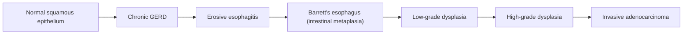

# CA Esophagus (Esophageal Carcinoma)

## 1. Definition

Esophageal carcinoma (CA esophagus) refers to a malignant neoplasm arising from the epithelium of the esophagus. The two dominant histological types are **squamous cell carcinoma (SCC)** and **adenocarcinoma (ADC)**, which together account for > 95% of all esophageal malignancies [1][2].

- **Esophageal** → from Greek *oisophagos* ("oi-" = to carry, "phagos" = food) — the tube that carries food.
- **Carcinoma** → from Greek *karkinos* (crab) + *-oma* (tumour) — a malignant tumour of epithelial origin.

The key concept: the esophagus is a muscular tube with **no serosal layer** (it has an adventitia instead). This is critical because a serosal barrier normally slows tumour invasion into surrounding tissues. Without serosa, esophageal cancers tend to **invade locally early** and present at an advanced stage [1][2].

> ***"Typically exhibits extensive proximal and distal submucosal invasion"*** [1] — tumour can spread longitudinally within the submucosa well beyond the visible macroscopic margin, which is why surgical resection margins need to be generous (≥ 5 cm proximally and distally).

---

## 2. Epidemiology

### 2.1 Global and Hong Kong Context

| Feature | Detail |
|---|---|
| ***Global rank*** | ***6th most common cancer in the world*** [1]; 6th leading cause of cancer death worldwide |
| ***Sex*** | ***Male preponderance*** (M:F ≈ ***3:1***) [2] |
| ***Age*** | ***Disease of mid to late adulthood*** — peak incidence 60–70 years [1][2] |
| ***HK histology*** | ***SCC is most common in Asians including HK (≈ 90%)*** [2]; adenocarcinoma is increasing but remains the minority |
| ***Western histology*** | Adenocarcinoma has overtaken SCC in incidence in Western countries, primarily driven by obesity and GERD |
| ***Prognosis*** | ***Poor: > 50% have metastatic disease at presentation; 5-year overall survival is just 5–10%*** [2] |

<Callout title="Why is prognosis so poor?">
Three reasons: (1) **no serosa** → early transmural invasion, (2) **rich submucosal lymphatic plexus** → early lymphatic spread, (3) **late presentation** — dysphagia only appears when ≥ 60–75% of the lumen is obstructed.
</Callout>

### 2.2 Geographic Variation

- **"Asian esophageal cancer belt"**: stretches from Northern China through Central Asia to the Caspian coast of Iran — extremely high incidence of SCC, linked to dietary nitrosamines, hot beverages, and nutritional deficiencies.
- **In Hong Kong**: SCC dominates — closely related to ***smoking, alcohol, hot drinks, nitrosamines, betel nut*** [2].
- **In the West**: ADC is rising — closely linked to the obesity epidemic, GERD, and Barrett's esophagus.

---

## 3. Anatomy and Function of the Esophagus

Understanding esophageal anatomy is essential because tumour location determines symptoms, spread pattern, operability, and surgical approach.

### 3.1 Gross Anatomy

| Feature | Detail |
|---|---|
| Length | ~25 cm in adults (from cricopharyngeus C6 to esophagogastric junction T11) |
| Divisions | Cervical (C6–thoracic inlet), Upper thoracic (thoracic inlet–carina), Middle thoracic (carina–halfway to EGJ), Lower thoracic/abdominal (halfway–EGJ) |
| Clinically | Upper 1/3 (~15–24 cm from incisors), Middle 1/3 (~24–32 cm), Lower 1/3 (~32–40 cm) |

### 3.2 Histological Layers (Inside → Out)

1. **Mucosa** — non-keratinising stratified squamous epithelium (except at the gastroesophageal junction where it transitions to columnar — the "Z-line")
2. **Submucosa** — contains the ***submucosal (Meissner's) plexus*** which controls secretory activity; also contains a **dense lymphatic network** (clinically important — tumour spreads submucosally via this plexus) [1]
3. **Muscularis propria** — inner circular + outer longitudinal muscle layers; contains the ***myenteric (Auerbach's) plexus*** which controls motility [1]
   - Upper 1/3: striated muscle
   - Middle 1/3: mixed striated + smooth muscle
   - Lower 1/3: smooth muscle
4. **Adventitia** — ***NO SEROSA*** — only loose connective tissue blending with mediastinal structures

<Callout title="Why does the absence of serosa matter?" type="error">
Students commonly underestimate this point. The serosa is a mesothelial barrier that delays transmural invasion in gastric and colonic cancers. The esophagus has only adventitia → tumour penetrates into surrounding mediastinal structures (trachea, aorta, pericardium) far earlier and more easily. This is also why T3 esophageal cancer means invasion of adventitia (not serosa).
</Callout>

### 3.3 Three Anatomical Narrowings

These are sites of physiological constriction where food (and swallowed foreign bodies) can get stuck — and where SCC tends to arise:

1. **Cricopharyngeus** (~15 cm from incisors) — upper esophageal sphincter
2. **Aortic arch / Left main bronchus** (~23–25 cm from incisors) — extrinsic compression
3. **Diaphragmatic hiatus / Lower esophageal sphincter** (~38–40 cm from incisors)

### 3.4 Neurovascular Supply [1]

| Region | Arterial Supply | Venous Drainage | Lymphatic Drainage |
|---|---|---|---|
| **Upper 1/3** | Inferior thyroid artery | Brachiocephalic vein | ***Deep cervical nodes*** |
| **Middle 1/3** | Aorta (esophageal branches) | Azygos vein | ***Superior and posterior mediastinal nodes*** |
| **Lower 1/3** | Left gastric artery (esophageal branches) | Left gastric vein (→ portal vein) | ***Celiac nodes and nodes along left gastric vessels*** |

Why does this matter clinically?
- **Lymphatic drainage is longitudinal and bidirectional** — cancer at any level can spread to nodes far from the primary site, making "skip metastases" common.
- **The lower 1/3 drains into the portal system** — this is why hepatic metastases are common in lower esophageal/EGJ tumours.

### 3.5 Key Anatomical Relations

- **Posteriorly**: thoracic vertebral bodies, thoracic duct, azygos vein, descending aorta
- **Anteriorly**: trachea (upper), left main bronchus (mid), pericardium and left atrium (lower)
- **Left**: aortic arch, thoracic duct (crosses from right to left at ~T5), left recurrent laryngeal nerve (loops under aortic arch)
- **Right**: azygos vein

These relationships explain patterns of local invasion:
- Tumour → **trachea/bronchus** → ***tracheoesophageal (TE) fistula*** [1][2]
- Tumour → **aorta** → catastrophic hemorrhage (aortoesophageal fistula)
- Tumour → **recurrent laryngeal nerve** → ***hoarseness*** [1]
- Tumour → **phrenic nerve** → elevated hemidiaphragm
- Tumour → **thoracic duct** → chylothorax

### 3.6 Esophagogastric Junction (EGJ) — The Siewert Classification [1]

Tumours at the EGJ are particularly important to classify because it determines whether they are staged/treated as esophageal or gastric cancers:

> ***Siewert classification*** [1]:
> - ***Type I*** = Located **1–5 cm proximal** to the anatomical Z-line → ***adenocarcinoma of the distal esophagus***, usually arising from ***Barrett's esophagus***
>   - ***Treatment: Transthoracic en bloc esophagectomy + partial gastrectomy + 2-field lymphadenectomy***
> - ***Type II*** = Located **1 cm proximal to 2 cm distal** to Z-line → ***true carcinoma of the cardia***
>   - ***Treatment: Transabdominal/transhiatal resection of distal esophagus + total gastrectomy + lymphadenectomy of lower mediastinum and abdominal D2 nodal compartment***
> - ***Type III*** = Located **2–5 cm distal** to Z-line → ***subcardial gastric carcinoma*** infiltrating EGJ from below
>   - ***Treatment: same as Type II***
>
> Per AJCC 8th edition: ***Siewert I and II are staged as esophageal cancer; Siewert III and cardia cancers not involving EGJ are staged as stomach cancer*** [1].

---

## 4. Etiology and Risk Factors

The two histological types have **distinct risk factor profiles** — think of them as almost separate diseases sharing the same organ.

### 4.1 Squamous Cell Carcinoma (SCC) — Upper 2/3 of esophagus

SCC arises from the native squamous epithelium. It is ***multicentric*** [1] (consistent with the "field cancerization" concept — the entire aerodigestive mucosa is bathed in carcinogens).

| Risk Factor | Mechanism / Explanation |
|---|---|
| ***Smoking*** [1][2][3] | Polycyclic aromatic hydrocarbons (PAHs) and nitrosamines cause direct mucosal DNA damage; synergistic with alcohol |
| ***Alcohol*** [1][2][3] | Ethanol → acetaldehyde (a class 1 carcinogen via IARC); damages mucosal DNA; acts as a solvent enhancing penetration of other carcinogens (synergism with smoking) |
| ***Hot drinks*** [2] | Thermal injury → chronic inflammation → epithelial hyperplasia → dysplasia → carcinoma (common in Asian/Middle Eastern tea-drinking cultures) |
| ***Nitrosamines*** [2] | Potent environmental carcinogens found in preserved/pickled foods |
| ***Dietary factors*** [1] | Restricted diet of ***salted fish and pickled vegetables***, deficiency of ***vegetables and citrus fruit***, deficiency of ***trace elements (e.g., selenium)***, ***fungal contaminants (e.g., aflatoxin)*** |
| ***Betel nut*** [2][3] | Contains arecoline → genotoxic; common in South/Southeast Asian populations |
| ***Corrosive/caustic strictures*** [1] | Chronic inflammation at stricture site → epithelial regeneration → increased mitotic rate → accumulated mutations → SCC (latency period can be 30–40 years) |
| ***Achalasia*** [1] | Stasis of food in dilated esophagus → chronic mucosal irritation and bacterial overgrowth → nitrosamine production → SCC |
| ***Plummer-Vinson syndrome (PVS)*** [2] | Triad of ***post-cricoid dysphagia, iron deficiency anemia (IDA), esophageal web*** — unknown exact pathophysiology but web formation causes chronic mucosal changes → SCC |
| ***Tylosis*** [2] | ***Autosomal dominant genetic disorder*** characterised by ***hyperkeratosis of palms & soles + oral leukoplakia*** — nearly 100% lifetime risk of esophageal SCC (mutation in RHBDF2 gene) |
| ***History of H&N cancer*** [1] | ***Field cancerization*** — same carcinogens (smoking/alcohol) affect the entire aerodigestive tract → high risk of ***synchronous*** (within 6 months) and ***metachronous*** ( > 6 months) tumours [1] |
| ***Prior radiation*** [1] | Radiation for H&N tumours → direct DNA damage to esophageal epithelium |

<Callout title="Field Cancerization — A Must-Know Concept" type="idea">

***Diffuse and chronic exposure of mucosa of the upper aerodigestive tract to carcinogenic substances leads to widespread epithelial changes*** [1]. This is why:
- ***Patients with oral cavity/oropharyngeal tumours are more likely to develop a second primary in the upper esophagus*** [1]
- ***Patients with laryngeal tumours are more likely to develop a second primary in the lung*** [1]
- ***Panendoscopy (direct laryngoscopy + bronchoscopy + OGD) is always recommended at the initial evaluation of all patients with primary cancers of the upper aerodigestive tract*** [1]

</Callout>

### 4.2 Adenocarcinoma (ADC) — Lower 1/3 of esophagus

ADC arises from metaplastic columnar epithelium (Barrett's esophagus) or from the cardia. It is ***not multicentric*** [1] — it arises from a single focus of intestinal metaplasia.

| Risk Factor | Mechanism / Explanation |
|---|---|
| ***Smoking*** [1] | Direct carcinogenic effect on esophageal mucosa |
| ***Obesity*** [1] | ↑ Intra-abdominal pressure → ↑ GERD → Barrett's → ADC; also promotes a pro-inflammatory state (↑ leptin, ↓ adiponectin, ↑ insulin/IGF-1) that promotes carcinogenesis |
| ***GERD*** [1][2] | Chronic acid + bile reflux → inflammation → erosive esophagitis → ***intestinal metaplasia (Barrett's)*** → low-grade dysplasia → high-grade dysplasia → invasive adenocarcinoma (the "metaplasia-dysplasia-carcinoma" sequence) |
| ***Barrett's esophagus*** [1][2] | ***Metaplastic columnar epithelium (with goblet cells) that replaces stratified squamous epithelium in the distal esophagus*** — this is the **pre-malignant lesion**; risk of ADC is ~0.5% per year [2] |
| ***Hiatus hernia*** | Disrupts the anti-reflux mechanism → promotes GERD → Barrett's |
| Male sex, Caucasian | Epidemiological association (ADC is more common in white males) |

#### The Barrett's → Adenocarcinoma Sequence (Detailed)

This is the classic **metaplasia → dysplasia → carcinoma** sequence:

**Why does intestinal metaplasia occur?** The esophageal squamous epithelium is not built to handle acid. Under chronic acid exposure, stem cells in the basal layer differentiate into columnar (intestinal-type) epithelium with goblet cells — an adaptation that is more resistant to acid, but this metaplastic tissue is inherently unstable and prone to dysplastic change [1][2].

> ***Barrett's esophagus definition: intestinal metaplasia of esophageal stratified squamous epithelium to columnar epithelium (with mucus-secreting goblet cells) as an adaptation mechanism to long-term acid reflux*** [2]
>
> - ***H. pylori infection is a protective factor*** (due to parietal cell atrophy → decreased acid production) [2]
> - ***Prague classification***: C = circumferential extent, M = maximal extent [2]
> - ***Risk of adenocarcinoma: ~0.5% per year*** [2]

---

## 5. Pathophysiology

### 5.1 The Two Histological Types — Comparative Pathology

| Feature | ***SCC*** | ***ADC*** |
|---|---|---|
| ***Site*** | ***Mostly upper 2/3*** | ***Mostly lower 1/3*** |
| Precursor | Squamous dysplasia | Barrett's metaplasia → dysplasia |
| ***Morphology*** | ***Fungating > ulcerative > infiltrative*** [2] | Fungating or ulcerating mass |
| Multicentricity | ***Multicentric*** (field cancerization) [1] | ***Not multicentric*** [1] |
| ***Sensitivity to chemoRT*** | ***More sensitive to chemoRT*** [2] | ***Less sensitive to chemoRT → surgery preferred*** [2] |
| Molecular drivers | p53 mutations, EGFR amplification, cyclin D1 overexpression | p53 mutations, HER2 amplification (targetable), VEGF |

> ***Other possible pathology (rare): neuroendocrine tumour, leiomyoma, GIST, lymphoma*** [2]

### 5.2 Modes of Spread [1][2]

Understanding the modes of spread is essential for staging and determining resectability:

#### A. Direct / Local Extension

- ***Direct extension (e.g., tracheoesophageal fistula)*** [1][2]
- The esophagus has **no serosa** → tumour easily invades adjacent structures:
  - **Trachea / left main bronchus** → TE fistula (cough on swallowing, recurrent aspiration pneumonia)
  - **Aorta** → aortoesophageal fistula (massive, usually fatal hemorrhage)
  - **Pericardium / left atrium** → pericardial effusion, cardiac tamponade
  - **Recurrent laryngeal nerve (RLN)** → vocal cord paralysis → hoarseness
  - **Thoracic duct** → chylothorax
  - **Diaphragm, pleura** → pleural effusion

#### B. Lymphatic Spread

- ***Vascular and lymphatic*** spread [2]
- The **submucosal lymphatic plexus** is the highway for early spread — tumour cells can travel longitudinally for centimetres within the submucosa before penetrating the wall
- Lymphatic drainage is **bidirectional** (upward and downward) → "skip metastases" are common (nodes far from the primary can be involved)
- Important nodal groups:
  - Cervical: deep cervical, supraclavicular (***Virchow's node*** — left supraclavicular, classically associated with abdominal malignancy but also seen in lower esophageal/EGJ tumours)
  - Mediastinal: paraesophageal, subcarinal, paratracheal
  - Abdominal: celiac, left gastric, common hepatic

#### C. Hematogenous Spread

- ***Metastasis to organs including: lungs, liver, bones, adrenals*** [1]
- Lower esophageal tumours drain via the left gastric vein → **portal system** → **liver metastases**
- Upper/middle tumours drain via brachiocephalic/azygos → **lung metastases**
- Bony and adrenal metastases via systemic circulation

### 5.3 Submucosal Spread — A Unique Challenge

***"Typically exhibits extensive proximal and distal submucosal invasion"*** [1]. The longitudinal submucosal lymphatic plexus allows tumour to spread far beyond the visible mucosal lesion. This is why:
- Frozen section of resection margins is performed intra-operatively
- A proximal margin of at least 5 cm (some centres use 8 cm) is recommended
- Multifocal submucosal deposits ("satellite nodules") may be found

---

## 6. Classification

### 6.1 Histological Classification

| Type | Frequency | Site | Origin |
|---|---|---|---|
| **Squamous cell carcinoma** | ~90% in HK/Asia | Upper 2/3 | Squamous epithelium |
| **Adenocarcinoma** | ~10% in HK (rising); dominant in West | Lower 1/3 / EGJ | Barrett's metaplasia |
| Other (rare) | < 5% | Any | Neuroendocrine tumour, leiomyoma, GIST, lymphoma, melanoma, small cell carcinoma |

### 6.2 Anatomical Classification (AJCC 8th edition, 2017)

| Region | Distance from incisors | Anatomical Landmarks |
|---|---|---|
| **Cervical esophagus** | 15–20 cm | Cricopharyngeus to thoracic inlet (sternal notch) |
| **Upper thoracic** | 20–25 cm | Thoracic inlet to lower border of azygos vein |
| **Middle thoracic** | 25–30 cm | Lower border of azygos vein to lower border of inferior pulmonary vein |
| **Lower thoracic** | 30–40 cm | Lower border of inferior pulmonary vein to EGJ (includes abdominal segment) |

### 6.3 TNM Staging (AJCC 8th Edition) [1]

#### Primary Tumour (T)

| Stage | Description |
|---|---|
| ***TX*** | ***Primary tumour cannot be assessed*** |
| ***T0*** | ***No evidence of primary tumour*** |
| ***Tis*** | ***High-grade dysplasia*** (includes all non-invasive neoplasia — previously called "carcinoma in situ") |
| ***T1a*** | ***Tumour invades lamina propria or muscularis mucosae*** |
| ***T1b*** | ***Tumour invades submucosa*** |
| ***T2*** | ***Tumour invades muscularis propria*** |
| ***T3*** | ***Tumour invades adventitia*** (remember: no serosa!) |
| ***T4a*** | ***Resectable tumour invading pleura, pericardium, or diaphragm*** |
| ***T4b*** | ***Unresectable tumour invading other adjacent structures (aorta, vertebral body, trachea)*** |

<Callout title="T4a vs T4b" type="error">
This distinction is critical for surgical planning. ***T4a is resectable*** (pleura, pericardium, diaphragm can be resected en bloc). ***T4b is unresectable*** (aorta, vertebral body, trachea — you cannot safely remove these structures). Students commonly confuse this boundary.
</Callout>

#### Regional Lymph Nodes (N)

| Stage | Description |
|---|---|
| NX | Regional lymph nodes cannot be assessed |
| N0 | No regional lymph node metastasis |
| N1 | 1–2 regional lymph nodes involved |
| N2 | 3–6 regional lymph nodes involved |
| N3 | ≥ 7 regional lymph nodes involved |

#### Distant Metastasis (M)

| Stage | Description |
|---|---|
| M0 | No distant metastasis |
| M1 | Distant metastasis present |

### 6.4 Siewert Classification (for EGJ tumours) — see Section 3.6 above

### 6.5 Macroscopic Morphology [2]

- ***Fungating > ulcerative > infiltrative*** — fungating (polypoid/exophytic) is most common
- Infiltrative (linitis plastica-type) has the worst prognosis as it often causes extensive submucosal spread without a clear mass

---

## 7. Clinical Features

### Conceptual Framework

Esophageal cancer is typically a **"silent" cancer** until it reaches an advanced stage. The esophageal lumen must be narrowed to ≤ 13 mm (normal ~20 mm) before solid food dysphagia occurs, meaning ≈60–75% of the lumen is already obstructed by the time patients present. This is the core reason for the late presentation and poor prognosis.

### 7.1 Symptoms

#### A. Primary Tumour Symptoms

| Symptom | Pathophysiological Basis |
|---|---|
| ***Dysphagia*** [1] — ***first and most common manifestation*** | Progressive mechanical obstruction of the esophageal lumen. Initially for solids (the lumen can still accommodate liquids), then progresses to semi-solids, then liquids ("progressive dysphagia for solids > liquids" — the hallmark of mechanical obstruction). Patients ***tolerate fluid and soft food better*** [1]. |
| ***Odynophagia*** [1] — ***develops late in disease course, usually due to extra-esophageal involvement*** | Pain on swallowing indicates ulceration of the tumour surface ± invasion into periesophageal tissues (mediastinal inflammation). When extra-esophageal involvement occurs (e.g., mediastinal invasion), the pain becomes more severe and constant. |
| ***Regurgitation (reflux)*** [1] — ***secondary to tumour disrupting normal peristalsis*** | Tumour mass and/or submucosal infiltration disrupts the peristaltic wave → food pools above the tumour → regurgitates back up. This carries a ***risk of aspiration pneumonia*** [1]. |
| ***Hematemesis or melena*** [1] | ***Rare manifestation, usually occurs late***. ***Bleeding from primary tumour or erosion into aorta or pulmonary vessels*** [1]. Mucosal ulceration → chronic low-grade bleeding → IDA; erosion into aorta → catastrophic hemorrhage. |

#### B. Systemic / Constitutional Symptoms

| Symptom | Pathophysiological Basis |
|---|---|
| ***Anorexia and weight loss*** [1] | Multifactorial: (1) mechanical obstruction → reduced oral intake, (2) cancer-induced cachexia (pro-inflammatory cytokines: TNF-α, IL-6 → increased basal metabolic rate + muscle wasting), (3) dysphagia → nutritional deficiency |
| ***Anemic symptoms*** [1]: ***pallor, palpitations, dyspnea, fatigue*** | Chronic occult blood loss from ulcerated tumour → iron deficiency anemia |
| ***Nausea and vomiting*** [1] | Obstruction + altered motility; also as a component of cancer cachexia |

#### C. Symptoms of Locally Advanced Disease

These indicate the tumour has invaded beyond the esophageal wall into surrounding structures:

| Symptom | Structure Invaded | Pathophysiological Basis |
|---|---|---|
| ***Hoarseness*** [1] | **Recurrent laryngeal nerve (RLN)** | The left RLN loops under the aortic arch and ascends in the tracheoesophageal groove → vulnerable to invasion by mid-esophageal and upper thoracic tumours. Paralysis of the ipsilateral vocal cord → breathy hoarseness. |
| ***Persistent cough / aspiration pneumonia*** | **Tracheobronchial tree** | Direct invasion → ***tracheoesophageal fistula*** [1][2] → ingested food/liquid enters the airway → cough triggered by swallowing (pathognomonic), recurrent pneumonia |
| ***Coughing on swallowing (Ono's sign)*** | **TE fistula** | Fistula between esophagus and trachea/bronchus → immediate cough reflex when swallowing liquids |
| ***Chest/back pain*** | **Mediastinal invasion** | Invasion into periesophageal tissue, vertebral bodies, or nerves → somatic/neuropathic pain |
| ***Dyspnea*** | **Tracheobronchial compression or invasion** | Mass effect or direct invasion narrowing the airway; also pleural effusion from pleural metastases |
| ***Superior vena cava (SVC) syndrome*** | **SVC compression** | Large mediastinal mass or nodal disease compressing the SVC → facial/upper limb oedema, distended neck veins, headache |
| ***Horner's syndrome*** | **Cervical sympathetic chain** | Invasion of the sympathetic trunk → ipsilateral ptosis, miosis, anhidrosis |

#### D. Symptoms of Metastatic Disease

| Symptom | Site of Metastasis |
|---|---|
| ***Lymphadenopathy*** [1] — ***enlarged supraclavicular LN indicates disseminated disease*** | Supraclavicular (Virchow's node, especially left) |
| Hepatomegaly, jaundice, ascites | Liver metastases |
| Bone pain, pathological fractures | Bone metastases |
| Cough, hemoptysis | Lung metastases |

### 7.2 Signs

#### A. General Examination

| Sign | Pathophysiological Basis |
|---|---|
| **Cachexia** (temporal wasting, loose skin folds, muscle wasting) | Cancer cachexia + reduced oral intake from dysphagia |
| **Pallor** | Iron deficiency anemia from chronic occult GI blood loss |
| **Dehydration** | Severe dysphagia → inability to maintain adequate fluid intake |
| **Lymphadenopathy** — ***supraclavicular (Virchow's node)*** | Left supraclavicular node drains the thoracic duct → receives lymph from the abdomen and thorax; ***enlarged supraclavicular LN indicates disseminated disease*** [1] |

#### B. Local / Abdominal Examination

| Sign | Significance |
|---|---|
| **Epigastric mass** (rare) | Large tumour at the EGJ palpable per abdomen |
| **Hepatomegaly** (irregular, hard, non-tender) | Liver metastases |
| **Ascites** | Peritoneal carcinomatosis |

#### C. Signs of Locally Advanced Disease

| Sign | Basis |
|---|---|
| **Hoarse voice** (on speaking) | RLN palsy from tumour invasion |
| **Stridor** | Tracheobronchial compression/invasion |
| **Horner's syndrome** | Cervical sympathetic chain invasion |
| **Pleural effusion** (dullness to percussion, reduced breath sounds) | Pleural metastases or direct invasion |
| **Pericardial effusion / tamponade** (muffled heart sounds, raised JVP, hypotension — Beck's triad) | Pericardial invasion |

<Callout title="Exam Pearl: Triade Diagnostique of Esophageal Cancer">
The classic presentation = **progressive dysphagia for solids → liquids + weight loss + elderly male smoker/drinker**. If there is also hoarseness, think of RLN invasion (locally advanced / unresectable disease — critical for staging).
</Callout>

---

## 8. Related Conditions and Their Relevance

### 8.1 Barrett's Esophagus [1][2]

As the precursor of esophageal ADC, Barrett's deserves special mention:

- ***Definition: metaplastic columnar epithelium (with mucus-secreting goblet cells) replacing squamous epithelium in the distal esophagus*** [2]
- ***Male predominance (M:F = 2:1), mean age of diagnosis = 55 years*** [1]
- ***Risk factors: obesity, hiatus hernia, erosive esophagitis, chronic GERD*** [1]
- ***Classification: Classic (≥ 3 cm) vs Short-segment ( < 3 cm)*** [2]
- ***Prague classification: C = circumferential extent, M = maximal extent*** [2]
- ***Investigations: OGD with biopsy ± chromoendoscopy (e.g., NBI, Lugol's iodine); "Seattle protocol" — biopsy every 1–2 cm in 4 quadrants*** [2]
- ***Surveillance*** [2]:
  - **No dysplasia**: OGD + biopsy every 3 years ( > 3 cm) or every 5 years ( < 3 cm)
  - **Low-grade dysplasia**: OGD at 6 months × 2 then annually if negative, or endoscopic treatment
  - **High-grade dysplasia**: intense surveillance (every 3 months) or endoscopic treatment (e.g., EMR) — advised

### 8.2 Achalasia [1]

- Increases risk of SCC (not ADC!) due to food stasis → chronic mucosal irritation → bacterial fermentation → nitrosamine production
- Risk of esophageal SCC in achalasia is ~3% over a lifetime; surveillance OGD is debated

### 8.3 Corrosive / Caustic Stricture [2]

- **Alkali** ingestion → liquefaction necrosis → transmural damage → stricture formation over years
- **Acid** ingestion → coagulative necrosis with eschar → limited penetration but damage to stomach (pooling in antrum due to pylorospasm)
- The latency period from caustic injury to SCC development can be **30–40 years**
- Surveillance OGD should begin 15–20 years after caustic ingestion

### 8.4 Plummer-Vinson Syndrome [2]

- ***Triad: post-cricoid dysphagia + iron deficiency anemia + esophageal web***
- ***Unknown pathophysiology***
- Associated with increased risk of SCC in the post-cricoid/upper esophageal region

---

## 9. Neonatal Considerations — Esophageal Atresia (EA) and Tracheoesophageal Fistula (TEF)

While not "CA esophagus," the **neonatal surgery** lecture slide mentions congenital esophageal conditions. Patients with repaired EA/TEF have a **long-term increased risk of esophageal malignancy** (both SCC and ADC) due to chronic GERD, Barrett's metaplasia, and anastomotic strictures requiring long-term endoscopic surveillance [4].

---

## 10. Connection to Laryngeal and H&N Cancer [3]

Given the lecture slides on dysphonia, laryngeal cancer, and upper airway obstruction:

- ***Esophageal SCC and laryngeal SCC share the same risk factors*** (smoking, alcohol) and the concept of ***field cancerization*** applies [1][3]
- ***Hoarseness in a patient with esophageal cancer*** should raise suspicion for either:
  - **RLN invasion** by esophageal tumour, OR
  - **Synchronous laryngeal primary** (field cancerization)
- ***Panendoscopy (direct laryngoscopy + bronchoscopy + OGD) is always recommended*** at initial evaluation [1]
- ***Upper airway obstruction*** can complicate locally advanced esophageal cancer (especially cervical esophageal tumours) → ***may require tracheostomy*** [3]

---

<Callout title="High Yield Summary">

**Definition**: Malignant epithelial neoplasm of the esophagus; two main types: SCC (upper 2/3, dominant in Asia/HK ~90%) and ADC (lower 1/3, dominant in West, arising from Barrett's esophagus).

**Epidemiology**: Male > Female (3:1); peak age 60–70; poor prognosis (5-year survival 5–10%); > 50% have metastases at presentation.

**Anatomy**: 25 cm tube, no serosa (adventitia only) → early local invasion; rich submucosal lymphatic plexus → early and extensive longitudinal lymphatic spread; 3 anatomical narrowings; drainage varies by region (upper → cervical nodes; middle → mediastinal; lower → celiac/portal).

**Risk factors — SCC**: Smoking, alcohol, hot drinks, nitrosamines, dietary deficiency (selenium, fruit/veg), betel nut, achalasia, caustic stricture, Plummer-Vinson syndrome, tylosis, H&N cancer history (field cancerization), prior radiation.

**Risk factors — ADC**: GERD → Barrett's esophagus (metaplasia-dysplasia-carcinoma sequence), obesity, smoking.

**Modes of spread**: (1) Direct — TE fistula, RLN invasion, aortic invasion; (2) Lymphatic — bidirectional, skip metastases, Virchow's node; (3) Hematogenous — liver, lung, bone, adrenals.

**Clinical features**: Progressive dysphagia (solids → liquids) + weight loss = classic presentation; late features: odynophagia, hoarseness (RLN), TE fistula (cough on swallowing), hematemesis, supraclavicular lymphadenopathy.

**Classifications**: Histological (SCC vs ADC); Anatomical (cervical/upper/mid/lower thoracic); TNM (AJCC 8th ed); Siewert (I/II/III for EGJ tumours); Prague (Barrett's).

**Field cancerization**: Shared carcinogen exposure across upper aerodigestive tract → synchronous/metachronous tumours → always perform panendoscopy.

</Callout>

---

<ActiveRecallQuiz
  title="Active Recall - CA Esophagus: Definition, Epidemiology, Anatomy, Etiology, Pathophysiology, Classification, Clinical Features"
  items={[
    {
      question: "Why does esophageal cancer have a particularly poor prognosis compared to gastric or colonic cancer?",
      markscheme: "Three key reasons: (1) No serosal layer (adventitia only) allowing early transmural invasion; (2) Rich submucosal lymphatic plexus enabling early longitudinal lymphatic spread and skip metastases; (3) Late presentation — dysphagia only occurs when 60-75% of lumen is obstructed.",
    },
    {
      question: "List 5 risk factors for esophageal SCC and explain the underlying mechanism for one of them.",
      markscheme: "Risk factors: Smoking, alcohol, hot drinks, nitrosamines, dietary deficiencies, betel nut, achalasia, caustic stricture, Plummer-Vinson syndrome, tylosis, prior H&N cancer/radiation. Mechanism example — Achalasia: food stasis in dilated esophagus leads to chronic mucosal irritation and bacterial fermentation producing nitrosamines, causing DNA damage and SCC.",
    },
    {
      question: "Describe the metaplasia-dysplasia-carcinoma sequence in esophageal adenocarcinoma, starting from the underlying cause.",
      markscheme: "Chronic GERD causes repeated acid and bile exposure to distal esophageal squamous epithelium. Stem cells undergo intestinal metaplasia (Barrett's) with goblet cells as an acid-resistant adaptation. This unstable metaplastic tissue accumulates mutations through low-grade dysplasia, then high-grade dysplasia, then invasive adenocarcinoma. Risk approximately 0.5% per year in Barrett's.",
    },
    {
      question: "Explain why hoarseness develops in locally advanced esophageal cancer and which nerve is involved.",
      markscheme: "The left recurrent laryngeal nerve loops under the aortic arch and ascends in the tracheoesophageal groove. Mid/upper thoracic esophageal tumours can directly invade or compress this nerve, causing ipsilateral vocal cord paralysis resulting in breathy hoarseness.",
    },
    {
      question: "State the Siewert classification for EGJ tumours, including the staging implications per AJCC 8th edition.",
      markscheme: "Siewert Type I: 1-5 cm proximal to Z-line (distal esophageal ADC, usually from Barrett's) — staged as esophageal cancer. Type II: 1 cm proximal to 2 cm distal (true cardia carcinoma) — staged as esophageal cancer. Type III: 2-5 cm distal (subcardial gastric cancer infiltrating upward) — staged as stomach cancer. Types I and II are staged as esophageal; Type III as gastric.",
    },
    {
      question: "What is field cancerization and what is its clinical implication for a patient newly diagnosed with esophageal SCC?",
      markscheme: "Field cancerization is the concept that diffuse chronic exposure of the upper aerodigestive tract mucosa to carcinogens (smoking, alcohol) causes widespread epithelial changes with risk of multiple independent tumours (synchronous — within 6 months; metachronous — after 6 months). Clinical implication: panendoscopy (direct laryngoscopy + bronchoscopy + OGD) is mandatory at initial evaluation to detect synchronous second primaries in the larynx, bronchus, or esophagus.",
    },
  ]}
/>

---

## References

[1] Senior notes: felixlai.md (Esophageal cancer, Barrett's esophagus, Achalasia, Head and neck cancer, Laryngeal carcinoma sections)
[2] Senior notes: maxim.md (CA esophagus, Barrett's oesophagus, GERD, Corrosive esophagitis sections)
[3] Lecture slides: GC 216. Dysphonia Laryngitis, voice abuse, tumour and laryngeal cancer.pdf; GC 219. Infections and tumours in pharynx and oral cavity.pdf; GC 220. Upper airway obstruction and tracheostomy.pdf
[4] Lecture slides: Neonatal Surgery.pdf
[5] Lecture slides: GC 189. I can't swallow oesophageal cancer.pdf
