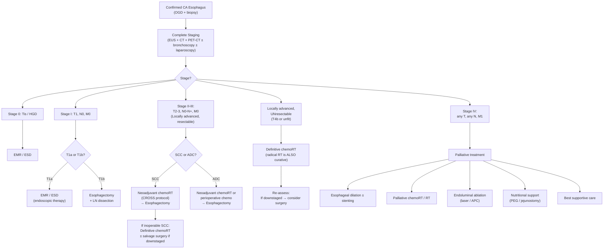

## Management of CA Esophagus

### Guiding Principles — How to Think About Treatment

Before diving into modalities, internalise the framework that drives every management decision. There are **three factors** that determine treatment [1]:

1. ***Tumour factor*** — size, location (upper/mid/lower 1/3, cardia), ***presence of lymph node metastasis***, ***invasion into adjacent major organs (resectable vs unresectable)*** [1][2]
2. ***Patient factor*** — age, comorbidities, ***lung function (FEV1 > 1.5 L)***, ***exercise tolerance ( > 2 flights of stairs)***, smoking status, nutritional status [2]
3. ***Surgeon/organ factor*** — experience of surgeon, hospital equipment, ***method of reconstructing esophagus*** [2]

And there are **three treatment objectives** [1]:
- ***Local control = resection of tumour with negative (clear) resection margin***
- ***Regional control = lymph node dissection***
- ***Systemic control = NOT indicated for CA esophagus*** (i.e., there is no role for routine adjuvant systemic chemotherapy in isolation unlike, say, colon cancer — but neoadjuvant and definitive chemoradiation play major roles)

The fundamental decision is **curative vs palliative**:
- ***Early stage cancer should be offered curative treatment*** (surgery ± neoadjuvant, or radical chemoRT)
- ***Advanced stage cancer should be offered palliative care*** [1]

<Callout title="Key Principle">
***Surgery alone produces few cures in either squamous cell or adenocarcinoma except in the earliest stages of disease*** [1]. This is why multimodality treatment (neoadjuvant chemoRT + surgery) is the standard of care for locally advanced but resectable disease.
</Callout>

---

### Management Algorithm by Stage

### Stage-by-Stage Treatment Summary [2]

| Stage | TNM | Treatment |
|---|---|---|
| ***0*** | ***Tis, N0, M0*** | ***Tis/T1a (confined to mucosa): EMR / ESD*** [2] |
| ***I*** | ***T1, N0, M0*** | ***T1b (invades submucosa): esophagectomy*** [2] |
| ***II*** | ***T2–3, N0, M0 or T1–2, N1, M0*** | ***Operable SCC: neoadjuvant chemoRT + esophagectomy*** [2] |
| | | ***Inoperable SCC: upfront chemoRT ± esophagectomy (if downstaged)*** [2] |
| ***III*** | ***T3, any N, M0*** | ***Operable ADC: esophagectomy*** (with perioperative chemotherapy) [2] |
| | | ***Inoperable ADC: chemoRT*** [2] |
| ***IV*** | ***any T, any N, M1*** | ***Esophageal balloon dilation ± stenting; Palliative chemoRT*** [2] |

---

### Detailed Treatment Modalities

#### A. Endoscopic Therapy — EMR and ESD [1][2]

"Endoscopic" → from Greek *endo-* (within) + *skopein* (to look) — you're treating from inside the lumen.

| Feature | Detail |
|---|---|
| **Principle** | Remove the superficial tumour through the endoscope, preserving the native esophagus |
| ***Indications*** | ***Superficial cancer limited to mucosa (T1a)*** but ***NOT for more advanced cancer since the chance of lymph node metastasis is too high*** [1]; patients who prefer esophageal preservation [1] |
| **Critical cut-off** | ***Tumour invasion into submucosa (T1b), even without visible LN involvement, should receive esophagectomy with LN dissection due to high frequency (20–25%) of concurrent findings of positive LNs*** [1] |
| ***Advantages*** | ***Esophageal preservation and reduced post-treatment mortality*** [1]; ***less invasive, safe, and highly effective (90% survival)*** [2] |
| ***Disadvantages*** | ***Technically demanding and lack of long-term outcomes and recurrence data*** [1] |

**EMR vs ESD:**

| | ***EMR*** | ***ESD*** |
|---|---|---|
| Technique | ***Snare resection*** after submucosal injection (hyaluronic acid + saline) to elevate the lesion [2] | ***Dissect lesions from the submucosa*** using an insulated-tip knife [1] |
| Size limit | ***Not effective for lesions > 2 cm*** — piecemeal resection is necessary → increased complications, impossible to conclusively assess completeness of lateral resection margin [1] | ***Can remove larger lesions intact*** (en-bloc) [1] |
| En-bloc rate | Lower | ***Higher en-bloc resection rate*** [2] |
| Complications | Lower | Higher (bleeding, perforation, stricture) |

<Callout title="T1a vs T1b — The Most Important Staging Decision">
This single distinction changes everything: **T1a → endoscopic therapy (organ-sparing)**; **T1b → major surgery (esophagectomy)**. Why? Because the submucosa contains the dense lymphatic plexus. Once tumour reaches the submucosa, the probability of lymph node metastasis jumps to 20–25%, making endoscopic therapy inadequate (it doesn't remove lymph nodes). This is why EUS is performed before deciding on endoscopic vs surgical treatment.
</Callout>

---

#### B. Esophagectomy with Reconstruction and LN Dissection [1][2]

This is the definitive curative surgery. It is a major operation with significant morbidity (30–50%) and mortality (2–5% in high-volume centres).

##### Surgical Approaches

| Approach | Technique | Key Features |
|---|---|---|
| ***Ivor-Lewis (2-stage, transthoracic)*** [1] | **Step 1**: Upper midline abdominal incision — mobilise stomach, divide left gastric artery and LNs, create gastric conduit. **Step 2**: ***Right thoracotomy (entry above 5th rib)*** — ***gives excellent access to mediastinum and thoracic inlet*** [1]; esophagectomy + ***intrathoracic esophagogastric anastomosis*** | Best for mid/lower thoracic tumours; allows direct vision thoracic lymphadenectomy; anastomosis is intrathoracic (risk: if it leaks → mediastinitis) |
| ***McKeown (3-stage, transthoracic)*** [1] | **Step 1**: Abdominal — same as Ivor-Lewis. **Step 2**: Right thoracotomy — esophagectomy. **Step 3**: ***Neck incision — cervical esophagogastric anastomosis*** | Best for upper thoracic tumours where you need a proximal resection margin in the neck; cervical anastomosis is safer if it leaks (drains externally rather than into mediastinum); ***but higher risk of anastomotic leak (10%) because gastric conduit has more tension and poorer blood supply*** [2] |
| ***Transhiatal (THE)*** [1][2] | ***Esophagectomy without a thoracotomy*** [1]; stomach mobilised via midline abdominal incision; diaphragm opened from abdomen; lower esophagus mobilised under direct vision; upper esophagus mobilised by ***blunt dissection***; cervical anastomosis via neck incision | ***Provides removal of tumour and LN in the lower mediastinum ONLY but not in upper or middle mediastinum*** [1]; ***unsuitable for SCC*** (usually needs full mediastinal lymphadenectomy); ***advantages: reduced risk of pneumonia, suitable for poor lung function*** [2]; rarely done now [2] |

**Why can the esophagus be mobilised by blunt dissection?** Because the ***esophagus has segmental blood supply by small vessels only*** [1] — these can be divided sequentially without catastrophic bleeding, unlike the aorta or major visceral arteries.

##### Key Surgical Principles

- ***Lymph node dissection is mandatory in all approaches*** [1]
- ***Resection margin should be generous since CA esophagus is NOTORIOUS for submucosal spread*** [1] — aim for ≥ 5 cm proximal and distal margins; intraoperative frozen section of margins is standard
- **Extent of lymphadenectomy** [2]:
  - ***10 cm proximal and 5 cm distal to macroscopic tumour***
  - ***2-field dissection: Field 1 (cervical) and Field 2 (mediastinal) for upper 1/3 tumours; Field 2 (mediastinal) and Field 3 (abdominal/celiac) for lower 1/3 tumours*** [2]

**Fields of LN dissection** [2]:
1. ***Field 1: Cervical LN***
2. ***Field 2: Mediastinal LN***
3. ***Field 3: Intra-abdominal (celiac) LN***

##### Reconstruction — The Gastric Conduit [2]

After removing the esophagus, you need to reconstruct the alimentary tract. The stomach is the preferred conduit:

- ***Gastric mobilisation*** [2]: ***ligate left-sided blood supply (short gastric artery, left gastric artery, left gastroepiploic artery)*** — the conduit survives on the **right gastroepiploic artery** and **right gastric artery**
- ***Route***: bring gastric conduit up via ***native tract of esophagus*** (lowest tension, best blood supply) or ***retrosternal / subcutaneous*** routes if re-operating [2]
- ***Pyloroplasty***: ***improve gastric emptying post-op*** [2] — the vagus nerves are inevitably transected during esophagectomy → vagal denervation → gastric stasis; pyloroplasty bypasses this
- ***Insert feeding jejunostomy tube*** [2] — post-operative nutrition while the anastomosis heals
- **Alternative conduit**: ***colonic interposition*** (e.g., previous gastrectomy, post-leakage) — ***needs bowel prep and antibiotics*** [2]

##### Other Rare Approaches [2]

- ***Thoraco-abdominal approach***: for very distal tumours; limited by arch of aorta
- ***Pharyngo-laryngo-oesophagectomy (PLO)***: for very proximal tumours; ***requires permanent tracheostomy and voice rehabilitation → primary chemoRT is preferred now*** [2]

##### Choice of Surgery by Tumour Location and Siewert Type [1]

| Tumour Location | Preferred Approach | Rationale |
|---|---|---|
| Upper 1/3 | McKeown (3-stage) or primary chemoRT | Need proximal margin in the neck; PLO reserved for selected cases |
| Middle 1/3 | McKeown or Ivor-Lewis | Both allow adequate mediastinal access |
| Lower 1/3 / ***Siewert Type I*** | ***Transthoracic en bloc esophagectomy + partial gastrectomy + 2-field lymphadenectomy*** [1] | Distal ADC arising from Barrett's |
| ***Siewert Type II*** | ***Transabdominal/transhiatal resection of distal esophagus + total gastrectomy + lymphadenectomy of lower mediastinum and abdominal D2 nodal compartment*** [1] | True cardia cancer |
| ***Siewert Type III*** | ***Same as Type II*** [1] | Subcardial gastric cancer infiltrating upward |

##### Prevention of Surgical Complications [1]

| Phase | Measures |
|---|---|
| ***Pre-operative*** | ***Encourage respiratory muscle exercise; smoking cessation*** [1] |
| ***Intraoperative*** | ***Prevent prolonged operation*** (→ atelectasis from mucus accumulation); ***prevent infusion of large amount of fluid*** (→ pulmonary oedema) [1] |
| ***Post-operative*** | ***Encourage respiratory muscle exercise (deep breathing exercise); encourage coughing*** (→ prevent sputum retention); ***chest physiotherapy; pain control*** (***PCA, thoracic epidural analgesia***); ***early mobilisation*** [1] |

---

#### C. Chemotherapy and Radiotherapy [1][2]

##### Neoadjuvant ChemoRT — The CROSS Protocol [2]

This is the landmark trial that established the current standard of care for locally advanced esophageal cancer:

| Feature | Detail |
|---|---|
| ***Indication*** | ***Locally advanced SCC — T2N1, T3N0, T3N1*** [2]; also used for locally advanced ADC |
| ***Regimen*** | ***5-fluorouracil + cisplatin + 40 Gy RT*** [2] |
| ***Schedule*** | ***6–8 weeks for 2 courses → wait 4 weeks and repeat PET-CT + OGD → wait 4 weeks for surgery*** [2] |
| **Rationale** | ***Neoadjuvant chemotherapy: (1) downstage and shrink the tumour to increase chance of operability; (2) eradicate occult or silent micrometastasis next to primary tumour*** — based on the observation that ***most patients develop postoperative systemic metastasis without local recurrences*** [1] |
| ***Side effects*** | ***RT-induced fibrosis, worsened dysphagia*** [2] |

**Why "neoadjuvant" (before surgery) rather than "adjuvant" (after surgery)?**
- Post-operatively, the patient is recovering from a massive operation → may not tolerate chemotherapy
- The tumour has its own blood supply intact pre-operatively → chemotherapy drugs reach the tumour more effectively
- Neoadjuvant treatment can shrink the tumour → making surgery technically easier with better resection margins
- The pathological response to neoadjuvant therapy provides prognostic information (complete pathological response = excellent prognosis)

##### Adjuvant ChemoRadiation [1]

| Feature | Detail |
|---|---|
| **Rationale** | ***Eradicate residual tumour at resection margin; decreases risk of local recurrence*** [1] |
| **When** | Considered if positive margins (R1 resection), node-positive disease, or poor prognostic features on final pathology |

##### Definitive (Radical) ChemoRT — Without Surgery [1][2]

| Feature | Detail |
|---|---|
| ***Indication*** | ***Inoperable SCC; patients not fit for surgery (e.g., poor lung function)*** [2] |
| **Key point** | ***Radical radiotherapy is ALSO curative*** [1] — this is important to remember. For SCC especially, definitive chemoRT can achieve cure rates approaching surgery in selected patients |
| ***Regimen*** | ***Cisplatin + 5-fluorouracil + > 50 Gy RT*** [2] |
| **SCC vs ADC** | ***SCC is more sensitive to chemoRT*** [2]; ***ADC is less sensitive to chemoRT → surgery is preferred*** [2] |

<Callout title="SCC vs ADC — Treatment Sensitivity Difference">
***SCC is more sensitive to chemoRT; ADC is less sensitive to chemoRT → surgery is preferred for ADC*** [2]. This is a key exam point. The biological basis: SCC cells have higher proliferative rates and are more susceptible to radiation-induced DNA damage. ADC cells tend to be more radiation-resistant, so surgical resection remains the backbone of ADC management.
</Callout>

##### Targeted Therapy and Immunotherapy (Current Practice, 2024–2026)

These are increasingly important, especially for advanced/metastatic disease:

| Agent | Target | Indication |
|---|---|---|
| **Trastuzumab** (Herceptin) | HER2 receptor | HER2-positive ADC (overexpressed in ~20% of esophageal/EGJ ADC); added to first-line chemotherapy |
| **Ramucirumab** | VEGFR-2 | Second-line for advanced ADC; anti-angiogenic |
| **Nivolumab / Pembrolizumab** | PD-1 | PD-L1-positive or MSI-high tumours; now part of first-line treatment (CheckMate 649, KEYNOTE-590 trials); also adjuvant nivolumab post-neoadjuvant chemoRT + surgery (CheckMate 577) |

> In the current era (2025–2026), **adjuvant nivolumab** for 1 year post-esophagectomy after neoadjuvant chemoRT in patients who did NOT achieve complete pathological response is standard of care per the **CheckMate 577 trial** — this significantly improves disease-free survival.

---

#### D. Palliative Treatment [1][2]

***Indications*** [1]:
- ***Patients with metastatic cancer (M1)***
- ***Cancers invading adjacent organs that are unresectable (T4b)***

The goals are to relieve dysphagia, maintain nutrition, control symptoms, and improve quality of life.

| Modality | Detail | Key Points |
|---|---|---|
| ***Esophageal dilation + stenting*** [1][2] | ***Self-expanding metallic stents (SEMS) with silicone coating*** placed endoscopically to palliate significant dysphagia [2] | ***NOT suitable for tumours long in size*** (poor functional peristalsis) ***or located in the cervical esophagus*** (discomfort) [1]; complications: ***perforation, erosion, obstruction of tube, or migration of stent*** [1]; ***unable to give RT after stenting*** [2] |
| ***Endoluminal ablation*** [1][2] | ***Laser ablation, argon plasma coagulation (APC)*** — ***restore esophageal lumen successfully 90% of the time with only a 4–5% perforation rate*** [1]; also used to ***open lumen / unblock stent*** [2] | |
| ***Radiotherapy*** [1][2] | ***External beam RT or brachytherapy (intraluminal RT)*** [2]; ***SCC is usually radiosensitive whereas ADC is less responsive*** [1] | ***First choice for palliation of EGJ cancers*** since ***stents placed across the EGJ are associated with higher chance of gastroesophageal reflux*** [1] |
| ***Chemotherapy*** [1] | ***Current regimens include cisplatin + 5-fluorouracil (5-FU)*** [1]; palliative chemoRT for symptom control | |
| ***Nutritional support*** [1][2] | ***PEG (percutaneous endoscopic gastrostomy), jejunostomy tube (PEJ), NG tube, open gastrostomy*** [1][2] | Essential for maintaining caloric intake when the esophagus is completely obstructed |
| **Best supportive care** | Pain management, anti-emetics, psychosocial support | For patients with very advanced disease or poor performance status |

<Callout title="Why NOT Stent Across the EGJ?" type="idea">
***Stents placed across the EGJ are associated with higher chance of gastroesophageal reflux*** [1]. This makes sense: the stent holds the EGJ permanently open, abolishing the physiological sphincter mechanism. The patient then suffers intractable reflux on top of their cancer. For EGJ tumours, **palliative RT** (especially brachytherapy) is preferred because it shrinks the tumour without permanently propping the sphincter open.
</Callout>

---

#### E. Management of Barrett's Esophagus (Pre-malignant Condition) [1][2]

Since Barrett's is the precursor lesion for ADC, its management is essentially **cancer prevention**:

- ***ALL patients with Barrett's esophagus should receive PPI whether they are symptomatic or not*** [1]
- ***Non-dysplasia***: endoscopic surveillance every ***3–5 years*** [1][2]
- ***Low-grade dysplasia***: ***endoscopic surveillance every 6 months for one year then annually if negative*** [1]; OR ***EMR + endoscopic radiofrequency ablation (RFA) to ablate remaining metaplastic epithelium*** [1]
- ***High-grade dysplasia***: ***EMR + RFA*** [1]; or ***esophagectomy*** — ***only therapy that removes all neoplastic epithelium along with any occult malignancy and regional LNs*** but ***associated with high procedure-related morbidity and mortality*** [1]

---

### Complications of Esophagectomy [2]

Understanding complications is essential because they are commonly tested and because anticipating them guides peri-operative management.

#### Early Complications

| Complication | Incidence | Mechanism / Detail | Management |
|---|---|---|---|
| ***Post-op pneumonia*** | ***20%*** | ***Due to smoker status, thoracotomy, one-lung ventilation, vocal cord palsy*** [2] | Antibiotics, chest physiotherapy, incentive spirometry |
| **Reactionary bleeding** | Uncommon | ***Transection of azygos vein / aortic branches to esophagus*** [2] | Surgical re-exploration |
| ***Anastomotic leak*** | ***10%*** | ***Risk factors: poor blood supply of esophagus, tension of conduit, absence of serosa, use of neoadjuvant RT, surgeon technique*** [2] | ***NPO, IV fluids, TPN, antibiotics, monitor drain output; conservative: lay open for drainage (three-stage only); endoscopic: stenting, EndoSponge*** [2] |
| ***Conduit ischaemia*** | | ***Suspect if sepsis or metabolic acidosis within first 24 hours*** [2]; ***prevention: intraoperative ICG*** (indocyanine green fluorescence to assess conduit perfusion) [2] | ***Conservative if mild (Types 1/2); take down anastomosis if severe (Type 3): cervical esophagostomy + resection of ischaemic conduit*** [2] |
| ***RLN injury*** | ***20%*** | ***During LN dissection*** [2] — the recurrent laryngeal nerve runs in the tracheoesophageal groove and is at risk during mediastinal lymphadenectomy | Speech therapy; if bilateral → may need tracheostomy |
| ***Vagus nerve injury*** | Virtually universal | Vagotomy during esophagectomy → ***delayed gastric emptying*** [2] | ***Routine pyloroplasty*** [2]; prokinetics (metoclopramide, erythromycin) |
| ***Thoracic duct injury → chylothorax*** | | ***Diagnosis: increased drain output (milky appearance), TG > 110 or chylomicrons in pleural fluid*** [2] | ***Monitor: clinical (SOB), CXR, drain output; diet: NPO + TPN; octreotide; re-operation (suture ligation of thoracic duct stump) if output > 1 L/day*** [2] |
| **Atelectasis** | Common | One-lung ventilation during surgery; pain → splinting → poor cough [2] | Chest physiotherapy, incentive spirometry, early mobilisation |

#### Late Complications [2]

| Complication | Detail |
|---|---|
| ***Anastomotic stricture*** | ***Requires endoscopic dilation*** [2]; can be recurrent |
| ***Post-op GERD*** | ***PPI, motility agents*** [2]; the gastric conduit has no sphincter mechanism |
| ***Biliary reflux*** | Bile refluxes into the neo-esophagus; difficult to manage |
| ***Delayed gastric emptying*** | Despite pyloroplasty; prokinetics |
| **Dumping syndrome** | Rapid gastric emptying after vagotomy; early (osmotic) and late (reactive hypoglycaemia) |
| **Nutritional deficiencies** | Weight loss (nearly universal), iron deficiency, B12 deficiency |

---

### Contraindications to Curative Surgery

| Absolute Contraindications | Relative Contraindications |
|---|---|
| ***M1 disease (distant metastasis)*** | Poor nutritional status (albumin < 30, > 10% weight loss) |
| ***T4b (unresectable invasion: aorta, trachea, vertebral body)*** [2] | Advanced age with significant comorbidities |
| Positive peritoneal cytology | ***FEV1 < 1.25 L*** (relative — can consider THE approach) [1] |
| Poor performance status (ECOG ≥ 3) | Severe cardiac disease |
| Patient refusal | |

---

<Callout title="High Yield Summary — Management">

1. **T1a (mucosal)** → EMR/ESD (endoscopic therapy); organ-preserving; 90% survival.
2. **T1b (submucosal)** → Esophagectomy + LN dissection (20–25% LN metastasis even without visible LN involvement).
3. **Locally advanced, resectable (T2–3, N0–N+, M0)** → Neoadjuvant chemoRT (CROSS: 5-FU + cisplatin + 40 Gy) → esophagectomy.
4. **Inoperable / unfit** → Definitive chemoRT (radical RT is also curative, especially for SCC).
5. **SCC is more sensitive to chemoRT; ADC is less sensitive → surgery is the backbone for ADC.**
6. **Stage IV (M1) / T4b** → Palliative: stenting, endoluminal ablation, RT/brachytherapy, chemotherapy, nutritional support (PEG/jejunostomy).
7. **Esophagectomy approaches**: Ivor-Lewis (2-stage, intrathoracic anastomosis), McKeown (3-stage, cervical anastomosis), Transhiatal (no thoracotomy, limited LN dissection).
8. **LN dissection is mandatory in ALL approaches**; resection margin generous due to submucosal spread.
9. **Gastric conduit** — survives on right gastroepiploic artery; routine pyloroplasty for vagal denervation; feeding jejunostomy.
10. **Major complications**: pneumonia (20%), anastomotic leak (10%), RLN injury (20%), chylothorax, conduit ischaemia.
11. **Barrett's management**: PPI for all; surveillance stratified by dysplasia grade; EMR + RFA for dysplastic Barrett's.
12. **Adjuvant nivolumab** (CheckMate 577) — for patients without complete pathological response after neoadjuvant chemoRT + surgery.

</Callout>

---

<ActiveRecallQuiz
  title="Active Recall - Management of CA Esophagus"
  items={[
    {
      question: "A patient has T1a esophageal SCC confirmed on EUS. What is the recommended treatment and why is esophagectomy not needed?",
      markscheme: "Treatment: EMR or ESD (endoscopic therapy). T1a is confined to the mucosa (lamina propria or muscularis mucosae). The risk of lymph node metastasis is very low (<2%) because tumour has not reached the submucosal lymphatic plexus. Esophagectomy would be overtreatment with unnecessary morbidity and mortality.",
    },
    {
      question: "What is the CROSS neoadjuvant protocol? State the regimen, indication, and schedule.",
      markscheme: "Indication: locally advanced resectable SCC (T2N1, T3N0, T3N1), also used for ADC. Regimen: 5-fluorouracil + cisplatin + 40 Gy radiotherapy. Schedule: 6-8 weeks for 2 courses, wait 4 weeks, repeat PET-CT and OGD for response assessment, wait 4 weeks, then proceed to surgery.",
    },
    {
      question: "Compare the Ivor-Lewis and McKeown esophagectomy approaches. Which has a higher anastomotic leak rate and why?",
      markscheme: "Ivor-Lewis (2-stage): abdominal + right thoracotomy, intrathoracic anastomosis. McKeown (3-stage): abdominal + right thoracotomy + neck incision, cervical anastomosis. McKeown has higher anastomotic leak rate (~10%) because the gastric conduit must be pulled higher to the neck, resulting in more tension and poorer blood supply at the conduit tip. However, cervical leaks are safer (drain externally) compared to intrathoracic leaks (cause mediastinitis).",
    },
    {
      question: "Why is pyloroplasty routinely performed during esophagectomy?",
      markscheme: "During esophagectomy, the vagus nerves are inevitably transected (vagotomy). The vagus nerve provides the motor innervation for gastric emptying via the pylorus. Without vagal input, gastric emptying is severely delayed (gastroparesis). Pyloroplasty widens the pyloric channel to compensate for the loss of coordinated pyloric relaxation.",
    },
    {
      question: "A patient with esophageal SCC has a tumour invading the trachea on CT. Is this patient a candidate for curative surgery? Explain.",
      markscheme: "No. Tracheal invasion is classified as T4b (unresectable). T4b structures include aorta, trachea, bronchus, and vertebral body — these cannot be safely resected en bloc. This patient should receive definitive chemoRT. If the tumour is downstaged, salvage surgery may be considered. T4a structures (pleura, pericardium, diaphragm) are resectable.",
    },
    {
      question: "List 3 palliative treatment options for a patient with metastatic esophageal cancer causing complete dysphagia, and explain why stenting across the EGJ is problematic.",
      markscheme: "Options: (1) SEMS (self-expanding metallic stent) for proximal obstruction; (2) Palliative radiotherapy or brachytherapy; (3) Nutritional support (PEG or jejunostomy). Stenting across the EGJ is problematic because it permanently holds the sphincter open, abolishing the anti-reflux mechanism, causing severe gastroesophageal reflux. For EGJ tumours, palliative RT (especially brachytherapy) is preferred.",
    },
  ]}
/>

## References

[1] Senior notes: felixlai.md (Esophageal cancer — Treatment sections: General principles, Medical treatment, Surgical treatment, Palliative treatment, Prevention of complications; Barrett's esophagus — Management; Siewert classification)
[2] Senior notes: maxim.md (CA esophagus — Management table, Endoscopic therapy, Esophagectomy, Neoadjuvant therapy CROSS, Complications of esophagectomy, Primary chemoRT, Palliative treatments; Barrett's oesophagus — Management)
