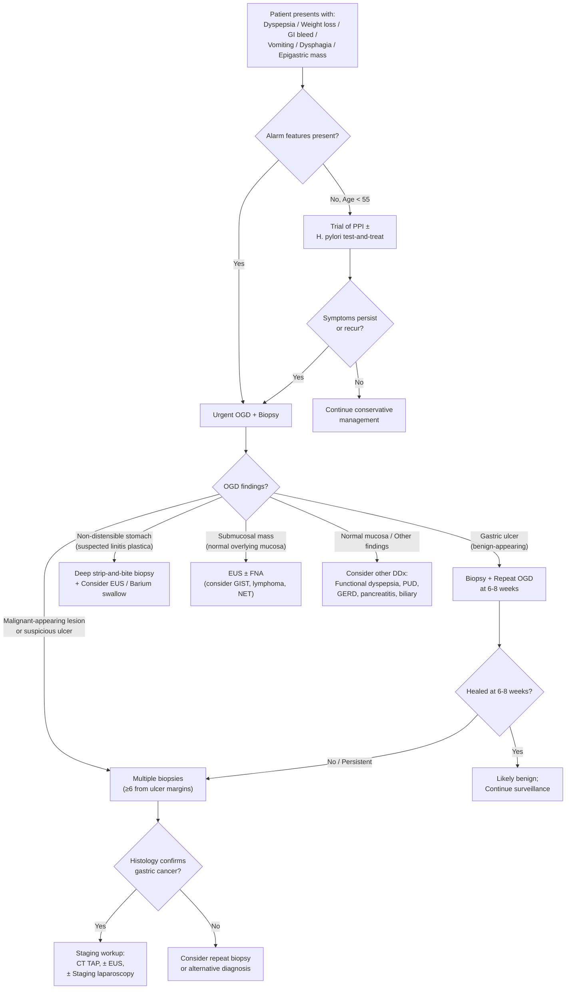

## Differential Diagnosis of CA Stomach

The differential diagnosis of gastric cancer is fundamentally about **pattern recognition** — you are presented with a patient who has some combination of dyspepsia, weight loss, vomiting, GI bleeding, anaemia, an epigastric mass, or dysphagia. The key question is: *what else could produce this clinical picture?*

The approach depends on the **dominant presenting feature**. Let me walk you through this systematically.

---

### Why is the Differential Diagnosis Broad?

***Gastric cancer is notoriously difficult to diagnose early*** [5]. The symptoms — epigastric discomfort, bloating, early satiety, nausea — are **identical to benign conditions** like functional dyspepsia and peptic ulcer disease, which are vastly more common. This is why alarm features (red flags) exist: they are the clinical "tripwires" that should shift your thinking from benign to potentially malignant.

***The clinical presentation of benign gastric ulcer, early gastric cancer, and advanced gastric cancer can overlap significantly*** [5]. An OGD with biopsy is the only way to reliably distinguish them.

---

### A. Differential Diagnosis by Presenting Syndrome

#### 1. Dyspepsia / Epigastric Pain

This is the **most common presentation** of gastric cancer, but dyspepsia affects ~25% of the population and is overwhelmingly benign [8].

| Differential | Key Distinguishing Features | Why It Mimics CA Stomach |
|:---|:---|:---|
| ***Functional dyspepsia (60% of dyspepsia)*** | No structural cause on OGD; Rome IV criteria; symptoms > 6 months; no alarm features | Shares epigastric pain, early satiety, bloating, nausea [8] |
| ***Peptic ulcer disease (gastric/duodenal)*** | Epigastric pain related to meals; GU: precipitated by food; DU: relieved by food, worse at night; *H. pylori* or NSAID history | Epigastric pain, GI bleeding, weight loss (from food avoidance); **gastric ulcers must ALWAYS be biopsied to exclude malignancy** [4][8] |
| ***Gastro-oesophageal reflux disease (GERD)*** | Retrosternal burning (heartburn), regurgitation, worse on lying flat/bending; responds to PPI | Can cause epigastric discomfort; proximal gastric/cardia cancer may cause reflux-like symptoms [8] |
| ***Chronic pancreatitis*** | Epigastric pain radiating to the back; steatorrhoea; history of alcohol/recurrent pancreatitis; pancreatic calcifications on imaging | Epigastric pain, weight loss, anorexia [8] |
| ***Pancreatic cancer*** | ***Painless progressive obstructive jaundice*** (head); ***severe epigastric pain radiating to the back*** (body/tail); new-onset DM; weight loss [9][10] | Weight loss, epigastric mass, anorexia; may present identically to CA stomach — requires imaging (CT) to differentiate |
| ***Gastritis / Duodenitis*** | Often drug-induced (NSAIDs, alcohol) or stress-related; typically self-limited; diagnosed on OGD | Epigastric pain, nausea, GI bleeding [8] |
| ***Biliary colic / Cholecystitis*** | RUQ/epigastric pain, colicky, post-prandial (fatty food), Murphy's sign; USS shows gallstones | Epigastric pain post-prandially; referred epigastric pain |

<Callout title="The Golden Rule for Gastric Ulcers" type="error">
Every gastric ulcer found on OGD must be biopsied (multiple biopsies from the ulcer margin) AND followed up with a repeat OGD at 6–8 weeks to confirm healing. Unlike duodenal ulcers (which virtually never become malignant), **gastric ulcers can harbour carcinoma**, and a malignant ulcer can look macroscopically identical to a benign one [4][8].
</Callout>

#### 2. Upper GI Bleeding (Haematemesis / Melaena / Iron Deficiency Anaemia)

Gastric cancer accounts for a **small proportion** of UGIB — peptic ulcer disease is by far the most common cause [8][11].

| Differential | Key Distinguishing Features |
|:---|:---|
| ***Peptic ulcer disease*** (most common cause of UGIB) | 4 major risk factors: *H. pylori*, NSAIDs, stress, excess acid; episodic bleeding; visible vessel/clot on OGD [8][11] |
| ***Oesophagogastric varices*** | History of liver cirrhosis / portal hypertension; massive haematemesis; stigmata of chronic liver disease [8] |
| ***Erosive oesophagitis / oesophageal ulcers*** | GERD history; medications (bisphosphonates, tetracyclines); infections (HSV, Candida) [8] |
| ***Gastritis / Duodenitis*** | Drug/alcohol/stress-related; typically self-limited; mucosal inflammation on OGD [8] |
| ***Portal hypertensive gastropathy*** | Cirrhotic patients; friable mucosa with "snakeskin" or "mosaic" pattern on OGD; more commonly occult bleeding [8] |
| ***Mallory-Weiss syndrome*** | Longitudinal mucosal tear at GOJ preceded by forceful retching/vomiting; typically self-limited [8] |
| ***Dieulafoy's lesion*** | Dilated aberrant submucosal artery eroding overlying epithelium without primary ulcer; usually proximal stomach along lesser curvature; intermittent arterial spurting [8] |
| ***Gastric antral vascular ectasia (GAVE)*** | "Watermelon stomach" — longitudinal reddish stripes radiating from pylorus; associated with cirrhosis, autoimmune disease [8] |
| ***Angiodysplasia*** | Dilated tortuous submucosal vessels; more common in elderly; associated with aortic stenosis (Heyde's syndrome) [8] |
| ***Other upper GI malignancy*** | Oesophageal cancer, duodenal cancer — uncommon causes of UGIB; constitutional symptoms more prominent [8] |

#### 3. Vomiting / Gastric Outlet Obstruction (GOO)

***GOO is malignant until proven otherwise*** — **80% malignant, 20% benign** [2][12].

| Differential | Key Features |
|:---|:---|
| **Malignant (80%)** | |
| ***Gastric cancer (most common cause of GOO)*** | Progressive, non-bilious vomiting of undigested food; weight loss; epigastric mass [2][12] |
| ***Gastric lymphoma*** | Similar presentation; may have B symptoms (fever, night sweats, weight loss) [2] |
| ***Extrinsic compression: CA head of pancreas, CA ampulla of Vater, transverse colon/hepatic flexure, locally advanced cholangiocarcinoma/CA gallbladder*** | Jaundice may be prominent; distinct imaging findings [12] |
| **Benign (20%)** | |
| ***PUD-related pyloric stenosis (2nd most common cause)*** | Long history of PUD; chronic fibrotic scarring at pylorus [12] |
| ***Gastric volvulus*** | Acute presentation; associated with paraesophageal (rolling) hiatal hernia; Borchardt's triad (epigastric pain, retching, inability to pass NG tube) [12] |
| ***Foreign body / Bezoar / Bouveret syndrome*** | Bouveret = gallstone impaction in duodenum (gallstone ileus variant) [12] |
| ***SMA syndrome*** | Thin young patients; duodenal compression between SMA and aorta [12] |
| ***Chronic pancreatitis*** | Inflammatory exudate compressing duodenum [12] |
| ***Crohn's disease, Gastric TB*** | Chronic inflammatory stricturing [12] |

#### 4. Dysphagia (Proximal / Cardia Tumour)

When gastric cancer involves the **cardia or GOJ**, the presentation overlaps with oesophageal cancer [6].

| Differential | Key Distinguishing Features |
|:---|:---|
| ***Oesophageal carcinoma (SCC or adenocarcinoma)*** | Progressive dysphagia (solids → liquids); weight loss; SCC: mid-oesophagus, smoking/alcohol; adenocarcinoma: distal oesophagus/GOJ, Barrett's [6] |
| ***Achalasia*** | Dysphagia to both solids AND liquids from onset; regurgitation of undigested food; bird's beak on barium swallow; diagnosed by high-resolution manometry [13] |
| ***Pseudoachalasia*** | Mimics achalasia but caused by ***CA cardia invading the oesophageal neural plexus*** (paraneoplastic); differentiate by OGD + EUS — look for mass [13] |
| ***Oesophageal stricture (peptic)*** | History of longstanding GERD; smooth, tapered narrowing on barium/OGD |
| ***Extrinsic compression*** | Mediastinal lymphadenopathy, lung cancer, aortic aneurysm |

<Callout title="Pseudoachalasia — A Dangerous Mimic" type="error">
***Pseudoachalasia*** can be caused by malignancy at the GOJ/cardia invading the oesophageal neural plexus directly, or as a paraneoplastic syndrome [13]. Clues that suggest pseudoachalasia over true achalasia: **age > 60**, **rapid onset of dysphagia ( < 6 months)**, **significant weight loss**, and **difficulty passing the endoscope through the GOJ**. Always perform OGD (± EUS) before diagnosing achalasia to exclude malignancy [13].
</Callout>

#### 5. Epigastric Mass

An epigastric mass narrows the differential considerably, but you still need to consider non-gastric causes [5][14].

| Differential | Key Features |
|:---|:---|
| ***Gastric adenocarcinoma*** | Firm, irregular epigastric mass; associated with weight loss, anaemia, GI bleed [5] |
| ***Gastric lymphoma*** | May be indistinguishable from adenocarcinoma on examination; typically younger; B symptoms; OGD + biopsy with IHC needed [2] |
| ***GIST (gastrointestinal stromal tumour)*** | ***50% in stomach (most common proximal stomach); usually incidental finding; mass with smooth margins and normal overlying mucosa on OGD; arises from muscularis propria (interstitial cells of Cajal); diagnosed by EUS + FNA; IHC: CD117 (c-KIT) positive*** [14] |
| ***Pancreatic cancer / pseudocyst*** | Mass may be palpable in the epigastrium; associated with jaundice (head), back pain (body/tail), weight loss [9][10] |
| ***Hepatomegaly (metastatic liver)*** | Hard, nodular, irregular liver edge extending into epigastrium; ***commonest site of metastasis from GI tract via portal venous circulation*** [15] |
| ***Omental cake*** | Hard, irregular mass across upper abdomen; peritoneal carcinomatosis (often from gastric, ovarian, or colonic primary) [2] |
| ***Gastric volvulus*** | Acute or chronic; tympanitic epigastric distension |

### B. Differential Diagnosis of Gastric Mass by Wall Layer

This is a useful conceptual framework (especially relevant for EUS assessment) [14]:

| Layer | Differential |
|:---|:---|
| **Mucosa** | ***Adenocarcinoma***, gastrinoma, carcinoid, adenoma |
| **Submucosa** | ***Neuroendocrine tumour (NET)***, ***lymphoma***, lipoma, ectopic pancreas |
| **Muscularis propria** | ***GIST*** (most common), leiomyoma, leiomyosarcoma, schwannoma, desmoid tumour |
| **Serosa/Adventitia** | Extrinsic compression (pancreas, spleen, lymph nodes) |

[14]

---

### C. Clinical Approach — Diagnostic Algorithm

The following algorithm represents how to approach a patient whose presentation raises suspicion for gastric cancer:

---

### D. Key Differentiating Points — Gastric Cancer vs Its Major Mimics

| Feature | CA Stomach | Peptic Ulcer Disease | Gastric Lymphoma | GIST |
|:---|:---|:---|:---|:---|
| **Age** | Older (intestinal) or younger (diffuse) | Any age | 50–60s | 50–70s |
| **Symptoms** | Progressive, alarm features | Episodic, meal-related | B symptoms possible | Often incidental |
| **OGD appearance** | Irregular ulcer, mass, rigid wall | Clean-based or cratered ulcer, smooth margins | Thickened folds, mass, ulceration | Smooth submucosal bulge, intact mucosa |
| **Biopsy** | Adenocarcinoma | Inflammatory, no dysplasia | Lymphoid tissue; IHC for B-cell markers | ***Spindle cells; CD117+, c-KIT mutation*** [14] |
| **Key investigation** | OGD + biopsy | OGD + biopsy + CLO test | OGD + deep biopsy + IHC | ***EUS + FNA*** [14] |

<Callout title="Gastric Lymphoma vs Adenocarcinoma" type="idea">
Gastric lymphoma (usually MALT lymphoma or diffuse large B-cell lymphoma) can present identically to adenocarcinoma on OGD. Key differences: lymphoma may show **thickened gastric folds** rather than a discrete mass, and it often responds to *H. pylori* eradication (early-stage MALT). **Deep biopsies with immunohistochemistry** (CD20, CD79a for B-cell markers) are essential — superficial biopsies may miss the lymphoid infiltrate in the lamina propria/submucosa [2][14].
</Callout>

---

### E. Do Not Forget Non-GI Causes

When a patient presents with "epigastric pain + weight loss," think beyond the stomach:

- ***Pancreatic cancer*** — weight loss, back pain, jaundice; CT shows pancreatic mass [9][10]
- **Hepatocellular carcinoma** — risk factors (chronic hepatitis B/C, cirrhosis); AFP elevated; USS/CT shows liver mass
- ***Metastatic carcinoma to the liver*** — ***commoner than primary liver cancer; commonest site from GI tract via portal venous circulation (colorectal, stomach, pancreas)***; hepatomegaly ± symptoms from primary [15]
- **Chronic mesenteric ischaemia** — "intestinal angina"; post-prandial pain → food fear → weight loss; elderly with vascular risk factors
- **Coeliac disease** — weight loss, diarrhoea, iron deficiency anaemia; anti-tTG antibodies
- **Metabolic causes of dyspepsia** — hypercalcaemia, hyperkalaemia [8]

---

> **High Yield Summary — Differential Diagnosis of CA Stomach:**
>
> - The DDx depends on the presenting syndrome: **dyspepsia** (functional dyspepsia, PUD, GERD, chronic pancreatitis, pancreatic cancer), **UGIB** (PUD most common, varices, Mallory-Weiss, Dieulafoy), **GOO** (malignant 80% — CA stomach most common; benign 20% — PUD stricture), **dysphagia** (oesophageal cancer, achalasia/pseudoachalasia), **epigastric mass** (lymphoma, GIST, pancreatic mass, omental cake).
> - **Gastric ulcers must always be biopsied** — they can harbour carcinoma.
> - **GOO is malignant until proven otherwise.**
> - **Pseudoachalasia** (malignancy mimicking achalasia) must be excluded by OGD ± EUS before diagnosing achalasia.
> - For submucosal gastric masses: think **GIST** (CD117+, muscularis propria), **lymphoma** (submucosa), **NET** — require EUS ± FNA.
> - Non-GI causes: pancreatic cancer, liver metastases, HCC, mesenteric ischaemia.

---

<ActiveRecallQuiz
  title="Active Recall - CA Stomach Differential Diagnosis"
  items={[
    {
      question: "A 65-year-old man presents with non-bilious projectile vomiting of undigested food, weight loss, and a succussion splash. What is the most likely syndrome, what percentage of cases are malignant, and what is the most common malignant cause?",
      markscheme: "Gastric outlet obstruction (GOO). 80% malignant, 20% benign. Most common malignant cause is gastric cancer. Most common benign cause is PUD-related pyloric stenosis.",
    },
    {
      question: "Why must all gastric ulcers found on OGD be biopsied and followed up, while duodenal ulcers do not carry the same requirement?",
      markscheme: "Gastric ulcers can harbour adenocarcinoma and may appear macroscopically identical to benign ulcers. Duodenal ulcers virtually never undergo malignant transformation. Gastric ulcers require multiple biopsies from the ulcer margin and repeat OGD at 6-8 weeks to confirm healing and exclude malignancy.",
    },
    {
      question: "A patient is diagnosed with achalasia but is 68 years old with rapid symptom onset over 3 months and 8 kg weight loss. What should you suspect and how do you investigate?",
      markscheme: "Suspect pseudoachalasia caused by malignancy at the GOJ/cardia invading the oesophageal neural plexus. Investigate with OGD (to visualise and biopsy any mass at the GOJ) and EUS (to assess for extrinsic compression or submucosal infiltration). Clues favouring pseudoachalasia: age over 60, rapid onset under 6 months, significant weight loss.",
    },
    {
      question: "Name the differential diagnosis of a submucosal gastric mass by wall layer and the key investigation to differentiate them.",
      markscheme: "Mucosa: adenocarcinoma, gastrinoma. Submucosa: lymphoma, NET, lipoma. Muscularis propria: GIST (most common), leiomyoma, schwannoma, desmoid. Key investigation: EUS (determines layer of origin and echogenicity) plus FNA for histology and immunohistochemistry (CD117/c-KIT for GIST, CD20 for lymphoma).",
    },
    {
      question: "List four alarm features in a dyspeptic patient that should trigger urgent upper GI endoscopy and explain the clinical rationale.",
      markscheme: "Any four of: unintentional weight loss, progressive dysphagia, persistent vomiting, haematemesis or melaena, iron deficiency anaemia, palpable abdominal mass, age over 55 with new-onset dyspepsia, family history of upper GI cancer. Rationale: these features raise suspicion for underlying malignancy or complicated peptic ulcer disease that would be missed by empirical treatment alone; early endoscopy allows tissue diagnosis and timely treatment.",
    },
  ]}
/>

## References

[2] Senior notes: maxim.md (Gastric cancer section)
[4] Senior notes: felixlai.md (PUD section, pp. 386–389)
[5] Lecture slides: GC 212. Weight loss and vomiting gastric cancer; abdominal imaging.pdf (p23–26)
[6] Lecture slides: GC 189. I can't swallow oesophageal cancer.pdf
[8] Senior notes: felixlai.md (Dyspepsia section, pp. 327–329; UGIB DDx, pp. 334–335)
[9] Senior notes: felixlai.md (Pancreatic cancer section, p. 591)
[10] Senior notes: maxim.md (Pancreatic carcinoma section)
[11] Senior notes: maxim.md (UGIB section)
[12] Senior notes: maxim.md (Gastric outlet obstruction section)
[13] Senior notes: maxim.md (Achalasia / pseudoachalasia section); Senior notes: felixlai.md (Achalasia section, p. 360)
[14] Senior notes: maxim.md (GIST section)
[15] Lecture slides: WCS 064 - A large liver - by Prof R Poon [20191108].doc.pdf (p6)
