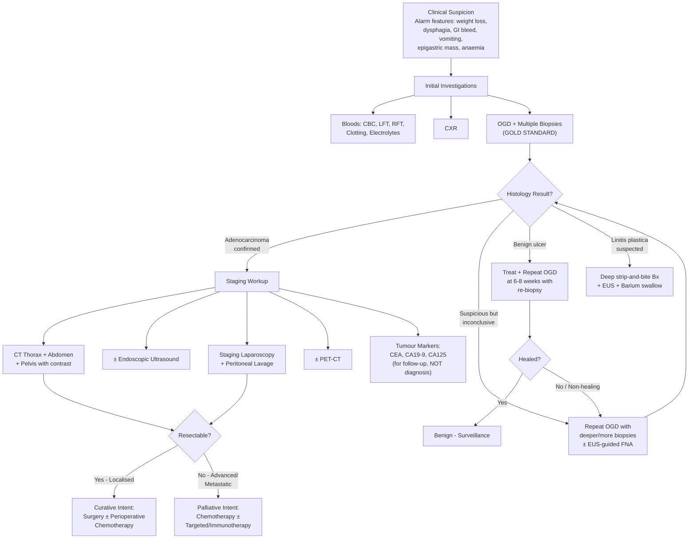

## Diagnosis of CA Stomach — Diagnostic Criteria, Algorithm and Investigations

### I. Diagnostic Principles

There is no single "diagnostic criterion" for gastric cancer in the way that rheumatological or metabolic diseases have point-based criteria. Instead, the diagnosis rests on a **histopathological confirmation** from tissue obtained at endoscopy. The clinical workflow is:

1. **Suspicion** → clinical features + alarm symptoms
2. **Tissue diagnosis** → OGD + biopsy (the gold standard)
3. **Staging** → determine extent of disease to guide management
4. **Pre-operative assessment** → fitness for surgery

***It is notoriously difficult to make an early diagnosis*** — the clinical presentations of ***benign gastric ulcer, early gastric cancer, and advanced gastric cancer*** overlap substantially [5]. This means a low threshold for endoscopy in at-risk patients is essential.

---

### II. Diagnostic Algorithm

The following algorithm integrates clinical suspicion, tissue diagnosis, and staging into a single workflow:

---

### III. Investigation Modalities — Detailed Breakdown

#### A. Blood Tests (Baseline / Pre-operative)

***CBP, LFT, RFT*** are the mandatory baseline investigations [5][16].

| Test | What You're Looking For | Rationale / Interpretation |
|:---|:---|:---|
| ***CBC with differentials*** | **Hypochromic microcytic anaemia** (low MCV, low MCH, low ferritin, low iron, high TIBC) | Iron deficiency anaemia from chronic occult GI blood loss — tumour ulceration erodes mucosal vessels. This may be the only clue in early/submucosal tumours [16][3] |
| ***LFT*** | **Raised ALP, GGT** (cholestatic pattern); **hypoalbuminaemia** | ALP/GGT rise suggests liver metastases or biliary obstruction from porta hepatis lymphadenopathy. Albumin is a marker of nutritional status — often low in advanced cancer with cachexia [3][16] |
| ***RFT*** | **Raised creatinine, proteinuria** | Evaluate for ***membranous nephropathy (nephrotic syndrome)*** — a recognised ***paraneoplastic syndrome*** of gastric adenocarcinoma [3][5]. Also baseline for chemotherapy dosing and contrast administration |
| ***Clotting profile*** | **Prolonged PT/INR** | Liver synthetic function assessment (if metastatic liver disease); also baseline for surgery. Disseminated intravascular coagulation can occur in advanced malignancy (Trousseau's) |
| ***Electrolyte profile*** | **Hypochloraemic hypokalaemic metabolic alkalosis** | Occurs secondary to GOO with ***repeated vomiting of HCl*** → loss of H⁺ and Cl⁻ → metabolic alkalosis; renal compensation leads to K⁺ wasting (secondary hyperaldosteronism from volume depletion) [3][12] |
| Iron studies | Low ferritin, low serum iron, high TIBC | Confirms iron deficiency as the cause of anaemia |
| Group and save / Crossmatch | Blood type; antibody screen | Pre-operative preparation; anticipate blood loss |

#### B. Tumour Markers

***CEA, CA19-9, CA125*** [3][16]

<Callout title="Tumour Markers Are NOT Diagnostic" type="error">
This is a common exam pitfall. ***CEA and CA125 are NOT useful in diagnosis*** [3]. They lack sufficient sensitivity and specificity for screening or primary diagnosis. They **are** useful for:
- **Baseline measurement** pre-operatively
- **Monitoring response to chemotherapy** — a falling level suggests treatment response
- **Detecting recurrence post-surgery** — a rising level after initial normalisation suggests recurrence [2][3]

***CEA, CA19-9 are for follow-up*** [5][16].
</Callout>

| Marker | Notes |
|:---|:---|
| **CEA** (carcinoembryonic antigen) | Epithelial marker; elevated in many GI malignancies, smoking, IBD, pregnancy — very non-specific. Elevated in ~30-40% of gastric cancers |
| **CA19-9** | Also elevated in pancreatic, biliary, and colorectal cancers; and in benign biliary obstruction, pancreatitis |
| **CA125** | More commonly associated with ovarian cancer; can be elevated in peritoneal carcinomatosis from gastric cancer |
| **CA72-4** | Most specific tumour marker for gastric cancer (though still not widely used for screening); may be used in combination |

---

#### C. Upper Endoscopy (OGD) + Biopsy — THE GOLD STANDARD

***Upper endoscopy and biopsies*** [5][16] — this is the single most important investigation. It serves two purposes:
1. **Obtain tissue diagnosis** (histological confirmation of malignancy)
2. **Evaluate extent of primary tumour** endoscopically [2]

**Why OGD is the gold standard:**
- Direct visualisation of the gastric mucosa with magnification
- Ability to take **multiple targeted biopsies** from suspicious lesions
- Assessment of tumour location, size, morphology (Borrmann type), and involvement of the GOJ
- Therapeutic potential (e.g., endoscopic mucosal resection for early gastric cancer)

**Endoscopic findings in gastric cancer:**

| Finding | Type of Cancer | Description |
|:---|:---|:---|
| Ulcerated mass protruding into lumen | Advanced (Borrmann I/II) | Irregular, raised edges; friable tissue; necrotic base — contrasts with benign ulcers that have smooth, regular, rounded edges and a flat base [4] |
| Irregular/thickened ulcer margins | Advanced (Borrmann III) | Ulcer with poorly defined, heaped-up margins; folds surrounding the crater are ***nodular, clubbed, fused*** [4] |
| ***Rigid stomach that could not be distended with air; mucosa may appear "normal"*** | ***Linitis plastica (Borrmann IV)*** [5] | The stomach fails to inflate properly on insufflation. The mucosa looks deceptively normal because the tumour infiltrates the submucosa/muscularis propria. This is the classic trap — standard superficial biopsies will miss it |
| Subtle mucosal irregularity, discolouration, depression | Early gastric cancer | Small, flat or depressed lesions; may require chromoendoscopy or narrow-band imaging (NBI) to detect |

**Biopsy technique:**
- **At least 6–8 biopsies** should be taken from the margin of any gastric ulcer (multiple quadrants) to maximise diagnostic sensitivity — a single biopsy has only ~70% sensitivity, but 7 biopsies reaches > 98%
- For suspected ***linitis plastica***: use ***deep "strip and bite" biopsy technique*** — standard mucosal biopsies are insufficient because the tumour is submucosal [3]
- Biopsies of **normal-appearing mucosa** in the antrum and body should also be taken to assess for *H. pylori*, atrophic gastritis, and intestinal metaplasia (the Sydney protocol: 5 biopsies — 2 antrum, 1 incisura, 2 body)

**Advanced endoscopic techniques:**
- **Narrow-band imaging (NBI):** Uses specific wavelengths of light to enhance surface mucosal and vascular patterns — helps distinguish neoplastic from non-neoplastic lesions without dye application
- **Chromoendoscopy:** Application of dyes (e.g., indigo carmine, methylene blue) to enhance mucosal detail — useful for detecting early gastric cancer and defining margins for endoscopic resection
- **Magnification endoscopy:** Allows detailed assessment of mucosal pit patterns and microvascular architecture

**Histological analysis from biopsy should determine:**
- Histological type (adenocarcinoma vs lymphoma vs GIST vs other)
- Lauren classification (intestinal vs diffuse)
- Grade of differentiation (well / moderately / poorly differentiated)
- ***HER2 status*** (by IHC ± FISH) — essential for treatment decisions (trastuzumab eligibility; ***HER2 +ve in ~15% of intestinal type***) [2]
- Microsatellite instability (MSI) / mismatch repair (MMR) status — for immunotherapy eligibility
- PD-L1 combined positive score (CPS) — for checkpoint inhibitor eligibility
- EBV status (EBER ISH)

<Callout title="Key Molecular Markers to Request on Biopsy (2025 Standard of Care)">
For all newly diagnosed gastric/GOJ adenocarcinomas, request:
1. **HER2** (IHC ± FISH) — if positive → trastuzumab
2. **MSI/MMR status** — if MSI-H/dMMR → checkpoint inhibitors (pembrolizumab/nivolumab)
3. **PD-L1 CPS** — if CPS ≥ 5 → nivolumab in first-line setting
4. **Claudin 18.2** (CLDN18.2) — if positive → zolbetuximab (new targeted therapy)

These molecular tests fundamentally change the treatment algorithm and should never be forgotten.
</Callout>

**Alternative to OGD — Barium Swallow/Meal:**
- ***Limited diagnostic value except for linitis plastica*** [2]
- Shows a non-distensible "leather bottle" stomach with loss of mucosal folds — the classic radiographic appearance
- Cannot take biopsies — so even if barium is suggestive, OGD is still needed
- Largely superseded by OGD in modern practice but still useful when OGD cannot adequately assess gastric distensibility

---

#### D. Staging Investigations

Once histological diagnosis is confirmed, staging determines the extent of disease and guides treatment decisions. ***The most important prognostic factor is depth of tumour invasion*** [2].

The staging workup is best understood by what each modality assesses:

| Investigation | Best For | Limitations |
|:---|:---|:---|
| ***CT abdomen + pelvis ± thorax with contrast*** | ***M staging (mandatory)***; locoregional extension | ***Not accurate for T & N staging*** [2] |
| ***Endoscopic ultrasound (EUS)*** | ***T staging and N staging*** (most accurate) | ***NOT mandatory for CA stomach*** — upfront surgery advocated in most cases [2]; operator-dependent; more invasive |
| ***Staging laparoscopy + peritoneal lavage*** | ***Peritoneal and liver metastasis*** (more accurate than CT) | Invasive (requires GA); does not assess distant nodal/haematogenous metastases |
| ***PET-CT*** | Distant metastasis; treatment response monitoring | ***Not too sensitive for CA stomach*** (especially mucinous/signet ring tumours — low FDG avidity) [2] |
| ***CXR*** | Lung metastases; pleural effusion; pre-op | Low sensitivity for small pulmonary metastases |

##### 1. ***CT Thorax + Abdomen + Pelvis with IV Contrast*** [5][16]

***Mandatory for M staging*** but ***not accurate for T & N*** [2].

- **Why CT?** It provides a rapid, non-invasive survey of the entire torso to detect:
  - **Liver metastases** — hypodense lesions in the liver parenchyma (the most common distant metastatic site)
  - **Peritoneal nodules / ascites** — though CT has limited sensitivity for small peritoneal deposits (hence the need for staging laparoscopy)
  - **Lymphadenopathy** — enlarged lymph nodes along coeliac axis, para-aortic region, mediastinum (Virchow's)
  - **Direct invasion** into adjacent organs (pancreas, transverse colon, spleen)
  - **Hydronephrosis** — from ureteric obstruction by pelvic or retroperitoneal tumour deposits
  - **Lung metastases, pleural effusion** — especially if proximal (cardia) tumour
- ***Thorax CT is included if proximal tumour (e.g., cardia/GOJ)*** — to assess mediastinal involvement [2]
- CT is also the basis for assessing **resectability** — e.g., major vessel encasement, distant metastatic disease

**CT appearances of gastric cancer:**
- Focal or diffuse gastric wall thickening (> 5mm when distended)
- Enhancing intraluminal mass
- Loss of fat planes with adjacent organs (suggesting T4b invasion)
- ***In linitis plastica: diffuse circumferential wall thickening with loss of rugal folds***

##### 2. ***Endoscopic Ultrasound (EUS)*** [2][5][16]

- ***More sensitive in T staging (e.g., differentiating T4a vs T4b) and N staging (e.g., perigastric LN)*** [2]
- ***More operator-dependent and more invasive compared to CT*** [2]
- ***NOT mandatory for CA stomach*** — unlike CA oesophagus where EUS is standard, in CA stomach ***upfront surgery is advocated*** in most situations [2]

**When IS EUS useful?**
- Suspected **early gastric cancer** (T1a vs T1b) — this distinction determines eligibility for **endoscopic resection** (T1a only, if other criteria met) vs surgery
- Assessing **depth of invasion** when CT is equivocal (e.g., T3 vs T4a — determines whether neoadjuvant chemotherapy is warranted)
- **EUS-guided FNA** of suspicious perigastric lymph nodes for cytological confirmation
- **Submucosal masses** — to determine the layer of origin and guide biopsy approach [14]

**EUS wall layers of the stomach** (from lumen outward):
1. Hyperechoic — superficial mucosa
2. Hypoechoic — deep mucosa (muscularis mucosae)
3. Hyperechoic — submucosa
4. Hypoechoic — muscularis propria
5. Hyperechoic — serosa

The tumour appears as a **hypoechoic lesion** disrupting these normal layer patterns. The key question is: *which layer does the tumour reach?*

##### 3. ***Staging Laparoscopy + Peritoneal Lavage*** [2][5][16]

***More accurate for peritoneal and liver metastasis compared to CT*** [2]. This is considered **routine** in many centres (including HK) before committing to curative-intent surgery.

**Why is it needed?**
- CT has a sensitivity of only ~30–50% for detecting peritoneal carcinomatosis — small (< 5mm) peritoneal deposits are easily missed
- **Direct visualisation** of the peritoneal surfaces, liver surface, and omentum ± **biopsy of suspicious lesions for frozen section** [2]
- ***Peritoneal washing for cytology*** — even in the absence of visible peritoneal deposits, positive peritoneal cytology indicates **microscopic peritoneal metastasis** (classified as M1) and renders the disease incurable by surgery alone [2]
- Avoids unnecessary laparotomy in patients with occult peritoneal disease — a significant benefit given the morbidity of a non-therapeutic gastrectomy

**Indications for staging laparoscopy (typically):**
- Any patient being considered for curative-intent gastrectomy with ≥T3 or node-positive disease on imaging
- Particularly important for **diffuse-type / linitis plastica** (high rate of occult peritoneal metastasis — 1/3 at diagnosis) [3]

##### 4. ***PET-CT*** [5][16]

- Uses ¹⁸F-fluorodeoxyglucose (FDG) — a glucose analogue taken up preferentially by metabolically active (including malignant) cells
- ***Not too sensitive for CA stomach*** [2] — Why?
  - **Mucinous and signet ring cell adenocarcinomas** (diffuse type) have relatively low metabolic activity and therefore low FDG uptake → false negatives
  - **Normal physiological gastric uptake** can obscure the primary tumour
- **When PET-CT IS useful:**
  - Detecting **distant metastases** not seen on CT (e.g., unsuspected bone, distant nodal metastases)
  - **Monitoring treatment response** after neoadjuvant chemotherapy (metabolic response assessment)
  - Detecting **recurrence** post-surgery
- ***Alternative to CT for M staging*** but not routinely first-line for gastric cancer [2]

##### 5. ***CXR*** [5][16]

***Chest x-ray*** is a basic but essential investigation:
- Detect lung metastases (cannonball lesions)
- Pleural effusion (malignant or reactive)
- Lymphangitis carcinomatosis (reticular interstitial pattern — bilateral, often lower zones)
- Pre-operative baseline assessment of cardiopulmonary status

---

#### E. ***Value of Diagnostic Imaging*** — Summary by Clinical Scenario [5]

***Diagnostic imaging is valuable for:*** [5]
- ***Staging — chest x-ray, CAT scan, PET scan***
- ***Diagnosis of:***
  - ***Intestinal obstruction***
  - ***Malignant biliary obstruction***
  - ***Malignant ureteric obstruction***
- ***Monitoring response to treatment***

---

#### F. ***Clinical Staging Summary*** [5]

From the lecture slides, the ***clinical staging*** workup consists of:
- ***History and physical examination***
- ***Liver function test***
- ***Chest x-ray***
- ***Ultrasonography or CAT scan abdomen***
- ***PET/CT scan***
- ***Endoscopic ultrasound***
- ***Laparoscopy***

[5]

---

### IV. Summary Table — Investigations by Purpose

| Purpose | Investigation | Key Findings |
|:---|:---|:---|
| **Tissue Diagnosis** | ***OGD + multiple biopsies*** | Histological type, Lauren classification, differentiation grade, HER2, MSI, PD-L1, CLDN18.2 |
| **Alternative for linitis plastica** | ***Barium swallow*** | Non-distensible leather bottle stomach; loss of rugal folds |
| **T and N staging** | ***EUS*** (if needed) | Depth of wall invasion (T1a vs T1b vs T2+); perigastric LN involvement |
| **M staging** | ***CT TAP with contrast*** (mandatory) | Liver mets, peritoneal nodules, LN, direct invasion, hydronephrosis |
| **Peritoneal staging** | ***Staging laparoscopy + peritoneal lavage*** | Peritoneal deposits, liver surface mets, positive peritoneal cytology |
| **Distant metastasis** | ***PET-CT*** (adjunct) | Unsuspected distant mets; treatment response |
| **Baseline / Pre-op** | ***CBC, LFT, RFT, clotting, electrolytes, CXR*** | Anaemia, liver function, renal function, nutritional status, cardiopulmonary fitness |
| **Follow-up / Monitoring** | ***CEA, CA19-9, CA125*** | Trend over time; rising level suggests recurrence |

---

### V. Morphological Differentiation — Benign vs Malignant Gastric Ulcer on OGD

This is a high-yield comparison for exams [4]:

| Feature | Benign Ulcer | Malignant Ulcer |
|:---|:---|:---|
| **Edges** | ***Smooth, regular, rounded*** | ***Irregular, thickened, heaped-up*** |
| **Base** | ***Flat, smooth, often filled with exudate*** | Necrotic, nodular |
| **Surrounding folds** | Radiate symmetrically to the ulcer edge | ***Nodular, clubbed, fused*** — folds do not reach the edge cleanly |
| **Mucosa** | Smooth, pliable surrounding mucosa | Friable, easily bleeds on contact |
| **Shape** | Round or oval | Irregular |

<Callout title="Every Gastric Ulcer Gets Biopsied" type="error">
Even if an ulcer looks "benign" endoscopically, **always biopsy** (≥6 biopsies from the margin). A proportion of malignant ulcers can appear deceptively benign. Furthermore, every gastric ulcer must have a **repeat OGD at 6–8 weeks** post-treatment to confirm healing. A non-healing gastric ulcer despite appropriate therapy is malignant until proven otherwise [4].
</Callout>

---

### VI. Special Diagnostic Considerations

#### Linitis Plastica — The Diagnostic Challenge

As covered earlier, ***linitis plastica*** presents a unique diagnostic problem:
- ***Mucosa may appear "normal" on endoscopy*** [5]
- ***Rigid, could not be distended with air*** [5]
- Standard mucosal biopsies → **false negatives** because the tumour infiltrates the submucosa and muscularis propria [3]

**Diagnostic approach:**
1. **Deep strip-and-bite biopsies** (grab deeper tissue including submucosa)
2. **EUS** — shows diffuse hypoechoic wall thickening involving the 3rd and 4th layers (submucosa and muscularis propria)
3. ***Barium swallow*** — may be superior to OGD for this specific entity; shows the classic non-distensible stomach with narrowed lumen and loss of rugal folds [2]
4. **CT** — shows diffuse circumferential gastric wall thickening

#### HER2 Testing — Why It Matters

- HER2 (Human Epidermal growth factor Receptor 2) is a transmembrane tyrosine kinase receptor; when amplified/overexpressed, it drives uncontrolled cell proliferation
- ***HER2 +ve in ~15% of gastric cancers*** (predominantly intestinal type) [2]
- Testing method: **IHC first** → if 2+ (equivocal) → confirm with **FISH** (fluorescence in situ hybridisation)
- A positive HER2 result qualifies the patient for **trastuzumab** (Herceptin) — a monoclonal antibody targeting HER2 — in combination with chemotherapy

---

> **High Yield Summary — Diagnosis of CA Stomach:**
>
> - **Gold standard:** OGD + multiple biopsies (≥6 from ulcer margins). Request histology + HER2 + MSI/MMR + PD-L1 + CLDN18.2 on all new diagnoses.
> - **Tumour markers (CEA, CA19-9, CA125) are NOT diagnostic** — used for follow-up and monitoring recurrence only.
> - **Staging workup:** CT TAP with contrast (mandatory for M staging, not accurate for T/N); EUS (best for T/N but NOT mandatory — upfront surgery advocated); Staging laparoscopy + peritoneal lavage (routine — more accurate than CT for peritoneal disease); PET-CT (adjunct, not sensitive for mucinous/signet ring tumours).
> - **Linitis plastica** is the diagnostic trap: normal-appearing mucosa on OGD, non-distensible stomach, requires deep biopsies + EUS + barium swallow.
> - **Benign vs malignant ulcer:** benign = smooth, regular, rounded edges, flat base; malignant = irregular, thickened edges, nodular/clubbed/fused surrounding folds. ALL gastric ulcers must be biopsied and followed up.
> - **Clinical staging checklist** (from lecture): H&P, LFT, CXR, USG/CT abdomen, PET/CT, EUS, laparoscopy.

---

<ActiveRecallQuiz
  title="Active Recall - CA Stomach Diagnosis and Investigations"
  items={[
    {
      question: "What is the gold standard investigation for diagnosing gastric cancer, and how many biopsies should be taken from a suspicious gastric ulcer? Why?",
      markscheme: "Gold standard: OGD with multiple biopsies. At least 6-8 biopsies from the ulcer margin (multiple quadrants). A single biopsy has only ~70% sensitivity; 7 biopsies reach over 98% sensitivity for detecting malignancy.",
    },
    {
      question: "A patient with confirmed gastric adenocarcinoma needs staging. State what CT TAP is mandatory for, what it is NOT accurate for, and name a more accurate investigation for the latter.",
      markscheme: "CT TAP with contrast is mandatory for M staging (distant metastasis: liver, lung, peritoneum, lymph nodes). It is NOT accurate for T staging (depth of invasion) or N staging (lymph node involvement). EUS is more accurate for T and N staging.",
    },
    {
      question: "Why is staging laparoscopy with peritoneal lavage performed routinely before curative-intent gastrectomy? What specific finding on peritoneal washing changes the stage?",
      markscheme: "CT has only 30-50% sensitivity for small peritoneal deposits. Staging laparoscopy allows direct visualisation of peritoneal surfaces and liver surface plus biopsy of suspicious lesions. Peritoneal washing for cytology detects microscopic peritoneal metastasis. Positive peritoneal cytology is classified as M1 disease, rendering the cancer incurable by surgery alone and avoiding unnecessary laparotomy.",
    },
    {
      question: "Why is PET-CT not too sensitive for gastric cancer, and in which histological subtype is this particularly problematic?",
      markscheme: "PET-CT uses FDG (glucose analogue) taken up by metabolically active cells. Mucinous and signet ring cell adenocarcinomas (diffuse type) have relatively low metabolic activity and low FDG uptake, causing false negatives. Normal physiological gastric FDG uptake can also obscure the primary tumour.",
    },
    {
      question: "Name four molecular markers that should be tested on gastric cancer biopsy specimens in 2025 and explain the therapeutic implication of each.",
      markscheme: "1. HER2 (IHC plus or minus FISH): if positive, trastuzumab eligible. 2. MSI/MMR status: if MSI-H or dMMR, checkpoint inhibitors (pembrolizumab/nivolumab). 3. PD-L1 CPS: if CPS 5 or above, nivolumab in first-line. 4. Claudin 18.2 (CLDN18.2): if positive, zolbetuximab eligible.",
    },
    {
      question: "Describe the endoscopic features that distinguish a benign gastric ulcer from a malignant one, and state the mandatory follow-up for any gastric ulcer found on OGD.",
      markscheme: "Benign: smooth, regular, rounded edges; flat smooth base with exudate; surrounding folds radiate symmetrically. Malignant: irregular or thickened margins; ulcerated mass protruding into lumen; surrounding folds are nodular, clubbed, or fused. ALL gastric ulcers must be biopsied (at least 6 from margin) and have repeat OGD at 6-8 weeks to confirm healing. Non-healing ulcer is malignant until proven otherwise.",
    },
  ]}
/>

## References

[2] Senior notes: maxim.md (Gastric cancer — Investigations and Staging section)
[3] Senior notes: felixlai.md (CA Stomach — Diagnosis section, pp. 411–412)
[4] Senior notes: felixlai.md (PUD — OGD findings and Forrest classification, p. 390)
[5] Lecture slides: GC 212. Weight loss and vomiting gastric cancer; abdominal imaging.pdf (p23, p27, p31, p57)
[12] Senior notes: maxim.md (Gastric outlet obstruction section)
[14] Senior notes: maxim.md (GIST section — EUS and FNA)
[16] Senior notes: felixlai.md (CA Stomach — Biochemical tests, pp. 411–412)
