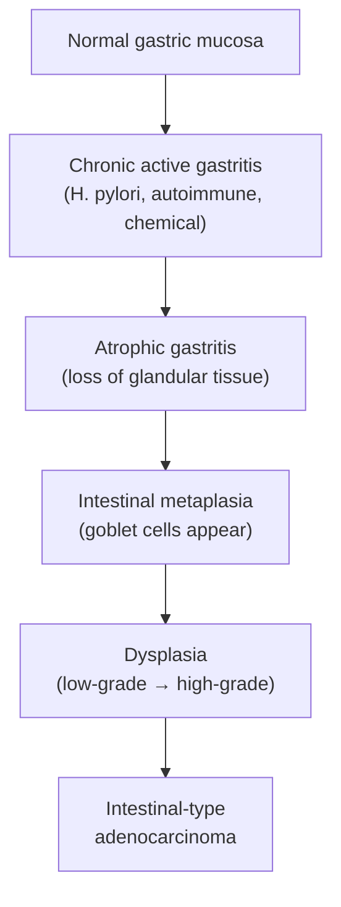

# CA Stomach (Gastric Cancer)

## I. Definition

Gastric cancer (CA stomach) refers to malignant neoplasms arising from the stomach wall. The overwhelming majority (~90%) are **adenocarcinomas** originating from the glandular epithelium of the gastric mucosa [1][2]. Other histological types include gastric lymphoma (~5%), gastrointestinal stromal tumours (GISTs), neuroendocrine tumours (carcinoid), and rarely, metastatic deposits from other primaries [2].

The word "carcinoma" comes from Greek *karkinos* (crab) + *-oma* (tumour) — the ancient Greeks thought cancers resembled a crab with its legs extending outward, much like tumour projections.

---

## II. Epidemiology

### Global Epidemiology

- Gastric cancer is the **5th most common cancer worldwide** and the **4th leading cause of cancer death** globally (2022 GLOBOCAN data).
- There is a **declining overall incidence trend** globally — attributed to declining *H. pylori* prevalence (improved sanitation, eradication therapy), better food preservation (refrigeration replacing smoking/salting/pickling), and reduced smoking rates [1][2].
- However, there is an **increasing trend of proximal/cardia gastric cancer** in Western countries — thought to be related to rising obesity and gastro-oesophageal reflux disease (GORD) [2].
- ***Incidence: decreasing trend (6th incidence, 4th mortality), but increased in Asia (Japan: diet-related)*** [2].
- Geographic variation is striking: **highest incidence** in East Asia (Japan, South Korea, China), parts of South America, and Eastern Europe; **lowest** in North America, Northern Europe, and Africa.
  - Why East Asia? High prevalence of *H. pylori*, dietary factors (pickled vegetables, high-salt diet, smoked fish), and possibly genetic susceptibility.
  - Japan and South Korea have national screening programmes (endoscopy-based) → detect more early gastric cancers → better survival statistics.

### Hong Kong Epidemiology

- ***M:F ratio ≈ 1.5:1*** [3]
- Incidence rate in HK (most recent Hong Kong Cancer Registry data):
  - Overall: **6th most common cancer** [2][3]
  - Male: 5th most common cancer
  - Female: 9th most common cancer
- Mortality rate in HK:
  - Male: 5th most common cause of cancer death
  - Female: 5th most common cause of cancer death [3]

### Demographics by Subtype

| Feature | Intestinal Type | Diffuse Type |
|:---|:---|:---|
| **Age** | ***Elderly*** | ***Younger patients*** |
| **Sex** | ***Male predominance*** | ***Female predominance (relatively)*** |
| **Location** | ***Distal stomach (antrum/body)*** | ***Proximal stomach*** |
| **Trend** | Declining (linked to declining *H. pylori*) | Relatively stable or increasing |

[2]

- ***Cell type: adenocarcinoma (90%) > lymphoma (5%) > GIST, metastasis*** [2]
- ***Site: distal stomach (antrum/pylorus) > cardia (increasing trend) > OGJ*** [2]

<Callout title="High Yield Exam Point">
In Hong Kong, gastric cancer is the 6th most common cancer overall but ranks 4th-5th for cancer mortality — reflecting its typically late presentation and poor prognosis when detected at advanced stages. Most present as adenocarcinoma (~90%).
</Callout>

---

## III. Anatomy and Function of the Stomach

Understanding the anatomy is crucial because it dictates the surgical approach, lymph node drainage (and hence staging), and explains patterns of spread.

### Gross Anatomy — Regions of the Stomach

The stomach is a J-shaped muscular organ divided into:

1. **Cardia** — the region immediately surrounding the gastro-oesophageal junction (GOJ); narrow zone where oesophageal squamous epithelium transitions to gastric columnar epithelium.
2. **Fundus** — the dome-shaped portion superior and lateral to the cardia, sitting against the left hemidiaphragm; acts as a gas reservoir.
3. **Body (corpus)** — the largest region; contains the majority of parietal cells (HCl production) and chief cells (pepsinogen production).
4. **Antrum** — the distal "prepyloric" portion; rich in G cells that secrete gastrin, which stimulates parietal cells.
5. **Pylorus** — the sphincteric muscle controlling gastric emptying into the duodenum.

The **lesser curvature** (medial, shorter) and **greater curvature** (lateral, longer) are the two borders. The **angular incisure** (incisura angularis) is the notch on the lesser curvature that marks the transition from body to antrum — a common site for Type I gastric ulcers and also a common biopsy site for surveillance.

### Arterial Supply

All derived from the **coeliac trunk** (axis):

**Lesser curvature:**
- ***Left gastric artery*** — directly from the coeliac trunk (largest contributor to gastric blood supply)
- ***Right gastric artery*** — from the common hepatic artery (or proper hepatic artery)

**Greater curvature:**
- ***Short gastric arteries*** — from the splenic artery (supply the fundus)
- ***Left gastro-omental (gastroepiploic) artery*** — from the splenic artery
- ***Right gastro-omental (gastroepiploic) artery*** — from the gastroduodenal artery

[3][4]

This rich anastomotic network means the stomach has excellent blood supply and can survive ligation of most of its arterial branches, which is why partial gastrectomy is feasible. However, the rich vascularity also means gastric tumours can bleed significantly.

### Venous Drainage

Venous drainage mirrors the arterial supply and ultimately drains into the **portal venous system** → this explains why the **liver is the most common site of haematogenous metastasis** from gastric cancer.

- Left and right gastric veins → portal vein
- Short gastric veins and left gastro-omental vein → splenic vein
- Right gastro-omental vein → superior mesenteric vein

### Lymphatic Drainage

Gastric lymph nodes are classified into **16 stations** (Japanese Gastric Cancer Association classification), grouped into tiers:

- **N1 (perigastric):** Stations 1–6 — along the lesser and greater curvatures
- **N2 (regional):** Stations 7–11 — along the named arteries (left gastric, common hepatic, coeliac, splenic artery, splenic hilum)
- **N3 (distant):** Stations 12–16 — para-aortic, retropancreatic, mesenteric root

The extent of lymphadenectomy during gastrectomy (D1 vs D2 vs D3) is defined by how many of these tiers are removed. **D2 lymphadenectomy** (removing N1 + N2 stations) is the standard of care in East Asia (including HK) for curative-intent surgery.

### Nerve Supply

- **Sympathetic:** Greater splanchnic nerve (T5–T9 sympathetic trunk) → coeliac ganglion → postganglionic fibres [4]
- **Parasympathetic:**
  - ***Anterior vagal nerve*** (primarily from the left vagus): supplies the **stomach, pylorus, and liver** [4]
  - ***Posterior vagal nerve*** (primarily from the right vagus): supplies the **stomach and the foregut/midgut down to the splenic flexure** [4]

The vagus nerve is critical because it stimulates gastric acid secretion (via direct acetylcholine on parietal cells and indirectly via gastrin release). This is why **vagotomy** was historically used for peptic ulcer disease. In gastric cancer surgery, the vagal trunks are inevitably divided during gastrectomy, contributing to post-operative dumping syndrome and altered gastric motility.

### Histological Layers (from lumen outward)

1. **Mucosa** (epithelium + lamina propria + muscularis mucosae)
2. **Submucosa** — contains Meissner's plexus, rich lymphatic and blood vessels
3. **Muscularis propria** — inner oblique, middle circular, outer longitudinal; contains Auerbach's (myenteric) plexus
4. **Serosa** (visceral peritoneum) — covers most of the stomach except the bare area posteriorly

The T-staging of gastric cancer is based on depth of invasion through these layers, which is why understanding them is essential.

<Callout title="Why Anatomy Matters for Gastric Cancer">
- The rich lymphatic network in the submucosa explains why gastric cancer metastasises early to lymph nodes — even "early" gastric cancer (confined to mucosa/submucosa) can have lymph node metastasis in 5–20% of cases.
- Venous drainage to the portal system explains liver metastases as the predominant haematogenous spread.
- Peritoneal seeding is common because the serosa is breached in advanced tumours (T4a), allowing cancer cells to drop into the peritoneal cavity.
</Callout>

---

## IV. Etiology and Risk Factors

Think of the risk factors in a logical framework: anything that causes **chronic inflammation → atrophy → metaplasia → dysplasia → carcinoma** (the Correa cascade, especially for intestinal-type gastric cancer).

### A. Infection

#### 1. ***Helicobacter pylori*** — the **MAJOR** risk factor

- ***H. pylori is classified as a WHO Group 1 carcinogen*** [1]
- A microaerophilic Gram-negative spiral-shaped bacterium with strong urease activity [4]
  - Urease hydrolyses urea → ammonia + CO₂ → ammonia neutralises gastric acid, creating a protective alkaline microenvironment for the bacterium
  - Its spiral shape + flagella + mucolytic enzymes allow it to burrow through the mucus gel layer to reach the gastric surface epithelium [4]
- **Mechanism of carcinogenesis (the Correa cascade):**
  1. *H. pylori* colonises the antral mucosa → triggers **chronic active gastritis**
  2. Persistent inflammation → progressive destruction of gastric glands → **atrophic gastritis**
  3. Loss of specialised gastric epithelium → replacement by **intestinal metaplasia** (goblet cells appear — the stomach tries to "become" intestine)
  4. Intestinal metaplasia → **dysplasia** → **intestinal-type adenocarcinoma**
  - This cascade takes **decades** — typically 20–40 years from initial infection to cancer
- *H. pylori* also produces virulence factors:
  - **CagA** (cytotoxin-associated gene A) — injected into host cells via a type IV secretion system; disrupts cell signalling, promotes proliferation and inflammation. CagA-positive strains carry higher cancer risk.
  - **VacA** (vacuolating cytotoxin A) — causes epithelial cell vacuolation and apoptosis
- ***H. pylori → chronic atrophic gastritis → intestinal metaplasia → body/distal CA (intestinal type)*** [2]
- Note: *H. pylori* is also linked to **gastric MALT lymphoma** (mucosa-associated lymphoid tissue) — eradication of *H. pylori* can cure early-stage gastric MALT lymphoma.

<Callout title="H. pylori and Gastric Cancer vs Duodenal Ulcer" type="idea">
This is a classic exam concept: *H. pylori*-related **antral-predominant gastritis** → increased acid secretion → duodenal ulcer (does NOT predispose to cancer). *H. pylori*-related **pangastritis/corpus-predominant gastritis** → atrophy → decreased acid secretion → gastric ulcer/gastric cancer. The pattern of gastritis determines the clinical outcome [4].
</Callout>

#### 2. ***EBV (Epstein-Barr virus) infection (~10%)*** [3]

- EBV-associated gastric carcinomas have distinct molecular features (global DNA hypermethylation, PIK3CA mutations, PD-L1/L2 amplification)
- Tends to occur in the proximal stomach (cardia/body)
- Generally has a **better prognosis** than EBV-negative gastric cancer — possibly due to stronger immune response
- Associated with lymphoepithelioma-like carcinoma histology

### B. Gastrointestinal Diseases (Pre-malignant Conditions)

#### 1. ***Atrophic gastritis*** [1]

- ***MOST common precursor for gastric cancer, particularly the intestinal subtype*** [3]
- Chronic inflammation → loss of specialised glandular tissue (parietal and chief cells) → mucosal atrophy
- Leads to **hypochlorhydria/achlorhydria** → compensatory hypergastrinaemia → mucosal proliferation → increased cancer risk

#### 2. ***Pernicious anaemia*** [1]

- Autoimmune destruction of parietal cells → atrophic gastritis (body-predominant) → achlorhydria + loss of intrinsic factor → vitamin B12 deficiency → megaloblastic anaemia
- The underlying autoimmune atrophic gastritis is the cancer risk factor (3× increased risk)
- ***Chronic atrophic gastritis: associated with pernicious anaemia and Menetrier's disease*** [2]

#### 3. ***Intestinal metaplasia and dysplasia*** [3]

- Intestinal metaplasia = gastric epithelium replaced by intestinal-type epithelium (goblet cells)
- Represents a key step in the Correa cascade
- Dysplasia (low-grade → high-grade) is the immediate precursor to invasive carcinoma
- Patients with **high-grade dysplasia** should undergo endoscopic resection or close surveillance

#### 4. ***Adenomatous polyps*** [1][3]

- ***Resect ALL adenomas; examine for synchronous CA; follow-up OGD*** [2]
- Unlike hyperplastic/fundic gland polyps (low malignant potential), adenomatous polyps have significant dysplasia and malignant potential (~30–40% harbour carcinoma if > 2 cm)

#### 5. ***Menetrier's disease (protein-losing hypertrophic gastropathy)*** [1][3]

- Rare condition with giant gastric rugal folds (hypertrophy of foveolar mucous cells), excessive mucus production, protein-losing enteropathy, and hypochlorhydria
- Carries a 5–10% risk of gastric adenocarcinoma

#### 6. Gastric ulcers [3]

- Chronic gastric ulcers (especially those associated with *H. pylori* pangastritis) have malignant potential
- This is why **all gastric ulcers must be biopsied and followed up endoscopically** to exclude malignancy — unlike duodenal ulcers, which virtually never undergo malignant transformation

### C. Previous Gastric Surgery

- ***Previous partial gastrectomy (> 20 years)*** [1]
- ***Allows reflux of bile causing chronic gastritis*** → reactive/chemical gastropathy → atrophy → metaplasia → carcinoma [3]
- Typically occurs at the **gastric remnant**, especially at the gastrojejunal anastomosis (stump carcinoma)
- Risk increases ≥15–20 years post-surgery
- Billroth II reconstruction carries higher risk than Billroth I (because of greater bile reflux)

### D. Dietary and Environmental Factors

***Harmful dietary factors:*** [1]
- ***N-nitroso compounds*** — powerful carcinogens; formed from dietary nitrates/nitrites by bacterial conversion (especially in hypochlorhydric stomachs where bacteria colonise)
- ***Preserved, smoked, salted food*** — high in nitrates, nitrosamines, and salt, which damages gastric mucosa directly and promotes *H. pylori* colonisation
- ***Pickled food*** [3] — common in East Asian diets, contributing to the high incidence in this region

***Protective dietary factors:*** [1]
- ***Trace elements (e.g. selenium)*** — antioxidant (selenoproteins like glutathione peroxidase neutralise reactive oxygen species)
- ***Vitamin C*** — antioxidant that also inhibits the formation of N-nitroso compounds in the stomach
- ***Fresh fruits and vegetables*** — source of antioxidants and fibre

***Industrial/occupational exposures:*** [1]
- ***Dusty, high temperature, rubber, coal mining, metal processing, chromium production*** — occupational carcinogen exposure

### E. Social/Lifestyle Factors

- ***Smoking (11% attributable risk)*** [1] — nitrosamines in tobacco smoke; also impairs gastric mucosal defence
- **Alcohol** — damages gastric mucosa directly; may have synergistic effect with *H. pylori* and smoking [3]
- **Obesity** — particularly associated with cardia/GOJ gastric cancer; mechanism: increased intra-abdominal pressure → GORD → Barrett's → proximal cancer; also chronic low-grade inflammation, hyperinsulinaemia [3]
- **Low socioeconomic status** [3] — correlates with higher *H. pylori* prevalence, poorer diet, and limited access to healthcare

### F. Hereditary/Familial Factors

#### 1. ***Hereditary Diffuse Gastric Cancer (HDGC)*** [2][3]

- ***Autosomal dominant; mutation in the CDH1 gene encoding E-cadherin*** [1][2]
- E-cadherin is a transmembrane glycoprotein crucial for cell-cell adhesion in epithelial tissues; loss of E-cadherin → loss of intercellular adhesion → cells invade individually (hence "diffuse" type, signet ring cell histology)
- Carries a **lifetime risk of ~70% for gastric cancer**
- ***Prophylactic total gastrectomy should be considered*** in confirmed CDH1 mutation carriers [3]
- Also associated with increased risk of **lobular breast carcinoma** in women (lobular, not ductal — because lobular breast cancer also features loss of E-cadherin)

#### 2. ***Familial adenomatous polyposis (FAP)*** [2][3]

- APC gene mutation → hundreds to thousands of colonic polyps; also gastric fundic gland polyps and adenomas → small but increased gastric cancer risk

#### 3. ***Hereditary non-polyposis colorectal cancer (HNPCC / Lynch syndrome)*** [2][3]

- Mismatch repair gene mutations (MLH1, MSH2, MSH6, PMS2) → microsatellite instability
- Increased risk of gastric cancer (especially intestinal type) in addition to colorectal, endometrial, ovarian, and other cancers

#### 4. ***Peutz-Jeghers syndrome*** [2]

- STK11/LKB1 gene mutation → hamartomatous polyps throughout GI tract + mucocutaneous pigmentation
- Increased risk of gastric and other GI cancers

#### 5. **Family history of gastric cancer** [3]

- First-degree relatives of gastric cancer patients have 2–3× increased risk
- Even without a defined hereditary syndrome

### G. ***Common Variable Immunodeficiency (CVID)*** [1]

- Primary immunodeficiency → chronic gastric infection/inflammation → atrophic gastritis → increased gastric cancer risk
- Also associated with gastric lymphoma

<Callout title="Risk Factor Summary — Mnemonic: 'GASTRIC PAIN'" type="idea">
**G** — Genetics (HDGC/E-cadherin, FAP, HNPCC, Peutz-Jeghers)  
**A** — Atrophic gastritis / Adenomatous polyps  
**S** — Smoking / Smoked, Salted food  
**T** — (prior gas)Trectomy  
**R** — Reflux (bile reflux post-surgery)  
**I** — Infection (*H. pylori*, EBV)  
**C** — CVID  
**P** — Pernicious anaemia / Pickled food  
**A** — Alcohol  
**I** — Industrial exposure  
**N** — Nitrosamines / N-nitroso compounds  
</Callout>

---

## V. Pathophysiology

### A. The Correa Cascade (Intestinal-type Gastric Carcinogenesis)

This is the classic multi-step model proposed by Pelayo Correa:

**Why does this sequence happen?**
- Chronic mucosal injury → repeated cycles of cell death and regeneration → increased cell turnover → greater chance of DNA replication errors
- Achlorhydria (from parietal cell loss) → bacterial overgrowth → increased nitrosamine production in the stomach
- Hypergastrinaemia (compensatory, from loss of acid feedback) → trophic effect on mucosal cells → promotes proliferation
- Accumulation of genetic mutations (TP53, APC, KRAS, microsatellite instability) drives progression through each stage

### B. Diffuse-type Carcinogenesis

- Does **not** follow the Correa cascade
- Driven by **loss of E-cadherin** (CDH1 mutation — germline in HDGC, or somatic/epigenetic silencing in sporadic cases)
- E-cadherin loss → disrupted cell-cell adhesion → individual tumour cells infiltrate diffusely through the gastric wall (no glandular formation)
- Characterised by **signet ring cells** — tumour cells with large intracytoplasmic mucin vacuoles that push the nucleus to the periphery, giving a "signet ring" appearance
- More likely to invade transmurally and seed the peritoneum early

### C. Molecular Subtypes (The Cancer Genome Atlas — TCGA Classification, 2014)

Modern molecular classification divides gastric cancer into 4 subtypes:

| Subtype | Key Features | Clinical Relevance |
|:---|:---|:---|
| **EBV-positive** (~9%) | PIK3CA mutations, PD-L1/L2 amplification, DNA hypermethylation | May respond to immunotherapy (checkpoint inhibitors) |
| **MSI-high** (~22%) | Mismatch repair deficiency, hypermutation | Better prognosis; may respond to immunotherapy; associated with Lynch syndrome |
| **Genomically stable (GS)** (~20%) | CDH1 mutations, RHOA mutations; mostly diffuse type | Poor prognosis; limited targeted therapy options |
| **Chromosomal instability (CIN)** (~50%) | TP53 mutations, RTK-RAS amplification; mostly intestinal type | HER2 amplification → trastuzumab target |

### D. Patterns of Spread

Gastric cancer spreads by four routes:

1. **Direct invasion** — into adjacent organs (pancreas, transverse colon, spleen, liver, diaphragm)
2. **Lymphatic spread** — to perigastric, coeliac, para-aortic lymph nodes; most common route
3. **Haematogenous spread** — via portal vein to **liver** (most common distant metastatic site); also lung, bone, brain (uncommon) [3]
4. **Transcoelomic (peritoneal) spread** — once the tumour penetrates the serosa (T4a), cancer cells shed into the peritoneal cavity → peritoneal carcinomatosis, **malignant ascites**, **Krukenberg tumour** (bilateral ovarian metastases — signet ring cells implanting on the ovaries)

***Spread to: liver / peritoneum / lymph nodes (common); brain / lung / ovary / bone (uncommon)*** [3]

<Callout title="Eponymous Metastatic Signs of Gastric Cancer" type="idea">
These are named after the doctors who described them and represent specific sites of metastasis:

- **Virchow's node (Troisier's sign)** — left supraclavicular lymph node (lymphatic drainage via thoracic duct)
- **Sister Mary Joseph's nodule** — periumbilical nodule (peritoneal spread along the falciform ligament)
- **Krukenberg tumour** — bilateral ovarian metastases (transcoelomic spread; characteristically signet ring cells)
- **Blumer's shelf** — palpable mass on digital rectal examination in the rectovesical/rectouterine pouch (pouch of Douglas) — dependent part of peritoneal cavity where cancer cells pool
- **Irish's node** — left axillary lymph node metastasis
</Callout>

---

## VI. Classification

### A. Histological Classification — ***Lauren Classification*** [2]

This is the most clinically useful histological classification:

| Feature | ***Intestinal Type*** | ***Diffuse Type*** |
|:---|:---|:---|
| **Differentiation** | ***Well-differentiated, gland-forming*** | ***Undifferentiated, non-cohesive (signet ring cells)*** |
| **Risk factors** | ***All the above environmental/infectious factors*** | ***HDGC (E-cadherin mutation)*** |
| **HER2 status** | ***HER2 +ve in ~15%*** | ***HER2 -ve*** |
| **Spread pattern** | ***Haematogenous spread*** | ***Transmural (linitis plastica) and lymphatic spread*** |
| **Demographics** | ***Elderly male, distal stomach*** | ***Young female, proximal stomach*** |
| **Prognosis** | ***Better prognosis*** | ***Poorer prognosis*** |
| **Precursor lesion** | Correa cascade (atrophy → metaplasia → dysplasia) | No defined precursor cascade |
| **Association** | Declining incidence | Stable/increasing incidence |

[2]

### B. Macroscopic Classification — Borrmann Classification

Classifies the gross appearance of advanced gastric cancer:

| Borrmann Type | Description |
|:---|:---|
| **Type I** | Polypoid/fungating — well-circumscribed, protruding mass |
| **Type II** | Ulcerating with raised edges — resembles a volcano crater |
| **Type III** | Ulcerating with infiltration — ulcer with poorly defined margins infiltrating the wall |
| **Type IV** | Diffusely infiltrating — **linitis plastica** ("leather bottle stomach") |

### C. ***Linitis Plastica*** [3]

- ***Aggressive form of poorly-differentiated diffuse-type gastric cancer***
- ***Broad region of gastric wall is extensively infiltrated by malignancy resulting in a rigid, thickened stomach termed linitis plastica ("leather bottle" stomach)***
  - "Linitis" = from Latin *linum* (linen/flax); "plastica" = moulded — the stomach becomes stiff like starched linen
- ***Difficult to diagnose with upper endoscopy; barium swallow is superior*** [3]
  - ***Tumours tend to infiltrate the submucosa and muscularis propria and therefore superficial mucosal biopsy can be false-negative*** [3]
  - ***Combination of strip and bite biopsy technique should be used when there is suspicion of a diffuse-type gastric cancer*** [3]
- ***Poor prognosis:*** [3]
  - ***Late presentation with advanced stage at diagnosis***
  - ***Potential for early spread with 1/3 of patients having metastatic disease to peritoneum (malignant ascites) at diagnosis***
  - ***Presence of microscopic disease at surgical margins due to its diffuse nature***

<Callout title="Linitis Plastica — Why Endoscopy Misses It" type="error">
A common pitfall: the mucosa may appear relatively normal in linitis plastica because the tumour grows in the submucosa/muscularis propria. Standard superficial mucosal biopsies grab only the superficial layer and can be falsely negative. If you suspect linitis plastica (e.g., stomach does not distend well on insufflation, thickened folds, reduced peristalsis), use **deep "strip and bite"** biopsies or consider **endoscopic ultrasound (EUS)** to assess wall thickness. Barium swallow may show the classic non-distensible "leather bottle" appearance [3].
</Callout>

### D. Early vs Advanced Gastric Cancer

| Feature | Early Gastric Cancer (EGC) | Advanced Gastric Cancer (AGC) |
|:---|:---|:---|
| **Definition** | Confined to **mucosa or submucosa** (T1), regardless of lymph node status | Invades into or beyond **muscularis propria** (≥T2) |
| **Lymph node metastasis** | Present in 5–20% (higher if submucosal invasion) | Present in ~50–80% |
| **5-year survival** | > 90% (with curative resection) | 20–30% overall |
| **Treatment** | May be amenable to **endoscopic resection** (EMR/ESD) if select criteria met | Surgical resection ± chemotherapy |

Note: "Early" here is a pathological definition referring to depth of invasion — NOT size or symptoms. An early gastric cancer can be quite large but still confined to the mucosa/submucosa.

### E. TNM Staging (AJCC 8th Edition, 2017)

**T (Primary Tumour):**

| Stage | Depth of Invasion |
|:---|:---|
| **Tis** | Carcinoma in situ (intraepithelial, no invasion of lamina propria) |
| **T1a** | Lamina propria or muscularis mucosae |
| **T1b** | Submucosa |
| **T2** | Muscularis propria |
| **T3** | Subserosa (penetrates subserosal connective tissue without involving serosa) |
| **T4a** | Perforates serosa (visceral peritoneum) |
| **T4b** | Invades adjacent structures (spleen, transverse colon, liver, diaphragm, pancreas, abdominal wall, adrenal gland, kidney, small intestine, retroperitoneum) |

**N (Regional Lymph Nodes):**

| Stage | Number of Regional LNs |
|:---|:---|
| **N0** | 0 |
| **N1** | 1–2 |
| **N2** | 3–6 |
| **N3a** | 7–15 |
| **N3b** | ≥16 |

A minimum of **16 lymph nodes** must be examined for adequate staging (this is why D2 lymphadenectomy is preferred).

**M (Distant Metastasis):**
- M0: No distant metastasis
- M1: Distant metastasis (including positive peritoneal cytology)

---

## VII. Clinical Features

Gastric cancer is notoriously **asymptomatic in early stages** — this is the main reason why most cases outside Japan/Korea are diagnosed at an advanced stage. Symptoms develop as the tumour grows, obstructs, ulcerates, or metastasises.

### A. Symptoms

#### 1. ***Epigastric pain / discomfort*** (most common symptom)
- **Mechanism:** Tumour infiltrating the gastric wall → activation of visceral afferent pain fibres (transmitted via the greater splanchnic nerve T5–T9) → poorly localised epigastric pain
- May mimic peptic ulcer disease or dyspepsia — hence the importance of endoscopy in any patient with "red flag" dyspepsia
- Pain may radiate to the **back** if the tumour invades the pancreas (retroperitoneal, somatic pain)

#### 2. ***Weight loss*** [5]
- **Mechanism:** Multifactorial:
  - **Anorexia** — cancer-related cytokines (TNF-α, IL-6) suppress appetite via hypothalamic signalling
  - **Cancer cachexia** — tumour-mediated catabolism (increased basal metabolic rate, proteolysis, lipolysis)
  - **Mechanical obstruction** — tumour at the cardia/pylorus reduces food intake
  - **Malabsorption** — especially post-surgical or with extensive mucosal involvement
- ***Significant unintentional weight loss is a red flag ("alarm symptom") that mandates investigation*** [5]

#### 3. ***Vomiting*** [5]
- **Mechanism:**
  - **Gastric outlet obstruction (GOO):** Tumour at the antrum/pylorus → physical obstruction of gastric emptying → distension of stomach → stimulates vomiting centre via vagal afferents
  - GOO vomiting is characteristically **projectile, non-bilious** (obstruction is proximal to the ampulla of Vater), and contains **undigested food** eaten hours or even days earlier
  - May develop a **succussion splash** (audible splash on shaking the abdomen) due to retained gastric contents
  - ***Visible peristalsis*** may be observed in thin patients (stomach contracting against an obstructing tumour) [5]
- Can also occur due to:
  - Direct stimulation of the chemoreceptor trigger zone by tumour-derived substances
  - Raised intracranial pressure (if brain metastasis — rare)

#### 4. ***Dysphagia*** ("I can't swallow")
- **Mechanism:** Tumour at the **cardia or GOJ** → progressive mechanical obstruction of the oesophagogastric junction
- Characteristically **progressive** — initially solids only, then liquids
- ***Consider in the differential of dysphagia alongside oesophageal carcinoma*** [6]

#### 5. ***Early satiety***
- **Mechanism:** Tumour bulk within the stomach reduces functional gastric capacity; in **linitis plastica**, the entire stomach wall is stiff and non-distensible → cannot accommodate a normal meal volume

#### 6. ***Nausea***
- Due to gastric stasis (poor emptying), direct vagal stimulation by the tumour, or peritoneal irritation

#### 7. ***Haematemesis and/or melaena*** (GI bleeding)
- **Mechanism:** Tumour ulceration → erosion into gastric mucosal blood vessels → bleeding into the GI lumen
  - **Haematemesis** = vomiting blood (if brisk, fresh red blood; if slow, "coffee-ground" vomitus — haemoglobin converted to haematin by gastric acid)
  - **Melaena** = black, tarry, foul-smelling stools (blood digested by GI enzymes and bacteria during transit)
- Chronic occult blood loss is more common than massive haemorrhage → insidious **iron deficiency anaemia**

#### 8. ***Symptoms of anaemia*** (fatigue, dyspnoea on exertion, pallor, dizziness)
- **Mechanism:** Chronic occult GI blood loss → iron deficiency anaemia (microcytic, hypochromic)
- May be the **presenting feature** in some patients, especially those with early or submucosal tumours that ulcerate

#### 9. ***Abdominal distension***
- **Mechanism:** Malignant ascites (peritoneal carcinomatosis → increased peritoneal capillary permeability + lymphatic obstruction) or massive hepatomegaly from liver metastases

#### 10. ***Constitutional symptoms***
- Malaise, lethargy, fever — due to cancer-related systemic inflammatory response (elevated CRP, cytokines)

### B. Signs

#### 1. Signs of the Primary Tumour

- **Epigastric mass** — palpable in advanced cases; may be firm, irregular, non-tender [7]
  - ***A palpable epigastric mass in the setting of weight loss and anaemia is highly suspicious for gastric cancer*** [5]
- **Succussion splash** — audible splash >3 hours post-prandial suggests gastric outlet obstruction (retained gastric contents)
- ***Visible gastric peristalsis*** — in thin patients with GOO, waves of peristalsis may be visible on the anterior abdominal wall [5]

#### 2. Signs of Metastatic Disease (important for staging and prognosis)

These are **named eponymous signs** that indicate advanced/metastatic disease — knowing them is high-yield:

| Sign | Description | Mechanism |
|:---|:---|:---|
| **Virchow's node (Troisier's sign)** | ***Hard, non-tender, left supraclavicular lymph node*** | Lymphatic spread via thoracic duct, which drains into the left subclavian vein; the left supraclavicular fossa is the "sentinel" for intra-abdominal malignancy |
| **Sister Mary Joseph's nodule** | ***Periumbilical nodule*** | Peritoneal tumour deposits spread along the falciform ligament / umbilical folds to the umbilicus |
| **Krukenberg tumour** | ***Bilateral ovarian masses*** (on bimanual pelvic exam or imaging) | Transcoelomic spread; signet ring cells have tropism for ovarian stroma |
| **Blumer's shelf** | ***Hard, shelf-like mass palpable on digital rectal examination*** | Tumour deposits in the rectovesical/rectouterine pouch (pouch of Douglas — most dependent part of peritoneal cavity) |
| **Irish's node** | ***Left axillary lymphadenopathy*** | Lymphatic spread |

#### 3. Signs of Complications

- **Hepatomegaly** — hard, nodular, irregular liver edge = liver metastases
- **Ascites** — shifting dullness, fluid thrill = peritoneal carcinomatosis or liver metastases with portal hypertension
- **Jaundice** — periampullary/porta hepatis lymph node metastases compressing the common bile duct, or extensive liver metastases [7]
- **Pallor** — anaemia from chronic blood loss or cancer cachexia
- **Cachexia** — temporal wasting, sunken cheeks, loss of subcutaneous fat and muscle bulk — cancer-related metabolic wasting

#### 4. Signs of Paraneoplastic Syndromes (rare but examinable)

| Syndrome | Manifestation | Mechanism |
|:---|:---|:---|
| **Acanthosis nigricans** | Velvety, dark hyperpigmentation in axillae, neck, groin | Tumour-secreted growth factors (e.g. TGF-α, IGF) stimulate keratinocyte and fibroblast proliferation |
| **Trousseau's sign** | Migratory superficial thrombophlebitis | Mucin-secreting adenocarcinoma releases procoagulant substances → hypercoagulable state |
| **Leser-Trélat sign** | Sudden eruption of multiple seborrhoeic keratoses | Tumour-secreted growth factors (TGF-α) |
| **Dermatomyositis** | Proximal muscle weakness + heliotrope rash | Autoimmune paraneoplastic process |

<Callout title="Alarm Symptoms ('Red Flags') for Gastric Cancer in Dyspeptic Patients" type="error">
Any patient with dyspepsia plus the following features should undergo **urgent upper endoscopy (OGD)**:

- Age > 55 with new-onset dyspepsia
- ***Unintentional weight loss***
- ***Progressive dysphagia***
- ***Persistent vomiting***
- ***GI bleeding (haematemesis/melaena)***
- ***Palpable abdominal mass***
- ***Iron deficiency anaemia***
- ***Family history of upper GI cancer***

Do NOT just treat with a PPI and "see how it goes" in these patients — this delays diagnosis!
</Callout>

---

## VIII. Summary of Pathophysiology → Clinical Features Connection

| Pathophysiological Process | Clinical Feature |
|:---|:---|
| Tumour infiltration of gastric wall | Epigastric pain |
| Cardia/GOJ obstruction | Dysphagia |
| Antrum/pylorus obstruction (GOO) | Projectile non-bilious vomiting, succussion splash |
| Reduced gastric capacity (linitis plastica) | Early satiety |
| Tumour ulceration → mucosal vessel erosion | Haematemesis, melaena, iron deficiency anaemia |
| Cancer cachexia (TNF-α, IL-6) | Weight loss, anorexia |
| Peritoneal carcinomatosis | Ascites, Blumer's shelf, Krukenberg tumour, Sister MJ nodule |
| Lymphatic dissemination | Virchow's node, Irish's node |
| Haematogenous spread (portal) | Hepatomegaly, jaundice |
| Procoagulant secretion | Trousseau's migratory thrombophlebitis |
| Growth factor secretion | Acanthosis nigricans, Leser-Trélat sign |

---

<Callout title="High Yield Summary">

**Definition:** Gastric cancer = predominantly adenocarcinoma (90%) of the stomach; classified by Lauren into intestinal (well-differentiated, elderly male, distal, better prognosis) and diffuse (undifferentiated, young female, proximal, worse prognosis).

**Epidemiology (HK):** 6th most common cancer, 4th–5th mortality; M:F = 1.5:1; declining incidence overall but cardia cancers increasing.

**Key Risk Factors:** *H. pylori* (WHO Group 1 carcinogen — Correa cascade), EBV (10%), atrophic gastritis (MOST common precursor), pernicious anaemia, Menetrier's disease, adenomatous polyps, prior gastrectomy (>20 yrs, bile reflux), dietary nitrosamines/smoked/pickled/salted food, smoking, HDGC (E-cadherin/CDH1 mutation → prophylactic gastrectomy), FAP, HNPCC, CVID.

**Protective:** Fresh fruits/vegetables, vitamin C, selenium.

**Pathophysiology:** Intestinal type follows the Correa cascade (normal → chronic gastritis → atrophy → intestinal metaplasia → dysplasia → carcinoma). Diffuse type driven by E-cadherin loss → signet ring cells, linitis plastica.

**Spread:** Lymphatic (most common), haematogenous (liver > lung), transcoelomic (peritoneum, Krukenberg tumour), direct invasion.

**Clinical Features:** Often asymptomatic early. Alarm symptoms: weight loss, dysphagia, vomiting, GI bleed, epigastric mass, anaemia. Key metastatic signs: Virchow's node, Sister Mary Joseph's nodule, Krukenberg tumour, Blumer's shelf.

**Linitis plastica:** Diffuse type, leather bottle stomach, hard to biopsy endoscopically (submucosal infiltration), poor prognosis, 1/3 have peritoneal mets at diagnosis.

</Callout>

---

<ActiveRecallQuiz
  title="Active Recall - CA Stomach (Definition to Clinical Features)"
  items={[
    {
      question: "Name the two histological subtypes of gastric adenocarcinoma under the Lauren classification and compare their demographics, location, spread pattern, and prognosis.",
      markscheme: "Intestinal type: well-differentiated, elderly male, distal stomach, haematogenous spread, HER2+ve in 15%, better prognosis. Diffuse type: undifferentiated/signet ring, young female, proximal stomach, transmural/lymphatic spread, HER2-ve, E-cadherin mutation, linitis plastica, worse prognosis.",
    },
    {
      question: "Describe the Correa cascade and explain why H. pylori-related pangastritis predisposes to gastric cancer while antral-predominant gastritis does not.",
      markscheme: "Correa cascade: normal mucosa, chronic gastritis, atrophic gastritis, intestinal metaplasia, dysplasia, adenocarcinoma. Pangastritis/corpus-predominant: parietal cell loss, hypochlorhydria, compensatory hypergastrinaemia, increased proliferation, predisposes to cancer. Antral-predominant: acid secretion preserved or increased, predisposes to duodenal ulcer, NOT cancer.",
    },
    {
      question: "A patient with suspected gastric cancer has a palpable left supraclavicular lymph node, a periumbilical nodule, and a shelf-like mass on digital rectal exam. Name each eponymous sign and explain the mechanism of spread for each.",
      markscheme: "Virchow's node (Troisier's sign): lymphatic spread via thoracic duct to left supraclavicular fossa. Sister Mary Joseph's nodule: peritoneal spread along falciform ligament to umbilicus. Blumer's shelf: transcoelomic peritoneal deposits pooling in the rectouterine/rectovesical pouch of Douglas (most dependent part).",
    },
    {
      question: "Why is linitis plastica difficult to diagnose on standard upper endoscopy? What alternative diagnostic approaches can be used?",
      markscheme: "Linitis plastica infiltrates submucosa and muscularis propria with relatively preserved superficial mucosa. Standard mucosal biopsies are falsely negative. Use deep strip and bite biopsies, endoscopic ultrasound (EUS) to assess wall thickening, or barium swallow showing non-distensible leather bottle stomach.",
    },
    {
      question: "List four alarm symptoms/signs in a dyspeptic patient that mandate urgent upper GI endoscopy and explain why delay is dangerous.",
      markscheme: "Any four of: unintentional weight loss, progressive dysphagia, persistent vomiting, GI bleeding (haematemesis/melaena), iron deficiency anaemia, palpable abdominal mass, age over 55 with new dyspepsia. Delay is dangerous because gastric cancer is often diagnosed at advanced stage; early detection (confined to mucosa/submucosa) has more than 90% 5-year survival vs 20-30% in advanced disease.",
    },
    {
      question: "Name the gene mutated in hereditary diffuse gastric cancer (HDGC), explain the function of its protein product, and state the recommended prophylactic intervention.",
      markscheme: "CDH1 gene encoding E-cadherin, a transmembrane glycoprotein for cell-cell adhesion in epithelial cells. Loss leads to non-cohesive individual cell infiltration (diffuse/signet ring pattern). Recommended intervention: prophylactic total gastrectomy in confirmed CDH1 mutation carriers. Also increased risk of lobular breast cancer in women.",
    },
  ]}
/>

---

## References

[1] Lecture slides: GC 212. Weight loss and vomiting gastric cancer; abdominal imaging.pdf (p10–12)
[2] Senior notes: maxim.md (Gastric cancer section)
[3] Senior notes: felixlai.md (CA Stomach, pp. 400–402)
[4] Senior notes: felixlai.md (PUD/Stomach anatomy, pp. 386–388)
[5] Lecture slides: GC 212. Weight loss and vomiting gastric cancer; abdominal imaging.pdf (title/clinical content)
[6] Lecture slides: GC 189. I can't swallow oesophageal cancer.pdf
[7] Lecture slides: WCS 056 - Painless jaundice and epigastric mass - by Prof R Poon.ppt (1).pdf
