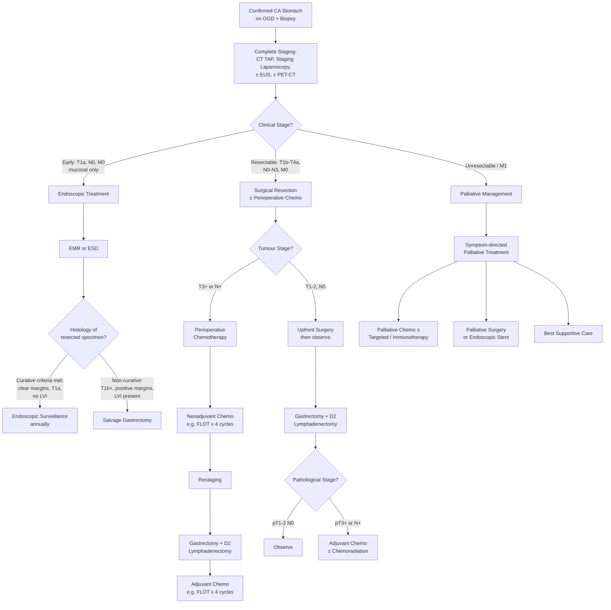

## Management of CA Stomach

### I. Overview — Treatment Principles

The management of gastric cancer depends on two fundamental assessments:

1. **Patient fitness** ("Can this patient tolerate surgery?") — age, comorbidities, nutritional status, performance status
2. **Clinical stage** ("Is the disease curable?") — determined by staging investigations (CT, staging laparoscopy, ± EUS, ± PET-CT)

***Treatment depends on "fitness" and clinical stage*** [5].

***Currently, resection remains the only hope for cure for resectable disease*** [5].

***In HK, ~70% patients present with diseases Stage III*** [5] — this is a sobering statistic. The majority of patients present with locally advanced disease, which explains the high mortality of gastric cancer in Hong Kong despite it being only the 6th most common cancer.

---

### II. Management Algorithm

---

### III. Endoscopic Treatment — Potentially Curative for Early Gastric Cancer

***Early cancer: T1, mucosal. Rare in Hong Kong. Japan — screening endoscopy*** [5].

In Japan and Korea, where gastric cancer screening programmes exist, a significant proportion of cancers are detected at the early (T1) stage. In Hong Kong, this is ***rare*** because there is no population screening programme, so most cancers are advanced at presentation [5].

#### A. Indications

***Indications: early gastric CA confined to mucosa (T1a) — diagnosed by endoscopic white light picture (not EUS!)*** [2]

The rationale is based on lymph node metastasis risk:
- **T1a (mucosal):** LN metastasis risk ~3–5% (acceptable for endoscopic resection if other criteria met)
- **T1b (submucosal):** LN metastasis risk ~15–25% → requires surgical resection with lymphadenectomy [3][17]

**Expanded criteria for endoscopic resection (Japanese Gastric Cancer Treatment Guidelines 2021):**

| Criterion | Absolute Indication | Expanded Indication |
|:---|:---|:---|
| **Depth** | Mucosal (T1a) | Mucosal (T1a) |
| **Size** | ***≤ 2 cm*** | > 2 cm (if differentiated, no ulceration) |
| **Histology** | Differentiated (intestinal) | Differentiated; undifferentiated ≤ 2 cm without ulceration |
| **Ulceration** | No ulceration | ≤ 3 cm with ulceration (differentiated only) |
| **Lymphovascular invasion** | Absent | Absent |
| **LN status** | N0 on staging | N0 on staging |

[2][3]

#### B. Techniques

##### ***Endoscopic Mucosal Resection (EMR)*** [2][5]

- **Technique:** Injection of saline ± adrenaline beneath the mucosa to "lift" the lesion from the muscularis propria → snare resection of the raised lesion
- ***Only resects lesions < 2 cm*** — larger lesions require **piecemeal resection**, which:
  - Increases risk of complications
  - Makes histological margin assessment impossible (fragmented specimen)
  - Higher recurrence rate [2]

##### ***Endoscopic Submucosal Dissection (ESD)*** [2][5]

- **Technique:** Uses a specialised electrocautery knife to dissect the lesion directly from the submucosa, achieving **en bloc resection** regardless of size
- ***Can resect lesions > 2 cm*** [2]
- ***Permits a deeper resection margin with submucosal involvement*** — the specimen includes the submucosa, allowing accurate histological assessment of deep margins [3]
- ***Higher en bloc resection rate and lower recurrence rate*** compared to EMR [3]
- ***More complications:*** ***bleeding, perforation, stricture*** [2]

<Callout title="EMR vs ESD — When to Use Which">
Think of it this way: **EMR** is simpler and safer but limited to small lesions (< 2 cm) because it cannot guarantee en bloc resection for larger lesions. **ESD** is more technically demanding and has higher complication rates but can achieve en bloc resection of large lesions with accurate margin assessment. The trend in expert centres is towards ESD for most early gastric cancers [2][3].
</Callout>

#### C. Post-Endoscopic Resection Assessment

After EMR/ESD, the resected specimen is meticulously assessed histologically:

- **Lateral margins** — clear or involved?
- **Deep margin** — clear or involved?
- **Depth of invasion** — T1a (mucosal) vs T1b (submucosal)?
- **Lymphovascular invasion (LVI)** — present or absent?
- **Differentiation** — well/moderately vs poorly differentiated?

***Histology determines margin (lateral and deep) — consider curative if clear; salvage gastrectomy if T1b+*** [2]

If **curative criteria are met** → ***endoscopic surveillance annually*** [2]
If **non-curative** (T1b, positive margins, LVI, undifferentiated) → **salvage gastrectomy** with lymphadenectomy

---

### IV. Surgical Treatment — The Mainstay of Curative Therapy

***Surgery is the primary treatment in the absence of distant metastasis. Many patients with positive LN are cured by adequate surgery*** [3].

#### A. General Principles of Curative Resection

1. ***Complete resection with negative microscopic margins (R0 resection)*** [3]
   - ***Gross negative margins of ≥ 5 cm*** are required from the macroscopic tumour edge [3]
   - Why 5 cm? Because gastric cancer (especially diffuse type) can have microscopic intramural extension beyond the visible tumour margin. A wide margin minimises the risk of positive microscopic margins.
   - Intraoperative **frozen section** of the proximal resection margin is performed to confirm negative margins in real time

2. ***Adequate lymphadenectomy*** — at minimum, D2 (see below)

3. ***En bloc resection of adjacent involved organs*** in T4b tumours — e.g., distal pancreas, transverse colon, spleen [3]

#### B. ***Indicators of Unresectability*** [3][17]

Tumours are considered **unresectable** (i.e., curative-intent surgery is not appropriate) if:

- ***Distant metastasis*** (e.g., ***multiple liver metastases, peritoneal nodules, pelvic deposits, Virchow's nodes***) [17]
- ***Extensive nodal involvement (D3)*** [17]
- ***Invasion of major vascular structures:*** ***aorta, hepatic artery, coeliac axis, proximal splenic artery*** [3][17]
  - Note: ***Distal splenic artery involvement = borderline resectable*** with LUQ exenteration [17]
  - ***Portal vein involvement is NOT an absolute contraindication*** — venous resection may be considered in selected centres to achieve R0 [18]
- ***Positive peritoneal cytology*** on staging laparoscopy (= M1) [2]

<Callout title="Resectability Assessment — Think of Two Axes" type="idea">
Borrowed from the pancreatic cancer framework but equally applicable here [18]:

**Patient axis:** Is the patient fit enough? (Performance status, nutrition, comorbidities)
**Tumour axis:** Is the tumour technically removable? (No distant metastases, no major vessel encasement)

Both must be favourable for curative-intent surgery to be offered.
</Callout>

#### C. Type of Gastrectomy

The extent of gastric resection depends on the **location** of the tumour:

***Gastric resection with D2 lymph node dissection*** [5]:
- ***Distal resection for distal lesion*** [5]
- ***Total gastrectomy for proximal lesion*** [5]

| Tumour Location | Type of Gastrectomy | Reconstruction | Rationale |
|:---|:---|:---|:---|
| **Distal stomach (antrum/pylorus)** | ***Distal (subtotal) gastrectomy*** | **Billroth I** (gastroduodenostomy) or **Billroth II** (gastrojejunostomy) or **Roux-en-Y gastrojejunostomy** | Removes tumour with ≥5 cm proximal margin; preserves proximal stomach (better nutritional outcomes, lower morbidity than total gastrectomy) |
| **Proximal stomach (cardia/body/fundus) or GOJ** | ***Total gastrectomy*** | ***Roux-en-Y oesophagojejunostomy*** [5] | Cannot achieve adequate proximal margin with subtotal gastrectomy; the entire stomach must be removed |
| **Middle body (equivocal)** | Total gastrectomy (usually) | Roux-en-Y oesophagojejunostomy | Depends on whether 5 cm proximal AND distal margins can be achieved with subtotal gastrectomy |
| **Linitis plastica** | Total gastrectomy (always) | Roux-en-Y oesophagojejunostomy | Diffuse involvement of the entire stomach wall; microscopic disease at margins is common [3] |

**Why Roux-en-Y for total gastrectomy?**
- After total gastrectomy, the oesophagus is anastomosed to a **Roux limb** of jejunum (a defunctionalised limb)
- This prevents **bile reflux oesophagitis** — a major problem with direct oesophagojejunostomy without a Roux limb, because bile and pancreatic juices would reflux into the oesophagus causing severe chemical injury
- ***Roux-en-Y oesophagojejunostomy*** is the standard reconstruction [5]

#### D. ***Extent of Lymphadenectomy*** [3][5]

This is a critically important concept and frequently examined:

| Level | Stations Removed | Description |
|:---|:---|:---|
| ***D1 lymphadenectomy*** | Stations 1–6 | ***Perigastric LNs only*** — along the greater and lesser curvature |
| ***D2 lymphadenectomy*** | Stations 1–6 + 7–11 | ***D1 + LNs along coeliac trunk, common hepatic artery, splenic artery, left gastric artery, and splenic hilum*** |
| D3 lymphadenectomy | Stations 1–11 + 12–16 | D2 + para-aortic, retropancreatic, mesenteric root LNs — NOT standard; only in clinical trials |

***D2 lymphadenectomy is the STANDARD of care in patients with potentially curable gastric cancer*** [3][5]

**Why D2 over D1?**
- ***Better disease-specific survival*** [3]
- ***Allows more accurate N staging*** — minimises stage migration (Will Rogers phenomenon: removing more LNs → some N0 patients reclassified as N+ → apparent improvement in survival of both groups without any real treatment benefit — D2 avoids this artifact by providing a truer staging picture) [3]
- Requires removal of ***at least 15 lymph nodes*** for adequate staging (AJCC recommends ≥16) [3]

**The trade-off:**
- ***Higher perioperative morbidity and mortality*** compared to D1 — historically related to routine splenectomy and distal pancreatectomy performed during D2, which are now largely avoided unless the spleen/pancreas is directly invaded [3]
- In experienced centres (Japan, Korea, Hong Kong), the morbidity of D2 is now comparable to D1

**Minimally invasive approach:**
- ***Laparoscopic gastrectomy*** is increasingly performed for early gastric cancer [5] and even for advanced disease in experienced centres
- Benefits: reduced blood loss, shorter hospital stay, less postoperative pain, comparable oncological outcomes (in experienced hands)

---

### V. Perioperative Chemotherapy — Neoadjuvant and Adjuvant

The evidence for perioperative chemotherapy in gastric cancer has evolved substantially. The approach differs slightly between Western and East Asian practice.

#### A. ***Neoadjuvant Chemotherapy*** [3][5][17]

***Preop neoadjuvant chemotherapy — selected patients*** [5]

***HK: Upfront surgery is preferred — only consider if T3+ / N+*** [17]

**Rationale for neoadjuvant chemotherapy:**
- ***Downstage the tumour to improve resectability rate*** [17] — shrink a borderline-resectable tumour to make R0 resection achievable
- ***Reduce rate of local and distant recurrence*** [3] — by treating micrometastatic disease early, before it becomes clinically apparent
- Allows assessment of **in vivo chemosensitivity** — if the tumour responds to neoadjuvant therapy, the same regimen can be continued adjuvantly; if it progresses, the regimen can be changed

**Indications:**
- ***T3+ (transmural) tumours or N+ (LN involvement)*** [3][17]
- Borderline resectable disease

**Regimens:**

| Regimen | Drugs | Context |
|:---|:---|:---|
| ***FLOT*** (current preferred Western standard) | ***Fluorouracil + Leucovorin (folinic acid) + Oxaliplatin + Docetaxel*** | Perioperative (4 cycles pre-op + 4 cycles post-op); based on the FLOT4-AIO trial showing superiority over ECF/ECX [17] |
| ***Xelox*** (if less fit) | Capecitabine + Oxaliplatin | Used in patients who cannot tolerate the FLOT regimen [17] |
| ECF / ECX (historical) | ***Epirubicin + Cisplatin + 5-FU (or Capecitabine)*** | MAGIC trial regimen; largely superseded by FLOT [3] |

#### B. ***Adjuvant Chemotherapy / Chemoradiation*** [3][5][17]

***Postop adjuvant chemotherapy — for advanced cancer*** [5]

**Rationale:**
- ***Eradicate micrometastasis*** remaining after surgery [17]
- Reduce risk of local and systemic recurrence

**Indications:**
- ***All patients except those with (T1-2; N0; M0) disease*** — since the majority of patients with locoregional disease are at high risk of recurrence following curative surgery [3]
- ***Consider if T3+ / N+*** [17]

**Regimens:**

| Approach | Regimen | Trial Basis |
|:---|:---|:---|
| **Adjuvant chemo (East Asian preference)** | ***5-FU (or capecitabine) ± oxaliplatin (i.e., Xelox) or TS-1*** | CLASSIC trial (capecitabine + oxaliplatin); ACTS-GC trial (TS-1 monotherapy — Japan) [17] |
| ***Adjuvant chemoradiation (US preference)*** | ***5-FU / Leucovorin + Radiation therapy (4500 cGy)*** | ***US Intergroup 0116 (INT-0116 / Macdonald trial)*** — improved OS and DFS in resected Stage IB–IV (M0) gastric adenocarcinoma [5] |
| **Perioperative chemo (Western preference)** | ***FLOT x 4 pre-op + 4 post-op*** | FLOT4-AIO trial [17] |

<Callout title="East Asian vs Western Approach to Perioperative Therapy">
There is a philosophical difference:

- **East Asia (Japan, Korea, HK):** Emphasis on **upfront surgery with D2 lymphadenectomy** → adjuvant chemotherapy post-op. Neoadjuvant is reserved for T3+/N+ only [17].
- **Western (US, Europe):** Emphasis on **perioperative chemotherapy** (neoadjuvant + adjuvant, e.g., FLOT) because D2 lymphadenectomy is less consistently performed and surgery alone has worse outcomes.
- ***Adjuvant chemoradiation*** (INT-0116 regimen) is favoured in the US, especially when D2 was NOT performed (radiation compensates for inadequate lymphadenectomy) [5].

In Hong Kong practice, the standard is closer to the East Asian model: **upfront D2 gastrectomy** → adjuvant chemo if T3+/N+, with neoadjuvant reserved for selected cases [17].
</Callout>

#### C. Targeted and Immunotherapy (Perioperative and Advanced Disease, 2025 Standard)

These are increasingly integrated into the treatment algorithm:

| Agent | Target | Indication |
|:---|:---|:---|
| ***Trastuzumab (Herceptin)*** | HER2 | ***HER2-positive*** metastatic/advanced gastric cancer; combined with chemotherapy (ToGA trial) |
| ***Ramucirumab (Cyramza)*** | ***VEGFR2*** | ***Second-line for advanced gastric cancer***; anti-angiogenic monoclonal antibody (REGARD and RAINBOW trials) [17] |
| **Nivolumab / Pembrolizumab** | PD-1 | MSI-H/dMMR or PD-L1 CPS ≥ 5; now incorporated into first-line with chemo (CheckMate-649, KEYNOTE-859) |
| **Zolbetuximab** | Claudin 18.2 | CLDN18.2-positive, HER2-negative; first-line with chemo (SPOTLIGHT/GLOW trials — approved 2024) |

---

### VI. ***Palliative Management*** [3][5][17]

***Unresectable disease*** [5]:

Palliative care is indicated for patients with ***unequivocal evidence of incurability*** including ***metastasis, involvement of peritoneum, and N4/D3 nodal stage disease*** [3].

***Principles: relieve pain, nutrition, bleeding, obstruction, perforation*** [17]

#### A. ***Supportive Treatments*** [17]

- ***Transfusion*** — for anaemia from chronic GI blood loss
- ***PPI*** — reduce acid secretion, promote ulcer healing, reduce bleeding
- ***Iron supplementation*** — for iron deficiency anaemia
- ***Pain control*** — WHO analgesic ladder; consider coeliac plexus block for intractable epigastric/back pain
- Nutritional support — oral supplements, enteral feeding (NJ tube), parenteral nutrition if necessary

#### B. ***Endoscopic Treatments*** [5][17]

| Problem | Endoscopic Treatment | Mechanism |
|:---|:---|:---|
| **Bleeding** | ***Ethanol injection, adrenaline injection, clipping*** | Local haemostasis; adrenaline causes vasoconstriction; clipping mechanically occludes the bleeding vessel [17] |
| **Gastric outlet obstruction** | ***Metallic stenting (self-expandable metal stent — SEMS)*** | Bypasses the obstructing tumour; ***risk of re-stenosis by tumour ingrowth*** [17] |
| **Luminal obstruction** | ***Endoscopic laser ablation*** | Debulks intraluminal tumour to restore luminal patency [3] |

***Endoscopic stenting*** [5] — quick, minimally invasive, provides rapid symptom relief, but less durable than surgical bypass.

#### C. ***Palliative Surgery*** [5][17]

| Problem | Surgical Option | Notes |
|:---|:---|:---|
| ***Bleeding*** | ***Palliative gastrectomy*** or ***transcatheter arterial embolisation (TAE)*** | Gastrectomy removes the bleeding source; TAE is less invasive [3] |
| ***Gastric outlet obstruction*** | ***Palliative bypass (gastrojejunostomy / gastroenterostomy)*** | ***More durable than stenting*** but may cause ***impaired gastric emptying / bile reflux*** [17]; patient must be fit enough for surgery |
| ***Bleeding*** | ***External beam radiotherapy (EBRT)*** | Can reduce tumour vascularity and bleeding [3] |

***Palliative resection: relieve bleeding / obstruction*** [17]
***Palliative bypass (gastrojejunostomy): more durable than stenting, but possible impaired gastric emptying / bile reflux*** [17]

<Callout title="Stent vs Bypass for Malignant GOO">
- **SEMS:** Quick procedure, no GA needed, rapid oral intake resumption, but risk of tumour ingrowth/re-stenosis, stent migration; better for patients with **short expected survival** (< 3–6 months)
- **Gastrojejunostomy:** More durable, better long-term patency, but requires GA and laparotomy/laparoscopy; better for patients with **longer expected survival** (> 6 months) and those who fail stenting [17]
</Callout>

#### D. ***Palliative Chemotherapy ± Targeted/Immunotherapy*** [17]

***Palliative chemo ± HER2 inhibitor (if HER2 +ve) ± ramucirumab (VEGFR2 antagonist)*** [17]

For patients with metastatic or unresectable gastric cancer who have adequate performance status:

| Line | Regimen | Notes |
|:---|:---|:---|
| **First-line** | Doublet/triplet chemo (e.g., fluoropyrimidine + platinum) ± nivolumab (if PD-L1 CPS ≥ 5) ± trastuzumab (if HER2+) ± zolbetuximab (if CLDN18.2+) | Backbone is cytotoxic chemotherapy with targeted/immune agents layered on based on biomarker status |
| **Second-line** | Paclitaxel ± ***ramucirumab (VEGFR2 antagonist)*** | Ramucirumab = anti-angiogenic monoclonal antibody; RAINBOW trial showed OS benefit [17] |
| **Third-line+** | Trifluridine/tipiracil (TAS-102); nivolumab (if not given earlier); clinical trials | Options become limited; consider best supportive care |

#### E. ***EBRT for Bone Metastases*** [17]

***External beam radiotherapy (EBRT) for painful bone metastases*** [17] — highly effective for pain palliation; single-fraction (8 Gy) or multi-fraction (30 Gy in 10 fractions) regimens.

---

### VII. Post-Gastrectomy Complications and Long-Term Sequelae

Understanding these is essential because they affect long-term quality of life and are frequently examined:

#### A. Surgical Complications (Early)

| Complication | Mechanism | Management |
|:---|:---|:---|
| **Anastomotic leak** | Failure of surgical anastomosis to heal; ischaemia, tension, or technical error | Sepsis workup, CT with oral contrast, NPO, drainage (percutaneous or re-operation) |
| **Haemorrhage** | Intra-abdominal bleeding from staple lines, vascular injury | Resuscitation, re-exploration if ongoing |
| **Wound infection** | Contamination during surgery | Antibiotics, wound care |
| **Pneumonia / Atelectasis** | Post-operative immobility, pain-related splinting | Chest physiotherapy, early mobilisation |

#### B. ***Post-Gastrectomy Syndromes*** (Late) [17]

| Syndrome | Mechanism | Management |
|:---|:---|:---|
| ***Dumping syndrome*** | ***Loss of pylorus → rapid gastric emptying of hyperosmolar carbohydrates → draw fluid into intestinal lumen + release of vasoactive gut hormones*** [17] | |
| — Early (15–30 min) | Osmotic fluid shift → hypovolaemia; gut hormone release → vasomotor symptoms | ***Small frequent meals, avoid simple carbs*** [17] |
| — ***Late (2–3 h)*** | ***Post-prandial hyperinsulinaemic hypoglycaemia (PHH)*** — reactive insulin overshoot after rapid glucose absorption [17] | Dietary modification; ***octreotide*** (inhibits insulin and gut hormone secretion) [17] |
| ***Small stomach syndrome*** | Reduced gastric reservoir capacity after gastrectomy | ***Early satiety***; small frequent meals [17] |
| ***Alkaline reflux gastritis*** | Bile reflux into gastric remnant (especially Billroth II) | PPI, sucralfate; may need conversion to Roux-en-Y |
| ***Roux stasis syndrome*** | Ectopic pacemakers in Roux limb → net propulsive activity directed proximally towards the stomach → ***bloating, nausea/vomiting, delayed regurgitation*** [17] | Prokinetics (metoclopramide, erythromycin) |
| ***Afferent loop syndrome*** | Obstruction of the afferent limb (Billroth II) → bile/pancreatic juice accumulation → bilious vomiting (non-food) and epigastric pain relieved by vomiting [17] | Revision of GJ / conversion to Roux-en-Y / Braun enteroenterostomy [17] |
| ***Efferent loop syndrome*** | Obstruction of efferent limb → GOO | Surgical revision |

#### C. ***Nutritional Deficiencies*** [17]

| Deficiency | Mechanism | Management |
|:---|:---|:---|
| ***B12 deficiency (megaloblastic anaemia)*** | ***↓ Gastric acid + ↓ intrinsic factor*** (parietal cells removed) | ***IM B12 every 3 months*** (lifelong) [17] |
| ***Iron deficiency (microcytic anaemia)*** | ***↓ Gastric acid required to cleave iron from food*** + duodenal bypass (iron absorbed in duodenum) | Oral/IV iron supplementation [17] |
| ***Calcium deficiency (osteoporosis)*** | ***↓ Gastric acid → impaired calcium absorption*** + loss of duodenal continuity (calcium absorbed in duodenum) | Calcium + vitamin D supplementation [17] |
| ***Fat-soluble vitamin deficiency (A, D, E, K)*** | ***Loss of duodenal continuity*** → bile and pancreatic enzymes mix with food further downstream → impaired fat digestion and absorption | Fat-soluble vitamin supplementation [17] |
| ***Steatorrhoea*** | Pancreaticobiliary-food mismatch (asynchrony); bacterial overgrowth in blind loops | Pancreatic enzyme supplementation; antibiotics for bacterial overgrowth [17] |

---

### VIII. Summary — Management by Stage

| Stage | Treatment | Key Points |
|:---|:---|:---|
| **T1a, N0, M0** (early, mucosal) | ***EMR / ESD*** [5] | Endoscopic surveillance annually if curative; salvage gastrectomy if non-curative |
| **T1b, N0, M0** (early, submucosal) | ***Gastrectomy + D2 LN dissection*** [5] | LN met risk 15–25% precludes endoscopic treatment |
| **T1-2, N0, M0** (localised) | ***Gastrectomy + D2 → observe*** | Low risk of recurrence; adjuvant chemo not routinely indicated |
| **T3+, N+, M0** (locally advanced) | ***± Neoadjuvant FLOT → Gastrectomy + D2 → Adjuvant chemo*** [5][17] | HK: may proceed with upfront surgery → adjuvant |
| **Any T, any N, M1** (metastatic) | ***Palliative chemo ± targeted/immunotherapy; palliative surgery/stent/EBRT as needed*** [5][17] | Not curable; goal is symptom control and QoL |

---

> **High Yield Summary — Management of CA Stomach:**
>
> - **Only hope for cure = surgical resection** with D2 lymphadenectomy (≥15 LNs).
> - **Early gastric cancer (T1a):** EMR/ESD — rare in HK (no screening); ESD preferred over EMR for > 2 cm lesions (en bloc resection). Salvage gastrectomy if non-curative histology.
> - **Resectable (T1b–T4a):** Gastrectomy (distal for distal tumours, total for proximal) + D2 lymphadenectomy ± perioperative chemotherapy. Neoadjuvant (FLOT) if T3+/N+.
> - **Unresectable/metastatic:** Palliative chemo ± HER2 inhibitor ± ramucirumab ± immunotherapy; endoscopic stent for GOO; palliative GJ if longer survival expected; EBRT for bone mets; palliative gastrectomy for bleeding.
> - **Unresectability criteria:** distant metastasis, peritoneal deposits, D3 nodal involvement, encasement of aorta/hepatic artery/coeliac axis/proximal splenic artery.
> - **Post-gastrectomy:** Dumping syndrome (early + late), B12/iron/calcium deficiency, afferent loop syndrome, Roux stasis. Lifelong IM B12.
> - **HK context:** ~70% present Stage III; upfront surgery preferred over neoadjuvant in most cases.

---

<ActiveRecallQuiz
  title="Active Recall - CA Stomach Management"
  items={[
    {
      question: "What is the standard extent of lymphadenectomy for curative-intent gastrectomy, what lymph node stations does it include, and why is it preferred over D1?",
      markscheme: "D2 lymphadenectomy is the standard. It includes stations 1-6 (perigastric) plus stations 7-11 (along coeliac trunk, common hepatic artery, splenic artery, left gastric artery, splenic hilum). Preferred because it provides better disease-specific survival, more accurate N staging (minimises stage migration/Will Rogers phenomenon), and requires at least 15 LNs for adequate staging.",
    },
    {
      question: "A 60-year-old patient has T1a well-differentiated gastric adenocarcinoma of 1.5 cm without ulceration or lymphovascular invasion. What is the appropriate treatment? What histological finding on the resected specimen would mandate salvage gastrectomy?",
      markscheme: "Appropriate treatment: endoscopic submucosal dissection (ESD) or EMR with curative intent, followed by annual endoscopic surveillance. Salvage gastrectomy mandated if: T1b invasion (submucosal), positive lateral or deep margins, lymphovascular invasion present, or poorly differentiated/undifferentiated histology.",
    },
    {
      question: "Name the current preferred perioperative chemotherapy regimen for locally advanced gastric cancer in the Western setting, its component drugs, and the schedule.",
      markscheme: "FLOT regimen: Fluorouracil + Leucovorin (folinic acid) + Oxaliplatin + Docetaxel. Schedule: 4 cycles pre-operatively (neoadjuvant) then gastrectomy then 4 cycles post-operatively (adjuvant). Based on FLOT4-AIO trial. In HK, upfront surgery is often preferred with adjuvant chemo (e.g. Xelox or TS-1) for T3+ or N+ disease.",
    },
    {
      question: "Explain the pathophysiology of early and late dumping syndrome after gastrectomy, and state the first-line management.",
      markscheme: "Early dumping (15-30 min): loss of pylorus leads to rapid gastric emptying of hyperosmolar carbohydrates into small bowel. Osmotic fluid shift into intestinal lumen causes hypovolaemia; vasoactive gut hormones released cause vasomotor symptoms (sweating, flushing, abdominal pain, diarrhoea). Late dumping (2-3 hours): rapid glucose absorption triggers excessive insulin release causing post-prandial hyperinsulinaemic hypoglycaemia. First-line management: small frequent meals, avoid simple carbohydrates. Octreotide for refractory cases.",
    },
    {
      question: "For unresectable gastric cancer causing GOO, compare endoscopic stenting versus palliative gastrojejunostomy in terms of durability, invasiveness, and appropriate patient selection.",
      markscheme: "Endoscopic stent (SEMS): quick, minimally invasive, rapid symptom relief; but risk of tumour ingrowth and re-stenosis; better for patients with short expected survival (less than 3-6 months). Palliative GJ: requires GA and surgery; more durable long-term patency; but risk of impaired gastric emptying and bile reflux; better for patients with longer expected survival (more than 6 months) or those who fail stenting.",
    },
    {
      question: "List four criteria that make a gastric cancer unresectable for curative intent.",
      markscheme: "Any four of: distant metastasis (multiple liver mets, peritoneal nodules, pelvic deposits, Virchow's nodes), extensive D3 nodal involvement, invasion/encasement of aorta, invasion/encasement of hepatic artery, encasement of coeliac axis, encasement of proximal splenic artery, positive peritoneal cytology on staging laparoscopy.",
    },
  ]}
/>

## References

[2] Senior notes: maxim.md (Gastric cancer — Management and Endoscopic treatment section)
[3] Senior notes: felixlai.md (CA Stomach — Treatment section, pp. 413–415)
[5] Lecture slides: GC 212. Weight loss and vomiting gastric cancer; abdominal imaging.pdf (p34, p35, p39, p41, p48, p49, p53)
[17] Senior notes: maxim.md (Non-surgical treatments in CA stomach; Palliative care; Post-gastrectomy complications)
[18] Senior notes: felixlai.md (General principles of resectability — pancreatic/biliary cancer framework, p. 503)
